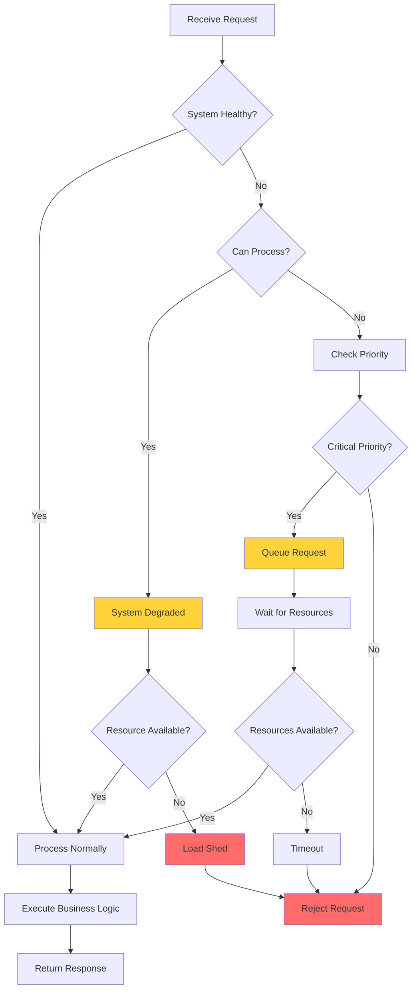

# Adverse Condition Handling Patterns

## Overview

Adverse condition handling patterns enable microservices to maintain operation during various challenging conditions including resource constraints, network issues, dependency failures, and load spikes. These patterns build upon health checks and self-healing mechanisms to create comprehensive resilience strategies.

While health checks detect problems and self-healing recovers from failures, adverse condition handling focuses on graceful degradation during degraded states. The goal is to maintain core functionality even when non-essential features are unavailable. This approach maximizes user experience under adverse conditions rather than failing completely.

Modern distributed systems must handle numerous adverse conditions: network partitions, service overload, resource exhaustion, cascading failures, and data inconsistencies. Effective systems implement multiple patterns to handle different conditions while maintaining service availability.

### Key Concepts

**Graceful Degradation:**
Graceful degradation involves reducing functionality to maintain core features during resource constraints or failures. Essential services continue while non-essential features are disabled. Users experience degraded but functional service rather than complete outage.

**Load Shedding:**
Load shedding protects systems from overload by rejecting excess requests. Rather than accepting all requests and degrading performance for everyone, load shedding maintains quality for accepted requests. This is essential for system survival during traffic spikes.

**Priority-Based Processing:**
Priority-based processing ensures critical requests complete even during resource constraints. Lower priority requests may queue or reject while critical operations proceed. This focus on essential operations maintains business continuity.

## Flow Chart



## Standard Example (Java)

### Maven Dependencies

```xml
<dependency>
    <groupId>org.springframework.boot</groupId>
    <artifactId>spring-boot-starter-web</artifactId>
    <version>3.2.0</version>
</dependency>
<dependency>
    <groupId>io.github.resilience4j</groupId>
    <artifactId>resilience4j-ratelimiter</artifactId>
    <version>2.2.0</version>
</dependency>
```

### Graceful Degradation Implementation

```java
import org.springframework.stereotype.Service;
import java.util.Map;
import java.util.concurrent.ConcurrentHashMap;
import java.util.concurrent.atomic.AtomicReference;
import java.util.function.Supplier;

@Service
public class GracefulDegradationService {

    private final Map<String, FeatureStatus> featureStatuses = new ConcurrentHashMap<>();
    private final AtomicReference<SystemState> systemState = 
        new AtomicReference<>(SystemState.NORMAL);
    
    private static final double DEGRADATION_THRESHOLD = 0.7;
    private static final int MAX_DEGRADED_FEATURES = 3;

    public enum SystemState {
        NORMAL,
        DEGRADED,
        CRITICAL
    }

    public enum FeatureStatus {
        ENABLED,
        DISABLED,
        DEGRADED
    }

    public GracefulDegradationService() {
        initializeFeatures();
    }

    private void initializeFeatures() {
        featureStatuses.put("advanced-search", FeatureStatus.ENABLED);
        featureStatuses.put("recommendations", FeatureStatus.ENABLED);
        featureStatuses.put("analytics", FeatureStatus.ENABLED);
        featureStatuses.put("notifications", FeatureStatus.ENABLED);
        featureStatuses.put("social-features", FeatureStatus.ENABLED);
    }

    public <T> T executeWithDegradation(
            String featureName,
            Supplier<T> primaryOperation,
            Supplier<T> degradedOperation,
            Supplier<T> fallbackOperation) {
        
        FeatureStatus status = featureStatuses.get(featureName);
        
        if (status == null || status == FeatureStatus.DISABLED) {
            return fallbackOperation.get();
        }
        
        if (systemState.get() == SystemState.CRITICAL && 
            status == FeatureStatus.DEGRADED) {
            return degradedOperation.get();
        }
        
        try {
            return primaryOperation.get();
        } catch (Exception e) {
            if (systemState.get() != SystemState.NORMAL) {
                return degradedOperation.get();
            }
            throw e;
        }
    }

    public void updateSystemHealth(boolean isHealthy, double healthScore) {
        if (!isHealthy) {
            handleSystemDegradation(healthScore);
        } else if (healthScore >= DEGRADATION_THRESHOLD) {
            handleSystemRecovery();
        }
    }

    private void handleSystemDegradation(double healthScore) {
        if (healthScore < 0.3) {
            systemState.set(SystemState.CRITICAL);
        } else {
            systemState.set(SystemState.DEGRADED);
        }
        
        disableNonEssentialFeatures();
    }

    private void disableNonEssentialFeatures() {
        featureStatuses.put("social-features", FeatureStatus.DISABLED);
        featureStatuses.put("analytics", FeatureStatus.DISABLED);
    }

    private void handleSystemRecovery() {
        systemState.set(SystemState.NORMAL);
        
        for (String feature : featureStatuses.keySet()) {
            featureStatuses.put(feature, FeatureStatus.ENABLED);
        }
    }

    public SystemState getSystemState() {
        return systemState.get();
    }

    public Map<String, FeatureStatus> getFeatureStatuses() {
        return new ConcurrentHashMap<>(featureStatuses);
    }
}
```

### Load Shedding Implementation

```java
import java.util.concurrent.*;
import java.util.concurrent.atomic.AtomicInteger;
import java.util.function.Supplier;

public class LoadSheddingService {

    private final ExecutorService executor;
    private final Semaphore requestSemaphore;
    private final AtomicInteger activeRequests = new AtomicInteger(0);
    private final AtomicInteger rejectedRequests = new AtomicInteger(0);
    private final AtomicInteger queuedRequests = new AtomicInteger(0);
    
    private volatile int maxConcurrentRequests;
    private volatile int queueSize;
    private volatile int queueTimeout;

    public LoadSheddingService(int maxConcurrentRequests, int queueSize) {
        this.maxConcurrentRequests = maxConcurrentRequests;
        this.queueSize = queueSize;
        this.queueTimeout = 5000;
        
        this.requestSemaphore = new Semaphore(maxConcurrentRequests);
        this.executor = Executors.newFixedThreadPool(maxConcurrentRequests / 4);
    }

    public <T> T executeWithLoadShedding(
            Supplier<T> operation,
            RequestPriority priority) throws RejectedExecutionException {
        
        if (activeRequests.get() >= maxConcurrentRequests) {
            // Try to queue based on priority
            if (priority == RequestPriority.CRITICAL) {
                return executeWithQueue(operation);
            }
            
            rejectedRequests.incrementAndGet();
            throw new RejectedExecutionException(
                "System under load, request rejected"
            );
        }
        
        boolean acquired = requestSemaphore.tryAcquire(
            queueTimeout, 
            TimeUnit.MILLISECONDS
        );
        
        if (!acquired) {
            rejectedRequests.incrementAndGet();
            throw new RejectedExecutionException(
                "Timeout waiting for capacity"
            );
        }
        
        try {
            activeRequests.incrementAndGet();
            return operation.get();
        } finally {
            activeRequests.decrementAndGet();
            requestSemaphore.release();
        }
    }

    private <T> T executeWithQueue(Supplier<T> operation) throws RejectedExecutionException {
        if (queuedRequests.get() >= queueSize) {
            rejectedRequests.incrementAndGet();
            throw new RejectedExecutionException(
                "Queue full, critical request rejected"
            );
        }
        
        queuedRequests.incrementAndGet();
        
        try {
            Future<T> future = executor.submit(operation);
            return future.get(queueTimeout, TimeUnit.MILLISECONDS);
        } catch (TimeoutException e) {
            throw new RejectedExecutionException(
                "Timeout in queue"
            );
        } catch (InterruptedException e) {
            Thread.currentThread().interrupt();
            throw new RejectedExecutionException(
                "Interrupted"
            );
        } catch (ExecutionException e) {
            throw new RejectedExecutionException(
                "Execution failed",
                e.getCause()
            );
        } finally {
            queuedRequests.decrementAndGet();
        }
    }

    public LoadSheddingMetrics getMetrics() {
        return new LoadSheddingMetrics(
            activeRequests.get(),
            rejectedRequests.get(),
            queuedRequests.get(),
            maxConcurrentRequests,
            queueSize
        );
    }

    public enum RequestPriority {
        CRITICAL,
        NORMAL,
        LOW
    }
}

class LoadSheddingMetrics {
    private final int activeRequests;
    private final int rejectedRequests;
    private final int queuedRequests;
    private final int maxCapacity;
    private final int queueCapacity;

    public LoadSheddingMetrics(
            int activeRequests,
            int rejectedRequests,
            int queuedRequests,
            int maxCapacity,
            int queueCapacity) {
        this.activeRequests = activeRequests;
        this.rejectedRequests = rejectedRequests;
        this.queuedRequests = queuedRequests;
        this.maxCapacity = maxCapacity;
        this.queueCapacity = queueCapacity;
    }
}
```

### Circuit Breaker with Fallback

```java
import io.github.resilience4j.circuitbreaker.CircuitBreaker;
import io.github.resilience4j.circuitbreaker.CircuitBreakerConfig;
import io.github.resilience4j.circuitbreaker.CircuitBreakerRegistry;
import java.time.Duration;
import java.util.function.Supplier;

public class AdverseConditionHandler {

    private final CircuitBreakerRegistry circuitBreakerRegistry;
    private final LoadSheddingService loadSheddingService;
    private final GracefulDegradationService degradationService;

    public AdverseConditionHandler() {
        CircuitBreakerConfig config = CircuitBreakerConfig.custom()
            .failureRateThreshold(50)
            .slowCallRateThreshold(80)
            .slowCallDurationThreshold(Duration.ofSeconds(2))
            .waitDurationInOpenState(Duration.ofSeconds(30))
            .permittedNumberOfCallsInHalfOpenState(3)
            .slidingWindowSize(10)
            .minimumNumberOfCalls(5)
            .build();
        
        this.circuitBreakerRegistry = CircuitBreakerRegistry.of(config);
        this.loadSheddingService = new LoadSheddingService(100, 20);
        this.degradationService = new GracefulDegradationService();
    }

    public <T> T executeProtected(
            String operationName,
            Supplier<T> operation,
            Supplier<T> fallback,
            RequestPriority priority) {
        
        try {
            loadSheddingService.executeWithLoadShedding(
                () -> executeWithCircuitBreaker(operationName, operation),
                priority
            );
        } catch (RejectedExecutionException e) {
            return fallback.get();
        } catch (Exception e) {
            return handleFailure(operationName, fallback, e);
        }
        
        return null;
    }

    private <T> T executeWithCircuitBreaker(
            String operationName, 
            Supplier<T> operation) {
        
        CircuitBreaker circuitBreaker = circuitBreakerRegistry.circuitBreaker(operationName);
        
        return CircuitBreaker.decorateSupplier(circuitBreaker, operation).get();
    }

    private <T> T handleFailure(
            String operationName,
            Supplier<T> fallback,
            Exception e) {
        
        CircuitBreaker circuitBreaker = circuitBreakerRegistry.circuitBreaker(operationName);
        
        if (circuitBreaker.getState() == CircuitBreaker.State.OPEN) {
            return fallback.get();
        }
        
        throw new RuntimeException("Operation failed", e);
    }
}
```

## Real-World Examples

### Netflix Adverse Condition Handling

Netflix implements comprehensive adverse condition handling through their Zuul edge service and internal load balancing. Services gracefully degrade when dependencies become unavailable.

```java
// Netflix Zuul Filters for Adverse Conditions
/*
zuul:
  ribbon-ismx:
    enabled: true
  host:
    max-total-connections: 200
    max-per-route-connections: 20
  ribbon:
    NFLoadBalancerRuleClassName: com.netflix.loadbalancer.AvailabilityFilteringRule
    NFLoadBalancerPingUrl: /health
*/
```

### Google Cloud Load Balancing

Google Cloud Load Balancing implements automatic load shedding and health-based routing to handle adverse conditions automatically.

```yaml
# Google Cloud Load Balancing Backend Service
apiVersion: compute.googleapis.com/v1
kind: BackendService
metadata:
  name: my-backend-service
spec:
  loadBalancingScheme: EXTERNAL
  healthChecks:
  - health-check
  backends:
  - group: instance-group
    balancingMode: UTILIZATION
    capacityScaler: 0.8
  connectionDraining:
    drainingTimeoutSec: 60
  maxStreamDuration:
    seconds: 3600
```

### AWS Load Shedding with API Gateway

AWS API Gateway provides built-in throttling and usage plan capabilities for load shedding at the API boundary.

```json
{
  "usage-plan": {
    "name": "standard-usage-plan",
    "apiStages": [
      {
        "apiId": "api123",
        "stage": "prod"
      }
    ],
    "quota": {
      "limit": 1000,
      "period": "DAY"
    },
    "throttle": {
      "burstLimit": 100,
      "rateLimit": 50
    }
  }
}
```

## Output Statement

Adverse condition handling patterns produce these outcomes:

- **Maintained Availability**: Essential services remain available during adverse conditions
- **Controlled Degradation**: Non-essential features are selectively disabled to preserve resources
- **Protected System**: Overload protection prevents system collapse
- **Priority Processing**: Critical operations complete regardless of system state
- **Graceful Failure**: Users receive meaningful error messages instead of failed responses

The output includes degraded service modes, rejected requests with appropriate errors, and queued requests with timeout handling.

## Best Practices

**1. Define Essential vs Non-Essential Features**
Clearly identify essential features required for core business function. Non-essential features can be disabled during adverse conditions without impacting primary user experience.

**2. Monitor System Health Continuously**
Implement comprehensive health monitoring to detect adverse conditions early. Use multiple signals: resource utilization, error rates, latency, and dependency health.

**3. Implement Graduated Responses**
Use graduated responses to adverse conditions. Start with minor degradation and escalate as conditions worsen.

**4. Test Adverse Condition Handling**
Regularly test adverse condition handling through chaos engineering. Verify graceful degradation and load shedding work as expected.

**5. Document Degradation Modes**
Document available degradation modes and their user impact. Update documentation when adding new features or modifying degradation behavior.

**6. Prioritize Request Processing**
Implement request prioritization to ensure critical operations complete. Use priority-aware queuing and load shedding.

**7. Set Appropriate Thresholds**
Configure degradation and load shedding thresholds based on system capacity and requirements. Avoid thresholds that are too aggressive or too permissive.

**8. Provide User Feedback**
Clearly communicate degraded states to users when possible. Provide estimated resolution times or alternative paths.