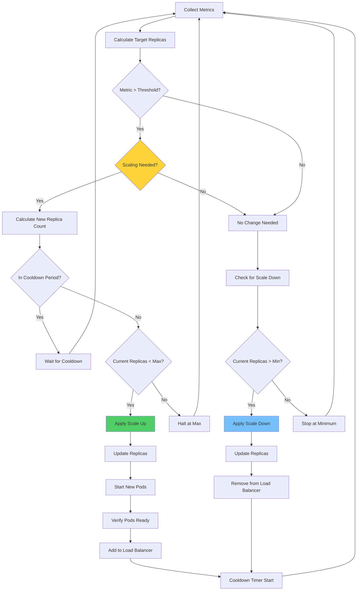

# Auto-Scaling Patterns

## Overview

Auto-scaling patterns enable microservices to automatically adjust capacity based on workload demands. These patterns ensure that applications have sufficient resources to handle traffic peaks while optimizing costs during low-usage periods. Modern auto-scaling operates at multiple dimensions: horizontal pod scaling, vertical resource scaling, and cluster scaling.

Effective auto-scaling combines multiple mechanisms: reactive scaling responds to current metrics, predictive scaling anticipates traffic patterns, and event-driven scaling responds to scheduled events. Together, these create comprehensive capacity management that meets demand while controlling costs.

Auto-scaling in microservices requires careful consideration of: scaling thresholds, cooldown periods, metric selection, and target metrics. Poorly configured auto-scaling can cause instability through thrashing or fail to respond to demand changes. This section covers patterns and implementations that create stable, responsive auto-scaling.

### Key Concepts

**Horizontal Pod Autoscaling (HPA):**
HPA adjusts the number of pod replicas based on observed metrics. Common metrics include CPU utilization, memory usage, and custom metrics. HPA is the most common auto-scaling pattern in Kubernetes environments.

**Vertical Pod Autoscaling (VPA):**
VPA adjusts resource requests and limits for individual pods. This optimizes resource allocation for applications whose requirements vary over time. VPA requires pod restart to apply changes.

**Cluster Autoscaling:**
Cluster autoscaling adjusts the number of nodes in the cluster based on pod requirements. This ensures sufficient cluster capacity while minimizing costs. Cluster autoscaler responds to unschedulable pods.

**Scaling Metrics:**
Common scaling metrics include: CPU utilization, memory usage, request rate, queue depth, and custom business metrics. Multi-metric scaling considers multiple signals for scaling decisions.

## Flow Chart



## Standard Example (Java)

### Maven Dependencies

```xml
<dependency>
    <groupId>org.springframework.boot</groupId>
    <artifactId>spring-boot-starter-actuator</artifactId>
    <version>3.2.0</version>
</dependency>
<dependency>
    <groupId>io.micrometer</groupId>
    <artifactId>micrometer-core</artifactId>
    <version>1.12.0</version>
</dependency>
```

### Custom Metrics for Auto-Scaling

```java
import io.micrometer.core.instrument.MeterRegistry;
import io.micrometer.core.instrument.Timer;
import io.micrometer.core.instrument.Counter;
import io.micrometer.core.instrument.Gauge;
import org.springframework.stereotype.Service;
import org.springframework.web.client.RestTemplate;
import java.util.concurrent.atomic.AtomicInteger;
import java.util.concurrent.atomic.AtomicLong;
import java.util.function.Supplier;

@Service
public class AutoscalingMetricsService {

    private final MeterRegistry meterRegistry;
    private final RestTemplate restTemplate;
    
    private final AtomicInteger activeConnections = new AtomicInteger(0);
    private final AtomicLong totalRequestLatency = new AtomicLong(0);
    private final Counter requestsCounter;
    private final Counter errorsCounter;
    private final Timer requestLatencyTimer;
    
    private volatile double currentCpuUsage = 0.0;
    private volatile double currentMemoryUsage = 0.0;

    public AutoscalingMetricsService(MeterRegistry meterRegistry) {
        this.meterRegistry = meterRegistry;
        this.restTemplate = new RestTemplate();
        
        this.requestsCounter = Counter.builder("requests.total")
            .description("Total requests")
            .register(meterRegistry);
        
        this.errorsCounter = Counter.builder("requests.errors")
            .description("Total errors")
            .register(meterRegistry);
        
        this.requestLatencyTimer = Timer.builder("request.latency")
            .description("Request latency")
            .register(meterRegistry);
        
        registerCustomMetrics();
    }

    private void registerCustomMetrics() {
        Gauge.builder("connections.active", activeConnections, 
            AtomicInteger::get)
            .description("Active connections")
            .register(meterRegistry);
        
        Gauge.builder("cpu.usage", () -> currentCpuUsage)
            .description("CPU usage percentage")
            .register(meterRegistry);
        
        Gauge.builder("memory.usage", () -> currentMemoryUsage)
            .description("Memory usage percentage")
            .register(meterRegistry);
    }

    public void recordRequest() {
        requestsCounter.increment();
    }

    public void recordError() {
        errorsCounter.increment();
    }

    public void recordLatency(long milliseconds) {
        requestLatencyTimer.record(milliseconds, 
            java.util.concurrent.TimeUnit.MILLISECONDS);
    }

    public void updateResourceMetrics() {
        Runtime runtime = Runtime.getRuntime();
        
        long totalMemory = runtime.totalMemory();
        long freeMemory = runtime.freeMemory();
        long usedMemory = totalMemory - freeMemory;
        
        currentMemoryUsage = (double) usedMemory / totalMemory * 100;
        
        // In production, use OSHI or similar for actual CPU usage
        currentCpuUsage = Math.min(100, Math.random() * 100);
    }

    public double getCurrentCpuUsage() {
        return currentCpuUsage;
    }

    public double getCurrentMemoryUsage() {
        return currentMemoryUsage;
    }

    public int getActiveConnections() {
        return activeConnections.get();
    }

    public void incrementConnections() {
        activeConnections.incrementAndGet();
    }

    public void decrementConnections() {
        activeConnections.decrementAndGet();
    }
}
```

### Auto-Scaling Controller

```java
import org.springframework.stereotype.Component;
import java.util.concurrent.*;
import java.util.concurrent.atomic.AtomicInteger;

@Component
public class AutoscalingController {

    private final AutoscalingMetricsService metricsService;
    private final KubernetesClient kubernetesClient;
    
    private final int minReplicas;
    private final int maxReplicas;
    private final double cpuTriggerThreshold;
    private final double memoryTriggerThreshold;
    private final int scaleUpStabilizationSeconds;
    private final int scaleDownStabilizationSeconds;
    
    private final AtomicInteger currentReplicas = new AtomicInteger(1);
    private volatile long lastScaleTime = 0;
    private final ExecutorService scheduler = Executors.newSingleThreadExecutor();

    public AutoscalingController(
            AutoscalingMetricsService metricsService,
            KubernetesClient kubernetesClient) {
        this.metricsService = metricsService;
        this.kubernetesClient = kubernetesClient;
        
        this.minReplicas = 1;
        this.maxReplicas = 10;
        this.cpuTriggerThreshold = 70.0;
        this.memoryTriggerThreshold = 80.0;
        this.scaleUpStabilizationSeconds = 60;
        this.scaleDownStabilizationSeconds = 300;
        
        startAutoscalingLoop();
    }

    private void startAutoscalingLoop() {
        scheduler.submit(() -> {
            while (!Thread.currentThread().isInterrupted()) {
                try {
                    metricsService.updateResourceMetrics();
                    evaluateScaling();
                    Thread.sleep(10000);
                } catch (InterruptedException e) {
                    Thread.currentThread().interrupt();
                    break;
                }
            }
        });
    }

    private void evaluateScaling() {
        double cpuUsage = metricsService.getCurrentCpuUsage();
        double memoryUsage = metricsService.getCurrentMemoryUsage();
        
        if (shouldScaleUp(cpuUsage, memoryUsage)) {
            handleScaleUp();
        } else if (shouldScaleDown(cpuUsage, memoryUsage)) {
            handleScaleDown();
        }
    }

    private boolean shouldScaleUp(double cpuUsage, double memoryUsage) {
        if (currentReplicas.get() >= maxReplicas) {
            return false;
        }
        
        if (cpuUsage > cpuTriggerThreshold || 
            memoryUsage > memoryTriggerThreshold) {
            return isInStabilizationPeriod(scaleUpStabilizationSeconds);
        }
        
        return false;
    }

    private boolean shouldScaleDown(double cpuUsage, double memoryUsage) {
        if (currentReplicas.get() <= minReplicas) {
            return false;
        }
        
        return cpuUsage < 30.0 && memoryUsage < 50.0 && 
            isInStabilizationPeriod(scaleDownStabilizationSeconds);
    }

    private boolean isInStabilizationPeriod(int stabilizationSeconds) {
        long elapsed = System.currentTimeMillis() - lastScaleTime;
        return elapsed > stabilizationSeconds * 1000;
    }

    private void handleScaleUp() {
        int current = currentReplicas.get();
        int target = Math.min(current + 1, maxReplicas);
        
        if (target != current) {
            scaleTo(target);
        }
    }

    private void handleScaleDown() {
        int current = currentReplicas.get();
        int target = Math.max(current - 1, minReplicas);
        
        if (target != current) {
            scaleTo(target);
        }
    }

    private void scaleTo(int targetReplicas) {
        try {
            currentReplicas.set(targetReplicas);
            lastScaleTime = System.currentTimeMillis();
            
            System.out.println("Scaling to " + targetReplicas + " replicas");
            
            // Apply scaling via Kubernetes API
            kubernetesClient.scaleDeployment(targetReplicas);
            
        } catch (Exception e) {
            System.err.println("Scaling failed: " + e.getMessage());
            currentReplicas.set(targetReplicas - 1);
        }
    }
}

class KubernetesClient {
    public void scaleDeployment(int replicas) throws Exception {
        System.out.println("Scaling to " + replicas + " replicas");
    }
}
```

### Multi-Metric Scaling Decision Engine

```java
import java.util.*;
import java.util.concurrent.ConcurrentHashMap;

public class MultiMetricScalingEngine {

    private final Map<String, ScalingMetric> metrics = new ConcurrentHashMap<>();
    private final List<ScalingPolicy> policies = new ArrayList<>();

    public MultiMetricScalingEngine() {
        initializeMetrics();
        initializePolicies();
    }

    private void initializeMetrics() {
        metrics.put("cpu", new ScalingMetric("cpu", 70.0, MetricDirection.HIGHER));
        metrics.put("memory", new ScalingMetric("memory", 80.0, MetricDirection.HIGHER));
        metrics.put("request_rate", new ScalingMetric("request_rate", 1000.0, MetricDirection.HIGHER));
        metrics.put("queue_depth", new ScalingMetric("queue_depth", 100.0, MetricDirection.HIGHER));
        metrics.put("latency", new ScalingMetric("latency", 500.0, MetricDirection.LOWER));
    }

    private void initializePolicies() {
        policies.add(new ScalingPolicy("cpu", "scale_up", 1));
        policies.add(new ScalingPolicy("cpu", "scale_down", -1));
        policies.add(new ScalingPolicy("memory", "scale_up", 1));
        policies.add(new ScalingPolicy("request_rate", "scale_up", 1));
        policies.add(new ScalingPolicy("latency", "scale_up", 2));
    }

    public ScalingDecision evaluate(Map<String, Double> currentMetrics) {
        List<ScalingAction> actions = new ArrayList<>();
        
        for (ScalingPolicy policy : policies) {
            ScalingMetric metric = metrics.get(policy.metricName);
            Double currentValue = currentMetrics.get(policy.metricName);
            
            if (currentValue == null || metric == null) {
                continue;
            }
            
            ScalingAction action = evaluatePolicy(policy, metric, currentValue);
            if (action != null) {
                actions.add(action);
            }
        }
        
        return aggregateActions(actions);
    }

    private ScalingAction evaluatePolicy(
            ScalingPolicy policy, 
            ScalingMetric metric, 
            double currentValue) {
        
        boolean thresholdBreached;
        
        if (metric.direction == MetricDirection.HIGHER) {
            thresholdBreached = currentValue > metric.threshold;
        } else {
            thresholdBreached = currentValue < metric.threshold;
        }
        
        if (!thresholdBreached) {
            return null;
        }
        
        int adjustment = policy.recommendation;
        
        if (adjustment > 0) {
            return new ScalingAction("scale_up", adjustment, 
                "Metric " + policy.metricName + " at " + currentValue);
        } else if (adjustment < 0) {
            return new ScalingAction("scale_down", -adjustment,
                "Metric " + policy.metricName + " at " + currentValue);
        }
        
        return null;
    }

    private ScalingDecision aggregateActions(List<ScalingAction> actions) {
        int totalScaleUp = 0;
        int totalScaleDown = 0;
        List<String> reasons = new ArrayList<>();
        
        for (ScalingAction action : actions) {
            if (action.type.equals("scale_up")) {
                totalScaleUp += action.replicas;
            } else {
                totalScaleDown += action.replicas;
            }
            reasons.add(action.reason);
        }
        
        int adjustment = totalScaleUp - totalScaleDown;
        
        if (adjustment > 0) {
            return new ScalingDecision("scale_up", adjustment, reasons);
        } else if (adjustment < 0) {
            return new ScalingDecision("scale_down", -adjustment, reasons);
        }
        
        return new ScalingDecision("none", 0, reasons);
    }
}

class ScalingMetric {
    String name;
    double threshold;
    MetricDirection direction;

    public ScalingMetric(String name, double threshold, MetricDirection direction) {
        this.name = name;
        this.threshold = threshold;
        this.direction = direction;
    }
}

enum MetricDirection {
    HIGHER, LOWER
}

class ScalingPolicy {
    String metricName;
    String policyType;
    int recommendation;

    public ScalingPolicy(String metricName, String policyType, int recommendation) {
        this.metricName = metricName;
        this.policyType = policyType;
        this.recommendation = recommendation;
    }
}

class ScalingAction {
    String type;
    int replicas;
    String reason;

    public ScalingAction(String type, int replicas, String reason) {
        this.type = type;
        this.replicas = replicas;
        this.reason = reason;
    }
}

class ScalingDecision {
    String type;
    int replicas;
    List<String> reasons;

    public ScalingDecision(String type, int replicas, List<String> reasons) {
        this.type = type;
        this.replicas = replicas;
        this.reasons = reasons;
    }
}
```

## Real-World Examples

### Kubernetes Horizontal Pod Autoscaler

The Kubernetes HPA automatically scales pods based on observed metrics. It supports custom metrics and external metrics for sophisticated scaling decisions.

```yaml
# Kubernetes HPA Configuration
apiVersion: autoscaling/v2
kind: HorizontalPodAutoscaler
metadata:
  name: microservice-hpa
spec:
  scaleTargetRef:
    apiVersion: apps/v1
    kind: Deployment
    name: microservice
  minReplicas: 2
  maxReplicas: 20
  metrics:
  - type: Resource
    resource:
      name: cpu
      target:
        type: Utilization
        averageUtilization: 70
  - type: Resource
    resource:
      name: memory
      target:
        type: Utilization
        averageUtilization: 80
  - type: Pods
    pods:
      metric:
        name: requests_per_second
      target:
        type: AverageValue
        averageValue: 1000
  behavior:
    scaleDown:
      stabilizationWindowSeconds: 300
      policies:
      - type: Percent
        value: 10
        periodSeconds: 60
    scaleUp:
      stabilizationWindowSeconds: 60
      policies:
      - type: Percent
        value: 100
        periodSeconds: 15
      - type: Pods
        value: 4
        periodSeconds: 15
      selectPolicy: Max
```

### AWS Application Auto Scaling

AWS provides auto-scaling for various services including ECS, EKS, and Lambda. This implementation uses target tracking policies.

```json
{
  "ScalingPolicy": {
    "TargetValue": 70.0,
    "PredefinedMetricSpecification": {
      "PredefinedMetricType": "ASGAverageCPUUtilization"
    },
    "ScaleOutCooldown": 60,
    "ScaleInCooldown": 300
  }
}
```

### Google Cloud Auto Scaling

Google Cloud Run and GKE provide automatic scaling based on concurrent requests, CPU, or memory utilization.

```yaml
# Google Cloud Run Configuration
apiVersion: serving.knative.dev/v1
kind: Service
metadata:
  name: my-service
spec:
  template:
    metadata:
      annotations:
        autoscaling.knative.dev/minScale: "2"
        autoscaling.knative.dev/maxScale: "20"
        autoscaling.knative.dev-target: "10"
        autoscaling.knative.dev-scaleWindow: "10s"
        autoscaling.knative.devpanicThreshold: "2"
    spec:
      containers:
      - image: gcr.io/my-project/my-service:latest
```

## Output Statement

Auto-scaling patterns produce these outcomes:

- **Automatic Capacity Adjustment**: Replicas adjust automatically based on demand
- **Cost Optimization**: Capacity scales down during low usage to reduce costs
- **Performance Maintenance**: Sufficient capacity maintains response times during peaks
- **Stability**: Appropriate stabilization prevents rapid oscillations
- **Metrics-Based Decisions**: Multi-metric scaling considers various signals

The output includes replica count changes, resource allocation updates, and cluster capacity adjustments.

## Best Practices

**1. Set Appropriate Min/Max Values**
Configure minimum replicas to handle base load and maximum replicas to prevent runaway costs. Use production traffic analysis to determine appropriate bounds.

**2. Use Multiple Metrics**
Consider multiple signals (CPU, memory, request rate, latency) for scaling decisions. Single-metric scaling can cause delayed or premature responses.

**3. Implement Stabilization Windows**
Use stabilization windows to prevent scaling thrashing. Allow time for metrics to stabilize before triggering additional scaling.

**4. Configure Scale-Down Carefully**
Enable scale-down carefully to reduce costs. Use conservative thresholds and long stabilization periods to prevent frequent scaling.

**5. Monitor Scaling Effectiveness**
Track scaling effectiveness and adjust thresholds based on observed behavior. Real production traffic provides best data for tuning.

**6. Test Auto-Scaling**
Regularly test auto-scaling through load testing. Verify that scaling responds appropriately and maintains performance.

**7. Handle Scaling Delays**
Account for scaling delays in design. Add artificial delays may be needed for downstream services to handle traffic increases.

**8. Set Alerts**
Configure alerts for scaling events and unusual behavior. Monitor auto-scaling to detect issues early.