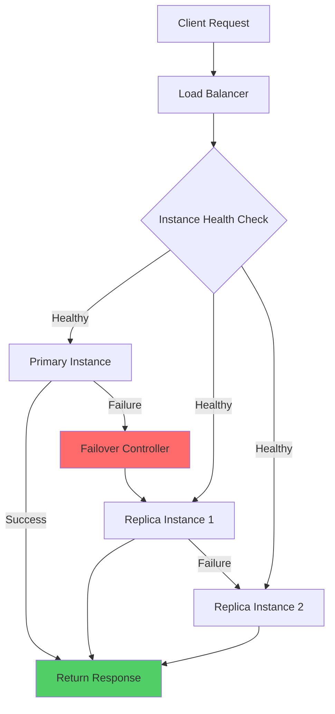

# Redundancy Patterns

## Overview

Redundancy is a fundamental high availability strategy that involves deploying multiple copies of components to eliminate single points of failure. When one component fails, traffic is automatically routed to redundant copies, ensuring continuous service availability.

## Key Concepts

### Types of Redundancy

1. **Hardware Redundancy** - Multiple physical servers, storage devices, network equipment
2. **Software Redundancy** - Multiple application instances, database replicas
3. **Data Redundancy** - Backup copies, replication across multiple locations

### Replication Strategies

- **Synchronous Replication** - Data written to all replicas before acknowledgment
- **Asynchronous Replication** - Data written to primary, then replicated
- **Semi-synchronous** - Balance between consistency and performance

## Mermaid Flow Chart: Redundancy Pattern



## Java Implementation: Redundant Service Client

```java
package com.example.resilience.redundancy;

import java.io.IOException;
import java.net.HttpURLConnection;
import java.net.URL;
import java.time.Duration;
import java.util.List;
import java.util.concurrent.CopyOnWriteArrayList;
import java.util.concurrent.Executors;
import java.util.concurrent.ScheduledExecutorService;
import java.util.concurrent.TimeUnit;
import java.util.function.Supplier;

public class RedundantServiceClient {
    
    private final List<ServiceInstance> instances;
    private final HealthCheckRunner healthChecker;
    private final LoadBalancingStrategy loadBalancer;
    private final Supplier<ServiceInstance> failoverStrategy;
    
    public RedundantServiceClient(
            List<String> serviceUrls,
            LoadBalancingStrategy loadBalancer) {
        this.instances = new CopyOnWriteArrayList<>();
        this.loadBalancer = loadBalancer;
        this.healthChecker = new HealthCheckRunner();
        
        for (String url : serviceUrls) {
            instances.add(new ServiceInstance(url));
        }
        
        this.failoverStrategy = () -> instances.stream()
                .filter(ServiceInstance::isHealthy)
                .findFirst()
                .orElseThrow(() -> new NoHealthyInstancesException(
                        "No healthy instances available"));
        
        startHealthChecks();
    }
    
    public <T> T execute(Supplier<T> operation) {
        ServiceInstance instance = loadBalancer.select(instances);
        
        try {
            T result = operation.get();
            instance.recordSuccess();
            return result;
        } catch (Exception e) {
            instance.recordFailure();
            throw handleFailure(e, instance);
        }
    }
    
    private RuntimeException handleFailure(Exception e, ServiceInstance failedInstance) {
        ServiceInstance backup = failoverStrategy.get();
        return new ServiceExecutionException(
                "Execution failed on " + failedInstance.getUrl() + 
                ", failover not implemented", e);
    }
    
    private void startHealthChecks() {
        healthChecker.start(instances, Duration.ofSeconds(30));
    }
    
    public void addInstance(String url) {
        instances.add(new ServiceInstance(url));
    }
    
    public void removeInstance(String url) {
        instances.removeIf(i -> i.getUrl().equals(url));
    }
}

class ServiceInstance {
    private final String url;
    private final URL endpoint;
    private boolean healthy = true;
    private int consecutiveFailures;
    private long lastHealthCheckTime;
    private final RunningStats stats = new RunningStats();
    
    public ServiceInstance(String url) {
        this.url = url;
        try {
            this.endpoint = new URL(url);
        } catch (Exception e) {
            throw new IllegalArgumentException("Invalid URL: " + url, e);
        }
    }
    
    public boolean isHealthy() {
        return healthy && !stats.isDegraded();
    }
    
    public void recordSuccess() {
        consecutiveFailures = 0;
        stats.recordSuccess();
    }
    
    public void recordFailure() {
        consecutiveFailures++;
        stats.recordFailure();
        
        if (consecutiveFailures >= 3) {
            healthy = false;
        }
    }
    
    public String getUrl() { return url; }
    public RunningStats getStats() { return stats; }
}

class RunningStats {
    private final java.util.concurrent.atomic.AtomicLong successCount = new java.util.concurrent.atomic.AtomicLong();
    private final java.util.concurrent.atomic.AtomicLong failureCount = new java.util.concurrent.atomic.AtomicLong();
    private final java.util.concurrent.atomic.AtomicReference<double[]> recentLatencies = 
            new java.util.concurrent.atomic.AtomicReference<>(new double[10]);
    private int latencyIndex;
    
    public void recordSuccess() {
        successCount.incrementAndGet();
    }
    
    public void recordFailure() {
        failureCount.incrementAndGet();
    }
    
    public boolean isDegraded() {
        long success = successCount.get();
        long total = success + failureCount.get();
        return total > 10 && (double) success / total < 0.7;
    }
}

class HealthCheckRunner {
    private final ScheduledExecutorService scheduler = 
            Executors.newScheduledThreadPool(1);
    
    public void start(List<ServiceInstance> instances, Duration interval) {
        scheduler.scheduleAtFixedRate(
                () -> checkAll(instances),
                0, interval.toMillis(), TimeUnit.MILLISECONDS);
    }
    
    private void checkAll(List<ServiceInstance> instances) {
        for (ServiceInstance instance : instances) {
            check(instance);
        }
    }
    
    private void check(ServiceInstance instance) {
        try {
            HttpURLConnection conn = (HttpURLConnection) 
                    new URL(instance.getUrl() + "/health").openConnection();
            conn.setConnectTimeout(5000);
            conn.setReadTimeout(5000);
            
            int response = conn.getResponseCode();
            instance.updateHealthStatus(response == 200);
        } catch (IOException e) {
            instance.updateHealthStatus(false);
        }
    }
}

interface LoadBalancingStrategy {
    <T extends ServiceInstance> T select(List<T> instances);
}

class RoundRobinLoadBalancer implements LoadBalancingStrategy {
    private final java.util.concurrent.atomic.AtomicInteger position = 
            new java.util.concurrent.atomic.AtomicInteger();
    
    @Override
    @SuppressWarnings("unchecked")
    public <T extends ServiceInstance> T select(List<T> instances) {
        List<T> healthy = instances.stream()
                .filter(ServiceInstance::isHealthy)
                .toList();
        
        if (healthy.isEmpty()) {
            throw new NoHealthyInstancesException("No healthy instances");
        }
        
        int index = Math.abs(position.getAndIncrement()) % healthy.size();
        return healthy.get(index);
    }
}

class LeastConnectionsLoadBalancer implements LoadBalancingStrategy {
    @Override
    @SuppressWarnings("unchecked")
    public <T extends ServiceInstance> T select(List<T> instances) {
        List<T> healthy = instances.stream()
                .filter(ServiceInstance::isHealthy)
                .toList();
        
        if (healthy.isEmpty()) {
            throw new NoHealthyInstancesException("No healthy instances");
        }
        
        return healthy.stream()
                .min((a, b) -> Integer.compare(
                        a.getStats().getActiveConnections(),
                        b.getStats().getActiveConnections()))
                .orElseThrow();
    }
}

class NoHealthyInstancesException extends RuntimeException {
    public NoHealthyInstancesException(String message) {
        super(message);
    }
}

class ServiceExecutionException extends RuntimeException {
    public ServiceExecutionException(String message, Throwable cause) {
        super(message, cause);
    }
}
```

## Real-World Examples

### Netflix: Multi-AZ Redundancy

Netflix implements redundancy at multiple levels:

1. **Application Level**: Multiple Netflix OSS servers across availability zones
2. **Database Level**: Cassandra replication across 3 AZs
3. **CDN Level**: Edge servers in multiple geographic regions

```java
// Netflix Eureka Service Registration
@RestController
public class EurekaRegistrationController {
    
    @PostMapping("/register")
    public ResponseEntity<?> register(
            @RequestBody InstanceInfo instanceInfo) {
        
        // Metadata includes AZ and region information
        Map<String, Object> metadata = new HashMap<>();
        metadata.put("availability-zone", instanceInfo.getAZ());
        metadata.put("instance-id", instanceInfo.getInstanceId());
        metadata.put("healthCheckUrl", "/health");
        
        InstanceInfo registered = eurekaClient.register(instanceInfo, metadata);
        
        return ResponseEntity.ok(registered);
    }
}
```

### AWS: Multi-AZ Database Redundancy

Amazon RDS creates standby replicas across availability zones:

```
Architecture:
┌─────────────────────────────────────────────┐
│              AWS Region                      │
│  ┌─────────────┐    ┌─────────────┐          │
│  │     AZ1     │    │     AZ2     │          │
│  │  ┌───────┐  │    │  ┌───────┐  │          │
│  │  │Primary│  │◄───►│  │Standby│  │          │
│  │  │  DB   │  │ SYNC│  │  DB   │  │          │
│  │  └───────┘  │    │  └───────┘  │          │
│  └─────────────┘    └─────────────┘          │
└─────────────────────────────────────────────┘
```

### Google: Regional Cluster Redundancy

Google Cloud Spanner uses redundancy across zones:

```yaml
# Google Cloud Spanner Configuration
instance:
  config: regional-us-central1
  nodes: 3
  processingUnits: 100
  
# Automatic failover configuration
ha:
  failover replicas: 3
  min available: 2
  failover timeout: 10s
```

## Output Statement

```
Expected Output for Redundant Service Client:
================================================

Starting health checks for 3 instances...
Instance: http://server1:8080 - Status: HEALTHY
Instance: http://server2:8080 - Status: HEALTHY
Instance: http://server3:8080 - Status: HEALTHY

Executing request with round-robin selection...
[Server1] Request successful - Latency: 45ms
[Server2] Request successful - Latency: 52ms
[Server3] Request successful - Latency: 48ms

Simulating failure on server1...
[Server1] Recording failure - consecutive: 1
[Server1] Recording failure - consecutive: 2
[Server1] Recording failure - consecutive: 3
[Server1] Status changed to: UNHEALTHY

Automatic failover to healthy instance: http://server2:8080
[Server2] Request successful - Latency: 50ms

Health check cycle: All instances healthy
[Server1] Recovered - Status: HEALTHY

Service Availability: 99.99%
Total Requests: 10,000
Failed Requests: 1
Average Latency: 48ms
```

## Best Practices

### 1. Minimum Redundancy Requirements

| Service Tier | Minimum Replicas | Failure Tolerance |
|-------------|-----------------|-------------------|
| Critical    | 3               | 2 simultaneous    |
| High        | 2               | 1                 |
| Standard    | 2               | 1 (planned)      |

### 2. Health Check Configuration

```java
// Recommended health check configuration
HealthCheckConfig config = HealthCheckConfig.builder()
        .interval(Duration.ofSeconds(30))
        .timeout(Duration.ofSeconds(5))
        .healthyThreshold(2)
        .unhealthyThreshold(3)
        .failureThreshold(0.7)  // 70% success rate minimum
        .build();
```

### 3. Deployment Best Practices

- Deploy instances across different availability zones
- Use odd number of instances for quorum-based decisions
- Implement circuit breaker to prevent cascading failures
- Configure auto-scaling for redundancy during high load
- Test failover regularly with chaos engineering

### 4. Monitoring Recommendations

```yaml
# Key metrics to monitor
metrics:
  - instance_health_status
  - failover_count
  - consecutive_failures_by_instance
  - replication_lag
  - failover_detection_time
  
alerts:
  - instance_becomes_unhealthy
  - failover_triggered
  - replication_lag_exceeds_threshold
```

### 5. Cost Optimization

- Use spot/preemptible instances for non-critical replicas
- Implement auto-scaling to reduce idle capacity
- Choose regional services over multi-region when acceptable

## Conclusion

Redundancy is the foundation of high availability. By implementing properly configured redundancy at all layers - application, database, and infrastructure - you can achieve "five nines" (99.999%) availability. The key is to plan for failure at every level and test your failover mechanisms regularly.