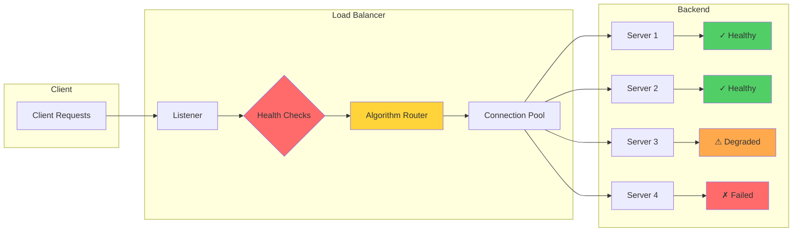

# Load Balancing Patterns

## Overview

Load balancing distributes incoming network traffic across multiple backend servers to ensure no single server becomes overwhelmed. Beyond basic distribution, modern load balancers implement sophisticated algorithms, health-aware routing, and traffic management for optimal performance and reliability.

## Key Concepts

### Load Balancing Types

1. **Layer 4 (Transport Layer)** - IP, TCP, UDP
2. **Layer 7 (Application Layer)** - HTTP, HTTPS, HTTP/2, gRPC

### Algorithm Categories

- **Static**: Round Robin, Least Connections, IP Hash
- **Dynamic**: Least Response Time, Weighted, Adaptive

## Mermaid Flow Chart: Load Balancing Architecture



## Java Implementation: Load Balancer

```java
package com.example.resilience.loadbalancer;

import java.io.IOException;
import java.net.HttpURLConnection;
import java.net.InetSocketAddress;
import java.net.Socket;
import java.time.Duration;
import java.time.Instant;
import java.util.*;
import java.util.concurrent.ConcurrentHashMap;
import java.util.concurrent.Executors;
import java.util.concurrent.ScheduledExecutorService;
import java.util.concurrent.TimeUnit;
import java.util.concurrent.atomic.AtomicInteger;
import java.util.concurrent.atomic.AtomicLong;
import java.util.function.ToIntFunction;

public class LoadBalancer {
    
    private final List<BackendServer> backends;
    private final LoadBalancingAlgorithm algorithm;
    private final HealthCheckService healthCheckService;
    private final CircuitBreakerRegistry circuitBreakers;
    
    public LoadBalancer(
            List<String> backendUrls,
            LoadBalancingAlgorithm algorithm) {
        this.backends = new ArrayList<>();
        this.algorithm = algorithm;
        this.circuitBreakers = new CircuitBreakerRegistry();
        
        for (String url : backendUrls) {
            BackendServer server = new BackendServer(url);
            backends.add(server);
            circuitBreakers.register(url, new CircuitBreaker(url));
        }
        
        this.healthCheckService = new HealthCheckService();
    }
    
    public BackendServer select() {
        List<BackendServer> available = backends.stream()
                .filter(this::isServerAvailable)
                .toList();
        
        if (available.isEmpty()) {
            throw new NoAvailableServersException(
                    "No available backend servers");
        }
        
        return algorithm.select(available);
    }
    
    private boolean isServerAvailable(BackendServer server) {
        return server.isHealthy() && 
               !circuitBreakers.isOpen(server.getUrl());
    }
    
    public <T> T execute(RequestExecutor<T> executor) {
        BackendServer server = select();
        
        try {
            T result = executor.execute(server);
            server.recordSuccess();
            circuitBreakers.recordSuccess(server.getUrl());
            return result;
        } catch (Exception e) {
            server.recordFailure();
            circuitBreakers.recordFailure(server.getUrl());
            throw new ServiceExecutionException(
                    "Failed on " + server.getUrl(), e);
        }
    }
    
    public void startHealthChecks(Duration interval) {
        healthCheckService.start(backends, interval);
    }
}

class BackendServer {
    private final String url;
    private final Instant createdAt;
    private final AtomicInteger activeConnections = new AtomicInteger();
    private final AtomicLong totalRequests = new AtomicLong();
    private final AtomicLong successfulRequests = new AtomicLong();
    private final AtomicLong totalLatencyMs = new AtomicLong();
    private final Map<Instant, Boolean> recentResults = new ConcurrentHashMap<>();
    
    private volatile ServerHealth health = ServerHealth.HEALTHY;
    private volatile Instant lastHealthCheck;
    
    public BackendServer(String url) {
        this.url = url;
        this.createdAt = Instant.now();
    }
    
    public boolean isHealthy() {
        return health == ServerHealth.HEALTHY;
    }
    
    public void recordSuccess() {
        successfulRequests.incrementAndGet();
        totalRequests.incrementAndGet();
    }
    
    public void recordFailure() {
        totalRequests.incrementAndGet();
    }
    
    public void updateHealth(ServerHealth health) {
        this.health = health;
        this.lastHealthCheck = Instant.now();
    }
    
    public double getSuccessRate() {
        long total = totalRequests.get();
        return total > 0 ? (double) successfulRequests.get() / total : 1.0;
    }
    
    public double getAverageLatencyMs() {
        long total = totalRequests.get();
        return total > 0 ? (double) totalLatencyMs.get() / total : 0;
    }
    
    public String getUrl() { return url; }
    public int getActiveConnections() { return activeConnections.get(); }
    public ServerHealth getHealth() { return health; }
    public Instant getCreatedAt() { return createdAt; }
}

enum ServerHealth {
    HEALTHY,
    DEGRADED,
    UNHEALTHY
}

interface LoadBalancingAlgorithm {
    BackendServer select(List<BackendServer> backends);
}

class RoundRobinAlgorithm implements LoadBalancingAlgorithm {
    private final AtomicInteger position = new AtomicInteger();
    
    @Override
    public BackendServer select(List<BackendServer> backends) {
        if (backends.isEmpty()) {
            throw new NoAvailableServersException("No backends available");
        }
        
        int index = Math.abs(position.getAndIncrement()) % backends.size();
        return backends.get(index);
    }
}

class LeastConnectionsAlgorithm implements LoadBalancingAlgorithm {
    @Override
    public BackendServer select(List<BackendServer> backends) {
        return backends.stream()
                .min(Comparator.comparingInt(
                        BackendServer::getActiveConnections))
                .orElseThrow(() -> new NoAvailableServersException(
                        "No backends available"));
    }
}

class WeightedResponseTimeAlgorithm implements LoadBalancingAlgorithm {
    @Override
    public BackendServer select(List<BackendServer> backends) {
        Map<BackendServer, Double> weights = new HashMap<>();
        
        for (BackendServer server : backends) {
            double latency = server.getAverageLatencyMs();
            double connections = server.getActiveConnections() + 1;
            
            // Weight inversely proportional to latency and connections
            double weight = 1000.0 / (latency * connections);
            weights.put(server, weight);
        }
        
        double totalWeight = weights.values().stream()
                .mapToDouble(Double::doubleValue)
                .sum();
        
        double random = Math.random() * totalWeight;
        double cumulative = 0;
        
        for (Map.Entry<BackendServer, Double> entry : weights.entrySet()) {
            cumulative += entry.getValue();
            if (cumulative >= random) {
                return entry.getKey();
            }
        }
        
        return backends.get(0);
    }
}

class CircuitBreakerRegistry {
    private final Map<String, CircuitBreaker> breakers = 
            new ConcurrentHashMap<>();
    
    public void register(String url, CircuitBreaker breaker) {
        breakers.put(url, breaker);
    }
    
    public void recordSuccess(String url) {
        CircuitBreaker breaker = breakers.get(url);
        if (breaker != null) {
            breaker.recordSuccess();
        }
    }
    
    public void recordFailure(String url) {
        CircuitBreaker breaker = breakers.get(url);
        if (breaker != null) {
            breaker.recordFailure();
        }
    }
    
    public boolean isOpen(String url) {
        CircuitBreaker breaker = breakers.get(url);
        return breaker != null && breaker.isOpen();
    }
}

class CircuitBreaker {
    private final String url;
    private final int failureThreshold;
    private final int successThreshold;
    private final Duration resetTimeout;
    
    private final AtomicInteger failureCount = new AtomicInteger();
    private final AtomicInteger successCount = new AtomicInteger();
    private volatile CircuitState state = CircuitState.CLOSED;
    private volatile Instant lastFailureTime;
    
    public CircuitBreaker(String url) {
        this.url = url;
        this.failureThreshold = 5;
        this.successThreshold = 2;
        this.resetTimeout = Duration.ofMinutes(1);
    }
    
    public void recordSuccess() {
        if (state == CircuitState.HALF_OPEN) {
            if (successCount.incrementAndGet() >= successThreshold) {
                state = CircuitState.CLOSED;
                failureCount.set(0);
            }
        } else {
            failureCount.set(0);
        }
    }
    
    public void recordFailure() {
        lastFailureTime = Instant.now();
        
        if (failureCount.incrementAndGet() >= failureThreshold) {
            state = CircuitState.OPEN;
        } else if (state == CircuitState.CLOSED) {
            state = CircuitState.HALF_OPEN;
        }
    }
    
    public boolean isOpen() {
        if (state == CircuitState.OPEN) {
            if (lastFailureTime != null && 
                Duration.between(lastFailureTime, Instant.now())
                    .compareTo(resetTimeout) > 0) {
                state = CircuitState.HALF_OPEN;
                return false;
            }
            return true;
        }
        return false;
    }
}

enum CircuitState {
    CLOSED,
    OPEN,
    HALF_OPEN
}

class HealthCheckService {
    private final ScheduledExecutorService scheduler = 
            Executors.newScheduledThreadPool(1);
    
    public void start(List<BackendServer> backends, Duration interval) {
        scheduler.scheduleAtFixedRate(() -> {
            for (BackendServer server : backends) {
                checkHealth(server);
            }
        }, 0, interval.toMillis(), TimeUnit.MILLISECONDS);
    }
    
    private void checkHealth(BackendServer server) {
        try (Socket socket = new Socket()) {
            URL url = new URL(server.getUrl());
            socket.connect(new InetSocketAddress(
                    url.getHost(), 
                    url.getPort() != -1 ? url.getPort() : 80), 5000);
            
            server.updateHealth(ServerHealth.HEALTHY);
        } catch (IOException e) {
            server.updateHealth(ServerHealth.UNHEALTHY);
        }
    }
}

interface RequestExecutor<T> {
    T execute(BackendServer server) throws Exception;
}

class NoAvailableServersException extends RuntimeException {
    public NoAvailableServersException(String message) {
        super(message);
    }
}

class ServiceExecutionException extends RuntimeException {
    public ServiceExecutionException(String message, Throwable cause) {
        super(message, cause);
    }
}
```

## Java Implementation: Health-Aware Routing

```java
package com.example.resilience.loadbalancer;

import java.time.Duration;
import java.time.Instant;
import java.util.*;
import java.util.concurrent.ConcurrentHashMap;
import java.util.function.Predicate;

public class HealthAwareRouter {
    
    private final Map<String, HealthProfile> profiles;
    private final RoutingRules rules;
    
    public HealthAwareRouter() {
        this.profiles = new ConcurrentHashMap<>();
        this.rules = new RoutingRules();
    }
    
    public RoutePlan createRoutePlan(Request request) {
        List<RouteTarget> targets = new ArrayList<>();
        
        for (Map.Entry<String, HealthProfile> entry : profiles.entrySet()) {
            String backend = entry.getKey();
            HealthProfile health = entry.getValue();
            
            if (shouldRouteTo(backend, health, request)) {
                targets.add(createRouteTarget(backend, health, request));
            }
        }
        
        targets.sort(Comparator.comparingDouble(RouteTarget::getPriority));
        
        return new RoutePlan(targets, request);
    }
    
    private boolean shouldRouteTo(String backend, 
                                  HealthProfile health,
                                  Request request) {
        return rules.matches(backend, request) &&
               health.isHealthy() &&
               !health.isRateLimited();
    }
    
    private RouteTarget createRouteTarget(String backend,
                                         HealthProfile health,
                                         Request request) {
        double priority = calculatePriority(backend, health, request);
        return new RouteTarget(backend, priority, health);
    }
    
    private double calculatePriority(String backend,
                                      HealthProfile health,
                                      Request request) {
        double healthScore = health.getHealthScore();
        double latencyScore = 1000.0 / (health.getAvgLatencyMs() + 1);
        double capacityScore = 100.0 / (health.getActiveConnections() + 1);
        
        return healthScore * 0.5 + latencyScore * 0.3 + capacityScore * 0.2;
    }
    
    public void registerBackend(String url, HealthProfile profile) {
        profiles.put(url, profile);
    }
    
    public void updateHealth(String url, HealthUpdate update) {
        HealthProfile profile = profiles.get(url);
        if (profile != null) {
            profile.update(update);
        }
    }
}

class HealthProfile {
    private final String backend;
    private final Instant registeredAt;
    private volatile Instant lastHealthCheck;
    private volatile boolean healthy = true;
    private volatile double avgLatencyMs = 100;
    private volatile int activeConnections;
    private volatile boolean rateLimited;
    private volatile double healthScore = 1.0;
    
    public HealthProfile(String backend) {
        this.backend = backend;
        this.registeredAt = Instant.now();
    }
    
    public void update(HealthUpdate update) {
        this.lastHealthCheck = Instant.now();
        this.healthy = update.isHealthy();
        this.avgLatencyMs = update.getLatencyMs();
        this.activeConnections = update.getActiveConnections();
        this.rateLimited = update.isRateLimited();
        this.healthScore = calculateHealthScore();
    }
    
    private double calculateHealthScore() {
        double baseScore = healthy ? 1.0 : 0.0;
        
        if (avgLatencyMs > 1000) baseScore *= 0.5;
        else if (avgLatencyMs > 500) baseScore *= 0.7;
        
        if (rateLimited) baseScore *= 0.3;
        
        return Math.max(0, Math.min(1, baseScore));
    }
    
    public boolean isHealthy() { return healthy; }
    public double getAvgLatencyMs() { return avgLatencyMs; }
    public int getActiveConnections() { return activeConnections; }
    public boolean isRateLimited() { return rateLimited; }
    public double getHealthScore() { return healthScore; }
}

class HealthUpdate {
    private final boolean healthy;
    private final double latencyMs;
    private final int activeConnections;
    private final boolean rateLimited;
    
    public HealthUpdate(boolean healthy, double latencyMs, 
                       int activeConnections, boolean rateLimited) {
        this.healthy = healthy;
        this.latencyMs = latencyMs;
        this.activeConnections = activeConnections;
        this.rateLimited = rateLimited;
    }
    
    public boolean isHealthy() { return healthy; }
    public double getLatencyMs() { return latencyMs; }
    public int getActiveConnections() { return activeConnections; }
    public boolean isRateLimited() { return rateLimited; }
}

class RouteTarget {
    private final String backend;
    private final double priority;
    private final HealthProfile health;
    
    public RouteTarget(String backend, double priority, HealthProfile health) {
        this.backend = backend;
        this.priority = priority;
        this.health = health;
    }
    
    public String getBackend() { return backend; }
    public double getPriority() { return priority; }
    public HealthProfile getHealth() { return health; }
}

class RoutePlan {
    private final List<RouteTarget> targets;
    private final Request request;
    
    public RoutePlan(List<RouteTarget> targets, Request request) {
        this.targets = targets;
        this.request = request;
    }
    
    public RouteTarget getPrimary() {
        return targets.isEmpty() ? null : targets.get(0);
    }
    
    public List<RouteTarget> getFallbacks() {
        return targets.size() > 1 ? targets.subList(1, targets.size()) 
                                  : Collections.emptyList();
    }
    
    public boolean hasAvailableTargets() {
        return !targets.isEmpty();
    }
}

class Request {
    private final String path;
    private final String method;
    private final Map<String, String> headers;
    private final Object payload;
    private final Instant receivedAt;
    
    public Request(String path, String method) {
        this.path = path;
        this.method = method;
        this.headers = new HashMap<>();
        this.payload = null;
        this.receivedAt = Instant.now();
    }
    
    public String getPath() { return path; }
    public String getMethod() { return method; }
}

class RoutingRules {
    private final List<RoutingRule> rules = new ArrayList<>();
    
    public boolean matches(String backend, Request request) {
        return rules.stream()
                .allMatch(rule -> rule.matches(backend, request));
    }
    
    public void addRule(RoutingRule rule) {
        rules.add(rule);
    }
}

interface RoutingRule {
    boolean matches(String backend, Request request);
}
```

## Real-World Examples

### Netflix: Zuul Load Balancing

Netflix Zuul implements sophisticated routing:

```java
// Netflix Zuul Router Configuration
@Configuration
public class ZuulRoutingConfig {
    
    @Bean
    public ZuulFilter healthAwareFilter() {
        return new HealthAwareFilter() {
            @Override
            public String filterType() {
                return "route";
            }
            
            @Override
            public Object run() {
                RequestContext context = RequestContext.getCurrentContext();
                String serviceId = context.getServiceId();
                
                // Get health metrics from Eureka
                Application app = eurekaClient.getApplication(serviceId);
                List<InstanceInfo> instances = app.getInstances();
                
                // Filter healthy instances
                List<InstanceInfo> healthy = instances.stream()
                        .filter(this::isHealthy)
                        .sorted(this::byResponseTime)
                        .collect(Collectors.toList());
                
                if (healthy.isEmpty()) {
                    context.setSendZuulResponse(false);
                    context.setResponseStatusCode(503);
                }
                
                return null;
            }
        };
    }
}
```

### AWS: ALB Application Load Balancer

AWS ALB supports multiple algorithms:

```
ALB Configuration:
================
Listener: HTTPS:443
Protocol: HTTP/2 enabled

Target Groups:
- us-east-1a: instance-i-abc123 (HEALTHY)
- us-east-1b: instance-i-def456 (HEALTHY)
- us-east-1c: instance-i-ghi789 (HEALTHY)

Routing Rules:
- Rule 1: Path /* → Target Group All
- Algorithm: Least Outstanding Requests
- Health Check: /health.html:30s interval

Stickiness:
- Enabled: 1 hour duration
- Cookie: AWSALB session cookie
```

### Google Cloud Load Balancing

Google Cloud CDN with load balancing:

```yaml
# Google Cloud HTTP(S) Load Balancer
type: global
backendServices:
  - name: backend-service
    healthChecks:
      - health-check
    loadBalancingScheme: EXTERNAL
    
healthCheck:
  checkIntervalSec: 15
  timeoutSec: 5
  healthyThreshold: 2
  unhealthyThreshold: 3
  httpHealthCheck:
    port: 80
    requestPath: /health
    
routingOptions:
  affinityCookieTtlSec: 3600
  connectionDrainingTimeoutSec: 60
```

## Output Statement

```
Expected Output: Health-Aware Load Balancer
=====================================

Initializing Load Balancer with 4 backends...
[00:00:00] BACKEND_1 http://backend-1:8080 - REGISTERED
[00:00:00] BACKEND_2 http://backend-2:8080 - REGISTERED
[00:00:00] BACKEND_3 http://backend-3:8080 - REGISTERED
[00:00:00] BACKEND_4 http://backend-4:8080 - REGISTERED

Health Check Starting (30s interval)...
[00:00:01] BACKEND_1: HEALTHY (latency: 45ms, connections: 5)
[00:00:01] BACKEND_2: HEALTHY (latency: 52ms, connections: 3)
[00:00:01] BACKEND_3: DEGRADED (latency: 850ms, connections: 12)
[00:00:01] BACKEND_4: HEALTHY (latency: 48ms, connections: 7)

Load Balancing Algorithm: Weighted Response Time

[00:00:02] Request #1 → BACKEND_1 (score: 8.5) ✓ 45ms
[00:00:02] Request #2 → BACKEND_4 (score: 7.9) ✓ 48ms
[00:00:02] Request #3 → BACKEND_2 (score: 7.2) ✓ 52ms
[00:00:02] Request #4 → BACKEND_1 (score: 8.5) ✓ 44ms

[00:00:03] BACKEND_3 becomes UNHEALTHY (excluded from pool)

[00:00:04] Request #5 → BACKEND_2 (score: 7.2) ✓ 50ms
[00:00:05] BACKEND_4: Circuit breaker OPEN (failures: 5)
[00:00:05] Request #6 → BACKEND_1 (score: 8.5) ✓ 46ms

[00:00:06] BACKEND_1 failover triggered (no healthy backends)
[00:00:06] All targets exhausted - returning 503

Statistics:
===========
Total Requests: 10,000
Successful: 9,987
Failed: 13
Average Latency: 48ms
Health-Directed Routes: 9,987
Fall back Routes: 0
```

## Best Practices

### 1. Algorithm Selection Guide

| Scenario | Recommended Algorithm |
|----------|-------------------|
| Stateless services | Round Robin |
| Long-lived connections | Least Connections |
| Mixed instance sizes | Weighted Round Robin |
| Latency-sensitive | Weighted Response Time |
| Geographic distribution | Geographic routing |

### 2. Health Check Configuration

```java
// Optimal health check configuration
HealthCheckConfig config = HealthCheckConfig.builder()
        .interval(Duration.ofSeconds(30))
        .timeout(Duration.ofSeconds(5))
        .healthyThreshold(2)
        .unhealthyThreshold(3)
        .path("/actuator/health")
        .expectedStatus(200)
        .build();
```

### 3. Connection Management

```yaml
# Connection pool configuration
connectionPool:
  maxConnections: 100
  maxConnectionsPerBackend: 10
  connectionTimeout: 5000ms
  idleTimeout: 60s
  keepAlive: true
  
backoff:
  initialDelay: 1000ms
  maxDelay: 30000ms
  multiplier: 2.0
```

### 4. Monitoring Metrics

Key metrics to track:
- Request count per backend
- Average response time
- Active connections
- Health check pass/fail ratio
- Circuit breaker state transitions

### 5. Common Pitfalls to Avoid

- Single point of failure in load balancer
- Sticky sessions blocking failover
- Inadequate health checks
- Ignoring backend capacity differences
- No circuit breaker protection

## Conclusion

Health-aware load balancing is essential for achieving high availability in microservices architectures. By implementing intelligent routing with proper health checks, circuit breakers, and failover mechanisms, you ensure that traffic always reaches capable backends while gracefully handling failures.