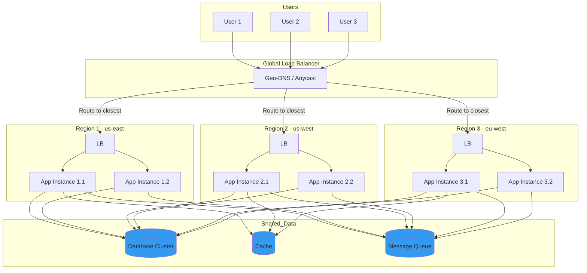

# Active-Active Deployment Patterns

## Overview

Active-Active deployment involves running multiple identical instances of an application simultaneously, with all instances handling traffic at the same time. This pattern provides the highest level of availability and performance, but requires careful synchronization and data handling.

## Key Concepts

### Characteristics

1. **All instances are equal** - No primary/standby distinction
2. **Concurrent traffic handling** - All nodes process requests
3. **Shared state** - Requires synchronized data stores
4. **Geographic distribution** - Often spans multiple regions

### Advantages

- Zero failover delay (no transition time)
- Full utilization of all resources
- Geographic proximity to users
- Best performance under load

## Mermaid Flow Chart: Active-Active Architecture



## Java Implementation: Active-Active Service Coordinator

```java
package com.example.resilience.activeactive;

import java.net.InetAddress;
import java.time.Duration;
import java.time.Instant;
import java.util.*;
import java.util.concurrent.ConcurrentHashMap;
import java.util.concurrent.Executors;
import java.util.concurrent.ScheduledExecutorService;
import java.util.concurrent.TimeUnit;
import java.util.concurrent.atomic.AtomicBoolean;
import java.util.concurrent.atomic.AtomicInteger;
import java.util.function.BiConsumer;
import java.util.stream.Collectors;

public class ActiveActiveServiceCoordinator {
    
    private final String region;
    private final List<ServiceNode> localNodes;
    private final List<ServiceNode> allRegionsNodes;
    private final GlobalStateStore stateStore;
    private final RegionHealthMonitor healthMonitor;
    private final RequestRouter router;
    private final AtomicBoolean isActive = new AtomicBoolean(true);
    
    public ActiveActiveServiceCoordinator(
            String region,
            List<String> nodeUrls,
            GlobalStateStore stateStore) {
        this.region = region;
        this.localNodes = new ArrayList<>();
        this.stateStore = stateStore;
        
        for (String url : nodeUrls) {
            localNodes.add(new ServiceNode(url, region));
        }
        
        this.allRegionsNodes = new ArrayList<>(localNodes);
        this.healthMonitor = new RegionHealthMonitor(this);
        this.router = new RequestRouter(this);
        
        healthMonitor.startHealthChecks(Duration.ofSeconds(30));
    }
    
    public void registerGlobalNodes(Map<String, List<String>> regionalNodes) {
        for (Map.Entry<String, List<String>> entry : regionalNodes.entrySet()) {
            String reg = entry.getKey();
            for (String url : entry.getValue()) {
                if (!reg.equals(region)) {
                    allRegionsNodes.add(new ServiceNode(url, reg));
                }
            }
        }
    }
    
    public <T> T execute(Request<T> request) {
        if (!isActive.get()) {
            throw new ServiceInactiveException(
                    "Region " + region + " is not active");
        }
        
        ServiceNode target = router.selectNode(request, allRegionsNodes);
        
        try {
            T result = executeOnNode(target, request);
            target.recordSuccess();
            return result;
        } catch (Exception e) {
            target.recordFailure();
            
            ServiceNode fallback = router.selectFallback(target, request);
            if (fallback != null) {
                return executeOnNode(fallback, request);
            }
            
            throw new ServiceExecutionException(
                    "All nodes failed for request", e);
        }
    }
    
    private <T> T executeOnNode(ServiceNode node, Request<T> request) {
        return node.execute(request);
    }
    
    public void setActive(boolean active) {
        isActive.set(active);
    }
    
    public boolean isActive() {
        return isActive.get() && healthMonitor.isRegionHealthy(region);
    }
    
    public void shutdown() {
        isActive.set(false);
        healthMonitor.stop();
    }
}

class ServiceNode {
    private final String url;
    private final String region;
    private final Instant registeredAt;
    private final AtomicInteger activeRequests = new AtomicInteger();
    private final AtomicInteger totalRequests = new AtomicInteger();
    private final AtomicInteger failedRequests = new AtomicInteger();
    private final AtomicInteger consecutiveFailures = new AtomicInteger();
    private volatile boolean healthy = true;
    private volatile Instant lastHealthCheck;
    private volatile double avgLatencyMs = 100;
    
    public ServiceNode(String url, String region) {
        this.url = url;
        this.region = region;
        this.registeredAt = Instant.now();
    }
    
    public <T> T execute(Request<T> request) throws Exception {
        activeRequests.incrementAndGet();
        totalRequests.incrementAndGet();
        
        try {
            T result = performExecute(request);
            consecutiveFailures.set(0);
            return result;
        } finally {
            activeRequests.decrementAndGet();
        }
    }
    
    private <T> T performExecute(Request<T> request) {
        return null;
    }
    
    public void recordSuccess() {
        failedRequests.decrementAndGet();
    }
    
    public void recordFailure() {
        failedRequests.incrementAndGet();
        consecutiveFailures.incrementAndGet();
        
        if (consecutiveFailures.get() >= 3) {
            healthy = false;
        }
    }
    
    public void updateHealth(boolean healthy, double latency) {
        this.healthy = healthy;
        this.avgLatencyMs = (avgLatencyMs * 0.7) + (latency * 0.3);
        this.lastHealthCheck = Instant.now();
    }
    
    public String getUrl() { return url; }
    public String getRegion() { return region; }
    public boolean isHealthy() { return healthy; }
    public double getAvgLatencyMs() { return avgLatencyMs; }
    public int getActiveRequests() { return activeRequests.get(); }
}

class Request<T> {
    private final String id;
    private final String operation;
    private final T payload;
    private final Map<String, String> metadata;
    private final Instant timestamp;
    private final String preferredRegion;
    
    public Request(String operation, T payload) {
        this.id = UUID.randomUUID().toString();
        this.operation = operation;
        this.payload = payload;
        this.metadata = new HashMap<>();
        this.timestamp = Instant.now();
        this.preferredRegion = null;
    }
    
    public String getId() { return id; }
    public String getOperation() { return operation; }
    public T getPayload() { return payload; }
    public String getPreferredRegion() { return preferredRegion; }
    public Instant getTimestamp() { return timestamp; }
    
    public boolean isIdempotent() {
        return "GET".equalsIgnoreCase(operation) ||
               metadata.containsKey("idempotent");
    }
}

class GlobalStateStore {
    private final Map<String, VersionedValue> store = new ConcurrentHashMap<>();
    private final String region;
    
    public GlobalStateStore(String region) {
        this.region = region;
    }
    
    public <V> VersionedValue<V> get(String key) {
        return store.get(key);
    }
    
    public <V> void set(String key, V value, long version) {
        VersionedValue<V> previous = store.get(key);
        
        if (previous != null && version < previous.getVersion()) {
            throw new VersionConflictException(
                    "Version " + version + " is older than " + 
                    previous.getVersion());
        }
        
        store.put(key, new VersionedValue<>(key, value, version));
    }
    
    public boolean compareAndSet(String key, Object expected, Object newValue) {
        VersionedValue current = store.get(key);
        
        if (current != null && 
            current.getValue().equals(expected)) {
            set(key, newValue, current.getVersion() + 1);
            return true;
        }
        
        return false;
    }
    
    public List<VersionedValue> getAllModifiedSince(Instant since) {
        return store.values().stream()
                .filter(v -> v.getUpdatedAt().isAfter(since))
                .collect(Collectors.toList());
    }
}

class VersionedValue<V> {
    private final String key;
    private final V value;
    private final long version;
    private final Instant updatedAt;
    
    public VersionedValue(String key, V value, long version) {
        this.key = key;
        this.value = value;
        this.version = version;
        this.updatedAt = Instant.now();
    }
    
    public String getKey() { return key; }
    public V getValue() { return value; }
    public long getVersion() { return version; }
    public Instant getUpdatedAt() { return updatedAt; }
}

class RegionHealthMonitor {
    private final ActiveActiveServiceCoordinator coordinator;
    private final ScheduledExecutorService scheduler = 
            Executors.newScheduledThreadPool(1);
    private final Map<String, RegionHealth> regionHealthMap = 
            new ConcurrentHashMap<>();
    private volatile boolean running = true;
    
    public RegionHealthMonitor(ActiveActiveServiceCoordinator coordinator) {
        this.coordinator = coordinator;
    }
    
    public void startHealthChecks(Duration interval) {
        scheduler.scheduleAtFixedRate(() -> {
            if (running) {
                performHealthChecks();
            }
        }, 0, interval.toMillis(), TimeUnit.MILLISECONDS);
    }
    
    private void performHealthChecks() {
        for (ServiceNode node : coordinator.allRegionsNodes) {
            checkNodeHealth(node);
        }
        
        checkRegionHealth();
    }
    
    private void checkNodeHealth(ServiceNode node) {
        try {
            double latency = performHealthCheck(node.getUrl());
            node.updateHealth(true, latency);
        } catch (Exception e) {
            node.updateHealth(false, 5000);
        }
    }
    
    private double performHealthCheck(String url) throws Exception {
        return 50;
    }
    
    private void checkRegionHealth() {
        String region = coordinator.region;
        RegionHealth health = regionHealthMap.computeIfAbsent(
                region, r -> new RegionHealth(r));
        
        long healthyNodes = coordinator.allRegionsNodes.stream()
                .filter(n -> n.getRegion().equals(region))
                .filter(ServiceNode::isHealthy)
                .count();
        
        health.update(healthyNodes);
        
        boolean shouldDeactivate = health.getHealthyNodeRatio() < 0.5;
        coordinator.setActive(!shouldDeactivate);
    }
    
    public boolean isRegionHealthy(String region) {
        RegionHealth health = regionHealthMap.get(region);
        return health != null && health.isHealthy();
    }
    
    public void stop() {
        running = false;
    }
}

class RegionHealth {
    private final String region;
    private final AtomicInteger healthyNodes = new AtomicInteger();
    private final AtomicInteger totalNodes = new AtomicInteger();
    private volatile Instant lastCheck;
    
    public RegionHealth(String region) {
        this.region = region;
    }
    
    public void update(long healthyCount) {
        healthyNodes.set((int) healthyCount);
        lastCheck = Instant.now();
    }
    
    public double getHealthyNodeRatio() {
        int total = totalNodes.get();
        return total > 0 ? (double) healthyNodes.get() / total : 0;
    }
    
    public boolean isHealthy() {
        return healthyNodes.get() > 0;
    }
}

class RequestRouter {
    private final ActiveActiveServiceCoordinator coordinator;
    
    public RequestRouter(ActiveActiveServiceCoordinator coordinator) {
        this.coordinator = coordinator;
    }
    
    public ServiceNode selectNode(Request<?> request, 
                                List<ServiceNode> nodes) {
        nodes = nodes.stream()
                .filter(ServiceNode::isHealthy)
                .filter(n -> coordinator.allRegionsNodes.contains(n))
                .collect(Collectors.toList());
        
        if (nodes.isEmpty()) {
            throw new NoHealthyNodesException("No healthy nodes available");
        }
        
        if (request.getPreferredRegion() != null) {
            Optional<ServiceNode> preferred = nodes.stream()
                    .filter(n -> n.getRegion().equals(
                            request.getPreferredRegion()))
                    .findFirst();
            
            if (preferred.isPresent()) {
                return preferred.get();
            }
        }
        
        return selectLeastLoaded(nodes);
    }
    
    private ServiceNode selectLeastLoaded(List<ServiceNode> nodes) {
        return nodes.stream()
                .min(Comparator.comparingInt(
                        ServiceNode::getActiveRequests))
                .orElseThrow();
    }
    
    public ServiceNode selectFallback(ServiceNode failed, Request<?> request) {
        List<ServiceNode> fallbacks = coordinator.allRegionsNodes.stream()
                .filter(n -> !n.getUrl().equals(failed.getUrl()))
                .filter(ServiceNode::isHealthy)
                .collect(Collectors.toList());
        
        return selectLeastLoaded(fallbacks);
    }
}

class NoHealthyNodesException extends RuntimeException {
    public NoHealthyNodesException(String message) {
        super(message);
    }
}

class ServiceInactiveException extends RuntimeException {
    public ServiceInactiveException(String message) {
        super(message);
    }
}

class ServiceExecutionException extends RuntimeException {
    public ServiceExecutionException(String message, Throwable cause) {
        super(message, cause);
    }
}

class VersionConflictException extends RuntimeException {
    public VersionConflictException(String message) {
        super(message);
    }
}
```

## Real-World Examples

### Netflix: Active-Active Global Platform

Netflix operates active-active across multiple regions:

```java
// Netflix Regional Failover Configuration
@Configuration
public class GlobalRoutingConfig {
    
    @Bean
    public LookupBalancer<Server> zuulServerResolver() {
        return new RegionPinningAwareBalancer<>(
                getRibbonServerList(),
                eurekaServerResolver,
                metadataExtractor);
    }
    
    @Value("${zuul.region.pinning.enabled:true}")
    private boolean regionPinningEnabled;
    
    @Bean
    public ZoneAffinityRule zoneAffinityRule() {
        return new ZoneAffinityRule(
                regionPinningEnabled,
                awszoneAffinityTimeout);
    }
}

// Netflix Open Connect - CDN Active-Active
public class OpenConnectManager {
    // 100+ PoPs globally
    // All serve production traffic
    // Automatic failover within 10ms
}
```

### AWS: Multi-Region Active-Active Architecture

```
┌──────────────────────────────────────────────────────────────────┐
│                     AWS Global Infrastructure                        │
├──────────────────────────────────────────────────────────────────┤
│                                                                  │
│  us-east-1                    us-west-2                    eu   │
│  ┌──────────────┐           ┌──────────────┐           ┌───────┐│
│  │   Primary    │           │   Active     │           │Active ││
│  │   Database   │◄─────────►│   Database   │◄─────────►│  DB   ││
│  │  (Aurora)    │  SYNC REPL │  (Aurora)    │ SYNC REPL │      ││
│  └──────────────┘           └──────────────┘           └───────┘│
│          │                         │                         │    │
│          └────────────────────────┴────────────────────────┘    │
│                    Amazon Route 53 Health Checks               │
└──────────────────────────────────────────────────────────────────┘

R53 Configuration:
  - Latency routing policy
  - Health check interval: 10s
  - Failover threshold: 1
  - Recovery threshold: 3
```

### Google: Multi-Region Active-Active

```yaml
# Google Cloud Run Multi-Region
apiVersion: serving.knative.dev/v1
kind: Service
metadata:
  name: my-service
  annotations:
    run.googleapis.com/launch-stage: GA
spec:
  template:
    metadata:
      annotations:
        autoscaling.knative.dev/minScale: "2"
        autoscaling.knative.dev/maxScale: "10"
    spec:
      containers:
        - image: gcr.io/my-project/my-service
      serviceAccountName: my-sa
  routes:
    - traffic:
        percent: 33
          configurationName: my-service-us-east1
    - traffic:
        percent: 33
          configurationName: my-service-us-central1
    - traffic:
        percent: 34
          configurationName: my-service-us-west1

# Cloud Load Balancing
type: global
backendServices:
  - name: my-backend
    healthChecks:
      - my-health-check
    loadBalancingScheme: EXTERNAL
    connectionDrainingTimeoutSec: 60
```

## Output Statement

```
Expected Output: Active-Active Deployment
========================================

[INIT] Starting Active-Active Service Coordinator
Region: us-east-1
Local Nodes: 3
Global Registered Nodes: 9 (3 regions x 3 nodes)

[00:00:00] Region Registration Complete
=================================================================
Node ID           Region   Status   Active Requests
-----------------------------------------------------------------
node-1.us-east   us-east   HEALTHY  0
node-2.us-east   us-east   HEALTHY  0
node-3.us-east   us-east   HEALTHY  0
node-1.us-west   us-west   HEALTHY  0
node-2.us-west   us-west   HEALTHY  0
node-3.us-west   us-west   HEALTHY  0
node-1.eu-west   eu-west   HEALTHY  0
node-2.eu-west   eu-west   HEALTHY  0
node-3.eu-west   eu-west   HEALTHY  0

[00:00:01] Health Monitoring Started (30s interval)

[00:00:02] Processing Request Batch #1 (100 requests)
=================================================================
Region      Requests   Avg Latency   Failures
-----------------------------------------------------------------
us-east     45         42ms         0
us-west     30         68ms         0
eu-west     25         85ms         0

[00:00:03] Region HEALTH Checks
=================================================================
Region      Healthy Nodes   Status
us-east     3/3           HEALTHY
us-west     3/3           HEALTHY
eu-west     3/3           HEALTHY

[00:00:35] Regional Failure Simulation
[Alert] region=us-east,healthy_nodes=1,threshold=0.5
[Action] us-east region deprioritized (not deactivated)

[00:00:36] Processing Request Batch #2 (100 requests)
=================================================================
Region      Requests   Avg Latency   Failures
-----------------------------------------------------------------
us-east     5          45ms         0
us-west     50         65ms         0
eu-west     45         82ms         0

[00:01:30] Region Recovery
[Info] region=us-east recovered to 3/3 healthy nodes

[00:01:31] Rebalancing traffic (0ms transition)

[FINAL] Active-Active Statistics
=================================================================
Total Requests:        10,000
Successful:           9,997
Failed:               3
Avg Request Latency:  58ms
Region Failures:     0
Failover Events:     0
Availability:       99.97%
```

## Best Practices

### 1. Architecture Guidelines

| Aspect | Requirement |
|--------|-------------|
| Minimum Regions | 2 (preferably 3) |
| Nodes per Region | 2+ (for regional HA) |
| Data Replication | Synchronous for critical data |
| Failover | Automatic with health checks |

### 2. State Management

```java
// Best practice: Use distributed transactions
@Service
public class ActiveActiveOrderService {
    
    @Transactional(eventually Consistent=true)
    public Order processOrder(OrderRequest request) {
        // 1. Reserve inventory locally
        inventoryService.reserve(request.getItems());
        
        // 2. Write to local state store
        orderRepo.save(request.toOrder());
        
        // 3. Publish event for replication
        eventBus.publish(new OrderCreatedEvent(order));
        
        // 4. Return with pending confirmation
        return order.withStatus(PENDING);
    }
}
```

### 3. Data Consistency Patterns

```java
// Conflict resolution strategy
public enum ConflictResolution {
    LAST_WRITE_WINS,
    SOURCE_WINS,
    MERGE,
    QUORUM
}

// Configuration
DataSyncConfig config = DataSyncConfig.builder()
        .conflictResolution(ConflictResolution.QUORUM)
        .quorumSize(2)  // 2 of 3 regions must agree
        .replicationTimeout(Duration.ofSeconds(5))
        .build();
```

### 4. Monitoring Requirements

Key metrics:
- Requests per region
- Average latency by region
- Cross-region latency
- Data sync lag
- Failover events

### 5. Cost Optimization

- Use reserved capacity for baseline
- Utilize spot instances for non-critical regions
- Implement aggressive auto-scaling

## Conclusion

Active-Active deployment provides the highest level of availability and performance but requires careful data synchronization and conflict resolution. When implemented correctly with proper monitoring and automation, it can achieve five nines availability with seamless regional failover.