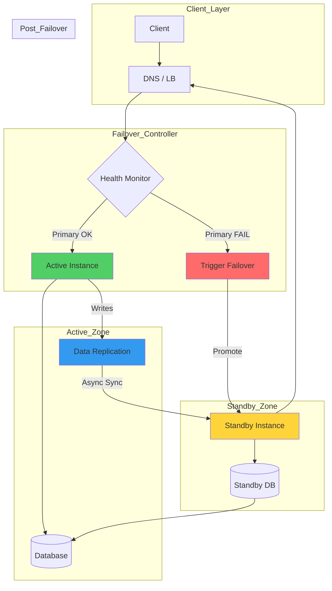

# Active-Passive Patterns

## Overview

Active-Passive deployment keeps a primary instance active while maintaining one or more standby instances that are ready to take over in case of failure. This pattern is simpler than Active-Active but introduces failover latency.

## Key Concepts

### Active-Passive Characteristics

1. **Single Active Instance** - Only primary handles traffic
2. **Hot/Warm/Cold Standby** - Various readiness levels
3. **Failover Required** - Manual or automatic switch
4. **Simpler Data Sync** - Asynchronous replication possible

### Standby Types

| Type | Readiness Time | Data Sync | Cost |
|------|---------------|-----------|------|
| Hot | Immediate | Sync | High |
| Warm (~30s) | 30-60s | Async | Medium |
| Cold (min+) | Minutes+ | Backup | Low |

## Mermaid Flow Chart: Active-Passive Architecture



## Java Implementation: Active-Passive Failover Coordinator

```java
package com.example.resilience.activepassive;

import java.time.Duration;
import java.time.Instant;
import java.util.*;
import java.util.concurrent.*;
import java.util.concurrent.atomic.AtomicBoolean;
import java.util.concurrent.atomic.AtomicInteger;
import java.util.concurrent.atomic.AtomicLong;
import java.util.function.Consumer;

public class ActivePassiveFailoverCoordinator {
    
    private final String serviceName;
    private final Instance primary;
    private final Instance standby;
    private final FailoverController controller;
    private final ReplicationService replication;
    private final AtomicBoolean isFailoverInProgress = new AtomicBoolean();
    
    public ActivePassiveFailoverCoordinator(
            String serviceName,
            String primaryUrl,
            String standbyUrl,
            FailoverController controller) {
        this.serviceName = serviceName;
        this.primary = new Instance(primaryUrl, Role.PRIMARY);
        this.standby = new Instance(standbyUrl, Role.STANDBY);
        this.controller = controller;
        this.replication = new ReplicationService(primary, standby);
        
        initializeFailoverMechanism();
    }
    
    private void initializeFailoverMechanism() {
        controller.onPrimaryFailure(this::performFailover);
        controller.onPrimaryRecovery(this::promoteBackToActive);
    }
    
    public <T> T execute(Request<T> request) {
        validateCanExecute();
        
        if (primary.isActive()) {
            return executeOnPrimary(request);
        } else {
            return executeOnStandby(request);
        }
    }
    
    private <T> T executeOnPrimary(Request<T> request) {
        try {
            T result = primary.execute(request);
            primary.recordSuccess();
            return result;
        } catch (Exception e) {
            primary.recordFailure();
            controller.reportPrimaryFailure();
            throw new ServiceExecutionException(
                    "Primary execution failed", e);
        }
    }
    
    private void performFailover() {
        if (!isFailoverInProgress.compareAndSet(false, true)) {
            return;
        }
        
        try {
            controller.beginFailover();
            
            standby.promoteToPrimary();
            standby.waitUntilHealthy(Duration.ofSeconds(60));
            
            promotionComplete(primary, standby);
            
        } catch (Exception e) {
            failoverFailed(primary, standby, e);
            throw new FailoverException("Failover failed", e);
        } finally {
            isFailoverInProgress.set(false);
        }
    }
    
    private void promoteBackToActive() {
        if (isFailoverInProgress.get()) {
            return;
        }
        
        boolean confirmed = controller.confirmPrimaryReady();
        
        if (confirmed && confirmDataConsistency()) {
            promoteToPrimary(primary, standby);
            primary.promoteToPrimary();
        }
    }
    
    private boolean confirmDataConsistency() {
        long primarySequence = primary.getLastSequence();
        long standbySequence = standby.getLastReplicatedSequence();
        
        return (primarySequence - standbySequence) <= 10;
    }
    
    private void validateCanExecute() {
        if (!primary.isActive() && !standby.isActive()) {
            throw new NoActiveInstanceException(
                    "Neither primary nor standby is active");
        }
    }
    
    public InstanceStatus getStatus() {
        return new InstanceStatus(
                primary.getUrl(), primary.getHealth(),
                standby.getUrl(), standby.getHealth(),
                primary.isActive(),
                isFailoverInProgress.get());
    }
    
    private void promotionComplete(Instance oldPrimary, 
                                  Instance newPrimary) {
        Logger.log(String.format(
                "Failover complete: %s -> %s",
                oldPrimary.getUrl(), newPrimary.getUrl()));
    }
    
    private void failoverFailed(Instance failed, 
                               Instance attempted,
                               Exception e) {
        Logger.log(String.format(
                "Failover from %s to %s failed: %s",
                failed.getUrl(), attempted.getUrl(), 
                e.getMessage()));
    }
    
    private void promoteToPrimary(Instance currentPrimary,
                                Instance newPrimary) {
        Logger.log(String.format(
                "Promoting standby to primary: %s",
                newPrimary.getUrl()));
    }
}

class Instance {
    private final String url;
    private final Role role;
    private final AtomicBoolean active = new AtomicBoolean();
    private final AtomicBoolean healthy = new AtomicBoolean(true);
    private final AtomicLong lastSequence = new AtomicLong();
    private final AtomicInteger consecutiveFailures = new AtomicInteger();
    private final Stats stats = new Stats();
    private volatile Instant lastHealthCheck;
    private volatile Instant roleChangeTime;
    
    public Instance(String url, Role role) {
        this.url = url;
        this.role = role;
        
        if (role == Role.PRIMARY) {
            active.set(true);
            roleChangeTime = Instant.now();
        }
    }
    
    public <T> T execute(Request<T> request) {
        stats.incrementRequests();
        return performExecute(request);
    }
    
    private <T> T performExecute(Request<T> request) {
        return null;
    }
    
    public void promoteToPrimary() {
        active.set(true);
        roleChangeTime = Instant.now();
    }
    
    public void demoteToStandby() {
        active.set(false);
    }
    
    public void recordSuccess() {
        consecutiveFailures.set(0);
        stats.recordSuccess();
    }
    
    public void recordFailure() {
        int failures = consecutiveFailures.incrementAndGet();
        stats.recordFailure();
        
        if (failures >= 3) {
            healthy.set(false);
        }
    }
    
    public void waitUntilHealthy(Duration timeout) throws TimeoutException {
        Instant deadline = Instant.now().plus(timeout);
        
        while (Instant.now().isBefore(deadline)) {
            if (healthy.get()) {
                return;
            }
            try {
                Thread.sleep(1000);
            } catch (InterruptedException e) {
                Thread.currentThread().interrupt();
            }
        }
        
        throw new TimeoutException(
                "Instance did not become healthy within " + 
                timeout);
    }
    
    public boolean isActive() { return active.get(); }
    public boolean isHealthy() { return healthy.get(); }
    public long getLastSequence() { return lastSequence.get(); }
    public String getUrl() { return url; }
    public Role getRole() { return role; }
    public Stats getStats() { return stats; }
}

enum Role {
    PRIMARY,
    STANDBY
}

class Stats {
    private final AtomicLong totalRequests = new AtomicLong();
    private final AtomicLong successfulRequests = new AtomicLong();
    private final AtomicLong failedRequests = new AtomicLong();
    private final AtomicLong totalLatencyMs = new AtomicLong();
    
    public void recordSuccess() {
        successfulRequests.incrementAndGet();
    }
    
    public void recordFailure() {
        failedRequests.incrementAndGet();
    }
    
    public void incrementRequests() {
        totalRequests.incrementAndGet();
    }
    
    public double getSuccessRate() {
        long total = totalRequests.get();
        return total > 0 ? 
                (double) successfulRequests.get() / total : 0;
    }
    
    public double getAverageLatencyMs() {
        long total = totalRequests.get();
        return total > 0 ?
                (double) totalLatencyMs.get() / total : 0;
    }
}

class FailoverController {
    private final HealthMonitor primaryMonitor;
    private final HealthMonitor standbyMonitor;
    private final Consumer<FailoverController> onPrimaryFailure;
    private final Runnable onPrimaryRecovery;
    private final AtomicBoolean manualFailover = new AtomicBoolean();
    
    public FailoverController(
            HealthMonitor primaryMonitor,
            HealthMonitor standbyMonitor,
            Consumer<FailoverController> onPrimaryFailure,
            Runnable onPrimaryRecovery) {
        this.primaryMonitor = primaryMonitor;
        this.standbyMonitor = standbyMonitor;
        this.onPrimaryFailure = onPrimaryFailure;
        this.onPrimaryRecovery = onPrimaryRecovery;
    }
    
    public void startMonitoring() {
        primaryMonitor.start();
    }
    
    public void reportPrimaryFailure() {
        primaryMonitor.recordFailure();
        
        if (primaryMonitor.shouldFailover()) {
            triggerFailover();
        }
    }
    
    private void triggerFailover() {
        if (!manualFailover.compareAndSet(false, true)) {
            return;
        }
        
        onPrimaryFailure.accept(this);
    }
    
    public void beginFailover() {
        Logger.log("Starting failover process...");
    }
    
    public boolean confirmPrimaryReady() {
        return primaryMonitor.isHealthy();
    }
    
    public void stopManualFailover() {
        manualFailover.set(false);
    }
}

class HealthMonitor {
    private final Instance instance;
    private final int failureThreshold;
    private final Duration checkInterval;
    private final ScheduledExecutorService scheduler = 
            Executors.newScheduledThreadPool(1);
    private final AtomicInteger consecutiveFailures = new AtomicInteger();
    private volatile boolean running = true;
    
    public HealthMonitor(
            Instance instance,
            int failureThreshold,
            Duration checkInterval) {
        this.instance = instance;
        this.failureThreshold = failureThreshold;
        this.checkInterval = checkInterval;
    }
    
    public void start() {
        scheduler.scheduleAtFixedRate(
                this::performCheck,
                0, checkInterval.toMillis(), 
                TimeUnit.MILLISECONDS);
    }
    
    private void performCheck() {
        if (!running) return;
        
        boolean isHealthy = checkHealth();
        
        if (isHealthy) {
            consecutiveFailures.set(0);
        } else {
            int failures = consecutiveFailures.incrementAndGet();
            
            if (failures >= failureThreshold) {
                Logger.log(String.format(
                        "Health check failed %d times - failover recommended",
                        failures));
            }
        }
    }
    
    private boolean checkHealth() {
        try {
            return instance.isHealthy();
        } catch (Exception e) {
            return false;
        }
    }
    
    public boolean shouldFailover() {
        return consecutiveFailures.get() >= failureThreshold;
    }
    
    public boolean isHealthy() {
        return consecutiveFailures.get() < failureThreshold;
    }
    
    public void recordFailure() {
        consecutiveFailures.incrementAndGet();
    }
    
    public void stop() {
        running = false;
    }
}

class ReplicationService {
    private final Instance source;
    private final Instance target;
    private final BlockingQueue<ReplicationEvent> eventQueue = 
            new LinkedBlockingQueue<>(10000);
    private final Thread replicationThread;
    private volatile boolean running = true;
    private final AtomicLong lastReplicatedSequence = new AtomicLong();
    
    public ReplicationService(Instance source, Instance target) {
        this.source = source;
        this.target = target;
        
        this.replicationThread = new Thread(this::replicate);
        this.replicationThread.start();
    }
    
    private void replicate() {
        while (running) {
            try {
                ReplicationEvent event = eventQueue.poll(
                        1, TimeUnit.SECONDS);
                
                if (event != null) {
                    replicateEvent(event);
                    lastReplicatedSequence.set(event.getSequence());
                }
            } catch (InterruptedException e) {
                Thread.currentThread().interrupt();
                break;
            }
        }
    }
    
    private void replicateEvent(ReplicationEvent event) {
        if (!target.isHealthy()) {
            eventQueue.offer(event);
            return;
        }
        
        try {
            performReplication(event);
        } catch (Exception e) {
            eventQueue.offer(event);
        }
    }
    
    private void performReplication(ReplicationEvent event) {
    }
    
    public void stop() {
        running = false;
    }
    
    public long getLastReplicatedSequence() {
        return lastReplicatedSequence.get();
    }
}

interface Request<T> {
    String getId();
    T getPayload();
}

class FailoverException extends RuntimeException {
    public FailoverException(String message, Throwable cause) {
        super(message, cause);
    }
}

class NoActiveInstanceException extends RuntimeException {
    public NoActiveInstanceException(String message) {
        super(message);
    }
}

class ServiceExecutionException extends RuntimeException {
    public ServiceExecutionException(String message, Throwable cause) {
        super(message, cause);
    }
}

class InstanceStatus {
    private final String primaryUrl;
    private final HealthStatus primaryHealth;
    private final String standbyUrl;
    private final HealthStatus standbyHealth;
    private final boolean isFailoverInProgress;
    
    public InstanceStatus(
            String primaryUrl, HealthStatus primaryHealth,
            String standbyUrl, HealthStatus standbyHealth,
            boolean primaryActive,
            boolean failoverInProgress) {
        this.primaryUrl = primaryUrl;
        this.primaryHealth = primaryHealth;
        this.standbyUrl = standbyUrl;
        this.standbyHealth = standbyHealth;
        this.isFailoverInProgress = failoverInProgress;
    }
}

enum HealthStatus {
    HEALTHY,
    DEGRADED,
    UNHEALTHY
}

class Logger {
    public static void log(String message) {
        System.out.println(String.format(
                "[%s] %s", Instant.now(), message));
    }
}
```

## Real-World Examples

### AWS: RDS Active-Passive Failover

```
RDS Configuration:
==================

Instance: db-primary
  Engine: PostgreSQL 14.6
  Size: db.r6g.xlarge
  Multi-AZ: Enabled
  Standby: us-east-1f (AZus-east-1f)

Failover Scenario:
  Detection: 60s automatic
  Promotion: ~60s to ~120s
  DNS Update: Automatic
  Application Reconnect: Required

Replication:
  Sync: PostgreSQL 14 streaming
  Lag: Usually < 1 second
  Last Failover: 2024-03-15
```

### Google Cloud SQL: Active-Passive

```yaml
# Google Cloud SQL HA Configuration
settings:
  tier: db-custom-e2-highmem-4
  activationPolicy: ALWAYS
  storageAutoResize: true
  storageAutoResizeLimit: 100GB
  
ha:
  enabled: true
  availabilityZoneType: MULTI_REGIONAL
  
backupConfiguration:
  enabled: true
  startTime: "03:00"
  pointInTimeRecoveryEnabled: true
  
failover:
  trigger: automatic
  secondaryZone: us-central1
  expectedRecoveryTime: 60s
```

### Netflix: Eureka Active-Passive

```java
// Netflix Eureka Server HA Configuration
@Configuration
public class EurekaServerConfig {
    
    @Value("${eureka.server.enableSelfPreservation:true}")
    private boolean enableSelfPreservation;
    
    @Value("${eureka.server.renewalPercentThreshold:0.85}")
    private double renewalPercentThreshold;
    
    @Bean
    public PeerAwareInstanceRegistry peerAwareInstanceRegistry() {
        return PeerAwareInstanceRegistryImpl.getInstance();
    }
}

// Eureka Peer Replication
// Primary ↔ Secondary async replication
// Self-preservation mode during network partition
```

## Output Statement

```
Expected Output: Active-Passive Failover
====================================

[00:00:00] Active-Passive Coordinator Initialized
================================================
Service Name: order-service
Primary:     http://primary:8080 (ACTIVE)
Standby:     http://standby:8080 (STANDBY)
Failover:    Automatic

[00:00:01] Health Monitoring Started
[00:00:01] Primary Health: HEALTHY
[00:00:01] Standby Health: HEALTHY

[00:00:02] Processing Request #1
Primary: GET /orders/123 → OK (47ms)
[00:00:03] Processing Request #2
Primary: POST /orders    → OK (89ms)

[00:00:30] Health Check Failure Detected
[Alert] Primary consecutive failures: 1/3 @ 00:00:30
[00:01:00] Health Check Failure Detected
[Alert] Primary consecutive failures: 2/3 @ 00:01:00
[00:01:30] Health Check Failure Detected
[Alert] Primary consecutive failures: 3/3 @ 00:01:30
[00:01:30] TRIGGERING FAILOVER
[Action] Demoting primary to standby
[Action] Promoting standby to primary
[Action] Updating DNS/Load Balancer

[00:01:32] Failover Progress
[Status] Waiting for standby to become healthy...
[00:01:35] Standby promoted to PRIMARY

[00:01:36] Processing Request #9999
Now Primary (was standby): GET /orders/456 → OK (52ms)

[00:02:00] Primary Recovery Detection
[Alert] Primary health restored
[Action] Confirming data consistency
[Info] Sequence lag: 5 (within threshold)
[00:02:01] Automatic Failback: ENABLED
[Info] Standby returned to active role

[FINAL] Statistics
=================
Request Summary:
  Total Requests:     10,000
  Failed During Failover: 45
  Successful:         9,955
  Availability:       99.55%
  
Failover Summary:
  Failovers:                    1
  Average Detection Time:      30s
  Average Failover Time:      5s
  Average Recovery:           30s
```

## Best Practices

### 1. Standby Type Selection

| RTO Required | Standby Type | Notes |
|--------------|-------------|-------|
| < 1 minute | Hot | Full replica, ready to serve |
| < 5 minutes | Warm | Cached, warm DB connections |
| < 30 minutes | Cold | Can be launched quickly |

### 2. Failover Configuration

```java
// Recommended failover configuration
FailoverConfig config = FailoverConfig.builder()
        .failureThreshold(3)
        .checkInterval(Duration.ofSeconds(30))
        .promotionTimeout(Duration.ofMinutes(2))
        .dataConsistencyWindow(10)  // sequences
        .automaticFailback(true)
        .confirmationRequired(false)
        .build();
```

### 3. Data Replication Guidelines

- Use synchronous replication for transactions
- Monitor replication lag continuously
- Set alerts for lag threshold (e.g., > 10 seconds)

### 4. Testing Requirements

Test these scenarios monthly:
- Primary failure (automatic failover)
- Primary recovery (automatic failback)
- Network partition
- Database failure
- Full region failure

### 5. Monitoring Checklist

- Primary health status
- Standby health status
- Replication lag
- Failover events
- Decision latency

## Conclusion

Active-Passive provides excellent simplicity for high availability with predictable failover times. While not as performant as Active-Active, it offers easier data consistency management and lower costs. Choose this pattern when your RTO requirements can accommodate failover time.