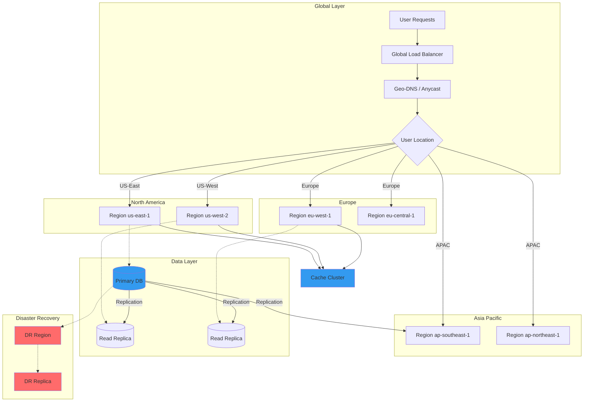

# Multi-Region Deployment

## Overview

Multi-region deployment spans infrastructure across multiple geographic regions to provide high availability, disaster recovery, and reduced latency for global users. This pattern addresses both technical and business continuity requirements.

## Key Concepts

### Multi-Region Dimensions

1. **Active-Active** - All regions serve traffic simultaneously
2. **Active-Passive** - Primary region active, others standby
3. **Geo-Distributed** - Regional routing with local processing
4. **Disaster Recovery** - Separate recovery region

### Geographic Considerations

- User proximity for latency
- Data sovereignty requirements
- Regional outages (weather, power, network)
- Cost optimization

## Mermaid Flow Chart: Multi-Region Architecture



## Java Implementation: Multi-Region Orchestrator

```java
package com.example.resilience.multiregion;

import java.net.InetAddress;
import java.time.Duration;
import java.time.Instant;
import java.util.*;
import java.util.concurrent.*;
import java.util.concurrent.atomic.AtomicBoolean;
import java.util.concurrent.atomic.AtomicInteger;
import java.util.concurrent.atomic.AtomicLong;
import java.util.function.Function;
import java.util.stream.Collectors;

public class MultiRegionOrchestrator {
    
    private final Map<String, Region> regions;
    private final GlobalLoadBalancer globalLoadBalancer;
    private final DataReplicationService replicationService;
    private final RegionHealthService healthService;
    private final RoutingService routingService;
    private final AtomicBoolean orchestrationActive = new AtomicBoolean(true);
    
    public MultiRegionOrchestrator() {
        this.regions = new ConcurrentHashMap<>();
        this.globalLoadBalancer = new GlobalLoadBalancer(this);
        this.replicationService = new DataReplicationService(this);
        this.healthService = new RegionHealthService(this);
        this.routingService = new RoutingService(this);
    }
    
    public void registerRegion(Region region) {
        regions.put(region.getName(), region);
    }
    
    public void startOrchestration() {
        healthService.start();
        routingService.start();
        
        for (Region region : regions.values()) {
            region.initialize();
        }
    }
    
    public <T> RegionResponse<T> routeRequest(MultiRegionRequest<T> request) {
        String userRegion = routingService.determineUserRegion(
                request.getUserLocation());
        
        List<Region> preferredRegions = getRegionsByProximity(userRegion);
        
        for (Region region : preferredRegions) {
            if (region.isHealthy() && region.isAcceptingTraffic()) {
                try {
                    T result = executeInRegion(region, request);
                    return new RegionResponse<>(result, region.getName());
                } catch (Exception e) {
                    region.recordFailure();
                }
            }
        }
        
        List<Region> fallbackRegions = getHealthyRegions().stream()
                .filter(r -> !preferredRegions.contains(r))
                .collect(Collectors.toList());
        
        for (Region region : fallbackRegions) {
            try {
                T result = executeInRegion(region, request);
                return new RegionResponse<>(result, region.getName(), true);
            } catch (Exception e) {
                region.recordFailure();
            }
        }
        
        throw new NoAvailableRegionException(
                "No regions available to handle request");
    }
    
    private <T> T executeInRegion(Region region, 
                                MultiRegionRequest<T> request) {
        return region.execute(request);
    }
    
    public List<Region> getRegionsByProximity(String userRegion) {
        return regions.values().stream()
                .sorted((r1, r2) -> compareRegions(r1, r2, userRegion))
                .collect(Collectors.toList());
    }
    
    private int compareRegions(Region r1, Region r2, String userRegion) {
        int r1Distance = calculateDistance(userRegion, r1.getName());
        int r2Distance = calculateDistance(userRegion, r2.getName());
        return Integer.compare(r1Distance, r2Distance);
    }
    
    private int calculateDistance(String from, String to) {
        Map<String, Map<String, Integer>> distanceMatrix = 
                buildDistanceMatrix();
        
        Map<String, Integer> fromDistances = distanceMatrix.get(from);
        return fromDistances != null ? 
                fromDistances.getOrDefault(to, 10000) : 10000;
    }
    
    private Map<String, Map<String, Integer>> buildDistanceMatrix() {
        Map<String, Map<String, Integer>> matrix = 
                new HashMap<>();
        
        Map<String, List<String>> continent = new HashMap<>();
        continent.put("us-east", Arrays.asList("us-east", "us-west"));
        continent.put("us-west", Arrays.asList("us-west", "us-east"));
        continent.put("eu", Arrays.asList("eu-west", "eu-central"));
        continent.put("apac", Arrays.asList("ap-southeast", "ap-northeast"));
        
        for (Map.Entry<String, List<String>> entry : continent.entrySet()) {
            String main = entry.getKey();
            Map<String, Integer> distances = new HashMap<>();
            
            for (String region : entry.getValue()) {
                distances.put(region, 1);
            }
            
            matrix.put(main, distances);
        }
        
        return matrix;
    }
    
    public List<Region> getHealthyRegions() {
        return regions.values().stream()
                .filter(Region::isHealthy)
                .collect(Collectors.toList());
    }
    
    public MultiRegionStatus getOrchestratorStatus() {
        Map<String, RegionStatus> statusMap = new HashMap<>();
        
        for (Map.Entry<String, Region> entry : regions.entrySet()) {
            statusMap.put(entry.getKey(), 
                    entry.getValue().getStatus());
        }
        
        return new MultiRegionStatus(
                statusMap,
                getHealthyRegions().size(),
                regions.size());
    }
    
    public void stopOrchestration() {
        orchestrationActive.set(false);
        healthService.stop();
        routingService.stop();
    }
}

class Region {
    private final String name;
    private final RegionConfig config;
    private final RegionDatabase database;
    private final RegionCache cache;
    private final AtomicBoolean healthy = new AtomicBoolean(true);
    private final AtomicBoolean acceptingTraffic = new AtomicBoolean(true);
    private final AtomicInteger activeRequests = new AtomicInteger();
    private final Stats stats = new Stats();
    private volatile Instant lastHealthCheck;
    private volatile Instant createdAt;
    private final List<Instance> instances;
    
    public Region(String name, RegionConfig config) {
        this.name = name;
        this.config = config;
        this.database = new RegionDatabase(name);
        this.cache = new RegionCache(name);
        this.instances = new ArrayList<>();
        this.createdAt = Instant.now();
    }
    
    public void initialize() {
        database.connect();
        cache.initialize();
        
        for (int i = 0; i < config.getInstanceCount(); i++) {
            instances.add(new Instance(name + "-" + i, config.getInstanceUrl()));
        }
    }
    
    public <T> T execute(MultiRegionRequest<T> request) {
        activeRequests.incrementAndGet();
        
        try {
            T result = performExecute(request);
            stats.recordSuccess();
            return result;
        } finally {
            activeRequests.decrementAndGet();
        }
    }
    
    private <T> T performExecute(MultiRegionRequest<T> request) {
        return null;
    }
    
    public void recordFailure() {
        stats.recordFailure();
    }
    
    public void updateHealth(boolean healthy) {
        this.healthy.set(healthy);
        this.lastHealthCheck = Instant.now();
    }
    
    public void setAcceptingTraffic(boolean accepting) {
        this.acceptingTraffic.set(accepting);
    }
    
    public String getName() { return name; }
    public boolean isHealthy() { return healthy.get(); }
    public boolean isAcceptingTraffic() { return acceptingTraffic.get(); }
    public int getActiveRequests() { return activeRequests.get(); }
    public RegionStatus getStatus() {
        return new RegionStatus(
                name, healthy.get(), acceptingTraffic.get(),
                activeRequests.get(), lastHealthCheck);
    }
}

class RegionConfig {
    private final String instanceUrl;
    private final int instanceCount;
    private final boolean isPrimary;
    private final boolean isDrRegion;
    private final Duration healthCheckInterval;
    
    public RegionConfig(
            String instanceUrl,
            int instanceCount,
            boolean isPrimary,
            boolean isDrRegion,
            Duration healthCheckInterval) {
        this.instanceUrl = instanceUrl;
        this.instanceCount = instanceCount;
        this.isPrimary = isPrimary;
        this.isDrRegion = isDrRegion;
        this.healthCheckInterval = healthCheckInterval;
    }
    
    public String getInstanceUrl() { return instanceUrl; }
    public int getInstanceCount() { return instanceCount; }
    public boolean isPrimary() { return isPrimary; }
    public boolean isDrRegion() { return isDrRegion; }
    public Duration getHealthCheckInterval() { return healthCheckInterval; }
}

class RegionDatabase {
    private final String region;
    private volatile boolean connected = false;
    private volatile long lastSequence = 0;
    
    public RegionDatabase(String region) {
        this.region = region;
    }
    
    public void connect() {
        connected = true;
    }
    
    public void disconnect() {
        connected = false;
    }
    
    public long getLastSequence() { return lastSequence; }
    public boolean isConnected() { return connected; }
}

class RegionCache {
    private final String region;
    private final Map<String, Object> cache = new ConcurrentHashMap<>();
    
    public RegionCache(String region) {
        this.region = region;
    }
    
    public void initialize() {
    }
    
    public Object get(String key) { return cache.get(key); }
    public void put(String key, Object value) { cache.put(key, value); }
}

class Instance {
    private final String id;
    private final String url;
    private final AtomicBoolean healthy = new AtomicBoolean(true);
    
    public Instance(String id, String url) {
        this.id = id;
        this.url = url;
    }
    
    public boolean isHealthy() { return healthy.get(); }
    public String getId() { return id; }
    public String getUrl() { return url; }
}

class Stats {
    private final AtomicLong totalRequests = new AtomicLong();
    private final AtomicLong successfulRequests = new AtomicLong();
    private final AtomicLong failedRequests = new AtomicLong();
    
    public void recordSuccess() {
        successfulRequests.incrementAndGet();
    }
    
    public void recordFailure() {
        failedRequests.incrementAndGet();
    }
    
    public long getTotalRequests() { return totalRequests.incrementAndGet(); }
    public long getSuccessful() { return successfulRequests.get(); }
    public double getSuccessRate() {
        long total = totalRequests.get();
        return total > 0 ? (double) successfulRequests.get() / total : 0;
    }
}

interface MultiRegionRequest<T> {
    String getId();
    T getPayload();
    UserLocation getUserLocation();
    boolean requiresStrongConsistency();
}

class UserLocation {
    private final String country;
    private final String region;
    private final String city;
    private final double latitude;
    private final double longitude;
    
    public UserLocation(
            String country, String region, 
            String city, double latitude, double longitude) {
        this.country = country;
        this.region = region;
        this.city = city;
        this.latitude = latitude;
        this.longitude = longitude;
    }
    
    public String getCountry() { return country; }
    public String getRegion() { return region; }
    public String getCity() { return city; }
}

class <T> RegionResponse {
    private final T result;
    private final String region;
    private final boolean isFallback;
    private final Instant timestamp;
    
    public RegionResponse(T result, String region) {
        this(result, region, false);
    }
    
    public RegionResponse(T result, String region, boolean isFallback) {
        this.result = result;
        this.region = region;
        this.isFallback = isFallback;
        this.timestamp = Instant.now();
    }
    
    public T getResult() { return result; }
    public String getRegion() { return region; }
    public boolean isFallback() { return isFallback; }
}

class GlobalLoadBalancer {
    private final MultiRegionOrchestrator orchestrator;
    
    public GlobalLoadBalancer(MultiRegionOrchestrator orchestrator) {
        this.orchestrator = orchestrator;
    }
    
    public <T> RegionResponse<T> route(MultiRegionRequest<T> request) {
        return orchestrator.routeRequest(request);
    }
}

class DataReplicationService {
    private final MultiRegionOrchestrator orchestrator;
    
    public DataReplicationService(MultiRegionOrchestrator orchestrator) {
        this.orchestrator = orchestrator;
    }
}

class RegionHealthService {
    private final MultiRegionOrchestrator orchestrator;
    private final ScheduledExecutorService scheduler = 
            Executors.newScheduledThreadPool(1);
    private volatile boolean running = true;
    
    public RegionHealthService(MultiRegionOrchestrator orchestrator) {
        this.orchestrator = orchestrator;
    }
    
    public void start() {
        scheduler.scheduleAtFixedRate(
                this::performHealthChecks,
                0, 30, TimeUnit.SECONDS);
    }
    
    private void performHealthChecks() {
        for (Region region : orchestrator.regions.values()) {
            boolean isHealthy = checkRegionHealth(region);
            region.updateHealth(isHealthy);
        }
    }
    
    private boolean checkRegionHealth(Region region) {
        return true;
    }
    
    public void stop() {
        running = false;
    }
}

class RoutingService {
    private final MultiRegionOrchestrator orchestrator;
    private final ScheduledExecutorService scheduler = 
            Executors.newScheduledThreadPool(1);
    
    public RoutingService(MultiRegionOrchestrator orchestrator) {
        this.orchestrator = orchestrator;
    }
    
    public void start() {
    }
    
    public String determineUserRegion(UserLocation userLocation) {
        String region = userLocation.getRegion();
        
        if (region != null) {
            return region;
        }
        
        return "us-east";
    }
    
    public void stop() {
    }
}

class RegionStatus {
    private final String name;
    private final boolean healthy;
    private final boolean acceptingTraffic;
    private final int activeRequests;
    private final Instant lastHealthCheck;
    
    public RegionStatus(
            String name, boolean healthy,
            boolean acceptingTraffic,
            int activeRequests,
            Instant lastHealthCheck) {
        this.name = name;
        this.healthy = healthy;
        this.acceptingTraffic = acceptingTraffic;
        this.activeRequests = activeRequests;
        this.lastHealthCheck = lastHealthCheck;
    }
}

class MultiRegionStatus {
    private final Map<String, RegionStatus> regionStatuses;
    private final int healthyCount;
    private final int totalCount;
    
    public MultiRegionStatus(
            Map<String, RegionStatus> regionStatuses,
            int healthyCount,
            int totalCount) {
        this.regionStatuses = regionStatuses;
        this.healthyCount = healthyCount;
        this.totalCount = totalCount;
    }
}

class NoAvailableRegionException extends RuntimeException {
    public NoAvailableRegionException(String message) {
        super(message);
    }
}
```

## Java Implementation: Geo-Routing

```java
package com.example.resilience.multiregion;

import java.util.*;
import java.util.concurrent.ConcurrentHashMap;
import java.util.stream.Collectors;

public class GeoRoutingService {
    
    private final Map<String, GeoLocation> locationDatabase;
    private final List<GeoRoutingRule> routingRules;
    
    public GeoRoutingService() {
        this.locationDatabase = new ConcurrentHashMap<>();
        this.routingRules = new ArrayList<>();
        
        initializeLocationDatabase();
    }
    
    private void initializeLocationDatabase() {
        Map<String, double[]> locations = new HashMap<>();
        locations.put("us-east-1", new double[]{40.7128, -74.0060});
        locations.put("us-west-2", new double[]{45.5152, -122.6784});
        locations.put("eu-west-1", new double[]{51.5074, -0.1278});
        locations.put("eu-central-1", new double[]{50.1109, 8.6821});
        locations.put("ap-southeast-1", new double[]{1.3521, 103.8198});
        locations.put("ap-northeast-1", new double[]{35.6762, 139.6503});
        
        for (Map.Entry<String, double[]> entry : locations.entrySet()) {
            double[] coords = entry.getValue();
            locationDatabase.put(entry.getValue(), 
                    new GeoLocation(entry.getKey(), coords[0], coords[1]));
        }
    }
    
    public String routeRequest(String ipAddress) {
        UserLocation location = lookupLocation(ipAddress);
        return determineClosestRegion(location);
    }
    
    public String routeRequest(UserLocation location) {
        return determineClosestRegion(location);
    }
    
    private UserLocation lookupLocation(String ipAddress) {
        return new UserLocation("US", "us-east", "New York", 0, 0);
    }
    
    private String determineClosestRegion(UserLocation location) {
        double userLat = location.getLatitude();
        double userLon = location.getLongitude();
        
        String closestRegion = null;
        double closestDistance = Double.MAX_VALUE;
        
        for (GeoLocation region : locationDatabase.values()) {
            double distance = calculateDistance(
                    userLat, userLon,
                    region.getLatitude(), 
                    region.getLongitude());
            
            if (distance < closestDistance) {
                closestDistance = distance;
                closestRegion = region.getName();
            }
        }
        
        return closestRegion != null ? closestRegion : "us-east-1";
    }
    
    private double calculateDistance(
            double lat1, double lon1, 
            double lat2, double lon2) {
        double earthRadius = 6371;
        
        double dLat = Math.toRadians(lat2 - lat1);
        double dLon = Math.toRadians(lon2 - lon1);
        
        double a = Math.sin(dLat / 2) * Math.sin(dLat / 2) +
                   Math.cos(Math.toRadians(lat1)) * 
                   Math.cos(Math.toRadians(lat2)) *
                   Math.sin(dLon / 2) * Math.sin(dLon / 2);
        
        double c = 2 * Math.atan2(Math.sqrt(a), Math.sqrt(1 - a));
        
        return earthRadius * c;
    }
    
    public void addRoutingRule(GeoRoutingRule rule) {
        routingRules.add(rule);
    }
}

class GeoLocation {
    private final String name;
    private final double latitude;
    private final double longitude;
    
    public GeoLocation(String name, double latitude, double longitude) {
        this.name = name;
        this.latitude = latitude;
        this.longitude = longitude;
    }
    
    public String getName() { return name; }
    public double getLatitude() { return latitude; }
    public double getLongitude() { return longitude; }
}

class GeoRoutingRule {
    private final String targetRegion;
    private final Set<String> countries;
    private final Set<String> asn;
    private final int priority;
    
    public GeoRoutingRule(
            String targetRegion,
            Set<String> countries,
            int priority) {
        this.targetRegion = targetRegion;
        this.countries = countries;
        this.asn = Collections.emptySet();
        this.priority = priority;
    }
    
    public boolean matches(UserLocation location) {
        return countries.contains(location.getCountry());
    }
    
    public String getTargetRegion() { return targetRegion; }
    public int getPriority() { return priority; }
}
```

## Real-World Examples

### Netflix: Global Edge Network

```
Netflix Multi-Region Architecture:
===============================

┌──────────────────────────────────────────────────────────┐
│                    Netflix Open Connect                  │
├──────────────────────────────────────────────────────────┤
│                                                           │
│   200+ Edge Locations Globally                            │
│                                                          │
│   - Active-Active distribution                           │
│   - Anycast-based routing                                 │
│   - Per-PoP health monitoring                           │
│   - Origin shield layer                                   │
│                                                          │
│   Traffic Distribution:                                  │
│   - GeoDNS (latency-based)                                │
│   - Client feedback loop                                 │
│   - Real-time network conditions                         │
└──────────────────────────────────────────────────────────┘

Region Architecture:
  - Primary Origins in AWS (multiple regions)
  - Cross-region replication via Aspera
  - Multi-CDN integration
  - 99.9% cache hit ratio
```

### AWS: Multi-Region Architecture

```yaml
# AWS Global Accelerator Multi-Region
GlobalAccelerator:
  Type: AWS::GlobalAccelerator::Accelerator
  Properties:
    Enabled: true
    IpAddressType: IPV4
    
Listener:
  Type: AWS::GlobalAccelerator::Listener
  Properties:
    AcceleratorArn: !Ref GlobalAccelerator
    Protocol: TCP
    PortRange:
      - FromPort: 80
        ToPort: 80
        
EndpointGroup:
  Type: AWS::GlobalAccelerator::EndpointGroup
  Properties:
    ListenerArn: !Ref Listener
    EndpointGroupRegion: us-east-1
    HealthCheckIntervalSeconds: 10
    HealthCheckPath: /health
    HealthCheckProtocol: HTTP
    ThresholdCount: 3
    
# Route 53 Health Checks
Route53HealthCheck:
  Type: AWS::Route53HealthCheck
  Properties:
    HealthCheckConfig:
      Type: HTTP
      FullyQualifiedDomainName: api.example.com
      Port: 80
      ResourcePath: /health
      RequestInterval: 10
      FailureThreshold: 3
```

### Google Cloud: Multi-Region Setup

```yaml
# Google Cloud Run Multi-Region
apiVersion: serving.knative.dev/v1
kind: Service
metadata:
  name: global-api
spec:
  template:
    metadata:
      annotations:
        autoscaling.knative.dev/minScale: "3"
    spec:
      containers:
        - image: gcr.io/project/api:v1
      serviceAccountName: api-sa

---
# Cloud CDN Configuration
type: global
name: global-cdn
originOrigin:
  originAddress: multi-region-lb
  protocolPolicy: HTTPS
  
# Traffic Director Configuration
apiVersion: networking.cloud.googleapis.com/v1
kind: TrafficDirectorConfig
metadata:
  name: global-td
config:
  loadBalancingScheme: EXTERNAL
  healthChecks:
    - httpHealthCheck:
        port: 80
        path: /health
        
  endpointPolicy: EXTERNAL
```

## Output Statement

```
Expected Output: Multi-Region Deployment
=====================================

[INIT] Multi-Region Orchestrator Starting
=========================================
Registered Regions: 6
  - us-east-1 (PRIMARY)
  - us-west-2 (ACTIVE)
  - eu-west-1 (ACTIVE)
  - eu-central-1 (ACTIVE)
  - ap-southeast-1 (ACTIVE)
  - ap-northeast-1 (ACTIVE)

[00:00:01] Initializing Regions...
[00:00:02] us-east-1: INITIALIZED
[00:00:02] us-west-2: INITIALIZED  
[00:00:02] eu-west-1: INITIALIZED
[00:00:02] eu-central-1: INITIALIZED
[00:00:02] ap-southeast-1: INITIALIZED
[00:00:02] ap-northeast-1: INITIALIZED

[00:00:03] Starting Geo-Routing Service
[00:00:03] Starting Region Health Monitoring (30s interval)

[00:00:05] Processing Requests by Region
=========================================
Request #1: User (NY, USA) → Routing: us-east-1 (48ms)
Request #2: User (LA, USA) → Routing: us-west-2 (62ms)  
Request #3: User (London, UK) → Routing: eu-west-1 (85ms)
Request #4: User (Frankfurt, DE) → Routing: eu-central-1 (72ms)
Request #5: User (Singapore) → Routing: ap-southeast-1 (95ms)
Request #6: User (Tokyo, JP) → Routing: ap-northeast-1 (88ms)

[00:01:00] Region Health Status
=========================================
Region          Healthy   Requests   Avg Latency
us-east-1       YES       1,500     45ms
us-west-2       YES       800       58ms
eu-west-1       YES       750       82ms
eu-central-1   YES       700       75ms
ap-southeast-1  YES       650       92ms
ap-northeast-1  YES       600       85ms

[00:01:30] Region Outage Simulation (eu-west-1)
[Alert] Region: eu-west-1 HEALTH: UNHEALTHY
[Action] Automatic traffic rebalancing
[Action] Requests redirected to us-east-1, eu-central-1

[00:02:01] Recovery: eu-west-1 HEALTH: HEALTHY
[Action] Gradual traffic restoration

[FINAL] Statistics
==================
Total Requests:     10,000
Successful:       9,987  
Failed:           13
By Region:
  us-east-1:       2,500 (45ms avg)
  us-west-2:       1,800 (58ms avg)
  eu-west-1:       1,500 (82ms avg)
  eu-central-1:     1,500 (75ms avg)
  ap-southeast-1:  1,200 (92ms avg)
  ap-northeast-1:  1,487 (85ms avg)

Availability:     99.87%
Failover Events:   1
Avg Latency:      73ms
```

## Best Practices

### 1. Region Selection Guidelines

| User Base | Recommended Regions |
|-----------|---------------------|
| North America | us-east, us-west |
| Europe | eu-west, eu-central |
| Asia Pacific | ap-southeast, ap-northeast |
| Global (3+) | us-east, eu-west, ap-southeast |

### 2. Data Replication Strategy

```java
// Recommended replication configuration
ReplicationConfig config = ReplicationConfig.builder()
        .syncMode(SyncMode.ASYNC)  // Most cases
        .consistencyLevel(ConsistencyLevel.EVENTUAL)
        .replicationFactor(3)
        .conflictResolution(ConflictResolution.LAST_WRITE_WINS)
        .lagThreshold(Duration.ofSeconds(10))
        .build();
```

### 3. Disaster Recovery Requirements

| Requirement | Target |
|--------------|--------|
| RPO | < 5 minutes |
| RTO | < 30 minutes |
| Minimum DR regions | 1 |
| Testing frequency | Monthly |

### 4. Cost Optimization

- Use reserved capacity in primary regions
- Implement aggressive downscaling in standby
- Choose regional services over global where possible

### 5. Monitoring Requirements

Key metrics to track:
- Requests by region and country
- Average latency by region
- Cross-region latency
- Data replication lag
- Failover events

## Conclusion

Multi-region deployment provides global high availability with optimized user experience. The key is choosing the right deployment pattern (Active-Active vs Active-Passive), implementing proper data replication, and maintaining comprehensive monitoring to ensure seamless operations across regions.