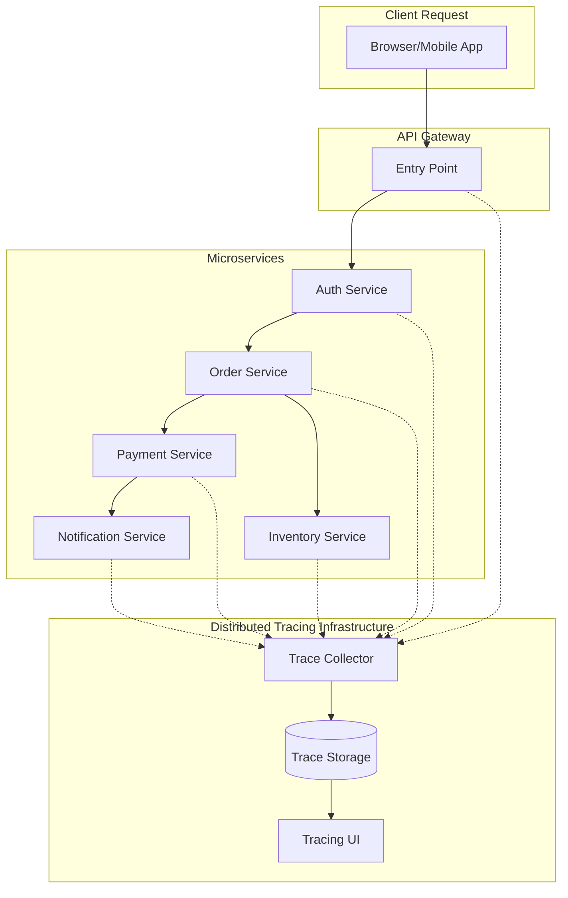
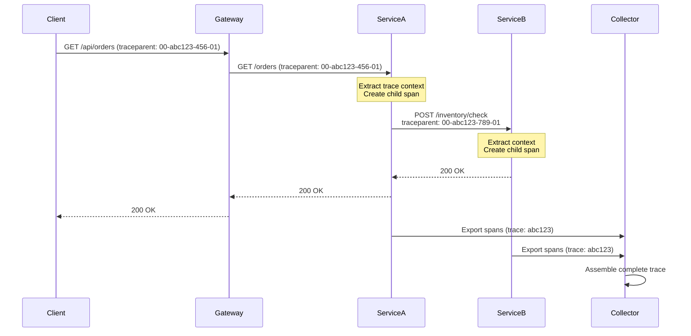

# Distributed Tracing Patterns

## Overview

Distributed tracing is an observability pattern that tracks requests as they flow through multiple microservices, enabling developers to understand the complete journey of a request across service boundaries. In a microservices architecture, a single user request may traverse dozens of services, making it critical to have visibility into each step of the journey.

Distributed tracing solves the fundamental challenge of understanding system behavior in distributed systems by assigning a unique identifier to each request and propagating this identifier through all service interactions. This allows teams to visualize the complete request path, identify performance bottlenecks, understand service dependencies, and diagnose failures across the entire system.

The core concept revolves around three main components: traces, which represent the end-to-end journey of a request; spans, which represent individual operations within that journey; and context propagation, which ensures the trace ID is passed between services. Together, these components provide a complete picture of how requests flow through your system.

## Understanding Trace Structure

A trace is a directed acyclic graph (DAG) of spans that represents the execution of a request across multiple services. Each span contains timing information, operation name, service name, and metadata about the specific operation. Spans have parent-child relationships that mirror the call graph of the distributed system.

The trace context includes a trace ID (a 128-bit identifier that remains constant throughout the request), a span ID (unique within the trace), and optionally a parent span ID. This contextual information must be propagated via HTTP headers, message headers, or other transport mechanisms to ensure continuity across service boundaries.

Modern distributed tracing systems follow the W3C Trace Context specification, which standardizes how trace information is passed between services. This standardization ensures interoperability between different tracing tools and allows traces to flow correctly across service boundaries, even when those services use different tracing implementations.

## Architecture and Components



The architecture consists of instrumentation within each service, a collector that aggregates trace data, storage backend, and a visualization interface. Each service must be instrumented to create spans and propagate context. The collector receives traces from all services, processes them, and stores them for analysis.

The instrumentation layer is responsible for creating spans at appropriate points in the code, typically around HTTP client calls, database operations, message queue interactions, and custom business logic. This instrumentation can be implemented through code changes, middleware, or auto-instrumentation libraries that modify behavior at runtime.

## Java Implementation

```java
import io.opentelemetry.api.OpenTelemetry;
import io.opentelemetry.api.trace.Tracer;
import io.opentelemetry.api.trace.Span;
import io.opentelemetry.api.trace.SpanKind;
import io.opentelemetry.context.Scope;
import io.opentelemetry.api.trace.StatusCode;
import io.opentelemetry.api.common.Attributes;
import io.opentelemetry.exporter.jaeger.JaegerGrpcSpanExporter;
import io.opentelemetry.sdk.OpenTelemetrySdk;
import io.opentelemetry.sdk.trace.SdkTracerProvider;
import io.opentelemetry.sdk.trace.export.BatchSpanProcessor;
import io.opentelemetry.sdk.resources.Resource;
import io.opentelemetry.semconv.ResourceAttributes;

public class DistributedTracingExample {
    
    private final Tracer tracer;
    private final OpenTelemetry openTelemetry;
    
    public DistributedTracingExample() {
        JaegerGrpcSpanExporter exporter = JaegerGrpcSpanExporter.builder()
            .setEndpoint("http://jaeger-collector:14250")
            .setTimeout(java.time.Duration.ofSeconds(10))
            .build();
        
        Resource serviceNameResource = Resource.getDefault()
            .merge(Resource.create(Attributes.of(
                ResourceAttributes.SERVICE_NAME, "order-service",
                ResourceAttributes.SERVICE_VERSION, "1.0.0"
            )));
        
        SdkTracerProvider tracerProvider = SdkTracerProvider.builder()
            .setResource(serviceNameResource)
            .addSpanProcessor(BatchSpanProcessor.builder(exporter)
                .setMaxExportBatchSize(512)
                .setScheduleDelayMillis(5000)
                .build())
            .build();
        
        this.openTelemetry = OpenTelemetrySdk.builder()
            .setTracerProvider(tracerProvider)
            .build();
        
        this.tracer = openTelemetry.getTracer("order-service", "1.0.0");
    }
    
    public void processOrder(String orderId, String userId) {
        Span span = tracer.spanBuilder("processOrder")
            .setSpanKind(SpanKind.SERVER)
            .setAttribute("order.id", orderId)
            .setAttribute("user.id", userId)
            .setAttribute("operation.type", "order_processing")
            .startSpan();
        
        try (Scope scope = span.makeCurrent()) {
            span.addEvent("Order processing started");
            
            validateOrder(orderId);
            checkInventory(orderId);
            processPayment(orderId, userId);
            sendNotification(userId, orderId);
            
            span.setAttribute("order.status", "completed");
            span.setStatus(StatusCode.OK);
            span.addEvent("Order processing completed");
            
        } catch (Exception e) {
            span.setStatus(StatusCode.ERROR, e.getMessage());
            span.recordException(e);
            throw e;
        } finally {
            span.end();
        }
    }
    
    private void validateOrder(String orderId) {
        Span span = tracer.spanBuilder("validateOrder")
            .setParent(Span.current())
            .setAttribute("order.id", orderId)
            .startSpan();
        
        try (Scope scope = span.makeCurrent()) {
            // Validation logic here
            Thread.sleep(100);
            span.setStatus(StatusCode.OK);
        } catch (Exception e) {
            span.setStatus(StatusCode.ERROR, e.getMessage());
            span.recordException(e);
        } finally {
            span.end();
        }
    }
    
    private void checkInventory(String orderId) {
        Span span = tracer.spanBuilder("checkInventory")
            .setParent(Span.current())
            .setAttribute("order.id", orderId)
            .setAttribute("inventory.check.type", "availability")
            .startSpan();
        
        try (Scope scope = span.makeCurrent()) {
            // Inventory check logic
            span.addEvent("Checking inventory availability");
            Thread.sleep(150);
            
            span.setAttribute("inventory.available", true);
            span.setStatus(StatusCode.OK);
        } catch (Exception e) {
            span.setStatus(StatusCode.ERROR, e.getMessage());
            span.recordException(e);
        } finally {
            span.end();
        }
    }
    
    private void processPayment(String orderId, String userId) {
        Span span = tracer.spanBuilder("processPayment")
            .setParent(Span.current())
            .setAttribute("order.id", orderId)
            .setAttribute("user.id", userId)
            .setAttribute("payment.method", "credit_card")
            .startSpan();
        
        try (Scope scope = span.makeCurrent()) {
            span.addEvent("Initiating payment processing");
            
            // Payment processing
            Thread.sleep(200);
            
            span.setAttribute("payment.transaction.id", "txn_" + orderId);
            span.setAttribute("payment.status", "success");
            span.setStatus(StatusCode.OK);
            
        } catch (Exception e) {
            span.setStatus(StatusCode.ERROR, e.getMessage());
            span.recordException(e);
        } finally {
            span.end();
        }
    }
    
    private void sendNotification(String userId, String orderId) {
        Span span = tracer.spanBuilder("sendNotification")
            .setParent(Span.current())
            .setAttribute("user.id", userId)
            .setAttribute("order.id", orderId)
            .setAttribute("notification.channel", "email")
            .startSpan();
        
        try (Scope scope = span.makeCurrent()) {
            // Notification logic
            span.addEvent("Sending order confirmation email");
            Thread.sleep(50);
            span.setStatus(StatusCode.OK);
        } catch (Exception e) {
            span.setStatus(StatusCode.ERROR, e.getMessage());
            span.recordException(e);
        } finally {
            span.end();
        }
    }
}
```

## Python Implementation

```python
from opentelemetry import trace
from opentelemetry.exporter.jaeger.thrift import JaegerExporter
from opentelemetry.sdk.trace import TracerProvider
from opentelemetry.sdk.trace.export import BatchSpanProcessor
from opentelemetry.sdk.resources import Resource, SERVICE_NAME
from opentelemetry.trace import SpanKind, Status, StatusCode
from opentelemetry.instrumentation.requests import RequestsInstrumentor
import requests
import time
import random

trace.set_tracer_provider(TracerProvider(
    resource=Resource({SERVICE_NAME: "order-service", "service.version": "1.0.0"})
))

jaeger_exporter = JaegerExporter(
    agent_host_name="jaeger-collector",
    agent_port=6831,
)

trace.get_tracer_provider().add_span_processor(
    BatchSpanProcessor(jaeger_exporter)
)

tracer = trace.get_tracer(__name__)

RequestsInstrumentor().instrument()

class OrderService:
    
    def __init__(self):
        self.tracer = trace.get_tracer("order-service")
    
    def process_order(self, order_id: str, user_id: str):
        with self.tracer.start_as_current_span(
            "processOrder",
            kind=SpanKind.SERVER,
            attributes={
                "order.id": order_id,
                "user.id": user_id,
                "operation.type": "order_processing"
            }
        ) as span:
            try:
                span.add_event("Order processing started")
                
                self.validate_order(order_id)
                self.check_inventory(order_id)
                self.process_payment(order_id, user_id)
                self.send_notification(user_id, order_id)
                
                span.set_attribute("order.status", "completed")
                span.set_status(Status(StatusCode.OK))
                span.add_event("Order processing completed")
                
            except Exception as e:
                span.set_status(Status(StatusCode.ERROR, str(e)))
                span.record_exception(e)
                raise
    
    def validate_order(self, order_id: str):
        with self.tracer.start_as_current_span(
            "validateOrder",
            attributes={"order.id": order_id}
        ) as span:
            try:
                time.sleep(0.1)
                span.set_status(Status(StatusCode.OK))
            except Exception as e:
                span.set_status(Status(StatusCode.ERROR, str(e)))
                span.record_exception(e)
                raise
    
    def check_inventory(self, order_id: str):
        with self.tracer.start_as_current_span(
            "checkInventory",
            attributes={
                "order.id": order_id,
                "inventory.check.type": "availability"
            }
        ) as span:
            try:
                span.add_event("Checking inventory availability")
                time.sleep(0.15)
                span.set_attribute("inventory.available", True)
                span.set_status(Status(StatusCode.OK))
            except Exception as e:
                span.set_status(Status(StatusCode.ERROR, str(e)))
                span.record_exception(e)
                raise
    
    def process_payment(self, order_id: str, user_id: str):
        with self.tracer.start_as_current_span(
            "processPayment",
            attributes={
                "order.id": order_id,
                "user.id": user_id,
                "payment.method": "credit_card"
            }
        ) as span:
            try:
                span.add_event("Initiating payment processing")
                time.sleep(0.2)
                
                span.set_attribute("payment.transaction.id", f"txn_{order_id}")
                span.set_attribute("payment.status", "success")
                span.set_status(Status(StatusCode.OK))
                
            except Exception as e:
                span.set_status(Status(StatusCode.ERROR, str(e)))
                span.record_exception(e)
                raise
    
    def send_notification(self, user_id: str, order_id: str):
        with self.tracer.start_as_current_span(
            "sendNotification",
            attributes={
                "user.id": user_id,
                "order.id": order_id,
                "notification.channel": "email"
            }
        ) as span:
            try:
                span.add_event("Sending order confirmation email")
                time.sleep(0.05)
                span.set_status(Status(StatusCode.OK))
            except Exception as e:
                span.set_status(Status(StatusCode.ERROR, str(e)))
                span.record_exception(e)
                raise


if __name__ == "__main__":
    service = OrderService()
    service.process_order("ORD-12345", "user-67890")
```

## Context Propagation



Context propagation is the mechanism that ensures trace information flows between services. When Service A calls Service B, it must extract the trace context from the incoming request, create a child span, and inject the updated context into the outgoing request to Service B. This process continues throughout the entire request chain.

The W3C Trace Context standard defines two HTTP headers: `traceparent` contains the trace ID, span ID, and trace flags; `tracestate` carries vendor-specific trace information. Services must both extract these headers from incoming requests and inject them into outgoing requests to maintain trace continuity.

## Real-World Examples

**Netflix** uses distributed tracing extensively across their microservices platform. Their internal tracing system, called Atlas, processes billions of spans daily and integrates with their runtime infrastructure to provide real-time visibility into system behavior. Netflix engineers can trace any request from the API gateway through all downstream services, identify performance regressions, and understand complex failure scenarios.

**Google** developed Dapper as their internal distributed tracing system, which became the foundation for modern tracing approaches. Dapper collects trace data from thousands of services and stores billions of traces, enabling Google to optimize service-to-service communication and identify performance issues across their global infrastructure.

**Datadog** provides distributed tracing as part of their APM solution, supporting automatic instrumentation for many popular frameworks and languages. Their trace view shows the complete request path with timing information for each span, making it easy to identify bottlenecks in distributed applications.

## Output Statement

After implementing distributed tracing, organizations can expect to achieve the following outcomes: mean time to detection (MTTD) for production issues reduced by 60-80%, as teams can quickly identify which service caused a failure; average investigation time decreased by 70%, as engineers no longer need to manually correlate logs across services; improved understanding of service dependencies and call patterns, enabling better architectural decisions; and proactive performance optimization by identifying slow services before they impact users.

Distributed tracing provides the foundation for observability in microservices architectures by making the invisible visible. Without distributed tracing, understanding the behavior of distributed systems is akin to trying to understand a complex machine while only being able to see individual components in isolation.

## Best Practices

1. **Use Consistent Trace Context Propagation**: Always propagate trace context through all service boundaries, including HTTP calls, message queues, and asynchronous processing. Incomplete context propagation breaks traces and prevents end-to-end visibility.

2. **Instrument at Appropriate Boundaries**: Create spans at service entry points, exit points to downstream services, database calls, and significant business operations. Avoid over-instrumentation that creates too many spans, which increases overhead and makes traces difficult to read.

3. **Add Meaningful Attributes**: Include relevant business context in spans, such as order IDs, user IDs, and operation types. This enables filtering and searching traces by business metrics, not just technical attributes.

4. **Set Appropriate Sampling Rates**: For high-throughput systems, implement sampling strategies that capture representative traces while reducing storage and processing costs. Tail-based sampling can ensure interesting traces (errors, slow requests) are always captured.

5. **Correlate with Logs and Metrics**: Link traces with application logs and metrics by including the trace ID in log statements and correlating spans with metric time series. This provides complete observability context when investigating issues.

6. **Monitor Tracing Overhead**: Track the performance impact of tracing instrumentation on your services. Target under 1% overhead for production environments, and adjust sampling or instrumentation detail if overhead becomes excessive.

7. **Establish Trace-Based SLIs**: Define Service Level Indicators based on trace data, such as end-to-end latency percentiles, error rates by service, and dependency health. Use these SLIs to set meaningful SLOs and alert thresholds.

8. **Document Trace Naming Conventions**: Establish consistent naming conventions for spans across all services. This makes traces readable and enables automated analysis and dashboarding based on span names.
