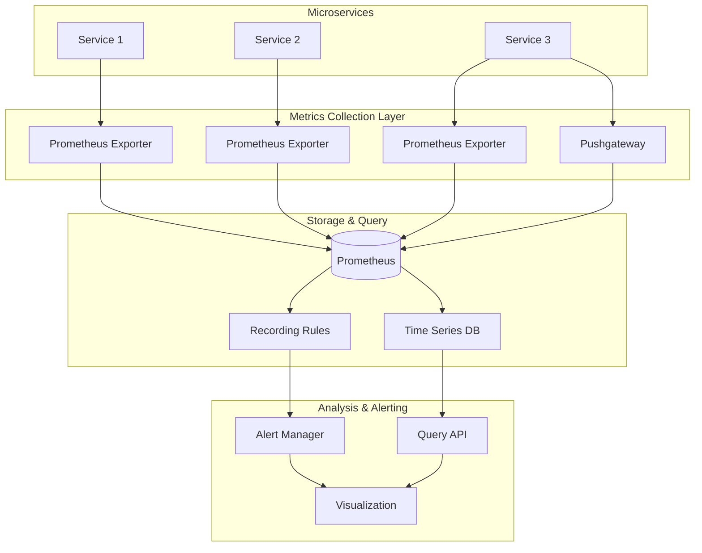
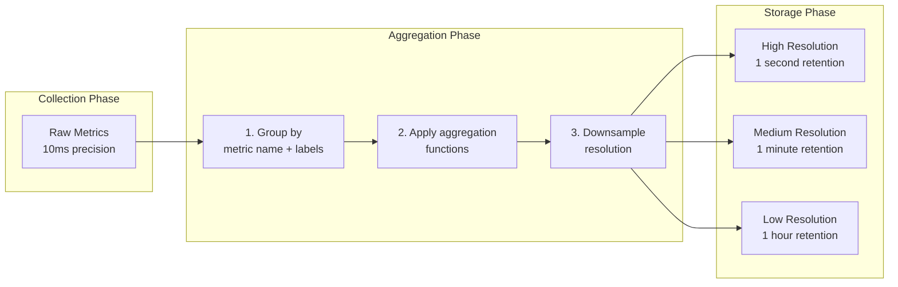

# Metrics Collection Patterns
## Overview

Metrics collection is a fundamental observability pattern that involves gathering quantitative measurements from microservices to understand system behavior, performance, and health. Unlike logs, which provide detailed event information, metrics offer aggregated statistical data that scales well and enables real-time monitoring and alerting. Effective metrics collection enables teams to understand system trends, identify anomalies, and make data-driven decisions about capacity planning and performance optimization.

In microservices architectures, metrics collection faces unique challenges: services are distributed across multiple nodes, each service may run multiple instances, and metrics need to be aggregated across all instances to provide system-wide visibility. A robust metrics collection system must handle high cardinality from service instances, support efficient aggregation, and integrate with alerting and visualization tools.

The three primary metric types are: counters (cumulative values that only increase, like request counts), gauges (point-in-time values that can go up and down, like memory usage), and histograms (distributions of values that show the spread of measurements, like response times). Understanding when to use each metric type is essential for effective monitoring.

## Architecture and Components


## Java Implementation
```java
import io.micrometer.core.instrument.Counter;
import io.micrometer.core.instrument.MeterRegistry;
import io.micrometer.core.instrument.Timer;
import io.micrometer.core.instrument.Gauge;
import io.micrometer.core.instrument.Meter;
import io.micrometer.core.instrument.Meter.Id;
import io.micrometer.core.instrument.distribution.HistogramSnapshot;
import io.micrometer.core.instrument.binder.jvm.JvmGcMetrics;
import io.micrometer.core.instrument.binder.jvm.JvmMemoryMetrics;
import io.micrometer.core.instrument.binder.jvm.JvmThreadMetrics;
import io.micrometer.core.instrument.binder.system.ProcessorMetrics;
import io.micrometer.prometheus.PrometheusConfig;
import io.micrometer.prometheus.PrometheusMeterRegistry;
import io.prometheus.client.exporter.PushGateway;
import org.springframework.boot.SpringApplication;
import org.springframework.boot.actuate.autoconfigure.metrics.MeterRegistryCustomizer;
import org.springframework.context.annotation.Bean;
import org.springframework.context.annotation.Configuration;

import java.lang.management.ManagementFactory;
import java.lang.management.MemoryMXBean;
import java.lang.management.OperatingSystemMXBean;
import java.util.concurrent.TimeUnit;
import java.util.function.Supplier;

public class MetricsCollectionExample {

    private final MeterRegistry registry;
    private final Counter requestCounter;
    private final Counter errorCounter;
    private final Timer requestTimer;
    private final Timer databaseTimer;
    private final Timer externalCallTimer;

    public MetricsCollectionExample() {
        this.registry = new PrometheusMeterRegistry(PrometheusConfig.DEFAULT);

        initializeJvmMetrics();
        
        this.requestCounter = Counter.builder("http.requests.total")
            .description("Total number of HTTP requests")
            .tag("service", "order-service")
            .tag("version", "1.0.0")
            .register(registry);

        this.errorCounter = Counter.builder("http.errors.total")
            .description("Total number of HTTP errors")
            .tag("service", "order-service")
            .register(registry);

        this.requestTimer = Timer.builder("http.request.duration")
            .description("HTTP request duration")
            .tag("service", "order-service")
            .publishPercentiles(0.5, 0.95, 0.99)
            .publishPercentileHistogram()
            .register(registry);

        this.databaseTimer = Timer.builder("database.query.duration")
            .description("Database query duration")
            .tag("service", "order-service")
            .tag("db", "orders-db")
            .publishPercentiles(0.5, 0.95, 0.99)
            .register(registry);

        this.externalTimer = Timer.builder("external.service.call.duration")
            .description("External service call duration")
            .tag("service", "order-service")
            .register(registry);
            
        registerBusinessMetrics();
    }

    private void initializeJvmMetrics() {
        new JvmGcMetrics().bindTo(registry);
        new JvmMemoryMetrics().bindTo(registry);
        new JvmThreadMetrics().bindTo(registry);
        new ProcessorMetrics().bindTo(registry);
    }

    private void registerBusinessMetrics() {
        MemoryMXBean memoryBean = ManagementFactory.getMemoryMXBean();
        Gauge.builder("jvm.heap.memory.used", memoryBean, 
            bean -> bean.getHeapMemoryUsage().getUsed())
            .description("JVM heap memory used")
            .tag("region", "heap")
            .register(registry);

        Gauge.builder("jvm.heap.memory.max", memoryBean,
            bean -> bean.getHeapMemoryUsage().getMax())
            .description("JVM heap memory max")
            .tag("region", "heap")
            .register(registry);
            
        OperatingSystemMXBean osBean = ManagementFactory.getOperatingSystemMXBean();
        Gauge.builder("system.cpu.count", osBean, 
            OperatingSystemMXBean::getAvailableProcessors)
            .description("Number of available processors")
            .register(registry);
            
        Gauge.builder("order.orders.in.progress", 
            new AtomicIntegerSupplier(), 
            AtomicInteger::get)
            .description("Number of orders currently being processed")
            .tag("service", "order-service")
            .register(registry);
    }

    public void recordRequest(String endpoint, String method, int statusCode, long durationMs) {
        requestCounter.increment();
        
        requestTimer.record(durationMs, TimeUnit.MILLISECONDS);
        
        registry.counter("http.requests.by.endpoint",
            "endpoint", endpoint,
            "method", method,
            "status", String.valueOf(statusCode))
            .increment();
            
        if (statusCode >= 400) {
            errorCounter.increment();
            registry.counter("http.errors.by.status",
                "status", String.valueOf(statusCode),
                "endpoint", endpoint)
                .increment();
        }
    }

    public void recordDatabaseQuery(String queryType, long durationMs) {
        databaseTimer.record(durationMs, TimeUnit.MILLISECONDS);
        
        registry.counter("database.queries.total",
            "query_type", queryType)
            .increment();
    }

    public void recordExternalCall(String serviceName, String endpoint, long durationMs, boolean success) {
        externalTimer.record(durationMs, TimeUnit.MILLISECONDS);
        
        registry.counter("external.calls.total",
            "service", serviceName,
            "endpoint", endpoint,
            "success", String.valueOf(success))
            .increment();
    }

    public void recordBusinessMetric(String metricName, double value) {
        Gauge.builder("business." + metricName, () -> value)
            .description("Business metric: " + metricName)
            .register(registry);
    }

    public void recordActiveConnections(int count) {
        Gauge.builder("database.connections.active", () -> count)
            .description("Active database connections")
            .tag("service", "order-service")
            .register(registry);
    }

    public String getMetrics() {
        return registry.scrape();
    }

    public void pushMetricsToGateway(String jobName) {
        PushGateway pushGateway = new PushGateway("pushgateway:9091");
        
        try {
            pushGateway.pushAdd(
                io.prometheus.client.CollectorRegistry.defaultRegistry,
                jobName,
                new String[]{"instance", "order-service-1"}
            );
        } catch (Exception e) {
            System.err.println("Failed to push metrics: " + e.getMessage());
        }
    }

    public void recordHistogram(String name, double value) {
        Timer timer = Timer.builder(name)
            .publishPercentileHistogram()
            .register(registry);
        
        timer.record(value, TimeUnit.MILLISECONDS);
    }

    public MetricsSummary getMetricsSummary() {
        HistogramSnapshot snapshot = requestTimer.takeSnapshot();
        
        return new MetricsSummary(
            snapshot.count(),
            snapshot.total(),
            snapshot.mean(),
            snapshot.max(),
            snapshot.percentileValues(0.5)[0].value(),
            snapshot.percentileValues(0.95)[0].value(),
            snapshot.percentileValues(0.99)[0].value()
        );
    }

    public static class MetricsSummary {
        private final long count;
        private final double total;
        private final double mean;
        private final double max;
        private final double p50;
        private final double p95;
        private final double p99;

        public MetricsSummary(long count, double total, double mean, double max, 
                             double p50, double p95, double p99) {
            this.count = count;
            this.total = total;
            this.mean = mean;
            this.max = max;
            this.p50 = p50;
            this.p95 = p95;
            this.p99 = p99;
        }
    }

    private static class AtomicIntegerSupplier implements Supplier<AtomicInteger> {
        private final AtomicInteger value = new AtomicInteger(0);
        
        @Override
        public AtomicInteger get() {
            return value;
        }
    }
}
```

## Python Implementation
```python
from prometheus_client import start_http_server, Counter, Gauge, Histogram, Summary, Info, CollectorRegistry
from prometheus_client import REGISTRY, generate_latest, CONTENT_TYPE_LATEST, GaugeClusterFamily
from prometheus_client.core import CollectorRegistry, CounterFamily, GaugeMetricFamily, InfoMetricFamily
import random
import time
import os
import psutil
from functools import wraps
import threading

registry = CollectorRegistry()

HTTP_REQUESTS_TOTAL = Counter(
    'http_requests_total',
    'Total number of HTTP requests',
    ['service', 'endpoint', 'method', 'status'],
    registry=registry
)

HTTP_REQUEST_DURATION = Histogram(
    'http_request_duration_seconds',
    'HTTP request duration in seconds',
    ['service', 'endpoint', 'method'],
    buckets=[0.01, 0.025, 0.05, 0.075, 0.1, 0.25, 0.5, 0.75, 1.0, 2.5, 5.0, 7.5, 10.0],
    registry=registry
)

DATABASE_QUERY_DURATION = Histogram(
    'database_query_duration_seconds',
    'Database query duration in seconds',
    ['service', 'query_type', 'table'],
    buckets=[0.001, 0.005, 0.01, 0.025, 0.05, 0.1, 0.25, 0.5, 1.0],
    registry=registry
)

DATABASE_CONNECTIONS_ACTIVE = Gauge(
    'database_connections_active',
    'Number of active database connections',
    ['service', 'database'],
    registry=registry
)

ERROR_TOTAL = Counter(
    'errors_total',
    'Total number of errors',
    ['service', 'error_type', 'endpoint'],
    registry=registry
)

ORDER_PROCESSING_DURATION = Histogram(
    'order_processing_duration_seconds',
    'Time spent processing orders',
    ['service', 'order_type'],
    buckets=[0.1, 0.25, 0.5, 1.0, 2.5, 5.0, 10.0, 25.0, 50.0],
    registry=registry
)

ORDERS_IN_PROGRESS = Gauge(
    'orders_in_progress',
    'Number of orders currently being processed',
    ['service'],
    registry=registry
)

ACTIVE_USERS = Gauge(
    'active_users',
    'Number of currently active users',
    ['service'],
    registry=registry
)

QUEUE_SIZE = Gauge(
    'queue_size',
    'Size of message queue',
    ['service', 'queue_name'],
    registry=registry
)

class MetricsCollector:
    
    def __init__(self, service_name: str = "order-service"):
        self.service_name = service_name
        self.orders_processed = 0
        self.processing_lock = threading.Lock()
        self._start_system_metrics()
    
    def _start_system_metrics(self):
        self.cpu_usage = Gauge(
            'system_cpu_usage',
            'System CPU usage percentage',
            ['service'],
            registry=registry
        )
        
        self.memory_usage = Gauge(
            'system_memory_usage_bytes',
            'System memory usage in bytes',
            ['service', 'memory_type'],
            registry=registry
        )
        
        self.disk_usage = Gauge(
            'system_disk_usage',
            'System disk usage percentage',
            ['service'],
            registry=registry
        )
        
        self.network_io = Counter(
            'system_network_io_bytes',
            'System network I/O in bytes',
            ['service', 'direction'],
            registry=registry
        )
        
        self._update_system_metrics()
    
    def _update_system_metrics(self):
        self.cpu_usage.labels(service=self.service_name).set(psutil.cpu_percent())
        
        mem = psutil.virtual_memory()
        self.memory_usage.labels(service=self.service_name, memory_type='used').set(mem.used)
        self.memory_usage.labels(service=self.service_name, memory_type='available').set(mem.available)
        self.memory_usage.labels(service=self.service_name, memory_type='total').set(mem.total)
        
        disk = psutil.disk_usage('/')
        self.disk_usage.labels(service=self.service_name).set(disk.percent)
        
        net_io = psutil.net_io_counters()
        self.network_io.labels(service=self.service_name, direction='sent').set(net_io.bytes_sent)
        self.network_io.labels(service=self.service_name, direction='received').set(net_io.bytes_recv)
    
    def record_http_request(self, endpoint: str, method: str, status_code: int, duration: float):
        HTTP_REQUESTS_TOTAL.labels(
            service=self.service_name,
            endpoint=endpoint,
            method=method,
            status=str(status_code)
        ).inc()
        
        HTTP_REQUEST_DURATION.labels(
            service=self.service_name,
            endpoint=endpoint,
            method=method
        ).observe(duration)
        
        if status_code >= 400:
            ERROR_TOTAL.labels(
                service=self.service_name,
                error_type='http_error',
                endpoint=endpoint
            ).inc()
    
    def record_database_query(self, query_type: str, table: str, duration: float):
        DATABASE_QUERY_DURATION.labels(
            service=self.service_name,
            query_type=query_type,
            table=table
        ).observe(duration)
    
    def record_external_call(self, service_name: str, success: bool, duration: float):
        Counter(
            'external_calls_total',
            'Total external service calls',
            ['service', 'external_service', 'success'],
            registry=registry
        ).labels(
            service=self.service_name,
            external_service=service_name,
            success=str(success).lower()
        ).inc()
    
    def record_order_processing(self, order_type: str, duration: float):
        with self.processing_lock:
            ORDERS_IN_PROGRESS.labels(service=self.service_name).inc()
            self.orders_processed += 1
        
        ORDER_PROCESSING_DURATION.labels(
            service=self.service_name,
            order_type=order_type
        ).observe(duration)
        
        with self.processing_lock:
            ORDERS_IN_PROGRESS.labels(service=self.service_name).dec()
    
    def record_error(self, error_type: str, endpoint: str = 'unknown'):
        ERROR_TOTAL.labels(
            service=self.service_name,
            error_type=error_type,
            endpoint=endpoint
        ).inc()
    
    def update_active_users(self, count: int):
        ACTIVE_USERS.labels(service=self.service_name).set(count)
    
    def update_queue_size(self, queue_name: str, size: int):
        QUEUE_SIZE.labels(service=self.service_name, queue_name=queue_name).set(size)
    
    def update_database_connections(self, database: str, count: int):
        DATABASE_CONNECTIONS_ACTIVE.labels(
            service=self.service_name,
            database=database
        ).set(count)
    
    def record_custom_metric(self, name: str, value: float, labels: dict):
        Gauge(
            name,
            f'Custom metric: {name}',
            list(labels.keys()),
            registry=registry
        ).labels(**labels).set(value)
    
    def get_metrics(self) -> bytes:
        return generate_latest(registry)


def timing_decorator(metric_name: str):
    def decorator(func):
        @wraps(func)
        def wrapper(*args, **kwargs):
            start_time = time.time()
            try:
                result = func(*args, **kwargs)
                return result
            finally:
                duration = time.time() - start_time
                HTTP_REQUEST_DURATION.labels(
                    service='order-service',
                    endpoint=func.__name__,
                    method='internal'
                ).observe(duration)
        return wrapper
    return decorator


if __name__ == "__main__":
    start_http_server(8000, registry=registry)
    
    collector = MetricsCollector("order-service")
    
    while True:
        collector._update_system_metrics()
        
        collector.record_http_request("/api/orders", "POST", 201, random.uniform(0.01, 0.5))
        collector.record_database_query("SELECT", "orders", random.uniform(0.001, 0.1))
        collector.record_order_processing("standard", random.uniform(0.1, 2.0))
        
        time.sleep(10)
```

## Aggregation Strategies


## Real-World Examples

**Netflix** uses a metrics collection system called Atlas that handles over 1 billion metrics per day. Atlas employs a dimensional data model that allows flexible querying and aggregation across multiple dimensions. Netflix engineers can slice and dice metrics by any combination of tags, enabling detailed analysis of system behavior across different service versions, regions, and customer segments.

**Google** collects metrics from all services using their internal Monarch system. Monarch provides global visibility across all of Google's infrastructure with built-in aggregation, querying, and alerting capabilities. The system automatically aggregates metrics from thousands of services while maintaining granular data for recent time windows.

**Datadog** provides a comprehensive metrics collection solution that supports auto-instrumentation for many languages and frameworks. Their agent collects metrics from hosts, containers, and applications, then aggregates and stores them with intelligent retention policies. Datadog's metric standard deviation and aggregation features enable sophisticated monitoring of dynamic microservices environments.

## Output Statement

Implementing robust metrics collection enables organizations to achieve: real-time visibility into system performance with sub-second resolution for critical metrics; proactive alerting based on metric trends before thresholds are breached; capacity planning informed by actual usage patterns and growth trends; automatic correlation of application metrics with infrastructure metrics for faster root cause analysis; and SLO tracking with accurate measurement of service reliability. Organizations typically see a 40-60% reduction in incident duration after implementing comprehensive metrics collection, as teams can identify and diagnose issues before they impact users.

## Best Practices

1. **Use Dimensional Metrics**: Structure metrics with consistent label sets that enable flexible querying and aggregation. Avoid too many unique label values that cause cardinality explosions.

2. **Choose Appropriate Metric Types**: Use counters for things that only increase, gauges for point-in-time measurements, and histograms for latency or size distributions. Using the wrong type limits analytical capabilities.

3. **Instrument at Service Boundaries**: Record metrics at the entry and exit points of services, including HTTP handlers, database calls, and external service invocations. This provides the most useful visibility into service behavior.

4. **Publish Histogram Percentiles**: Configure histograms with meaningful percentiles (p50, p95, p99) to understand the distribution of measurements. Mean values can be misleading for skewed distributions.

5. **Correlate Metrics with Traces**: Link metrics to distributed traces by including trace IDs in metric labels for significant operations. This enables drilling from metrics into detailed traces.

6. **Implement Recording Rules**: Create pre-aggregated recording rules for frequently queried metric combinations. This reduces query load on the storage backend and improves dashboard performance.

7. **Set Appropriate Retention Policies**: Balance storage costs against analytical needs by implementing tiered retention with high resolution for recent data and aggregated data for historical analysis.

8. **Monitor Metrics System Health**: Track the metrics collection system itself, including collection latencies, scrape failures, and storage ingestion rates. If your monitoring fails, you lose visibility.
