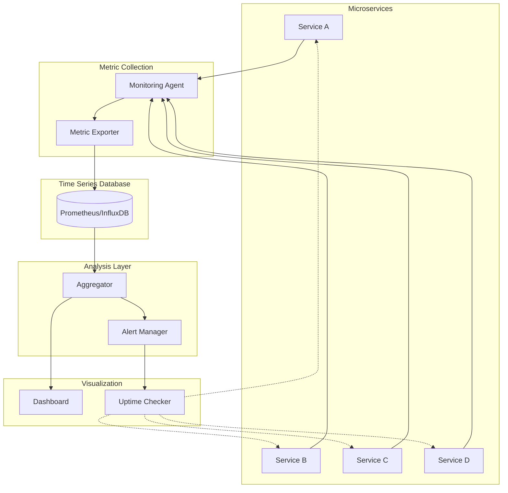

# Service Monitoring Patterns

## Overview

Service monitoring involves the systematic collection, analysis, and visualization of metrics that reflect the health, performance, and availability of microservices. In a distributed system, service monitoring provides the visibility needed to ensure that individual services are functioning correctly and contributing to overall system reliability.

Service monitoring extends beyond simple uptime checks to encompass a comprehensive view of service behavior including request rates, response times, error rates, resource utilization, and business-specific metrics. This data forms the foundation for operational awareness, enabling teams to detect issues before they impact users, optimize performance, and make informed capacity planning decisions.

The importance of service monitoring in microservices architectures cannot be overstated. With potentially hundreds of services communicating with each other, the failure of a single service can cascade through the system. Effective service monitoring provides early warning signals and the context needed to quickly identify and resolve problems.

## Key Metrics Categories

Service monitoring encompasses several distinct categories of metrics that collectively provide a complete picture of service health. Understanding these categories helps teams implement comprehensive monitoring strategies that address different aspects of service behavior.

The first category consists of availability metrics, which measure whether the service is accessible and responding to requests. These include uptime percentage, health check pass/fail rates, and endpoint availability. Availability metrics are typically the first indicator of service problems and often trigger the most urgent alerts.

The second category covers latency metrics, which measure the time required for the service to process requests. These include response time percentiles (p50, p95, p99), average response time, and maximum response time. Latency metrics are critical for understanding user experience and identifying performance bottlenecks.

The third category encompasses throughput metrics, which measure the volume of requests processed by the service. These include requests per second, transactions per minute, and concurrent connections. Throughput metrics help teams understand service load and plan capacity accordingly.

The fourth category includes error metrics, which measure the frequency and types of errors produced by the service. These include error rates by type (4xx, 5xx), exception rates, and circuit breaker activation counts. Error metrics are essential for understanding service reliability and identifying code or configuration issues.

## Architecture



The monitoring architecture consists of several integrated components. Each service exposes metrics through an instrumentation layer, which collects and exports metric data. A collection agent runs alongside each service or within the service mesh to gather these metrics and forward them to a centralized storage system. Analysis tools process the collected data to generate alerts and derive insights. Finally, visualization dashboards present the information in actionable formats.

## Java Implementation

```java
import io.micrometer.core.instrument.Counter;
import io.micrometer.core.instrument.Timer;
import io.micrometer.core.instrument.Gauge;
import io.micrometer.core.instrument.MeterRegistry;
import io.micrometer.core.instrument.Meter;
import io.micrometer.core.instrument.Meter.Id;
import io.prometheus.client.CollectorRegistry;
import io.prometheus.client.CounterDoc;
import io.prometheus.client.GaugeDoc;
import io.prometheus.client.Histogram;
import io.prometheus.client.exporter.pushgateway.PushGateway;
import org.springframework.boot.actuate.metrics.MetricsEndpoint;
import org.springframework.boot.actuate.health.HealthIndicator;
import org.springframework.stereotype.Component;
import java.util.concurrent.atomic.AtomicInteger;
import java.util.concurrent.TimeUnit;
import java.util.Map;
import java.util.HashMap;

@Component
public class ServiceMonitoringExample implements HealthIndicator {
    
    private final MeterRegistry meterRegistry;
    private final Counter requestCounter;
    private final Counter errorCounter;
    private final Timer requestTimer;
    private final AtomicInteger activeConnections;
    private final AtomicInteger queueDepth;
    private final Map<String, Counter> endpointCounters;
    
    public ServiceMonitoringExample(MeterRegistry meterRegistry) {
        this.meterRegistry = meterRegistry;
        
        this.requestCounter = Counter.builder("http_requests_total")
            .description("Total number of HTTP requests")
            .tag("service", "order-service")
            .register(meterRegistry);
        
        this.errorCounter = Counter.builder("http_requests_errors_total")
            .description("Total number of failed HTTP requests")
            .tag("service", "order-service")
            .register(meterRegistry);
        
        this.requestTimer = Timer.builder("http_request_duration_seconds")
            .description("HTTP request processing duration")
            .tag("service", "order-service")
            .publishPercentiles(0.5, 0.95, 0.99)
            .register(meterRegistry);
        
        this.activeConnections = new AtomicInteger(0);
        this.queueDepth = new AtomicInteger(0);
        
        Gauge.builder("active_connections")
            .description("Number of active connections")
            .tag("service", "order-service")
            .register(meterRegistry, activeConnections, AtomicInteger::get);
        
        Gauge.builder("message_queue_depth")
            .description("Message queue depth")
            .tag("service", "order-service")
            .register(meterRegistry, queueDepth, AtomicInteger::get);
        
        this.endpointCounters = new HashMap<>();
        registerEndpointMetrics();
    }
    
    private void registerEndpointMetrics() {
        String[] endpoints = {"/api/orders", "/api/products", "/api/users", "/api/health"};
        
        for (String endpoint : endpoints) {
            Counter counter = Counter.builder("endpoint_requests_total")
                .description("Requests to specific endpoint")
                .tag("endpoint", endpoint)
                .tag("service", "order-service")
                .register(meterRegistry);
            
            endpointCounters.put(endpoint, counter);
        }
    }
    
    public void recordRequest(String endpoint, boolean success, long durationMs) {
        requestCounter.increment();
        endpointCounters.get(endpoint).increment();
        requestTimer.record(durationMs, TimeUnit.MILLISECONDS);
        
        if (!success) {
            errorCounter.increment();
        }
    }
    
    public void incrementConnections() {
        activeConnections.incrementAndGet();
    }
    
    public void decrementConnections() {
        activeConnections.decrementAndGet();
    }
    
    public void updateQueueDepth(int depth) {
        queueDepth.set(depth);
    }
    
    @Override
    public Health health() {
        int active = activeConnections.get();
        int queue = queueDepth.get();
        
        if (active > 100 || queue > 1000) {
            return Health.down()
                .withDetail("activeConnections", active)
                .withDetail("queueDepth", queue)
                .build();
        }
        
        return Health.up()
            .withDetail("activeConnections", active)
            .withDetail("queueDepth", queue)
            .build();
    }
    
    public void recordBusinessMetric(String metricName, double value) {
        Counter.builder("business_metric_" + metricName)
            .description("Business metric: " + metricName)
            .register(meterRegistry)
            .increment(value);
    }
}

@Component
class HealthEndpoint implements org.springframework.boot.actuate.endpoint.HealthEndpoint {
    
    private final ServiceMonitoringExample monitoring;
    
    public HealthEndpoint(ServiceMonitoringExample monitoring) {
        this.monitoring = monitoring;
    }
    
    @Override
    public org.springframework.boot.actuate.health.Health getHealth() {
        return monitoring.health();
    }
}
```

## Python Implementation

```python
from prometheus_client import Counter, Gauge, Histogram, Summary, Info
from prometheus_client import CollectorRegistry, generate_latest, REGISTRY
from prometheus_client.core import GaugeMetricFamily, CounterMetricFamily
from dataclasses import dataclass
from typing import Dict, Optional
import time
import random
import threading

registry = CollectorRegistry()

http_requests_total = Counter(
    'http_requests_total',
    'Total HTTP requests',
    ['method', 'endpoint', 'status'],
    registry=registry
)

http_request_duration_seconds = Histogram(
    'http_request_duration_seconds',
    'HTTP request duration in seconds',
    ['method', 'endpoint'],
    buckets=(0.005, 0.01, 0.025, 0.05, 0.075, 0.1, 0.25, 0.5, 0.75, 1.0),
    registry=registry
)

active_connections = Gauge(
    'active_connections',
    'Number of active connections',
    ['service'],
    registry=registry
)

service_info = Info('service_info', 'Service information', registry=registry)

service_up = Gauge(
    'service_up',
    'Service availability (1 = up, 0 = down)',
    ['service'],
    registry=registry
)

endpoint_requests = Counter(
    'endpoint_requests_total',
    'Total requests per endpoint',
    ['endpoint', 'method'],
    registry=registry
)

error_count = Counter(
    'error_count_total',
    'Total errors',
    ['error_type', 'service'],
    registry=registry
)


class ServiceMonitor:
    
    def __init__(self, service_name: str):
        self.service_name = service_name
        self._running = True
        self._lock = threading.Lock()
        self._request_counts = {}
        self._error_counts = {}
        
        service_info.info({
            'service': service_name,
            'version': '1.0.0'
        })
        
        active_connections.labels(service=service_name).set(0)
        service_up.labels(service=service_name).set(1)
    
    def record_request(self, endpoint: str, method: str, 
                     status: int, duration: float):
        """Record an HTTP request."""
        http_requests_total.labels(
            method=method,
            endpoint=endpoint,
            status=str(status)
        ).inc()
        
        http_request_duration_seconds.labels(
            method=method,
            endpoint=endpoint
        ).observe(duration)
        
        endpoint_requests.labels(
            endpoint=endpoint,
            method=method
        ).inc()
        
        with self._lock:
            key = f"{method}:{endpoint}"
            self._request_counts[key] = self._request_counts.get(key, 0) + 1
    
    def record_error(self, error_type: str):
        """Record an error."""
        error_count.labels(
            error_type=error_type,
            service=self.service_name
        ).inc()
        
        with self._lock:
            self._error_counts[error_type] = \
                self._error_counts.get(error_type, 0) + 1
    
    def set_active_connections(self, count: int):
        """Update active connection count."""
        active_connections.labels(service=self.service_name).set(count)
    
    def set_service_status(self, is_up: bool):
        """Set service availability status."""
        service_up.labels(service=selfservice_name).set(1 if is_up else 0)
    
    def health_check(self) -> Dict:
        """Perform health check."""
        return {
            'status': 'UP' if service_up.labels(
                service=self.service_name)._value.get() == 1 else 'DOWN',
            'service': self.service_name,
            'requests': dict(self._request_counts),
            'errors': dict(self._error_counts)
        }
    
    def get_metrics(self) -> bytes:
        """Get Prometheus-formatted metrics."""
        return generate_latest(registry)


class HealthCheckRunner:
    """Background health check runner."""
    
    def __init__(self, monitor: ServiceMonitor, interval: int = 30):
        self.monitor = monitor
        self.interval = interval
        self._thread = None
        self._running = False
    
    def start(self):
        """Start health check runner."""
        self._running = True
        self._thread = threading.Thread(target=self._run_checks)
        self._thread.daemon = True
        self._thread.start()
    
    def stop(self):
        """Stop health check runner."""
        self._running = False
        if self._thread:
            self._thread.join()
    
    def _run_checks(self):
        """Run periodic health checks."""
        while self._running:
            try:
                is_healthy = self._perform_check()
                self.monitor.set_service_status(is_healthy)
            except Exception as e:
                print(f"Health check failed: {e}")
                self.monitor.set_service_status(False)
            
            time.sleep(self.interval)
    
    def _perform_check(self) -> bool:
        """Perform actual health check."""
        return True


if __name__ == "__main__":
    monitor = ServiceMonitor("order-service")
    health_checker = HealthCheckRunner(monitor)
    health_checker.start()
    
    for i in range(10):
        endpoint = random.choice(["/api/orders", "/api/products", "/api/users"])
        method = random.choice(["GET", "POST", "PUT"])
        status = random.choices([200, 201, 400, 500], weights=[70, 20, 5, 5])[0]
        duration = random.uniform(0.01, 0.5)
        
        monitor.record_request(endpoint, method, status, duration)
        
        if status >= 400:
            monitor.record_error(f"http_{status}")
        
        time.sleep(0.1)
    
    print(generate_latest(registry).decode())
```

## Real-World Examples

**Netflix** implements comprehensive service monitoring through their Atlas platform, which collects and processes billions of metrics daily. Their monitoring system tracks every microservice's throughput, latency, and error rates in real time, enabling automatic traffic routing changes when services degrade. Netflix engineers can view service health across their entire fleet through unified dashboards that aggregate data from thousands of instances.

**Stripe** uses service monitoring to ensure payment processing reliability. Their metrics track not only technical indicators like response times but also business metrics like successful transactions, failed payments, and processing delays. This comprehensive monitoring enables Stripe to maintain their industry-leading uptime guarantees and quickly identify any issues affecting payment processing.

**Uber** implements service monitoring across their microservices platform to track trip processing, driver matching, and fare calculation services. Their monitoring system correlages technical metrics with business outcomes, enabling teams to understand how service performance affects user experience and driver earnings.

## Output Statement

Organizations implementing comprehensive service monitoring can expect significant operational improvements: detection time for service issues reduced from hours to minutes through automated alerting; improved mean time to resolution as teams have immediate access to relevant metrics; better capacity planning through historical analysis of throughput and resource utilization; and enhanced user experience through proactive identification and resolution of performance issues.

Service monitoring provides the observable foundation that enables Site Reliability Engineering practices. Without comprehensive service monitoring, teams operate blind to the actual behavior of their systems, making it impossible to reliably deliver services at scale.

## Best Practices

1. **Define Service-Level Indicators (SLIs)**: Establish clear metrics that define service health for your specific services. These should align with user experience and business outcomes, not just technical metrics.

2. **Implement Health Checks at Multiple Levels**: Create health checks that verify dependency availability, database connectivity, and external service status, not just process liveness.

3. **Correlate Metrics Across Services**: Link metrics across service boundaries to understand how issues in one service affect others. Use consistent tagging conventions to enable this correlation.

4. **Set Appropriate Alert Thresholds**: Configure alerts based on historical data and known thresholds, not arbitrary values. Use percentiles (p95, p99) rather than averages to understand tail latency.

5. **Automate Recovery Actions**: Implement auto-remediation for common failure scenarios, such as restarting failed processes or draining traffic from degraded instances.

6. **Track Both Technical and Business Metrics**: Monitor business-level metrics alongside technical metrics to understand the actual impact of service issues on users and revenue.

7. **Implement Distributed Monitoring**: Deploy monitoring across all service instances to understand both aggregate and per-instance behavior. This helps identify issues affecting subsets of traffic.

8. **Create Runbooks for Common Issues**: Document the steps to investigate and resolve common issues identified through service monitoring. Reference specific metrics and dashboards in these runbooks.