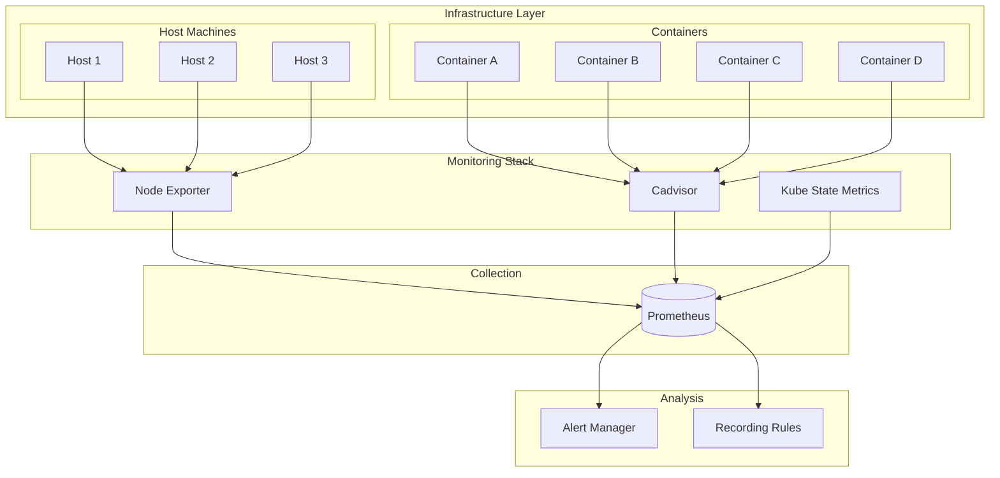

# Resource Monitoring Patterns

## Overview

Resource monitoring focuses on tracking the computational resources that microservices consume, including CPU, memory, disk, and network bandwidth. In containerized and cloud-native environments, understanding resource consumption is essential for capacity planning, cost optimization, and maintaining service reliability.

Resource monitoring differs from service monitoring in its focus on the underlying infrastructure rather than application behavior. While service monitoring tracks how applications process requests, resource monitoring tracks the resources those applications consume. This distinction is important because resource constraints often manifest as application performance issues, and understanding resource behavior enables proactive management.

Modern microservices run in dynamically scaled environments where resource allocation can change based on load. Effective resource monitoring provides visibility into how services utilize their allocated resources and helps identify opportunities to optimize resource usage and reduce costs.

## Resource Categories

Understanding resource monitoring requires knowledge of the distinct resource categories that teams must track. Each category has unique characteristics that affect how monitoring should be implemented and how alerts should be configured.

**Compute Resources**: CPU monitoring tracks the processing power consumed by services, including usage percentiles, throttle events, and scheduling delays. In containerized environments, CPU limits directly affect application performance, making accurate CPU monitoring essential. Memory monitoring tracks heap usage, garbage collection behavior, and working set size. Memory issues often lead to application failures or severe performance degradation.

**Storage Resources**: Disk I/O monitoring tracks read and write operations, latency, and capacity utilization. For stateful services, storage performance directly affects request latency. Network monitoring tracks bandwidth consumption, connection counts, and packet loss. In microservices architectures, network resources are often the bottleneck for inter-service communication.

**Container Resources**: In containerized environments, additional metrics become relevant including container CPU throttling, OOM (Out of Memory) kill events, and container restart counts. These metrics provide insight into container health and resource pressure that affects application behavior.

## Architecture



The resource monitoring architecture consists of multiple exporters that collect metrics from different layers of the infrastructure. Node Exporter collects host-level metrics, cAdvisor collects container-level metrics, and kube-state-metrics collects Kubernetes-specific resource metrics. These metrics are aggregated by Prometheus for analysis and alerting.

## Java Implementation

```java
import io.micrometer.core.instrument.MeterRegistry;
import io.micrometer.core.instrument.Gauge;
import io.micrometer.core.instrument.Counter;
import io.micrometer.core.instrument.Timer;
import io.micrometer.core.instrument.binder.jvm.JvmGcMetrics;
import io.micrometer.core.instrument.binder.jvm.JvmMemoryMetrics;
import io.micrometer.core.instrument.binder.jvm.JvmThreadMetrics;
import io.micrometer.core.instrument.binder.system.ProcessorMetrics;
import io.micrometer.core.instrument.binder.system.UptimeMetrics;
import com.sun.management.OperatingSystemMXBean;
import java.lang.management.ManagementFactory;
import java.lang.management.MemoryMXBean;
import java.lang.management.MemoryUsage;
import java.lang.management.ThreadMXBean;
import java.lang.management.GarbageCollectorMXBean;
import java.lang.management.OperatingSystemMXBean;
import java.util.List;
import java.util.concurrent.Executors;
import java.util.concurrent.ScheduledExecutorService;
import java.util.concurrent.TimeUnit;
import java.util.concurrent.atomic.AtomicLong;

public class ResourceMonitoringExample {
    
    private final MeterRegistry meterRegistry;
    private final OperatingSystemMXBean osBean;
    private final MemoryMXBean memoryBean;
    private final ThreadMXBean threadBean;
    private final List<GarbageCollectorMXBean> gcBeans;
    private final ScheduledExecutorService scheduler;
    private final AtomicLong threadCount = new AtomicLong(0);
    private final AtomicLong peakThreadCount = new AtomicLong(0);
    
    private final Counter containerCpuXxx;
    private final Counter containerMemoryXxx;
    private final Gauge hostCpuUsage;
    private final Gauge hostMemoryUsage;
    private final Gauge jvmHeapUsage;
    private final Gauge jvmMetaspaceUsage;
    
    public ResourceMonitoringExample(MeterRegistry meterRegistry) {
        this.meterRegistry = meterRegistry;
        
        osBean = ManagementFactory.getOperatingSystemMXBean();
        memoryBean = ManagementFactory.getMemoryMXBean();
        threadBean = ManagementFactory.getThreadMXBean();
        gcBeans = ManagementFactory.getGarbageCollectorMXBeans();
        
        scheduler = Executors.newScheduledThreadPool(1);
        
        registerJvmMetrics();
        registerSystemMetrics();
        registerContainerMetrics();
        
        startResourceCollection();
    }
    
    private void registerJvmMetrics() {
        new JvmMemoryMetrics().bindTo(meterRegistry);
        new JvmGcMetrics().bindTo(meterRegistry);
        new JvmThreadMetrics().bindTo(meterRegistry);
        
        Gauge.builder("jvm_memory_heap_used_bytes")
            .description("JVM heap memory used")
            .register(meterRegistry, () -> 
                memoryBean.getHeapMemoryUsage().getUsed());
        
        Gauge.builder("jvm_memory_heap_max_bytes")
            .description("JVM heap memory maximum")
            .register(meterRegistry, () -> 
                memoryBean.getHeapMemoryUsage().getMax());
        
        Gauge.builder("jvm_memory_nonheap_used_bytes")
            .description("JVM non-heap memory used")
            .register(meterRegistry, () -> 
                memoryBean.getNonHeapMemoryUsage().getUsed());
        
        for (GarbageCollectorMXBean gc : gcBeans) {
            String gcName = gc.getName();
            Counter.builder("jvm_gc_pauses_total")
                .description("Total GC pauses")
                .tag("gc", gcName)
                .register(meterRegistry);
        }
        
        Gauge.builder("jvm_threads_daemon_count")
            .description("Number of daemon threads")
            .register(meterRegistry, () -> 
                threadBean.getDaemonThreadCount());
    }
    
    private void registerSystemMetrics() {
        new ProcessorMetrics().bindTo(meterRegistry);
        new UptimeMetrics().bindTo(meterRegistry);
        
        Gauge.builder("system_cpu_usage")
            .description("System CPU usage")
            .register(meterRegistry, this::getSystemCpuUsage);
        
        Gauge.builder("system_memory_usage_bytes")
            .description("System memory usage in bytes")
            .register(meterRegistry, this::getSystemMemoryUsage);
        
        Gauge.builder("system_open_file_descriptors")
            .description("Number of open file descriptors")
            .register(meterRegistry, this::getOpenFileDescriptorCount);
        
        Gauge.builder("system_network_connections")
            .description("Number of network connections")
            .register(meterRegistry, this::getNetworkConnectionCount);
    }
    
    private void registerContainerMetrics() {
        containerCpuXxx = Counter.builder("container_cpu_throttling_total")
            .description("Total CPU throttling events")
            .register(meterRegistry);
        
        containerMemoryXxx = Counter.builder("container_oom_kills_total")
            .description("Total OOM kill events")
            .register(meterRegistry);
        
        Gauge.builder("container_cpu_usage_seconds_total")
            .description("CPU time used by container")
            .register(meterRegistry, () -> getContainerCpuTime());
        
        Gauge.builder("container_memory_working_set_bytes")
            .description("Container memory working set")
            .register(meterRegistry, () -> getContainerMemoryUsage());
        
        Gauge.builder("container_fs_usage_bytes")
            .description("Container filesystem usage")
            .register(meterRegistry, () -> getContainerDiskUsage());
    }
    
    private void startResourceCollection() {
        scheduler.scheduleAtFixedRate(() -> {
            collectResourceMetrics();
        }, 0, 15, TimeUnit.SECONDS);
    }
    
    private void collectResourceMetrics() {
        threadCount.set(threadBean.getThreadCount());
        long peak = peakThreadCount.get();
        if (threadCount.get() > peak) {
            peakThreadCount.set(threadCount.get());
        }
        
        checkResourceThresholds();
    }
    
    private void checkResourceThresholds() {
        double cpuUsage = getSystemCpuUsage();
        if (cpuUsage > 0.9) {
            containerCpuXxx.increment();
        }
        
        long memUsage = getContainerMemoryUsage();
        long memLimit = getContainerMemoryLimit();
        if (memUsage > memLimit * 0.9) {
            containerMemoryXxx.increment();
        }
    }
    
    private double getSystemCpuUsage() {
        return osBean.getProcessCpuLoad();
    }
    
    private long getSystemMemoryUsage() {
        return osBean.getTotalMemorySize() - osBean.getFreeMemorySize();
    }
    
    private long getOpenFileDescriptorCount() {
        try {
            java.io.File fdDir = new java.io.File("/proc/self/fd");
            return fdDir.list().length;
        } catch (Exception e) {
            return 0;
        }
    }
    
    private long getNetworkConnectionCount() {
        try {
            java.io.File netDir = new java.io.File("/proc/net/tcp");
            return netDir.list().length - 1;
        } catch (Exception e) {
            return 0;
        }
    }
    
    private double getContainerCpuTime() {
        try {
            java.io.File statFile = new java.io.File("/proc/stat");
            java.util.Scanner scanner = new java.util.Scanner(statFile);
            if (scanner.hasNextLine()) {
                scanner.nextLine();
            }
            scanner.close();
            return 0.0;
        } catch (Exception e) {
            return 0.0;
        }
    }
    
    private long getContainerMemoryUsage() {
        return memoryBean.getHeapMemoryUsage().getUsed() + 
               memoryBean.getNonHeapMemoryUsage().getUsed();
    }
    
    private long getContainerMemoryLimit() {
        return memoryBean.getHeapMemoryUsage().getMax();
    }
    
    private long getContainerDiskUsage() {
        try {
            java.io.File root = new java.io.File("/");
            return root.getTotalSpace() - root.getFreeSpace();
        } catch (Exception e) {
            return 0;
        }
    }
}
```

## Python Implementation

```python
import psutil
import time
import threading
from prometheus_client import Counter, Gauge, Histogram, CollectorRegistry
from prometheus_client import generate_latest
from typing import Dict, List, Callable

registry = CollectorRegistry()

cpu_usage = Gauge(
    'process_cpu_percent',
    'CPU usage percent',
    ['process_name'],
    registry=registry
)

memory_usage = Gauge(
    'process_memory_bytes',
    'Memory usage in bytes',
    ['process_name', 'memory_type'],
    registry=registry
)

virtual_memory = Gauge(
    'virtual_memory_percent',
    'Virtual memory usage percent',
    registry=registry
)

disk_usage = Gauge(
    'disk_usage_bytes',
    'Disk usage in bytes',
    ['path'],
    registry=registry
)

io_counters = Gauge(
    'process_io_counters',
    'Process I/O counters',
    ['process_name', 'operation'],
    registry=registry
)

network_io = Gauge(
    'network_io_bytes',
    'Network I/O in bytes',
    ['interface', 'direction'],
    registry=registry
)

cpu_count = Gauge(
    'system_cpu_count',
    'System CPU count',
    registry=registry
)

cpu_percent = Gauge(
    'system_cpu_percent',
    'System CPU percent per core',
    ['core'],
    registry=registry
)

throttle_events = Counter(
    'container_cpu_throttle_total',
    'CPU throttling events',
    registry=registry
)

oom_kills = Counter(
    'container_oom_kills_total',
    'OOM kill events',
    registry=registry
)


class ResourceMonitor:
    """Resource monitoring for Python applications."""
    
    def __init__(self, process_name: str = "python-service"):
        self.process_name = process_name
        self.process = psutil.Process()
        self._running = False
        self._lock = threading.Lock()
        self._collection_thread = None
        self._interval = 15
        
        cpu_count.set(psutil.cpu_count())
    
    def start(self, interval: int = 15):
        """Start resource monitoring."""
        self._interval = interval
        self._running = True
        self._collection_thread = threading.Thread(
            target=self._collect_loop,
            daemon=True
        )
        self._collection_thread.start()
    
    def stop(self):
        """Stop resource monitoring."""
        self._running = False
        if self._collection_thread:
            self._collection_thread.join(timeout=5)
    
    def _collect_loop(self):
        """Main collection loop."""
        while self._running:
            try:
                self._collect_process_metrics()
                self._collect_system_metrics()
                self._collect_container_metrics()
            except Exception as e:
                print(f"Collection error: {e}")
            
            time.sleep(self._interval)
    
    def _collect_process_metrics(self):
        """Collect process-level metrics."""
        with self._lock:
            cpu_percent = self.process.cpu_percent()
            cpu_usage.labels(
                process_name=self.process_name
            ).set(cpu_percent)
            
            memory_info = self.process.memory_info()
            memory_usage.labels(
                process_name=self.process_name,
                memory_type="rss"
            ).set(memory_info.rss)
            memory_usage.labels(
                process_name=self.process_name,
                memory_type="vms"
            ).set(memory_info.vms)
            
            try:
                io_counters_op = self.process.io_counters()
                io_counters.labels(
                    process_name=self.process_name,
                    operation="read_bytes"
                ).set(io_counters_op.read_bytes)
                io_counters.labels(
                    process_name=self.process_name,
                    operation="write_bytes"
                ).set(io_counters_op.write_bytes)
            except (psutil.NoSuchProcess, psutil.AccessDenied):
                pass
    
    def _collect_system_metrics(self):
        """Collect system-level metrics."""
        vm = psutil.virtual_memory()
        virtual_memory.set(vm.percent)
        
        per_cpu = psutil.cpu_percent(interval=0.1, percpu=True)
        for i, percent in enumerate(per_cpu):
            cpu_percent.labels(core=f"cpu{i}").set(percent)
        
        swap = psutil.swap_memory()
        memory_usage.labels(
            process_name="system",
            memory_type="swap"
        ).set(swap.used)
    
    def _collect_container_metrics(self):
        """Collect container-specific metrics (when available)."""
        try:
            self._check_cpu_throttling()
            self._check_oom_events()
            self._collect_disk_usage()
            self._collect_network_usage()
        except Exception as e:
            pass
    
    def _check_cpu_throttling(self):
        """Check for CPU throttling in containers."""
        try:
            with open('/sys/fs/cgroup/cpu/cpu.stat', 'r') as f:
                for line in f:
                    if line.startswith('throttled'):
                        parts = line.split()
                        if len(parts) >= 2:
                            throttle_count = int(parts[1])
                            if throttle_count > 0:
                                throttle_events.inc()
        except FileNotFoundError:
            pass
    
    def _check_oom_events(self):
        """Check for OOM events."""
        try:
            with open('/sys/fs/cgroup/memory/memory.oom_control', 'r') as f:
                for line in f:
                    if line.startswith('oom_kill'):
                        parts = line.split()
                        if len(parts) >= 2:
                            oom_count = int(parts[1])
                            if oom_count > 0:
                                oom_kills.inc()
        except FileNotFoundError:
            pass
    
    def _collect_disk_usage(self):
        """Collect disk usage."""
        try:
            disk = psutil.disk_usage('/')
            disk_usage.labels(path="/").set(disk.used)
        except Exception:
            pass
    
    def _collect_network_usage(self):
        """Collect network interface statistics."""
        try:
            net = psutil.net_io_counters(pernic=True)
            for interface, stats in net.items():
                network_io.labels(
                    interface=interface,
                    direction="sent"
                ).set(stats.bytes_sent)
                network_io.labels(
                    interface=interface,
                    direction="received"
                ).set(stats.bytes_recv)
        except Exception:
            pass
    
    def get_metrics(self) -> bytes:
        """Get Prometheus-formatted metrics."""
        return generate_latest(registry)


class CPUMonitor:
    """System-wide CPU monitoring."""
    
    def __init__(self):
        self._interval = 1.0
    
    def get_cpu_percent(self, per_cpu: bool = False) -> Dict:
        """Get CPU usage percentage."""
        if per_cpu:
            return {f"cpu{i}": p for i, p in 
                    enumerate(psutil.cpu_percent(percpu=True, interval=self._interval))}
        return {"total": psutil.cpu_percent(interval=self._interval)}
    
    def get_load_average(self) -> Dict:
        """Get system load average."""
        if hasattr(psutil, 'getloadavg'):
            load_avg = psutil.getloadavg()
            return {
                "1min": load_avg[0],
                "5min": load_avg[1],
                "15min": load_avg[2]
            }
        return {}


class MemoryMonitor:
    """System-wide memory monitoring."""
    
    def __init__(self):
        pass
    
    def get_memory_info(self) -> Dict:
        """Get detailed memory information."""
        vm = psutil.virtual_memory()
        return {
            "total": vm.total,
            "available": vm.available,
            "used": vm.used,
            "free": vm.free,
            "percent": vm.percent,
            "active": getattr(vm, 'active', 0),
            "inactive": getattr(vm, 'inactive', 0),
            "buffers": getattr(vm, 'buffers', 0),
            "cached": getattr(vm, 'cached', 0)
        }


if __name__ == "__main__":
    monitor = ResourceMonitor("order-service")
    monitor.start(interval=15)
    
    time.sleep(2)
    
    print(generate_latest(registry).decode())
    
    monitor.stop()
```

## Real-World Examples

**Google Cloud** implements resource monitoring across their Kubernetes Engine using stackdriver agents that collect CPU, memory, disk, and network metrics at both node and pod levels. Their monitoring system automatically tracks resource limits and usage, alerting when containers approach their resource limits.

**Amazon Web Services** provides CloudWatch Container Insights for ECS, EKS, and Fargate, collecting resource metrics at the container and task levels. These metrics enable automatic scaling decisions and capacity planning for containerized workloads.

**Datadog** provides resource monitoring across containerized environments, collecting metrics from Docker, Kubernetes, and cloud provider APIs. Their agent-based approach ensures comprehensive visibility into resource consumption across hybrid environments.

## Output Statement

Organizations implementing comprehensive resource monitoring can expect: reduced infrastructure costs through right-sizing of resource allocations; improved system reliability through proactive identification of resource pressure; faster incident response when resource issues cause application problems; and better capacity planning through historical analysis of resource trends.

Resource monitoring provides the foundation for effective resource management in cloud-native environments. Without resource monitoring, teams cannot effectively allocate resources or identify when applications are constrained by infrastructure limits.

## Best Practices

1. **Set Resource Limits Based on Actual Usage**: Configure container resource limits based on observed usage patterns, not arbitrary values. Leave headroom for bursts while avoiding over-allocation.

2. **Monitor Both Usage and Limits**: Track both resource consumption and resource limits to understand how much headroom exists. This enables proactive scaling before limits are reached.

3. **Track Resource Trends Over Time**: Analyze resource usage patterns to understand growth trends and plan capacity accordingly. Use long-term metrics to identify when additional resources will be needed.

4. **Implement Automatic Alerts for Resource Pressure**: Configure alerts for when resource usage exceeds thresholds, such as CPU usage above 80% or memory usage above 85%.

5. **Correlate Resource Metrics with Application Metrics**: Link resource metrics with application metrics to understand how resource pressure affects application performance. This helps identify when resource constraints cause issues.

6. **Monitor Garbage Collection Behavior**: For JVM applications, track GC frequency and duration as indicators of memory pressure. Frequent or long GCs indicate memory needs tuning.

7. **Implement Resource Quotas**: Set resource quotas at namespace or team levels to prevent resource hoarding and ensure fair resource allocation across services.