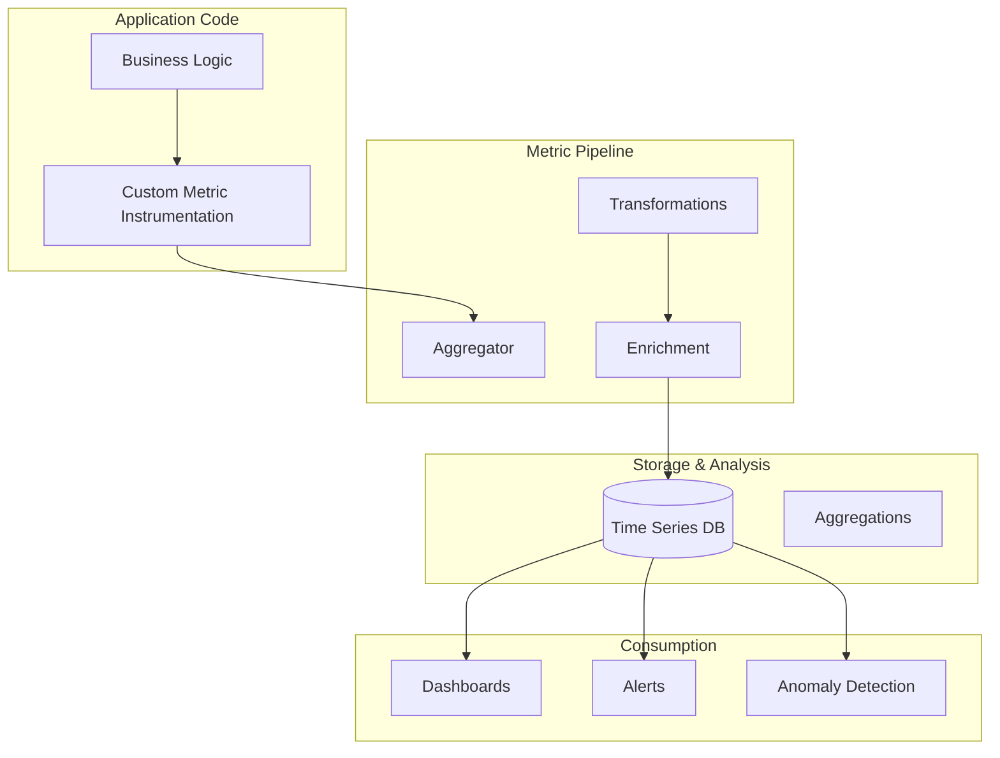

# Custom Metrics Patterns

## Overview

Custom metrics are application-specific measurements that capture business-relevant data beyond standard infrastructure and application metrics. While standard metrics like CPU usage and request latency are important, custom metrics enable teams to track metrics that directly measure business outcomes and user experience.

Custom metrics provide the link between technical measurements and business value. For example, instead of just tracking database query latency, custom metrics can track the number of orders processed per minute, the value of shopping carts, or the conversion rate of checkout flows. These business metrics enable teams to understand how technical decisions affect business outcomes.

The ability to define and collect custom metrics is essential for comprehensive observability. Standard metrics tell you if your services are running; custom metrics tell you if your services are achieving their business purpose. Together, they provide complete visibility into system behavior and business impact.

## Types of Custom Metrics

Custom metrics can be categorized into several types, each serving different analytical purposes. Understanding these types helps teams choose the right metric type for each measurement.

**Counters**: Counters are monotonically increasing metrics that track cumulative values. They are ideal for tracking events like total requests, total errors, or total transactions processed. Counters can only increase (or reset to zero on service restart), making them suitable for tracking rates when the derivative is calculated.

**Gauges**: Gauges are point-in-time values that can go up and down. They are suitable for tracking values like current queue depth, active user count, or cache size. Gauges provide instant visibility into current state but don't capture trends without additional analysis.

**Histograms**: Histograms track distributions of values across configurable buckets. They are ideal for tracking latency distributions, response size distributions, or any metric where understanding the distribution matters more than the average. Histograms enable percentile calculations without storing every individual measurement.

**Timers**: Timers are specialized metrics for measuring operation duration. They combine the functionality of histograms for tracking duration distributions with counters for tracking total operation count. Timers are the preferred choice for tracking operation latency.

## Architecture



The custom metrics architecture integrates application code with collection infrastructure. Business logic generates metrics through instrumentation, which are then aggregated, transformed, and enriched before storage. The stored metrics are consumed through dashboards, alerts, and analytics.

## Java Implementation

```java
import io.micrometer.core.instrument.Counter;
import io.micrometer.core.instrument.Gauge;
import io.micrometer.core.instrument.Timer;
import io.micrometer.core.instrument.MeterRegistry;
import io.micrometer.core.instrument.Meter;
import io.micrometer.core.instrument.distribution.DistributionStatisticConfig;
import io.micrometer.core.instrument.distribution.HistogramSnapshot;
import io.micrometer.prometheus.PrometheusConfig;
import io.micrometer.prometheus.PrometheusMeterRegistry;
import io.prometheus.client.Counter;
import io.prometheus.client.Gauge;
import io.prometheus.client.Histogram;
import io.prometheus.client.Summary;
import java.util.concurrent.TimeUnit;
import java.util.concurrent.atomic.AtomicLong;
import java.util.Map;
import java.util.HashMap;
import java.util.function.Supplier;

public class CustomMetricsExample {
    
    private final MeterRegistry meterRegistry;
    
    private final Counter ordersPlacedCounter;
    private final Counter ordersFailedCounter;
    private final Counter cartValueCounter;
    private final Counter conversionCounter;
    
    private final Gauge activeUsersGauge;
    private final Gauge queueDepthGauge;
    private final Gauge inventoryLevelGauge;
    private final Gauge driverAvailabilityGauge;
    
    private final Timer orderProcessingTimer;
    private final Timer paymentProcessingTimer;
    private final Timer searchLatencyTimer;
    
    private final AtomicLong currentQueueDepth = new AtomicLong(0);
    private final Map<String, AtomicLong> inventoryLevels = new HashMap<>();
    private final Map<String, Gauge> inventoryGauges = new HashMap<>();
    
    public CustomMetricsExample() {
        meterRegistry = new PrometheusMeterRegistry(PrometheusConfig.DEFAULT);
        
        ordersPlacedCounter = Counter.builder("orders_placed_total")
            .description("Total number of orders placed")
            .tag("service", "order-service")
            .register(meterRegistry);
        
        ordersFailedCounter = Counter.builder("orders_failed_total")
            .description("Total number of failed orders")
            .tag("service", "order-service")
            .register(meterRegistry);
        
        cartValueCounter = Counter.builder("cart_value_total")
            .description("Total value of carts")
            .tag("currency", "USD")
            .register(meterRegistry);
        
        conversionCounter = Counter.builder("checkout_conversion_total")
            .description("Checkout conversion events")
            .tag("step", "checkout")
            .register(meterRegistry);
        
        activeUsersGauge = Gauge.builder("active_users_current")
            .description("Number of currently active users")
            .register(meterRegistry);
        
        queueDepthGauge = Gauge.builder("message_queue_depth")
            .description("Current message queue depth")
            .register(meterRegistry, currentQueueDepth, AtomicLong::get);
        
        initializeInventoryGauges();
        
        orderProcessingTimer = Timer.builder("order_processing_duration_seconds")
            .description("Order processing duration")
            .publishPercentiles(0.5, 0.95, 0.99)
            .distributionPercentileHistogram()
            .register(meterRegistry);
        
        paymentProcessingTimer = Timer.builder("payment_processing_duration_seconds")
            .description("Payment processing duration")
            .publishPercentiles(0.5, 0.95, 0.99)
            .register(meterRegistry);
        
        searchLatencyTimer = Timer.builder("search_latency_seconds")
            .description("Search operation latency")
            .publishPercentiles(0.5, 0.95, 0.99)
            .register(meterRegistry);
    }
    
    private void initializeInventoryGauges() {
        String[] products = {"product-a", "product-b", "product-c"};
        
        for (String product : products) {
            AtomicLong level = new AtomicLong(1000);
            inventoryLevels.put(product, level);
            
            Gauge gauge = Gauge.builder("inventory_level")
                .description("Inventory level for product")
                .tag("product", product)
                .register(meterRegistry, level, AtomicLong::get);
            
            inventoryGauges.put(product, gauge);
        }
    }
    
    public void recordOrderPlaced(double amount) {
        ordersPlacedCounter.increment();
        cartValueCounter.increment(amount);
    }
    
    public void recordOrderFailed(String reason) {
        ordersFailedCounter.increment();
    }
    
    public void recordConversion(String step) {
        conversionCounter.increment();
    }
    
    public void setActiveUsers(int count) {
        activeUsersGauge.set(count);
    }
    
    public void updateQueueDepth(int depth) {
        currentQueueDepth.set(depth);
    }
    
    public void updateInventoryLevel(String product, long level) {
        AtomicLong current = inventoryLevels.get(product);
        if (current != null) {
            current.set(level);
        }
    }
    
    public void recordOrderProcessingTime(long durationMs) {
        orderProcessingTimer.record(durationMs, TimeUnit.MILLISECONDS);
    }
    
    public void recordPaymentProcessingTime(long durationMs) {
        paymentProcessingTimer.record(durationMs, TimeUnit.MILLISECONDS);
    }
    
    public void recordSearchLatency(long durationMs) {
        searchLatencyTimer.record(durationMs, TimeUnit.MILLISECONDS);
    }
    
    public void handleOrderRequest(String orderId, double amount) {
        long startTime = System.currentTimeMillis();
        
        try {
            recordOrderPlaced(amount);
            processOrder(orderId);
        } catch (Exception e) {
            recordOrderFailed(e.getMessage());
            throw e;
        } finally {
            long duration = System.currentTimeMillis() - startTime;
            recordOrderProcessingTime(duration);
        }
    }
    
    private void processOrder(String orderId) {
        try {
            Thread.sleep(50);
        } catch (InterruptedException e) {
            Thread.currentThread().interrupt();
        }
    }
    
    public String exportMetrics() {
        StringBuilder sb = new StringBuilder();
        
        for (Meter meter : meterRegistry.getMeters()) {
            sb.append("# TYPE ").append(meter.getId().getName()).append(" ");
            sb.append(meter.getId().getType().name().toLowerCase()).append("\n");
            sb.append("# HELP ").append(meter.getId().getName()).append(" ");
            sb.append(meter.getId().getDescription()).append("\n");
        }
        
        return sb.toString();
    }
}


class BusinessMetricsRecorder {
    
    private final MeterRegistry meterRegistry;
    private final Map<String, Counter> customCounters = new HashMap<>();
    private final Map<String, Gauge> customGauges = new HashMap<>();
    
    public BusinessMetricsRecorder(MeterRegistry meterRegistry) {
        this.meterRegistry = meterRegistry;
    }
    
    public Counter getOrCreateCounter(String name, String... tags) {
        String key = name + String.join("", tags);
        
        if (!customCounters.containsKey(key)) {
            Counter.Builder builder = Counter.builder(name);
            
            for (int i = 0; i < tags.length - 1; i += 2) {
                builder.tag(tags[i], tags[i + 1]);
            }
            
            customCounters.put(key, builder.register(meterRegistry));
        }
        
        return customCounters.get(key);
    }
    
    public Gauge getOrCreateGauge(String name, Supplier<Number> supplier, String... tags) {
        String key = name + String.join("", tags);
        
        if (!customGauges.containsKey(key)) {
            Gauge.Builder builder = Gauge.builder(name);
            
            for (int i = 0; i < tags.length - 1; i += 2) {
                builder.tag(tags[i], tags[i + 1]);
            }
            
            customGauges.put(key, builder.register(meterRegistry, supplier));
        }
        
        return customGauges.get(key);
    }
    
    public void recordBusinessEvent(String eventType, double value) {
        getOrCreateCounter("business_event_total", "type", eventType).increment(value);
    }
    
    public void recordBusinessValue(String metricName, double value) {
        getOrCreateCounter("business_value_total", "metric", metricName).increment(value);
    }
}
```

## Python Implementation

```python
from prometheus_client import Counter, Gauge, Histogram, Summary, Info
from prometheus_client import CollectorRegistry, generate_latest
from dataclasses import dataclass
from typing import Dict, Optional, Callable
import time
import random


registry = CollectorRegistry()

orders_placed = Counter(
    'orders_placed_total',
    'Total number of orders placed',
    ['service', 'status'],
    registry=registry
)

orders_failed = Counter(
    'orders_failed_total',
    'Total number of failed orders',
    ['service', 'error_reason'],
    registry=registry
)

cart_value = Counter(
    'cart_value_total',
    'Total value of carts',
    ['currency'],
    registry=registry
)

conversion = Counter(
    'checkout_conversion_total',
    'Checkout conversion events',
    ['step'],
    registry=registry
)

active_users = Gauge(
    'active_users_current',
    'Number of currently active users',
    registry=registry
)

queue_depth = Gauge(
    'message_queue_depth',
    'Message queue depth',
    registry=registry
)

inventory_level = Gauge(
    'inventory_level',
    'Inventory level for product',
    ['product_id'],
    registry=registry
)

order_processing_duration = Histogram(
    'order_processing_duration_seconds',
    'Order processing duration in seconds',
    buckets=[0.01, 0.025, 0.05, 0.075, 0.1, 0.25, 0.5, 0.75, 1.0, 2.5, 5.0],
    registry=registry
)

payment_processing_duration = Histogram(
    'payment_processing_duration_seconds',
    'Payment processing duration in seconds',
    buckets=[0.01, 0.025, 0.05, 0.075, 0.1, 0.25, 0.5, 0.75, 1.0],
    registry=registry
)

search_latency = Histogram(
    'search_latency_seconds',
    'Search operation latency in seconds',
    buckets=[0.005, 0.01, 0.025, 0.05, 0.1, 0.25, 0.5, 1.0],
    registry=registry
)


class BusinessMetrics:
    """Custom business metrics recorder."""
    
    def __init__(self, service_name: str):
        self.service_name = service_name
        
        self._custom_counters: Dict[str, Counter] = {}
        self._custom_gauges: Dict[str, Gauge] = {}
        self._custom_histograms: Dict[str, Histogram] = {}
    
    def record_order_placed(self, amount: float, status: str = "success"):
        """Record a successful order."""
        orders_placed.labels(
            service=self.service_name,
            status=status
        ).inc()
        
        cart_value.labels(currency="USD").inc(amount)
    
    def record_order_failed(self, error_reason: str):
        """Record a failed order."""
        orders_failed.labels(
            service=self.service_name,
            error_reason=error_reason
        ).inc()
    
    def record_conversion(self, step: str):
        """Record a conversion event."""
        conversion.labels(step=step).inc()
    
    def set_active_users(self, count: int):
        """Set the current number of active users."""
        active_users.set(count)
    
    def set_queue_depth(self, depth: int):
        """Set the current queue depth."""
        queue_depth.set(depth)
    
    def set_inventory_level(self, product_id: str, level: int):
        """Set inventory level for a product."""
        inventory_level.labels(product_id=product_id).set(level)
    
    def record_order_processing_time(self, duration: float):
        """Record order processing time."""
        order_processing_duration.observe(duration)
    
    def record_payment_processing_time(self, duration: float):
        """Record payment processing time."""
        payment_processing_duration.observe(duration)
    
    def record_search_latency(self, duration: float):
        """Record search latency."""
        search_latency.observe(duration)
    
    def record_custom_event(self, event_name: str, value: float = 1.0,
                      **labels):
        """Record a custom event counter."""
        key = f"{event_name}:{str(labels)}"
        
        if key not in self._custom_counters:
            self._custom_counters[key] = Counter(
                f"custom_{event_name}",
                f"Custom event: {event_name}",
                list(labels.keys()),
                registry=registry
            )
        
        self._custom_counters[key].labels(**labels).inc(value)
    
    def set_custom_gauge(self, gauge_name: str, value: float, **labels):
        """Set a custom gauge value."""
        key = f"{gauge_name}:{str(labels)}"
        
        if key not in self._custom_gauges:
            self._custom_gauges[key] = Gauge(
                f"custom_{gauge_name}",
                f"Custom gauge: {gauge_name}",
                list(labels.keys()),
                registry=registry
            )
        
        self._custom_gauges[key].labels(**labels).set(value)
    
    def observe_custom_histogram(self, histogram_name: str, value: float, **labels):
        """Observe a custom histogram value."""
        key = f"{histogram_name}:{str(labels)}"
        
        if key not in self._custom_histograms:
            self._custom_histograms[key] = Histogram(
                f"custom_{histogram_name}",
                f"Custom histogram: {histogram_name}",
                list(labels.keys()),
                registry=registry
            )
        
        self._custom_histograms[key].labels(**labels).observe(value)
    
    def handle_order(self, order_id: str, amount: float) -> bool:
        """Handle an order request."""
        start_time = time.time()
        
        try:
            success = self._process_order(order_id, amount)
            
            if success:
                self.record_order_placed(amount)
            else:
                self.record_order_failed("processing_error")
            
            return success
            
        except Exception as e:
            self.record_order_failed(str(e))
            raise
            
        finally:
            duration = time.time() - start_time
            self.record_order_processing_time(duration)
    
    def _process_order(self, order_id: str, amount: float) -> bool:
        """Process order logic."""
        time.sleep(0.05)
        
        return random.choice([True, True, True, False])
    
    def get_metrics(self) -> bytes:
        """Get Prometheus-formatted metrics."""
        return generate_latest(registry)


class MetricsAggregator:
    """Aggregate metrics over time windows."""
    
    def __init__(self):
        self._aggregations: Dict[str, list] = {}
    
    def record(self, metric_name: str, value: float, window_seconds: int = 60):
        """Record a value for aggregation."""
        if metric_name not in self._aggregations:
            self._aggregations[metric_name] = []
        
        self._aggregations[metric_name].append({
            'value': value,
            'timestamp': time.time()
        })
        
        cutoff = time.time() - window_seconds
        self._aggregations[metric_name] = [
            v for v in self._aggregations[metric_name]
            if v['timestamp'] > cutoff
        ]
    
    def get_sum(self, metric_name: str) -> float:
        """Get sum over window."""
        if metric_name not in self._aggregations:
            return 0.0
        return sum(v['value'] for v in self._aggregations[metric_name])
    
    def get_avg(self, metric_name: str) -> float:
        """Get average over window."""
        if metric_name not in self._aggregations:
            return 0.0
        values = [v['value'] for v in self._aggregations[metric_name]]
        return sum(values) / len(values) if values else 0.0


if __name__ == "__main__":
    metrics = BusinessMetrics("order-service")
    
    metrics.set_active_users(42)
    metrics.set_queue_depth(10)
    metrics.set_inventory_level("product-123", 100)
    
    for i in range(10):
        amount = random.uniform(10.0, 500.0)
        metrics.handle_order(f"order-{i}", amount)
    
    search_duration = random.uniform(0.01, 0.5)
    metrics.record_search_latency(search_duration)
    
    print(generate_latest(registry).decode())
```

## Real-World Examples

**Netflix** tracks custom business metrics like streaming hours, video quality, and subscriber engagement alongside technical metrics. These custom metrics enable Netflix to understand how infrastructure decisions affect user experience and make data-driven decisions about content delivery optimization.

**E-commerce platforms** track custom metrics including cart abandonment rate, checkout conversion rate, and average order value. These metrics provide direct visibility into business performance and enable teams to understand how technical changes affect revenue.

**Financial services** track custom metrics like transaction rates, fraud detection rates, and settlement times. These business-critical metrics require specialized tracking beyond standard infrastructure metrics to ensure regulatory compliance and business performance.

## Output Statement

Organizations implementing custom metrics can expect: improved business visibility with metrics that directly reflect business outcomes; better alignment between technical and business teams through shared metrics; enhanced ability to measure the impact of technical changes on business value; and proactive identification of business trends through real-time business metric monitoring.

Custom metrics transform observability from a technical concern into a business enabler. Without custom metrics, teams cannot measure the actual value delivered by their services or understand how technical decisions affect business outcomes.

## Best Practices

1. **Define Business-Critical Metrics First**: Start with metrics that directly measure business value, such as revenue, transactions, and user engagement. These provide the highest return on investment for monitoring effort.

2. **Use Consistent Naming Conventions**: Establish naming conventions for custom metrics across services. This enables aggregation and comparison across the organization.

3. **Add Business Context Through Tags**: Use tags to add business context to metrics, such as customer tier, product type, or geographic region. This enables filtering and segmentation of metrics.

4. **Implement Metric Metadata**: Add descriptions and units to custom metrics. This helps teams understand what each metric measures and enables proper interpretation.

5. **Correlate Custom Metrics with Standard Metrics**: Link custom business metrics with standard infrastructure metrics to understand how resource consumption affects business outcomes.

6. **Set Thresholds Based on Business Impact**: Configure alerts based on business impact, not arbitrary thresholds. For example, alert when conversion rate drops below a specific percentage.

7. **Build Business Dashboards**: Create dashboards that focus on business metrics rather than technical metrics. These enable business teams to understand system performance in terms they care about.