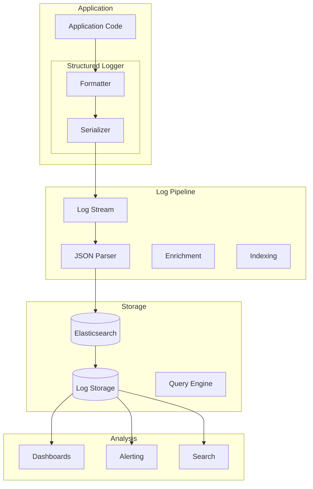

# Structured Logging Patterns

## Overview

Structured logging is an approach where log events are written as structured data, typically in JSON format, rather than plain text. This approach enables automated parsing, filtering, and analysis of logs, making it essential for production microservice environments where logs must be processed by automated systems.

In traditional monolithic applications, logging was primarily for human consumption. Developers would read log files to understand application behavior during debugging. In microservices architectures, where services may produce thousands of log entries per second, this approach is impractical. Structured logging transforms logs into data that can be processed by log aggregation systems, enabling automated analysis.

The key benefit of structured logging is enabling machines to parse and analyze log data. When logs are structured as JSON, log aggregation systems can extract specific fields, filter by field values, and aggregate across log entries. This enables features like error rate tracking, latency correlation, and automated alerting.

## Structured Log Format

A structured log entry consists of several standard fields that provide context about the logged event. Understanding these fields enables consistent logging across services.

**Timestamp**: The time when the log event occurred, typically in ISO 8601 format. The timestamp should be accurate to the millisecond and include timezone information when possible. Using UTC for timestamps prevents confusion in distributed systems.

**Level**: The severity level of the log event, typically one of DEBUG, INFO, WARN, ERROR, or FATAL. The level enables filtering based on severity and configuring different retention policies for different levels.

**Message**: A human-readable description of the logged event. The message should be a complete sentence that describes what happened, written as if it were being read by a person.

**Context**: Additional fields that provide context about the event, such as request IDs, user IDs, operation names, and resource identifiers. These fields enable filtering and correlation of related log entries.

## Architecture



The structured logging architecture consists of a logging library that formats and serializes log entries, a transport layer that forwards logs to aggregation infrastructure, and storage systems that enable search and analysis. Each component must properly handle structured data.

## Java Implementation

```java
import com.fasterxml.jackson.databind.ObjectMapper;
import com.fasterxml.jackson.annotation.JsonInclude;
import com.fasterxml.jackson.annotation.JsonProperty;
import java.time.Instant;
import java.time.ZoneOffset;
import java.time.format.DateTimeFormatter;
import java.util.Map;
import java.util.HashMap;
import java.util.concurrent.ConcurrentHashMap;
import java.util.logging.Handler;
import java.util.logging.LogRecord;
import java.util.logging.Formatter;
import java.util.logging.Level;
import java.util.function.Supplier;
import java.io.OutputStream;
import java.io.ByteArrayOutputStream;
import java.io.IOException;

public class StructuredLoggingExample {
    
    private static final ObjectMapper objectMapper = new ObjectMapper()
        .setSerializationInclusion(JsonInclude.Include.NON_NULL);
    
    private static final DateTimeFormatter timestampFormatter = 
        DateTimeFormatter.ISO_OFFSET_DATE_TIME;
    
    public static class StructuredLogEntry {
        @JsonProperty("timestamp")
        public String timestamp;
        
        @JsonProperty("level")
        public String level;
        
        @JsonProperty("message")
        public String message;
        
        @JsonProperty("service")
        public String service;
        
        @JsonProperty("version")
        public String version;
        
        @JsonProperty("environment")
        public String environment;
        
        @JsonProperty("trace_id")
        public String traceId;
        
        @JsonProperty("span_id")
        public String spanId;
        
        @JsonProperty("user_id")
        public String userId;
        
        @JsonProperty("request_id")
        public String requestId;
        
        @JsonProperty("operation")
        public String operation;
        
        @JsonProperty("duration_ms")
        public Long durationMs;
        
        @JsonProperty("context")
        public Map<String, Object> context;
        
        @JsonProperty("error")
        public ErrorDetail error;
        
        public static class ErrorDetail {
            @JsonProperty("type")
            public String type;
            
            @JsonProperty("message")
            public String message;
            
            @JsonProperty("stack_trace")
            public String stackTrace;
        }
        
        public String toJson() throws IOException {
            return objectMapper.writeValueAsString(this);
        }
    }
    
    public static class StructuredLogger {
        
        private final String serviceName;
        private final String serviceVersion;
        private final String environment;
        private final ThreadLocal<LogContext> contextHolder = new ThreadLocal<>();
        
        public StructuredLogger(String serviceName, String serviceVersion, 
                               String environment) {
            this.serviceName = serviceName;
            this.serviceVersion = serviceVersion;
            this.environment = environment;
        }
        
        public void setContext(String traceId, String spanId, String userId) {
            LogContext ctx = contextHolder.get();
            if (ctx == null) {
                ctx = new LogContext();
                contextHolder.set(ctx);
            }
            ctx.traceId = traceId;
            ctx.spanId = spanId;
            ctx.userId = userId;
        }
        
        public void clearContext() {
            contextHolder.remove();
        }
        
        public void debug(String message, Map<String, Object> context) {
            log(Level.DEBUG, message, context, null);
        }
        
        public void info(String message, Map<String, Object> context) {
            log(Level.INFO, message, context, null);
        }
        
        public void warn(String message, Map<String, Object> context) {
            log(Level.WARNING, message, context, null);
        }
        
        public void error(String message, Throwable error, Map<String, Object> context) {
            log(Level.SEVERE, message, context, error);
        }
        
        public void logOperation(String operation, long durationMs, boolean success,
                            Map<String, Object> operationContext) {
            Map<String, Object> ctx = new HashMap<>(operationContext);
            ctx.put("success", success);
            ctx.put("duration_ms", durationMs);
            
            String message = String.format("Operation %s %s in %dms", 
                operation, success ? "completed" : "failed", durationMs);
            
            if (success) {
                info(message, ctx);
            } else {
                warn(message, ctx);
            }
        }
        
        private void log(Level level, String message, Map<String, Object> context,
                       Throwable error) {
            LogContext ctx = contextHolder.get();
            
            StructuredLogEntry entry = new StructuredLogEntry();
            entry.timestamp = Instant.now().atOffset(ZoneOffset.UTC)
                .format(timestampFormatter);
            entry.level = level.getName();
            entry.message = message;
            entry.service = serviceName;
            entry.version = serviceVersion;
            entry.environment = environment;
            
            if (ctx != null) {
                entry.traceId = ctx.traceId;
                entry.spanId = ctx.spanId;
                entry.userId = ctx.userId;
            }
            
            if (context != null) {
                entry.context = context;
            }
            
            if (error != null) {
                entry.error = new StructuredLogEntry.ErrorDetail();
                entry.error.type = error.getClass().getName();
                entry.error.message = error.getMessage();
                entry.error.stackTrace = getStackTrace(error);
            }
            
            outputLog(entry);
        }
        
        private void outputLog(StructuredLogEntry entry) {
            try {
                String json = entry.toJson();
                System.out.println(json);
            } catch (IOException e) {
                System.err.println("Failed to serialize log entry: " + e.getMessage());
            }
        }
        
        private String getStackTrace(Throwable error) {
            ByteArrayOutputStream baos = new ByteArrayOutputStream();
            try {
                error.printStackTrace(new java.io.PrintWriter(baos));
                return baos.toString();
            } catch (Exception e) {
                return "(stack trace unavailable)";
            }
        }
    }
    
    public static class LogContext {
        public String traceId;
        public String spanId;
        public String userId;
    }
    
    public static void main(String[] args) throws Exception {
        StructuredLogger logger = new StructuredLogger(
            "order-service", "1.0.0", "production"
        );
        
        logger.setContext("abc123", "span456", "user789");
        
        Map<String, Object> orderContext = new HashMap<>();
        orderContext.put("order_id", "ORD-12345");
        orderContext.put("amount", 99.99);
        
        logger.info("Order created", orderContext);
        
        Map<String, Object> paymentContext = new HashMap<>();
        paymentContext.put("payment_method", "credit_card");
        paymentContext.put("transaction_id", "TXN-67890");
        
        logger.info("Payment processed", paymentContext);
        
        try {
            throw new RuntimeException("Payment declined");
        } catch (RuntimeException e) {
            logger.error("Payment processing failed", e, paymentContext);
        }
        
        long startTime = System.currentTimeMillis();
        
        logger.logOperation("processOrder", 150, true, orderContext);
        
        logger.clearContext();
    }
}
```

## Python Implementation

```python
import json
import logging
import traceback
from datetime import datetime, timezone
from dataclasses import dataclass, field, asdict
from typing import Dict, Any, Optional, List
from enum import Enum
import threading
import time
import uuid


class LogLevel(Enum):
    DEBUG = "DEBUG"
    INFO = "INFO"
    WARN = "WARN"
    ERROR = "ERROR"
    FATAL = "FATAL"


@dataclass
class StructuredLogEntry:
    timestamp: str
    level: str
    message: str
    service: str
    version: str
    environment: str
    trace_id: Optional[str] = None
    span_id: Optional[str] = None
    user_id: Optional[str] = None
    request_id: Optional[str] = None
    operation: Optional[str] = None
    duration_ms: Optional[int] = None
    context: Optional[Dict[str, Any]] = None
    error: Optional[Dict[str, Any]] = None
    
    def to_json(self) -> str:
        return json.dumps(asdict(self), default=lambda o: None)


class LogContext:
    """Thread-local log context."""
    
    def __init__(self):
        self.trace_id: Optional[str] = None
        self.span_id: Optional[str] = None
        self.user_id: Optional[str] = None
        self.request_id: Optional[str] = None


class StructuredLogger:
    """Structured logger implementation."""
    
    def __init__(self, service_name: str, service_version: str, 
                 environment: str):
        self.service_name = service_name
        self.service_version = service_version
        self.environment = environment
        self._context = threading.local()
    
    def set_context(self, trace_id: Optional[str] = None,
                  span_id: Optional[str] = None,
                  user_id: Optional[str] = None,
                  request_id: Optional[str] = None):
        """Set log context for current execution."""
        if not hasattr(self._context, 'data'):
            self._context.data = LogContext()
        
        self._context.data.trace_id = trace_id
        self._context.data.span_id = span_id
        self._context.data.user_id = user_id
        self._context.data.request_id = request_id
    
    def clear_context(self):
        """Clear log context."""
        if hasattr(self._context, 'data'):
            delattr(self._context, 'data')
    
    def _get_context(self) -> LogContext:
        """Get current log context."""
        if hasattr(self._context, 'data'):
            return self._context.data
        return LogContext()
    
    def _create_entry(self, level: LogLevel, message: str,
                     context: Optional[Dict[str, Any]] = None,
                     error: Optional[Exception] = None) -> StructuredLogEntry:
        """Create a structured log entry."""
        ctx = self._get_context()
        
        entry = StructuredLogEntry(
            timestamp=datetime.now(timezone.utc).isoformat(),
            level=level.value,
            message=message,
            service=self.service_name,
            version=self.service_version,
            environment=self.environment,
            trace_id=ctx.trace_id,
            span_id=ctx.span_id,
            user_id=ctx.user_id,
            request_id=ctx.request_id,
            context=context
        )
        
        if error:
            entry.error = {
                'type': type(error).__name__,
                'message': str(error),
                'stack_trace': traceback.format_exc()
            }
        
        return entry
    
    def _log(self, level: LogLevel, message: str,
             context: Optional[Dict[str, Any]] = None,
             error: Optional[Exception] = None):
        """Log a structured entry."""
        entry = self._create_entry(level, message, context, error)
        self._output(entry)
    
    def _output(self, entry: StructuredLogEntry):
        """Output log entry."""
        print(json.dumps(asdict(entry), default=lambda o: None))
    
    def debug(self, message: str, context: Optional[Dict[str, Any]] = None):
        """Log debug message."""
        self._log(LogLevel.DEBUG, message, context)
    
    def info(self, message: str, context: Optional[Dict[str, Any]] = None):
        """Log info message."""
        self._log(LogLevel.INFO, message, context)
    
    def warn(self, message: str, context: Optional[Dict[str, Any]] = None):
        """Log warning message."""
        self._log(LogLevel.WARN, message, context)
    
    def error(self, message: str, error: Optional[Exception] = None,
             context: Optional[Dict[str, Any]] = None):
        """Log error message."""
        self._log(LogLevel.ERROR, message, context, error)
    
    def log_operation(self, operation: str, duration_ms: int, success: bool,
                     operation_context: Optional[Dict[str, Any]] = None):
        """Log an operation result."""
        ctx = operation_context or {}
        ctx['success'] = success
        ctx['duration_ms'] = duration_ms
        
        message = f"Operation {operation} {'completed' if success else 'failed'} " \
                  f"in {duration_ms}ms"
        
        if success:
            self.info(message, ctx)
        else:
            self.warn(message, ctx)
    
    def log_request(self, operation: str, duration_ms: int,
                   status_code: int, context: Optional[Dict[str, Any]] = None):
        """Log an HTTP request."""
        ctx = context or {}
        ctx['operation'] = operation
        ctx['duration_ms'] = duration_ms
        ctx['status_code'] = status_code
        
        message = f"HTTP {operation} completed with status {status_code}"
        
        if status_code >= 500:
            self.error(message, None, ctx)
        elif status_code >= 400:
            self.warn(message, ctx)
        else:
            self.info(message, ctx)


class StructuredJsonFormatter(logging.Formatter):
    """JSON formatter for Python logging."""
    
    def __init__(self, service_name: str, service_version: str,
                 environment: str):
        super().__init__()
        self.service_name = service_name
        self.service_version = service_version
        self.environment = environment
    
    def format(self, record: logging.LogRecord) -> str:
        """Format log record as JSON."""
        entry = StructuredLogEntry(
            timestamp=datetime.now(timezone.utc).isoformat(),
            level=record.levelname,
            message=record.getMessage(),
            service=self.service_name,
            version=self.service_version,
            environment=self.environment,
            context={'logger': record.name}
        )
        
        if record.exc_info:
            entry.error = {
                'type': record.exc_info[0].__name__,
                'message': str(record.exc_info[1]),
                'stack_trace': self.formatException(record.exc_info)
            }
        
        return json.dumps(asdict(entry), default=lambda o: None)


def configure_logging(service_name: str, service_version: str,
                     environment: str):
    """Configure structured logging."""
    handler = logging.StreamHandler()
    formatter = StructuredJsonFormatter(
        service_name, service_version, environment
    )
    handler.setFormatter(formatter)
    
    root_logger = logging.getLogger()
    root_logger.addHandler(handler)
    root_logger.setLevel(logging.INFO)


if __name__ == "__main__":
    logger = StructuredLogger("order-service", "1.0.0", "production")
    
    logger.set_context(
        trace_id="abc123",
        span_id="span456",
        user_id="user789"
    )
    
    order_context = {
        "order_id": "ORD-12345",
        "amount": 99.99
    }
    
    logger.info("Order created", order_context)
    
    payment_context = {
        "payment_method": "credit_card",
        "transaction_id": "TXN-67890"
    }
    
    logger.info("Payment processed", payment_context)
    
    try:
        raise ValueError("Payment declined")
    except ValueError as e:
        logger.error("Payment processing failed", e, payment_context)
    
    duration = int((time.time() - time.time()) * 1000)
    logger.log_operation("processOrder", 150, True, order_context)
    
    logger.clear_context()
```

## Real-World Examples

**Spotify** uses structured JSON logging across their microservices platform, enabling automated log analysis and anomaly detection. Their logging infrastructure processes billions of log entries daily, with structured data enabling automated alerting for error patterns.

**Uber** implements structured logging to trackride lifecycle events, driver actions, and payment processing. Structured logs enable automated detection of issues like fraudulent driver behavior or payment failures.

**LinkedIn** uses structured logging to track member actions, content views, and messaging. Their logging system correlates structured events across services to understand member engagement patterns.

## Output Statement

Organizations implementing structured logging can expect: improved log analysis capabilities through automated parsing and filtering; faster incident response through correlated log search; reduced storage costs through selective indexing of key fields; and enhanced debugging capabilities through context-rich log entries.

Structured logging transforms logs from human-readable text into machine-processable data. This transformation enables observability at scale and makes automated log analysis possible.

## Best Practices

1. **Use JSON Format for All Logs**: Format all log entries as JSON to enable automated parsing. Avoid including unformatted text within JSON structures.

2. **Include Consistent Fields**: Include standard fields like timestamp, level, message, service name, and version in every log entry. This enables consistent filtering and search.

3. **Add Correlation IDs**: Include trace IDs, span IDs, and request IDs in log entries to enable correlation across services. These IDs link log entries to distributed traces.

4. **Log Business Events**: Include business context in logs, such as order IDs, user IDs, and transaction amounts. This enables business-level analysis.

5. **Use Appropriate Log Levels**: Configure log levels appropriately to balance observability with storage costs. Use DEBUG for development, INFO for normal operations, WARN for recoverable issues, and ERROR for failures.

6. **Structure Error Information**: Include error type, message, and stack trace in error log entries. Structure this information to enable automated error categorization.

7. **Configure Log Aggregation**: Configure log aggregation systems to properly parse and index structured log fields. This enables efficient search and filtering.