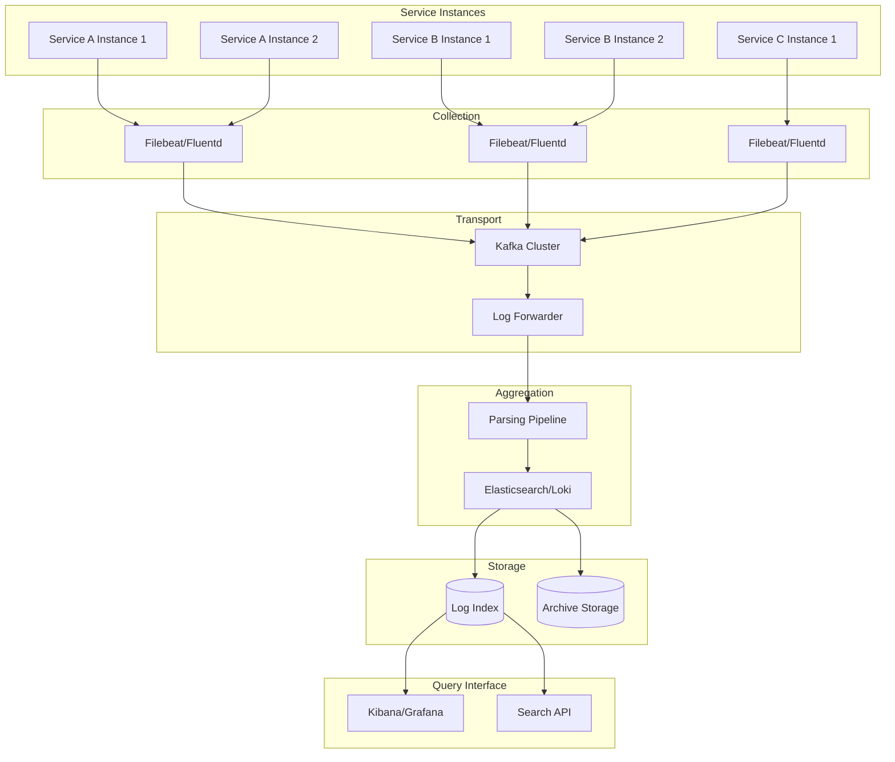

# Distributed Logging Patterns

## Overview

Distributed logging addresses the challenge of collecting, aggregating, and analyzing logs from multiple microservices running across different hosts and environments. In a microservices architecture, each service generates logs, and understanding system behavior requires correlating logs across all services.

The fundamental challenge is that a single user request may traverse dozens of services, each generating logs independently. Without distributed logging, understanding the complete request journey requires manually locating and correlating logs from each service. Distributed logging solves this by providing a unified view of logs across the system.

Effective distributed logging requires consistent log formatting, correlation mechanisms, and efficient transport and storage infrastructure. When implemented correctly, it enables teams to search and analyze logs across all services from a single interface.

## Distributed Logging Architecture

The distributed logging architecture consists of multiple layers that work together to collect, transport, store, and analyze logs from distributed services. Each layer has specific responsibilities.

**Collection Layer**: Collects logs from each service instance. This can be implemented through sidecar containers, node-level agents, or direct integration with application logging frameworks. The collection layer must handle high throughput and ensure reliable delivery.

**Transport Layer**: Forwards logs from collection points to aggregation infrastructure. Common approaches include message queues like Kafka, log forwarders like Fluentd or Filebeat, and direct HTTP ingestion. The transport layer should provide delivery guarantees and handle backpressure.

**Aggregation Layer**: Aggregates logs from multiple sources, performing parsing, enrichment, and initial processing. This layer typically runs centralized log aggregation software like Elasticsearch, Loki, or cloud-native solutions.

**Storage and Analysis Layer**: Stores logs for efficient search and analysis. This includes indexing for fast search and dashboards for visualization.

## Architecture



The distributed logging architecture uses multiple collection agents feeding into a transport layer (typically Kafka), then forwarders to the aggregation layer, and finally storage for querying.

## Java Implementation

```java
import java.io.BufferedReader;
import java.io.InputStreamReader;
import java.io.IOException;
import java.net.HttpURLConnection;
import java.net.URL;
import java.util.concurrent.CompletableFuture;
import java.util.concurrent.ExecutorService;
import java.util.concurrent.Executors;
import java.util.concurrent.BlockingQueue;
import java.util.concurrent.LinkedBlockingQueue;
import java.util.List;
import java.util.ArrayList;
import java.util.Map;
import java.util.HashMap;
import java.util.Properties;
import java.util.Enumeration;

public class DistributedLoggingExample {
    
    private static final int BATCH_SIZE = 100;
    private static final int FLUSH_INTERVAL_MS = 5000;
    
    private final BlockingQueue<LogEvent> logQueue;
    private final ExecutorService executor;
    private final String logstashHost;
    private final int logstashPort;
    private final boolean running;
    
    private static class LogEvent {
        public String timestamp;
        public String level;
        public String message;
        public String service;
        public String host;
        public String instance;
        public Map<String, Object> fields;
        
        public LogEvent(String timestamp, String level, String message,
                      String service, String host, String instance) {
            this.timestamp = timestamp;
            this.level = level;
            this.message = message;
            this.service = service;
            this.host = host;
            this.instance = instance;
            this.fields = new HashMap<>();
        }
    }
    
    public DistributedLoggingExample(String logstashHost, int logstashPort) {
        this.logstashHost = logstashHost;
        this.logstashPort = logstashPort;
        this.logQueue = new LinkedBlockingQueue<>(10000);
        this.executor = Executors.newSingleThreadExecutor();
        this.running = true;
        
        startLogShipper();
    }
    
    private void startLogShipper() {
        executor.submit(() -> {
            List<LogEvent> batch = new ArrayList<>();
            
            while (running) {
                try {
                    LogEvent event = logQueue.poll(FLUSH_INTERVAL_MS, 
                        java.util.concurrent.TimeUnit.MILLISECONDS);
                    
                    if (event != null) {
                        batch.add(event);
                    }
                    
                    while (batch.size() < BATCH_SIZE && 
                           logQueue.drainTo(batch, BATCH_SIZE - batch.size()) > 0) {
                    }
                    
                    if (!batch.isEmpty()) {
                        shipBatch(new ArrayList<>(batch));
                        batch.clear();
                    }
                } catch (InterruptedException e) {
                    Thread.currentThread().interrupt();
                    break;
                } catch (Exception e) {
                    System.err.println("Log shipping error: " + e.getMessage());
                }
            }
        });
    }
    
    private void shipBatch(List<LogEvent> events) {
        try {
            URL url = new URL("http://" + logstashHost + ":" + logstashPort + 
                           "/_bulk");
            HttpURLConnection conn = (HttpURLConnection) url.openConnection();
            conn.setRequestMethod("POST");
            conn.setRequestProperty("Content-Type", "application/json");
            conn.setDoOutput(true);
            
            StringBuilder json = new StringBuilder();
            for (LogEvent event : events) {
                json.append("{\"index\":{\"_index\":\"logs-");
                json.append(event.service).append("\"}}\n");
                json.append(toJson(event)).append("\n");
            }
            
            byte[] data = json.toString().getBytes();
            conn.getOutputStream().write(data);
            
            int response = conn.getResponseCode();
            if (response != 200 && response != 201) {
                System.err.println("Failed to ship logs: " + response);
            }
        } catch (Exception e) {
            System.err.println("Shipping error: " + e.getMessage());
            retryFailedEvents(events);
        }
    }

    private void retryFailedEvents(List<LogEvent> events) {
        for (LogEvent event : events) {
            try {
                logQueue.put(event);
            } catch (InterruptedException e) {
                Thread.currentThread().interrupt();
                break;
            }
        }
    }
    
    private String toJson(LogEvent event) {
        StringBuilder sb = new StringBuilder();
        sb.append("{");
        sb.append("\"timestamp\":\"").append(event.timestamp).append("\",");
        sb.append("\"level\":\"").append(event.level).append("\",");
        sb.append("\"message\":\"").append(escapeJson(event.message)).append("\",");
        sb.append("\"service\":\"").append(event.service).append("\",");
        sb.append("\"host\":\"").append(event.host).append("\",");
        sb.append("\"instance\":\"").append(event.instance).append("\"");
        
        if (!event.fields.isEmpty()) {
            sb.append(",\"fields\":{");
            boolean first = true;
            for (Map.Entry<String, Object> entry : event.fields.entrySet()) {
                if (!first) sb.append(",");
                sb.append("\"").append(entry.getKey()).append("\":\"");
                sb.append(escapeJson(entry.getValue().toString())).append("\"");
                first = false;
            }
            sb.append("}");
        }
        
        sb.append("}");
        return sb.toString();
    }
    
    private String escapeJson(String s) {
        return s.replace("\\", "\\\\")
                .replace("\"", "\\\"")
                .replace("\n", "\\n")
                .replace("\r", "\\r")
                .replace("\t", "\\t");
    }
    
    public void log(String level, String service, String message, 
                 Map<String, Object> fields) {
        LogEvent event = new LogEvent(
            java.time.Instant.now().toString(),
            level,
            message,
            service,
            getHostName(),
            getInstanceId()
        );
        
        if (fields != null) {
            event.fields.putAll(fields);
        }
        
        try {
            logQueue.put(event);
        } catch (InterruptedException e) {
            Thread.currentThread().interrupt();
        }
    }
    
    private String getHostName() {
        try {
            return java.net.InetAddress.getLocalHost().getHostName();
        } catch (Exception e) {
            return "unknown";
        }
    }
    
    private String getInstanceId() {
        String id = System.getenv("INSTANCE_ID");
        return id != null ? id : java.util.UUID.randomUUID().toString();
    }
    
    public void shutdown() {
        running = false;
        executor.shutdown();
    }
}


class LogFileWatcher {
    
    private final String serviceName;
    private final BlockingQueue<String> logLines;
    
    public LogFileWatcher(String serviceName, BlockingQueue<String> logLines) {
        this.serviceName = serviceName;
        this.logLines = logLines;
    }
    
    public void watch(String logFile) throws IOException {
        ProcessBuilder pb = new ProcessBuilder("tail", "-f", logFile);
        pb.redirectErrorStream(true);
        Process process = pb.start();
        
        BufferedReader reader = new BufferedReader(
            new InputStreamReader(process.getInputStream())
        );
        
        String line;
        while ((line = reader.readLine()) != null) {
            if (!line.isEmpty()) {
                logLines.offer(line);
            }
        }
    }
}
```

## Python Implementation

```python
import json
import logging
import threading
import time
import socket
import os
from typing import Dict, List, Optional, Any
from collections import deque
from dataclasses import dataclass, field, asdict
from datetime import datetime, timezone
import queue
import requests


class DistributedLogger:
    """Distributed logging client."""
    
    def __init__(self, 
                 logstash_hosts: List[str],
                 service_name: str,
                 batch_size: int = 100,
                 flush_interval: float = 5.0):
        self.logstash_hosts = logstash_hosts
        self.service_name = service_name
        self.batch_size = batch_size
        self.flush_interval = flush_interval
        
        self._queue = queue.Queue(maxsize=10000)
        self._running = False
        self._worker_thread = None
        self._host = socket.gethostname()
        self._instance_id = os.environ.get('INSTANCE_ID', socket.gethostname())
    
    def start(self):
        """Start the log shipper."""
        self._running = True
        self._worker_thread = threading.Thread(
            target=self._ship_loop,
            daemon=True
        )
        self._worker_thread.start()
    
    def stop(self):
        """Stop the log shipper."""
        self._running = False
        if self._worker_thread:
            self._worker_thread.join(timeout=10)
    
    def _ship_loop(self):
        """Main shipping loop."""
        batch = []
        
        while self._running:
            try:
                event = self._queue.get(timeout=self.flush_interval)
                batch.append(event)
                
                while len(batch) < self.batch_size:
                    try:
                        event = self._queue.get_nowait()
                        batch.append(event)
                    except queue.Empty:
                        break
                
                if batch:
                    self._ship_batch(batch)
                    batch = []
                    
            except queue.Empty:
                if batch:
                    self._ship_batch(batch)
                    batch = []
            except Exception as e:
                print(f"Shipping error: {e}")
                time.sleep(1)
    
    def _ship_batch(self, events: List[Dict]):
        """Ship a batch of events."""
        for host in self.logstash_hosts:
            try:
                url = f"http://{host}/_bulk"
                data = self._format_ndjson(events)
                
                response = requests.post(
                    url,
                    data=data,
                    headers={'Content-Type': 'application/json'},
                    timeout=5
                )
                
                if response.status_code in (200, 201):
                    return
                    
            except Exception as e:
                continue
        
        for event in events:
            try:
                self._queue.put(event, block=False)
            except queue.Full:
                pass
    
    def _format_ndjson(self, events: List[Dict]) -> str:
        """Format events as NDJSON."""
        lines = []
        for event in events:
            index_line = json.dumps({
                'index': {
                    '_index': f'logs-{self.service_name}'
                }
            })
            event_line = json.dumps(event)
            lines.append(index_line)
            lines.append(event_line)
        
        return '\n'.join(lines) + '\n'
    
    def log(self, level: str, message: str, 
            extra_fields: Optional[Dict[str, Any]] = None):
        """Log an event."""
        event = {
            'timestamp': datetime.now(timezone.utc).isoformat(),
            'level': level,
            'message': message,
            'service': self.service_name,
            'host': self._host,
            'instance': self._instance_id
        }
        
        if extra_fields:
            event['fields'] = extra_fields
        
        try:
            self._queue.put(event, block=False)
        except queue.Full:
            pass
    
    def debug(self, message: str, **kwargs):
        """Log debug message."""
        self.log('DEBUG', message, kwargs)
    
    def info(self, message: str, **kwargs):
        """Log info message."""
        self.log('INFO', message, kwargs)
    
    def warn(self, message: str, **kwargs):
        """Log warning message."""
        self.log('WARN', message, kwargs)
    
    def error(self, message: str, **kwargs):
        """Log error message."""
        self.log('ERROR', message, kwargs)


class LogFileShipper:
    """Ship logs from a file."""
    
    def __init__(self, logger: DistributedLogger, log_file: str):
        self.logger = logger
        self.log_file = log_file
        self._running = False
        self._thread = None
        self._position = 0
    
    def start(self):
        """Start shipping logs from file."""
        self._running = True
        self._thread = threading.Thread(
            target=self._watch_loop,
            daemon=True
        )
        self._thread.start()
    
    def stop(self):
        """Stop shipping logs."""
        self._running = False
        if self._thread:
            self._thread.join(timeout=5)
    
    def _watch_loop(self):
        """Watch log file and ship new lines."""
        import subprocess
        
        try:
            process = subprocess.Popen(
                ['tail', '-f', self.log_file],
                stdout=subprocess.PIPE,
                stderr=subprocess.PIPE,
                text=True
            )
            
            while self._running:
                line = process.stdout.readline()
                if not line:
                    break
                
                self._parse_and_ship(line.strip())
                
        except Exception as e:
            print(f"Error watching log file: {e}")
    
    def _parse_and_ship(self, line: str):
        """Parse log line and ship."""
        try:
            if line.startswith('{'):
                event = json.loads(line)
                self.logger.log('INFO', event.get('message', ''), event)
            else:
                parts = line.split(None, 4)
                if len(parts) >= 4:
                    level = parts[2]
                    message = parts[3]
                    self.logger.log(level, message)
        except json.JSONDecodeError:
            self.logger.log('INFO', line)


class FluentdForwarder:
    """Forwarder using Fluentd protocol."""
    
    def __init__(self, fluentd_host: str, fluentd_port: int,
                 tag: str):
        self.fluentd_host = fluentd_host
        self.fluentd_port = fluentd_port
        self.tag = tag
    
    def forward(self, events: List[Dict]):
        """Forward events to Fluentd."""
        import msgpack
        
        messages = []
        for event in events:
            messages.append(msgpack.packb(event))
        
        data = b''.join([
            self._format_tagged_message(self.tag, msg) 
            for msg in messages
        ])
        
        import socket
        sock = socket.socket(socket.AF_INET, socket.SOCK_STREAM)
        try:
            sock.connect((self.fluentd_host, self.fluentd_port))
            sock.sendall(data)
        finally:
            sock.close()
    
    def _format_tagged_message(self, tag: str, message: bytes) -> bytes:
        """Format message with Fluentd tag."""
        import msgpack
        return msgpack.packb([tag, message]) + b'\n'


def configure_distributed_logging(logstash_hosts: List[str],
                              service_name: str,
                              environment: str):
    """Configure distributed logging."""
    logger = DistributedLogger(
        logstash_hosts=logstash_hosts,
        service_name=service_name
    )
    logger.start()
    
    logging.getLogger().addHandler(
        DistributedLoggingHandler(logger)
    )
    
    return logger


class DistributedLoggingHandler(logging.Handler):
    """Python logging handler for distributed logging."""
    
    def __init__(self, logger: DistributedLogger):
        super().__init__()
        self.logger = logger
    
    def emit(self, record: logging.LogRecord):
        """Emit a log record."""
        level = record.levelname
        message = self.format(record)
        
        extra = {}
        if hasattr(record, 'trace_id'):
            extra['trace_id'] = record.trace_id
        
        self.logger.log(level, message, extra)


if __name__ == "__main__":
    logger = DistributedLogger(
        logstash_hosts=["logstash:5044"],
        service_name="order-service"
    )
    logger.start()
    
    logger.info("Service started", order_service="order-service")
    logger.info("Order processed", order_id="ORD-12345", status="completed")
    logger.error("Payment failed", order_id="ORD-12345", error="insufficient_funds")
    
    time.sleep(2)
    logger.stop()
```

## Real-World Examples

**Airbnb** uses their own log aggregation system called "Piper" to collect logs from thousands of microservices. The system processes petabytes of log data daily, providing unified search and alerting across all services.

**Shopify** implements distributed logging through their "Steno" logging framework, which provides consistent logging across their Ruby microservices platform. Logs are shipped to Elasticsearch and queried through Kibana.

**Netflix** uses distributed logging through their "Titus" container management platform, which integrates with their centralized logging infrastructure. Logs are processed in real time to detect issues.

## Output Statement

Organizations implementing distributed logging can expect: unified log search across all services from a single interface; improved incident response through correlated log analysis; proactive alerting based on patterns across services; and historical log analysis for capacity planning and trend analysis.

Distributed logging is essential for microservices observability. Without it, understanding system behavior requires manually accessing logs from each service, which is impractical at scale.

## Best Practices

1. **Use Consistent Log Format**: Use structured JSON logging across all services for consistent parsing and search. Ensure all services use the same field names for common attributes.

2. **Implement Reliable Shipping**: Use durable message queues like Kafka for log transport to ensure delivery even during temporary failures. Implement retry logic for failed shipments.

3. **Correlate Logs Across Services**: Include correlation IDs (trace IDs, request IDs) in all log entries to enable correlation across service boundaries.

4. **Implement Log Indexing**: Configure appropriate indexing for frequently searched fields to enable fast search. Avoid indexing large text fields to reduce storage costs.

5. **Use Log Shippers**: Deploy log shippers (Fluentd, Filebeat) as sidecars or node-level agents to handle log collection reliability.

6. **Configure Retention Policies**: Configure log retention based on compliance requirements and storage costs. Archive older logs to cheaper storage.