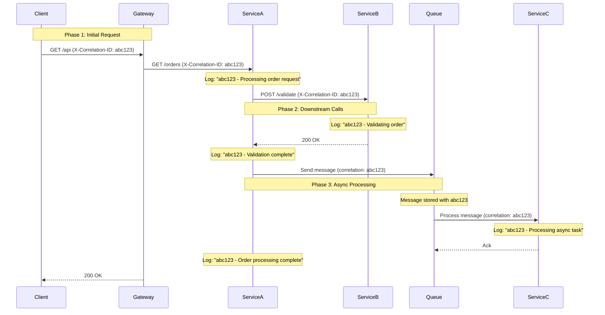

# Log Correlation Patterns

## Overview

Log correlation is the practice of linking related log entries together to understand the complete journey of a request across multiple services. In microservices architectures, a single user request may generate log entries in dozens of services, making correlation essential for understanding system behavior and debugging issues.

The core of log correlation is the correlation ID, a unique identifier that is passed with the request and included in all log entries. This ID enables teamsto find all log entries related to a specific request, regardless of which service generated them.

Effective log correlation requires consistent implementation across services, proper propagation through all communication channels (HTTP, message queues, async operations), and support in log aggregation systems for correlation-based search.

## Correlation ID Flow

When a request enters a system, a correlation ID is generated and propagated through all downstream service calls. The flow ensures that all log entries related to the request share the same correlation ID.

The correlation ID originates with the initial request (often from an API gateway) and is passed through HTTP headers, message headers, or other communication protocols. Each service extracts the correlation ID from the incoming request, includes it in its log entries, and passes it to outgoing requests.

For asynchronous processing, the correlation ID must be stored with the message and included in logs when the message is processed. This ensures correlation even when processing happens at a different time.

## Architecture



The correlation ID flows through the request chain, enabling log entries to be correlated across all services and processing stages.

## Implementation Java

```java
import java.util.UUID;
import java.util.concurrent.ConcurrentHashMap;
import java.util.Map;
import java.util.HashMap;
import java.util.function.Supplier;
import java.io.IOException;
import java.net.InetAddress;
import java.net.UnknownHostException;

public class LogCorrelationExample {
    
    public static final String CORRELATION_ID_HEADER = "X-Correlation-ID";
    public static final String DEFAULT_CORRELATION_ID = "trace_id";
    
    private static final ThreadLocal<String> correlationIdHolder = 
        new ThreadLocal<>();
    private static final Map<String, RequestContext> contexts = 
        new ConcurrentHashMap<>();
    
    public static class RequestContext {
        public final String correlationId;
        public final String serviceName;
        public final String instanceId;
        public final long startTime;
        public Map<String, Object> attributes;
        
        public RequestContext(String correlationId, String serviceName) {
            this.correlationId = correlationId;
            this.serviceName = serviceName;
            this.instanceId = getInstanceId();
            this.startTime = System.currentTimeMillis();
            this.attributes = new HashMap<>();
        }
    }
    
    public static void setCorrelationId(String correlationId) {
        correlationIdHolder.set(correlationId);
    }
    
    public static String getCorrelationId() {
        String id = correlationIdHolder.get();
        return id != null ? id : generateCorrelationId();
    }
    
    public static String generateCorrelationId() {
        return UUID.randomUUID().toString().replace("-", "");
    }
    
    public static void clearCorrelationId() {
        correlationIdHolder.remove();
    }
    
    public static void startContext(String serviceName) {
        String correlationId = getCorrelationId();
        RequestContext ctx = new RequestContext(correlationId, serviceName);
        contexts.put(correlationId, ctx);
    }
    
    public static void endContext(String correlationId) {
        contexts.remove(correlationId);
    }
    
    public static RequestContext getContext(String correlationId) {
        return contexts.get(correlationId);
    }
    
    public static Map<String, Object> getCorrelationContext() {
        Map<String, Object> ctx = new HashMap<>();
        String correlationId = getCorrelationId();
        
        ctx.put("correlation_id", correlationId);
        ctx.put("service_name", getServiceName());
        ctx.put("instance_id", getInstanceId());
        
        RequestContext requestCtx = contexts.get(correlationId);
        if (requestCtx != null) {
            long duration = System.currentTimeMillis() - requestCtx.startTime;
            ctx.put("duration_ms", duration);
            
            if (requestCtx.attributes != null) {
                ctx.putAll(requestCtx.attributes);
            }
        }
        
        return ctx;
    }
    
    public static void setAttribute(String key, Object value) {
        String correlationId = getCorrelationId();
        RequestContext ctx = contexts.get(correlationId);
        if (ctx != null) {
            ctx.attributes.put(key, value);
        }
    }
    
    private static String getServiceName() {
        String name = System.getenv("SERVICE_NAME");
        return name != null ? name : "unknown-service";
    }
    
    private static String getInstanceId() {
        String id = System.getenv("INSTANCE_ID");
        if (id == null) {
            try {
                id = InetAddress.getLocalHost().getHostName();
            } catch (UnknownHostException e) {
                id = UUID.randomUUID().toString();
            }
        }
        return id;
    }
}


class CorrelationFilter {
    
    public String extractCorrelationId(Map<String, String> headers) {
        String correlationId = headers.get(LogCorrelationExample.CORRELATION_ID_HEADER);
        
        if (correlationId == null || correlationId.isEmpty()) {
            correlationId = headers.get(LogCorrelationExample.DEFAULT_CORRELATION_ID);
        }
        
        return correlationId != null ? correlationId : 
            LogCorrelationExample.generateCorrelationId();
    }
    
    public Map<String, String> addCorrelationId(Map<String, String> headers) {
        Map<String, String> result = new HashMap<>(headers);
        String correlationId = LogCorrelationExample.getCorrelationId();
        result.put(LogCorrelationExample.CORRELATION_ID_HEADER, correlationId);
        return result;
    }
}


class HttpClientWithCorrelation {
    
    private final org.apache.http.impl.client.CloseableHttpClient httpClient;
    
    public HttpClientWithCorrelation() {
        this.httpClient = org.apache.http.impl.client.HttpClients.createDefault();
    }
    
    public String get(String url, Map<String, String> headers) throws IOException {
        String correlationId = LogCorrelationExample.getCorrelationId();
        
        Map<String, String> requestHeaders = new HashMap<>(headers);
        requestHeaders.put(LogCorrelationExample.CORRELATION_ID_HEADER, correlationId);
        
        org.apache.http.client.methods.HttpGet request = 
            new org.apache.http.client.methods.HttpGet(url);
        
        for (Map.Entry<String, String> entry : requestHeaders.entrySet()) {
            request.setHeader(entry.getKey(), entry.getValue());
        }
        
        try (org.apache.http.impl.client.CloseableHttpResponse response = 
             httpClient.execute(request)) {
            return org.apache.http.util.EntityUtils.toString(
                response.getEntity()
            );
        }
    }
}


class MessageProducerWithCorrelation {
    
    public void sendMessage(String topic, String message, 
                         Map<String, Object> properties) {
        String correlationId = LogCorrelationExample.getCorrelationId();
        
        Map<String, Object> messageProperties = new HashMap<>(properties);
        messageProperties.put(LogCorrelationExample.CORRELATION_ID_HEADER, 
                            correlationId);
        messageProperties.put("correlation_id", correlationId);
        
        sendToKafka(topic, message, messageProperties);
    }
    
    private void sendToKafka(String topic, String message, 
                         Map<String, Object> properties) {
        // Kafka producer implementation
    }
}


class MessageConsumerWithCorrelation {
    
    public void processMessage(Map<String, Object> message) {
        String correlationId = (String) message.get("correlation_id");
        
        if (correlationId != null) {
            LogCorrelationExample.setCorrelationId(correlationId);
        }
        
        try {
            handleMessage(message);
        } finally {
            LogCorrelationExample.clearCorrelationId();
        }
    }
    
    private void handleMessage(Map<String, Object> message) {
        // Message handling logic
    }
}


public class CorrelationLoggingExample {
    
    public static void main(String[] args) {
        String orderId = "ORD-12345";
        String userId = "user-456";
        
        LogCorrelationExample.setCorrelationId("abc-123-def");
        
        LogCorrelationExample.startContext("order-service");
        LogCorrelationExample.setAttribute("order_id", orderId);
        LogCorrelationExample.setAttribute("user_id", userId);
        
        log("Processing order request", "order_id", orderId);
        
        String downstreamUri = "/inventory/check";
        Map<String, String> headers = new HashMap<>();
        CorrelationFilter filter = new CorrelationFilter();
        Map<String, String> downstreamHeaders = filter.addCorrelationId(headers);
        
        log("Calling inventory service", "downstream_service", "inventory", 
            "uri", downstreamUri);
        
        log("Inventory check complete", "available", true);
        
        Map<String, Object> message = new HashMap<>();
        message.put("order_id", orderId);
        MessageProducerWithCorrelation producer = new MessageProducerWithCorrelation();
        producer.sendMessage("order-notifications", "Order placed", message);
        
        log("Order processing complete", "status", "completed");
        
        LogCorrelationExample.endContext("abc-123-def");
    }
    
    private static void log(String message, Object... context) {
        Map<String, Object> ctx = LogCorrelationExample.getCorrelationContext();
        
        for (int i = 0; i < context.length - 1; i += 2) {
            ctx.put(context[i].toString(), context[i + 1]);
        }
        
        ctx.put("message", message);
        
        System.out.println(json(ctx));
    }
    
    private static String json(Map<String, Object> map) {
        try {
            return new com.fasterxml.jackson.databind.ObjectMapper()
                .writeValueAsString(map);
        } catch (Exception e) {
            return map.toString();
        }
    }
}
```

## Implementation Python

```python
import uuid
import threading
import json
import time
from typing import Dict, Optional, Any, List
from dataclasses import dataclass, field
from contextvars import ContextVar
import requests


correlation_id_context: ContextVar[Optional[str]] = ContextVar(
    'correlation_id', 
    default=None
)


class RequestContext:
    """Request context for correlation."""
    
    def __init__(self, correlation_id: str, service_name: str):
        self.correlation_id = correlation_id
        self.service_name = service_name
        self.instance_id = get_instance_id()
        self.start_time = time.time()
        self.attributes: Dict[str, Any] = {}
        self.trace: List[Dict] = []


def generate_correlation_id() -> str:
    """Generate a new correlation ID."""
    return uuid.uuid4().hex


def set_correlation_id(correlation_id: str):
    """Set correlation ID for current context."""
    correlation_id_context.set(correlation_id)


def get_correlation_id() -> str:
    """Get correlation ID from current context."""
    cid = correlation_id_context.get()
    return cid if cid else generate_correlation_id()


def clear_correlation_id():
    """Clear correlation ID from current context."""
    correlation_id_context.set(None)


_contexts: Dict[str, RequestContext] = {}
_contexts_lock = threading.Lock()


def start_context(service_name: str):
    """Start request context."""
    correlation_id = get_correlation_id()
    with _contexts_lock:
        _contexts[correlation_id] = RequestContext(
            correlation_id, service_name
        )


def end_context(correlation_id: str):
    """End request context."""
    with _contexts_lock:
        _contexts.pop(correlation_id, None)


def get_context(correlation_id: str) -> Optional[RequestContext]:
    """Get request context."""
    with _contexts_lock:
        return _contexts.get(correlation_id)


def set_attribute(key: str, value: Any):
    """Set attribute in current context."""
    correlation_id = get_correlation_id()
    with _contexts_lock:
        ctx = _contexts.get(correlation_id)
        if ctx:
            ctx.attributes[key] = value


def get_correlation_context() -> Dict[str, Any]:
    """Get correlation context for logging."""
    correlation_id = get_correlation_id()
    
    ctx = {
        'correlation_id': correlation_id,
        'service_name': get_service_name(),
        'instance_id': get_instance_id()
    }
    
    with _contexts_lock:
        request_ctx = _contexts.get(correlation_id)
        if request_ctx:
            duration_ms = int((time.time() - request_ctx.start_time) * 1000)
            ctx['duration_ms'] = duration_ms
            ctx['attributes'] = request_ctx.attributes
    
    return ctx


def get_service_name() -> str:
    """Get service name."""
    return os.environ.get('SERVICE_NAME', 'unknown-service')


def get_instance_id() -> str:
    """Get instance ID."""
    return os.environ.get('INSTANCE_ID', socket.gethostname())


class HTTPClientWithCorrelation:
    """HTTP client that propagates correlation IDs."""
    
    def __init__(self):
        self.session = requests.Session()
    
    def request(self, method: str, url: str, **kwargs) -> requests.Response:
        """Make HTTP request with correlation ID."""
        correlation_id = get_correlation_id()
        
        headers = kwargs.get('headers', {})
        headers['X-Correlation-ID'] = correlation_id
        kwargs['headers'] = headers
        
        ctx = get_correlation_context()
        log_request(method, url, ctx)
        
        response = self.session.request(method, url, **kwargs)
        
        return response


class KafkaProducerWithCorrelation:
    """Kafka producer that propagates correlation IDs."""
    
    def __init__(self, bootstrap_servers: List[str]):
        from kafka import KafkaProducer
        self.producer = KafkaProducer(
            bootstrap_servers=bootstrap_servers,
            value_serializer=lambda v: json.dumps(v).encode('utf-8')
        )
    
    def send(self, topic: str, value: Any, **kwargs):
        """Send message with correlation ID."""
        correlation_id = get_correlation_id()
        
        message = value if isinstance(value, dict) else {}
        message['correlation_id'] = correlation_id
        message['trace_id'] = correlation_id
        
        future = self.producer.send(topic, value=message, **kwargs)
        
        log_message(topic, message)
        
        return future


class KafkaConsumerWithCorrelation:
    """Kafka consumer that propagates correlation IDs."""
    
    def __init__(self, topics: List[str], bootstrap_servers: List[str],
                 group_id: str):
        from kafka import KafkaConsumer
        self.consumer = KafkaConsumer(
            *topics,
            bootstrap_servers=bootstrap_servers,
            group_id=group_id,
            value_deserializer=lambda m: json.loads(m.decode('utf-8')),
            auto_offset_reset='earliest'
        )
    
    def process_messages(self):
        """Process messages with correlation context."""
        for message in self.consumer:
            correlation_id = message.value.get('correlation_id')
            
            if correlation_id:
                set_correlation_id(correlation_id)
            
            try:
                handle_message(message.value)
            finally:
                clear_correlation_id()


def log(message: str, **extra):
    """Log with correlation context."""
    ctx = get_correlation_context()
    ctx['message'] = message
    ctx.update(extra)
    
    print(json.dumps(ctx))


def trace(message: str, **attributes):
    """Add trace event."""
    correlation_id = get_correlation_id()
    
    trace_event = {
        'timestamp': time.time(),
        'message': message,
        'attributes': attributes
    }
    
    with _contexts_lock:
        ctx = _contexts.get(correlation_id)
        if ctx:
            ctx.trace.append(trace_event)


if __name__ == "__main__":
    import os
    import socket
    
    import logging
    
    order_id = "ORD-12345"
    user_id = "user-456"
    
    set_correlation_id("abc123def456")
    start_context("order-service")
    set_attribute("order_id", order_id)
    set_attribute("user_id", user_id)
    
    log("Processing order request", order_id=order_id)
    
    downstream_headers = {'X-Correlation-ID': get_correlation_id()}
    log("Calling inventory service", downstream_service="inventory",
        uri="/inventory/check")
    
    log("Inventory check complete", available=True)
    
    message = {"order_id": order_id, "type": "notification"}
    log("Sending async message", topic="order-notifications")
    
    log("Order processing complete", status="completed")
    
    end_context("abc123def456")
    
    ctx = get_correlation_context()
    print(f"Correlation context: {ctx}")
```

## Real-World Examples

**Uber** uses log correlation across their microservices to track ride requests from the mobile app through all backend services. Correlation enables them to understand the complete journey and identify issues.

**DoorDash** correlates logs across their dispatch, delivery, and merchant services to track order lifecycle and identify delivery issues.

**Airbnb** uses correlation IDs to link logs across their booking, payment, and host services for incident investigation.

## Output Statement

Organizations implementing log correlation can expect: faster incident investigation through automatic log linking; reduced debugging time by finding all related logs in one search; improved understanding of request flows through trace visualization; and proactive identification of slow services through latency correlation.

Log correlation transforms distributed logging from a collection of独立 entries into a coherent narrative of system behavior.

## Best Practices

1. **Generate Correlation ID at Entry Point**: Generate correlation IDs at the API gateway or first service to ensure consistency from the start.

2. **Propagate Through All Channels**: Propagate correlation IDs through HTTP headers, message headers, and async processing contexts.

3. **Include in All Log Entries**: Include correlation ID in every log entry, regardless of level, to enable complete correlation.

4. **Use Standard Headers**: Use standard headers like X-Correlation-ID and traceparent for maximum compatibility.

5. **Store in Context**: Store correlation ID in thread-local or request context to avoid passing it through every function.

6. **Correlate with Distributed Tracing**: Use the same IDs used in distributed tracing (trace_id, span_id) for consistency.

7. **Create Correlation Dashboards**: Build dashboards that show all log entries for a correlation ID to understand request journeys.