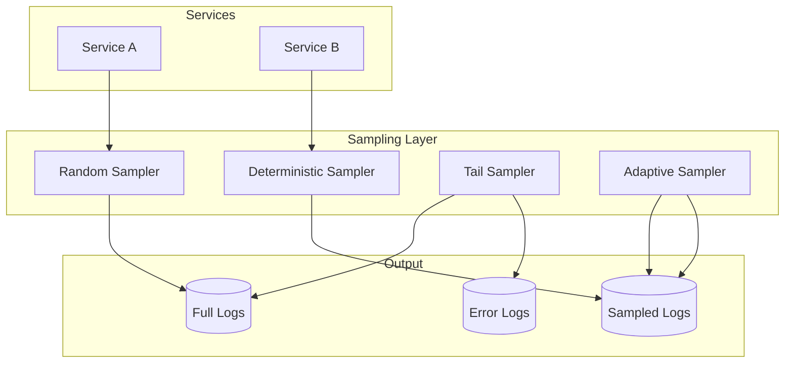

# Log Sampling Patterns

## Overview

Log sampling is the practice of selectively capturing log entries to reduce volume while maintaining representative data for analysis. In high-throughput microservices, log volumes can quickly exceed storage capacity and increase costs. Sampling enables teams to maintain observability while controlling costs.

Effective log sampling requires strategic decisions about which logs to capture and which to drop. The goal is to capture enough logs to debug issues and analyze patterns while avoiding overwhelming storage and analysis systems. Sampling must also maintain correlation properties so sampled logs remain useful.

The key challenge is balancing sampling aggressiveness with debugging needs. Too aggressive sampling may drop the logs needed to investigate issues. Too little sampling may exceed storage budgets. The right approach depends on traffic patterns and analysis requirements.

## Sampling Strategies

Several sampling strategies address different use cases. Understanding when to use each strategy helps implement effective sampling.

**Random Sampling**: Drops a fixed percentage of log entries randomly. Simple to implement but problematic for debugging because important logs may be dropped unpredictably.

**Deterministic Sampling**: Uses a hash of a consistent field (like correlation ID) to decide whether to sample. This ensures all logs for a specific request are either captured or dropped together, maintaining correlation.

**Tail-Based Sampling**: Always captures logs for specific conditions (errors, slow requests) while sampling normal traffic. This ensures important logs are always captured while reducing overall volume.

**Adaptive Sampling**: Adjusts sampling rates based on system load, error rates, or other conditions. During normal operation, samples more aggressively. During issues, reduces sampling to capture more detail.

## Log Sampling Architecture



The sampling layer receives all logs and applies different sampling strategies before forwarding to storage.

## Java Implementation

```java
import java.util.concurrent.ConcurrentHashMap;
import java.util.Map;
import java.util.HashMap;
import java.util.function.Predicate;
import java.util.Random;
import java.security.MessageDigest;

public class LogSamplingExample {
    
    private static final Random random = new Random();
    
    public interface LogSampler {
        boolean shouldSample(LogEntry entry);
    }
    
    public static class LogEntry {
        public String timestamp;
        public String level;
        public String message;
        public String service;
        public String correlationId;
        public Map<String, Object> fields;
        public boolean error;
        
        public String getDeterministicKey() {
            return correlationId != null ? correlationId : 
                (message != null ? message : timestamp);
        }
    }
    
    public static class RandomSampler implements LogSampler {
        private final double sampleRate;
        
        public RandomSampler(double sampleRate) {
            this.sampleRate = sampleRate;
        }
        
        @Override
        public boolean shouldSample(LogEntry entry) {
            return random.nextDouble() < sampleRate;
        }
    }
    
    public static class DeterministicSampler implements LogSampler {
        private final double sampleRate;
        private final String fieldToHash;
        
        public DeterministicSampler(double sampleRate, String fieldToHash) {
            this.sampleRate = sampleRate;
            this.fieldToHash = fieldToHash;
        }
        
        @Override
        public boolean shouldSample(LogEntry entry) {
            String key = getFieldValue(entry);
            if (key == null) {
                return random.nextDouble() < sampleRate;
            }
            
            int hash = Math.abs(key.hashCode());
            return (hash % 100) < (sampleRate * 100);
        }
        
        private String getFieldValue(LogEntry entry) {
            if ("correlationId".equals(fieldToHash)) {
                return entry.correlationId;
            } else if ("message".equals(fieldToHash)) {
                return entry.message;
            } else if ("service".equals(fieldToHash)) {
                return entry.service;
            }
            return entry.getDeterministicKey();
        }
    }
    
    public static class TailBasedSampler implements LogSampler {
        private final LogSampler baseSampler;
        private final Predicate<LogEntry> tailPredicate;
        
        public TailBasedSampler(LogSampler baseSampler, 
                          Predicate<LogEntry> tailPredicate) {
            this.baseSampler = baseSampler;
            this.tailPredicate = tailPredicate;
        }
        
        @Override
        public boolean shouldSample(LogEntry entry) {
            if (tailPredicate.test(entry)) {
                return true;
            }
            return baseSampler.shouldSample(entry);
        }
    }
    
    public static class AdaptiveSampler implements LogSampler {
        private volatile double currentRate = 1.0;
        private volatile double targetRate = 0.1;
        private final long checkIntervalMs = 60000;
        private final Map<String, Integer> errorCounts = new ConcurrentHashMap<>();
        
        public AdaptiveSampler(double initialRate) {
            this.targetRate = initialRate;
            startRateAdjustment();
        }
        
        @Override
        public boolean shouldSample(LogEntry entry) {
            return random.nextDouble() < currentRate;
        }
        
        private void startRateAdjustment() {
            Thread adjustmentThread = new Thread(() -> {
                while (true) {
                    try {
                        Thread.sleep(checkIntervalMs);
                        adjustRate();
                    } catch (InterruptedException e) {
                        Thread.currentThread().interrupt();
                        break;
                    }
                }
            });
            adjustmentThread.setDaemon(true);
            adjustmentThread.start();
        }
        
        private void adjustRate() {
            long errorCount = errorCounts.values().stream()
                .mapToLong(Integer::longValue)
                .sum();
            
            if (errorCount > 100) {
                currentRate = 1.0;
            } else if (errorCount > 10) {
                currentRate = 0.5;
            } else {
                currentRate = targetRate;
            }
            
            errorCounts.clear();
        }
        
        public void recordError(String service, boolean isError) {
            if (isError) {
                errorCounts.merge(service, 1, (a, b) -> a + b);
            }
        }
        
        public double getCurrentRate() {
            return currentRate;
        }
    }
    
    public static class RateLimitedSampler implements LogSampler {
        private final int maxLogsPerSecond;
        private final long windowMs = 1000;
        private volatile long lastWindowStart = 0;
        private volatile int logsInWindow = 0;
        private volatile int droppedInWindow = 0;
        
        public RateLimitedSampler(int maxLogsPerSecond) {
            this.maxLogsPerSecond = maxLogsPerSecond;
        }
        
        @Override
        public boolean shouldSample(LogEntry entry) {
            long now = System.currentTimeMillis();
            long windowStart = now / windowMs * windowMs;
            
            if (windowStart != lastWindowStart) {
                lastWindowStart = windowStart;
                logsInWindow = 0;
                droppedInWindow = 0;
            }
            
            if (logsInWindow < maxLogsPerSecond) {
                logsInWindow++;
                return true;
            }
            
            droppedInWindow++;
            return false;
        }
        
        public int getDroppedCount() {
            return droppedInWindow;
        }
    }
    
    public static class CompositeSampler implements LogSampler {
        private final LogSampler[] samplers;
        
        public CompositeSampler(LogSampler... samplers) {
            this.samplers = samplers;
        }
        
        @Override
        public boolean shouldSample(LogEntry entry) {
            for (LogSampler sampler : samplers) {
                if (sampler.shouldSample(entry)) {
                    return true;
                }
            }
            return false;
        }
    }
    
    public static class LogSamplerRegistry {
        private final Map<String, LogSampler> samplers = new ConcurrentHashMap<>();
        
        public void register(String name, LogSampler sampler) {
            samplers.put(name, sampler);
        }
        
        public LogSampler get(String name) {
            return samplers.get(name);
        }
        
        public LogSampler getDefault() {
            return new CompositeSampler(
                new TailBasedSampler(
                    new DeterministicSampler(1.0, "correlationId"),
                    entry -> "ERROR".equals(entry.level) || entry.error
                ),
                new DeterministicSampler(0.1, "correlationId")
            );
        }
    }
    
    public static void main(String[] args) {
        LogSamplerRegistry registry = new LogSamplerRegistry();
        
        registry.register("random", new RandomSampler(0.1));
        registry.register("deterministic", 
            new DeterministicSampler(0.1, "correlationId"));
        registry.register("adaptive", new AdaptiveSampler(0.1));
        
        LogSampler errorSampler = new TailBasedSampler(
            new DeterministicSampler(0.1, "correlationId"),
            entry -> "ERROR".equals(entry.level)
        );
        
        LogSampler sampler = registry.getDefault();
        
        for (int i = 0; i < 100; i++) {
            LogEntry entry = new LogEntry();
            entry.timestamp = java.time.Instant.now().toString();
            entry.level = i % 10 == 0 ? "ERROR" : "INFO";
            entry.message = "Request " + i;
            entry.correlationId = "corr-" + (i % 10);
            entry.service = "order-service";
            entry.error = entry.level.equals("ERROR");
            
            boolean shouldSample = sampler.shouldSample(entry);
            System.out.println(shouldSample + ": " + entry.message);
        }
    }
}


class SamplerConfig {
    private final Map<String, Object> config;
    
    public SamplerConfig() {
        this.config = new HashMap<>();
    }
    
    public void setRate(double rate) {
        config.put("sampleRate", rate);
    }
    
    public void setField(String field) {
        config.put("samplingField", field);
    }
    
    public LogSamplingExample.LogSampler build() {
        Double rate = (Double) config.get("sampleRate");
        String field = (String) config.get("samplingField");
        
        if (rate == null) rate = 0.1;
        if (field == null) field = "correlationId";
        
        return new LogSamplingExample.DeterministicSampler(rate, field);
    }
}
```

## Python Implementation

```python
import random
import time
import hashlib
import threading
from typing import Dict, List, Optional, Callable, Any
from dataclasses import dataclass, field
from enum import Enum
import queue


class SamplingStrategy(Enum):
    RANDOM = "random"
    DETERMINISTIC = "deterministic"
    TAIL_BASED = "tail_based"
    ADAPTIVE = "adaptive"
    RATE_LIMITED = "rate_limited"


@dataclass
class LogEntry:
    """Log entry for sampling decisions."""
    timestamp: str
    level: str
    message: str
    service: str
    correlation_id: Optional[str] = None
    fields: Dict[str, Any] = field(default_factory=dict)
    error: bool = False


class LogSampler:
    """Base log sampler interface."""
    
    def should_sample(self, entry: LogEntry) -> bool:
        """Determine if entry should be sampled."""
        raise NotImplementedError


class RandomSampler(LogSampler):
    """Random sampling."""
    
    def __init__(self, sample_rate: float):
        self.sample_rate = sample_rate
    
    def should_sample(self, entry: LogEntry) -> bool:
        return random.random() < self.sample_rate


class DeterministicSampler(LogSampler):
    """Deterministic sampling using hash."""
    
    def __init__(self, sample_rate: float, field: str = "correlation_id"):
        self.sample_rate = sample_rate
        self.field = field
    
    def should_sample(self, entry: LogEntry) -> bool:
        key = self._get_field_value(entry)
        if not key:
            return random.random() < self.sample_rate
        
        hash_value = int(hashlib.md5(key.encode()).hexdigest(), 16)
        return (hash_value % 100) < (self.sample_rate * 100)
    
    def _get_field_value(self, entry: LogEntry) -> Optional[str]:
        if self.field == "correlation_id":
            return entry.correlation_id
        elif self.field == "message":
            return entry.message
        elif self.field == "service":
            return entry.service
        return entry.correlation_id


class TailBasedSampler(LogSampler):
    """Tail-based sampling - always sample errors."""
    
    def __init__(self, base_sampler: LogSampler):
        self.base_sampler = base_sampler
    
    def should_sample(self, entry: LogEntry) -> bool:
        if entry.level == "ERROR" or entry.error:
            return True
        return self.base_sampler.should_sample(entry)


class AdaptiveSampler(LogSampler):
    """Adaptive sampling based on error rate."""
    
    def __init__(self, target_rate: float = 0.1):
        self.target_rate = target_rate
        self.current_rate = 1.0
        self.error_counts: Dict[str, int] = {}
        self._lock = threading.Lock()
        self._adjustment_thread = threading.Thread(
            target=self._adjust_loop,
            daemon=True
        )
        self._adjustment_thread.start()
    
    def should_sample(self, entry: LogEntry) -> bool:
        return random.random() < self.current_rate
    
    def record_error(self, service: str, is_error: bool):
        if is_error:
            with self._lock:
                self.error_counts[service] = self.error_counts.get(service, 0) + 1
    
    def _adjust_loop(self):
        while True:
            time.sleep(60)
            self._adjust_rate()
    
    def _adjust_rate(self):
        total_errors = sum(self.error_counts.values())
        
        with self._lock:
            if total_errors > 100:
                self.current_rate = 1.0
            elif total_errors > 10:
                self.current_rate = 0.5
            else:
                self.current_rate = self.target_rate
            
            self.error_counts.clear()


class RateLimitedSampler(LogSampler):
    """Rate-limited sampling."""
    
    def __init__(self, max_per_second: int):
        self.max_per_second = max_per_second
        self.window_start = int(time.time())
        self.count_in_window = 0
        self.dropped = 0
        self._lock = threading.Lock()
    
    def should_sample(self, entry: LogEntry) -> bool:
        now = int(time.time())
        
        with self._lock:
            if now != self.window_start:
                self.window_start = now
                self.count_in_window = 0
                self.dropped = 0
            
            if self.count_in_window < self.max_per_second:
                self.count_in_window += 1
                return True
            
            self.dropped += 1
            return False


class CompositeSampler(LogSampler):
    """Composite sampling with multiple strategies."""
    
    def __init__(self, samplers: List[LogSampler]):
        self.samplers = samplers
    
    def should_sample(self, entry: LogEntry) -> bool:
        for sampler in self.samplers:
            if sampler.should_sample(entry):
                return True
        return False


class SamplingLogger:
    """Logger with sampling."""
    
    def __init__(self, sampler: LogSampler):
        self.sampler = sampler
    
    def should_log(self, entry: LogEntry) -> bool:
        return self.sampler.should_sample(entry)
    
    def log(self, entry: LogEntry):
        if self.should_log(entry):
            self._write_entry(entry)
    
    def _write_entry(self, entry: LogEntry):
        print(f"{entry.timestamp} {entry.level} {entry.message}")


def create_sampler(strategy: str, **config) -> LogSampler:
    """Create a sampler based on configuration."""
    if strategy == SamplingStrategy.RANDOM.value:
        rate = config.get('rate', 0.1)
        return RandomSampler(rate)
    
    elif strategy == SamplingStrategy.DETERMINISTIC.value:
        rate = config.get('rate', 0.1)
        field = config.get('field', 'correlation_id')
        return DeterministicSampler(rate, field)
    
    elif strategy == SamplingStrategy.TAIL_BASED.value:
        base = create_sampler(
            config.get('base', 'deterministic'),
            rate=config.get('rate', 0.1)
        )
        return TailBasedSampler(base)
    
    elif strategy == SamplingStrategy.ADAPTIVE.value:
        return AdaptiveSampler(config.get('rate', 0.1))
    
    elif strategy == SamplingStrategy.RATE_LIMITED.value:
        return RateLimitedSampler(config.get('max_per_second', 1000))
    
    return DeterministicSampler(0.1)


def configure_sampling(config: Dict) -> LogSampler:
    """Configure sampling from config."""
    strategy = config.get('strategy', 'deterministic')
    
    error_sampler = TailBasedSampler(
        DeterministicSampler(1.0, 'correlation_id')
    )
    
    normal_sampler = create_sampler(strategy, **config)
    
    return CompositeSampler([error_sampler, normal_sampler])


if __name__ == "__main__":
    base_sampler = DeterministicSampler(0.1, 'correlation_id')
    tail_sampler = TailBasedSampler(base_sampler)
    
    sampler = CompositeSampler([
        TailBasedSampler(DeterministicSampler(1.0, 'correlation_id')),
        DeterministicSampler(0.1, 'correlation_id')
    ])
    
    for i in range(100):
        entry = LogEntry(
            timestamp=time.strftime('%Y-%m-%dT%H:%M:%SZ'),
            level='ERROR' if i % 10 == 0 else 'INFO',
            message=f'Request {i}',
            service='order-service',
            correlation_id=f'corr-{i % 10}',
            error=i % 10 == 0
        )
        
        should = sampler.should_sample(entry)
        print(f"{'SAMPLED' if should else 'DROPPED'}: {entry.message}")
```

## Real-World Examples

**Netflix** uses tail-based sampling to always capture error logs while sampling normal traffic at 1%. This ensures errors are always captured while controlling storage costs.

**Uber** implements adaptive sampling that increases capture rate during elevated error rates, ensuring more detail during issues.

**Google** uses deterministic sampling for distributed tracing to ensure complete request traces while sampling at scale.

## Output Statement

Organizations implementing log sampling can expect: reduced log storage costs (often 50-90% reduction); maintained debugging capability through error logging; controlled network bandwidth for log shipping; and balanced observability with cost constraints.

Log sampling enables organizations to maintain observability at scale while controlling costs. Without sampling, log volumes become unsustainable at high traffic.

## Best Practices

1. **Always Sample Errors**: Use tail-based sampling to always capture error logs and slow requests. These are most valuable for debugging.

2. **Use Deterministic Sampling**: Use hash-based sampling to ensure all logs for a request are either captured or dropped together. This maintains correlation.

3. **Include in Headers**: Include sampling decisions in log headers so logs can be filtered at query time.

4. **Implement Drop Reason**: Include the reason logs were dropped (rate limit, sampling) to enable analysis during incidents.

5. **Configure Error Sampling At Ingest**: Apply sampling at the collection layer to reduce storage before ingestion.

6. **Monitor Sampling Impact**: Track the percentage of logs sampled and ensure critical logs aren't being dropped.

7. **Implement Adaptive Sampling**: Use adaptive sampling that reduces rate during errors to capture more detail.