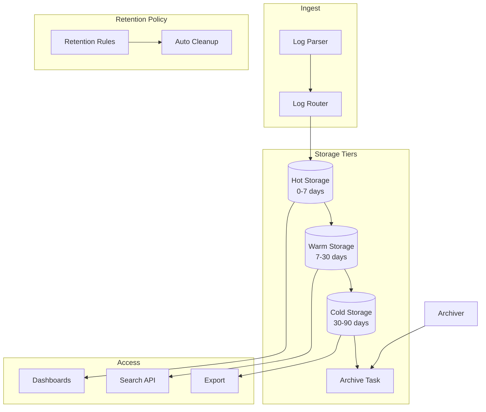

# Log Retention Patterns

## Overview

Log retention defines how long log data is stored and accessible. In microservices environments, retention policies balance observability needs with storage costs, compliance requirements, and performance. Effective retention ensures logs are available long enough to investigate issues while avoiding unnecessary costs.

Retention policies vary based on log level, service, and business requirements. Error logs may need longer retention than info logs. Compliance requirements may mandate specific retention periods. The right policy depends on organizational needs and regulatory environment.

Retention also involves decisions about log storage tiers. Recent logs may be stored in fast, expensive storage for rapid access. Older logs may move to cheaper storage or be archived. This tiering approach optimizes cost while maintaining access.

## Retention Strategies

Several strategies address retention needs. The best choice depends on access patterns, storage costs, and compliance requirements.

**Time-Based Retention**: Retain logs for a fixed period (days, weeks, months). Simple to implement and understand. Suitable for most use cases with standard access patterns.

**Tiered Retention**: Store recent logs in hot storage, older logs in cold storage. Provides fast access to recent logs while reducing storage costs. Complex but cost-effective.

**Level-Based Retention**: Retain different log levels for different periods. Error logs for 30 days, info for 7 days. Ensures important logs are retained longer.

**Size-Based Retention**: Retain logs up to storage limits, rolling over when full. Ensures storage never exceeds limits. May drop important logs unpredictably.

## Retention Architecture



The retention architecture routes logs to appropriate storage tiers and manages lifecycle transitions based on retention policies.

## Java Implementation

```java
import java.time.Instant;
import java.time.Duration;
import java.time.LocalDateTime;
import java.time.ZoneOffset;
import java.util.Map;
import java.util.HashMap;
import java.util.List;
import java.util.ArrayList;
import java.util.concurrent.Executors;
import java.util.concurrent.ScheduledExecutorService;
import java.util.concurrent.TimeUnit;
import java.util.function.Predicate;

public class LogRetentionExample {
    
    public enum RetentionTier {
        HOT("hot", Duration.ofDays(7)),
        WARM("warm", Duration.ofDays(30)),
        COLD("cold", Duration.ofDays(90)),
        ARCHIVE("archive", Duration.ofDays(365));
        
        public final String name;
        public final Duration retentionPeriod;
        
        RetentionTier(String name, Duration retentionPeriod) {
            this.name = name;
            this.retentionPeriod = retentionPeriod;
        }
    }
    
    public static class RetentionPolicy {
        public final String name;
        public final RetentionTier defaultTier;
        public final Map<String, RetentionTier> levelOverrides;
        public final Map<String, RetentionTier> serviceOverrides;
        public final Duration maxRetention;
        public final boolean archiveEnabled;
        
        public RetentionPolicy(String name, RetentionTier defaultTier) {
            this.name = name;
            this.defaultTier = defaultTier;
            this.levelOverrides = new HashMap<>();
            this.serviceOverrides = new HashMap<>();
            this.maxRetention = RetentionTier.ARCHIVE.retentionPeriod;
            this.archiveEnabled = true;
        }
        
        public RetentionTier getTierForEntry(LogEntry entry) {
            RetentionTier tier = levelOverrides.get(entry.level);
            if (tier != null) return tier;
            
            tier = serviceOverrides.get(entry.service);
            if (tier != null) return tier;
            
            return defaultTier;
        }
        
        public boolean shouldArchive(RetentionTier tier, Duration age) {
            return age.compareTo(tier.retentionPeriod) >= 0;
        }
        
        public boolean shouldDelete(RetentionTier tier, Duration age) {
            return age.compareTo(maxRetention) >= 0;
        }
    }
    
    public static class LogEntry {
        public String timestamp;
        public String level;
        public String message;
        public String service;
        public String index;
        
        public LocalDateTime getTimestamp() {
            return LocalDateTime.parse(timestamp);
        }
        
        public Duration getAge() {
            return Duration.between(
                getTimestamp().atOffset(ZoneOffset.UTC),
                LocalDateTime.now(ZoneOffset.UTC)
            );
        }
    }
    
    public static class RetentionManager {
        private final RetentionPolicy policy;
        private final RetentionStorage storage;
        private final ScheduledExecutorService executor;
        
        public RetentionManager(RetentionPolicy policy, RetentionStorage storage) {
            this.policy = policy;
            this.storage = storage;
            this.executor = Executors.newSingleThreadScheduledExecutor();
            
            startRetentionTasks();
        }
        
        private void startRetentionTasks() {
            executor.scheduleAtFixedRate(
                () -> evaluateRetention(),
                1,
                1,
                TimeUnit.HOURS
            );
        }
        
        public void evaluateRetention() {
            for (RetentionTier tier : RetentionTier.values()) {
                List<LogEntry> entries = storage.getEntriesInTier(tier);
                
                for (LogEntry entry : entries) {
                    Duration age = entry.getAge();
                    RetentionTier currentTier = tier;
                    
                    while (policy.shouldArchive(currentTier, age)) {
                        RetentionTier nextTier = getNextTier(currentTier);
                        if (nextTier == null) break;
                        
                        if (storage.moveToTier(entry, nextTier)) {
                            currentTier = nextTier;
                        } else {
                            break;
                        }
                    }
                    
                    if (policy.shouldDelete(currentTier, age)) {
                        storage.delete(entry);
                    }
                }
            }
        }
        
        private RetentionTier getNextTier(RetentionTier current) {
            switch (current) {
                case HOT: return RetentionTier.WARM;
                case WARM: return RetentionTier.COLD;
                case COLD: return RetentionTier.ARCHIVE;
                case ARCHIVE: return null;
            }
            return null;
        }
        
        public void setLevelRetention(String level, RetentionTier tier) {
            policy.levelOverrides.put(level, tier);
        }
        
        public void setServiceRetention(String service, RetentionTier tier) {
            policy.serviceOverrides.put(service, tier);
        }
        
        public Map<String, Long> getRetentionStats() {
            Map<String, Long> stats = new HashMap<>();
            
            for (RetentionTier tier : RetentionTier.values()) {
                stats.put(tier.name, storage.getCountInTier(tier));
            }
            
            return stats;
        }
    }
    
    public static class RetentionStorage {
        private final Map<String, List<LogEntry>> entries = new HashMap<>();
        
        public List<LogEntry> getEntriesInTier(RetentionTier tier) {
            return entries.getOrDefault(tier.name, new ArrayList<>());
        }
        
        public boolean moveToTier(LogEntry entry, RetentionTier newTier) {
            return true;
        }
        
        public void delete(LogEntry entry) {
        }
        
        public long getCountInTier(RetentionTier tier) {
            return entries.getOrDefault(tier.name, new ArrayList<>()).size();
        }
        
        public void store(LogEntry entry) {
            String index = entry.index != null ? entry.index : "default";
            entries.computeIfAbsent(index, k -> new ArrayList<>()).add(entry);
        }
    }
    
    public static class RetentionRule {
        public final Predicate<LogEntry> condition;
        public final RetentionTier tier;
        
        public RetentionRule(Predicate<LogEntry> condition, RetentionTier tier) {
            this.condition = condition;
            this.tier = tier;
        }
        
        public boolean matches(LogEntry entry) {
            return condition.test(entry);
        }
        
        public RetentionTier getTier() {
            return tier;
        }
    }
    
    public static class AdvancedRetentionManager {
        private final List<RetentionRule> rules = new ArrayList<>();
        private final RetentionStorage storage;
        
        public AdvancedRetentionManager(RetentionStorage storage) {
            this.storage = storage;
            setupDefaultRules();
        }
        
        private void setupDefaultRules() {
            rules.add(new RetentionRule(
                e -> "ERROR".equals(e.level) || "FATAL".equals(e.level),
                RetentionTier.ARCHIVE
            ));
            
            rules.add(new RetentionRule(
                e -> "WARN".equals(e.level),
                RetentionTier.COLD
            ));
            
            rules.add(new RetentionRule(
                e -> "payment".equals(e.service) || "billing".equals(e.service),
                RetentionTier.COLD
            ));
            
            rules.add(new RetentionRule(
                e -> true,
                RetentionTier.HOT
            ));
        }
        
        public void addRule(RetentionRule rule) {
            rules.add(0, rule);
        }
        
        public RetentionTier determineTier(LogEntry entry) {
            for (RetentionRule rule : rules) {
                if (rule.matches(entry)) {
                    return rule.getTier();
                }
            }
            return RetentionTier.HOT;
        }
    }
    
    public static void main(String[] args) {
        RetentionPolicy policy = new RetentionPolicy(
            "default",
            RetentionTier.HOT
        );
        
        policy.setLevelRetention("ERROR", RetentionTier.COLD);
        policy.setServiceRetention("payment", RetentionTier.ARCHIVE);
        
        RetentionStorage storage = new RetentionStorage();
        RetentionManager manager = new RetentionManager(policy, storage);
        
        for (int i = 0; i < 10; i++) {
            LogEntry entry = new LogEntry();
            entry.timestamp = Instant.now().toString();
            entry.level = i % 5 == 0 ? "ERROR" : "INFO";
            entry.message = "Log entry " + i;
            entry.service = i % 3 == 0 ? "payment" : "order";
            entry.index = "logs-" + i;
            
            storage.store(entry);
        }
        
        Map<String, Long> stats = manager.getRetentionStats();
        System.out.println("Retention stats: " + stats);
    }
}
```

## Python Implementation

```python
import time
import threading
from datetime import datetime, timedelta, timezone
from typing import Dict, List, Optional, Callable, Any
from dataclasses import dataclass, field
from enum import Enum
from collections import defaultdict
import json


class RetentionTier(Enum):
    """Retention tier definitions."""
    HOT = "hot"          # 0-7 days - fast access
    WARM = "warm"       # 7-30 days
    COLD = "cold"       # 30-90 days - cheaper storage
    ARCHIVE = "archive"  # 90+ days - archival storage


TIER_RETENTION = {
    RetentionTier.HOT: timedelta(days=7),
    RetentionTier.WARM: timedelta(days=30),
    RetentionTier.COLD: timedelta(days=90),
    RetentionTier.ARCHIVE: timedelta(days=365),
}


@dataclass
class LogEntry:
    """Log entry."""
    timestamp: str
    level: str
    message: str
    service: str
    index: Optional[str] = None
    
    def get_age(self) -> timedelta:
        """Get age of entry."""
        try:
            ts = datetime.fromisoformat(self.timestamp.replace('Z', '+00:00'))
            return datetime.now(timezone.utc) - ts
        except Exception:
            return timedelta(0)


class RetentionRule:
    """Retention rule."""
    
    def __init__(self, condition: Callable[[LogEntry], bool], tier: RetentionTier):
        self.condition = condition
        self.tier = tier
    
    def matches(self, entry: LogEntry) -> bool:
        return self.condition(entry)
    
    def get_tier(self) -> RetentionTier:
        return self.tier


class RetentionStorage:
    """Storage backend for retention."""
    
    def __init__(self):
        self._entries: Dict[str, List[LogEntry]] = defaultdict(list)
    
    def get_entries_in_tier(self, tier: RetentionTier) -> List[LogEntry]:
        index = tier.value
        return self._entries.get(index, [])
    
    def get_entries_for_index(self, index: str) -> List[LogEntry]:
        return self._entries.get(index, [])
    
    def move_to_tier(self, index: str, new_tier: RetentionTier) -> bool:
        """Move index to new tier."""
        entries = self._entries.get(index, [])
        if not entries:
            return False
        
        new_index = f"{index.split('-')[0]}-{new_tier.value}"
        self._entries[new_index].extend(entries)
        del self._entries[index]
        return True
    
    def delete(self, entry: LogEntry) -> bool:
        """Delete entry."""
        return True
    
    def delete_index(self, index: str):
        """Delete entire index."""
        if index in self._entries:
            del self._entries[index]
    
    def count_in_tier(self, tier: RetentionTier) -> int:
        return len(self.get_entries_in_tier(tier))


class RetentionPolicy:
    """Retention policy configuration."""
    
    def __init__(self):
        self._level_overrides: Dict[str, RetentionTier] = {}
        self._service_overrides: Dict[str, RetentionTier] = {}
        self._default_tier = RetentionTier.HOT
        self.max_retention = TIER_RETENTION[RetentionTier.ARCHIVE]
        self.archive_enabled = True
    
    def set_level_retention(self, level: str, tier: RetentionTier):
        self._level_overrides[level] = tier
    
    def set_service_retention(self, service: str, tier: RetentionTier):
        self._service_overrides[service] = tier
    
    def get_tier(self, entry: LogEntry) -> RetentionTier:
        """Get tier for entry."""
        tier = self._level_overrides.get(entry.level)
        if tier:
            return tier
        
        tier = self._service_overrides.get(entry.service)
        if tier:
            return tier
        
        return self._default_tier
    
    def should_archive(self, entry: LogEntry, current_tier: RetentionTier) -> bool:
        """Check if should archive."""
        age = entry.get_age()
        retention = TIER_RETENTION.get(current_tier, timedelta(days=7))
        return age >= retention
    
    def should_delete(self, entry: LogEntry) -> bool:
        """Check if should delete based on max retention."""
        return entry.get_age() >= self.max_retention


class RetentionManager:
    """Manage log retention."""
    
    def __init__(self, storage: RetentionStorage, policy: RetentionPolicy):
        self.storage = storage
        self.policy = policy
        self._running = False
        self._thread = None
    
    def start(self, interval_hours: int = 1):
        """Start retention manager."""
        self._running = True
        self._thread = threading.Thread(
            target=self._run_loop,
            args=(interval_hours,),
            daemon=True
        )
        self._thread.start()
    
    def stop(self):
        """Stop retention manager."""
        self._running = False
        if self._thread:
            self._thread.join(timeout=5)
    
    def _run_loop(self, interval_hours: int):
        """Run retention evaluation."""
        while self._running:
            try:
                self.evaluate_retention()
            except Exception as e:
                print(f"Retention error: {e}")
            
            time.sleep(interval_hours * 3600)
    
    def evaluate_retention(self):
        """Evaluate retention for all tiers."""
        for tier in RetentionTier:
            self._evaluate_tier(tier)
    
    def _evaluate_tier(self, tier: RetentionTier):
        """Evaluate retention for tier."""
        entries = self.storage.get_entries_in_tier(tier)
        
        for entry in entries:
            if self.policy.should_archive(entry, tier):
                next_tier = self._get_next_tier(tier)
                if next_tier:
                    index = entry.index or tier.value
                    self.storage.move_to_tier(index, next_tier)
            
            if self.policy.should_delete(entry):
                self.storage.delete(entry)
    
    def _get_next_tier(self, current: RetentionTier) -> Optional[RetentionTier]:
        """Get next tier in lifecycle."""
        tiers = list(RetentionTier)
        try:
            idx = tiers.index(current)
            if idx + 1 < len(tiers):
                return tiers[idx + 1]
        except ValueError:
            pass
        return None
    
    def get_stats(self) -> Dict[str, int]:
        """Get retention stats."""
        return {
            tier.value: self.storage.count_in_tier(tier)
            for tier in RetentionTier
        }


class AdvancedRetentionManager:
    """Advanced retention with rules."""
    
    def __init__(self, storage: RetentionStorage):
        self.storage = storage
        self._rules: List[RetentionRule] = []
        self._setup_default_rules()
    
    def _setup_default_rules(self):
        """Setup default retention rules."""
        self._rules.append(RetentionRule(
            lambda e: e.level in ('ERROR', 'FATAL'),
            RetentionTier.ARCHIVE
        ))
        
        self._rules.append(RetentionRule(
            lambda e: e.level == 'WARN',
            RetentionTier.COLD
        ))
        
        self._rules.append(RetentionRule(
            lambda e: e.service in ('payment', 'billing', 'compliance'),
            RetentionTier.ARCHIVE
        ))
        
        self._rules.append(RetentionRule(
            lambda e: True,
            RetentionTier.HOT
        ))
    
    def add_rule(self, condition: Callable[[LogEntry], bool], tier: RetentionTier):
        """Add retention rule."""
        rule = RetentionRule(condition, tier)
        self._rules.insert(0, rule)
    
    def determine_tier(self, entry: LogEntry) -> RetentionTier:
        """Determine tier for entry."""
        for rule in self._rules:
            if rule.matches(entry):
                return rule.get_tier()
        return RetentionTier.HOT


def configure_retention_policy(service_retentions: Dict[str, int],
                             level_retentions: Dict[str, int]) -> RetentionPolicy:
    """Configure retention policy from config."""
    policy = RetentionPolicy()
    
    for service, days in service_retentions.items():
        tier = get_tier_for_days(days)
        policy.set_service_retention(service, tier)
    
    for level, days in level_retentions.items():
        tier = get_tier_for_days(days)
        policy.set_level_retention(level, tier)
    
    return policy


def get_tier_for_days(days: int) -> RetentionTier:
    """Get tier for retention days."""
    for tier, retention in TIER_RETENTION.items():
        if retention.days >= days:
            return tier
    return RetentionTier.ARCHIVE


if __name__ == "__main__":
    storage = RetentionStorage()
    policy = configure_retention_policy(
        service_retentions={
            'payment': 365,
            'order': 90,
            'search': 30
        },
        level_retentions={
            'ERROR': 365,
            'WARN': 90,
            'INFO': 30
        }
    )
    
    manager = RetentionManager(storage, policy)
    manager.start(interval_hours=1)
    
    for i in range(10):
        entry = LogEntry(
            timestamp=datetime.now(timezone.utc).isoformat(),
            level='ERROR' if i % 5 == 0 else 'INFO',
            message=f'Log entry {i}',
            service='payment' if i % 3 == 0 else 'order',
            index=f'logs-{i}'
        )
        
        storage._entries[policy.get_tier(entry).value].append(entry)
    
    stats = manager.get_stats()
    print(f"Retention stats: {stats}")
```

## Real-World Examples

**PCI-DSS compliant systems** maintain audit logs for at least one year, often using dedicated archival storage. Payment logs require specific retention for compliance.

**Financial institutions** maintain logs for 7+ years based on regulatory requirements. This requires tiered storage with long-term archival.

**Healthcare systems** maintain logs for 6+ years per HIPAA requirements, with additional retention for legal holds.

## Output Statement

Organizations implementing log retention can expect: controlled storage costs through tiered retention; compliance with regulatory requirements; optimized access to recent logs for active investigation; and efficient long-term storage for historical analysis.

Log retention ensures sustainable log management while maintaining compliance and investigation capabilities. Without retention policies, organizations face uncontrolled costs or compliance risks.

## Best Practices

1. **Define Retention by Log Level**: Retain error logs longer than info logs since errors are more valuable for investigation.

2. **Implement Tiered Storage**: Use hot, warm, cold, and archive tiers to balance cost and access requirements.

3. **Configure Regulatory Compliance**: Ensure retention meets specific regulatory requirements for your industry.

4. **Set Automatic Cleanup**: Implement automated cleanup to prevent unbounded storage growth.

5. **Consider Compliance Holds**: Implement legal hold functionality to prevent deletion when required.

6. **Document Retention Policies**: Document retention policies and ensure they're enforced automatically.

7. **Monitor Retention Compliance**: Track actual storage and deletion to ensure policies are followed.