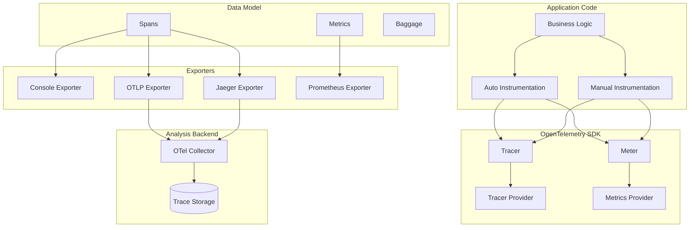

# OpenTelemetry Patterns

## Overview

OpenTelemetry (OTel) is an open-source observability framework that provides standardized APIs, libraries, and tools for collecting telemetry data (traces, metrics, and logs). It emerged from the merger of OpenTracing and OpenCensus projects and has become the industry standard for observability instrumentation.

OpenTelemetry provides language-specific SDKs that enable consistent instrumentation across services, regardless of the programming language. This standardization ensures that telemetry data can be correlated across polyglot microservices without requiring different instrumentation approaches for each service.

The key components of OpenTelemetry include the tracing SDK for creating and managing spans, the metrics SDK for collecting measurements, the baggage for context propagation, and exporters for sending data to analysis backends.

## OpenTelemetry Architecture

The OpenTelemetry architecture consists of several integrated components that work together to collect and export telemetry data. Understanding these components enables effective implementation.

The **Tracer Provider** is the entry point for tracing instrumentation. It manages span creation and export, maintaining the service's tracing state. Applications typically initialize one Tracer Provider at startup.

**Spans** represent individual operations within a trace. Each span contains timing information, attributes, events, and status. Spans are created by Tracers and assembled into traces by the collection backend.

**Metrics** in OpenTelemetry include counters, gauges, histograms, and summaries. The Metrics SDK collects these measurements and exports them for analysis.

**Exporters** send telemetry data to analysis backends like Jaeger, Zipkin, or Prometheus. OpenTelemetry supports multiple exporters simultaneously.

## Architecture



The OpenTelemetry architecture flows from application code through SDKs to exporters and analysis backends.

## Java Implementation

```java
import io.opentelemetry.api.OpenTelemetry;
import io.opentelemetry.api.trace.Tracer;
import io.opentelemetry.api.trace.Span;
import io.opentelemetry.api.trace.SpanKind;
import io.opentelemetry.api.trace.StatusCode;
import io.opentelemetry.api.common.Attributes;
import io.opentelemetry.api.common.AttributeKey;
import io.opentelemetry.context.Scope;
import io.opentelemetry.sdk.OpenTelemetrySdk;
import io.opentelemetry.sdk.trace.SdkTracerProvider;
import io.opentelemetry.sdk.trace.export.BatchSpanProcessor;
import io.opentelemetry.sdk.trace.export.SimpleSpanProcessor;
import io.opentelemetry.sdk.resources.Resource;
import io.opentelemetry.sdk.metrics.SdkMeterProvider;
import io.opentelemetry.sdk.metrics.export.IntervalMetricReader;
import io.opentelemetry.semconv.ResourceAttributes;
import io.opentelemetry.exporter.jaeger.JaegerGrpcSpanExporter;
import io.opentelemetry.exporter.otlp.trace.OtlpGrpcSpanExporter;
import io.opentelemetry.exporter.prometheus.PrometheusMetricReader;
import io.opentelemetry.exporter.logging.LoggingSpanExporter;
import io.opentelemetry.exporter.logging.LoggingMetricExporter;
import io.prometheus.client.exporter.HTTPServer;

public class OpenTelemetryPatternExample {
    
    private static final AttributeKey<String> CUSTOM_ATTR_KEY = 
        AttributeKey.stringKey("custom.attribute");
    
    private final OpenTelemetry openTelemetry;
    private final Tracer tracer;
    private final io.opentelemetry.api.metrics.Meter meter;
    
    public OpenTelemetryPatternExample() {
        Resource serviceResource = Resource.getDefault()
            .merge(Resource.create(Attributes.of(
                ResourceAttributes.SERVICE_NAME, "order-service",
                ResourceAttributes.SERVICE_VERSION, "1.0.0",
                ResourceAttributes.DEPLOYMENT_ENVIRONMENT, "production"
            )));
        
        JaegerGrpcSpanExporter jaegerExporter = JaegerGrpcSpanExporter.builder()
            .setEndpoint("http://jaeger-collector:14250")
            .setTimeout(java.time.Duration.ofSeconds(10))
            .build();
        
        SdkTracerProvider tracerProvider = SdkTracerProvider.builder()
            .setResource(serviceResource)
            .addSpanProcessor(BatchSpanProcessor.builder(jaegerExporter)
                .setMaxExportBatchSize(512)
                .setScheduleDelayMillis(5000)
                .build())
            .addSpanProcessor(SimpleSpanProcessor.create(
                LoggingSpanExporter.create()))
            .build();
        
        SdkMeterProvider meterProvider = SdkMeterProvider.builder()
            .setResource(serviceResource)
            .build();
        
        IntervalMetricReader reader = IntervalMetricReader.builder(
            LoggingMetricExporter.create(),
            10000,
            java.util.concurrent.TimeUnit.MILLISECONDS)
            .build();
        
        this.openTelemetry = OpenTelemetrySdk.builder()
            .setTracerProvider(tracerProvider)
            .setMeterProvider(meterProvider)
            .build();
        
        this.tracer = openTelemetry.getTracer(
            "order-service", 
            "1.0.0"
        );
        
        this.meter = openTelemetry.getMeter("order-service", "1.0.0");
    }
    
    public void processOrder(String orderId, String userId) {
        Span span = tracer.spanBuilder("processOrder")
            .setSpanKind(SpanKind.SERVER)
            .setAttribute("order.id", orderId)
            .setAttribute("user.id", userId)
            .setAttribute("operation.type", "order_processing")
            .startSpan();
        
        try (Scope scope = span.makeCurrent()) {
            span.addEvent("Order processing started");
            
            validateOrder(orderId);
            checkInventory(orderId);
            processPayment(orderId, userId);
            
            span.setAttribute("order.status", "completed");
            span.setStatus(StatusCode.OK);
            
        } catch (Exception e) {
            span.setStatus(StatusCode.ERROR, e.getMessage());
            span.recordException(e);
            throw e;
        } finally {
            span.end();
        }
    }
    
    private void validateOrder(String orderId) {
        Span span = tracer.spanBuilder("validateOrder")
            .setParent(Span.current())
            .setAttribute("order.id", orderId)
            .startSpan();
        
        try (Scope scope = span.makeCurrent()) {
            Thread.sleep(100);
            span.setStatus(StatusCode.OK);
        } catch (Exception e) {
            span.setStatus(StatusCode.ERROR, e.getMessage());
            span.recordException(e);
        } finally {
            span.end();
        }
    }
    
    private void checkInventory(String orderId) {
        Span span = tracer.spanBuilder("checkInventory")
            .setParent(Span.current())
            .setAttribute("order.id", orderId)
            .setAttribute("inventory.check.type", "availability")
            .startSpan();
        
        try (Scope scope = span.makeCurrent()) {
            span.addEvent("Checking inventory");
            Thread.sleep(150);
            span.setStatus(StatusCode.OK);
        } catch (Exception e) {
            span.setStatus(StatusCode.ERROR, e.getMessage());
            span.recordException(e);
        } finally {
            span.end();
        }
    }
    
    private void processPayment(String orderId, String userId) {
        Span span = tracer.spanBuilder("processPayment")
            .setParent(Span.current())
            .setAttribute("order.id", orderId)
            .setAttribute("user.id", userId)
            .setAttribute("payment.method", "credit_card")
            .startSpan();
        
        try (Scope scope = span.makeCurrent()) {
            span.addEvent("Processing payment");
            Thread.sleep(200);
            span.setAttribute("payment.transaction.id", "txn-" + orderId);
            span.setStatus(StatusCode.OK);
        } catch (Exception e) {
            span.setStatus(StatusCode.ERROR, e.getMessage());
            span.recordException(e);
        } finally {
            span.end();
        }
    }
    
    public void recordMetrics(String orderId, boolean success, long durationMs) {
        io.opentelemetry.api.metrics.Counter counter = meter.counterBuilder("orders_total")
            .setDescription("Total orders processed")
            .setUnit("1")
            .build();
        
        counter.add(1, Attributes.of(
            io.opentelemetry.api.common.AttributeKey.stringKey("order.id"),
            orderId,
            io.opentelemetry.api.common.AttributeKey.stringKey("status"),
            success ? "success" : "failure"
        ));
        
        io.opentelemetry.api.metrics.LongHistogram histogram = 
            meter.histogramBuilder("order_processing_duration_ms")
                .setDescription("Order processing duration")
                .setUnit("ms")
                .build();
        
        histogram.record(durationMs, Attributes.of(
            io.opentelemetry.api.common.AttributeKey.stringKey("order.id"),
            orderId
        ));
    }
    
    public static void main(String[] args) throws Exception {
        OpenTelemetryPatternExample example = new OpenTelemetryPatternExample();
        
        for (int i = 0; i < 10; i++) {
            String orderId = "ORD-" + i;
            long startTime = System.currentTimeMillis();
            
            try {
                example.processOrder(orderId, "user-" + i);
                long duration = System.currentTimeMillis() - startTime;
                example.recordMetrics(orderId, true, duration);
            } catch (Exception e) {
                long duration = System.currentTimeMillis() - startTime;
                example.recordMetrics(orderId, false, duration);
            }
        }
        
        Thread.sleep(5000);
    }
}
```

## Python Implementation

```python
from opentelemetry import trace, metrics
from opentelemetry.sdk.trace import TracerProvider, SimpleSpanProcessor
from opentelemetry.sdk.trace.export import ConsoleSpanExporter, BatchSpanProcessor
from opentelemetry.sdk.metrics import MeterProvider
from opentelemetry.sdk.metrics.export import ConsoleMetricExporter, IntervalMetricReader
from opentelemetry.sdk.resources import Resource, SERVICE_NAME
from opentelemetry.exporter.jaeger.thrift import JaegerExporter
from opentelemetry.exporter.otlp.trace import OTLPSpanExporter
from opentelemetry.exporter.otlp.metrics import OTLPMetricExporter
from opentelemetry.trace import SpanKind, Status, StatusCode
from opentelemetry.trace.propagation import set_global_text_map
from opentelemetry.propagate import inject, extract
from opentelemetry.instrumentation.requests import RequestsInstrumentor
import requests
import time


def configure_opentelemetry(service_name: str, service_version: str):
    """Configure OpenTelemetry SDK."""
    
    resource = Resource({
        SERVICE_NAME: service_name,
        "service.version": service_version,
        "deployment.environment": "production"
    })
    
    tracer_provider = TracerProvider(resource=resource)
    
    jaeger_exporter = JaegerExporter(
        agent_host_name="jaeger-collector",
        agent_port=6831,
    )
    
    tracer_provider.add_span_processor(
        BatchSpanProcessor(jaeger_exporter)
    )
    
    tracer_provider.add_span_processor(
        SimpleSpanProcessor(ConsoleSpanExporter())
    )
    
    trace.set_tracer_provider(tracer_provider)
    
    meter_provider = MeterProvider(
        resource=resource,
        metric_readers=[
            IntervalMetricReader(
                ConsoleMetricExporter(),
                interval=10000
            )
        ]
    )
    
    metrics.set_meter_provider(meter_provider)
    
    RequestsInstrumentor().instrument()
    
    return trace.get_tracer_provider(), metrics.get_meter_provider()


class OrderService:
    """Order service with OpenTelemetry instrumentation."""
    
    def __init__(self, tracer_name: str = "order-service"):
        self.tracer = trace.get_tracer(tracer_name)
        self.meter = metrics.get_meter(tracer_name)
        
        self.order_counter = self.meter.create_counter(
            "orders_total",
            description="Total orders processed",
            unit="1"
        )
        
        self.order_duration = self.meter.create_histogram(
            "order_processing_duration_ms",
            description="Order processing duration in milliseconds",
            unit="ms"
        )
    
    def process_order(self, order_id: str, user_id: str):
        """Process an order with tracing."""
        with self.tracer.start_as_current_span(
            "processOrder",
            kind=SpanKind.SERVER,
            attributes={
                "order.id": order_id,
                "user.id": user_id,
                "operation.type": "order_processing"
            }
        ) as span:
            try:
                span.add_event("Order processing started")
                
                self.validate_order(order_id)
                self.check_inventory(order_id)
                self.process_payment(order_id, user_id)
                
                span.set_attribute("order.status", "completed")
                span.set_status(Status(StatusCode.OK))
                span.add_event("Order processing completed")
                
                self.order_counter.add(
                    1,
                    attributes={
                        "order.id": order_id,
                        "status": "success"
                    }
                )
                
            except Exception as e:
                span.set_status(Status(StatusCode.ERROR, str(e)))
                span.record_exception(e)
                
                self.order_counter.add(
                    1,
                    attributes={
                        "order.id": order_id,
                        "status": "failure"
                    }
                )
                
                raise
    
    def validate_order(self, order_id: str):
        """Validate order."""
        with self.tracer.start_as_current_span(
            "validateOrder",
            attributes={"order.id": order_id}
        ) as span:
            time.sleep(0.1)
            span.set_status(Status(StatusCode.OK))
    
    def check_inventory(self, order_id: str):
        """Check inventory."""
        with self.tracer.start_as_current_span(
            "checkInventory",
            attributes={
                "order.id": order_id,
                "inventory.check.type": "availability"
            }
        ) as span:
            span.add_event("Checking inventory")
            time.sleep(0.15)
            span.set_attribute("inventory.available", True)
            span.set_status(Status(StatusCode.OK))
    
    def process_payment(self, order_id: str, user_id: str):
        """Process payment."""
        with self.tracer.start_as_current_span(
            "processPayment",
            attributes={
                "order.id": order_id,
                "user.id": user_id,
                "payment.method": "credit_card"
            }
        ) as span:
            span.add_event("Processing payment")
            time.sleep(0.2)
            span.set_attribute("payment.transaction.id", f"txn_{order_id}")
            span.set_attribute("payment.status", "success")
            span.set_status(Status(StatusCode.OK))


def propagate_context(headers: dict):
    """Propagate context to downstream calls."""
    with trace.set_span_in_context(trace.get_tracer(__name__).start_as_current_span("test")):
        inject(headers)


if __name__ == "__main__":
    configure_opentelemetry("order-service", "1.0.0")
    
    service = OrderService("order-service")
    
    for i in range(10):
        start_time = time.time()
        try:
            service.process_order(f"ORD-{i}", f"user-{i}")
        except Exception as e:
            print(f"Error processing order: {e}")
        
        duration_ms = (time.time() - start_time) * 1000
        service.order_duration.record(duration_ms)
        
        time.sleep(0.5)
```

## Real-World Examples

**Shopify** uses OpenTelemetry to instrument their Ruby microservices, achieving consistent tracing across their polyglot infrastructure.

**Grafana Labs** implements OpenTelemetry in their stack, using OTel for metrics collection and correlation with traces.

**Splunk** provides OTel compatibility, enabling customers to migrate from proprietary instrumentation to open standards.

## Output Statement

Organizations implementing OpenTelemetry can expect: standardized instrumentation across polyglot microservices; vendor-neutral telemetry collection; simplified instrumentation through auto-instrumentation; and reduced vendor lock-in through open standards.

OpenTelemetry provides the foundation for vendor-neutral observability, enabling organizations to switch analysis backends without changing application code.

## Best Practices

1. **Use Auto-Instrumentation**: Leverage auto-instrumentation for common frameworks to reduce manual effort while maintaining coverage.

2. **Add Business Attributes**: Include business context (order IDs, user IDs) in spans for correlation.

3. **Use Global Providers**: Configure global providers once at startup and access through global functions.

4. **Configure Batch Export**: Use batch export to reduce network overhead while ensuring delivery.

5. **Propagate Context**: Ensure context is propagated through all service calls using standard propagation.

6. **Correlate Metrics with Traces**: Link metrics to trace context for complete observability.

7. **Configure Resource Attributes**: Set service name, version, and environment for proper attribution.