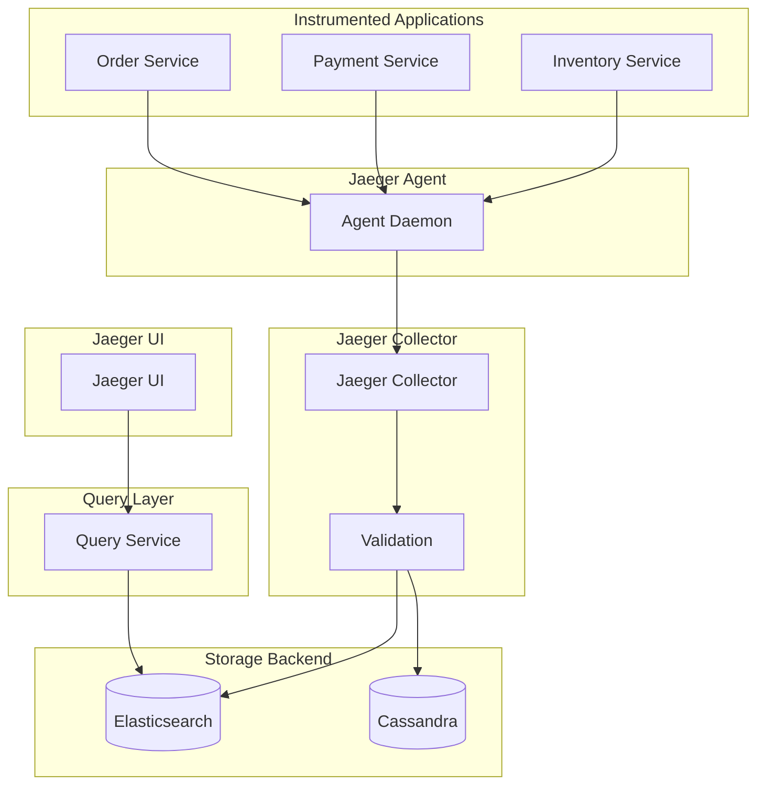

# Jaeger Distributed Tracing Patterns

## Overview

Jaeger is an open-source distributed tracing system developed by Uber Technologies. It follows the OpenTracing standard and provides distributed transaction monitoring, performance optimization, and root cause analysis for microservices.

Jaeger enables visualization of request flows through distributed systems, showing how requests move between services and identifying where time is spent. This insight is essential for optimizing performance and debugging issues in complex microservices architectures.

Jaeger provides a web-based UI for trace visualization, a collector for receiving trace data, query service for searching traces, and storage backends (in-memory, Cassandra, Elasticsearch, Badger).

## Jaeger Components

Jaeger consists of several components that work together to collect, store, and visualize traces.

**Jaeger Agent**: A daemon that listens for spans from instrumented applications and forwards them to the collector. The agent can run as a sidecar or node-level daemon.

**Jaeger Collector**: Receives spans from agents or directly from applications, validates them, and stores them in the configured storage backend.

**Jaeger Query Service**: Provides APIs for accessing stored traces, used by the Jaeger UI and programmatic access.

**Jaeger UI**: A web-based interface for searching and visualizing traces, service dependency maps, and performance metrics.

## Architecture



Jaeger flows from instrumented applications through agents to collectors, storage, and UI.

## Java Implementation

```java
import io.jaegertracing.internal.JaegerTracer;
import io.jaegertracing.internal.reporters.Reporter;
import io.jaegertracing.internal.senders.HttpSender;
import io.jaegertracing.internal.senders.UdpSender;
import io.jaegertracing.sdkspan;
import io.jaegertracing.Configuration;
import io.opentracing.Span;
import io.opentracing.Tracer;
import io.opentracing.propagation.Format;
import io.opentracing.propagation.TextMap;
import io.opentracing.tag.Tags;
import java.util.Map;
import java.util.HashMap;

public class JaegerPatternExample {
    
    private final Tracer tracer;
    
    public JaegerPatternExample() {
        Configuration config = new Configuration("order-service")
            .withSampler(new Configuration.SamplerConfiguration()
                .withType("const")
                .withParam(1))
            .withReporter(new Configuration.ReporterConfiguration()
                .withLogSpans(true)
                .withSender(new HttpSender.Builder(
                    "http://jaeger-collector:14268/api/traces"
                ).build()));
        
        this.tracer = config.getTracer();
    }
    
    public Tracer getTracer() {
        return tracer;
    }
    
    public void processOrder(String orderId, String userId) throws Exception {
        Span span = tracer.buildSpan("processOrder")
            .withTag("order.id", orderId)
            .withTag("user.id", userId)
            .start();
        
        try (io.opentracing.ScopedSpan scoped = 
             io.opentracing.SpanUtils.startScope(span)) {
            
            span.log("Order processing started");
            
            validateOrder(orderId, span);
            checkInventory(orderId, span);
            processPayment(orderId, userId, span);
            
            span.setTag("order.status", "completed");
            span.finish();
            
        } catch (Exception e) {
            Tags.ERROR.set(span, true);
            span.log(e.getMessage());
            throw e;
        }
    }
    
    private void validateOrder(String orderId, Span parentSpan) {
        Span span = tracer.buildSpan("validateOrder")
            .asChildOf(parentSpan)
            .withTag("order.id", orderId)
            .start();
        
        try {
            Thread.sleep(100);
            span.log("Order validated");
            span.finish();
        } catch (Exception e) {
            Tags.ERROR.set(span, true);
            span.log(e.getMessage());
            span.finish();
        }
    }
    
    private void checkInventory(String orderId, Span parentSpan) {
        Span span = tracer.buildSpan("checkInventory")
            .asChildOf(parentSpan)
            .withTag("inventory.check.type", "availability")
            .start();
        
        try {
            span.log("Checking inventory");
            Thread.sleep(150);
            span.setTag("inventory.available", true);
            span.finish();
        } catch (Exception e) {
            Tags.ERROR.set(span, true);
            span.log(e.getMessage());
            span.finish();
        }
    }
    
    private void processPayment(String orderId, String userId, Span parentSpan) {
        Span span = tracer.buildSpan("processPayment")
            .asChildOf(parentSpan)
            .withTag("order.id", orderId)
            .withTag("user.id", userId)
            .withTag("payment.method", "credit_card")
            .start();
        
        try {
            span.log("Processing payment");
            Thread.sleep(200);
            span.setTag("payment.transaction.id", "txn-" + orderId);
            span.setTag("payment.status", "success");
            span.finish();
        } catch (Exception e) {
            Tags.ERROR.set(span, true);
            span.log(e.getMessage());
            span.finish();
        }
    }
    
    public Span extractContext(Map<String, String> headers) {
        return tracer.extract(
            Format.HTTP_HEADERS,
            new TextMapCarrier(headers)
        );
    }
    
    public void injectContext(Span span, Map<String, String> headers) {
        tracer.inject(span.context(), Format.HTTP_HEADERS, 
                    new TextMapCarrier(headers));
    }
    
    public static class TextMapCarrier implements TextMap {
        private final Map<String, String> headers;
        
        public TextMapCarrier(Map<String, String> headers) {
            this.headers = headers;
        }
        
        @Override
        public void put(String key, String value) {
            headers.put(key, value);
        }
        
        @Override
        public Iterator<Entry<String, String>> iterator() {
            return headers.entrySet().iterator();
        }
    }
    
    public static void main(String[] args) throws Exception {
        JaegerPatternExample example = new JaegerPatternExample();
        
        Map<String, String> headers = new HashMap<>();
        
        Span existingSpan = example.extractContext(headers);
        if (existingSpan != null) {
            example.injectContext(existingSpan, headers);
        }
        
        for (int i = 0; i < 10; i++) {
            example.processOrder("ORD-" + i, "user-" + i);
        }
        
        Thread.sleep(2000);
        
        System.out.println("Jaeger traces sent. View at http://localhost:16686");
    }
}


class JaegerConfig {
    
    public static Configuration createConfig(String serviceName) {
        return new Configuration(serviceName)
            .withSampler(new Configuration.SamplerConfiguration()
                .withType("probabilistic")
                .withParam(0.5))
            .withReporter(new Configuration.ReporterConfiguration()
                .withLogSpans(true)
                .withMaxQueueSize(1000)
                .withFlushIntervalMs(5000));
    }
    
    public static Configuration createRemoteConfig(String serviceName, 
                                                     String jaegerEndpoint) {
        return new Configuration(serviceName)
            .withSampler(new Configuration.SamplerConfiguration()
                .withType("remote")
                .withParam(0.01))
            .withReporter(new Configuration.ReporterConfiguration()
                .withLogSpans(true)
                .withSender(new HttpSender.Builder(jaegerEndpoint).build()));
    }
}


class SamplingJaegerClient {
    
    private final Tracer tracer;
    private final double sampleRate;
    
    public SamplingJaegerClient(double sampleRate) {
        this.sampleRate = sampleRate;
        
        Configuration config = new Configuration("sampled-service")
            .withSampler(new Configuration.SamplerConfiguration()
                .withType("probabilistic")
                .withParam(sampleRate))
            .withReporter(new Configuration.ReporterConfiguration()
                .withLogSpans(true));
        
        this.tracer = config.getTracer();
    }
    
    public Tracer getTracer() {
        return tracer;
    }
}
```

## Python Implementation

```python
from jaeger_client import Tracer, ConstSampler, HttpReporter, Span
from jaeger_client.span import Span as JaegerSpan
from jaeger_client.request import HTTPClient
from jaeger_client import config as jaeger_config
from opentracing import Tracer as OTSpan
from opentracing.propagation import TEXT_MAP
from opentracing.ext import tags
import random
import time
from typing import Dict, Optional, Any


class JaegerTracer:
    """Jaeger tracer wrapper."""
    
    def __init__(self, service_name: str, 
                 sampling_rate: float = 1.0,
                 jaeger_agent_host: str = "jaeger-agent",
                 jaeger_agent_port: int = 6831):
        self.service_name = service_name
        
        jaeger_config.default_config.service_name = service_name
        jaeger_config.default_config.sampler = ConstSampler(True)
        jaeger_config.default_config.reporter = HttpReporter(
            jaeger_agent_host=jaeger_agent_host,
            jaeger_agent_port=jaeger_agent_port,
            max_buffered_logs=100,
            flush_interval_ms=5000
        )
        
        self.tracer = Tracer()
    
    def start_span(self, operation_name: str, parent_span: Optional[JaegerSpan] = None,
                **tags) -> JaegerSpan:
        """Start a new span."""
        span = self.tracer.start_span(
            operation_name,
            parent_name=parent_span.operation_name if parent_span else None,
            **tags
        )
        
        return span
    
    def inject(self, span: JaegerSpan, carrier: Dict[str, str]):
        """Inject span context into carrier."""
        self.tracer.inject(span, TEXT_MAP, carrier)
    
    def extract(self, carrier: Dict[str, str]) -> Optional[JaegerSpan]:
        """Extract span context from carrier."""
        return self.tracer.extract(TEXT_MAP, carrier)


class OrderServiceJaeger:
    """Order service with Jaeger tracing."""
    
    def __init__(self):
        self.jaeger = JaegerTracer(
            service_name="order-service",
            sampling_rate=1.0,
            jaeger_agent_host="jaeger-agent",
            jaeger_agent_port=6831
        )
        
        self.tracer = self.jaeger.tracer
    
    def process_order(self, order_id: str, user_id: str):
        """Process an order with tracing."""
        with self.tracer.start_active_span("processOrder") as span:
            span.set_tag("order.id", order_id)
            span.set_tag("user.id", user_id)
            span.log_event("Order processing started")
            
            try:
                self.validate_order(order_id, span)
                self.check_inventory(order_id, span)
                self.process_payment(order_id, user_id, span)
                
                span.set_tag("order.status", "completed")
                
            except Exception as e:
                span.set_tag(tags.ERROR, True)
                span.log_event(str(e))
                raise
    
    def validate_order(self, order_id: str, parent_span: JaegerSpan):
        """Validate order."""
        with self.tracer.start_active_span(
            "validateOrder",
            child_of=parent_span
        ) as span:
            span.set_tag("order.id", order_id)
            time.sleep(0.1)
            span.log_event("Order validated")
    
    def check_inventory(self, order_id: str, parent_span: JaegerSpan):
        """Check inventory."""
        with self.tracer.start_active_span(
            "checkInventory",
            child_of=parent_span
        ) as span:
            span.set_tag("inventory.check.type", "availability")
            span.log_event("Checking inventory")
            time.sleep(0.15)
            span.set_tag("inventory.available", True)
    
    def process_payment(self, order_id: str, user_id: str, 
                    parent_span: JaegerSpan):
        """Process payment."""
        with self.tracer.start_active_span(
            "processPayment",
            child_of=parent_span
        ) as span:
            span.set_tag("order.id", order_id)
            span.set_tag("user.id", user_id)
            span.set_tag("payment.method", "credit_card")
            span.log_event("Processing payment")
            time.sleep(0.2)
            span.set_tag("payment.transaction.id", f"txn_{order_id}")
            span.set_tag("payment.status", "success")


class HTTPPropagation:
    """HTTP propagation with Jaeger."""
    
    def __init__(self, jaeger: JaegerTracer):
        self.jaeger = jaeger
    
    def inject_headers(self, span: JaegerSpan) -> Dict[str, str]:
        """Inject Jaeger headers into HTTP request."""
        headers = {}
        self.jaeger.inject(span, headers)
        return headers
    
    def extract_span(self, headers: Dict[str, str]) -> Optional[JaegerSpan]:
        """Extract Jaeger span from HTTP headers."""
        if "x-b3-traceid" in headers or "uber-trace-id" in headers:
            return self.jaeger.extract(headers)
        return None


def configure_jaeger_tracing(service_name: str, 
                            sampling_rate: float = 1.0) -> JaegerTracer:
    """Configure Jaeger tracing."""
    return JaegerTracer(
        service_name=service_name,
        sampling_rate=sampling_rate
    )


if __name__ == "__main__":
    service = OrderServiceJaeger()
    
    for i in range(10):
        try:
            service.process_order(f"ORD-{i}", f"user-{i}")
        except Exception as e:
            print(f"Error processing order: {e}")
        
        time.sleep(0.5)
    
    time.sleep(2)
    print("Jaeger traces sent. View at http://localhost:16686")
```

## Real-World Examples

**Uber** uses Jaeger extensively across their microservices to monitor request flows and identify performance issues.

**Cloverleaf** uses Jaeger for distributed tracing of their messaging platform.

**Ticketmaster** uses Jaeger for tracing customer requests across their ticketing platform.

## Output Statement

Organizations implementing Jaeger can expect: visual understanding of request flows; identification of bottlenecks across services; root cause analysis for failures; and performance optimization through latency analysis.

Jaeger provides production-ready distributed tracing with excellent visualization capabilities.

## Best Practices

1. **Configure Appropriate Sampling**: Use probabilistic sampling (0.01-0.1) for high-throughput services to control costs.

2. **Add Business Tags**: Include business context (order IDs, user IDs) in spans for correlation.

3. **Use Consistent Naming**: Use consistent span names across services for better visualization.

4. **Configure Storage Backend**: Use Elasticsearch for production deployments with HA requirements.

5. **Propagate Context**: Ensure context is propagated through all HTTP calls.

6. **Configure Retention**: Set appropriate retention (7-14 days) based on analysis needs and storage costs.