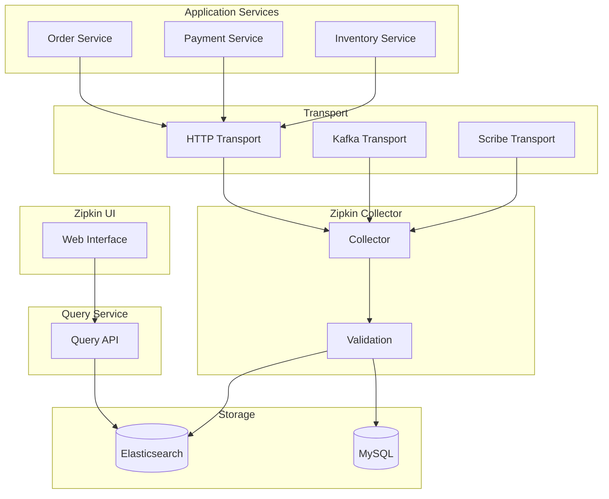

# Zipkin Distributed Tracing Patterns

## Overview

Zipkin is an open-source distributed tracing system originally developed by Twitter based on their work on Finagle. It was one of the first widely adopted distributed tracing systems and has influenced many subsequent tracing implementations.

Zipkin provides collection, storage, and visualization of trace data. Its architecture follows a similar pattern to Jaeger, with collectors receiving span data, storage backends persisting spans, and a web UI for visualization.

Zipkin uses its own data format and supports multiple transport mechanisms (HTTP, Scribe, Kafka). It integrates with OpenZipkin libraries and provides bridges to OpenTracing and OpenTelemetry.

## Zipkin Components

Zipkin consists of several components that work together for distributed tracing.

**Zipkin Collector**: Receives spans from instrumented applications, validates them, and stores them. Supports multiple transport mechanisms.

**Storage Backend**: Persists trace data. Supports in-memory (development), MySQL, PostgreSQL, Elasticsearch, and Cassandra.

**Query Service**: Provides APIs for searching and retrieving traces.

**Web UI**: A web-based interface for visualizing traces and service dependencies.

## Architecture



Zipkin uses transport layers to receive spans, collectors to process, and storage for persistence.

## Java Implementation

```java
import zipkin2.Span;
import zipkin2.Annotation;
import zipkin2.Endpoint;
import zipkin2.collector.Collector;
import zipkin2.collector.CollectorMetrics;
import zipkin2.collector.http.HTTPCollectorMetrics;
import zipkin2.codec.Codec;
import zipkin2.codec.SpanCodec;
import zipkin2.storage.StorageComponent;
import zipkin2.storage.CassandraStorage;
import zipkin2.storage.MySQLStorage;
import zipkin2.storage.ElasticsearchStorage;
import zipkin2.reporter.Encoder;
import zipkin2.reporter.Reporter;
import zipkin2.reporter.http.LazyReport;
import zipkin2.reporter.okhttp3.OkHttpSender;
import zipkin2.internal.V2JsonCodec;
import zipkin2.annotation.Tags;
import okhttp3.OkHttpClient;
import java.util.List;
import java.util.ArrayList;
import java.util.Map;
import java.util.concurrent.TimeUnit;

public class ZipkinPatternExample {
    
    private final Reporter<Span> reporter;
    private static final String SERVICE_NAME = "order-service";
    
    public ZipkinPatternExample() {
        OkHttpSender sender = OkHttpSender.newBuilder()
            .endpoint("http://zipkin:9411/api/v2/spans")
            .connectTimeout(5, TimeUnit.SECONDS)
            .readTimeout(5, TimeUnit.SECONDS)
            .build();
        
        this.reporter = Reporter.create(sender);
    }
    
    public void processOrder(String orderId, String userId) {
        long startTimestamp = System.currentTimeMillis() * 1000;
        
        Span.Builder builder = Span.newBuilder()
            .traceId(generateTraceId())
            .name("processOrder")
            .kind(Span.Kind.SERVER)
            .timestamp(startTimestamp)
            .putTag("order.id", orderId)
            .putTag("user.id", userId)
            .putTag("service.name", SERVICE_NAME)
            .localEndpoint(Endpoint.newBuilder()
                .serviceName(SERVICE_NAME)
                .ip("127.0.0.1")
                .port(8080)
                .build());
        
        try {
            Annotation start = Annotation.newBuilder()
                .timestamp(startTimestamp)
                .value("Order processing started")
                .build();
            
            Span parentSpan = builder.build();
            reporter.report(parentSpan);
            
            validateOrder(orderId);
            checkInventory(orderId);
            processPayment(orderId, userId);
            
            long endTimestamp = System.currentTimeMillis() * 1000;
            Span completed = parentSpan.toBuilder()
                .timestamp(endTimestamp)
                .duration(endTimestamp - startTimestamp)
                .putTag("order.status", "completed")
                .addAnnotation(Annotation.newBuilder()
                    .timestamp(endTimestamp)
                    .value("Order completed")
                    .build())
                .build();
            
            reporter.report(completed);
            
        } catch (Exception e) {
            long endTimestamp = System.currentTimeMillis() * 1000;
            Span error = parentSpan.toBuilder()
                .timestamp(endTimestamp)
                .duration(endTimestamp - startTimestamp)
                .putTag("error", "true")
                .putTag("error.message", e.getMessage())
                .kind(Span.Kind.ERROR)
                .build();
            
            reporter.report(error);
            throw e;
        }
    }
    
    private void validateOrder(String orderId) {
        long startTimestamp = System.currentTimeMillis() * 1000;
        
        Span span = Span.newBuilder()
            .traceId(generateTraceId())
            .name("validateOrder")
            .timestamp(startTimestamp)
            .putTag("order.id", orderId)
            .localEndpoint(Endpoint.newBuilder()
                .serviceName(SERVICE_NAME)
                .build())
            .build();
        
        reporter.report(span);
        
        try {
            Thread.sleep(100);
        } catch (InterruptedException e) {
            Thread.currentThread().interrupt();
        }
        
        long endTimestamp = System.currentTimeMillis() * 1000;
        Span completed = span.toBuilder()
            .timestamp(endTimestamp)
            .duration(endTimestamp - startTimestamp)
            .build();
        
        reporter.report(completed);
    }
    
    private void checkInventory(String orderId) {
        long startTimestamp = System.currentTimeMillis() * 1000;
        
        Span span = Span.newBuilder()
            .traceId(generateTraceId())
            .name("checkInventory")
            .timestamp(startTimestamp)
            .putTag("inventory.check.type", "availability")
            .localEndpoint(Endpoint.newBuilder()
                .serviceName(SERVICE_NAME)
                .build())
            .build();
        
        reporter.report(span);
        
        try {
            Thread.sleep(150);
        } catch (InterruptedException e) {
            Thread.currentThread().interrupt();
        }
        
        long endTimestamp = System.currentTimeMillis() * 1000;
        Span completed = span.toBuilder()
            .timestamp(endTimestamp)
            .duration(endTimestamp - startTimestamp)
            .putTag("inventory.available", "true")
            .build();
        
        reporter.report(completed);
    }
    
    private void processPayment(String orderId, String userId) {
        long startTimestamp = System.currentTimeMillis() * 1000;
        
        Span span = Span.newBuilder()
            .traceId(generateTraceId())
            .name("processPayment")
            .timestamp(startTimestamp)
            .putTag("order.id", orderId)
            .putTag("user.id", userId)
            .putTag("payment.method", "credit_card")
            .localEndpoint(Endpoint.newBuilder()
                .serviceName(SERVICE_NAME)
                .build())
            .build();
        
        reporter.report(span);
        
        try {
            Thread.sleep(200);
        } catch (InterruptedException e) {
            Thread.currentThread().interrupt();
        }
        
        long endTimestamp = System.currentTimeMillis() * 1000;
        Span completed = span.toBuilder()
            .timestamp(endTimestamp)
            .duration(endTimestamp - startTimestamp)
            .putTag("payment.transaction.id", "txn-" + orderId)
            .putTag("payment.status", "success")
            .build();
        
        reporter.report(completed);
    }
    
    private String generateTraceId() {
        return java.util.UUID.randomUUID().toString().replace("-", "");
    }
    
    public static void main(String[] args) {
        ZipkinPatternExample example = new ZipkinPatternExample();
        
        for (int i = 0; i < 10; i++) {
            try {
                example.processOrder("ORD-" + i, "user-" + i);
            } catch (Exception e) {
                System.err.println("Error: " + e.getMessage());
            }
        }
        
        System.out.println("Zipkin traces sent. View at http://localhost:9411");
    }
}


class ZipkinConfig {
    
    public static StorageComponent createInMemoryStorage() {
        return InMemStorage.newBuilder()
            .maxSpans(100000)
            .build();
    }
    
    public static MySQLStorage createMySQLStorage(String jdbcUrl, String username, 
                                            String password) {
        return MySQLStorage.builder()
            .jdbcUrl(jdbcUrl)
            .username(username)
            .password(password)
            .build();
    }
    
    public static ElasticsearchStorage createElasticsearchStorage(
            String hosts, String index) {
        return ElasticsearchStorage.builder()
            .hosts(hosts.split(","))
            .index(index)
            .build();
    }
}


class ZipkinCollector {
    
    public static void main(String[] args) {
        CollectorMetrics metrics = HTTPCollectorMetrics.builder().build();
        
        Collector builder = Collector.builder()
            .storage(createInMemoryStorage())
            .metrics(metrics)
            .codec(Codec.JSON)
            .build();
        
        System.out.println("Starting Zipkin collector");
    }
}
```

## Python Implementation

```python
from zipkin_api.api import Api
from zipkin_handler.handler import ZipkinFlaskHandler
from zipkin_data.ttypes import TraceId, Span, Annotation, Endpoint
from zipkin_client.collector import HTTPCollector
import random
import time
import uuid
from typing import List, Dict, Optional


class ZipkinClient:
    """Zipkin client for Python."""
    
    def __init__(self, service_name: str, 
                 zipkin_host: str = "zipkin",
                 zipkin_port: int = 9411):
        self.service_name = service_name
        self.collector = HTTPCollector(
            host_name=zipkin_host,
            port=zipkin_port
        )
    
    def start_trace(self, operation_name: str, 
                 parent_trace_id: Optional[str] = None) -> Span:
        """Start a new trace."""
        if parent_trace_id:
            trace_id = parent_trace_id
        else:
            trace_id = self.generate_trace_id()
        
        span = Span(
            traceIdHigh=0,
            traceIdLow=int(trace_id, 16),
            name=operation_name,
            id=int(self.generate_span_id(), 16),
            kind="SERVER",
            timestamp=int(time.time() * 1000000),
            localEndpoint=self.create_endpoint()
        )
        
        return span
    
    def create_endpoint(self, port: int = 8080) -> Endpoint:
        """Create endpoint."""
        return Endpoint(
            serviceName=self.service_name,
            port=port
        )
    
    def generate_trace_id(self) -> str:
        """Generate trace ID."""
        return uuid.uuid4().hex
    
    def generate_span_id(self) -> str:
        """Generate span ID."""
        return uuid.uuid4().hex[:16]
    
    def record_span(self, span: Span):
        """Record span to Zipkin."""
        self.collector.record_span(span)
    
    def finish_span(self, span: Span, status: str = "ok"):
        """Finish a span."""
        span.duration = int(time.time() * 1000000) - span.timestamp
        span.putTag("status", status)
        self.record_span(span)


class OrderServiceZipkin:
    """Order service with Zipkin tracing."""
    
    def __init__(self):
        self.zipkin = ZipkinClient("order-service")
    
    def process_order(self, order_id: str, user_id: str):
        """Process order with Zipkin tracing."""
        span = self.zipkin.start_trace("processOrder")
        span.putTag("order.id", order_id)
        span.putTag("user.id", user_id)
        
        annotations = [
            Annotation(
                timestamp=int(time.time() * 1000000),
                value="Order processing started"
            )
        ]
        
        try:
            self.validate_order(order_id)
            self.check_inventory(order_id)
            self.process_payment(order_id, user_id)
            
            span.putTag("order.status", "completed")
            
        except Exception as e:
            span.putTag("error", "true")
            span.putTag("error.message", str(e))
            raise
        
        finally:
            self.zipkin.finish_span(span)
    
    def validate_order(self, order_id: str):
        """Validate order."""
        with self.tracer_span("validateOrder") as span:
            span.putTag("order.id", order_id)
            time.sleep(0.1)
    
    def check_inventory(self, order_id: str):
        """Check inventory."""
        with self.tracer_span("checkInventory") as span:
            span.putTag("inventory.check.type", "availability")
            time.sleep(0.15)
            span.putTag("inventory.available", "true")
    
    def process_payment(self, order_id: str, user_id: str):
        """Process payment."""
        with self.tracer_span("processPayment") as span:
            span.putTag("order.id", order_id)
            span.putTag("payment.method", "credit_card")
            time.sleep(0.2)
            span.putTag("payment.transaction.id", f"txn_{order_id}")
            span.putTag("payment.status", "success")
    
    def tracer_span(self, name: str):
        """Create a tracing span."""
        return ZipkinSpanContext(self.zipkin, name)
    
    def close(self):
        """Close the Zipkin client."""
        self.zipkin.collector.close()


class ZipkinSpanContext:
    """Context manager for Zipkin spans."""
    
    def __init__(self, zipkin: ZipkinClient, operation_name: str):
        self.zipkin = zipkin
        self.operation_name = operation_name
        self.span = None
    
    def __enter__(self):
        self.span = self.zipkin.start_trace(self.operation_name)
        return self.span
    
    def __exit__(self, exc_type, exc_val, exc_tb):
        if self.span:
            status = "error" if exc_type else "ok"
            self.zipkin.finish_span(self.span, status)


def configure_zipkin(service_name: str, 
                   zipkin_host: str = "zipkin") -> ZipkinClient:
    """Configure Zipkin client."""
    return ZipkinClient(service_name, zipkin_host)


if __name__ == "__main__":
    service = OrderServiceZipkin()
    
    for i in range(10):
        try:
            service.process_order(f"ORD-{i}", f"user-{i}")
        except Exception as e:
            print(f"Error: {e}")
        
        time.sleep(0.5)
    
    service.close()
    print("Zipkin traces sent.")
```

## Real-World Examples

**Twitter** originally developed Zipkin and uses it across their infrastructure.

**Baidu** uses Zipkin for distributed tracing across their services.

**Square** uses Zipkin for monitoring microservices.

## Output Statement

Organizations implementing Zipkin can expect: lightweight tracing with minimal overhead; flexible deployment with multiple storage backends; established integration with many frameworks; and visualization of request flows.

Zipkin provides proven distributed tracing with a small footprint and broad framework support.

## Best Practices

1. **Use Appropriate Sampling**: Configure sampling (0.01-0.1) for high-volume services.

2. **Add Service Tags**: Include service name as a tag for all spans.

3. **Include Business Context**: Add business identifiers (order IDs, user IDs) as tags.

4. **Use Consistent Naming**: Use consistent operation names across services.

5. **Configure Storage**: Use Elasticsearch or Cassandra for production traces.

6. **Propagate Trace Headers**: Use b3 propagation format for compatibility.