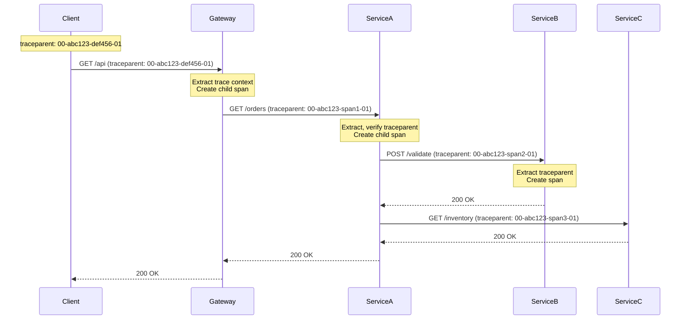

# Trace Context Propagation Patterns

## Overview

Trace context propagation is the mechanism that ensures trace information flows correctly between services. When a request traverses multiple services, the trace context must be extracted from incoming requests, potentially modified for child operations, and injected into outgoing requests.

The W3C Trace Context specification standardizes how trace information is passed between services. This includes the traceparent header (containing trace ID, span ID, and trace flags) and the tracestate header (for vendor-specific information).

Proper context propagation enables complete end-to-end traces, showing the complete journey of requests across service boundaries. This is essential for understanding distributed system behavior and debugging issues.

## Trace Context Model

The trace context model consists of three main pieces of information that must be propagated.

**Trace ID**: A 128-bit identifier that remains constant throughout a trace. All spans in a single trace share the same trace ID. The trace ID is generated at the entry point and propagated to all downstream services.

**Span ID**: A 64-bit identifier unique within a trace. Each span has its own span ID and may have a parent span ID. Child spans reference their parent's span ID.

**Trace Flags**: Flags controlling trace behavior, including sampled flag (whether the trace should be recorded) and propagation options.

## W3C Trace Context Format

The W3C Trace Context specification defines standard formats for propagating context.

**traceparent**: Contains trace ID, span ID, trace flags, and version. Format: `version-traceid-spanid-traceflags`

**tracestate**: Contains vendor-specific information as key-value pairs in HTTP header format.

## Flow Diagram



Context flows through the request chain, with each service creating child spans.

## Java Implementation

```java
import io.opentelemetry.api.trace.Tracer;
import io.opentelemetry.api.trace.Span;
import io.opentelemetry.api.trace.SpanBuilder;
import io.opentelemetry.api.trace.SpanKind;
import io.opentelemetry.api.trace.StatusCode;
import io.opentelemetry.context.propagation.TextMapPropagator;
import io.opentelemetry.context.propagation.DefaultTextMapPropagator;
import io.opentelemetry.api.common.AttributeKey;
import io.opentelemetry.api.common.Attributes;
import io.opentelemetry.extension.trace.propagation.B3Propagator;
import io.opentelemetry.extension.trace.propagation.JaegerPropagator;
import io.opentelemetry.extension.trace.propagation.CloudTracePropagator;
import io.opentelemetry.sdk.trace.SdkTracerProvider;
import io.opentelemetry.sdk.trace.export.BatchSpanProcessor;
import io.opentelemetry.sdk.OpenTelemetrySdk;
import io.opentelemetry.sdk.resources.Resource;
import io.opentelemetry.semconv.ResourceAttributes;
import io.opentelemetry.exporter.jaeger.JaegerGrpcSpanExporter;
import java.util.Map;
import java.util.HashMap;
import java.util.Set;
import java.util.Iterator;

public class TraceContextPropagationExample {
    
    public static final String TRACEPARENT = "traceparent";
    public static final String TRACESTATE = "tracestate";
    
    private final Tracer tracer;
    private final TextMapPropagator w3cPropagator;
    private final TextMapPropagator b3Propagator;
    
    public TraceContextPropagationExample() {
        Resource resource = Resource.getDefault()
            .merge(Resource.create(Attributes.of(
                ResourceAttributes.SERVICE_NAME, "order-service"
            )));
        
        SdkTracerProvider provider = SdkTracerProvider.builder()
            .setResource(resource)
            .addSpanProcessor(BatchSpanProcessor.builder(
                JaegerGrpcSpanExporter.builder()
                    .setEndpoint("http://jaeger-collector:14250")
                    .build()
            ).build())
            .build();
        
        OpenTelemetrySdk sdk = OpenTelemetrySdk.builder()
            .setTracerProvider(provider)
            .build();
        
        this.tracer = sdk.getTracer("order-service");
        
        this.w3cPropagator = io.opentelemetry.api.trace.propagation
            .W3CTraceContextPropagator.getInstance();
        
        this.b3Propagator = B3Propagator.getInstance();
    }
    
    public Map<String, String> injectContext(Map<String, String> carrier) {
        Span currentSpan = Span.current();
        
        if (currentSpan.getSpanContext().getTraceId().isValid()) {
            w3cPropagator.inject(
                io.opentelemetry.context.Context.current()
                    .with(io.opentelemetry.api.trace.Span.current()),
                carrier,
                (k, v) -> carrier.put(k, v)
            );
        } else {
            Span span = tracer.spanBuilder("new-request").startSpan();
            try (io.opentelemetry.context.Scope scope = 
                 span.makeCurrent()) {
                w3cPropagator.inject(
                    io.opentelemetry.context.Context.current(),
                    carrier,
                    (k, v) -> carrier.put(k, v)
                );
            } finally {
                span.end();
            }
        }
        
        return carrier;
    }
    
    public Span extractContext(Map<String, String> headers) {
        io.opentelemetry.context.Context context = w3cPropagator.extract(
            io.opentelemetry.context.Context.current(),
            headers,
            (carrier, key) -> carrier.get(key)
        );
        
        return io.opentelemetry.api.trace.Span.fromContext(context);
    }
    
    public void processRequest(String orderId) {
        Span span = tracer.spanBuilder("processRequest")
            .setSpanKind(SpanKind.SERVER)
            .setAttribute("order.id", orderId)
            .startSpan();
        
        try (io.opentelemetry.context.Scope scope = 
             span.makeCurrent()) {
            
            validateOrder(orderId);
            checkInventory(orderId);
            processPayment(orderId);
            
        } finally {
            span.end();
        }
    }
    
    private void validateOrder(String orderId) {
        Span span = tracer.spanBuilder("validateOrder")
            .setParent(Span.current())
            .startSpan();
        
        try (io.opentelemetry.context.Scope scope = 
             span.makeCurrent()) {
            span.setAttribute("order.id", orderId);
        } finally {
            span.end();
        }
    }
    
    private void checkInventory(String orderId) {
        Span span = tracer.spanBuilder("checkInventory")
            .setParent(Span.current())
            .startSpan();
        
        try (io.opentelemetry.context.Scope scope = 
             span.makeCurrent()) {
            span.setAttribute("order.id", orderId);
        } finally {
            span.end();
        }
    }
    
    private void processPayment(String orderId) {
        Span span = tracer.spanBuilder("processPayment")
            .setParent(Span.current())
            .startSpan();
        
        try (io.opentelemetry.context.Scope scope = 
             span.makeCurrent()) {
            span.setAttribute("order.id", orderId);
        } finally {
            span.end();
        }
    }
    
    public Map<String, String> createHttpHeaders(
            io.opentelemetry.context.Context context) {
        Map<String, String> headers = new HashMap<>();
        
        w3cPropagator.inject(context, headers, 
            (k, v) -> headers.put(k, v));
        
        return headers;
    }
    
    public static void main(String[] args) {
        TraceContextPropagationExample example = 
            new TraceContextPropagationExample();
        
        Map<String, String> headers = new HashMap<>();
        headers.put("Content-Type", "application/json");
        headers.put("Accept", "application/json");
        
        example.injectContext(headers);
        
        System.out.println("traceparent: " + headers.get(TRACEPARENT));
        System.out.println("tracestate: " + headers.get(TRACESTATE));
        
        example.processRequest("ORD-12345");
    }
}


class W3CTraceContextFormatter {
    
    public static String format(String traceId, String spanId, 
                                int traceFlags) {
        return String.format("00-%s-%s-%02x", 
            traceId, spanId, traceFlags);
    }
    
    public static String[] parse(String traceparent) {
        String[] parts = traceparent.split("-");
        if (parts.length != 4) {
            throw new IllegalArgumentException(
                "Invalid traceparent format");
        }
        
        return new String[]{
            parts[1],
            parts[2],
            parts[3]
        };
    }
}


class MultiPropagatorSupport {
    
    private final Map<String, TextMapPropagator> propagators;
    
    public MultiPropagatorSupport() {
        propagators = new HashMap<>();
        
        propagators.put("w3c", 
            io.opentelemetry.api.trace.propagation
                .W3CTraceContextPropagator.getInstance());
        
        propagators.put("b3", B3Propagator.getInstance());
        propagators.put("jaeger", JaegerPropagator.getInstance());
    }
    
    public TextMapPropagator getPropagator(String format) {
        TextMapPropagator propagator = propagators.get(format);
        if (propagator == null) {
            propagator = propagators.get("w3c");
        }
        return propagator;
    }
    
    public void injectAll(Map<String, String> headers) {
        for (TextMapPropagator propagator : propagators.values()) {
            propagator.inject(
                io.opentelemetry.context.Context.current(),
                headers,
                (k, v) -> {}
            );
        }
    }
}
```

## Python Implementation

```python
from opentracing import global_tracer
from opentracing.propagation import Format, SpanContext
from opentacing.propagation import TextMapPropagator
from opentacing.ext import tags
import requests
import json
import uuid
import time


class TraceContextPropagator:
    """W3C Trace Context propagation."""
    
    def __init__(self):
        self.tracer = global_tracer()
    
    def inject(self, span, carrier: dict):
        """Inject span context into carrier."""
        self.tracer.inject(
            span,
            Format.HTTP_HEADERS,
            carrier
        )
    
    def extract(self, carrier: dict):
        """Extract span context from carrier."""
        return self.tracer.extract(
            Format.HTTP_HEADERS,
            carrier
        )
    
    def new_trace(self):
        """Start new trace."""
        with self.tracer.start_active_span("new-request") as span:
            return span
    
    def continue_trace(self, carrier: dict):
        """Continue existing trace."""
        span_ctx = self.extract(carrier)
        
        if span_ctx:
            return self.tracer.start_active_span(
                "request",
                child_of=span_ctx
            )
        else:
            return self.new_trace()


class HTTPClientPropagation:
    """HTTP client with trace propagation."""
    
    def __init__(self, propagator: TraceContextPropagator):
        self.propagator = propagator
        self.session = requests.Session()
    
    def get(self, url: str, headers: dict = None):
        """GET request with propagation."""
        headers = headers or {}
        
        with self.propagator.tracer.start_active_span(url) as span:
            self.propagator.inject(span, headers)
            
            response = self.session.get(
                url,
                headers=headers
            )
            
            return response
    
    def post(self, url: str, data: dict = None, 
             headers: dict = None):
        """POST request with propagation."""
        headers = headers or {}
        
        with self.propagator.tracer.start_active_span(url) as span:
            self.propagator.inject(span, headers)
            
            response = self.session.post(
                url,
                json=data,
                headers=headers
            )
            
            return response


class OrderServiceWithPropagation:
    """Order service with trace propagation."""
    
    def __init__(self):
        self.propagator = TraceContextPropagator()
        self.client = HTTPClientPropagation(self.propagator)
    
    def process_order(self, order_id: str):
        """Process order with propagation."""
        with self.propagator.tracer.start_active_span(
            "processOrder",
            tags={
                "order.id": order_id
            }
        ) as span:
            try:
                self.propagator.inject(span, span.context._parent)
                
                self.validate_order(order_id)
                self.check_inventory(order_id)
                self.process_payment(order_id)
                
                span.set_tag("order.status", "completed")
                
            except Exception as e:
                span.set_tag(tags.ERROR, True)
                span.set_tag("error.message", str(e))
                raise
    
    def validate_order(self, order_id: str):
        """Validate order."""
        with self.propagator.tracer.start_active_span(
            "validateOrder",
            child_of=global_tracer().active_span
        ) as span:
            span.set_tag("order.id", order_id)
            time.sleep(0.1)
    
    def check_inventory(self, order_id: str):
        """Check inventory."""
        with self.propagator.tracer.start_active_span(
            "checkInventory",
            child_of=global_tracer().active_span
        ) as span:
            span.set_tag("inventory.check.type", "availability")
            time.sleep(0.15)
            span.set_tag("inventory.available", "true")
    
    def process_payment(self, order_id: str):
        """Process payment."""
        with self.propagator.tracer.start_active_span(
            "processPayment",
            child_of=global_tracer().active_span
        ) as span:
            span.set_tag("payment.method", "credit_card")
            time.sleep(0.2)
            span.set_tag("payment.status", "success")


class W3CTraceContextFormatter:
    """Format and parse W3C traceparent."""
    
    VERSION = "00"
    
    @staticmethod
    def format(trace_id: str, span_id: str, 
                trace_flags: int = 1) -> str:
        """Format traceparent header."""
        return f"{W3CTraceContextFormatter.VERSION}-{trace_id}-{span_id:016x}-{trace_flags:02x}"
    
    @staticmethod
    def parse(traceparent: str) -> dict:
        """Parse traceparent header."""
        parts = traceparent.split("-")
        
        if len(parts) != 4:
            raise ValueError("Invalid traceparent format")
        
        return {
            "version": parts[0],
            "trace_id": parts[1],
            "span_id": parts[2],
            "trace_flags": int(parts[3], 16)
        }


def configure_propagation(propagator_type: str = "w3c"):
    """Configure trace context propagator."""
    
    if propagator_type == "b3":
        from opentracing.ext import b3
        return B3Propagator()
    elif propagator_type == "jaeger":
        return JaegerPropagator()
    else:
        return TraceContextPropagator()


if __name__ == "__main__":
    service = OrderServiceWithPropagation()
    
    for i in range(10):
        service.process_order(f"ORD-{i}")
        time.sleep(0.5)
    
    headers = {}
    with service.propagator.tracer.start_active_span("test") as span:
        service.propagator.inject(span, headers)
    
    print(f"Headers: {headers}")
```

## Real-World Examples

**Istio** uses W3C trace context for distributed tracing across the service mesh.

**AWS X-Ray** integrates with W3C context for cross-service traces.

**Google Cloud Trace** supports W3C propagation format.

## Output Statement

Organizations implementing trace context propagation can expect: complete end-to-end traces across all services; proper span relationships showing call hierarchies; debugging capability for issues spanning multiple services; and standardized propagation across polyglot microservices.

Trace context propagation enables the complete distributed tracing capability essential for microservices observability.

## Best Practices

1. **Use W3C Standard**: Adopt W3C Trace Context for standardized propagation.

2. **Propagate All Channels**: Ensure context propagates through HTTP, messaging, and async channels.

3. **Extract at Boundaries**: Always extract context at service entry points.

4. **Inject at Exits**: Always inject context when making outgoing requests.

5. **Handle Missing Context**: Generate new trace when context is missing.

6. **Validate Context**: Validate trace IDs to prevent malicious injection.

7. **Use Consistent Headers**: Standardize on traceparent and tracestate headers.