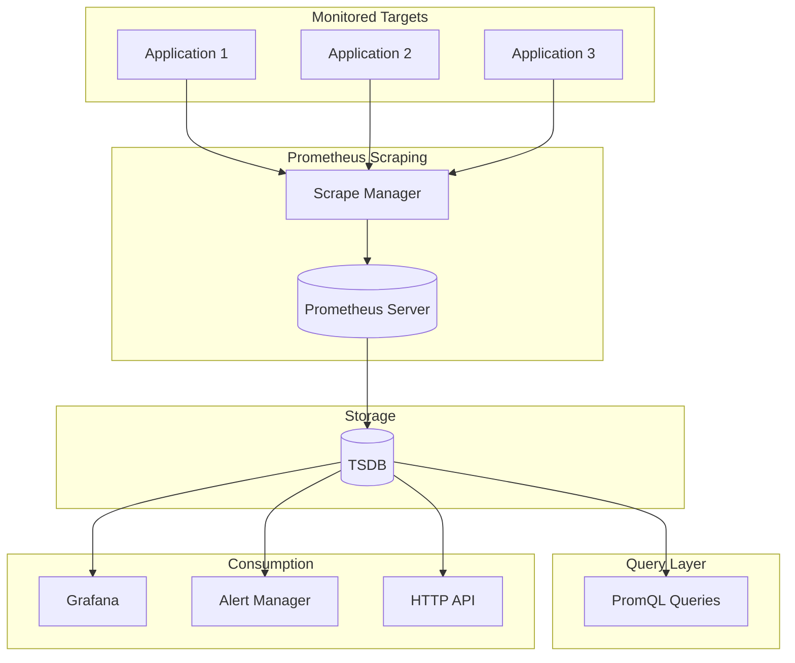

# Prometheus Metrics Patterns

## Overview

Prometheus is an open-source systems monitoring and alerting toolkit originally developed at SoundCloud. It collects metrics from monitored targets by scraping HTTP endpoints, storing time series data, and supporting powerful queries for analysis and alerting.

Prometheus has become the standard for metrics collection in cloud-native environments. Its pull-based model, powerful query language (PromQL), and integration with Kubernetes make it ideal for microservices observability.

Prometheus metrics follow a specific data model: metric name, labels (key-value pairs), and timestamped values. This model enables powerful aggregation and analysis capabilities.

## Prometheus Data Model

The Prometheus data model consists of several key components.

**Metric Name**: A descriptive name following naming conventions (e.g., `http_requests_total`). Names can include metric type suffixes (_total, _seconds, etc.).

**Labels**: Key-value pairs that enable dimensionaql grouping, filtering, and aggregation. Labels should use underscores and lowercase.

**Sample**: A timestamped value consisting of metric name, labels, timestamp, and value.

Prometheus supports four main metric types: Counter (monotonically increasing), Gauge (can go up/down), Histogram (distribution), and Summary (similar to histogram with quantiles).

## Architecture



Prometheus scrapes metrics from targets and stores in TSDB for querying.

## Java Implementation

```java
import io.prometheus.client.Counter;
import io.prometheus.client.Gauge;
import io.prometheus.client.Histogram;
import io.prometheus.client.Summary;
import io.prometheus.client.CollectorRegistry;
import io.prometheus.client.exporter.HTTPServer;
import io.prometheus.client.exporter.PushGateway;
import io.prometheus.client.hotspot.DefaultExports;
import java.util.concurrent.TimeUnit;
import java.util.function.Supplier;

public class PrometheusMetricsExample {
    
    private static final CollectorRegistry registry = new CollectorRegistry();
    
    private static final Counter httpRequestsTotal = Counter.build()
        .name("http_requests_total")
        .help("Total HTTP requests")
        .labelNames("method", "endpoint", "status")
        .register(registry);
    
    private static final Counter ordersTotal = Counter.build()
        .name("orders_total")
        .help("Total orders processed")
        .labelNames("status")
        .register(registry);
    
    private static final Gauge activeConnections = Gauge.build()
        .name("active_connections")
        .help("Number of active connections")
        .labelNames("service")
        .register(registry);
    
    private static final Gauge queueDepth = Gauge.build()
        .name("message_queue_depth")
        .help("Current message queue depth")
        .register(registry);
    
    private static final Histogram requestDuration = Histogram.build()
        .name("http_request_duration_seconds")
        .help("HTTP request duration in seconds")
        .labelNames("method", "endpoint")
        .buckets(0.005, 0.01, 0.025, 0.05, 0.1, 0.25, 0.5, 1.0)
        .register(registry);
    
    private static final Histogram orderProcessingDuration = Histogram.build()
        .name("order_processing_duration_seconds")
        .help("Order processing duration in seconds")
        .labelNames("order_type")
        .buckets(0.1, 0.25, 0.5, 1.0, 2.5, 5.0, 10.0)
        .register(registry);
    
    private static final Summary requestSizeSummary = Summary.build()
        .name("http_request_size_bytes")
        .help("Request size in bytes")
        .quantile(0.5, 0.05)
        .quantile(0.9, 0.01)
        .quantile(0.99, 0.001)
        .register(registry);
    
    public static class OrderService {
        
        public void processOrder(String orderId, String status) {
            long startTime = System.nanoTime();
            
            try {
                validateOrder(orderId);
                checkInventory(orderId);
                processPayment(orderId);
                
                ordersTotal.labels(status).inc();
                
            } catch (Exception e) {
                ordersTotal.labels("error").inc();
                throw e;
            } finally {
                double duration = (System.nanoTime() - startTime) / 1e9;
                orderProcessingDuration.labels("standard").observe(duration);
            }
        }
        
        private void validateOrder(String orderId) throws Exception {
            Thread.sleep(100);
        }
        
        private void checkInventory(String orderId) throws Exception {
            Thread.sleep(150);
        }
        
        private void processPayment(String orderId) throws Exception {
            Thread.sleep(100);
        }
    }
    
    public static class HttpServer {
        
        private final Counter requestsCounter;
        private final Gauge connectionsGauge;
        
        public HttpServer() {
            this.requestsCounter = httpRequestsTotal;
            this.connectionsGauge = activeConnections;
        }
        
        public void recordRequest(String method, String endpoint, 
                          int status, long durationMs) {
            requestsCounter.labels(method, endpoint, 
                               String.valueOf(status)).inc();
            
            requestDuration.labels(method, endpoint)
                .observe(durationMs / 1000.0);
        }
        
        public void incrementConnections(String service) {
            connectionsGauge.labels(service).inc();
        }
        
        public void decrementConnections(String service) {
            connectionsGauge.labels(service).dec();
        }
    }
    
    public static class BusinessMetrics {
        
        private static final Counter cartValueTotal = Counter.build()
            .name("cart_value_total")
            .help("Total cart value")
            .labelNames("currency")
            .register(registry);
        
        private static final Gauge activeUsers = Gauge.build()
            .name("active_users")
            .help("Number of active users")
            .labelNames("service")
            .register(registry);
        
        private static final Counter conversionTotal = Counter.build()
            .name("checkout_conversion_total")
            .help("Checkout conversions")
            .labelNames("step")
            .register(registry);
        
        public static void recordCartValue(double value, String currency) {
            cartValueTotal.labels(currency).inc(value);
        }
        
        public static void setActiveUsers(int count, String service) {
            activeUsers.labels(service).set(count);
        }
        
        public static void recordConversion(String step) {
            conversionTotal.labels(step).inc();
        }
    }
    
    public static void startMetricsServer(int port) throws Exception {
        DefaultExports.register(registry);
        
        HTTPServer server = new HTTPServer(port, registry);
        
        System.out.println("Prometheus metrics server started on port " + port);
    }
    
    public static void main(String[] args) throws Exception {
        startMetricsServer(8080);
        
        OrderService orderService = new OrderService();
        HttpServer httpServer = new HttpServer();
        
        for (int i = 0; i < 100; i++) {
            long startTime = System.currentTimeMillis();
            
            orderService.processOrder("ORD-" + i, "completed");
            
            long duration = System.currentTimeMillis() - startTime;
            httpServer.recordRequest("POST", "/orders", 200, duration);
        }
        
        System.out.println("Metrics available at /metrics");
        
        Thread.sleep(Long.MAX_VALUE);
    }
}


class PrometheusPushGateway {
    
    private final PushGateway pushGateway;
    
    public PrometheusPushGateway(String job) {
        this.pushGateway = new PushGateway("pushgateway:9091");
    }
    
    public void pushIncrement() throws Exception {
        io.prometheus.client.PushGateway.Job job = 
            new io.prometheus.client.PushGateway.Job("my-job");
        
        io.prometheus.client.PushGateway.GroupingKey key = 
            new io.prometheus.client.PushGateway.GroupingKey();
        
        pushGateway.pushAdd(job, key, io.prometheus.client.CollectorRegistry.defaultRegistry);
    }
}
```

## Python Implementation

```python
from prometheus_client import Counter, Gauge, Histogram, Summary, CollectorRegistry, generate_latest
from prometheus_client import start_http_server, REGISTRY
from prometheus_client.core import CollectorRegistry, CounterMetricFamily, GaugeMetricFamily
import time
import random


class PrometheusMetrics:
    """Prometheus metrics for Python."""
    
    def __init__(self):
        self.http_requests_total = Counter(
            'http_requests_total',
            'Total HTTP requests',
            ['method', 'endpoint', 'status']
        )
        
        self.orders_total = Counter(
            'orders_total',
            'Total orders processed',
            ['status']
        )
        
        self.active_connections = Gauge(
            'active_connections',
            'Number of active connections',
            ['service']
        )
        
        self.message_queue_depth = Gauge(
            'message_queue_depth',
            'Current message queue depth'
        )
        
        self.http_request_duration = Histogram(
            'http_request_duration_seconds',
            'HTTP request duration in seconds',
            ['method', 'endpoint'],
            buckets=(0.005, 0.01, 0.025, 0.05, 0.1, 0.25, 0.5, 1.0)
        )
        
        self.order_processing_duration = Histogram(
            'order_processing_duration_seconds',
            'Order processing duration in seconds',
            ['order_type'],
            buckets=(0.1, 0.25, 0.5, 1.0, 2.5, 5.0, 10.0)
        )
        
        self.request_size = Summary(
            'http_request_size_bytes',
            'Request size in bytes',
            ('method', 'endpoint')
        )
        
        self.cart_value_total = Counter(
            'cart_value_total',
            'Total cart value',
            ['currency']
        )
        
        self.active_users = Gauge(
            'active_users',
            'Number of active users',
            ['service']
        )
        
        self.checkout_conversion = Counter(
            'checkout_conversion_total',
            'Checkout conversions',
            ['step']
        )
    
    def record_http_request(self, method: str, endpoint: str, 
                        status: int, duration: float):
        """Record HTTP request metrics."""
        self.http_requests_total.labels(
            method=method,
            endpoint=endpoint,
            status=str(status)
        ).inc()
        
        self.http_request_duration.labels(
            method=method,
            endpoint=endpoint
        ).observe(duration)
    
    def record_order(self, order_id: str, status: str, duration: float):
        """Record order processing metrics."""
        self.orders_total.labels(status=status).inc()
        
        self.order_processing_duration.labels(
            order_type='standard'
        ).observe(duration)
    
    def set_active_connections(self, count: int, service: str):
        """Set active connections."""
        self.active_connections.labels(service=service).set(count)
    
    def set_queue_depth(self, depth: int):
        """Set queue depth."""
        self.message_queue_depth.set(depth)
    
    def record_cart_value(self, value: float, currency: str = "USD"):
        """Record cart value."""
        self.cart_value_total.labels(currency=currency).inc(value)
    
    def set_active_users(self, count: int, service: str):
        """Set active users."""
        self.active_users.labels(service=service).set(count)
    
    def record_conversion(self, step: str):
        """Record conversion event."""
        self.checkout_conversion.labels(step=step).inc()


class OrderService:
    """Order service with Prometheus metrics."""
    
    def __init__(self):
        self.metrics = PrometheusMetrics()
    
    def process_order(self, order_id: str):
        """Process order."""
        start_time = time.time()
        
        try:
            self._validate_order(order_id)
            self._check_inventory(order_id)
            self._process_payment(order_id)
            
            duration = time.time() - start_time
            
            self.metrics.record_order(order_id, 'success', duration)
            
            return 'success'
            
        except Exception as e:
            duration = time.time() - start_time
            self.metrics.record_order(order_id, 'error', duration)
            raise
    
    def _validate_order(self, order_id: str):
        """Validate order."""
        time.sleep(0.1)
    
    def _check_inventory(self, order_id: str):
        """Check inventory."""
        time.sleep(0.15)
    
    def _process_payment(self, order_id: str):
        """Process payment."""
        time.sleep(0.1)


def start_prometheus_server(port: int = 8000):
    """Start Prometheus metrics HTTP server."""
    start_http_server(port)
    print(f"Prometheus metrics server started on port {port}")


if __name__ == "__main__":
    start_prometheus_server(8000)
    
    service = OrderService()
    metrics = PrometheusMetrics()
    
    metrics.set_active_connections(10, 'order-service')
    metrics.set_queue_depth(100)
    metrics.set_active_users(50, 'order-service')
    
    for i in range(100):
        try:
            service.process_order(f'order-{i}')
        except Exception:
            pass
        
        metrics.record_http_request('POST', '/orders', 200, 0.35)
        
        time.sleep(0.1)
    
    print(generate_latest(REGISTRY).decode())
```

## Real-World Examples

**Kubernetes** uses Prometheus for cluster monitoring, with kube-state-metrics exposing cluster state.

**Spotify** uses Prometheus extensively for monitoring their microservices.

**Docker** provides Prometheus-compatible metrics through cAdvisor.

## Output Statement

Organizations implementing Prometheus can expect: standardized metrics collection across services; powerful PromQL queries for analysis; integrated alerting; and visualization through Grafana.

Prometheus has become the standard for metrics collection in cloud-native environments.

## Best Practices

1. **Use Meaningful Names**: Follow Prometheus naming conventions with descriptive names.

2. **Add Labels**: Use labels to add dimensions without creating new metrics.

3. **Choose Right Metric Type**: Use Counter for rates, Gauge for current values, Histogram for distributions.

4. **Set Appropriate Buckets**: Configure histogram buckets based on expected value ranges.

5. **Export /metrics**: Standardize on /metrics endpoint for scraping.

6. **Use PushGateway Carefully**: Use pushgateway only for batch jobs, prefer pull for long-running services.