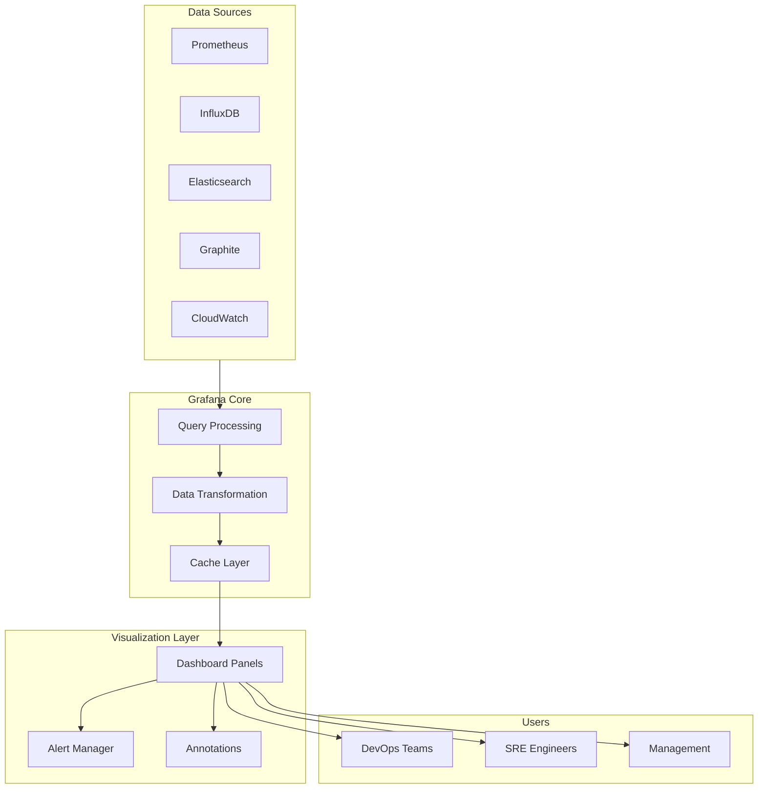

# Grafana Metrics Patterns

## Overview

Grafana is an open-source analytics and monitoring solution that enables visualization of metrics data from multiple sources. It connects to data sources like Prometheus, InfluxDB, Elasticsearch, and many others to create interactive dashboards with graphs, alerts, and annotations. Grafana has become the industry standard for metrics visualization in observability stacks.

Grafana provides powerful features including dynamic dashboards, variable-based filtering, alerting with notifications, and support for multiple data sources. It allows teams to create unified views of their infrastructure and application metrics across different platforms and services.

The platform supports various visualization types including time series graphs, stat panels, tables, heatmaps, and geo maps. Grafana's query editor enables complex data transformations and aggregations while maintaining simplicity for basic use cases.

## Architecture



Grafana connects to multiple data sources, processes queries, transforms data, and presents visualizations to users.

## Grafana Dashboard Configuration

```json
{
  "dashboard": {
    "title": "Microservices Performance Dashboard",
    "uid": "microservices-prod",
    "version": 1,
    "timezone": "UTC",
    "refresh": "30s",
    "time": {
      "from": "now-6h",
      "to": "now"
    },
    "panels": [
      {
        "id": 1,
        "title": "Request Rate",
        "type": "graph",
        "gridPos": {"h": 8, "w": 12, "x": 0, "y": 0},
        "targets": [
          {
            "expr": "sum(rate(http_requests_total[5m])) by (service)",
            "legendFormat": "{{service}}",
            "refId": "A"
          }
        ],
        "lines": true,
        "fill": 1,
        "linewidth": 2,
        "points": false,
        "yaxes": [
          {"format": "ops", "label": "Requests/sec"},
          {"format": "short"}
        ]
      },
      {
        "id": 2,
        "title": "Error Rate",
        "type": "graph",
        "gridPos": {"h": 8, "w": 12, "x": 12, "y": 0},
        "targets": [
          {
            "expr": "sum(rate(http_requests_total{status=~\"5..\"}[5m])) by (service) / sum(rate(http_requests_total[5m])) by (service)",
            "legendFormat": "{{service}}",
            "refId": "A"
          }
        ],
        "thresholds": {
          "mode": "absolute",
          "steps": [
            {"color": "green", "value": null},
            {"color": "yellow", "value": 0.01},
            {"color": "red", "value": 0.05}
          ]
        }
      },
      {
        "id": 3,
        "title": "Response Time P95",
        "type": "graph",
        "gridPos": {"h": 8, "w": 12, "x": 0, "y": 8},
        "targets": [
          {
            "expr": "histogram_quantile(0.95, sum(rate(http_request_duration_seconds_bucket[5m])) by (le, service))",
            "legendFormat": "P95 - {{service}}",
            "refId": "A"
          }
        ],
        "yaxes": [{"format": "s"}]
      },
      {
        "id": 4,
        "title": "Active Connections",
        "type": "stat",
        "gridPos": {"h": 4, "w": 6, "x": 12, "y": 8},
        "targets": [
          {
            "expr": "sum(active_connections)",
            "refId": "A"
          }
        ],
        "options": {
          "colorMode": "value",
          "graphMode": "area",
          "orientation": "horizontal"
        }
      },
      {
        "id": 5,
        "title": "CPU Usage",
        "type": "gauge",
        "gridPos": {"h": 6, "w": 6, "x": 18, "y": 8},
        "targets": [
          {
            "expr": "avg(container_cpu_usage_seconds_total) * 100",
            "refId": "A"
          }
        ],
        "fieldConfig": {
          "defaults": {
            "unit": "percent",
            "thresholds": {
              "mode": "absolute",
              "steps": [
                {"color": "green", "value": null},
                {"color": "yellow", "value": 70},
                {"color": "red", "value": 90}
              ]
            }
          }
        }
      }
    ],
    "templating": {
      "list": [
        {
          "name": "service",
          "type": "query",
          "query": "label_values(http_requests_total, service)",
          "refresh": 1
        },
        {
          "name": "environment",
          "type": "constant",
          "query": "production"
        }
      ]
    },
    "annotations": {
      "list": [
        {
          "name": "Deployments",
          "datasource": "Prometheus",
          "expr": "changes(deployment_version[5m])"
        }
      ]
    }
  }
}
```

## Java Integration with Grafana

```java
import org.springframework.boot.actuate.metrics.export.PrometheusExporter;
import org.springframework.boot.actuate.metrics.Metric;
import org.springframework.boot.actuate.endpoint.Endpoint;
import org.springframework.web.bind.annotation.GetMapping;
import org.springframework.web.bind.annotation.RestController;
import io.micrometer.core.instrument.MeterRegistry;
import io.micrometer.core.instrument.Meter;
import io.micrometer.core.instrument.Tag;
import io.micrometer.core.instrument.Timer;
import io.micrometer.core.instrument.Counter;
import io.micrometer.core.instrument.Gauge;
import io.micrometer.core.instrument.distribution.HistogramSnapshot;
import io.prometheus.client.CollectorRegistry;
import io.prometheus.client.exporter.PushGateway;
import java.util.concurrent.TimeUnit;
import java.util.HashMap;
import java.util.Map;
import java.util.function.Supplier;

public class GrafanaDashboardIntegration {
    
    private final MeterRegistry meterRegistry;
    private final CollectorRegistry collectorRegistry;
    private final Map<String, Timer> serviceTimers = new HashMap<>();
    private final Map<String, Counter> serviceCounters = new HashMap<>();
    
    public GrafanaDashboardIntegration(MeterRegistry meterRegistry) {
        this.meterRegistry = meterRegistry;
        this.collectorRegistry = new CollectorRegistry();
        initializeMetrics();
    }
    
    private void initializeMetrics() {
        Gauge.builder("application_start_time", this, 
            app -> (double) app.startTime)
            .tag("application", "order-service")
            .tag("version", "1.0.0")
            .register(meterRegistry);
        
        Gauge.builder("jvm_memory_used_bytes", Runtime.getRuntime(), 
            runtime -> (double) runtime.totalMemory() - runtime.freeMemory())
            .tag("area", "heap")
            .register(meterRegistry);
        
        Timer requestTimer = Timer.builder("http.server.requests")
            .description("HTTP request latency")
            .publishPercentiles(0.5, 0.95, 0.99)
            .register(meterRegistry);
        
        serviceTimers.put("default", requestTimer);
        
        Counter errorCounter = Counter.builder("http_server_errors_total")
            .description("Total HTTP server errors")
            .tag("type", "5xx")
            .register(meterRegistry);
        
        serviceCounters.put("errors", errorCounter);
    }
    
    public void recordRequest(String service, String endpoint, 
                             int statusCode, long durationMs) {
        Timer timer = serviceTimers.computeIfAbsent(service, 
            s -> Timer.builder("http.request.duration")
                .tag("service", s)
                .register(meterRegistry));
        
        timer.record(durationMs, TimeUnit.MILLISECONDS);
        
        if (statusCode >= 500) {
            serviceCounters.computeIfAbsent("errors",
                k -> Counter.builder("http_server_errors_total")
                    .register(meterRegistry)).increment();
        }
    }
    
    public void recordBusinessMetric(String metricName, double value, 
                                    Map<String, String> tags) {
        Counter.Builder counterBuilder = Counter.builder(metricName)
            .description("Business metric counter");
        
        tags.forEach(counterBuilder::tag);
        
        Counter counter = counterBuilder.register(meterRegistry);
        counter.increment(value);
    }
    
    public Map<String, Object> getDashboardSnapshot() {
        Map<String, Object> snapshot = new HashMap<>();
        
        snapshot.put("timestamp", System.currentTimeMillis());
        snapshot.put("active_connections", getActiveConnections());
        snapshot.put("request_rate", getRequestRate());
        snapshot.put("error_rate", getErrorRate());
        snapshot.put("p95_latency", getPercentileLatency(0.95));
        snapshot.put("p99_latency", getPercentileLatency(0.99));
        
        return snapshot;
    }
    
    private double getActiveConnections() {
        return meterRegistry.find("active.connections")
            .gauge() != null ? 
            meterRegistry.find("active.connections").gauge().value() : 0;
    }
    
    private double getRequestRate() {
        return meterRegistry.find("http.requests.rate")
            .counter() != null ?
            meterRegistry.find("http.requests.rate").counter().count() : 0;
    }
    
    private double getErrorRate() {
        return meterRegistry.find("http_server_errors_total")
            .counter() != null ?
            meterRegistry.find("http_server_errors_total").counter().count() : 0;
    }
    
    private double getPercentileLatency(double percentile) {
        Timer timer = meterRegistry.find("http.request.duration")
            .timer();
        
        if (timer != null) {
            HistogramSnapshot snapshot = timer.take();
            return snapshot.percentileValues().stream()
                .filter(pv -> pv.percentile() == percentile)
                .findFirst()
                .map(pv -> pv.value())
                .orElse(0.0);
        }
        
        return 0.0;
    }
    
    public void pushToPushGateway(String jobName, Map<String, String> groupKeys) {
        PushGateway pushGateway = new PushGateway("pushgateway:9091");
        
        io.prometheus.client.PushGateway.Job job = 
            new io.prometheus.client.PushGateway.Job(jobName);
        
        io.prometheus.client.PushGateway.GroupingKey groupingKey = 
            new io.prometheus.client.PushGateway.GroupingKey();
        
        groupKeys.forEach(groupingKey::addLabel);
        
        try {
            pushGateway.pushAdd(job, groupingKey, collectorRegistry);
        } catch (Exception e) {
            System.err.println("Failed to push metrics: " + e.getMessage());
        }
    }
    
    private long startTime = System.currentTimeMillis();
    
    public void createGrafanaAnnotation(String message, Map<String, String> tags) {
        System.out.println("Creating Grafana annotation: " + message);
        System.out.println("Tags: " + tags);
    }
}
```

## Python Integration with Grafana

```python
import json
import time
from datetime import datetime
from typing import Dict, List, Optional, Any
from dataclasses import dataclass, field
from prometheus_client import CollectorRegistry, Counter, Gauge, Histogram
from prometheus_client import generate_latest, push_to_gateway
import requests


@dataclass
class GrafanaDashboard:
    """Grafana dashboard configuration."""
    title: str
    uid: str
    panels: List[Dict] = field(default_factory=list)
    variables: List[Dict] = field(default_factory=list)
    annotations: List[Dict] = field(default_factory=list)
    timezone: str = "UTC"
    refresh: str = "30s"
    
    def to_json(self) -> Dict:
        """Convert dashboard to JSON."""
        return {
            "dashboard": {
                "title": self.title,
                "uid": self.uid,
                "timezone": self.timezone,
                "refresh": self.refresh,
                "panels": self.panels,
                "templating": {"list": self.variables},
                "annotations": {"list": self.annotations}
            }
        }


class GrafanaMetricsExporter:
    """Export metrics to Grafana-compatible format."""
    
    def __init__(self, service_name: str):
        self.service_name = service_name
        self.registry = CollectorRegistry()
        
        self.request_counter = Counter(
            'http_requests_total',
            'Total HTTP requests',
            ['method', 'endpoint', 'status'],
            registry=self.registry
        )
        
        self.request_duration = Histogram(
            'http_request_duration_seconds',
            'Request duration in seconds',
            ['method', 'endpoint'],
            buckets=(0.005, 0.01, 0.025, 0.05, 0.1, 0.25, 0.5, 1.0),
            registry=self.registry
        )
        
        self.active_connections = Gauge(
            'active_connections',
            'Active connections',
            ['service'],
            registry=self.registry
        )
        
        self.business_metric = Counter(
            'business_operation_total',
            'Business operations',
            ['operation', 'status'],
            registry=self.registry
        )
    
    def record_request(self, method: str, endpoint: str, 
                      status: int, duration: float):
        """Record HTTP request metrics."""
        self.request_counter.labels(
            method=method,
            endpoint=endpoint,
            status=str(status)
        ).inc()
        
        self.request_duration.labels(
            method=method,
            endpoint=endpoint
        ).observe(duration)
    
    def record_business_operation(self, operation: str, 
                                  status: str, value: float = 1.0):
        """Record business operation metrics."""
        self.business_metric.labels(
            operation=operation,
            status=status
        ).inc(value)
    
    def set_active_connections(self, count: int):
        """Set active connection count."""
        self.active_connections.labels(
            service=self.service_name
        ).set(count)
    
    def export_to_prometheus_format(self) -> bytes:
        """Export metrics in Prometheus format."""
        return generate_latest(self.registry)
    
    def push_to_gateway(self, gateway_url: str, job: str):
        """Push metrics to Prometheus PushGateway."""
        push_to_gateway(
            gateway_url,
            job=job,
            grouping_key={'service': self.service_name},
            registry=self.registry
        )


class GrafanaAPIClient:
    """Client for Grafana HTTP API."""
    
    def __init__(self, base_url: str, api_key: str):
        self.base_url = base_url.rstrip('/')
        self.session = requests.Session()
        self.session.headers.update({
            'Authorization': f'Bearer {api_key}',
            'Content-Type': 'application/json'
        })
    
    def create_dashboard(self, dashboard: GrafanaDashboard) -> Dict:
        """Create a new dashboard."""
        url = f'{self.base_url}/api/dashboards/db'
        response = self.session.post(url, json=dashboard.to_json())
        response.raise_for_status()
        return response.json()
    
    def get_dashboard(self, uid: str) -> Dict:
        """Get dashboard by UID."""
        url = f'{self.base_url}/api/dashboards/uid/{uid}'
        response = self.session.get(url)
        response.raise_for_status()
        return response.json()
    
    def create_annotation(self, dashboard_uid: str, 
                         text: str, tags: List[str]) -> Dict:
        """Create an annotation on a dashboard."""
        url = f'{self.base_url}/api/annotations'
        data = {
            "dashboardUID": dashboard_uid,
            "text": text,
            "tags": tags,
            "time": int(time.time() * 1000)
        }
        response = self.session.post(url, json=data)
        response.raise_for_status()
        return response.json()
    
    def query_metric(self, datasource_uid: str, 
                    query: str, start: int, end: int) -> Dict:
        """Query metric data."""
        url = f'{self.base_url}/api/ds/query'
        data = {
            "queries": [{
                "refId": "A",
                "expr": query,
                "datasourceId": datasource_uid,
                "queryType": ""
            }],
            "from": str(start),
            "to": str(end)
        }
        response = self.session.post(url, json=data)
        response.raise_for_status()
        return response.json()


def create_service_dashboard(service_name: str, 
                             metrics: List[str]) -> GrafanaDashboard:
    """Create a standard service dashboard."""
    panels = []
    
    panels.append({
        "id": 1,
        "title": f"{service_name} - Request Rate",
        "type": "graph",
        "gridPos": {"h": 8, "w": 12, "x": 0, "y": 0},
        "targets": [{
            "expr": f"sum(rate({service_name}_requests_total[5m]))",
            "legendFormat": "Requests/sec"
        }]
    })
    
    panels.append({
        "id": 2,
        "title": f"{service_name} - Error Rate",
        "type": "graph",
        "gridPos": {"h": 8, "w": 12, "x": 12, "y": 0},
        "targets": [{
            "expr": f"sum(rate({service_name}_errors_total[5m])) / sum(rate({service_name}_requests_total[5m]))",
            "legendFormat": "Error Rate"
        }]
    })
    
    return GrafanaDashboard(
        title=f"{service_name} Overview",
        uid=f"{service_name}-overview",
        panels=panels,
        variables=[{
            "name": "service",
            "type": "constant",
            "query": service_name
        }]
    )


if __name__ == "__main__":
    exporter = GrafanaMetricsExporter("order-service")
    
    exporter.record_request("POST", "/orders", 200, 0.125)
    exporter.record_request("GET", "/orders/123", 200, 0.045)
    exporter.record_business_operation("order_created", "success", 1.0)
    exporter.set_active_connections(15)
    
    metrics_output = exporter.export_to_prometheus_format()
    print(metrics_output.decode())
```

## Real-World Examples

**Google Cloud Monitoring** uses Grafana for visualizing metrics from Google Cloud services. Their Grafana integration provides seamless connectivity to Cloud Monitoring data sources with built-in dashboards for GKE, Cloud Run, and other Google Cloud services.

**Datadog** provides Grafana integration allowing users to import Datadog dashboards into Grafana. This enables organizations to leverage existing Datadog monitoring while using Grafana's visualization capabilities.

**New Relic** offers Grafana data source integration, allowing teams to query New Relic metrics through Grafana and create unified dashboards combining multiple data sources.

## Output Statement

Organizations implementing Grafana visualization patterns can expect improved operational visibility through real-time dashboards, faster incident response with integrated alerting, and better collaboration between teams through shared visualization standards. Grafana's plugin ecosystem and template variables enable reusable dashboard patterns.

## Best Practices

1. **Use Dashboard Templates**: Create reusable dashboard templates with variables for service, environment, and region filtering.

2. **Organize with Folders**: Group dashboards by service, team, or environment using Grafana folders.

3. **Implement Proper Annotations**: Add deployment markers and event annotations to correlate changes with metric changes.

4. **Optimize Queries**: Use recording rules for frequently queried complex expressions to improve dashboard load times.

5. **Set Appropriate Refresh Rates**: Balance data freshness with query load based on dashboard purpose.

6. **Use Alerting Wisely**: Configure Grafana alerts with proper notification channels and escalation paths.
