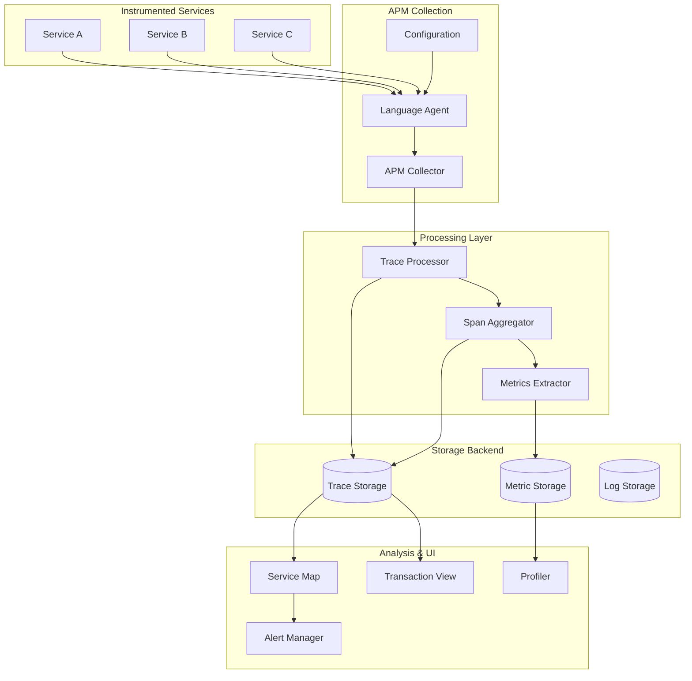

# Application Performance Monitoring (APM) Patterns
## Overview
Application Performance Monitoring (APM) patterns provide comprehensive observability into application behavior, performance, and reliability. APM goes beyond basic metrics to include distributed tracing, transaction sampling, service maps, and detailed performance analysis. Modern APM tools provide end-to-end visibility across microservices architectures, enabling teams to identify performance bottlenecks, understand service dependencies, and troubleshoot issues quickly.
APM solutions typically include automatic instrumentation for common frameworks and libraries, enabling zero-code-change monitoring. They support distributed tracing to follow requests across service boundaries, collect detailed transaction profiles, and provide real-time alerts on performance degradation. Key capabilities include service maps showing service dependencies, span-level timing information, error tracking with stack traces, and database query analysis.
## Architecture

APM collects data from instrumented services, processes traces and metrics, stores them in dedicated backends, and provides analysis through service maps and transaction views.
## Java APM Implementation
```java
import io.opentelemetry.api.OpenTelemetry;
import io.opentelemetry.api.trace.Tracer;
import io.opentelemetry.api.trace.Span;
import io.opentelemetry.api.trace.SpanKind;
import io.opentelemetry.api.trace.StatusCode;
import io.opentelemetry.context.Scope;
import io.opentelemetry.sdk.trace.export.BatchSpanProcessor;
import io.opentelemetry.sdk.trace.export.SimpleSpanProcessor;
import io.opentelemetry.sdk.trace.SdkTracerProvider;
import io.opentelemetry.sdk.trace.export.ConsoleSpanExporter;
import io.opentelemetry.sdk.resources.Resource;
import io.opentelemetry.semconv.ResourceAttributes;
import io.opentelemetry.api.common.AttributeKey;
import io.opentelemetry.api.common.Attributes;
import java.util.concurrent.ConcurrentHashMap;
import java.util.Map;
import java.util.function.Supplier;

public class APMImplementation {
    
    private static OpenTelemetry openTelemetry;
    private static Tracer tracer;
    private final Map<String, Span> activeSpans = new ConcurrentHashMap<>();
    
    public static void initializeAPM(String serviceName, 
                                     String otlpEndpoint) {
        Resource resource = Resource.getDefault()
            .merge(Resource.create(Attributes.of(
                ResourceAttributes.SERVICE_NAME, serviceName,
                ResourceAttributes.SERVICE_VERSION, "1.0.0",
                ResourceAttributes.DEPLOYMENT_ENVIRONMENT, "production"
            )));
        
        SdkTracerProvider tracerProvider = SdkTracerProvider.builder()
            .setResource(resource)
            .addSpanProcessor(BatchSpanProcessor.builder(
                io.opentelemetry.exporter.otlp.trace.OtlpGrpcSpanExporter.builder()
                    .setEndpoint(otlpEndpoint)
                    .build()
            ).build())
            .addSpanProcessor(SimpleSpanProcessor.create(
                ConsoleSpanExporter.create()))
            .build();
        
        openTelemetry = OpenTelemetrySdk.builder()
            .setTracerProvider(tracerProvider)
            .build();
        
        tracer = openTelemetry.getTracer(serviceName, "1.0.0");
        
        System.out.println("APM initialized for service: " + serviceName);
    }
    
    public Span startTransaction(String operationName) {
        Span span = tracer.spanBuilder(operationName)
            .setSpanKind(SpanKind.SERVER)
            .setAttribute("component", "http")
            .setAttribute("http.method", "GET")
            .startSpan();
        
        activeSpans.put(operationName, span);
        
        return span;
    }
    
    public void startLocalSpan(String spanName) {
        Span span = tracer.spanBuilder(spanName)
            .setSpanKind(SpanKind.INTERNAL)
            .startSpan();
        
        activeSpans.put(spanName, span);
    }
    
    public void endSpan(String spanName) {
        Span span = activeSpans.remove(spanName);
        if (span != null) {
            span.end();
        }
    }
    
    public void recordException(Throwable throwable) {
        for (Span span : activeSpans.values()) {
            span.setStatus(StatusCode.ERROR, throwable.getMessage());
            span.recordException(throwable);
        }
    }
    
    public void addSpanEvent(String spanName, String eventName) {
        Span span = activeSpans.get(spanName);
        if (span != null) {
            span.addEvent(eventName);
        }
    }
    
    public void setSpanAttribute(String key, String value) {
        for (Span span : activeSpans.values()) {
            span.setAttribute(key, value);
        }
    }
    
    public void setSpanAttribute(String key, long value) {
        for (Span span : activeSpans.values()) {
            span.setAttribute(key, value);
        }
    }
    
    public void setSpanAttribute(String key, double value) {
        for (Span span : activeSpans.values()) {
            span.setAttribute(key, value);
        }
    }
    
    public void createDistributedTrace() {
        Span parentSpan = tracer.spanBuilder("parent-operation")
            .setSpanKind(SpanKind.CLIENT)
            .startSpan();
        
        try (Scope scope = parentSpan.makeCurrent()) {
            parentSpan.setAttribute("operation.type", "distributed");
            
            callDownstreamService("order-service", "/api/orders");
            
            callDatabase("SELECT * FROM orders WHERE id = ?");
            
            callExternalAPI("payment-gateway", "process-payment");
            
        } catch (Exception e) {
            parentSpan.setStatus(StatusCode.ERROR, e.getMessage());
            parentSpan.recordException(e);
        } finally {
            parentSpan.end();
        }
    }
    
    private void callDownstreamService(String service, String endpoint) {
        Span span = tracer.spanBuilder("HTTP GET: " + endpoint)
            .setSpanKind(SpanKind.CLIENT)
            .setAttribute("http.url", "http://" + service + endpoint)
            .setAttribute("http.method", "GET")
            .setAttribute("peer.service", service)
            .startSpan();
        
        try (Scope scope = span.makeCurrent()) {
            span.setAttribute("http.status_code", 200);
            
            Thread.sleep(50);
            
        } catch (Exception e) {
            span.setStatus(StatusCode.ERROR, e.getMessage());
            span.recordException(e);
        } finally {
            span.end();
        }
    }
    
    private void callDatabase(String query) {
        Span span = tracer.spanBuilder("DB: " + query.substring(0, 30))
            .setSpanKind(SpanKind.CLIENT)
            .setAttribute("db.system", "postgresql")
            .setAttribute("db.statement", query)
            .setAttribute("db.operation", "SELECT")
            .startSpan();
        
        try (Scope scope = span.makeCurrent()) {
            
            Thread.sleep(25);
            
        } finally {
            span.end();
        }
    }
    
    private void callExternalAPI(String service, String operation) {
        Span span = tracer.spanBuilder("External: " + service)
            .setSpanKind(SpanKind.CLIENT)
            .setAttribute("http.url", "https://" + service + "/api")
            .setAttribute("http.method", "POST")
            .setAttribute("external.system", service)
            .startSpan();
        
        try (Scope scope = span.makeCurrent()) {
            
            Thread.sleep(100);
            
        } finally {
            span.end();
        }
    }
    
    public void trackCustomMetric(String metricName, double value) {
        Span span = tracer.spanBuilder("metric:" + metricName)
            .setSpanKind(SpanKind.INTERNAL)
            .startSpan();
        
        span.setAttribute("metric.value", value);
        span.setAttribute("metric.name", metricName);
        span.end();
    }
    
    public void monitorDatabaseQuery(String query, long durationMs) {
        Span span = tracer.spanBuilder("db.query")
            .setSpanKind(SpanKind.CLIENT)
            .setAttribute("db.system", "postgresql")
            .setAttribute("db.statement", query)
            .setAttribute("db.duration_ms", durationMs)
            .startSpan();
        
        try {
            if (durationMs > 1000) {
                span.setAttribute("db.slow_query", true);
            }
        } finally {
            span.end();
        }
    }
    
    public void captureTransactionData(String transactionType, 
                                       Map<String, Object> data) {
        Span span = tracer.spanBuilder("transaction:" + transactionType)
            .setSpanKind(SpanKind.SERVER)
            .startSpan();
        
        try (Scope scope = span.makeCurrent()) {
            for (Map.Entry<String, Object> entry : data.entrySet()) {
                String key = entry.getKey();
                Object value = entry.getValue();
                
                if (value instanceof String) {
                    span.setAttribute(key, (String) value);
                } else if (value instanceof Number) {
                    span.setAttribute(key, ((Number) value).longValue());
                }
            }
        } finally {
            span.end();
        }
    }
}
```
## Python APM Implementation
```python
from opentelemetry import trace
from opentelemetry.sdk.trace import TracerProvider
from opentelemetry.sdk.trace.export import (
    BatchSpanProcessor,
    ConsoleSpanExporter,
    SimpleSpanProcessor
)
from opentelemetry.exporter.otlp.proto.grpc.trace_exporter import OTLPSpanExporter
from opentelemetry.instrumentation.flask import FlaskInstrumentor
from opentelemetry.sdk.resources import Resource, SERVICE_NAME
from opentelemetry.trace import Status, StatusCode, SpanKind
from opentelemetry.instrumentation.requests import RequestsInstrumentor
from contextlib import contextmanager
from typing import Dict, Any, Optional
import time
import functools


class APMClient:
    """Application Performance Monitoring client."""
    
    def __init__(self, service_name: str, otlp_endpoint: str = None):
        self.service_name = service_name
        self._initialize_tracer(otlp_endpoint)
        
    def _initialize_tracer(self, otlp_endpoint: Optional[str]):
        """Initialize the tracer provider."""
        resource = Resource.create({
            SERVICE_NAME: self.service_name,
            "service.version": "1.0.0",
            "deployment.environment": "production"
        })
        
        provider = TracerProvider(resource=resource)
        
        processor = BatchSpanProcessor(
            OTLPSpanExporter(endpoint=otlp_endpoint or "localhost:4317")
        )
        provider.add_span_processor(processor)
        provider.add_span_processor(SimpleSpanProcessor(
            ConsoleSpanExporter()
        ))
        
        trace.set_tracer_provider(provider)
        self.tracer = trace.get_tracer(__name__)
    
    def start_server_span(self, operation_name: str, 
                          method: str = "GET") -> trace.Span:
        """Start a server span."""
        span = self.tracer.start_span(
            operation_name,
            kind=SpanKind.SERVER
        )
        span.set_attribute("http.method", method)
        span.set_attribute("component", "http")
        
        return span
    
    def start_client_span(self, operation_name: str, 
                          service: str = None) -> trace.Span:
        """Start a client span for downstream calls."""
        span = self.tracer.start_span(
            operation_name,
            kind=SpanKind.CLIENT
        )
        
        if service:
            span.set_attribute("peer.service", service)
        
        return span
    
    def record_exception(self, span: trace.Span, exception: Exception):
        """Record an exception on a span."""
        span.set_status(Status(StatusCode.ERROR, str(exception)))
        span.record_exception(exception)
    
    @contextmanager
    def trace_operation(self, operation_name: str, 
                       attributes: Dict[str, Any] = None):
        """Context manager for tracing operations."""
        with self.tracer.start_as_current_span(
            operation_name,
            kind=SpanKind.INTERNAL
        ) as span:
            if attributes:
                for key, value in attributes.items():
                    span.set_attribute(key, str(value))
            
            try:
                yield span
            except Exception as e:
                self.record_exception(span, e)
                raise
    
    @contextmanager
    def trace_database(self, query: str, db_system: str = "postgresql"):
        """Context manager for database operations."""
        with self.tracer.start_as_current_span(
            "db.query",
            kind=SpanKind.CLIENT
        ) as span:
            span.set_attribute("db.system", db_system)
            span.set_attribute("db.statement", query)
            span.set_attribute("db.operation", 
                             "SELECT" if query.strip().upper().startswith("SELECT") 
                             else "OTHER")
            
            start_time = time.time()
            try:
                yield span
            finally:
                duration_ms = (time.time() - start_time) * 1000
                span.set_attribute("db.duration_ms", duration_ms)
                
                if duration_ms > 1000:
                    span.set_attribute("db.slow_query", True)
    
    @contextmanager
    def trace_external_call(self, url: str, service: str = None):
        """Context manager for external service calls."""
        with self.tracer.start_as_current_span(
            "http.client.request",
            kind=SpanKind.CLIENT
        ) as span:
            span.set_attribute("http.url", url)
            span.set_attribute("http.method", "POST")
            
            if service:
                span.set_attribute("peer.service", service)
            
            start_time = time.time()
            try:
                yield span
            finally:
                duration_ms = (time.time() - start_time) * 1000
                span.set_attribute("http.duration_ms", duration_ms)
                span.set_attribute("http.status_code", 200)


class FlaskAPMIntegration:
    """Flask APM integration."""
    
    def __init__(self, app, apm_client: APMClient):
        self.app = app
        self.apm_client = apm_client
        self._instrument()
    
    def _instrument(self):
        """Instrument Flask application."""
        FlaskInstrumentor().instrument_app(self.app)
        RequestsInstrumentor().instrument()


def trace_function(span_name: str = None):
    """Decorator for tracing functions."""
    def decorator(func):
        name = span_name or func.__name__
        
        @functools.wraps(func)
        def wrapper(*args, **kwargs):
            tracer = trace.get_tracer(__name__)
            
            with tracer.start_as_current_span(name) as span:
                span.set_attribute("function.name", func.__name__)
                span.set_attribute("function.module", func.__module__)
                
                start_time = time.time()
                try:
                    result = func(*args, **kwargs)
                    span.set_attribute("function.success", True)
                    return result
                except Exception as e:
                    span.set_status(Status(StatusCode.ERROR, str(e)))
                    span.record_exception(e)
                    span.set_attribute("function.success", False)
                    raise
                finally:
                    duration_ms = (time.time() - start_time) * 1000
                    span.set_attribute("function.duration_ms", duration_ms)
        
        return wrapper
    return decorator


if __name__ == "__main__":
    apm = APMClient("order-service", "http://localhost:4317")
    
    with apm.trace_operation("process-order", {"order.id": "12345"}):
        with apm.trace_database("SELECT * FROM orders WHERE id = '12345'"):
            time.sleep(0.05)
        
        with apm.trace_external_call("http://payment-service/api/charge"):
            time.sleep(0.1)
        
        print("Order processed with full tracing")
```
## Real-World Examples
**Google Cloud Trace** provides distributed tracing for Google Cloud applications. It automatically instruments Google Cloud services and provides integrated trace analysis in the Google Cloud Console. Google Cloud Trace integrates with Cloud Logging and Cloud Monitoring for comprehensive observability.
**Datadog APM** offers distributed tracing with automatic instrumentation for many languages and frameworks. It provides service maps, trace search, and performance analytics. Datadog APM includes database query analysis, custom instrumentations, and integration with infrastructure metrics.
**New Relic APM** provides comprehensive application performance monitoring with distributed tracing, code-level diagnostics, and AI-powered anomaly detection. It offers detailed transaction traces, service maps, and error analytics with support for over 500 integrations.
## Output Statement
Organizations implementing APM patterns can expect faster troubleshooting with end-to-end visibility, better understanding of service dependencies through service maps, proactive performance optimization through transaction analysis, and improved user experience through real-user monitoring. APM enables teams to identify issues before they impact users.
## Best Practices
1. **Use Automatic Instrumentation**: Start with auto-instrumentation to minimize code changes and ensure comprehensive coverage.
2. **Implement Distributed Tracing**: Ensure traces span all service boundaries to capture complete request journeys.
3. **Configure Appropriate Sampling**: Balance data volume with analysis needs using intelligent sampling strategies.
4. **Add Custom Spans**: Add custom instrumentation for business operations that aren't automatically captured.
5. **Correlate Logs and Traces**: Link logs to traces for complete debugging context across services.
6. **Monitor Database Performance**: Instrument all database queries to identify slow queries and optimize performance.
