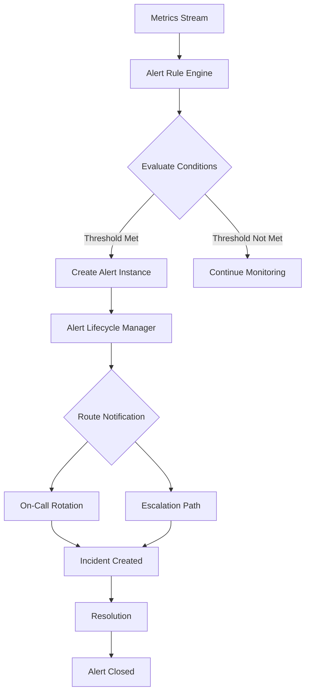

# Alerting Patterns

## Overview

Alerting patterns are critical for operational excellence in microservices architectures. They provide automated notification when system behavior deviates from expected norms, enabling rapid response to incidents. Effective alerting balances sensitivity - catching real problems - with specificity - avoiding alert fatigue from false positives. This pattern covers designing, implementing, and managing alerts across distributed systems.

Modern alerting extends beyond simple threshold monitoring. It encompasses anomaly detection, synthetic monitoring, and composite alerts that correlate multiple signals. The goal is to notify on-call teams only when human intervention is needed, with sufficient context to diagnose and resolve issues quickly.

Alerting architecture in microservices involves collecting metrics from services, evaluating alert conditions, managing alert lifecycle (firing, acknowledged, resolved), routing notifications to appropriate channels, and providing runbooks for response. Each component must scale with the number of services and alert complexity.

## Flow Chart



## Standard Example

```java
import io.micrometer.core.instrument.*;
import io.micrometer.prometheus.PrometheusConfig;
import io.micrometer.prometheus.PrometheusMeterRegistry;
import java.time.Duration;

/**
 * Alert Rule Engine Implementation
 * Evaluates metrics against configured thresholds and triggers alerts
 */
public class AlertRuleEngine {
    
    private final MeterRegistry registry;
    private final AlertNotificationService notificationService;
    private final Map<String, AlertRule> rules = new ConcurrentHashMap<>();
    
    public AlertRuleEngine(MeterRegistry registry, 
                          AlertNotificationService notificationService) {
        this.registry = registry;
        this.notificationService = notificationService;
    }
    
    /**
     * Define an alert rule with threshold configuration
     */
    public void addRule(AlertRule rule) {
        rules.put(rule.getName(), rule);
        registerMetrics(rule);
    }
    
    private void registerMetrics(AlertRule rule) {
        Gauge.builder(rule.getName() + "_threshold", rule, r -> r.getThreshold())
            .tag("type", "threshold")
            .register(registry);
    }
    
    /**
     * Evaluate all rules against current metric values
     */
    public void evaluate() {
        for (AlertRule rule : rules.values()) {
            evaluateRule(rule);
        }
    }
    
    private void evaluateRule(AlertRule rule) {
        Double currentValue = getCurrentValue(rule.getMetricName());
        if (currentValue == null) return;
        
        boolean shouldAlert = evaluateCondition(rule, currentValue);
        
        if (shouldAlert && !rule.isFiring()) {
            triggerAlert(rule, currentValue);
        } else if (!shouldAlert && rule.isFiring()) {
            resolveAlert(rule);
        }
    }
    
    private boolean evaluateCondition(AlertRule rule, Double value) {
        return switch (rule.getCondition()) {
            case GREATER_THAN -> value > rule.getThreshold();
            case LESS_THAN -> value < rule.getThreshold();
            case EQUALS -> Math.abs(value - rule.getThreshold()) < 0.001;
        };
    }
    
    private void triggerAlert(AlertRule rule, Double value) {
        rule.setFiring(true);
        rule.setFiringAt(System.currentTimeMillis());
        
        Alert alert = Alert.builder()
            .ruleName(rule.getName())
            .severity(rule.getSeverity())
            .currentValue(value)
            .threshold(rule.getThreshold())
            .message(rule.getMessage())
            .build();
        
        notificationService.send(alert);
    }
    
    private void resolveAlert(AlertRule rule) {
        rule.setFiring(false);
        notificationService.resolve(rule.getName());
    }
    
    private Double getCurrentValue(String metricName) {
        return registry.find(metricName).gauge() != null 
            ? registry.find(metricName).gauge().value() 
            : null;
    }
    
    public static class AlertRule {
        private String name;
        private String metricName;
        private double threshold;
        private Condition condition;
        private Severity severity;
        private String message;
        private boolean firing;
        private long firingAt;
        
        // Constructors, getters, setters...
        public String getName() { return name; }
        public String getMetricName() { return metricName; }
        public double getThreshold() { return threshold; }
        public Condition getCondition() { return condition; }
        public Severity getSeverity() { return severity; }
        public String getMessage() { return message; }
        public boolean isFiring() { return firing; }
        public void setFiring(boolean firing) { this.firing = firing; }
        public long getFiringAt() { return firingAt; }
        public void setFiringAt(long firingAt) { this.firingAt = firingAt; }
    }
}
```

## Real-World Example 1: Datadog Alerting

Datadog provides enterprise alerting with sophisticated routing and deduplication. They support multiple alert types: metric alerts, anomaly detection, outlier detection, and log alerts. Alerts can be scoped to specific hosts, containers, or services, with auto-resolution when conditions clear.

Their alerting includes alert policies that combine multiple conditions with AND/OR logic. You can set up "alert grouping" to reduce noise by grouping related alerts. Rate limiting prevents alert storms, and "no-data" alerts notify when metrics stop reporting.

## Real-World Example 2: PagerDuty Alerting

PagerDuty focuses on alert routing and incident management. Their platform integrates with monitoring tools to route alerts to on-call responders based on schedules, escalation policies, and urgency levels. Features include auto-escalation, override schedules, and "busy" status to defer notifications.

## Output Statement

```
Alert Evaluation Results:
- Rules Evaluated: 25
- Alerts Triggered: 3
- Alerts Resolved: 2
- Notifications Sent: 3

Triggered Alerts:
1. [CRITICAL] High Error Rate - service-a error rate > 5%
2. [WARNING] High Latency - service-b p99 > 1000ms
3. [WARNING] Low Success Rate - service-c success rate < 95%
```

## Best Practices

Start with actionable alerts - every alert should require human intervention. Use multiple severity levels to enable appropriate response. Implement alert deduplication and grouping to reduce noise. Always provide runbook links in alert notifications. Test alert configurations in staging before production deployment.