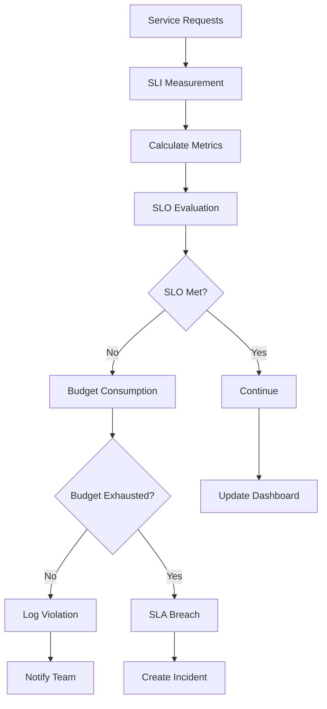

# SLA Monitoring

## Overview

Service Level Agreements (SLAs) represent commitments to customers about service availability, performance, and reliability. SLA monitoring tracks compliance with these commitments, providing visibility into whether services meet their defined objectives. This pattern covers measuring SLAs, reporting on compliance, and using SLA data for continuous improvement.

SLA monitoring in microservices involves defining meaningful service level indicators (SLIs), setting appropriate targets (SLOs), and tracking performance against targets. Common SLIs include availability (uptime), latency (response time), error rates, and throughput. SLA dashboards provide real-time visibility into service health.

Beyond internal monitoring, SLA monitoring often involves external probing to measure user experience from diverse geographic locations. It also includes calculating "error budgets" - the allowed amount of failure before violating commitments - which enables teams to balance feature development with reliability investment.

## Flow Chart



## Standard Example

```java
import java.time.*;
import java.util.concurrent.atomic.*;

/**
 * SLA Monitor Implementation
 * Tracks service level indicators against defined SLOs
 */
public class SLAMonitor {
    
    private final String serviceName;
    private final SLOTarget availability;
    private final SLOTarget latency;
    private final SLOTarget errorRate;
    
    private final AtomicLong totalRequests = new AtomicLong(0);
    private final AtomicLong successfulRequests = new AtomicLong(0);
    private final AtomicLong failedRequests = new AtomicLong(0);
    private final DoubleAdder totalLatencyMs = new DoubleAdder();
    
    private final MovingWindow errorBudget;
    private final MovingWindow availabilityWindow;
    
    public SLAMonitor(String serviceName) {
        this.serviceName = serviceName;
        
        // Define SLOs
        this.availability = new SLOTarget("availability", 99.9, 
            Duration.ofDays(30));
        this.latency = new SLOTarget("latency_p99", 200.0, 
            Duration.ofDays(7), TimeUnit.MILLISECONDS);
        this.errorRate = new SLOTarget("error_rate", 1.0, 
            Duration.ofDays(30));
        
        this.errorBudget = new MovingWindow(Duration.ofDays(30));
        this.availabilityWindow = new MovingWindow(Duration.ofDays(30));
    }
    
    /**
     * Record a request completion
     */
    public void recordRequest(boolean success, long latencyMs) {
        totalRequests.incrementAndGet();
        
        if (success) {
            successfulRequests.incrementAndGet();
            availabilityWindow.add(1.0);
        } else {
            failedRequests.incrementAndGet();
            availabilityWindow.add(0.0);
            errorBudget.add(1);
        }
        
        totalLatencyMs.add(latencyMs);
    }
    
    /**
     * Get current SLA status
     */
    public SLAStatus getStatus() {
        double currentAvailability = availabilityWindow.getAverage() * 100;
        long currentErrorBudget = errorBudget.getRemaining();
        
        return new SLAStatus(
            serviceName,
            availability.calculateCompliance(currentAvailability),
            latency.calculateCompliance(getP99Latency()),
            errorRate.calculateCompliance(getErrorRate()),
            currentAvailability,
            getP99Latency(),
            getErrorRate(),
            currentErrorBudget
        );
    }
    
    private double getP99Latency() {
        // Simplified - in production, use histogram data
        return totalLatencyMs.sum() / Math.max(totalRequests.get(), 1);
    }
    
    private double getErrorRate() {
        long total = totalRequests.get();
        if (total == 0) return 0.0;
        return (double) failedRequests.get() / total * 100;
    }
    
    static class SLOTarget {
        private final String name;
        private final double target;
        private final Duration window;
        private final TimeUnit unit;
        
        public SLOTarget(String name, double target, Duration window) {
            this(name, target, window, TimeUnit.SECONDS);
        }
        
        public SLOTarget(String name, double target, Duration window, 
                        TimeUnit unit) {
            this.name = name;
            this.target = target;
            this.window = window;
            this.unit = unit;
        }
        
        public String getName() { return name; }
        public double getTarget() { return target; }
        public Duration getWindow() { return window; }
        
        public boolean calculateCompliance(double currentValue) {
            // For availability (higher is better)
            if (name.contains("availability")) {
                return currentValue >= target;
            }
            // For latency/errors (lower is better)
            return currentValue <= target;
        }
    }
    
    static class SLAStatus {
        private final String service;
        private final boolean availabilityMet;
        private final boolean latencyMet;
        private final boolean errorRateMet;
        private final double currentAvailability;
        private final double currentLatency;
        private final double currentErrorRate;
        private final long errorBudgetRemaining;
        
        // Constructor and getters...
    }
}
```

## Real-World Example 1: Google Cloud SLA

Google Cloud provides SLA monitoring for their cloud services with availability SLAs typically at 99.9% or higher. They use "error budgets" - the allowed downtime before SLA breach - calculated as: (100% - SLA%) × measurement period. Customers can monitor compliance through Cloud Console with detailed uptime reports.

## Real-World Example 2: AWS SLA

AWS provides service-specific SLAs (e.g., EC2 99.99% monthly, S3 99.99% monthly). They provide Service Health Dashboard showing current status and historical uptime. Service credits are offered when SLAs are violated, providing financial accountability.

## Output Statement

```
SLA Status for Order Service:
================================
Availability:
  - Target: 99.9%
  - Current: 99.95%
  - Status: COMPLIANT
  - Error Budget Remaining: 2h 45m

Latency (P99):
  - Target: 200ms
  - Current: 150ms
  - Status: COMPLIANT

Error Rate:
  - Target: 1.0%
  - Current: 0.3%
  - Status: COMPLIANT

Overall Status: HEALTHY
```

## Best Practices

Define meaningful SLAs that align with user experience, not just technical metrics. Use error budgets to balance reliability with velocity. Make SLA data visible to the entire organization. Automate SLA status updates in dashboards. Review and adjust SLAs quarterly based on actual performance and customer needs.