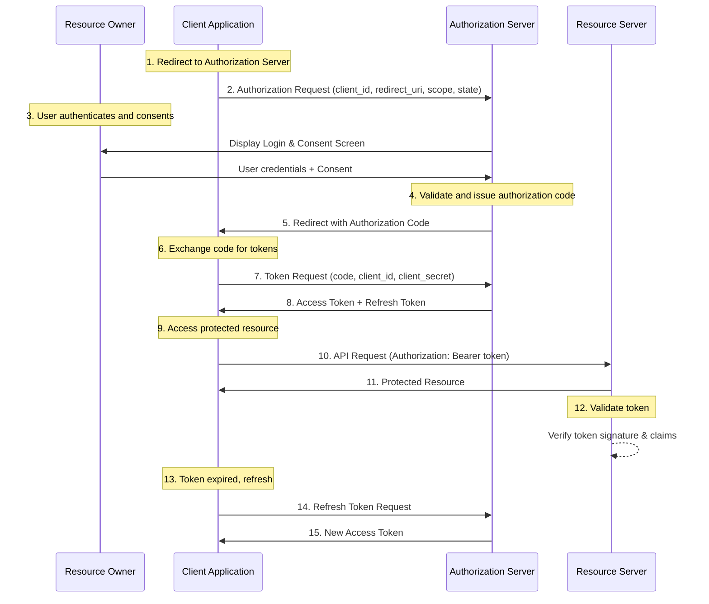

# OAuth 2.0 Authorization Framework

## Overview

OAuth 2.0 is an authorization framework that enables applications to obtain limited access to user accounts on HTTP services. It delegates user authentication to the service hosting the user account and authorizes third-party applications to access the user account. OAuth 2.0 provides authorization flows for web applications, desktop applications, mobile phones, and IoT devices.

The framework was designed to solve the problem of granting third-party applications access to user data without sharing passwords. It achieves this by introducing an authorization layer that separates the client application from the user credentials. Instead of sharing the user's password with the client application, the user authorizes the client to access their resources, and the authorization server issues access tokens to the client.

OAuth 2.0 is the industry-standard protocol for authorization. It is used by major companies like Google, Facebook, Microsoft, and many others to secure their APIs and enable third-party applications to access user data safely. The protocol has become the foundation for modern authentication and authorization in microservices architectures, enabling secure inter-service communication and user authentication across distributed systems.

The key components of OAuth 2.0 include the resource owner (the user), the client application (the third-party app), the authorization server (which issues tokens), and the resource server (which hosts the protected resources). Understanding these components and their interactions is essential for implementing secure authentication in microservices environments.

### Key Concepts

**Resource Owner**: The entity that can grant access to a protected resource. Typically, this is the end-user who owns the data or resources that the client application wants to access. The resource owner can authorize or deny access to their resources through the authorization server.

**Client Application**: The application that requests access to protected resources on behalf of the resource owner. The client must be registered with the authorization server and receive a client ID and client secret. In microservices architectures, clients can be web applications, mobile apps, or other services that need to access protected resources.

**Authorization Server**: The server that authenticates the resource owner and issues access tokens after successful authorization. The authorization server may also issue refresh tokens that allow clients to obtain new access tokens without requiring the user to re-authenticate. This server is critical in the OAuth 2.0 flow and must be properly secured.

**Resource Server**: The server hosting the protected resources. It validates the access token presented by the client and returns the requested resources if the token is valid. The resource server and authorization server can be the same physical server or separate services, depending on the architecture.

**Access Token**: A credential that represents the authorization granted to the client by the resource owner. The access token is used by the client to access the protected resources on the resource server. Access tokens have a limited lifetime and must be refreshed periodically.

**Refresh Token**: A credential used to obtain new access tokens when the current access token expires. Refresh tokens are long-lived and allow clients to maintain access without requiring the user to re-enter credentials. They should be stored securely and protected from unauthorized access.

### Authorization Flows

OAuth 2.0 defines several authorization flows, also known as grant types, to accommodate different types of applications and use cases. Each flow is designed for specific scenarios and has different security characteristics. Choosing the right flow is crucial for maintaining security while providing a good user experience.

The Authorization Code Flow is the most secure and recommended flow for server-side applications. It involves multiple steps where the client redirects the user to the authorization server, the user authenticates and grants permission, and the authorization server returns an authorization code. The client then exchanges this code for access and refresh tokens. This flow keeps the user credentials and tokens secure by never exposing them in the browser.

The Implicit Flow was designed for single-page applications but is now deprecated in favor of the Authorization Code Flow with PKCE. This flow returns the access token directly in the redirect URL, which poses security risks. Modern applications should use the Authorization Code Flow with PKCE for better security.

The Client Credentials Flow is used for machine-to-machine communication where no user is involved. The client application authenticates itself directly with the authorization server using its client credentials and receives an access token. This flow is suitable for background services, cron jobs, or microservices that need to communicate with each other.

The Resource Owner Password Credentials Flow allows the client to collect the user's credentials and exchange them for tokens. This flow is generally not recommended because it requires the user to trust the client with their password. It should only be used for legacy applications where other flows are not possible.



## Standard Example

The following example demonstrates implementing OAuth 2.0 Authorization Code Flow in a Node.js microservices environment. This implementation includes both the authorization server interaction and token management for securing API endpoints.

```javascript
const express = require('express');
const axios = require('axios');
const crypto = require('crypto');
const jwt = require('jsonwebtoken');
const rateLimit = require('express-rate-limit');

const app = express();
app.use(express.json());

const config = {
    authServerUrl: process.env.AUTH_SERVER_URL || 'https://auth.example.com',
    clientId: process.env.OAUTH_CLIENT_ID || 'my-microservice-client',
    clientSecret: process.env.OAUTH_CLIENT_SECRET,
    redirectUri: process.env.REDIRECT_URI || 'http://localhost:3000/callback',
    scope: 'read:profile write:repos openid email',
};

const tokenStore = new Map();

function generateState() {
    return crypto.randomBytes(32).toString('hex');
}

function generateCodeVerifier() {
    return crypto.randomBytes(32).toString('base64url');
}

function generateCodeChallenge(verifier) {
    return crypto
        .createHash('sha256')
        .update(verifier)
        .digest('base64url');
}

app.get('/auth/login', (req, res) => {
    const state = generateState();
    const codeVerifier = generateCodeVerifier();
    const codeChallenge = generateCodeChallenge(codeVerifier);
    
    req.session.oauthState = state;
    req.session.codeVerifier = codeVerifier;
    
    const authUrl = new URL(`${config.authServerUrl}/authorize`);
    authUrl.searchParams.set('response_type', 'code');
    authUrl.searchParams.set('client_id', config.clientId);
    authUrl.searchParams.set('redirect_uri', config.redirectUri);
    authUrl.searchParams.set('scope', config.scope);
    authUrl.searchParams.set('state', state);
    authUrl.searchParams.set('code_challenge', codeChallenge);
    authUrl.searchParams.set('code_challenge_method', 'S256');
    
    res.redirect(authUrl.toString());
});

app.get('/auth/callback', async (req, res) => {
    const { code, state, error } = req.query;
    
    if (error) {
        return res.status(400).json({ error: error, error_description: req.query.error_description });
    }
    
    if (state !== req.session.oauthState) {
        return res.status(400).json({ error: 'Invalid state parameter' });
    }
    
    const codeVerifier = req.session.codeVerifier;
    
    try {
        const tokenResponse = await axios.post(`${config.authServerUrl}/token`, 
            new URLSearchParams({
                grant_type: 'authorization_code',
                code: code,
                redirect_uri: config.redirectUri,
                client_id: config.clientId,
                client_secret: config.clientSecret,
                code_verifier: codeVerifier,
            }), {
            headers: {
                'Content-Type': 'application/x-www-form-urlencoded',
            },
        });
        
        const { access_token, refresh_token, expires_in, token_type } = tokenResponse.data;
        
        const tokenId = crypto.randomUUID();
        tokenStore.set(tokenId, {
            accessToken: access_token,
            refreshToken: refresh_token,
            expiresAt: Date.now() + (expires_in * 1000),
            tokenType: token_type,
        });
        
        delete req.session.oauthState;
        delete req.session.codeVerifier;
        
        res.json({ 
            success: true, 
            tokenId: tokenId,
            expires_in: expires_in 
        });
        
    } catch (tokenError) {
        console.error('Token exchange failed:', tokenError.response?.data);
        res.status(500).json({ error: 'Failed to exchange authorization code' });
    }
});

async function validateAccessToken(req, res, next) {
    const authHeader = req.headers.authorization;
    
    if (!authHeader || !authHeader.startsWith('Bearer ')) {
        return res.status(401).json({ error: 'Missing or invalid authorization header' });
    }
    
    const token = authHeader.substring(7);
    
    try {
        const response = await axios.post(`${config.authServerUrl}/introspect`, 
            new URLSearchParams({ token: token }), {
            headers: {
                'Content-Type': 'application/x-www-form-urlencoded',
                'Authorization': `Basic ${Buffer.from(`${config.clientId}:${config.clientSecret}`).toString('base64')}`,
            },
        });
        
        if (!response.data.active) {
            return res.status(401).json({ error: 'Token is inactive or expired' });
        }
        
        req.tokenInfo = response.data;
        next();
        
    } catch (introspectionError) {
        console.error('Token introspection failed:', introspectionError.response?.data);
        res.status(401).json({ error: 'Token validation failed' });
    }
}

app.post('/auth/refresh', async (req, res) => {
    const { tokenId } = req.body;
    
    const storedToken = tokenStore.get(tokenId);
    if (!storedToken || !storedToken.refreshToken) {
        return res.status(400).json({ error: 'Invalid token ID or no refresh token available' });
    }
    
    try {
        const response = await axios.post(`${config.authServerUrl}/token`,
            new URLSearchParams({
                grant_type: 'refresh_token',
                refresh_token: storedToken.refreshToken,
                client_id: config.clientId,
                client_secret: config.clientSecret,
            }), {
            headers: {
                'Content-Type': 'application/x-www-form-urlencoded',
            },
        });
        
        const { access_token, refresh_token, expires_in } = response.data;
        
        tokenStore.set(tokenId, {
            accessToken: access_token,
            refreshToken: refresh_token || storedToken.refreshToken,
            expiresAt: Date.now() + (expires_in * 1000),
            tokenType: 'Bearer',
        });
        
        res.json({ success: true, expires_in: expires_in });
        
    } catch (refreshError) {
        console.error('Token refresh failed:', refreshError.response?.data);
        res.status(401).json({ error: 'Failed to refresh token' });
    }
});

app.get('/api/protected', validateAccessToken, (req, res) => {
    res.json({
        message: 'Access granted to protected resource',
        user: req.tokenInfo.sub,
        scopes: req.tokenInfo.scope,
    });
});

app.post('/auth/revoke', async (req, res) => {
    const { token } = req.body;
    
    if (!token) {
        return res.status(400).json({ error: 'Token is required' });
    }
    
    try {
        await axios.post(`${config.authServerUrl}/revoke`,
            new URLSearchParams({ token: token }), {
            headers: {
                'Content-Type': 'application/x-www-form-urlencoded',
                'Authorization': `Basic ${Buffer.from(`${config.clientId}:${config.clientSecret}`).toString('base64')}`,
            },
        });
        
        res.json({ success: true, message: 'Token revoked successfully' });
        
    } catch (revokeError) {
        console.error('Token revocation failed:', revokeError.response?.data);
        res.status(500).json({ error: 'Failed to revoke token' });
    }
});

const PORT = process.env.PORT || 3000;
app.listen(PORT, () => {
    console.log(`OAuth 2.0 client service running on port ${PORT}`);
});

module.exports = app;
```

## Real-World Examples

### Auth0 Implementation

Auth0 provides a comprehensive OAuth 2.0 implementation as part of its identity platform. The service supports all standard OAuth 2.0 flows and provides additional security features like token rotation, refresh token rotation, and anomaly detection. Auth0's implementation follows the RFC 6749 specification and adds enterprise-grade features for production environments.

```javascript
const { AuthenticationClient, ManagementClient } = require('auth0');

const auth0Client = new AuthenticationClient({
    domain: process.env.AUTH0_DOMAIN || 'your-tenant.auth0.com',
    clientId: process.env.AUTH0_CLIENT_ID,
    clientSecret: process.env.AUTH0_CLIENT_SECRET,
    responseType: 'code',
    scope: 'openid profile email',
});

const managementClient = new ManagementClient({
    domain: process.env.AUTH0_DOMAIN || 'your-tenant.auth0.com',
    clientId: process.env.AUTH0_CLIENT_ID,
    clientSecret: process.env.AUTH0_CLIENT_SECRET,
    scope: 'read:clients update:clients',
});

async function authenticateWithAuth0(username, password) {
    try {
        const response = await auth0Client.oauth.resourceOwnerPasswordGrant(
            {
                username: username,
                password: password,
                scope: 'openid profile email offline_access',
            }
        );
        
        return {
            accessToken: response.data.access_token,
            refreshToken: response.data.refresh_token,
            idToken: response.data.id_token,
            tokenType: response.data.token_type,
            expiresIn: response.data.expires_in,
        };
    } catch (error) {
        console.error('Auth0 authentication error:', error);
        throw new Error('Authentication failed');
    }
}

async function exchangeCodeForTokens(authCode, redirectUri) {
    try {
        const response = await auth0Client.oauth.authorizationCodeGrant({
            code: authCode,
            redirectUri: redirectUri,
        });
        
        return {
            accessToken: response.data.access_token,
            refreshToken: response.data.refresh_token,
            idToken: response.data.id_token,
            tokenType: response.data.token_type,
            expiresIn: response.data.expires_in,
        };
    } catch (error) {
        console.error('Auth0 token exchange error:', error);
        throw new Error('Token exchange failed');
    }
}

async function refreshAuth0Token(refreshToken) {
    try {
        const response = await auth0Client.oauth.refreshTokenGrant({
            refreshToken: refreshToken,
        });
        
        return {
            accessToken: response.data.access_token,
            refreshToken: response.data.refresh_token,
            idToken: response.data.id_token,
            tokenType: response.data.token_type,
            expiresIn: response.data.expires_in,
        };
    } catch (error) {
        console.error('Auth0 token refresh error:', error);
        throw new Error('Token refresh failed');
    }
}

async function validateAuth0Token(token) {
    try {
        const response = await fetch(`https://${process.env.AUTH0_DOMAIN}/userinfo`, {
            headers: {
                'Authorization': `Bearer ${token}`,
            },
        });
        
        if (!response.ok) {
            throw new Error('Invalid token');
        }
        
        return await response.json();
    } catch (error) {
        console.error('Auth0 token validation error:', error);
        return null;
    }
}

async function revokeAuth0Token(token) {
    try {
        await auth0Client.oauth.revokeRefreshToken({
            token: token,
        });
        
        return { success: true };
    } catch (error) {
        console.error('Auth0 token revocation error:', error);
        throw new Error('Token revocation failed');
    }
}

module.exports = {
    authenticateWithAuth0,
    exchangeCodeForTokens,
    refreshAuth0Token,
    validateAuth0Token,
    revokeAuth0Token,
};
```

### Okta Implementation

Okta is an enterprise identity provider that implements OAuth 2.0 with additional security features suitable for large organizations. The platform provides fine-grained authorization, conditional access policies, and integration with enterprise directories. Okta's OAuth 2.0 implementation includes support for PKCE, which is essential for mobile and single-page applications.

```javascript
const okta = require('@okta/okta-sdk-nodejs');

const oktaClient = new okta.Client({
    orgUrl: process.env.OKTA_ORG_URL || 'https://your-org.okta.com',
    token: process.env.OKTA_API_TOKEN,
});

const oktaAuthConfig = {
    clientId: process.env.OKTA_CLIENT_ID,
    clientSecret: process.env.OKTA_CLIENT_SECRET,
    scopes: ['openid', 'profile', 'email'],
    redirectUri: process.env.OKTA_REDIRECT_URI,
    issuer: process.env.OKTA_ISSUER || 'https://your-org.okta.com/oauth2/default',
};

function getAuthorizationUrl(state, nonce, pkceCodeVerifier) {
    const params = new URLSearchParams({
        client_id: oktaAuthConfig.clientId,
        response_type: 'code',
        scope: oktaAuthConfig.scopes.join(' '),
        redirect_uri: oktaAuthConfig.redirectUri,
        state: state,
        nonce: nonce,
        code_challenge_method: 'S256',
        code_challenge: generateCodeChallenge(pkceCodeVerifier),
    });
    
    return `${oktaAuthConfig.issuer}/v1/authorize?${params.toString()}`;
}

function generateCodeChallenge(verifier) {
    const crypto = require('crypto');
    return crypto
        .createHash('sha256')
        .update(verifier)
        .digest('base64url');
}

async function exchangeOktaCode(code, codeVerifier) {
    const response = await fetch(`${oktaAuthConfig.issuer}/v1/token`, {
        method: 'POST',
        headers: {
            'Content-Type': 'application/x-www-form-urlencoded',
            'Authorization': `Basic ${Buffer.from(
                `${oktaAuthConfig.clientId}:${oktaAuthConfig.clientSecret}`
            ).toString('base64')}`,
        },
        body: new URLSearchParams({
            grant_type: 'authorization_code',
            code: code,
            redirect_uri: oktaAuthConfig.redirectUri,
            code_verifier: codeVerifier,
        }),
    });
    
    if (!response.ok) {
        throw new Error(`Token exchange failed: ${response.statusText}`);
    }
    
    return await response.json();
}

async function refreshOktaToken(refreshToken) {
    const response = await fetch(`${oktaAuthConfig.issuer}/v1/token`, {
        method: 'POST',
        headers: {
            'Content-Type': 'application/x-www-form-urlencoded',
            'Authorization': `Basic ${Buffer.from(
                `${oktaAuthConfig.clientId}:${oktaAuthConfig.clientSecret}`
            ).toString('base64')}`,
        },
        body: new URLSearchParams({
            grant_type: 'refresh_token',
            refresh_token: refreshToken,
        }),
    });
    
    if (!response.ok) {
        throw new Error(`Token refresh failed: ${response.statusText}`);
    }
    
    return await response.json();
}

async function validateOktaToken(token) {
    const response = await fetch(`${oktaAuthConfig.issuer}/v1/introspect`, {
        method: 'POST',
        headers: {
            'Content-Type': 'application/x-www-form-urlencoded',
            'Authorization': `Basic ${Buffer.from(
                `${oktaAuthConfig.clientId}:${oktaAuthConfig.clientSecret}`
            ).toString('base64')}`,
        },
        body: new URLSearchParams({
            token: token,
            token_type_hint: 'access_token',
        }),
    });
    
    return await response.json();
}

async function getUserFromOkta(accessToken) {
    const user = await oktaClient.getUser(accessToken);
    return {
        id: user.id,
        profile: user.profile,
        created: user.created,
    };
}

async function revokeOktaToken(token) {
    const response = await fetch(`${oktaAuthConfig.issuer}/v1/revoke`, {
        method: 'POST',
        headers: {
            'Content-Type': 'application/x-www-form-urlencoded',
            'Authorization': `Basic ${Buffer.from(
                `${oktaAuthConfig.clientId}:${oktaAuthConfig.clientSecret}`
            ).toString('base64')}`,
        },
        body: new URLSearchParams({
            token: token,
        }),
    });
    
    return response.ok;
}

module.exports = {
    getAuthorizationUrl,
    exchangeOktaCode,
    refreshOktaToken,
    validateOktaToken,
    getUserFromOkta,
    revokeOktaToken,
};
```

### Google OAuth 2.0 Implementation

Google's OAuth 2.0 implementation is used by millions of applications and provides authentication for Google services. The implementation includes support for all standard flows plus Google-specific extensions. Google requires OAuth 2.0 for accessing their APIs and provides detailed documentation for implementing secure authentication with their platform.

```javascript
const { OAuth2Client } = require('google-auth-library');
const crypto = require('crypto');

const googleOAuth2Client = new OAuth2Client(
    process.env.GOOGLE_CLIENT_ID,
    process.env.GOOGLE_CLIENT_SECRET,
    process.env.GOOGLE_REDIRECT_URI
);

const GOOGLE_DISCOVERY_URL = 'https://accounts.google.com/.well-known/openid-configuration';

let discoveryDocument = null;

async function getDiscoveryDocument() {
    if (!discoveryDocument) {
        const response = await fetch(GOOGLE_DISCOVERY_URL);
        discoveryDocument = await response.json();
    }
    return discoveryDocument;
}

function generateGoogleAuthUrl() {
    const state = crypto.randomBytes(32).toString('hex');
    const codeVerifier = crypto.randomBytes(32).toString('base64url');
    const codeChallenge = crypto
        .createHash('sha256')
        .update(codeVerifier)
        .digest('base64url');
    
    return {
        url: googleOAuth2Client.generateAuthUrl({
            access_type: 'offline',
            scope: [
                'openid',
                'email',
                'profile',
                'https://www.googleapis.com/auth/gmail.readonly',
                'https://www.googleapis.com/auth/calendar.readonly',
            ],
            state: state,
            code_verifier: codeVerifier,
            code_challenge_method: 'S256',
            code_challenge: codeChallenge,
            prompt: 'consent',
        }),
        state: state,
        codeVerifier: codeVerifier,
    };
}

async function verifyGoogleIdToken(idToken) {
    try {
        const ticket = await googleOAuth2Client.verifyIdToken({
            idToken: idToken,
            audience: process.env.GOOGLE_CLIENT_ID,
        });
        
        const payload = ticket.getPayload();
        
        return {
            valid: true,
            userId: payload.sub,
            email: payload.email,
            emailVerified: payload.email_verified,
            name: payload.name,
            picture: payload.picture,
            issuedAt: payload.iat,
            expiresAt: payload.exp,
        };
    } catch (error) {
        console.error('Google ID token verification failed:', error);
        return { valid: false, error: error.message };
    }
}

async function exchangeGoogleCode(code, codeVerifier) {
    try {
        const { tokens } = await googleOAuth2Client.getToken({
            code: code,
            codeVerifier: codeVerifier,
        });
        
        googleOAuth2Client.setCredentials(tokens);
        
        return {
            accessToken: tokens.access_token,
            refreshToken: tokens.refresh_token,
            idToken: tokens.id_token,
            scope: tokens.scope,
            tokenType: tokens.token_type,
            expiryDate: tokens.expiry_date,
        };
    } catch (error) {
        console.error('Google code exchange failed:', error);
        throw error;
    }
}

async function refreshGoogleToken(refreshToken) {
    try {
        googleOAuth2Client.setCredentials({ refresh_token: refreshToken });
        
        const { credentials } = await googleOAuth2Client.refreshAccessToken();
        
        return {
            accessToken: credentials.access_token,
            idToken: credentials.id_token,
            scope: credentials.scope,
            tokenType: credentials.token_type,
            expiryDate: credentials.expiry_date,
        };
    } catch (error) {
        console.error('Google token refresh failed:', error);
        throw error;
    }
}

async function getGoogleUserInfo(accessToken) {
    try {
        const discovery = await getDiscoveryDocument();
        const response = await fetch(discovery.userinfo_endpoint, {
            headers: {
                'Authorization': `Bearer ${accessToken}`,
            },
        });
        
        if (!response.ok) {
            throw new Error(`Failed to get user info: ${response.statusText}`);
        }
        
        return await response.json();
    } catch (error) {
        console.error('Failed to get Google user info:', error);
        throw error;
    }
}

async function revokeGoogleToken(accessToken) {
    try {
        const response = await fetch(
            `https://oauth2.googleapis.com/revoke?token=${encodeURIComponent(accessToken)}`,
            {
                method: 'POST',
                headers: {
                    'Content-Type': 'application/x-www-form-urlencoded',
                },
            }
        );
        
        return response.ok;
    } catch (error) {
        console.error('Failed to revoke Google token:', error);
        return false;
    }
}

module.exports = {
    generateGoogleAuthUrl,
    verifyGoogleIdToken,
    exchangeGoogleCode,
    refreshGoogleToken,
    getGoogleUserInfo,
    revokeGoogleToken,
};
```

## Output Statement

OAuth 2.0 is a foundational authorization framework that enables secure, delegated access to protected resources without sharing user credentials. By implementing the Authorization Code Flow with PKCE, microservices can achieve robust security while maintaining user experience. The framework's flexibility in supporting multiple grant types makes it suitable for diverse application scenarios, from web applications to mobile apps and machine-to-machine communication. Organizations should choose OAuth 2.0 as their primary authorization mechanism to leverage industry-standard security practices and integrate seamlessly with identity providers like Auth0, Okta, and Google.

## Best Practices

**Always Use PKCE for Public Clients**: For single-page applications, mobile apps, and any client where the client secret cannot be securely stored, implement Proof Key for Code Exchange (PKCE). This prevents authorization code interception attacks that could compromise user credentials and session security. PKCE adds an additional layer of security by requiring the client to prove it initiated the authorization request.

**Validate State Parameter**: The state parameter should be used in every authorization request to prevent CSRF attacks. Generate a cryptographically random state value, store it in the user's session, and validate it upon receiving the authorization callback. This ensures that the authorization response corresponds to the original request initiated by your application.

**Use Short-Lived Access Tokens**: Configure access tokens with short expiration times (typically 15-60 minutes) to limit the window of exposure if a token is compromised. Implement refresh token rotation to maintain user sessions without requiring re-authentication. This approach balances security with user experience.

**Implement Token Revocation**: Provide mechanisms for users to revoke tokens and implement server-side token revocation capabilities. This is essential for security incidents, user logout, and device loss scenarios. Ensure that revoked tokens are properly invalidated across all services.

**Secure Token Storage**: Never store tokens in local storage for sensitive applications. Use secure, HTTP-only cookies for web applications or secure storage mechanisms provided by mobile operating systems. In microservices architectures, consider using token encryption and secure internal communication channels.

**Use HTTPS Everywhere**: All OAuth 2.0 communications must occur over HTTPS to prevent token interception and man-in-the-middle attacks. Configure strict transport security headers and validate TLS certificates properly. This is non-negotiable for production environments.

**Implement Scope Restrictions**: Request only the minimum scopes necessary for your application. Implement scope validation in your resource servers to ensure clients can only access resources within their granted permissions. This follows the principle of least privilege and limits potential damage from compromised tokens.

**Monitor and Audit**: Implement logging and monitoring for all authentication events, including authorization requests, token issuances, refresh attempts, and revocation events. Use this data to detect suspicious patterns and respond to security incidents quickly. Consider integrating with SIEM systems for comprehensive security monitoring.

**Use Code Challenge for All Flows**: Even for confidential clients where PKCE is not required, implementing the code challenge provides defense in depth. This ensures consistent security posture across all client types and simplifies security auditing.

**Rotate Client Secrets Regularly**: Implement a process for regular client secret rotation. Use OAuth 2.0 client credential rotation mechanisms to ensure that compromised secrets have a limited lifespan. Maintain backward compatibility during rotation to prevent service disruptions.
