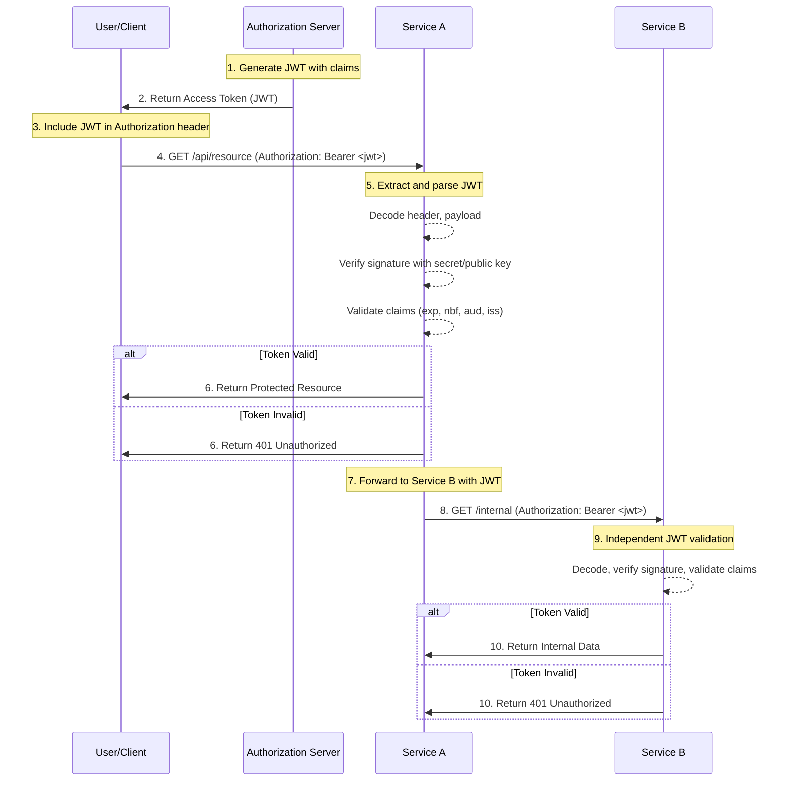

# JSON Web Token (JWT) Pattern
 
## Overview
 
JSON Web Tokens (JWT) are an open standard (RFC 7519) that defines a compact, URL-safe means of representing claims to be transferred between two parties. In microservices architectures, JWTs have become the de facto standard for securely transmitting authentication and authorization information between services. The token's self-contained nature allows services to validate tokens without making database calls, significantly improving performance and enabling stateless authentication.
 
The JWT architecture consists of three parts: the header, the payload, and the signature. The header typically contains the token type (JWT) and the signing algorithm being used (such as HMAC SHA-256 or RSA). The payload contains the claims—statements about the user and additional metadata. The signature is created by taking the encoded header, encoded payload, a secret or private key, and signing them using the specified algorithm.
 
One of the primary advantages of JWT is that the token itself contains all the necessary information for validation. This eliminates the need for session storage and allows services to scale horizontally without session affinity requirements. Each service can independently verify the token's signature and extract claims without consulting a central session store, making JWT ideal for distributed microservices architectures.
 
JWTs support various use cases beyond authentication, including information exchange, authorization, and data integrity verification. The stateless nature of JWTs enables efficient horizontal scaling of microservices, as any instance of a service can handle any request without needing to access shared session state. This makes JWTs particularly valuable in containerized and orchestrated environments like Kubernetes where service instances may be created and destroyed dynamically.
 
However, implementing JWT securely requires careful attention to signing key management, token expiration, and validation procedures. Poor implementation can lead to security vulnerabilities including signature bypass attacks, token replay, and information disclosure. Understanding these security considerations is essential for building secure microservices systems.
 
### Token Structure
 
A JWT consists of three Base64URL-encoded strings separated by dots: the header, the payload, and the signature. The structure looks like `xxxxx.yyyyy.zzzzz`. Each component serves a specific purpose in securing and conveying information. The compact nature of JWT allows it to be easily transmitted via URL parameters, HTTP headers, or within JSON bodies.
 
The header is a JSON object that specifies the token type and the cryptographic algorithm used for signing. Common algorithms include HS256 (HMAC with SHA-256), RS256 (RSA Signature with SHA-256), ES256 (ECDSA with P-256 and SHA-256), and PS256 (RSA-PSS). The algorithm specified in the header determines how the signature is created and verified.
 
The payload contains the claims, which are statements about an entity (typically the user) and additional data. There are three types of claims: registered, public, and private claims. Registered claims are predefined (iss, sub, aud, exp, nbf, iat, jti), public claims can be defined freely but should be registered with IANA, and private claims are custom claims agreed upon between parties.
 
The signature is created by signing the Base64URL-encoded header and payload with a secret key or private key using the algorithm specified in the header. This signature provides integrity verification—any modification to the token will cause signature validation to fail.
 
### Token Validation
 
Token validation is a critical security component that must be implemented correctly to prevent various attack vectors. A comprehensive validation process includes signature verification, expiration check, not-before validation, audience validation, issuer validation, and algorithm validation. Each of these steps must be performed correctly to ensure the token can be trusted.
 
Signature verification uses the algorithm specified in the token header and the appropriate key (secret for symmetric algorithms, public key for asymmetric algorithms). The signature is computed over the base64url-encoded header and payload, then compared against the signature portion of the token. A mismatch indicates the token has been tampered with.
 
Expiration validation ensures tokens are only accepted within their validity period. The exp claim specifies the expiration time, and tokens with past expiration times should be rejected. This limits the window of opportunity for attackers who may obtain valid tokens. Similarly, the nbf claim validates that the token is not being used before its specified not-before time.
 
Algorithm validation is crucial to prevent algorithm confusion attacks. Attackers may attempt to manipulate the algorithm header to bypass signature verification. Always validate that the algorithm matches what your application expects and never trust tokens that specify algorithms your implementation doesn't support.
 

 
## Standard Example
 
The following implementation provides a complete JWT management system for microservices. It includes token generation, validation, refresh mechanisms, and proper security practices like algorithm validation and key rotation. The example demonstrates both symmetric (HS256) and asymmetric (RS256) signing approaches.
 
```javascript
const jwt = require('jsonwebtoken'); 
const crypto = require('crypto');
const fs = require('fs').promises;
 
const config = {
    jwtSecret: process.env.JWT_SECRET,
    jwtAlgorithm: 'RS256', 
    accessTokenExpiry: '15m',
    refreshTokenExpiry: '7d',
    issuer: 'my-microservice-platform',
    audience: 'my-api-gateway',
    tokenPrefix: 'Bearer',
};
 
let keyPair = null;
 
async function loadOrGenerateKeys() {
    try {
        const publicKey = await fs.readFile('./keys/public.pem', 'utf-8');
        const privateKey = await fs.readFile('./keys/private.pem', 'utf-8');
        keyPair = { publicKey, privateKey };
    } catch (error) {
        const { publicKey, privateKey } = crypto.generateKeyPairSync('rsa', {
            modulusLength: 2048,
            publicKeyEncoding: { type: 'spki', format: 'pem' },
            privateKeyEncoding: { type: 'pkcs8', format: 'pem' },
        });
        
        await fs.mkdir('./keys', { recursive: true });
        await fs.writeFile('./keys/public.pem', publicKey);
        await fs.writeFile('./keys/private.pem', privateKey);
        
        keyPair = { publicKey, privateKey };
    }
}
 
function generateAccessToken(user) {
    const now = Math.floor(Date.now() / 1000);
    
    const payload = {
        iss: config.issuer,
        sub: user.id,
        aud: config.audience,
        exp: now + (15 * 60),
        nbf: now,
        iat: now,
        jti: crypto.randomUUID(),
        type: 'access',
        
        email: user.email,
        roles: user.roles || [],
        permissions: user.permissions || [],
        organizationId: user.organizationId,
    };
    
    const options = {
        algorithm: config.jwtAlgorithm,
        keyid: keyPair ? crypto.createHash('sha256').update(keyPair.publicKey).digest('hex').substring(0, 8) : 'default',
    };
    
    if (config.jwtAlgorithm.startsWith('HS')) {
        return jwt.sign(payload, config.jwtSecret, options);
    }
    
    return jwt.sign(payload, keyPair.privateKey, options);
}
 
function generateRefreshToken(user) {
    const now = Math.floor(Date.now() / 1000);
    
    const payload = {
        iss: config.issuer,
        sub: user.id,
        aud: config.audience,
        exp: now + (7 * 24 * 60 * 60),
        nbf: now,
        iat: now,
        jti: crypto.randomUUID(),
        type: 'refresh',
        
        tokenFamily: crypto.randomUUID(),
        rotationCount: 0,
    };
    
    if (config.jwtAlgorithm.startsWith('HS')) {
        return jwt.sign(payload, config.jwtSecret, { algorithm: 'HS256' });
    }
    
    return jwt.sign(payload, keyPair.privateKey, { algorithm: config.jwtAlgorithm });
}
 
function verifyToken(token, options = {}) {
    const defaultOptions = {
        algorithms: config.jwtAlgorithm.startsWith('HS') ? ['HS256'] : ['RS256', 'ES256'],
        issuer: config.issuer,
        audience: config.audience,
        complete: true,
    };
    
    const mergedOptions = { ...defaultOptions, ...options };
    
    if (config.jwtAlgorithm.startsWith('HS')) {
        mergedOptions.algorithms = ['HS256'];
    }
    
    try {
        const publicKey = config.jwtAlgorithm.startsWith('HS') 
            ? config.jwtSecret 
            : keyPair?.publicKey;
        
        if (!publicKey) {
            throw new Error('Unable to verify token: no key available');
        }
        
        const decoded = jwt.verify(token, publicKey, mergedOptions);
        
        return {
            valid: true,
            payload: decoded.payload,
            header: decoded.header,
        };
    } catch (error) {
        return {
            valid: false,
            error: error.name,
            message: error.message,
        };
    }
}
 
function decodeToken(token) {
    try {
        return jwt.decode(token, { complete: true, json: true });
    } catch (error) {
        return null;
    }
}
 
function isTokenExpired(token) {
    const decoded = decodeToken(token);
    if (!decoded || !decoded.payload.exp) {
        return true;
    }
    
    const now = Math.floor(Date.now() / 1000);
    return decoded.payload.exp < now;
}
 
function needsRefresh(token) {
    const decoded = decodeToken(token);
    if (!decoded || !decoded.payload.exp) {
        return true;
    }
    
    const now = Math.floor(Date.now() / 1000);
    const bufferTime = 5 * 60;
    
    return decoded.payload.exp - now < bufferTime;
}
 
function revokeRefreshToken(token, revokedTokensStore) {
    const decoded = decodeToken(token);
    if (!decoded || !decoded.payload.jti || !decoded.payload.tokenFamily) {
        return false;
    }
    
    revokedTokensStore.add(decoded.payload.jti);
    revokedTokensStore.add(decoded.payload.tokenFamily);
    
    return true;
}
 
function isTokenRevoked(jti, tokenFamily, revokedTokensStore) {
    if (revokedTokensStore.has(jti) || revokedTokensStore.has(tokenFamily)) {
        return true;
    }
    
    return false;
}
 
function extractTokenFromHeader(authHeader) {
    if (!authHeader || !authHeader.startsWith('Bearer ')) {
        return null;
    }
    
    return authHeader.substring(7);
}
 
async function rotateRefreshToken(refreshToken, revokedTokensStore) {
    const result = verifyToken(refreshToken, { algorithms: ['HS256', 'RS256'] });
    
    if (!result.valid || result.payload.type !== 'refresh') {
        return { error: 'Invalid refresh token' };
    }
    
    if (isTokenRevoked(result.payload.jti, result.payload.tokenFamily, revokedTokensStore)) {
        return { error: 'Token has been revoked' };
    }
    
    revokeRefreshToken(refreshToken, revokedTokensStore);
    
    const newRefreshToken = generateRefreshToken({
        id: result.payload.sub,
    });
    
    const newAccessToken = generateAccessToken({
        id: result.payload.sub,
        email: result.payload.email,
        roles: result.payload.roles,
        permissions: result.payload.permissions,
        organizationId: result.payload.organizationId,
    });
    
    return {
        accessToken: newAccessToken,
        refreshToken: newRefreshToken,
    };
}
 
function createTokenPair(user) {
    const accessToken = generateAccessToken(user);
    const refreshToken = generateRefreshToken(user);
    
    return {
        accessToken,
        refreshToken,
        tokenType: 'Bearer',
        expiresIn: 900,
    };
}
 
function validateScopes(tokenPayload, requiredScopes) {
    if (!requiredScopes || requiredScopes.length === 0) {
        return true;
    }
    
    const tokenScopes = tokenPayload.scope ? tokenPayload.scope.split(' ') : tokenPayload.permissions || [];
    
    return requiredScopes.every(scope => tokenScopes.includes(scope));
}
 
function validateRoles(tokenPayload, requiredRoles) {
    if (!requiredRoles || requiredRoles.length === 0) {
        return true;
    }
    
    const userRoles = tokenPayload.roles || [];
    
    return requiredRoles.some(role => userRoles.includes(role));
}
 
const revokedTokens = new Set();
 
function createSecureTokenValidator() {
    return async function validateRequest(req, res, next) {
        const token = extractTokenFromHeader(req.headers.authorization);
        
        if (!token) {
            return res.status(401).json({ error: 'Missing authentication token' });
        }
        
        const result = verifyToken(token);
        
        if (!result.valid) {
            return res.status(401).json({ error: `Invalid token: ${result.message}` });
        }
        
        if (isTokenRevoked(result.payload.jti, result.payload.tokenFamily, revokedTokens)) {
            return res.status(401).json({ error: 'Token has been revoked' });
        }
        
        req.user = result.payload;
        req.tokenHeader = result.header;
        
        next();
    };
}
 
function requireScope(...scopes) {
    return (req, res, next) => {
        if (!req.user) {
            return res.status(401).json({ error: 'Authentication required' });
        }
        
        if (!validateScopes(req.user, scopes)) {
            return res.status(403).json({ error: 'Insufficient permissions' });
        }
        
        next();
    };
}
 
function requireRole(...roles) {
    return (req, res, next) => {
        if (!req.user) {
            return res.status(401).json({ error: 'Authentication required' });
        }
        
        if (!validateRoles(req.user, roles)) {
            return res.status(403).json({ error: 'Insufficient permissions' });
        }
        
        next();
    };
}
 
module.exports = {
    generateAccessToken,
    generateRefreshToken,
    verifyToken,
    decodeToken,
    isTokenExpired,
    needsRefresh,
    createTokenPair,
    rotateRefreshToken,
    validateScopes,
    validateRoles,
    extractTokenFromHeader,
    createSecureTokenValidator,
    requireScope,
    requireRole,
    revokedTokens,
};
```
 
## Real-World Examples
 
### Auth0 JWT Implementation
Auth0 provides a comprehensive JWT-based authentication system that handles the entire token lifecycle including issuance, validation, and refresh. Their implementation includes additional security features like token rotation, refresh token rotation, and automatic key rotation. The platform supports both RS256 and HS256 algorithms and provides JWKS endpoints for key retrieval.
 
```javascript
const jwt = require('jsonwebtoken');
const jwksClient = require('jwks-rsa');
const { promisify } = require('util');
 
const auth0Config = {
    domain: process.env.AUTH0_DOMAIN || 'your-tenant.auth0.com',
    audience: process.env.AUTH0_AUDIENCE || 'https://api.example.com',
    issuer: `https://your-tenant.auth0.com/`,
    algorithms: ['RS256'],
};
 
const jwksClientInstance = jwksClient({
    jwksUri: `https://${auth0Config.domain}/.well-known/jwks.json`,
    cache: true,
    rateLimit: true,
    jwksRequestsPerMinute: 10,
    cacheMaxAge: 600000,
});
 
const getSigningKey = promisify(jwksClientInstance.getSigningKey);
 
async function getKey(header, callback) {
    try {
        const key = await getSigningKey(header.kid);
        const signingKey = key.getPublicKey();
        callback(null, signingKey);
    } catch (error) {
        callback(error);
    }
}
 
async function verifyAuth0Token(token) {
    return new Promise((resolve, reject) => {
        jwt.verify(
            token,
            getKey,
            {
                audience: auth0Config.audience,
                issuer: auth0Config.issuer,
                algorithms: auth0Config.algorithms,
            },
            (err, decoded) => {
                if (err) {
                    resolve({ valid: false, error: err.message });
                } else {
                    resolve({ valid: true, payload: decoded });
                }
            }
        );
    });
}
 
async function generateAuth0Token(userId, permissions) {
    const payload = {
        iss: auth0Config.issuer,
        sub: userId,
        aud: auth0Config.audience,
        iat: Math.floor(Date.now() / 1000),
        exp: Math.floor(Date.now() / 1000) + 86400,
        permissions: permissions,
    };
    
    return jwt.sign(payload, process.env.AUTH0_SIGNING_SECRET, {
        algorithm: 'HS256',
    });
}
 
function decodeAuth0Token(token) {
    try {
        const decoded = jwt.decode(token, { complete: true });
        return decoded ? decoded.payload : null;
    } catch (error) {
        return null;
    }
}
 
async function checkAuth0Permissions(token, requiredPermissions) {
    const result = await verifyAuth0Token(token);
    
    if (!result.valid) {
        return false;
    }
    
    const tokenPermissions = result.payload.permissions || [];
    return requiredPermissions.every(permission => tokenPermissions.includes(permission));
}
 
module.exports = {
    verifyAuth0Token,
    generateAuth0Token,
    decodeAuth0Token,
    checkAuth0Permissions,
};
```
 
### Okta JWT Implementation
Okta implements JWT with additional enterprise features including conditional access policies, MFA enforcement, and custom claims. Their JWT implementation includes support for inline hooks for custom token processing and group-based access control through JWT claims.
 
```javascript
const jwt = require('jsonwebtoken');
const jwksClient = require('jwks-rsa');
const { promisify } = require('util');
 
const oktaConfig = {
    domain: process.env.OKTA_DOMAIN || 'your-org.okta.com',
    clientId: process.env.OKTA_CLIENT_ID,
    issuer: process.env.OKTA_ISSUER || 'https://your-org.okta.com/oauth2/default',
    audience: process.env.OKTA_AUDIENCE || 'api://default',
};
 
const oktaJwksClient = jwksClient({
    jwksUri: `${oktaConfig.issuer}/v1/keys`,
    cache: true,
    rateLimit: true,
    cacheMaxAge: 300000,
    getKeysInterceptor: null,
});
 
const oktaGetSigningKey = promisify(oktaJwksClient.getSigningKey);
 
async function getOktaSigningKey(header) {
    const key = await oktaGetSigningKey(header.kid);
    return key.getPublicKey();
}
 
async function verifyOktaToken(token) {
    try {
        const decoded = await jwt.verify(token, getOktaSigningKey, {
            issuer: oktaConfig.issuer,
            audience: oktaConfig.audience,
            algorithms: ['RS256'],
        });
        
        return { valid: true, payload: decoded };
    } catch (error) {
        return { valid: false, error: error.message };
    }
}
 
async function validateOktaAccessToken(token) {
    const result = await verifyOktaToken(token);
    
    if (!result.valid) {
        return { authorized: false, reason: result.error };
    }
    
    const payload = result.payload;
    const now = Math.floor(Date.now() / 1000);
    
    if (payload.exp < now || payload.iat > now) {
        return { authorized: false, reason: 'Token expired or not yet valid' };
    }
    
    if (payload.iss !== oktaConfig.issuer) {
        return { authorized: false, reason: 'Invalid issuer' };
    }
    
    return {
        authorized: true,
        user: {
            id: payload.sub,
            email: payload.email,
            name: payload.name,
            groups: payload.groups || [],
        },
        claims: payload,
    };
}
 
async function getTokenClaims(token) {
    const decoded = jwt.decode(token);
    return decoded ? decoded : null;
}
 
function requireOktaGroup(groupName) {
    return async (req, res, next) => {
        const authHeader = req.headers.authorization;
        
        if (!authHeader || !authHeader.startsWith('Bearer ')) {
            return res.status(401).json({ error: 'Missing token' });
        }
        
        const token = authHeader.substring(7);
        const validation = await validateOktaAccessToken(token);
        
        if (!validation.authorized) {
            return res.status(403).json({ error: validation.reason });
        }
        
        if (!validation.user.groups.includes(groupName)) {
            return res.status(403).json({ error: `Missing required group: ${groupName}` });
        }
        
        req.user = validation.user;
        next();
    };
}
 
module.exports = {
    verifyOktaToken,
    validateOktaAccessToken,
    getTokenClaims,
    requireOktaGroup,
};
```
 
### Google JWT Implementation
Google uses JWT extensively for API authentication, particularly with Google Cloud Platform services. Their implementation supports service account authentication, OAuth 2.0 tokens, and ID tokens for user authentication. Google also provides libraries for easy JWT creation and validation in various programming languages.
 
```javascript
const { OAuth2Client, JWT } = require('google-auth-library');
const jwt = require('jsonwebtoken');
const fs = require('fs').promises;
const path = require('path');
 
const googleConfig = {
    projectId: process.env.GOOGLE_PROJECT_ID,
    serviceAccountPath: process.env.GOOGLE_SERVICE_ACCOUNT_PATH,
    audience: process.env.GOOGLE_AUDIENCE || 'https://pubsub.googleapis.com',
};
 
let serviceAccount = null;
let oauth2Client = null;
 
async function loadServiceAccount() {
    if (!serviceAccount) {
        const credentials = await fs.readFile(googleConfig.serviceAccountPath);
        serviceAccount = JSON.parse(credentials);
        
        oauth2Client = new OAuth2Client(
            serviceAccount.client_id,
            serviceAccount.client_secret,
            'http://localhost:3000/oauth2callback'
        );
    }
    
    return serviceAccount;
}
 
async function createGoogleJwt(serviceAccountEmail, scope) {
    const now = Math.floor(Date.now() / 1000);
    
    const payload = {
        iss: serviceAccountEmail,
        sub: serviceAccountEmail,
        aud: 'https://oauth2.googleapis.com/token',
        iat: now,
        exp: now + 3600,
        scope: scope.join(' '),
    };
    
    const privateKey = await loadServiceAccount().then(sa => sa.private_key);
    
    return jwt.sign(payload, privateKey, {
        algorithm: 'RS256',
        header: { typ: 'JWT', alg: 'RS256' },
    });
}
 
async function getGoogleAccessToken(scopes) {
    const sa = await loadServiceAccount();
    
    const jwtToken = await createGoogleJwt(sa.client_email, scopes);
    
    const url = 'https://oauth2.googleapis.com/token';
    const params = new URLSearchParams({
        grant_type: 'urn:ietf:params:oauth:grant-type:jwt-bearer',
        assertion: jwtToken,
    });
    
    const response = await fetch(url, {
        method: 'POST',
        headers: {
            'Content-Type': 'application/x-www-form-urlencoded',
        },
        body: params.toString(),
    });
    
    if (!response.ok) {
        throw new Error(`Failed to obtain access token: ${response.statusText}`);
    }
    
    return await response.json();
}
 
async function verifyGoogleIdToken(idToken) {
    const client = new OAuth2Client(googleConfig.projectId);
    
    try {
        const ticket = await client.verifyIdToken({
            idToken: idToken,
            audience: googleConfig.projectId,
        });
        
        const payload = ticket.getPayload();
        
        return {
            valid: true,
            userId: payload.sub,
            email: payload.email,
            emailVerified: payload.email_verified,
            name: payload.name,
            picture: payload.picture,
        };
    } catch (error) {
        return { valid: false, error: error.message };
    }
}
 
async function verifyGoogleAccessToken(accessToken) {
    const oauth2Client = new OAuth2Client();
    
    try {
        const tokenInfo = await oauth2Client.getTokenInfo(accessToken);
        
        return {
            valid: true,
            email: tokenInfo.email,
            scope: tokenInfo.scope,
            expiresIn: tokenInfo.expiry_date - Date.now(),
        };
    } catch (error) {
        return { valid: false, error: error.message };
    }
}
 
function decodeGoogleJwt(token) {
    try {
        const decoded = jwt.decode(token);
        return decoded ? decoded : null;
    } catch (error) {
        return null;
    }
}
 
module.exports = {
    getGoogleAccessToken,
    verifyGoogleIdToken,
    verifyGoogleAccessToken,
    decodeGoogleJwt,
};
```
 
## Output Statement
 
JWT is an essential component of modern microservices security, providing a stateless, scalable mechanism for authentication and authorization. The self-contained nature of JWTs enables efficient service-to-service communication while maintaining security through cryptographic signatures. Implementing JWT correctly requires attention to key management, algorithm selection, and comprehensive validation. By following best practices such as using asymmetric algorithms, implementing token rotation, and properly validating all claims, microservices can achieve robust security. Major identity providers like Auth0, Okta, and Google offer mature JWT implementations that can be leveraged for enterprise authentication systems.
 
## Best Practices
 
**Use Asymmetric Algorithms for Production**: RS256, ES256, or PS256 should be used in production environments instead of symmetric algorithms like HS256. Asymmetric algorithms allow the authorization server to keep the private key secure while distributing only the public key to resource servers. This provides better security separation and simplifies key rotation without affecting running services.
 
**Implement Token Rotation**: Always implement refresh token rotation to mitigate token reuse attacks. When a refresh token is used, issue a new refresh token and invalidate the old one. Store a token family identifier to allow revoking all tokens in a family if one is compromised. This ensures that stolen refresh tokens cannot be used after the legitimate client obtains a new token.
 
**Validate All Claims**: Never skip validation of any JWT claims. Verify the issuer matches your expected issuer, the audience matches your service, the token is not expired (exp), is not used before its not-before time (nbf), and check the algorithm header matches what you expect. Incomplete validation is a common source of security vulnerabilities.
 
**Keep Tokens Short-Lived**: Access tokens should have short lifetimes (15-60 minutes) to limit exposure if compromised. Use refresh tokens to maintain sessions without requiring frequent re-authentication. This balances security with user experience while ensuring that compromised tokens automatically become invalid.
 
**Use Strong Key Management**: Implement secure key storage and rotation mechanisms. Never hardcode keys in source code. Use hardware security modules (HSM) or key management services (KMS) for production environments. Rotate keys regularly and have a migration plan for transitioning to new keys without service interruption.
 
**Implement Proper Error Handling**: Never expose sensitive information in error messages. Return generic errors to clients while logging detailed information server-side. This prevents information disclosure attacks that could help attackers understand your token validation logic.
 
**Use HTTPS Only**: All token transmission must occur over HTTPS. Implement HSTS headers to ensure browsers always use secure connections. This prevents token interception through man-in-the-middle attacks.
 
**Implement Token Revocation**: Despite JWTs being stateless, implement revocation mechanisms for security incidents. Use a token blacklist or short token lifetimes to ensure compromised tokens can be invalidated. Consider using reference tokens for high-security scenarios where immediate revocation is critical.
 
**Protect Against Algorithm Confusion**: Explicitly specify and validate the expected algorithm. Never trust the algorithm in the token header without validation. Implement algorithm allowlisting rather than blocklisting to prevent new algorithms from being accepted automatically.
 
**Store Tokens Securely**: Never store tokens in localStorage for sensitive applications. Use secure, HTTP-only cookies for web applications. For mobile applications, use secure storage mechanisms provided by the platform (Keychain for iOS, Keystore for Android). Consider token encryption for additional security in high-risk environments.
