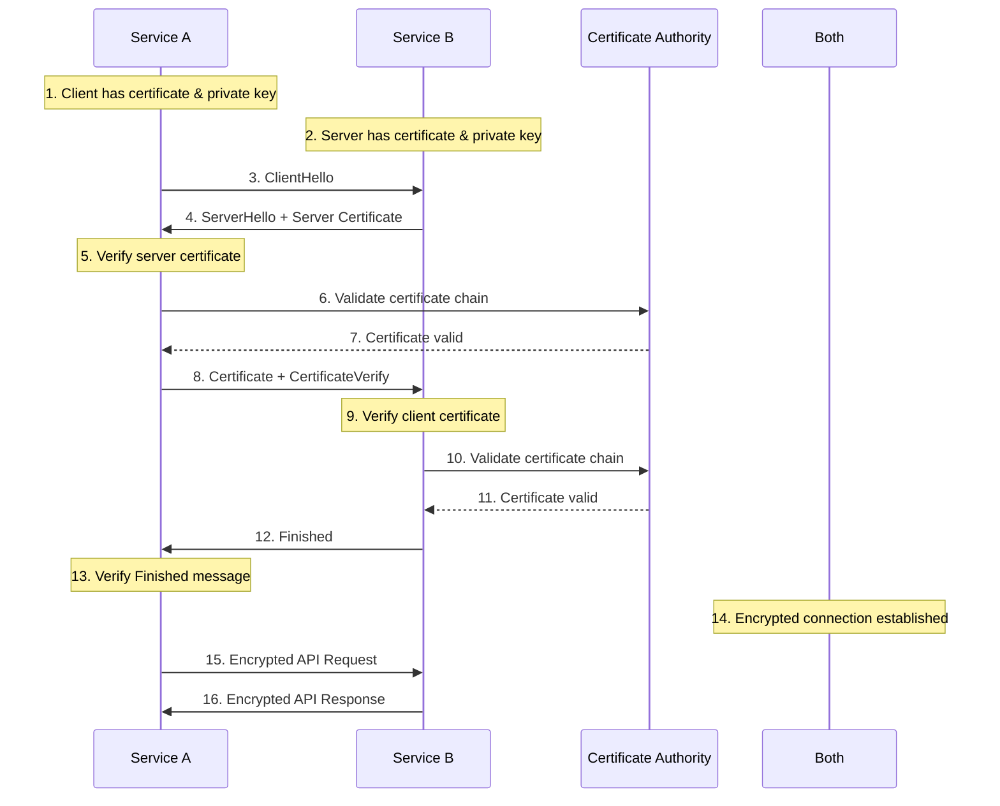

# Certificate-Based Authentication

## Overview

Certificate-based authentication (CBA) is a security mechanism that uses digital certificates to verify the identity of entities (users, services, or devices) in a communications network. Unlike passwords or API keys, digital certificates provide cryptographic proof of identity through public key infrastructure (PKI), making them resistant to replay attacks, phishing, and credential theft. In microservices architectures, certificate-based authentication serves as a foundation for mutual TLS (mTLS), where both client and server authenticate each other using certificates.

Digital certificates are issued by trusted Certificate Authorities (CAs) and contain the entity's public key, identity information, and the CA's digital signature. The certificate binds a public key to an identity (such as a domain name, organization name, or user identity). When a client presents its certificate during authentication, the server verifies the certificate chain up to a trusted root CA and validates that the certificate has not expired or been revoked.

The primary advantage of certificate-based authentication is its resistance to credential theft. Private keys used in certificate authentication are never transmitted over the network—they are used only to sign challenges or establish secure connections. This makes certificate-based authentication particularly valuable for service-to-service communication in microservices, where traditional password-based approaches would require storing and managing credentials for every service.

Certificate-based authentication is widely used in enterprise environments, financial services, healthcare systems, and government applications where strong security guarantees are required. It forms the backbone of mutual TLS (mTLS) in Kubernetes service mesh implementations and cloud-native security architectures.

### Types of Certificates

**Server Certificates** are used to identify servers to clients. When a client connects to a server, the server presents its certificate to prove its identity. Clients verify the server certificate against trusted root CAs and check that the certificate's subject matches the hostname they are connecting to. Server certificates typically have validity periods of one year and include the server's domain name in the Subject Alternative Name (SAN) extension.

**Client Certificates** are used to identify clients to servers. Unlike server certificates, client certificates are optional and used when the server needs to authenticate the client. Client certificates are particularly useful for service-to-service authentication in microservices, where each service can have a unique certificate issued by a private CA. The server validates the client certificate and can use the certificate's subject or SAN to determine the service's identity and permissions.

**CA Certificates** are certificates used to sign other certificates. There are two types: root CAs (self-signed certificates at the top of the trust chain) and intermediate CAs (certificates signed by other CAs). In enterprise environments, organizations typically use an internal PKI with a root CA and intermediate CAs for different departments or services.

**Code Signing Certificates** are used to verify the authenticity and integrity of software code. While not directly used for authentication, they ensure that software has not been tampered with and comes from a trusted developer. This is important for verifying that deployed microservices are authentic.

### Mutual TLS (mTLS)

Mutual TLS extends standard TLS by requiring both client and server to present certificates. In standard TLS (one-way TLS), only the server presents a certificate—the client verifies the server's identity but the server does not verify the client. In mTLS, both parties authenticate each other, providing bidirectional verification.

mTLS is particularly important in microservices architectures because it provides service identity at the network layer. Each service has a certificate that uniquely identifies it, and connections are only established between authenticated services. This prevents unauthorized services from connecting to internal networks and provides encryption for all traffic.

mTLS implementations typically use a service mesh or service mesh-like capabilities (like Kubernetes network policies) to automate certificate rotation, distribution, and validation. Popular implementations include Istio, Linkerd, and HashiCorp Vault's PKI secrets engine.



## Standard Example

The following implementation demonstrates certificate-based authentication and mTLS in a Node.js microservices environment. This includes certificate generation using a private CA, server configuration for mTLS, client certificate authentication, and automated certificate rotation.

```javascript
const https = require('https');
const http = require('http');
const tls = require('tls');
const crypto = require('crypto');
const fs = require('fs').promises;
const path = require('path');

const config = {
    caCertPath: process.env.CA_CERT_PATH || './certs/ca.pem',
    serverCertPath: process.env.SERVER_CERT_PATH || './certs/server.pem',
    serverKeyPath: process.env.SERVER_KEY_PATH || './certs/server.key',
    clientCertPath: process.env.CLIENT_CERT_PATH || './certs/client.pem',
    clientKeyPath: process.env.CLIENT_KEY_PATH || './certs/client.key',
    certValidityDays: 365,
    rotationCheckInterval: 24 * 60 * 60 * 1000,
};

async function createCA() {
    const { publicKey, privateKey } = crypto.generateKeyPairSync('rsa', {
        modulusLength: 4096,
        publicKeyEncoding: { type: 'spki', format: 'pem' },
        privateKeyEncoding: { type: 'pkcs8', format: 'pem' },
    });

    const caCert = crypto.createCertificate();
    caCert.setSubject({ CN: 'Microservices CA', O: 'MyOrganization' });
    caCert.setIssuer({ CN: 'Microservices CA', O: 'MyOrganization' });
    caCert.setNotBefore(new Date());
    caCert.setNotAfter(new Date(Date.now() + 10 * 365 * 24 * 60 * 60 * 1000));
    caCert.setExtensions([
        { name: 'basicConstraints', cA: true },
        { name: 'keyUsage', keyCertSign: true, cRLSign: true },
    ]);
    caCert.sign(privateKey, crypto.createHash('sha256').update(privateKey).digest());

    return {
        cert: caCert.toPEM(),
        publicKey,
        privateKey,
    };
}

function createCertificate(ca, options = {}) {
    const { publicKey, privateKey } = crypto.generateKeyPairSync('rsa', {
        modulusLength: 2048,
        publicKeyEncoding: { type: 'spki', format: 'pem' },
        privateKeyEncoding: { type: 'pkcs8', format: 'pem' },
    });

    const cert = crypto.createCertificate();
    cert.setSubject({
        CN: options.commonName,
        O: options.organization || 'MyOrganization',
        OU: options.organizationalUnit || 'Microservices',
    });
    cert.setIssuer(ca.certSubject);
    cert.setNotBefore(new Date());
    cert.setNotAfter(new Date(Date.now() + (options.validityDays || config.certValidityDays) * 24 * 60 * 60 * 1000));
    cert.setPublicKey(publicKey);

    const subjectAltNames = options.san || [];
    cert.setExtensions([
        { name: 'basicConstraints', cA: false },
        { name: 'keyUsage', digitalSignature: true, keyEncipherment: true },
        { name: 'extKeyUsage', serverAuth: options.serverAuth, clientAuth: options.clientAuth },
        { name: 'subjectAltName', altNames: subjectAltNames.map(name => ({ type: 2, value: name })) },
    ]);

    cert.sign(ca.privateKey, crypto.createHash('sha256').update(ca.privateKey).digest());

    return {
        cert: cert.toPEM(),
        publicKey,
        privateKey,
        subject: cert.getSubject(),
    };
}

function verifyCertificate(certPEM, caCertPEM) {
    try {
        const cert = new crypto.X509Certificate(certPEM);
        const caCert = new crypto.X509Certificate(caCertPEM);

        const caPublicKey = crypto.createPublicKey(caCert.publicKey);
        const certPublicKey = crypto.createPublicKey(cert.publicKey);

        const certSpki = crypto.createHash('sha256').update(certPublicKey).digest('hex');
        const caSpki = crypto.createHash('sha256').update(caPublicKey).digest('hex');

        if (certSpki !== caSpki) {
            return { valid: false, reason: 'Certificate not issued by trusted CA' };
        }

        const now = new Date();
        const notBefore = new Date(cert.validFrom);
        const notAfter = new Date(cert.validTo);

        if (now < notBefore) {
            return { valid: false, reason: 'Certificate not yet valid' };
        }

        if (now > notAfter) {
            return { valid: false, reason: 'Certificate has expired' };
        }

        return { valid: true, subject: cert.subject, issuer: cert.issuer };
    } catch (error) {
        return { valid: false, reason: error.message };
    }
}

function loadCertAndKey(certPath, keyPath) {
    return Promise.all([
        fs.readFile(certPath),
        fs.readFile(keyPath),
    ]).then(([cert, key]) => ({ cert, key }));
}

async function createMTLSServer(app, options = {}) {
    const { cert, key } = await loadCertAndKey(config.serverCertPath, config.serverKeyPath);
    const caCert = await fs.readFile(config.caCertPath);

    const serverOptions = {
        cert,
        key,
        ca: [caCert],
        requestCert: true,
        rejectUnauthorized: true,
        minVersion: 'TLSv1.2',
        ciphers: 'ECDHE-RSA-AES256-GCM-SHA512:DHE-RSA-AES256-GCM-SHA512:ECDHE-RSA-AES256-GCM-SHA384:DHE-RSA-AES256-GCM-SHA384',
    };

    if (options.honorCipherOrder) {
        serverOptions.honorCipherOrder = true;
    }

    return https.createServer(serverOptions, app);
}

async function createMTLSClient(options = {}) {
    const { cert, key } = await loadCertAndKey(config.clientCertPath, config.clientKeyPath);
    const caCert = await fs.readFile(config.caCertPath);

    const agent = new https.Agent({
        cert,
        key,
        ca: [caCert],
        requestCert: true,
        rejectUnauthorized: true,
        minVersion: 'TLSv1.2',
    });

    return agent;
}

function extractClientCertInfo(tlsSocket) {
    const cert = tlsSocket.getPeerCertificate();
    
    if (!cert || Object.keys(cert).length === 0) {
        return null;
    }

    return {
        subject: cert.subject,
        issuer: cert.issuer,
        validFrom: cert.valid_from,
        validTo: cert.valid_to,
        fingerprint: cert.fingerprint,
        serialNumber: cert.serialNumber,
    };
}

const certStore = new Map();

function registerService(serviceName, certInfo, metadata = {}) {
    certStore.set(serviceName, {
        ...certInfo,
        registeredAt: Date.now(),
        metadata,
    });
}

function isServiceRegistered(serviceName) {
    const certInfo = certStore.get(serviceName);
    if (!certInfo) {
        return false;
    }

    const validTo = new Date(certInfo.validTo);
    if (validTo < new Date()) {
        certStore.delete(serviceName);
        return false;
    }

    return true;
}

function mtlsAuthMiddleware(req, res, next) {
    const tlsSocket = req.socket;
    
    if (!tlsSocket.getPeerCertificate) {
        return res.status(401).json({ error: 'TLS connection required' });
    }

    const cert = tlsSocket.getPeerCertificate();
    
    if (!cert || Object.keys(cert).length === 0) {
        return res.status(401).json({ error: 'Client certificate required' });
    }

    const certInfo = extractClientCertInfo(tlsSocket);
    
    if (!certInfo) {
        return res.status(401).json({ error: 'Invalid client certificate' });
    }

    const commonName = certInfo.subject.CN;
    const serviceName = commonName;

    if (!isServiceRegistered(serviceName)) {
        return res.status(403).json({ error: 'Service not registered' });
    }

    req.serviceIdentity = {
        name: serviceName,
        certInfo,
    };

    next();
}

function requireServiceRole(...allowedRoles) {
    return (req, res, next) => {
        if (!req.serviceIdentity) {
            return res.status(401).json({ error: 'Authentication required' });
        }

        const serviceData = certStore.get(req.serviceIdentity.name);
        const roles = serviceData?.metadata?.roles || [];

        const hasRole = roles.some(role => allowedRoles.includes(role));
        
        if (!hasRole) {
            return res.status(403).json({ error: 'Insufficient permissions' });
        }

        next();
    };
}

async function rotateCertificate(serviceName, ca) {
    const currentCert = certStore.get(serviceName);
    const options = {
        commonName: serviceName,
        organization: currentCert?.metadata?.organization,
        validityDays: config.certValidityDays,
    };

    const newCert = createCertificate(ca, options);

    return {
        cert: newCert.cert,
        privateKey: newCert.privateKey,
        validFrom: new Date(),
        validTo: new Date(Date.now() + config.certValidityDays * 24 * 60 * 60 * 1000),
    };
}

const express = require('express');
const app = express();
app.use(express.json());

app.get('/health', (req, res) => {
    res.json({ status: 'healthy', mTLS: 'enabled' });
});

app.get('/api/service-a', mtlsAuthMiddleware, (req, res) => {
    res.json({
        message: 'Access granted to Service A',
        service: req.serviceIdentity.name,
    });
});

app.get('/api/service-b', mtlsAuthMiddleware, requireRole('service-b-access'), (req, res) => {
    res.json({
        message: 'Access granted to Service B',
        service: req.serviceIdentity.name,
    });
});

async function startMTLSServer() {
    const server = await createMTLSServer(app);
    const port = process.env.PORT || 8443;
    
    server.listen(port, () => {
        console.log(`mTLS server running on port ${port}`);
    });
    
    return server;
}

module.exports = {
    createCA,
    createCertificate,
    verifyCertificate,
    createMTLSServer,
    createMTLSClient,
    extractClientCertInfo,
    registerService,
    isServiceRegistered,
    mtlsAuthMiddleware,
    requireServiceRole,
    rotateCertificate,
};
```

## Real-World Examples

### HashiCorp Vault PKI Implementation

HashiCorp Vault provides a comprehensive PKI secrets engine that can issue and manage certificates for mTLS in microservices. Vault's implementation includes certificate rotation, CRL (Certificate Revocation List) management, and automatic certificate issuance through its PKI engine.

```javascript
const https = require('https');
const http = require('http');

const vaultConfig = {
    host: process.env.VAULT_HOST || 'localhost',
    port: process.env.VAULT_PORT || 8200,
    token: process.env.VAULT_TOKEN,
    pkiMount: process.env.VAULT_PKI_MOUNT || 'pki',
};

function vaultRequest(method, path, body = null) {
    return new Promise((resolve, reject) => {
        const options = {
            hostname: vaultConfig.host,
            port: vaultConfig.port,
            path: path,
            method: method,
            headers: {
                'X-Vault-Token': vaultConfig.token,
                'Content-Type': 'application/json',
            },
        };

        const req = https.request(options, (res) => {
            let data = '';
            res.on('data', (chunk) => data += chunk);
            res.on('end', () => {
                try {
                    const parsed = JSON.parse(data);
                    if (res.statusCode >= 200 && res.statusCode < 300) {
                        resolve(parsed);
                    } else {
                        reject(new Error(`Vault error: ${parsed.errors?.[0] || res.statusCode}`));
                    }
                } catch (e) {
                    reject(e);
                }
            });
        });

        req.on('error', reject);
        
        if (body) {
            req.write(JSON.stringify(body));
        }
        
        req.end();
    });
}

async function createVaultCA(caName) {
    try {
        const response = await vaultRequest('POST', `/v1/${vaultConfig.pkiMount}/root/generate/exported`, {
            common_name: caName,
            ttl: '87600h',
            key_type: 'rsa',
            key_bits: 4096,
            format: 'pem',
        });
        
        return {
            certificate: response.data.certificate,
            privateKey: response.data.private_key,
            issuer: response.data.issuer,
        };
    } catch (error) {
        console.error('Failed to create Vault CA:', error);
        throw error;
    }
}

async function createVaultRole(roleName, options) {
    const roleConfig = {
        name: roleName,
        allow_any_name: options.allowAnyName || false,
        allow_bare_domains: options.allowBareDomains || false,
        allow_subdomains: options.allowSubdomains || true,
        allow_localhost: options.allowLocalhost || false,
        max_ttl: options.maxTTL || '24h',
        ttl: options.ttl || '1h',
        key_type: 'rsa',
        key_bits: 2048,
        key_usage: ['DigitalSignature', 'KeyEncipherment'],
        ext_key_usage: ['ServerAuth', 'ClientAuth'],
    };

    try {
        await vaultRequest('POST', `/v1/${vaultConfig.pkiMount}/roles/${roleName}`, roleConfig);
        return { role: roleName, created: true };
    } catch (error) {
        console.error('Failed to create Vault role:', error);
        throw error;
    }
}

async function issueCertificate(roleName, cn, sans = []) {
    const certRequest = {
        common_name: cn,
        ttl: '24h',
        alt_names: sans.join(','),
        format: 'pem',
        private_key_format: 'pem',
    };

    try {
        const response = await vaultRequest('POST', `/v1/${vaultConfig.pkiMount}/issue/${roleName}`, certRequest);
        
        return {
            certificate: response.data.certificate,
            ca_certificate: response.data.ca_certificate,
            private_key: response.data.private_key,
            issuing_ca: response.data.issuing_ca,
            expiration: response.data.expiration,
            serial_number: response.data.serial_number,
        };
    } catch (error) {
        console.error('Failed to issue certificate:', error);
        throw error;
    }
}

async function revokeCertificate(serialNumber) {
    try {
        const response = await vaultRequest('POST', `/v1/${vaultConfig.pkiMount}/revoke`, {
            serial_number: serialNumber,
        });
        
        return { revoked: true, revoke_response: response.data };
    } catch (error) {
        console.error('Failed to revoke certificate:', error);
        throw error;
    }
}

async function getCAChain() {
    try {
        const response = await vaultRequest('GET', `/v1/${vaultConfig.pkiMount}/cert/ca`);
        return response.data.ca;
    } catch (error) {
        console.error('Failed to get CA chain:', error);
        throw error;
    }
}

async function listCertificates() {
    try {
        const response = await vaultRequest('LIST', `/v1/${vaultConfig.pkiMount}/certs`);
        return response.data.keys || [];
    } catch (error) {
        console.error('Failed to list certificates:', error);
        throw error;
    }
}

async function getCertificate CRL() {
    try {
        const response = await vaultRequest('GET', `/v1/${vaultConfig.pkiMount}/cert/crl`);
        return response.data;
    } catch (error) {
        console.error('Failed to get CRL:', error);
        throw error;
    }
}

module.exports = {
    createVaultCA,
    createVaultRole,
    issueCertificate,
    revokeCertificate,
    getCAChain,
    listCertificates,
    getCertificateCRL,
};
```

### Istio Service Mesh mTLS

Istio provides automatic mTLS for microservices through its service mesh architecture. The service mesh manages certificates automatically, rotating them frequently and providing strong mutual authentication between services without requiring code changes.

```javascript
const https = require('https');
const fs = require('fs').promises;
const path = require('path');

const istioConfig = {
    certDirectory: process.env.CERT_DIRECTORY || '/etc/certs',
    serviceAccount: process.env.SERVICE_ACCOUNT || 'default',
    namespace: process.env.NAMESPACE || 'default',
};

async function loadIstioCertificates() {
    try {
        const certPath = path.join(istioConfig.certDirectory, 'cert-chain.pem');
        const keyPath = path.join(istioConfig.certDirectory, 'key.pem');
        const rootCertPath = path.join(istioConfig.certDirectory, 'root-cert.pem');

        const [cert, key, rootCert] = await Promise.all([
            fs.readFile(certPath),
            fs.readFile(keyPath),
            fs.readFile(rootCertPath),
        ]);

        return {
            cert: cert.toString(),
            key: key.toString(),
            rootCert: rootCert.toString(),
            loaded: true,
        };
    } catch (error) {
        console.error('Failed to load Istio certificates:', error);
        return { loaded: false };
    }
}

function createIstioMTLSServer(app) {
    return loadIstioCertificates().then(certs => {
        if (!certs.loaded) {
            throw new Error('Istio certificates not available');
        }

        const serverOptions = {
            cert: certs.cert,
            key: certs.key,
            ca: [certs.rootCert],
            requestCert: true,
            rejectUnauthorized: false,
        };

        return https.createServer(serverOptions, app);
    });
}

function extractIstioIdentity(tlsSocket) {
    const cert = tlsSocket.getPeerCertificate();
    
    if (!cert || !cert.subject) {
        return null;
    }

    const spiffeMatch = cert.subject.match(/spiffe\.googleusercontent\.com\/ns\/(.+)\/sa\/(.+)/);
    
    if (spiffeMatch) {
        return {
            namespace: spiffeMatch[1],
            serviceAccount: spiffeMatch[2],
            trustDomain: 'spiffe.googleusercontent.com',
        };
    }

    return {
        namespace: istioConfig.namespace,
        serviceAccount: istioConfig.serviceAccount,
        commonName: cert.subject.CN,
    };
}

function istioAuthMiddleware(req, res, next) {
    const tlsSocket = req.socket;
    
    if (!tlsSocket.getPeerCertificate || !tlsSocket.getPeerCertificate()) {
        return res.status(401).json({ error: 'mTLS required' });
    }

    const identity = extractIstioIdentity(tlsSocket);
    
    if (!identity) {
        return res.status(401).json({ error: 'Invalid service identity' });
    }

    req.serviceIdentity = identity;
    next();
}

function requireIstioNamespace(...namespaces) {
    return (req, res, next) => {
        if (!req.serviceIdentity) {
            return res.status(401).json({ error: 'Authentication required' });
        }

        if (!namespaces.includes(req.serviceIdentity.namespace)) {
            return res.status(403).json({ error: 'Namespace not allowed' });
        }

        next();
    };
}

module.exports = {
    loadIstioCertificates,
    createIstioMTLSServer,
    extractIstioIdentity,
    istioAuthMiddleware,
    requireIstioNamespace,
};
```

### AWS Private CA Implementation

AWS Private Certificate Authority provides managed PKI for creating private certificates. It integrates with AWS services like API Gateway, Application Load Balancer, and AWS App Mesh for automated certificate management.

```javascript
const { ACMPCAClient, IssueCertificateCommand, GetCertificateCommand, RevokeCertificateCommand } = require('@aws-sdk/client-acm-pca');
const { fromEnv } = require('@aws-sdk/credential-provider-env');

const awsConfig = {
    region: process.env.AWS_REGION || 'us-east-1',
    endpoint: process.env.AWS_PCA_ENDPOINT,
    caArn: process.env.PRIVATE_CA_ARN,
};

const pcaClient = new ACMPCAClient({
    region: awsConfig.region,
    credentials: fromEnv(),
    endpoint: awsConfig.endpoint,
});

async function issueAWSCertificate(cn, sans = []) {
    const params = {
        CertificateAuthorityArn: awsConfig.caArn,
        Csr: Buffer.from(''),
        SigningAlgorithm: 'SHA256WITHRSA',
        Validity: {
            Value: 365,
            Type: 'DAYS',
        },
        Subject: {
            CommonName: cn,
        },
        IdempotencyToken: Math.random().toString(36).substring(7),
    };

    if (sans.length > 0) {
        params.SubjectAlternativeNames = sans.map(san => ({ Type: 2, Value: san }));
    }

    try {
        const command = new IssueCertificateCommand(params);
        const response = await pcaClient.send(command);
        
        return {
            arn: response.CertificateArn,
            status: 'ISSUED',
        };
    } catch (error) {
        console.error('Failed to issue AWS certificate:', error);
        throw error;
    }
}

async function getAWSCertificate(certificateArn) {
    try {
        const command = new GetCertificateCommand({
            CertificateAuthorityArn: awsConfig.caArn,
            CertificateArn: certificateArn,
        });
        
        const response = await pcaClient.send(command);
        
        return {
            certificate: response.Certificate,
            caCertificate: response.CaCertificate,
        };
    } catch (error) {
        console.error('Failed to get AWS certificate:', error);
        throw error;
    }
}

async function revokeAWSCertificate(certificateArn, reason = 'KEY_COMPROMISE') {
    try {
        const command = new RevokeCertificateCommand({
            CertificateAuthorityArn: awsConfig.caArn,
            CertificateArn: certificateArn,
            RevocationReason: reason,
        });
        
        await pcaClient.send(command);
        
        return { revoked: true, arn: certificateArn };
    } catch (error) {
        console.error('Failed to revoke AWS certificate:', error);
        throw error;
    }
}

function createAWSCertificateSigningRequest(privateKey, cn, sans = []) {
    const crypto = require('crypto');
    
    const csr = crypto.createSign('RSA-SHA256');
    csr.write(`CN=${cn}`);
    csr.end();

    const der = csr.sign(privateKey);
    return Buffer.from(der).toString('base64');
}

module.exports = {
    issueAWSCertificate,
    getAWSCertificate,
    revokeAWSCertificate,
    createAWSCertificateSigningRequest,
};
```

## Output Statement

Certificate-based authentication provides strong, cryptographic identity verification that is essential for secure microservices communication. Through mutual TLS (mTLS), services can mutually authenticate each other at the network layer, providing defense in depth against unauthorized access. The pattern's resistance to credential theft makes it particularly valuable for protecting sensitive internal services. Major cloud providers and open-source projects like HashiCorp Vault, Istio, and AWS Private CA provide mature implementations that automate certificate lifecycle management. Organizations operating in regulated industries or handling sensitive data should strongly consider certificate-based authentication as a foundation for their security architecture.

## Best Practices

**Use Private CAs for Internal Services**: Never use public CAs for internal service-to-service communication. Create a private CA specifically for your organization using tools like HashiCorp Vault, OpenSSL, or cloud provider PKI services. This provides full control over certificate issuance, revocation, and trust policies for internal services.

**Implement Automatic Certificate Rotation**: Certificates should be rotated before expiration to prevent service disruptions. Implement automatic certificate issuance and rotation using service mesh implementations (Istio, Linkerd) or PKI automation tools. Short-lived certificates (hours to days) provide better security than long-lived certificates.

**Validate Certificate Chains Properly**: Always validate the complete certificate chain from the presented certificate up to a trusted root CA. Check that each intermediate CA is authorized to issue certificates. Implement proper chain validation in your TLS configuration rather than disabling it for convenience.

**Implement Certificate Revocation Checking**: Regularly check for revoked certificates using CRL (Certificate Revocation List) or OCSP (Online Certificate Status Protocol). For high-security environments, consider using OCSP stapling to ensurerevocation status is always checked. Implement fail-safe behavior when revocation status cannot be determined.

**Use Strong Key Sizes and Algorithms**: Use at least 2048-bit RSA keys or equivalent elliptic curve keys (P-256 or higher). Disable weak cipher suites and TLS versions. Require TLS 1.2 or higher and configure secure cipher suites that provide forward secrecy.

**Secure Private Key Storage**: Private keys must be stored securely and never committed to version control. Use Hardware Security Modules (HSM) or cloud key management services for production environments. In Kubernetes, use secrets management tools like Sealed Secrets or external secret stores.

**Implement Service Identity Beyond Certificates**: Use the certificate identity (typically the Common Name or Subject Alternative Name) for authorization decisions. Implement service registries that map certificate identities to service roles and permissions. This enables fine-grained access control based on certificate-based identities.

**Monitor Certificate Expiration**: Implement monitoring for certificate expiration to prevent outages from expired certificates. Alert on certificates approaching expiration (30 days, 7 days, 1 day). Maintain runbooks for emergency certificate rotation in case of unexpected expiration.

**Use Certificate Templates**: Create certificate templates that enforce consistent security settings across your organization. Templates should specify required key sizes, validity periods, key usage extensions, and extended key usage (serverAuth, clientAuth) for different types of services.

**Implement Network Policies**: Combine certificate-based authentication with network policies that restrict which services can communicate. In Kubernetes, use NetworkPolicy to enforce that only authorized services can connect to specific endpoints. This provides defense in depth even if certificates are somehow compromised.
