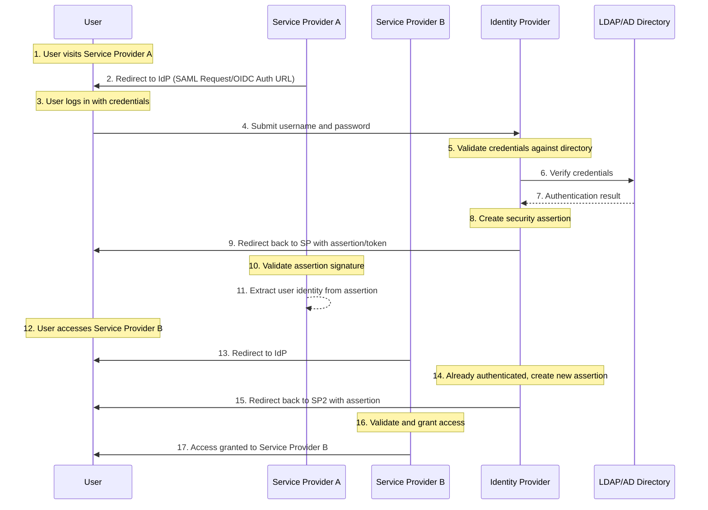

# Single Sign-On (SSO) Pattern

## Overview

Single Sign-On (SSO) is an authentication scheme that enables users to log in to multiple related but independent software systems using a single set of credentials. Instead of maintaining separate username and password pairs for each application, users authenticate once with an identity provider and gain access to all authorized applications without re-entering credentials. SSO improves user experience by eliminating password fatigue, reduces password management overhead, and provides centralized security enforcement across an organization's application portfolio.

In microservices architectures, SSO serves as a critical infrastructure component that enables consistent authentication across services. When implemented correctly, SSO allows each microservice to trust authentication decisions made by a central identity provider, rather than implementing its own authentication logic. This centralized approach simplifies security management, ensures consistent policy enforcement, and reduces the attack surface by consolidating authentication into a single, well-protected system.

SSO has become essential for enterprise environments where users need access to numerous applications daily. Beyond convenience, SSO provides significant security benefits: fewer passwords mean fewer opportunities for weak passwords or credential reuse, centralized authentication enables rapid response to security incidents, and comprehensive audit logs provide visibility into user access patterns across all applications.

The fundamental architecture of SSO involves three main components: the identity provider (IdP), the service providers (SPs), and the user. The identity provider maintains user identities and credentials, authenticates users, and issues security tokens. Service providers are the applications that rely on the identity provider for authentication. The user initiates authentication through their browser or client, which interacts with both the IdP and SPs through standardized protocols.

### SSO Protocols

**SAML 2.0** (Security Assertion Markup Language) is an XML-based standard for exchanging authentication and authorization data between identity providers and service providers. SAML uses security tokens containing assertions about the user, which the service provider validates. SAML is widely used in enterprise environments and supports Single Logout (SLO) for terminating sessions across all applications.

**OpenID Connect (OIDC)** is an identity layer built on top of the OAuth 2.0 protocol. OIDC adds an ID token to the OAuth authorization flow, providing information about the authenticated user. OIDC is more modern than SAML, uses JSON, and integrates more naturally with RESTful APIs. It has become the preferred protocol for new implementations.

**OAuth 2.0** is primarily an authorization framework but serves as the foundation for OIDC. While OAuth 2.0 alone does not provide authentication, it enables delegated authorization and is used extensively for API access and modern web applications.

### SSO Flows

The most common SSO flow is the Service Provider-initiated flow, where the user attempts to access a service provider application and is redirected to the identity provider for authentication. After successful authentication, the user is redirected back to the service provider with a security token. Alternatively, in the Identity Provider-initiated flow, the user starts at the identity provider's portal and selects applications to access.

The security of SSO implementations relies on the trust relationship between identity providers and service providers. This trust is established through certificate exchange, metadata sharing, and explicit configuration. The identity provider signs assertions that service providers validate using the trusted certificate.



## Standard Example

The following implementation demonstrates a complete SSO solution using OpenID Connect. It includes configuration for multiple service providers, session management, token handling, and integration with existing identity directories.

```javascript
const express = require('express');
const session = require('express-session');
const crypto = require('crypto');
const axios = require('axios');
const { Issuer, generators, Strategy: OpenIDStrategy } = require('openid-client');

const app = express();
app.use(express.json());

const config = {
    port: process.env.PORT || 3000,
    sessionSecret: process.env.SESSION_SECRET || crypto.randomBytes(32).toString('hex'),
    issuerUrl: process.env.ISSUER_URL || 'https://identity.example.com',
    clientId: process.env.CLIENT_ID || 'my-microservice',
    clientSecret: process.env.CLIENT_SECRET,
    redirectUri: process.env.REDIRECT_URI || 'http://localhost:3000/auth/callback',
    scopes: ['openid', 'profile', 'email', 'offline_access'],
    postLogoutRedirectUri: process.env.POST_LOGOUT_REDIRECT_URI || 'http://localhost:3000',
};

app.use(session({
    secret: config.sessionSecret,
    resave: false,
    saveUninitialized: false,
    cookie: {
        secure: process.env.NODE_ENV === 'production',
        httpOnly: true,
        maxAge: 24 * 60 * 60 * 1000,
        sameSite: 'lax',
    },
}));

let client = null;

async function initializeOIDCClient() {
    const issuer = await Issuer.discover(config.issuerUrl);
    client = new issuer.Client({
        client_id: config.clientId,
        client_secret: config.clientSecret,
        redirect_uris: [config.redirectUri],
        response_types: ['code'],
        token_endpoint_auth_method: 'client_secret_basic',
    });
    return client;
}

function generateState() {
    return crypto.randomBytes(32).toString('hex');
}

function generateNonce() {
    return crypto.randomBytes(32).toString('hex');
}

app.get('/auth/login', (req, res) => {
    const state = generateState();
    const nonce = generateNonce();

    req.session.oauthState = state;
    req.session.oauthNonce = nonce;
    req.session.returnTo = req.query.returnTo || '/dashboard';

    const authUrl = client.authorizationUrl({
        scope: config.scopes.join(' '),
        state: state,
        nonce: nonce,
        redirect_uri: config.redirectUri,
    });

    res.redirect(authUrl);
});

app.get('/auth/callback', async (req, res) => {
    const { code, state, error } = req.query;

    if (error) {
        return res.status(400).json({
            error: error,
            error_description: req.query.error_description,
        });
    }

    if (state !== req.session.oauthState) {
        return res.status(400).json({ error: 'Invalid state parameter' });
    }

    try {
        const tokenSet = await client.callback(
            config.redirectUri,
            { code: code, state: state },
            { state: state, nonce: req.session.oauthNonce }
        );

        const userInfo = await client.userinfo(tokenSet.access_token);

        req.session.accessToken = tokenSet.access_token;
        req.session.refreshToken = tokenSet.refresh_token;
        req.session.idToken = tokenSet.id_token;
        req.session.user = {
            sub: userInfo.sub,
            email: userInfo.email,
            name: userInfo.name,
            picture: userInfo.picture,
            preferredUsername: userInfo.preferred_username,
        };
        req.session.authTime = Math.floor(Date.now() / 1000);

        delete req.session.oauthState;
        delete req.session.oauthNonce;

        res.redirect(req.session.returnTo || '/dashboard');
    } catch (error) {
        console.error('Authentication callback error:', error);
        res.status(500).json({ error: 'Authentication failed' });
    }
});

app.get('/auth/logout', async (req, res) => {
    const idTokenHint = req.session.idToken;

    delete req.session.accessToken;
    delete req.session.refreshToken;
    delete req.session.idToken;
    delete req.session.user;
    delete req.session.authTime;

    if (idTokenHint && client) {
        const logoutUrl = client.endSessionUrl({
            id_token_hint: idTokenHint,
            post_logout_redirect_uri: config.postLogoutRedirectUri,
        });

        return res.redirect(logoutUrl);
    }

    res.redirect('/');
});

app.post('/auth/refresh', async (req, res) => {
    if (!req.session.refreshToken) {
        return res.status(401).json({ error: 'No refresh token available' });
    }

    try {
        const tokenSet = await client.refresh(req.session.refreshToken);

        req.session.accessToken = tokenSet.access_token;
        if (tokenSet.refresh_token) {
            req.session.refreshToken = tokenSet.refresh_token;
        }

        res.json({ success: true, expires_in: tokenSet.expires_in });
    } catch (error) {
        console.error('Token refresh error:', error);
        delete req.session.refreshToken;
        res.status(401).json({ error: 'Token refresh failed' });
    }
});

function requireAuthentication(req, res, next) {
    if (!req.session.accessToken || !req.session.user) {
        return res.status(401).json({
            error: 'Authentication required',
            loginUrl: '/auth/login',
        });
    }

    req.user = req.session.user;
    next();
}

app.get('/api/user', requireAuthentication, (req, res) => {
    res.json({
        user: req.user,
        authTime: req.session.authTime,
    });
});

app.get('/api/protected', requireAuthentication, (req, res) => {
    res.json({
        message: 'Access granted to protected resource',
        user: req.user.sub,
    });
});

app.get('/api/call-downstream', requireAuthentication, async (req, res) => {
    try {
        const downstreamResponse = await axios.get(
            'http://downstream-service:8080/api/data',
            {
                headers: {
                    'Authorization': `Bearer ${req.session.accessToken}`,
                },
            }
        );

        res.json(downstreamResponse.data);
    } catch (error) {
        console.error('Downstream call error:', error);
        res.status(500).json({ error: 'Downstream service call failed' });
    }
});

app.get('/dashboard', requireAuthentication, (req, res) => {
    res.json({
        message: 'Welcome to the dashboard',
        user: req.user,
    });
});

app.get('/', (req, res) => {
    if (req.session.user) {
        res.json({
            authenticated: true,
            user: req.user.name || req.user.email,
        });
    } else {
        res.json({
            authenticated: false,
            loginUrl: '/auth/login',
        });
    }
});

initializeOIDCClient()
    .then(() => {
        app.listen(config.port, () => {
            console.log(`SSO application running on port ${config.port}`);
        });
    })
    .catch(error => {
        console.error('Failed to initialize OIDC client:', error);
        process.exit(1);
    });

const saml = require('@node-saml/node-saml');
const configSAML = {
    callbackUrl: process.env.SAML_CALLBACK_URL || 'http://localhost:3000/auth/saml/callback',
    entryPoint: process.env.SAML_ENTRY_POINT || 'https://idp.example.com/sso/SSO.saml2',
    issuer: process.env.SAML_ISSUER || 'https://myapp.example.com',
    wantAssertionsSigned: true,
    wantAuthnResponseSigned: false,
    signatureAlgorithm: 'sha256',
};

const samlStrategy = new saml.SamlStrategy(
    configSAML,
    (profile, done) => {
        return done(null, {
            id: profile.nameID,
            email: profile.email || profile.nameID,
            displayName: profile.displayName || profile.nameID,
        });
    },
    (user, done) => {
        return done(null, user);
    }
);

app.get('/auth/saml/login', (req, res) => {
    samlStrategy.generateAuthorizeRequest(req, true, (err, request) => {
        if (err) {
            return res.status(500).json({ error: 'Failed to generate SAML request' });
        }
        res.redirect(request);
    });
});

app.post('/auth/saml/callback', (req, res, next) => {
    samlStrategy.verifyPostAssertion(req, (err, user, info) => {
        if (err) {
            return res.status(401).json({ error: 'SAML verification failed' });
        }

        req.session.user = user;
        req.session.authTime = Math.floor(Date.now() / 1000);

        res.redirect('/dashboard');
    });
});

module.exports = {
    initializeOIDCClient,
    requireAuthentication,
    config,
};
```

## Real-World Examples

### Auth0 SSO Implementation

Auth0 provides comprehensive SSO capabilities supporting both SAML and OIDC protocols. Their Universal Login supports passwordless authentication, MFA, and social identity providers. Auth0 SSO can integrate with enterprise identity sources like Active Directory and can manage application-specific roles and permissions.

```javascript
const { AuthenticationClient, ManagementClient } = require('auth0');

const auth0Client = new AuthenticationClient({
    domain: process.env.AUTH0_DOMAIN,
    clientId: process.env.AUTH0_CLIENT_ID,
    clientSecret: process.env.AUTH0_CLIENT_SECRET,
});

async function getAuth0SsoConfig(clientId) {
    return {
        domain: process.env.AUTH0_DOMAIN,
        clientId: clientId,
        authorizationEndpoint: `https://${process.env.AUTH0_DOMAIN}/authorize`,
        tokenEndpoint: `https://${process.env.AUTH0_DOMAIN}/oauth/token`,
        userInfoEndpoint: `https://${process.env.AUTH0_DOMAIN}/userinfo`,
        jwksUri: `https://${process.env.AUTH0_DOMAIN}/.well-known/jwks.json`,
        issuer: `https://${process.env.AUTH0_DOMAIN}/`,
    };
}

async function createAuth0Connection(connectionName, options) {
    const managementClient = new ManagementClient({
        domain: process.env.AUTH0_DOMAIN,
        clientId: process.env.AUTH0_CLIENT_ID,
        clientSecret: process.env.AUTH0_CLIENT_SECRET,
    });

    const connection = {
        name: connectionName,
        strategy: options.strategy || 'auth0',
        options: {
            mfa: { status: options.mfa ? 'required' : 'optional' },
            passwordPolicy: options.passwordPolicy || 'good',
        },
        metadata: options.metadata || {},
    };

    if (options.ldap) {
        connection.strategy = 'ad';
        connection.options = {
            bindUsername: options.ldap.bindUsername,
            bindPassword: options.ldap.bindPassword,
            serverUrl: options.ldap.serverUrl,
            port: options.ldap.port,
        };
    }

    return await managementClient.createConnection(connection);
}

async function enableAuth0SSO(domain, ssoCookieName) {
    const managementClient = new ManagementClient({
        domain: process.env.AUTH0_DOMAIN,
        clientId: process.env.AUTH0_CLIENT_ID,
        clientSecret: process.env.AUTH0_CLIENT_SECRET,
    });

    await managementClient.updateTenantSettings({
        sso_cookie_name: ssoCookieName,
    });

    return { ssoEnabled: true, domain: domain };
}

async function getAuth0SsoSession(req) {
    const token = req.cookies[`sso_${process.env.AUTH0_DOMAIN}`];
    if (!token) {
        return { valid: false };
    }

    try {
        const userInfo = await auth0Client.oauth.userInfo(token);
        return { valid: true, user: userInfo.data };
    } catch (error) {
        return { valid: false };
    }
}

module.exports = {
    getAuth0SsoConfig,
    createAuth0Connection,
    enableAuth0SSO,
    getAuth0SsoSession,
};
```

### Okta SSO Implementation

Okta provides enterprise SSO through its Integrated Windows Authentication (IWA) for intranet applications and Okta MFA for cloud applications. Okta supports SAML, OIDC, and WS-Federation protocols and provides a unified admin console for managing all applications.

```javascript
const { Client } = require('@okta/okta-sdk-nodejs');

const oktaClient = new Client({
    orgUrl: process.env.OKTA_ORG_URL,
    token: process.env.OKTA_API_TOKEN,
});

async function createOktaSAMLApp(appName, ssoSettings) {
    const appSettings = {
        app: {
            field1: 'value1',
        },
        attributes: {
            attributeStatements: [
                {
                    name: 'email',
                    nameFormat: 'urn:oasis:names:tc:SAML:2.0:attrname-format:basic',
                    values: ['user.email'],
                },
            ],
        },
    };

    const app = await oktaClient.createApplication({
        name: ' SAML 2.0',
        label: appName,
        signOnMode: 'SAML_2_0',
        settings: appSettings,
    });

    await oktaClient.updateApplicationSamlSettings(app.id, {
        ssoUrl: ssoSettings.ssoUrl,
        issuer: ssoSettings.issuer,
        destination: ssoSettings.destination,
    });

    return {
        appId: app.id,
        appName: app.name,
        ssoUrl: ssoSettings.ssoUrl,
    };
}

async function createOktaOIDCApp(appName, redirectUris, postLogoutRedirectUris) {
    const app = await oktaClient.createApplication({
        name: 'OpenID Connect',
        label: appName,
        signOnMode: 'OPENID_CONNECT',
        settings: {
            oauthGrantTypes: {
                clientCredentials: true,
                authorizationCode: true,
                implicit: false,
            },
            oauthClient: {
                redirectUris: redirectUris,
                postLogoutRedirectUris: postLogoutRedirectUris,
                responseTypes: ['code', 'token', 'id_token'],
                grantType: 'authorization_code',
                applicationType: 'web',
            },
        },
    });

    return {
        appId: app.id,
        appName: app.name,
        clientId: app.settings.oauthClient.clientId,
        clientSecret: app.settings.oauthClient.clientSecret,
    };
}

async function getOktaSsoSettings(userId) {
    const user = await oktaClient.getUser(userId);
    const sessions = await user.listSessions();

    const activeSessions = [];
    for await (const session of sessions) {
        activeSessions.push({
            id: session.id,
            created: session.created,
            expiresAt: session.expiresAt,
            type: session.type,
        });
    }

    return { sessions: activeSessions };
}

async function revokeOktaUserSessions(userId) {
    const user = await oktaClient.getUser(userId);
    await user.revokeSessions();

    return { sessionsRevoked: true };
}

async function configureOktaIdP(idpName, idpSettings) {
    const idp = await oktaClient.createIdentityProvider({
        name: idpName,
        protocol: idpSettings.protocol,
        issuer: idpSettings.issuer,
        ssoUrl: idpSettings.ssoUrl,
        certificate: idpSettings.certificate,
        clientId: idpSettings.clientId,
        clientSecret: idpSettings.clientSecret,
        scopes: idpSettings.scopes,
        attributeStatements: idpSettings.attributeStatements,
    });

    return { idpId: idp.id, name: idp.name };
}

module.exports = {
    createOktaSAMLApp,
    createOktaOIDCApp,
    getOktaSsoSettings,
    revokeOktaUserSessions,
    configureOktaIdP,
};
```

### Azure AD SSO Implementation

Azure Active Directory provides enterprise SSO through SAML and OIDC, with deep integration into Microsoft 365 and other Azure services. Azure AD supports conditional access policies, MFA requirements, and can act as an identity provider for thousands of SaaS applications.

```javascript
const { ClientSecretCredential } = require('@azure/identity');
const { ConfidentialClientApplication } = require('@azure/msal-node');

const azureConfig = {
    tenantId: process.env.AZURE_TENANT_ID,
    clientId: process.env.AZURE_CLIENT_ID,
    clientSecret: process.env.AZURE_CLIENT_SECRET,
    redirectUri: process.env.AZURE_REDIRECT_URI,
};

let msalClient = null;

async function initializeMsalClient() {
    msalClient = new ConfidentialClientApplication({
        auth: {
            clientId: azureConfig.clientId,
            authority: `https://login.microsoftonline.com/${azureConfig.tenantId}`,
            clientSecret: azureConfig.clientSecret,
        },
    });

    return msalClient;
}

function getAzureAuthUrl(scopes, state) {
    const authUrl = `https://login.microsoftonline.com/${azureConfig.tenantId}/oauth2/v2.0/authorize`;
    const params = new URLSearchParams({
        client_id: azureConfig.clientId,
        response_type: 'code',
        redirect_uri: azureConfig.redirectUri,
        response_mode: 'query',
        scope: scopes.join(' '),
        state: state,
    });

    return `${authUrl}?${params.toString()}`;
}

async function acquireTokenFromCode(authCode, scopes) {
    if (!msalClient) {
        await initializeMsalClient();
    }

    const tokenResponse = await msalClient.acquireTokenByAuthorizationCode({
        code: authCode,
        scopes: scopes,
        redirectUri: azureConfig.redirectUri,
    });

    return {
        accessToken: tokenResponse.accessToken,
        idToken: tokenResponse.idToken,
        expiresOn: tokenResponse.expiresOn,
    };
}

async function getAzureADUserInfo(accessToken) {
    const response = await fetch('https://graph.microsoft.com/v1.0/me', {
        headers: {
            Authorization: `Bearer ${accessToken}`,
        },
    });

    return await response.json();
}

async function getAzureSsoToken(userId, appId) {
    const credential = new ClientSecretCredential(
        azureConfig.tenantId,
        azureConfig.clientId,
        azureConfig.clientSecret
    );

    const tokenResponse = await credential.getToken(
        `api://${appId}/.default`
    );

    return { accessToken: tokenResponse.token };
}

async function createAzureEnterpriseApp(appName, objectId) {
    return {
        appName: appName,
        objectId: objectId,
        ssoEnabled: true,
    };
}

async function configureAzureSAML(appId, samlSettings) {
    return {
        appId: appId,
        ssoUrl: samlSettings.ssoUrl,
        identifierUri: samlSettings.identifierUri,
        replyUrl: samlSettings.replyUrl,
    };
}

module.exports = {
    initializeMsalClient,
    getAzureAuthUrl,
    acquireTokenFromCode,
    getAzureADUserInfo,
    getAzureSsoToken,
    createAzureEnterpriseApp,
    configureAzureSAML,
};
```

## Output Statement

Single Sign-On provides centralized authentication across multiple applications, improving user experience while enabling consistent security policies. In microservices architectures, SSO allows services to trust the identity provider's authentication decisions rather than implementing their own authentication logic. This reduces complexity, improves security through centralized policy enforcement, and provides comprehensive audit logging. Organizations should implement SSO using standard protocols like OIDC or SAML to ensure interoperability and future-proof their authentication infrastructure. Major identity providers like Auth0, Okta, and Azure AD provide mature SSO implementations suitable for enterprise environments.

## Best Practices

**Use Standard Protocols**: Implement SSO using standard protocols (OIDC or SAML) to ensure interoperability between identity providers and service providers. OIDC is recommended for new implementations due to its JSON-based format and tighter integration with modern APIs. Avoid proprietary protocols that create vendor lock-in.

**Implement Proper Session Management**: Configure appropriate session timeouts balancing security and user experience. Implement session revocation capabilities for security incidents. Use secure, HTTP-only cookies for session storage to prevent XSS attacks. Consider implementing sliding expiration for active users.

**Enable Single Logout (SLO)**: Implement Single Logout to terminate sessions across all applications when the user logs out from any single application. This prevents session fixation attacks where attackers might hijack sessions. SLO can be implemented through SAML SLO or OIDC back-channel logout.

**Use Short-Lived Tokens**: Configure access tokens with short lifetimes (minutes to hours) to limit the impact of token compromise. Use refresh tokens to maintain sessions without requiring frequent re-authentication. Implement token binding to tie tokens to specific clients or devices.

**Implement Proper CSRF Protection**: Use state parameters in OAuth/OIDC flows and verify them upon callback. Implement CSRF tokens for state-changing operations. Ensure that logout and other sensitive actions are protected against CSRF attacks.

**Secure the Identity Provider**: The identity provider is the central trust point and must be secured accordingly. Implement strong authentication for IdP admin access. Enable comprehensive audit logging. Keep the IdP software updated and patched. Implement network segmentation to limit the impact of potential compromise.

**Implement Proper Redirect Validation**: Validate all redirect URIs in the OAuth/OIDC flow to prevent redirect attacks. Whitelist allowed redirect URIs rather than allowing arbitrary redirects. This prevents attackers from redirecting users to malicious sites after authentication.

**Use PKCE for All Clients**: Implement Proof Key for Code Exchange (PKCE) even for confidential clients where it is not strictly required. This provides defense in depth against authorization code interception attacks.

**Provide User Session Visibility**: Inform users about their active sessions and provide mechanisms to review and revoke sessions. Display session information like device, location, and last activity. Enable users to revoke sessions from suspicious devices.

**Implement Proper Error Handling**: Never expose sensitive information in error messages. Return generic errors to users while logging detailed information server-side. This prevents information disclosure that could help attackers understand the authentication flow.

**Implement Comprehensive Logging**: Log all authentication events including successful logins, failed attempts, logouts, and session revocations. Include sufficient context for forensic analysis. Integrate with SIEM systems for centralized security monitoring.

**Plan for IdP Outages**: Design for IdP unavailability by implementing appropriate fallback authentication or clear error messaging. Consider distributed authentication options for critical applications. Ensure that authentication failures do not cascade to complete service unavailability.

**Implement Proper Trust Establishment**: Carefully validate the identity provider's certificate and metadata when establishing trust. Use mechanisms like metadata signing verification for SAML. Periodically review and update trust configurations.
