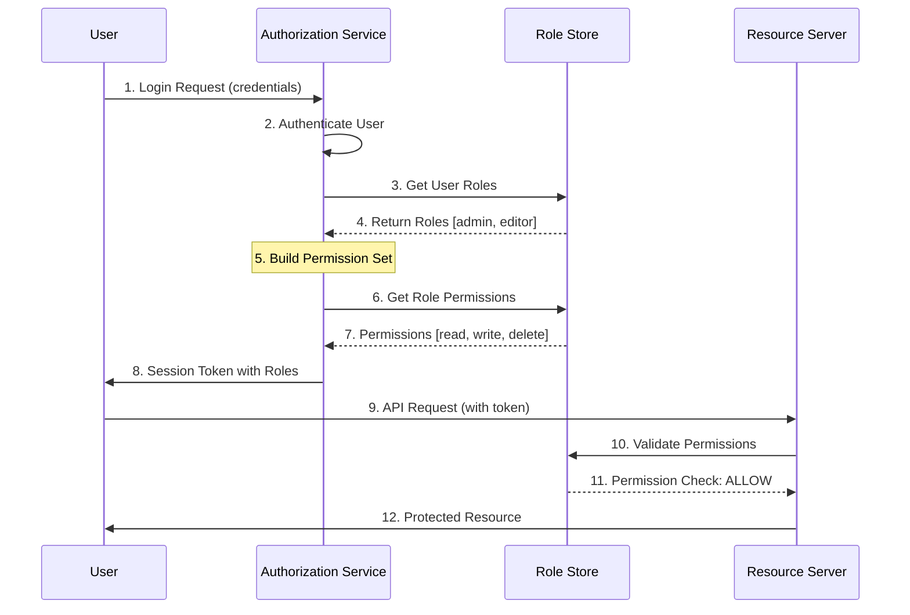

# Role-Based Access Control (RBAC)

## Overview

Role-Based Access Control (RBAC) is an authorization pattern that restricts system access based on a user's role within an organization. Instead of assigning permissions directly to individual users, permissions are assigned to roles, and users are assigned to roles based on their job functions. This pattern simplifies security management and provides a scalable approach to access control in microservices architectures.

RBAC operates on the principle of least privilege, ensuring that users have only the permissions necessary to perform their job functions. The pattern reduces the complexity of permission management by organizing permissions into roles that align with job responsibilities. When a user's job function changes, their role can be updated rather than modifying individual permissions.

The key components of RBAC include roles, permissions, users, and the relationships between them. A role represents a job function and encapsulates a set of permissions. Permissions define what actions can be performed on which resources. Users are assigned to roles based on their responsibilities. This separation of users and permissions provides flexibility and simplifies administration.

RBAC is widely used in enterprise applications, cloud services, and microservices architectures. It provides a clear, auditable structure for access control that aligns with organizational hierarchies. The pattern supports the principle of separation of duties by ensuring that critical functions require multiple roles or approvals.

### Key Concepts

**Role**: A named identity that represents a job function or responsibility within the organization. Roles are assigned permissions that define what actions users in that role can perform. Roles can be hierarchical, with child roles inheriting permissions from parent roles. This allows for role inheritance and simplifies permission management.

**Permission**: A specific capability to perform an action on a resource. Permissions are granular and describe a single action on a single resource type. Examples include read:document, write:document, delete:document, or execute:action. Permissions are never assigned directly to users but are instead assigned to roles.

**User**: An individual who interacts with the system. Users are assigned roles based on their job functions. A single user can have multiple roles, and a single role can be assigned to multiple users. This many-to-many relationship provides flexibility in access control.

**Resource**: An object that the system protects. Resources can be data, files, API endpoints, or any other system asset. Each resource has an owner who can grant or revoke access. Resources are associated with permissions that define what actions can be performed on them.

**Session**: A temporary connection between a user and the system. When a user logs in, their assigned roles are activated for the session. The session context determines what resources the user can access. Sessions have finite lifetimes and must be properly managed for security.



## Standard Example

The following example demonstrates implementing RBAC in a Node.js microservices environment with role management, permission evaluation, and middleware for securing endpoints.

```javascript
const express = require('express');
const jwt = require('jsonwebtoken');
const crypto = require('crypto');

const app = express();
app.use(express.json());

const config = {
    jwtSecret: process.env.JWT_SECRET || 'your-secret-key',
    jwtExpiry: '1h',
};

const roleStore = new Map();
const permissionStore = new Map();
const userRoleStore = new Map();

function initializeRBAC() {
    permissionStore.set('read:documents', {
        name: 'read:documents',
        description: 'Read documents',
        resource: 'document',
        action: 'read',
    });
    
    permissionStore.set('write:documents', {
        name: 'write:documents',
        description: 'Create or update documents',
        resource: 'document',
        action: 'write',
    });
    
    permissionStore.set('delete:documents', {
        name: 'delete:documents',
        description: 'Delete documents',
        resource: 'document',
        action: 'delete',
    });
    
    permissionStore.set('manage:users', {
        name: 'manage:users',
        description: 'Manage user accounts',
        resource: 'user',
        action: 'manage',
    });
    
    permissionStore.set('view:audit', {
        name: 'view:audit',
        description: 'View audit logs',
        resource: 'audit',
        action: 'view',
    });
    
    roleStore.set('admin', {
        name: 'admin',
        description: 'Full administrative access',
        permissions: ['read:documents', 'write:documents', 'delete:documents', 'manage:users', 'view:audit'],
        inheritsFrom: null,
    });
    
    roleStore.set('editor', {
        name: 'editor',
        description: 'Content editor',
        permissions: ['read:documents', 'write:documents'],
        inheritsFrom: null,
    });
    
    roleStore.set('viewer', {
        name: 'viewer',
        description: 'Read-only access',
        permissions: ['read:documents'],
        inheritsFrom: null,
    });
    
    roleStore.set('auditor', {
        name: 'auditor',
        description: 'Audit and compliance',
        permissions: ['view:audit', 'read:documents'],
        inheritsFrom: null,
    });
    
    roleStore.set('super_admin', {
        name: 'super_admin',
        description: 'Super administrator',
        permissions: [],
        inheritsFrom: 'admin',
    });
}

initializeRBAC();

function getUserPermissions(userId) {
    const roles = userRoleStore.get(userId) || [];
    const permissions = new Set();
    
    for (const roleName of roles) {
        const role = roleStore.get(roleName);
        if (!role) continue;
        
        for (const permName of role.permissions) {
            permissions.add(permName);
        }
        
        if (role.inheritsFrom) {
            const parentRole = roleStore.get(role.inheritsFrom);
            if (parentRole) {
                for (const permName of parentRole.permissions) {
                    permissions.add(permName);
                }
            }
        }
    }
    
    return Array.from(permissions);
}

function hasPermission(userId, permission) {
    const permissions = getUserPermissions(userId);
    return permissions.includes(permission);
}

function assignRoleToUser(userId, roleName) {
    const roles = userRoleStore.get(userId) || [];
    if (!roles.includes(roleName)) {
        roles.push(roleName);
        userRoleStore.set(userId, roles);
    }
}

function removeRoleFromUser(userId, roleName) {
    const roles = userRoleStore.get(userId) || [];
    const index = roles.indexOf(roleName);
    if (index !== -1) {
        roles.splice(index, 1);
        userRoleStore.set(userId, roles);
    }
}

app.post('/auth/login', (req, res) => {
    const { username, password } = req.body;
    
    const userDb = {
        'admin': { id: 'user-1', password: 'hashed-password', username: 'admin' },
        'editor': { id: 'user-2', password: 'hashed-password', username: 'editor' },
        'viewer': { id: 'user-3', password: 'hashed-password', username: 'viewer' },
    };
    
    const user = userDb[username];
    if (!user || password !== 'password123') {
        return res.status(401).json({ error: 'Invalid credentials' });
    }
    
    assignRoleToUser(user.id, username === 'admin' ? 'admin' : 'editor');
    
    const permissions = getUserPermissions(user.id);
    const token = jwt.sign(
        { sub: user.id, username: user.username, roles: userRoleStore.get(user.id), permissions: permissions },
        config.jwtSecret,
        { expiresIn: config.jwtExpiry }
    );
    
    res.json({
        token: token,
        user: { id: user.id, username: user.username },
        roles: userRoleStore.get(user.id),
        permissions: permissions,
    });
});

function rbacMiddleware(requiredPermission) {
    return (req, res, next) => {
        const authHeader = req.headers.authorization;
        
        if (!authHeader || !authHeader.startsWith('Bearer ')) {
            return res.status(401).json({ error: 'Missing or invalid authorization header' });
        }
        
        const token = authHeader.substring(7);
        
        try {
            const decoded = jwt.verify(token, config.jwtSecret);
            req.user = decoded;
            
            if (!hasPermission(decoded.sub, requiredPermission)) {
                return res.status(403).json({ 
                    error: 'Insufficient permissions',
                    required: requiredPermission,
                    userPermissions: decoded.permissions,
                });
            }
            
            next();
        } catch (error) {
            return res.status(401).json({ error: 'Invalid or expired token' });
        }
    };
}

app.get('/documents', rbacMiddleware('read:documents'), (req, res) => {
    res.json({
        documents: [
            { id: 'doc-1', title: 'Q1 Report', status: 'published' },
            { id: 'doc-2', title: 'Project Plan', status: 'draft' },
        ],
    });
});

app.post('/documents', rbacMiddleware('write:documents'), (req, res) => {
    const { title, content } = req.body;
    res.status(201).json({ id: crypto.randomUUID(), title, content, status: 'draft' });
});

app.delete('/documents/:id', rbacMiddleware('delete:documents'), (req, res) => {
    res.json({ success: true, message: `Document ${req.params.id} deleted` });
});

app.post('/admin/users', rbacMiddleware('manage:users'), (req, res) => {
    const { username, roles } = req.body;
    res.status(201).json({ id: crypto.randomUUID(), username, roles });
});

app.get('/audit/logs', rbacMiddleware('view:audit'), (req, res) => {
    res.json({
        logs: [
            { timestamp: '2024-01-15T10:00:00Z', action: 'login', user: 'admin' },
            { timestamp: '2024-01-15T10:05:00Z', action: 'document_created', user: 'editor' },
        ],
    });
});

app.get('/rbac/roles', rbacMiddleware('manage:users'), (req, res) => {
    res.json({ roles: Array.from(roleStore.values()) });
});

app.get('/rbac/permissions', rbacMiddleware('manage:users'), (req, res) => {
    res.json({ permissions: Array.from(permissionStore.values()) });
});

app.get('/rbac/user/:userId/roles', rbacMiddleware('manage:users'), (req, res) => {
    const roles = userRoleStore.get(req.params.userId) || [];
    res.json({ userId: req.params.userId, roles });
});

app.post('/rbac/user/:userId/roles', rbacMiddleware('manage:users'), (req, res) => {
    const { roleName } = req.body;
    assignRoleToUser(req.params.userId, roleName);
    res.json({ success: true, roles: userRoleStore.get(req.params.userId) });
});

const PORT = process.env.PORT || 3000;
app.listen(PORT, () => {
    console.log(`RBAC service running on port ${PORT}`);
});

module.exports = app;
```

## Real-World Examples

### AWS IAM Implementation

AWS Identity and Access Management (IAM) provides a comprehensive RBAC implementation for cloud resources. IAM roles replace long-term credentials with temporary security credentials, making it ideal for microservices that need to access AWS resources securely.

```javascript
const { IAMClient, AttachRolePolicyCommand, CreateRoleCommand, PutRolePolicyCommand } = require('@aws-sdk/client-iam');

const iamClient = new IAMClient({ region: process.env.AWS_REGION || 'us-east-1' });

const trustPolicy = {
    Version: '2012-10-17',
    Statement: [
        {
            Effect: 'Allow',
            Principal: {
                Service: ['ec2.amazonaws.com', 'lambda.amazonaws.com'],
            },
            Action: 'sts:AssumeRole',
        },
    ],
};

async function createServiceRole(roleName, servicePrincipal, policies) {
    try {
        const createRoleCommand = new CreateRoleCommand({
            RoleName: roleName,
            AssumeRolePolicyDocument: JSON.stringify(trustPolicy),
            Description: `Service role for ${roleName}`,
        });
        
        await iamClient.send(createRoleCommand);
        
        for (const policyArn of policies) {
            const attachCommand = new AttachRolePolicyCommand({
                RoleName: roleName,
                PolicyArn: policyArn,
            });
            await iamClient.send(attachCommand);
        }
        
        return { success: true, roleName };
    } catch (error) {
        console.error('IAM role creation error:', error);
        throw error;
    }
}

async function createUserAccessRole(username, permissions) {
    const policyDocument = {
        Version: '2012-10-17',
        Statement: permissions.map(perm => ({
            Effect: 'Allow',
            Action: perm.actions,
            Resource: perm.resources,
        })),
    };
    
    try {
        const createRoleCommand = new CreateRoleCommand({
            RoleName: `user-${username}`,
            AssumeRolePolicyDocument: JSON.stringify({
                Version: '2012-10-17',
                Statement: [
                    {
                        Effect: 'Allow',
                        Principal: { AWS: `arn:aws:iam::${process.env.AWS_ACCOUNT_ID}:user/${username}` },
                        Action: 'sts:AssumeRole',
                    },
                ],
            }),
        });
        
        await iamClient.send(createRoleCommand);
        
        const policyCommand = new PutRolePolicyCommand({
            RoleName: `user-${username}`,
            PolicyName: 'InlinePolicy',
            PolicyDocument: JSON.stringify(policyDocument),
        });
        
        await iamClient.send(policyCommand);
        
        return { success: true, roleName: `user-${username}` };
    } catch (error) {
        console.error('User role creation error:', error);
        throw error;
    }
}

module.exports = {
    createServiceRole,
    createUserAccessRole,
};
```

### Kubernetes RBAC Implementation

Kubernetes provides built-in RBAC for controlling access to cluster resources. The system uses Role, ClusterRole, RoleBinding, and ClusterRoleBinding objects to define who can access what resources and what actions they can perform.

```javascript
const k8s = require('@kubernetes/client-node');

const kc = new k8s.KubeConfig();
kc.loadFromDefault();

const k8sApi = kc.makeApiClient(k8s.RbacAuthorizationApi);

async function createRole(name, rules) {
    const role = {
        metadata: { name: name },
        rules: rules.map(rule => ({
            apiGroups: rule.apiGroups || [''],
            resources: rule.resources,
            verbs: rule.verbs,
        })),
    };
    
    try {
        const response = await k8sApi.createNamespacedRole('default', role);
        return response.body;
    } catch (error) {
        if (error.response && error.response.body && error.response.body.code === 409) {
            return await k8sApi.patchNamespacedRole(name, 'default', role, undefined, undefined, undefined, undefined, { headers: { ' Content-Type': 'application/strategic-merge-patch+json' } });
        }
        throw error;
    }
}

async function createClusterRole(name, rules) {
    const clusterRole = {
        metadata: { name: name },
        rules: rules.map(rule => ({
            apiGroups: rule.apiGroups || [''],
            resources: rule.resources,
            verbs: rule.verbs,
        })),
    };
    
    try {
        const response = await k8sApi.createClusterRole(clusterRole);
        return response.body;
    } catch (error) {
        if (error.response && error.response.body && error.response.body.code === 409) {
            return await k8sApi.patchClusterRole(name, clusterRole, undefined, undefined, undefined, undefined, { headers: { ' Content-Type': 'application/strategic-merge-patch+json' } });
        }
        throw error;
    }
}

async function createRoleBinding(name, roleName, subjects) {
    const roleBinding = {
        metadata: { name: name },
        roleRef: {
            apiGroup: 'rbac.authorization.k8s.io',
            kind: 'Role',
            name: roleName,
        },
        subjects: subjects.map(subject => ({
            kind: subject.kind,
            name: subject.name,
            apiGroup: subject.apiGroup || 'rbac.authorization.k8s.io',
        })),
    };
    
    try {
        const response = await k8sApi.createNamespacedRoleBinding('default', roleBinding);
        return response.body;
    } catch (error) {
        if (error.response && error.response.body && error.response.body.code === 409) {
            return await k8sApi.patchNamespacedRoleBinding(name, 'default', roleBinding, undefined, undefined, undefined, undefined, { headers: { ' Content-Type': 'application/strategic-merge-patch+json' } });
        }
        throw error;
    }
}

const documentEditorRules = [
    { resources: ['documents'], verbs: ['get', 'list', 'watch', 'create', 'update', 'delete'] },
    { resources: ['documents/status'], verbs: ['get', 'update'] },
];

const auditViewerRules = [
    { resources: ['events'], verbs: ['get', 'list', 'watch'] },
    { resources: ['pods', 'services'], verbs: ['get', 'list'] },
];

module.exports = {
    createRole,
    createClusterRole,
    createRoleBinding,
    documentEditorRules,
    auditViewerRules,
};
```

### Azure RBAC Implementation

Azure provides role-based access control for Azure resources through Azure Active Directory. The system uses built-in roles and allows custom roles to be defined. Roles are assigned to users, groups, service principals, and managed identities.

```javascript
const { DefaultAzureCredential } = require('@azure/identity');
const { AuthorizationManagementClient } = require('@azure/arm-authorization');

const credential = new DefaultAzureCredential();
const subscriptionId = process.env.AZURE_SUBSCRIPTION_ID;

const authClient = new AuthorizationManagementClient(credential, subscriptionId);

async function assignRole(scope, roleDefinitionId, principalId, principalType = 'User') {
    const roleAssignment = {
        roleDefinitionId: roleDefinitionId,
        principalId: principalId,
        principalType: principalType,
    };
    
    try {
        const roleName = `role-assignment-${Date.now()}`;
        const response = await authClient.roleAssignments.create(
            scope,
            roleName,
            roleAssignment
        );
        return response;
    } catch (error) {
        console.error('Role assignment error:', error);
        throw error;
    }
}

async function createCustomRole(scope, roleName, permissions) {
    const permissionsArray = permissions.map(perm => ({
        actions: perm.actions,
        notActions: perm.notActions || [],
        dataActions: perm.dataActions || [],
        notDataActions: perm.notDataActions || [],
    }));
    
    const roleDefinition = {
        roleName: roleName,
        description: `Custom role: ${roleName}`,
        assignableScopes: [scope],
        permissions: permissionsArray,
    };
    
    try {
        const response = await authClient.roleDefinitions.createOrUpdate(scope, roleDefinition);
        return response;
    } catch (error) {
        console.error('Custom role creation error:', error);
        throw error;
    }
}

async function getRoleDefinitions(scope) {
    try {
        const response = await authClient.roleDefinitions.list(scope);
        return response;
    } catch (error) {
        console.error('Get role definitions error:', error);
        throw error;
    }
}

async function deleteRoleAssignment(scope, roleAssignmentName) {
    try {
        await authClient.roleAssignments.delete(scope, roleAssignmentName);
        return { success: true };
    } catch (error) {
        console.error('Delete role assignment error:', error);
        throw error;
    }
}

module.exports = {
    assignRole,
    createCustomRole,
    getRoleDefinitions,
    deleteRoleAssignment,
};
```

## Output Statement

Role-Based Access Control provides a scalable, maintainable approach to authorization in microservices architectures. RBAC simplifies security management by organizing permissions into roles that align with job functions, reducing the complexity of individual permission assignments. The pattern supports the principle of least privilege, separation of duties, and audit requirements. Organizations should implement RBAC to achieve consistent access control across their systems while maintaining flexibility for organizational changes.

## Best Practices

**Define Roles Based on Job Functions**: Create roles that align with actual job responsibilities rather than creating roles for specific individuals. This ensures that role assignments remain valid when personnel change. Review roles regularly to ensure they accurately reflect current job functions.

**Implement Role Hierarchies**: Use role inheritance to simplify permission management. Child roles can inherit permissions from parent roles, reducing duplication and ensuring consistency. This approach also simplifies permission updates as changes only need to be made in one place.

**Use the Principle of Least Privilege**: Assign only the minimum permissions necessary for each role. Regularly audit role permissions to remove unnecessary access. This limits the potential impact of compromised credentials or insider threats.

**Separate Critical Permissions**: Divide sensitive functions across multiple roles to prevent abuse. Require multiple approvals for critical actions. This provides defense against both accidental and malicious misuse of privileges.

**Implement Role Mining Controls**: Monitor role assignments for violations such as conflicting roles or excessive privilege accumulation. Set up alerts for unusual role assignment patterns. Regular reviews help maintain a clean security posture.

**Use Centralized Identity Management**: Integrate RBAC with a centralized identity provider for consistency across services. This ensures that user permissions are consistently applied regardless of which service they access.

**Document Role Purpose and Permissions**: Maintain clear documentation for each role including its purpose, permissions, and who can be assigned to it. This supports audit requirements and helps users understand their access rights.

**Implement Time-Limited Roles**: For sensitive roles, implement time-limited assignments that expire automatically. Require explicit renewal for continued access. This reduces the risk of unused but elevated privileges.