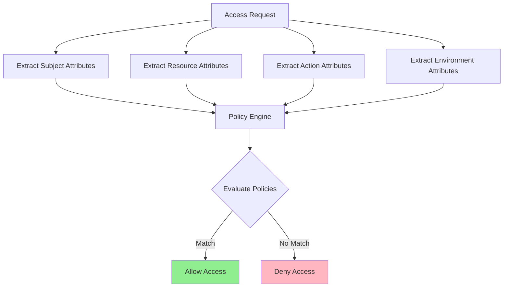

# Attribute-Based Access Control (ABAC)

## Overview

Attribute-Based Access Control (ABAC) is an authorization pattern that makes access decisions based on attributes of the subject, resource, action, and environment. Unlike RBAC, which uses static role assignments, ABAC evaluates multiple attributes in real-time to determine access rights. This provides fine-grained access control that can adapt to complex, dynamic scenarios.

ABAC evaluates policies that combine attributes using logical operators. Policies can consider user attributes (department, clearance level, location), resource attributes (classification, owner, sensitivity), action attributes (operation type), and environmental attributes (time, day, security level). This flexibility enables context-aware access decisions.

The key advantage of ABAC is its ability to handle complex, real-world access scenarios that would be cumbersome to manage with RBAC alone. For example, a user might have access to documents based on their department, the document's classification, the current time, and whether they're accessing from a managed device. ABAC can express these policies naturally.

ABAC is particularly valuable in microservices architectures where access decisions must consider multiple factors across services. The pattern supports dynamic, context-aware access control that can adapt to changing business requirements. Organizations with complex compliance requirements often find ABAC more suitable than RBAC.

### Key Concepts

**Subject Attributes**: Characteristics of the user or entity requesting access. Subject attributes include roles, department, clearance level, location, device type, authentication method, and employment status. These attributes describe who is making the request.

**Resource Attributes**: Characteristics of the resource being accessed. Resource attributes include classification, owner, sensitivity level, creation date, department, department, and access control list. These attributes describe what is being accessed.

**Action Attributes**: Characteristics of the operation being performed. Action attributes include the operation type (read, write, delete, execute), the data being modified, and whether this is a bulk operation. These attributes describe how the resource is being accessed.

**Environment Attributes**: Contextual information about the request. Environmental attributes include time, day, IP address, security level, network, connection type, and device health status. These attributes describe when and where the access is occurring.

**Policy**: A rule that defines access based on attribute combinations. Policies use a subject-action-resource format with conditions. Multiple policies can be combined using logical operators. Policy inheritance and delegation support complex hierarchies.



## Standard Example

The following example demonstrates implementing ABAC in a Node.js microservices environment with attribute extraction, policy evaluation, and middleware for securing endpoints.

```javascript
const express = require('express');
const jwt = require('jsonwebtoken');

const app = express();
app.use(express.json());

const config = {
    jwtSecret: process.env.JWT_SECRET || 'your-secret-key',
};

const policyStore = new Map();

function initializePolicies() {
    policyStore.set('document_read_policy', {
        name: 'document_read_policy',
        description: 'Allow reading documents based on clearance level',
        subject: {
            attributes: ['clearanceLevel', 'department'],
            operators: ['EQUAL', 'GREATER_THAN_OR_EQUAL', 'IN'],
        },
        resource: {
            attributes: ['classification', 'department', 'owner'],
            operators: ['EQUAL', 'LESS_THAN_OR_EQUAL'],
        },
        action: {
            attributes: ['type'],
            operators: ['EQUAL'],
        },
        condition: function(subj, res, action, env) {
            const clearanceLevels = { 'top-secret': 4, 'secret': 3, 'confidential': 2, 'public': 1 };
            const resourceLevel = clearanceLevels[res.classification] || 0;
            return subj.clearanceLevel >= resourceLevel && 
                   (subj.department === res.department || res.owner === subj.userId || subj.clearanceLevel >= 3);
        },
    });
    
    policyStore.set('working_hours_policy', {
        name: 'working_hours_policy',
        description: 'Restrict sensitive operations to working hours',
        subject: {
            attributes: ['employeeType'],
        },
        resource: {
            attributes: ['sensitivity'],
        },
        action: {
            attributes: ['type'],
        },
        environment: {
            attributes: ['hour', 'dayOfWeek'],
        },
        condition: function(subj, res, action, env) {
            if (res.sensitivity === 'high' && action.type === 'write') {
                return env.hour >= 9 && env.hour < 17 && 
                       env.dayOfWeek >= 1 && env.dayOfWeek <= 5;
            }
            return true;
        },
    });
    
    policyStore.set('location_policy', {
        name: 'location_policy',
        description: 'Require specific locations for sensitive data access',
        subject: {
            attributes: ['userType'],
        },
        resource: {
            attributes: ['region'],
        },
        environment: {
            attributes: ['ipRegion', 'ipCountry'],
        },
        condition: function(subj, res, action, env) {
            if (res.region === 'us-east-1' && res.sensitivity === 'high') {
                return env.ipCountry === 'US' || env.ipRegion === res.region;
            }
            return true;
        },
    });
    
    policyStore.set('device_policy', {
        name: 'device_policy',
        description: 'Require managed devices for sensitive operations',
        subject: {
            attributes: ['userId'],
        },
        resource: {
            attributes: ['classification'],
        },
        environment: {
            attributes: ['deviceManaged', 'deviceCompliance'],
        },
        action: {
            attributes: ['type'],
        },
        condition: function(subj, res, action, env) {
            if (res.classification === 'top-secret') {
                return env.deviceManaged === true && env.deviceCompliance === true;
            }
            return env.deviceManaged === true;
        },
    });
}

initializePolicies();

function extractSubjectAttributes(token, envAttributes) {
    return {
        userId: token.sub,
        username: token.username,
        department: token.department || 'general',
        clearanceLevel: token.clearanceLevel || 1,
        employeeType: token.employeeType || 'full-time',
        userType: token.userType || 'employee',
        location: token.location || 'unknown',
    };
}

function extractResourceAttributes(resource) {
    return {
        id: resource.id,
        name: resource.name,
        classification: resource.classification || 'public',
        department: resource.department || 'general',
        owner: resource.owner || 'unknown',
        sensitivity: resource.sensitivity || 'low',
        region: resource.region || 'us-east-1',
    };
}

function extractActionAttributes(action) {
    return {
        type: action,
    };
}

function extractEnvironmentAttributes(req) {
    const now = new Date();
    const ip = req.ip || req.connection.remoteAddress;
    return {
        hour: now.getHours(),
        dayOfWeek: now.getDay(),
        ipAddress: ip,
        ipRegion: 'us-east-1',
        ipCountry: 'US',
        deviceManaged: req.headers['x-device-managed'] === 'true',
        deviceCompliance: req.headers['x-device-compliant'] === 'true',
    };
}

function evaluateAccessRequest(subject, resource, action, environment) {
    const applicablePolicies = Array.from(policyStore.values());
    const decisions = [];
    
    for (const policy of applicablePolicies) {
        try {
            const result = policy.condition(subject, resource, action, environment);
            decisions.push({
                policy: policy.name,
                decision: result ? 'ALLOW' : 'DENY',
            });
        } catch (error) {
            decisions.push({
                policy: policy.name,
                decision: 'DENY',
                error: error.message,
            });
        }
    }
    
    const hasDeny = decisions.some(d => d.decision === 'DENY' && decisions.some(other => 
        other.policy !== d.policy && other.decision === 'ALLOW'));
    
    if (hasDeny) {
        return { allowed: false, decisions, reason: 'One or more policies denied access' };
    }
    
    const hasAllowed = decisions.some(d => d.decision === 'ALLOW');
    
    return {
        allowed: hasAllowed,
        decisions,
        reason: hasAllowed ? 'Access granted by policies' : 'No matching policy allowed access',
    };
}

function abacMiddleware(resourceGetter, actionType) {
    return (req, res, next) => {
        const authHeader = req.headers.authorization;
        
        if (!authHeader || !authHeader.startsWith('Bearer ')) {
            return res.status(401).json({ error: 'Missing or invalid authorization header' });
        }
        
        const token = authHeader.substring(7);
        
        try {
            const decoded = jwt.verify(token, config.jwtSecret);
            
            const resource = resourceGetter(req);
            const environment = extractEnvironmentAttributes(req);
            const subject = extractSubjectAttributes(decoded, environment);
            const resourceAttrs = extractResourceAttributes(resource);
            const actionAttrs = extractActionAttributes(actionType || req.method.toLowerCase());
            
            const decision = evaluateAccessRequest(subject, resourceAttrs, actionAttrs, environment);
            
            if (!decision.allowed) {
                return res.status(403).json({
                    error: 'Access denied',
                    reason: decision.reason,
                    decisions: decision.decisions,
                });
            }
            
            req.accessDecision = decision;
            req.subject = subject;
            req.resource = resourceAttrs;
            
            next();
        } catch (error) {
            return res.status(401).json({ error: 'Invalid or expired token' });
        }
    };
}

app.get('/auth/login', (req, res) => {
    const { username, password } = req.body;
    
    const userDb = {
        'alice': { id: 'user-1', password: 'password123', department: 'engineering', clearanceLevel: 3 },
        'bob': { id: 'user-2', password: 'password123', department: 'sales', clearanceLevel: 2 },
        'charlie': { id: 'user-3', password: 'password123', department: 'hr', clearanceLevel: 1 },
    };
    
    const user = userDb[username];
    if (!user || password !== 'password123') {
        return res.status(401).json({ error: 'Invalid credentials' });
    }
    
    const token = jwt.sign(
        {
            sub: user.id,
            username: user.username,
            department: user.department,
            clearanceLevel: user.clearanceLevel,
            employeeType: 'full-time',
        },
        config.jwtSecret,
        { expiresIn: '1h' }
    );
    
    res.json({ token: token, user: { id: user.id, username: username, department: user.department } });
});

app.get('/documents/:id', abacMiddleware(
    (req) => ({ id: req.params.id, classification: 'public', department: 'general', owner: 'unknown', sensitivity: 'low', region: 'us-east-1' }),
    'read'
), (req, res) => {
    res.json({ id: req.params.id, title: 'Sample Document', content: 'Important content' });
});

app.post('/documents', abacMiddleware(
    (req) => ({ id: 'new', classification: 'confidential', department: req.body.department, owner: req.user.sub, sensitivity: 'medium', region: 'us-east-1' }),
    'write'
), (req, res) => {
    res.status(201).json({ id: 'doc-new', title: req.body.title });
});

app.delete('/documents/:id', abacMiddleware(
    (req) => ({ id: req.params.id, classification: 'secret', department: 'engineering', owner: 'user-1', sensitivity: 'high', region: 'us-east-1' }),
    'delete'
), (req, res) => {
    res.json({ success: true, message: `Document ${req.params.id} deleted` });
});

app.get('/abac/policies', (req, res) => {
    res.json({ policies: Array.from(policyStore.values()).map(p => ({ name: p.name, description: p.description })) });
});

app.post('/abac/evaluate', (req, res) => {
    const { subject, resource, action, environment } = req.body;
    
    const decision = evaluateAccessRequest(
        subject,
        resource,
        action,
        environment
    );
    
    res.json(decision);
});

const PORT = process.env.PORT || 3000;
app.listen(PORT, () => {
    console.log(`ABAC service running on port ${PORT}`);
});

module.exports = app;
```

## Real-World Examples

### AWS ABAC Implementation

AWS uses ABAC principles through IAM policies that can evaluate resource tags. This enables fine-grained access control based on attributes such as cost center, project, and environment. AWS ABAC is particularly useful for organizations with multiple teams sharing resources.

```javascript
const { IAMClient, PutUserPolicyCommand, CreateUserCommand } = require('@aws-sdk/client-iam');

const iamClient = new IAMClient({ region: process.env.AWS_REGION || 'us-east-1' });

async function createAttributeBasedPolicy(policyName, tagKeys) {
    const policyDocument = {
        Version: '2012-10-17',
        Statement: [
            {
                Effect: 'Allow',
                Action: [
                    'ec2:Describe*',
                    's3:GetObject',
                    's3:ListBucket',
                ],
                Resource: '*',
                Condition: {
                    StringEquals: {
                        'aws:RequestTag/${tagKeys[0]}': ['${aws:PrincipalTag/' + tagKeys[0] + '}'],
                    },
                },
            },
            {
                Effect: 'Allow',
                Action: [
                    's3:CreateBucket',
                    's3:PutBucketTagging',
                ],
                Resource: 'arn:aws:s3:::*',
                Condition: {
                    StringEquals: {
                        'aws:RequestTag/${tagKeys[0]}': ['${aws:PrincipalTag/' + tagKeys[0] + '}'],
                        'aws:RequestTag/${tagKeys[1]}': ['${aws:PrincipalTag/' + tagKeys[1] + '}'],
                    },
                },
            },
        ],
    };
    
    return policyDocument;
}

async function assignTagToUser(username, tags) {
    for (const [key, value] of Object.entries(tags)) {
        try {
            await iamClient.send(new PutUserPolicyCommand({
                UserName: username,
                PolicyName: `tag-${key}`,
                PolicyDocument: JSON.stringify({
                    Version: '2012-10-17',
                    Statement: [{
                        Effect: 'Allow',
                        Action: ['iam:PutUserPermissions'],
                        Resource: `arn:aws:iam::*:user/${username}`,
                        Condition: {
                            StringEquals: {
                                `aws:RequestTag/${key}`: value,
                            },
                        },
                    }]),
                }),
            }));
        } catch (error) {
            console.error(`Failed to assign tag ${key}:`, error);
        }
    }
}

async function checkAccessWithTags(principalTags, resourceTags, requiredTags) {
    for (const [key, value] of Object.entries(requiredTags)) {
        if (principalTags[key] !== value && principalTags[key] !== resourceTags[key]) {
            return { allowed: false, reason: `Tag ${key} mismatch` };
        }
    }
    return { allowed: true };
}

module.exports = {
    createAttributeBasedPolicy,
    assignTagToUser,
    checkAccessWithTags,
};
```

### Open Policy Agent Implementation

Open Policy Agent (OPA) provides a general-purpose policy engine that implements ABAC principles. OPA policies are written in Rego, a declarative language that can evaluate complex attribute combinations. OPA integrates with APIs, Kubernetes, and other systems.

```javascript
const express = require('express');
const axios = require('axios');

const app = express();
app.use(express.json());

const opaUrl = process.env.OPA_URL || 'http://localhost:8181';

const abacPolicy = `
package authz

default allow = false

allow {
    input.subject.clearanceLevel >= input.resource.requiredLevel
    input.subject.department == input.resource.department
    input.action.type == "read"
}

allow {
    input.subject.clearanceLevel >= 4
    input.action.type == "write"
    input.environment.withinWorkingHours
}

deny {
    input.subject.clearanceLevel < input.resource.requiredLevel
}{
    "message": "Insufficient clearance level"
}

deny {
    input.subject.department != input.resource.department
    input.subject.clearanceLevel < 3
}{
    "message": "Cross-department access not allowed"
}
`;

async function evaluateWithOPA(input) {
    try {
        const response = await axios.post(`${opaUrl}/v1/data/authz`, { input: input });
        return response.data.result;
    } catch (error) {
        console.error('OPA evaluation error:', error);
        return { allow: false, deny: [{ message: 'Policy evaluation error' }] };
    }
}

app.post('/api/documents', async (req, res) => {
    const { subject, resource, action, environment } = req.body;
    
    const input = {
        subject: subject,
        resource: resource,
        action: action,
        environment: environment,
    };
    
    const decision = await evaluateWithOPA(input);
    
    if (!decision.allow) {
        return res.status(403).json({
            allowed: false,
            reason: decision.deny,
        });
    }
    
    res.json({ allowed: true, data: 'Document created' });
});

function createOPAMiddleware() {
    return async (req, res, next) => {
        const authHeader = req.headers.authorization;
        
        if (!authHeader) {
            return res.status(401).json({ error: 'Missing authorization header' });
        }
        
        const input = {
            subject: req.user,
            resource: req.resource,
            action: { type: req.method },
            environment: { withinWorkingHours: true },
        };
        
        const decision = await evaluateWithOPA(input);
        
        if (!decision.allow) {
            return res.status(403).json({ allowed: false });
        }
        
        next();
    };
}

module.exports = app;
```

### Keycloak ABAC Implementation

Keycloak provides fine-grained authorization through its Authorization Services. Policies can be based on user attributes, resource attributes, and environment conditions. Keycloak supports JavaScript policies for custom attribute evaluation.

```javascript
const Keycloak = require('keycloak-connect');

const keycloak = new Keycloak({}, {
    'realm': process.env.KEYCLOAK_REALM,
    'auth-server-url': process.env.KEYCLOAK_URL,
    'ssl-required': 'external',
    'resource': process.env.KEYCLOAK_CLIENT_ID,
    'credentials': {
        'secret': process.env.KEYCLOAK_CLIENT_SECRET,
    },
});

const grantManager = keycloak.grantManager;

function createResourceAttributes(document) {
    return {
        'urn:document:classification': document.classification,
        'urn:document:department': document.department,
        'urn:document:owner': document.owner,
        'urn:document:sensitivity': document.sensitivity,
    };
}

function evaluatePermissions(token, resource, action) {
    const resource_attrs = createResourceAttributes(resource);
    
    const conditions = [];
    
    if (resource_attrs['urn:document:sensitivity'] === 'high') {
        conditions.push(token.clearanceLevel >= 3);
    }
    
    if (resource_attrs['urn:document:department'] !== token.department) {
        conditions.push(token.clearanceLevel >= 4);
    }
    
    return conditions.every(c => c);
}

async function checkAccess(username, resource, action) {
    try {
        const access = await keycloak.grantManager.obtainDirectly(username);
        
        if (!access || !access.access_token) {
            return { allowed: false, reason: 'No valid token' };
        }
        
        const decoded = keycloak.grantManager.store.decode(access.access_token);
        const hasPermission = evaluatePermissions(decoded.content, resource, action);
        
        return { allowed: hasPermission };
    } catch (error) {
        console.error('Keycloak access check error:', error);
        return { allowed: false, reason: error.message };
    }
}

module.exports = {
    keycloak,
    evaluatePermissions,
    checkAccess,
};
```

## Output Statement

Attribute-Based Access Control provides unparalleled flexibility for implementing fine-grained, context-aware access decisions in microservices architectures. ABAC enables organizations to express complex authorization policies that consider multiple attributes including user characteristics, resource properties, action types, and environmental conditions. The pattern adapts well to changing business requirements and compliance obligations. Organizations should implement ABAC when they require access decisions based on attributes beyond static roles, dynamic policies, or granular control over sensitive resources.

## Best Practices

**Define Clear Attribute Taxonomy**: Establish a consistent naming convention and schema for all attributes across the system. Document each attribute's meaning, allowed values, and source. This ensures that policies can reliably reference attributes and that administrators understand what attributes are available.

**Use Hierarchical Attributes**: Create attribute hierarchies to simplify policy writing. For example, clearance levels should have a clear ordering (public < confidential < secret < top-secret). This allows policies to use comparison operators rather than enumerating all valid values.

**Implement Attribute Sources**: Define authoritative sources for each attribute type. User attributes should come from the identity provider, resource attributes from the resource metadata, and environmental attributes from the request context. Avoid allowing clients to provide attributes that should come from system sources.

**Write Simple Policies First**: Start with simple, readable policies and add complexity only when needed. Use policy modules that can be tested independently. This makes debugging easier and ensures that policies behave as expected.

**Implement Policy Testing**: Test policies with various attribute combinations before deployment. Create test cases that cover both positive and negative scenarios. Include edge cases and boundary conditions.

**Monitor Policy Decisions**: Log policy decisions for auditing and debugging. Track which policies are being evaluated and what decisions are being made. Use this data to identify policy issues and optimize performance.

**Separate Policy Creation from Deployment**: Use a change management process for policies. Test policies in a staging environment before production deployment. Implement rollback procedures in case policies cause issues.

**Use Attribute Encryption for Sensitive Data**: Encrypt sensitive attribute values in transit and at rest. Use secure transmission protocols for attribute exchange between services. Consider tokenization for highly sensitive attributes.