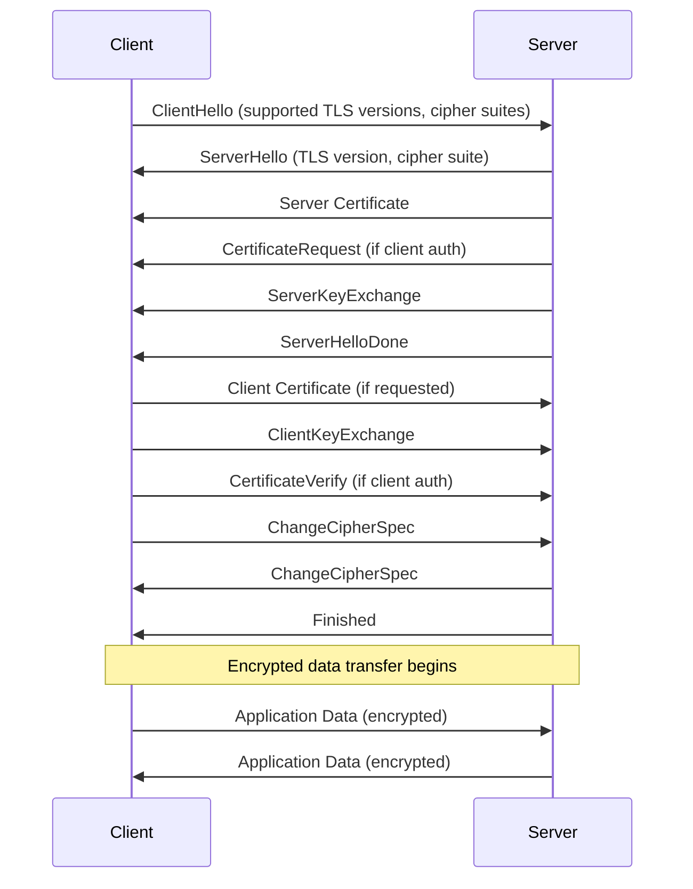

# TLS/SSL Encryption

## Overview

Transport Layer Security (TLS) and its predecessor Secure Sockets Layer (SSL) are cryptographic protocols that provide secure communication over a computer network. TLS encrypts data in transit between clients and servers, preventing eavesdropping, tampering, and message forgery. In microservices architectures, TLS is essential for securing all inter-service communication and external API connections.

TLS operates between the application layer and the transport layer, providing confidentiality, integrity, and authentication. The protocol uses asymmetric cryptography for key exchange and symmetric encryption for data protection. TLS certificates enable clients to verify server identity, ensuring that communication occurs with the intended service rather than an imposter.

Modern TLS (version 1.2 and 1.3) provides strong security guarantees when properly configured. TLS 1.3 simplifies the handshake process, reducing latency while removing vulnerable cipher suites. Organizations should禁用 legacy protocols (SSL 3.0, TLS 1.0, TLS 1.1) and configure servers to use only current TLS versions with strong cipher suites.

### Key Concepts

**Certificate Authority (CA)**: A trusted entity that issues digital certificates verifying the identity of servers and services. Certificate authorities form a trust chain from root CAs through intermediate CAs to end-entity certificates. Popular public CAs include Let's Encrypt, DigiCert, and Comodo.

**Certificate Chain**: A sequence of certificates where each certificate is signed by the next certificate in the chain. The chain starts with the server certificate and ends with a root CA certificate. Clients validate the chain to establish trust.

**Cipher Suites**: A combination of algorithms used in TLS connections. Each cipher suite specifies the key exchange algorithm, bulk encryption algorithm, and message authentication code (MAC) algorithm. Strong cipher suites use AES-256 for encryption and SHA-256 or better for authentication.

**Handshake Process**: The initial negotiation between client and server that establishes TLS parameters. The handshake includes certificate exchange, key agreement, cipher suite negotiation, and optional client authentication.



## Standard Example

The following example demonstrates implementing TLS in a Node.js microservices environment with certificate generation, server configuration, and mutual TLS setup.

```javascript
const https = require('https');
const http = require('http');
const tls = require('tls');
const fs = require('fs');
const path = require('path');
const express = require('express');
const axios = require('axios');

const app = express();
app.use(express.json());

const config = {
    tlsPort: 8443,
    httpPort: 8080,
    certDir: process.env.CERT_DIR || './certs',
    minTlsVersion: 'TLSv1.2',
};

function loadTLSCredentials() {
    const credentials = {
        key: fs.readFileSync(path.join(config.certDir, 'server.key')),
        cert: fs.readFileSync(path.join(config.certDir, 'server.crt')),
        ca: fs.readFileSync(path.join(config.certDir, 'ca.crt')),
        requestCert: false,
        rejectUnauthorized: true,
    };
    
    const certChain = fs.readFileSync(path.join(config.certDir, 'server-chain.crt'));
    if (certChain) {
        credentials.ca = credentials.ca ? Buffer.concat([credentials.ca, certChain]) : certChain;
    }
    
    return credentials;
}

function createSecureServerOptions() {
    return {
        key: fs.readFileSync(path.join(config.certDir, 'server.key')),
        cert: fs.readFileSync(path.join(config.certDir, 'server.crt')),
        ca: [
            fs.readFileSync(path.join(config.certDir, 'ca.crt')),
        ],
        requestCert: false,
        rejectUnauthorized: true,
        minVersion: tls.constants[config.minTlsVersion] || tls.constants.TLSv1_2,
        maxVersion: tls.constants.TLSv1_3,
        ciphers: [
            'TLS_AES_256_GCM_SHA384',
            'TLS_CHACHA20_POLY1305_SHA256',
            'TLS_AES_128_GCM_SHA256',
            'ECDHE-RSA-AES256-GCM-SHA384',
            'ECDHE-RSA-AES128-GCM-SHA256',
        ].join(':'),
        honorCipherOrder: true,
        sessionTimeout: 300,
        ticketKeys: Buffer.from(process.env.TICKET_KEY || 'default-ticket-key-32-bytes!!', 'utf8'),
        earlyData: true,
    };
}

function createHTTPSServer(app, options) {
    return https.createServer(options, app);
}

function createMutualTLSServerOptions(clientCertDir) {
    return {
        key: fs.readFileSync(path.join(config.certDir, 'server.key')),
        cert: fs.readFileSync(path.join(config.certDir, 'server.crt')),
        ca: fs.readFileSync(path.join(config.certDir, 'ca.crt')),
        requestCert: true,
        rejectUnauthorized: true,
        minVersion: tls.constants.TLSv1_2,
        maxVersion: tls.constants.TLSv1_3,
        ciphers: [
            'TLS_AES_256_GCM_SHA384',
            'TLS_CHACHA20_POLY1305_SHA256',
            'ECDHE-RSA-AES256-GCM-SHA384',
        ].join(':'),
        verifyClient: 'request',
        verifyCallback: (verified, cert) => {
            if (!verified) {
                console.error('Certificate verification failed:', verified.error);
                return false;
            }
            
            if (!cert || !cert.subject) {
                console.error('No certificate provided');
                return false;
            }
            
            console.log('Client authenticated:', cert.subject.CN);
            return true;
        },
    };
}

app.get('/api/health', (req, res) => {
    const tlsSocket = req.socket;
    const isSecure = tlsSocket.encrypted;
    const protocol = tlsSocket.getProtocol ? tlsSocket.getProtocol() : 'unknown';
    const cipher = tlsSocket.getCipher ? tlsSocket.getCipher() : null;
    
    res.json({
        status: 'healthy',
        security: {
            encrypted: isSecure,
            protocol: protocol,
            cipher: cipher ? cipher.name : null,
            bits: cipher ? cipher.bits : null,
        },
        timestamp: new Date().toISOString(),
    });
});

app.get('/api/secure-data', (req, res) => {
    const cert = req.socket.getPeerCertificate();
    const clientInfo = cert.subject ? {
        cn: cert.subject.CN,
        o: cert.subject.O,
        ou: cert.subject.OU,
    } : null;
    
    res.json({
        data: 'This is sensitive data',
        client: clientInfo,
        encryption: 'AES-256-GCM',
        timestamp: new Date().toISOString(),
    });
});

app.post('/api/proxy', async (req, res) => {
    const { targetUrl, method = 'GET', headers = {}, body } = req.body;
    
    try {
        const response = await axios({
            method: method,
            url: targetUrl,
            headers: {
                'X-Forwarded-Protocol': 'https',
                'X-Client-Cert': req.socket.getPeerCertificate().subject?.CN || '',
                ...headers,
            },
            data: body,
            httpsAgent: new https.Agent({
                key: fs.readFileSync(path.join(config.certDir, 'client.key')),
                cert: fs.readFileSync(path.join(config.certDir, 'client.crt')),
                ca: fs.readFileSync(path.join(config.certDir, 'ca.crt')),
                rejectUnauthorized: true,
            }),
        });
        
        res.json({
            status: response.status,
            data: response.data,
        });
    } catch (error) {
        res.status(500).json({
            error: 'Proxy request failed',
            message: error.message,
        });
    }
});

function startServers() {
    const secureOptions = createSecureServerOptions();
    const httpsServer = createHTTPSServer(app, secureOptions);
    
    httpsServer.listen(config.tlsPort, () => {
        console.log(`HTTPS server running on port ${config.tlsPort}`);
        console.log(`TLS version: ${config.minTlsVersion}+`);
    });
    
    function redirectHttpToHttps(req, res) {
        const host = req.headers.host.replace(/:\d+/, `:${config.tlsPort}`);
        res.redirect(`https://${host}${req.url}`);
    }
    
    const httpServer = http.createServer(redirectHttpToHttps);
    httpServer.listen(config.httpPort, () => {
        console.log(`HTTP server running on port ${config.httpPort} (redirects to HTTPS)`);
    });
}

if (require.main === module) {
    startServers();
}

function createTLSContext(serviceName) {
    return tls.createSecureContext({
        key: fs.readFileSync(path.join(config.certDir, `${serviceName}.key`)),
        cert: fs.readFileSync(path.join(config.certDir, `${serviceName}.crt`)),
        ca: fs.readFileSync(path.join(config.certDir, 'ca.crt')),
    });
}

function verifyCertificate(cert, certDir) {
    const caCert = fs.readFileSync(path.join(certDir, 'ca.crt'));
    const certChain = [
        fs.readFileSync(path.join(certDir, 'server.crt')),
        fs.readFileSync(path.join(certDir, 'intermediate.crt')),
    ];
    
    const verified = tls.checkServerIdentity(cert.host, cert, caCert, certChain);
    if (verified) {
        return { valid: true };
    }
    return { valid: false, error: verified };
}

function getCertificateInfo(socket) {
    const cert = socket.getPeerCertificate();
    if (!cert || !cert.subject) {
        return null;
    }
    
    return {
        subject: {
            commonName: cert.subject.CN,
            organization: cert.subject.O,
            organizationalUnit: cert.subject.OU,
        },
        issuer: {
            commonName: cert.issuer.CN,
            organization: cert.issuer.O,
        },
        validFrom: cert.valid_from,
        validTo: cert.valid_to,
        fingerprint: cert.fingerprint256 || cert.fingerprint,
        isExpired: new Date(cert.valid_to) < new Date(),
    };
}

module.exports = {
    app,
    createSecureServerOptions,
    createMutualTLSServerOptions,
    createTLSContext,
    verifyCertificate,
    getCertificateInfo,
    startServers,
};

## Real-World Examples

### Istio TLS Configuration

Istio service mesh provides automatic TLS encryption for all service-to-service communication. Istio can operate in PERMISSIVE mode (allowing both plain text and TLS) or STRICT mode (requiring TLS for all traffic).

```yaml
apiVersion: networking.istio.io/v1beta1
kind: DestinationRule
metadata:
  name: reviews-dr
spec:
  host: reviews
  trafficPolicy:
    tls:
      mode: ISTIO_MUTUAL
      clientCertificate: /etc/certs/cert-chain.pem
      privateKey: /etc/certs/key.pem
      caCertificates: /etc/certs/root-cert.pem
      subjectAltNames:
        - reviews.svc.namespace.svc.cluster.local
      sni: reviews.svc.namespace.svc.cluster.local
---
apiVersion: security.istio.io/v1beta1
kind: PeerAuthentication
metadata:
  name: default
spec:
  mtls:
    mode: STRICT
```

The PeerAuthentication resource with STRICT mode enforces mTLS for all incoming connections. The DestinationRule configures TLS settings for outgoing connections to the reviews service.

### AWS Application Load Balancer TLS

AWS ALB provides built-in TLS termination with certificate management through AWS Certificate Manager.

```javascript
const { ELBv2Client, CreateListenerCommand, CreateTargetGroupCommand } = require('@aws-sdk/client-elbv2');

const elbClient = new ELBv2Client({ region: 'us-east-1' });

async function createHTTPSListener(albArn, certificateArn) {
    const listenerConfig = {
        LoadBalancerArn: albArn,
        Protocol: 'HTTPS',
        Port: 443,
        DefaultActions: [{
            Type: 'forward',
            TargetGroupArn: 'arn:aws:elasticloadbalancing:us-east-1:123456789012:targetgroup/my-targets/abc123',
        }],
        SSLPolicy: 'ELBSecurityPolicy-2016-08',
        Certificates: [{
            CertificateArn: certificateArn,
        }],
    };
    
    const command = new CreateListenerCommand(listenerConfig);
    return elbClient.send(command);
}

const sslPolicies = [
    'ELBSecurityPolicy-2016-08',
    'ELBSecurityPolicy-TLS-1-2-2017-01',
    'ELBSecurityPolicy-TLS-1-3-2019-08',
    'ELBSecurityPolicy-FS-2018-06',
    'ELBSecurityPolicy-FS-1-2-2019-08',
    'ELBSecurityPolicy-FS-1-2-Res-2019-08',
];

async function getSSLPolicies() {
    return sslPolicies.map(policy => ({
        name: policy,
        tlsVersion: policy.includes('TLS-1-3') ? '1.3' : '1.2',
        forwardSecrecy: policy.includes('FS'),
    }));
}
```

AWS ALB supports TLS 1.3 with forward secrecy. The `ELBSecurityPolicy-TLS-1-3-2019-08` policy enables the latest TLS version with strong cipher suites.

## Output Statement

TLS encryption is the foundational security layer for microservices communication, providing confidentiality, integrity, and server authentication. By encrypting all data in transit, TLS prevents eavesdropping, man-in-the-middle attacks, and data tampering. Organizations should implement TLS for all internal and external communications, with TLS 1.3 as the preferred version. For sensitive microservices architectures, mTLS provides additional protection by requiring mutual authentication. Regular certificate rotation, strong cipher suites, and proper certificate chain validation are essential for maintaining TLS security over time.

## Best Practices

**Use TLS 1.3**: TLS 1.3 provides improved security and performance compared to TLS 1.2. It removes vulnerable cipher suites and simplifies the handshake process, reducing latency. Enable TLS 1.3 and disable legacy protocols.

**Implement Certificate Pinning**: Pin the certificates or public keys that your services trust. This prevents attackers from using fraudulent certificates issued by compromised CAs. Implement backup pins for certificate rotation.

**Rotate Certificates Regularly**: Establish automated certificate renewal processes to prevent expired certificates from causing service disruptions. Use short-lived certificates (90 days or less) where possible.

**Use Strong Cipher Suites**: Configure servers to use only strong cipher suites that provide forward secrecy. Disable cipher suites that use CBC mode or are vulnerable to attacks like BEAST or Lucky Thirteen.

**Validate Certificate Chains**: Always validate the complete certificate chain up to the root CA. Check certificate expiration, revocation status, and hostname matching.

**Use HSTS**: Enable HTTP Strict Transport Security to ensure browsers always use HTTPS connections. This prevents protocol downgrade attacks and cookie hijacking.

**Monitor Certificate Expiration**: Implement monitoring for certificate expiration dates. Set up alerts for certificates expiring within 30 days and have automated renewal processes ready.
