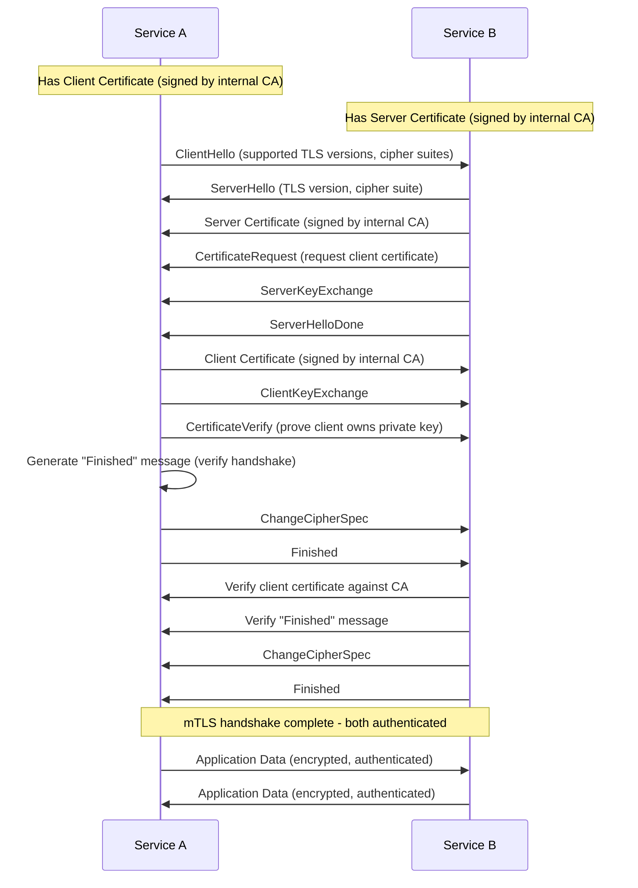

# Mutual TLS (mTLS) Pattern

## Overview

Mutual TLS (mTLS) extends standard TLS by requiring both client and server to present certificates for authentication. While traditional TLS only verifies the server's identity, mTLS ensures that both parties in a communication channel are authenticated before establishing a secure connection. This pattern is fundamental to zero-trust security architectures in microservices environments.

In mTLS, both the client and server possess certificates issued by a trusted Certificate Authority. During the TLS handshake, each party presents its certificate, and the other party verifies it against its trusted CA store. This bidirectional authentication provides strong identity verification for all service-to-service communications, eliminating the risk of unauthorized services connecting to your infrastructure.

mTLS is particularly valuable in microservices architectures where services communicate across network boundaries that may not be fully trusted. Even if an attacker gains access to the network, they cannot communicate with services without a valid certificate issued by the organization's CA. This defense-in-depth approach significantly reduces the attack surface of distributed systems.

### Key Concepts

**Client Certificate**: A digital certificate presented by the client during the TLS handshake. The client certificate contains the client's identity information and is signed by a trusted CA. Server applications verify the client certificate to authenticate the calling service.

**Server Certificate**: A digital certificate presented by the server during the TLS handshake. Similar to client certificates, server certificates are issued by a trusted CA and contain the server's identity. Client applications verify the server certificate to ensure they are connecting to the legitimate service.

**Certificate Authority (CA)**: The trusted entity that issues certificates for both clients and servers. Organizations typically operate an internal PKI for issuing mTLS certificates. The CA certificate must be distributed to all services that need to verify peer certificates.

**Certificate Validation**: The process of verifying that a presented certificate is valid, not expired, and signed by a trusted CA. Validation includes checking the certificate chain, revocation status, and hostname/certificate name matching.



## Standard Example

The following example demonstrates implementing mTLS in a Node.js microservices environment with certificate management, mutual authentication configuration, and service-to-service communication.

```javascript
const https = require('https');
const tls = require('tls');
const fs = require('fs');
const path = require('path');
const express = require('express');
const axios = require('axios');

const app = express();
app.use(express.json());

const config = {
    tlsPort: 8443,
    certDir: process.env.CERT_DIR || './certs',
    caPath: path.join(process.env.CERT_DIR || './certs', 'ca.crt'),
    clientCertPath: path.join(process.env.CERT_DIR || './certs', 'client.crt'),
    clientKeyPath: path.join(process.env.CERT_DIR || './certs', 'client.key'),
};

const trustedCALoaded = fs.readFileSync(config.caPath);

function createMTLSServerOptions() {
    return {
        key: fs.readFileSync(path.join(config.certDir, 'server.key')),
        cert: fs.readFileSync(path.join(config.certDir, 'server.crt')),
        ca: trustedCALoaded,
        requestCert: true,
        rejectUnauthorized: true,
        minVersion: tls.constants.TLSv1_2,
        maxVersion: tls.constants.TLSv1_3,
        ciphers: [
            'TLS_AES_256_GCM_SHA384',
            'TLS_CHACHA20_POLY1305_SHA256',
            'TLS_AES_128_GCM_SHA256',
            'ECDHE-RSA-AES256-GCM-SHA384',
            'ECDHE-RSA-AES128-GCM-SHA256',
        ].join(':'),
        verifyClient: 'request',
        verifyCallback: (verified, cert) => {
            if (!verified) {
                console.error('Client certificate verification failed:', verified.error);
                return false;
            }
            
            if (!cert || !cert.subject) {
                console.error('No client certificate provided');
                return false;
            }
            
            const cn = cert.subject.CN;
            const o = cert.subject.O;
            console.log(`Client authenticated: CN=${cn}, Org=${o}`);
            
            return true;
        },
        honorsSingleSession: true,
    };
}

function createMTLSClientOptions(serviceName) {
    return {
        key: fs.readFileSync(path.join(config.certDir, `${serviceName}.key`)),
        cert: fs.readFileSync(path.join(config.certDir, `${serviceName}.crt`)),
        ca: trustedCALoaded,
        requestCert: true,
        rejectUnauthorized: true,
        minVersion: tls.constants.TLSv1_2,
        maxVersion: tls.constants.TLSv1_3,
        ciphers: [
            'TLS_AES_256_GCM_SHA384',
            'TLS_CHACHA20_POLY1305_SHA256',
            'ECDHE-RSA-AES256-GCM-SHA384',
        ].join(':'),
        checkServerIdentity: (hostname, cert) => {
            if (cert.subject.CN !== hostname && cert.subjectaltname !== hostname) {
                const err = new Error(`Certificate hostname mismatch: ${hostname} vs ${cert.subject.CN}`);
                err.code = 'ERR_TLS_CERT_ALTNAME_MISMATCH';
                return err;
            }
            return undefined;
        },
    };
}

function extractClientIdentity(socket) {
    const cert = socket.getPeerCertificate();
    if (!cert || !cert.subject) {
        return null;
    }
    
    return {
        cn: cert.subject.CN || 'unknown',
        o: cert.subject.O || 'unknown',
        ou: cert.subject.OU || 'unknown',
        serialNumber: cert.serialNumber,
        fingerprint: cert.fingerprint256 || cert.fingerprint,
    };
}

function verifyClientCertificate(cert) {
    const errors = [];
    
    if (!cert || !cert.subject) {
        errors.push('Certificate missing or invalid');
        return { valid: false, errors };
    }
    
    const now = new Date();
    const validFrom = new Date(cert.valid_from);
    const validTo = new Date(cert.valid_to);
    
    if (now < validFrom) {
        errors.push('Certificate not yet valid');
    }
    
    if (now > validTo) {
        errors.push('Certificate expired');
    }
    
    if (!cert.subject.CN) {
        errors.push('Certificate missing Common Name');
    }
    
    const validExtensions = ['serverAuth', 'clientAuth'];
    const hasValidExtension = cert.extensions && cert.extensions.some(ext => 
        ext.name && validExtensions.includes(ext.name)
    );
    
    if (!hasValidExtension) {
        errors.push('Certificate missing required extensions');
    }
    
    return {
        valid: errors.length === 0,
        errors,
        identity: extractClientIdentity({ getPeerCertificate: () => cert }),
    };
}

app.use((req, res, next) => {
    if (!req.socket.encrypted) {
        return res.status(400).json({ error: 'TLS required' });
    }
    
    const clientIdentity = extractClientIdentity(req.socket);
    if (!clientIdentity) {
        return res.status(401).json({ error: 'Client certificate required' });
    }
    
    req.clientIdentity = clientIdentity;
    next();
});

app.get('/api/services', (req, res) => {
    res.json({
        services: ['user-service', 'order-service', 'payment-service'],
        client: req.clientIdentity.cn,
    });
});

app.get('/api/secure-call/:target', async (req, res) => {
    const targetService = req.params.target;
    const targetCertPath = path.join(config.certDir, `${targetService}.crt`);
    const targetKeyPath = path.join(config.certDir, `${targetService}.key`);
    
    try {
        const response = await axios.get(`https://${targetService}:8444/api/status`, {
            httpsAgent: new https.Agent({
                key: fs.readFileSync(targetKeyPath),
                cert: fs.readFileSync(targetCertPath),
                ca: trustedCALoaded,
                rejectUnauthorized: true,
            }),
            timeout: 5000,
        });
        
        res.json({
            target: targetService,
            status: response.data,
            calledBy: req.clientIdentity.cn,
        });
    } catch (error) {
        res.status(500).json({
            error: 'Failed to call service',
            message: error.message,
        });
    }
});

app.post('/api/invoke', async (req, res) => {
    const { targetService, method, path: urlPath, data } = req.body;
    
    const targetCertPath = path.join(config.certDir, `${targetService}.key`);
    const targetKeyPath = path.join(config.certDir, `${targetService}.key`);
    
    const agent = new https.Agent({
        key: fs.readFileSync(config.clientKeyPath),
        cert: fs.readFileSync(config.clientCertPath),
        ca: trustedCALoaded,
        rejectUnauthorized: true,
    });
    
    try {
        const response = await axios({
            method: method || 'GET',
            url: `https://${targetService}:8444${urlPath}`,
            data: data,
            httpsAgent: agent,
            timeout: 10000,
        });
        
        res.json({
            success: true,
            response: response.data,
        });
    } catch (error) {
        res.status(500).json({
            success: false,
            error: error.message,
        });
    }
});

function createMTLSClient(serviceName) {
    const options = createMTLSClientOptions(serviceName);
    
    return axios.create({
        httpsAgent: new https.Agent(options),
    });
}

class MTLSServiceClient {
    constructor(serviceName, options = {}) {
        this.serviceName = serviceName;
        this.baseURL = options.baseURL || `https://${serviceName}:8444`;
        this.timeout = options.timeout || 5000;
        
        this.certPath = options.certPath || path.join(config.certDir, `${serviceName}.key`);
        this.keyPath = options.keyPath || path.join(config.certDir, `${serviceName}.key`);
    }
    
    getAgent() {
        return new https.Agent({
            key: fs.readFileSync(this.keyPath),
            cert: fs.readFileSync(this.certPath),
            ca: trustedCALoaded,
            rejectUnauthorized: true,
        });
    }
    
    async request(method, path, data = null, headers = {}) {
        try {
            const response = await axios({
                method: method,
                url: `${this.baseURL}${path}`,
                data: data,
                headers: {
                    'X-Client-CN': this.serviceName,
                    ...headers,
                },
                httpsAgent: this.getAgent(),
                timeout: this.timeout,
            });
            
            return response.data;
        } catch (error) {
            throw new Error(`MTLS call to ${this.serviceName} failed: ${error.message}`);
        }
    }
    
    async get(path, headers = {}) {
        return this.request('GET', path, null, headers);
    }
    
    async post(path, data, headers = {}) {
        return this.request('POST', path, data, headers);
    }
    
    async put(path, data, headers = {}) {
        return this.request('PUT', path, data, headers);
    }
    
    async delete(path, headers = {}) {
        return this.request('DELETE', path, null, headers);
    }
}

app.get('/api/health', (req, res) => {
    res.json({
        status: 'healthy',
        mTLS: 'enabled',
        clientAuth: 'required',
        protocol: req.socket.getProtocol(),
        cipher: req.socket.getCipher()?.name,
    });
});

const server = https.createServer(createMTLSServerOptions(), app);

if (require.main === module) {
    const port = process.env.PORT || 8443;
    server.listen(port, () => {
        console.log(`mTLS server running on port ${port}`);
        console.log(`Client certificate authentication: required`);
    });
}

module.exports = {
    app,
    server,
    createMTLSServerOptions,
    createMTLSClientOptions,
    extractClientIdentity,
    verifyClientCertificate,
    MTLSServiceClient,
    createMTLSClient,
};

## Real-World Examples

### Istio mTLS Configuration

Istio service mesh provides automatic mTLS for all service-to-service communications. Istio can be configured in PERMISSIVE mode (accepting both mTLS and plain text) or STRICT mode (requiring mTLS).

```yaml
apiVersion: security.istio.io/v1beta1
kind: PeerAuthentication
metadata:
  name: default
  namespace: default
spec:
  mtls:
    mode: STRICT
---
apiVersion: networking.istio.io/v1alpha3
kind: DestinationRule
metadata:
  name: product-page-dr
spec:
  host: product-page
  trafficPolicy:
    tls:
      mode: ISTIO_MUTUAL
      clientCertificate: /etc/certs/cert-chain.pem
      privateKey: /etc/certs/key.pem
      caCertificates: /etc/certs/root-cert.pem
```

Istio automatically rotates mTLS certificates using the node agent. The `ISTIO_MUTUAL` mode uses Istio's internal certificate authority for automatic certificate management.

### AWS API Gateway mTLS

AWS API Gateway supports mTLS by integrating with AWS Certificate Manager Private Certificate Authority.

```javascript
const { ApiGatewayClient, CreateDomainNameCommand, CreateUsagePlanCommand } = require('@aws-sdk/client-apigateway');

const apiGatewayClient = new ApiGatewayClient({ region: 'us-east-1' });

async function createMTLSDomain(domainName, certificateArn, trustStoreArn) {
    const domainConfig = {
        domainName: domainName,
        regionalCertificateArn: certificateArn,
        endpointConfiguration: {
            types: ['REGIONAL'],
        },
        securityPolicy: 'TLS_1_2',
        mutualTlsAuthentication: {
            trustStoreUri: trustStoreArn,
            trustStoreVersion: 'VERSION_ID',
        },
    };
    
    return apiGatewayClient.send(new CreateDomainNameCommand(domainConfig));
}

async function validateClientCertificate(trustStoreArn, clientCertificate) {
    return {
        valid: true,
        subject: clientCertificate.subject,
        issuer: clientCertificate.issuer,
        notBefore: clientCertificate.not_valid_before,
        notAfter: clientCertificate.not_valid_after,
    };
}
```

AWS API Gateway mTLS requires a trust store containing CA certificates. Client certificates must be signed by a CA in the trust store.

## Output Statement

Mutual TLS provides strong bidirectional authentication for microservices communication, ensuring that both clients and servers prove their identity through certificates. This pattern is essential for zero-trust security architectures where trust must be established for every connection. mTLS prevents unauthorized services from connecting to your infrastructure even if they have network access. The pattern is particularly valuable in microservices environments where services communicate across untrusted network boundaries. Organizations should implement mTLS for all sensitive service-to-service communications, with automated certificate rotation to maintain security without operational overhead.

## Best Practices

**Use Automated Certificate Management**: Implement automated certificate issuance and rotation using service mesh solutions like Istio or tools like cert-manager. Manual certificate management leads to expiration issues and security gaps.

**Separate CAs for Different Trust Domains**: Use different Certificate Authorities for internal services, external API consumers, and development environments. This limits the impact of CA compromise.

**Implement Certificate Revocation Checking**: Configure services to check certificate revocation lists (CRL) or use Online Certificate Status Protocol (OCSP) for detecting revoked certificates.

**Use Short-Lived Certificates**: Issue certificates with validity periods of 24-72 hours for automated rotation. Short-lived certificates limit the window of opportunity for attackers to use compromised certificates.

**Validate Client Certificate Properties**: Check not just the certificate validity but also its properties. Verify the subject name matches expected service identifiers and that required extensions (like clientAuth) are present.

**Implement Fallback Strategies**: Have clear policies for handling certificate verification failures. Typically, fail closed (deny access) rather than fail open (allow access).

**Monitor Certificate Lifecycle**: Track certificate issuance, rotation, expiration, and revocation. Alert on any anomalies in the certificate lifecycle.