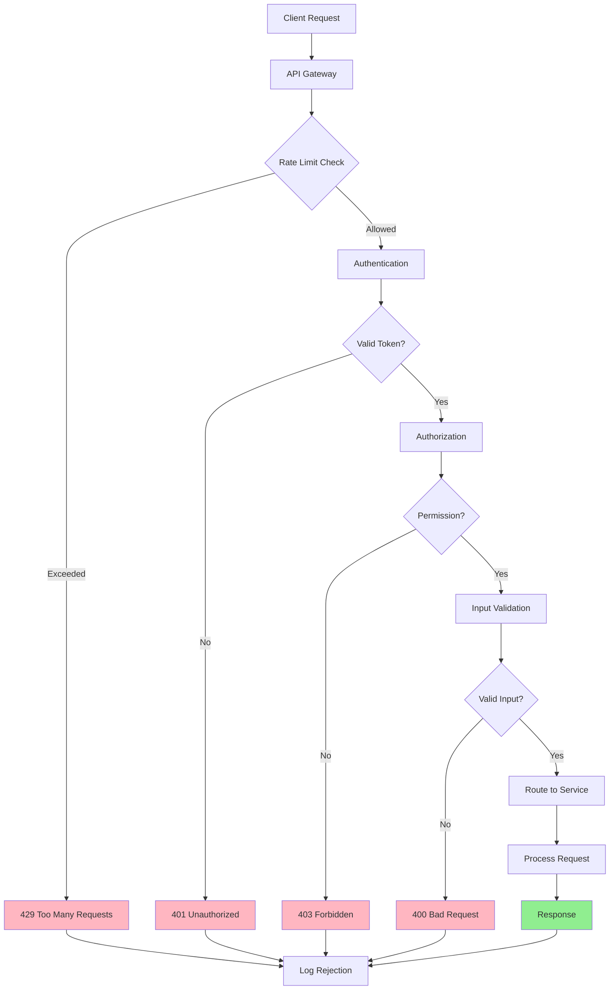

# API Security Patterns

## Overview

API security patterns provide comprehensive protection for Application Programming Interfaces in microservices architectures. APIs serve as the entry points to services and data, making them prime targets for attacks. Effective API security requires multiple layers of defense including authentication, authorization, rate limiting, input validation, and monitoring.

API security in microservices differs from traditional monolithic API security due to the distributed nature of services. Each service may expose multiple APIs, and inter-service communication also needs protection. A holistic approach addresses external API access, service-to-service communication, and internal API surfaces.

Modern API security patterns incorporate industry standards like OAuth 2.0 for authorization, OpenAPI for specification-driven validation, and rate limiting algorithms forDoS protection. API gateways provide a central point for applying security policies, while individual services implement defense-in-depth with their own security measures.

### Key Concepts

**Authentication**: The process of verifying the identity of API consumers. Common methods include API keys, JWT tokens, OAuth 2.0 tokens, and mutual TLS certificates. Each method has different trade-offs regarding security, complexity, and user experience.

**Authorization**: The process of determining what an authenticated caller is permitted to do. Authorization happens after authentication and checks whether the caller has rights to access specific resources or perform specific actions. Implementations include RBAC, ABAC, and policy-based authorization.

**Rate Limiting**: Controlling the number of requests a client can make in a given time period. Rate limiting protects APIs from abuse, preventsDoS attacks, and ensures fair resource allocation. Common algorithms include token bucket, sliding window, and fixed window.

**Input Validation**: Verifying that API requests contain valid data before processing. Input validation prevents injection attacks, data corruption, and unexpected behavior. Validate all parameters, headers, and body content against defined schemas.

**API Gateway**: A server that acts as a single entry point for API requests. API gateways handle cross-cutting concerns like authentication, rate limiting, logging, and routing. Popular options include Kong, AWS API Gateway, and NGINX Plus.



## Standard Example

The following example demonstrates implementing comprehensive API security in a Node.js microservices environment with authentication, authorization, rate limiting, input validation, and security middleware.

```javascript
const express = require('express');
const jwt = require('jsonwebtoken');
const helmet = require('helmet');
const rateLimit = require('express-rate-limit');
const Joi = require('joi');
const crypto = require('crypto');

const app = express();
app.use(express.json());
app.use(helmet());

const config = {
    jwtSecret: process.env.JWT_SECRET || 'your-secret-key',
    apiKeyHeader: 'x-api-key',
    rateLimitWindow: 15 * 60 * 1000,
    rateLimitMax: 100,
};

const apiKeyStore = new Map();
const userRoles = new Map();
const permissions = new Map();

function initializeSecurityData() {
    apiKeyStore.set('api-key-demo-1', {
        key: 'api-key-demo-1',
        service: 'order-service',
        rateLimit: 1000,
        permissions: ['read:orders', 'write:orders'],
        createdAt: new Date('2024-01-01'),
    });
    
    apiKeyStore.set('api-key-demo-2', {
        key: 'api-key-demo-2',
        service: 'payment-service',
        rateLimit: 500,
        permissions: ['read:payments', 'write:payments'],
        createdAt: new Date('2024-01-01'),
    });
    
    permissions.set('read:orders', {
        resource: 'orders',
        action: 'read',
        description: 'Read order data',
    });
    
    permissions.set('write:orders', {
        resource: 'orders',
        action: 'write',
        description: 'Create and update orders',
    });
    
    permissions.set('read:payments', {
        resource: 'payments',
        action: 'read',
        description: 'Read payment data',
    });
    
    permissions.set('write:payments', {
        resource: 'payments',
        action: 'write',
        description: 'Process payments',
    });
}

initializeSecurityData();

const rateLimiter = rateLimit({
    windowMs: config.rateLimitWindow,
    max: config.rateLimitMax,
    message: {
        error: 'Too many requests',
        message: 'Rate limit exceeded. Please try again later.',
        retryAfter: Math.ceil(config.rateLimitWindow / 1000),
    },
    standardHeaders: true,
    legacyHeaders: false,
    keyGenerator: (req) => {
        return req.ip + ':' + (req.apiKey || req.user?.sub || 'anonymous');
    },
    skip: (req) => {
        return req.path === '/api/health' || req.path === '/api/status';
    },
});

const apiKeyLimiter = rateLimit({
    windowMs: 60 * 1000,
    max: 50,
    keyGenerator: (req) => {
        return req.apiKey;
    },
    message: {
        error: 'API key rate limit exceeded',
    },
});

function validateApiKey(req, res, next) {
    const apiKey = req.headers[config.apiKeyHeader];
    
    if (!apiKey) {
        return next();
    }
    
    const keyData = apiKeyStore.get(apiKey);
    if (!keyData) {
        return res.status(401).json({ error: 'Invalid API key' });
    }
    
    req.apiKey = apiKey;
    req.apiKeyData = keyData;
    next();
}

function authenticateJWT(req, res, next) {
    const authHeader = req.headers.authorization;
    
    if (!authHeader) {
        return next();
    }
    
    const token = authHeader.substring(7);
    
    try {
        const decoded = jwt.verify(token, config.jwtSecret);
        req.user = decoded;
        
        const roles = userRoles.get(decoded.sub);
        if (roles) {
            req.user.roles = roles;
        }
        
        next();
    } catch (error) {
        return res.status(401).json({ error: 'Invalid or expired token' });
    }
}

function requireAuthentication(req, res, next) {
    if (!req.user && !req.apiKey) {
        return res.status(401).json({
            error: 'Authentication required',
            message: 'Provide a valid JWT token or API key',
        });
    }
    next();
}

function requireRole(...roles) {
    return (req, res, next) => {
        if (!req.user || !req.user.roles) {
            return res.status(403).json({ error: 'Insufficient permissions' });
        }
        
        const hasRole = req.user.roles.some(role => roles.includes(role));
        
        if (!hasRole) {
            return res.status(403).json({
                error: 'Insufficient role',
                required: roles,
            });
        }
        
        next();
    };
}

function requirePermission(...requiredPermissions) {
    return (req, res, next) => {
        let userPermissions = [];
        
        if (req.apiKeyData) {
            userPermissions = req.apiKeyData.permissions;
        } else if (req.user && req.user.permissions) {
            userPermissions = req.user.permissions;
        }
        
        const hasPermission = requiredPermissions.every(perm => 
            userPermissions.includes(perm)
        );
        
        if (!hasPermission) {
            return res.status(403).json({
                error: 'Insufficient permissions',
                required: requiredPermissions,
                has: userPermissions,
            });
        }
        
        next();
    };
}

function validateInput(schema) {
    return (req, res, next) => {
        const { error, value } = schema.validate(req.body, {
            abortEarly: false,
            stripUnknown: true,
        });
        
        if (error) {
            const errors = error.details.map(detail => ({
                field: detail.path.join('.'),
                message: detail.message,
            }));
            
            return res.status(400).json({
                error: 'Validation failed',
                details: errors,
            });
        }
        
        req.body = value;
        next();
    };
}

const orderSchema = Joi.object({
    customerId: Joi.string().required(),
    items: Joi.array().items(Joi.object({
        productId: Joi.string().required(),
        quantity: Joi.number().integer().min(1).required(),
        price: Joi.number().positive().required(),
    })).min(1).required(),
    shippingAddress: Joi.object({
        street: Joi.string().required(),
        city: Joi.string().required(),
        state: Joi.string().required(),
        zipCode: Joi.string().required(),
        country: Joi.string().required(),
    }).required(),
    paymentMethod: Joi.string().valid('credit_card', 'debit_card', 'paypal').required(),
});

const paymentSchema = Joi.object({
    orderId: Joi.string().required(),
    amount: Joi.number().positive().required(),
    currency: Joi.string().valid('USD', 'EUR', 'GBP').default('USD'),
    cardNumber: Joi.string().creditCard().required(),
    cvv: Joi.string().length(3).pattern(/^\d+$/).required(),
    expiryMonth: Joi.number().integer().min(1).max(12).required(),
    expiryYear: Joi.number().integer().min(2024).required(),
});

function sanitizeInput(req, res, next) {
    for (const key in req.body) {
        if (typeof req.body[key] === 'string') {
            req.body[key] = req.body[key]
                .replace(/[<>]/g, '')
                .trim();
        }
    }
    next();
}

app.use(rateLimiter);
app.use(validateApiKey);
app.use(authenticateJWT);

app.get('/api/health', (req, res) => {
    res.json({
        status: 'healthy',
        timestamp: new Date().toISOString(),
        security: {
            tls: req.socket.encrypted,
            authentication: req.user ? 'jwt' : req.apiKey ? 'api-key' : 'none',
        },
    });
});

app.post('/api/auth/login', (req, res) => {
    const { username, password } = req.body;
    
    const users = {
        'admin': { id: 'user-1', password: 'admin123', roles: ['admin'], permissions: ['*'] },
        'user': { id: 'user-2', password: 'user123', roles: ['user'], permissions: ['read:orders', 'read:payments'] },
        'operator': { id: 'user-3', password: 'operator123', roles: ['operator'], permissions: ['read:orders', 'write:orders', 'read:payments'] },
    };
    
    const user = users[username];
    if (!user || user.password !== password) {
        return res.status(401).json({ error: 'Invalid credentials' });
    }
    
    const token = jwt.sign(
        {
            sub: user.id,
            username: username,
            roles: user.roles,
            permissions: user.permissions,
        },
        config.jwtSecret,
        { expiresIn: '1h' }
    );
    
    userRoles.set(user.id, user.roles);
    
    res.json({
        token: token,
        user: {
            id: user.id,
            username: username,
            roles: user.roles,
        },
    });
});

app.post('/api/orders', 
    requireAuthentication,
    requirePermission('write:orders'),
    validateInput(orderSchema),
    sanitizeInput,
    (req, res) => {
        const order = {
            id: `ORD-${Date.now()}`,
            ...req.body,
            createdBy: req.user?.sub || req.apiKeyData?.service,
            createdAt: new Date().toISOString(),
        };
        
        res.status(201).json({
            success: true,
            order: order,
        });
    }
);

app.get('/api/orders/:id',
    requireAuthentication,
    requirePermission('read:orders'),
    (req, res) => {
        res.json({
            id: req.params.id,
            customerId: 'cust-123',
            status: 'processing',
            total: 199.99,
            createdAt: new Date().toISOString(),
        });
    }
);

app.post('/api/payments',
    requireAuthentication,
    requirePermission('write:payments'),
    validateInput(paymentSchema),
    (req, res) => {
        const payment = {
            id: `PAY-${Date.now()}`,
            orderId: req.body.orderId,
            amount: req.body.amount,
            currency: req.body.currency,
            status: 'processed',
            processedAt: new Date().toISOString(),
        };
        
        res.status(201).json({
            success: true,
            payment: payment,
        });
    }
);

app.get('/api/security/policies', (req, res) => {
    res.json({
        rateLimiting: {
            enabled: true,
            windowMs: config.rateLimitWindow,
            maxRequests: config.rateLimitMax,
        },
        authentication: {
            jwt: { enabled: true, algorithm: 'HS256' },
            apiKey: { enabled: true },
        },
        validation: {
            enabled: true,
            strictMode: true,
        },
    });
});

const PORT = process.env.PORT || 3000;
app.listen(PORT, () => {
    console.log(`API Security server running on port ${PORT}`);
});

module.exports = {
    app,
    requireAuthentication,
    requireRole,
    requirePermission,
    validateInput,
    validateApiKey,
    authenticateJWT,
};

## Real-World Examples

### Kong API Gateway Security

Kong provides comprehensive API security through plugins for authentication, rate limiting, and request transformation.

```yaml
services:
  - name: user-service
    url: http://user-service:8080
    plugins:
      - name: jwt
        config:
          key_claim_name: iss
          claims_verification:
            exp: true
            nbf: true
      - name: rate-limiting
        config:
          minute: 100
          policy: local
          fault_tolerant: true
      - name: cors
        config:
          origins:
            - https://example.com
          methods:
            - GET
            - POST
            - PUT
          headers:
            - Authorization
            - Content-Type
          credentials: true
          max_age: 3600
```

### AWS API Gateway Security

AWS API Gateway provides built-in security features including IAM auth, Lambda authorizers, and usage plans.

```javascript
const { APIGatewayClient, CreateUsagePlanCommand, CreateApiKeyCommand, CreateAuthorizerCommand } = require('@aws-sdk/client-apigateway');

const apiGateway = new APIGatewayClient({ region: 'us-east-1' });

async function createSecureAPI(apiName) {
    const usagePlan = await apiGateway.send(new CreateUsagePlanCommand({
        name: `${apiName}-usage-plan`,
        throttle: {
            rateLimit: 100,
            burstLimit: 50,
        },
        quota: {
            limit: 10000,
            period: 'DAY',
        },
    }));
    
    const apiKey = await apiGateway.send(new CreateApiKeyCommand({
        name: `${apiName}-key`,
        enabled: true,
        stageKeys: [{ restApiId: apiName, stageName: 'prod' }],
    }));
    
    return {
        usagePlanId: usagePlan.id,
        apiKeyId: apiKey.id,
    };
}

async function createLambdaAuthorizer(functionName) {
    return {
        type: 'TOKEN',
        identitySource: 'method.request.header.Authorization',
        authorizerResultTtlInSeconds: 300,
    };
}
```

## Output Statement

API security patterns provide essential protection for microservices by implementing multiple layers of defense against common attacks. Authentication verifies caller identity, authorization controls access to resources, rate limiting prevents abuse, and input validation blocks malicious data. A comprehensive API security strategy addresses both external API access and inter-service communication. Organizations should implement security at the API gateway level for centralized policy enforcement while also adding security measures at the service level for defense-in-depth. Regular security testing and monitoring ensure that security controls remain effective as the system evolves.

## Best Practices

**Implement Defense in Depth**: Apply security controls at multiple layers - API gateway, service mesh, and individual services. This ensures that even if one layer is compromised, others provide protection.

**Use Standard Authentication Methods**: Prefer standardized authentication methods like JWT and OAuth 2.0 over custom solutions. Standards-based approaches have been extensively reviewed and have better tooling support.

**Validate Input at Every Layer**: Never trust input from clients or upstream services. Validate all data at the API boundary and again within each service that processes the data.

**Implement Rate Limiting at Multiple Levels**: Apply rate limiting at the API gateway for external clients, at the service level for internal services, and for specific endpoints that may be more vulnerable to abuse.

**Log Security Events**: Capture authentication failures, authorization denials, rate limit exceeded events, and suspicious patterns. Use this data for security monitoring and incident response.

**Rotate Secrets Regularly**: Implement automated secret rotation for API keys, signing keys, and encryption keys. Short-lived credentials reduce the impact of credential compromise.

**Use HTTPS for All Communication**: Ensure all API traffic uses TLS 1.2 or higher. Implement HSTS to prevent protocol downgrade attacks.
