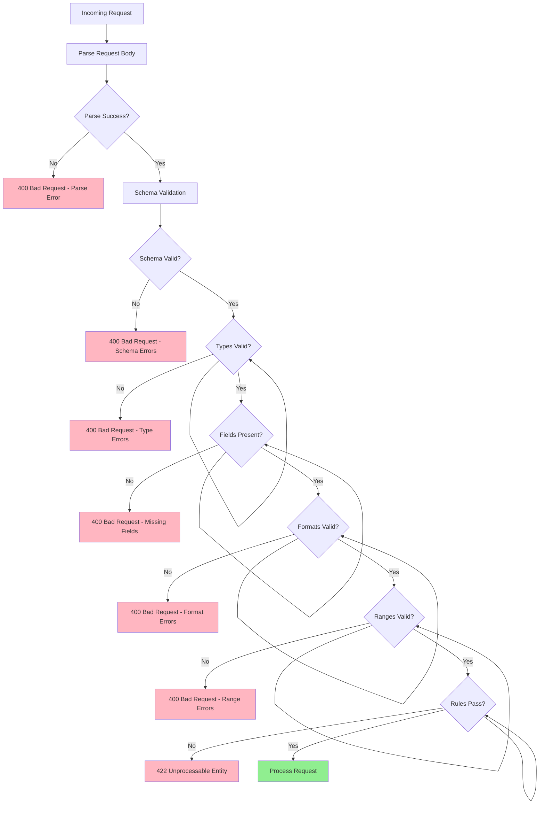

# Request Validation

## Overview

Request validation is the process of verifying that incoming API requests meet expected criteria before processing. This security pattern prevents malicious or malformed data from reaching application logic, protecting against injection attacks, data corruption, and unexpected behavior. In microservices architectures, request validation must be applied consistently across all service endpoints.

Validation should occur as early as possible in the request processing pipeline, ideally at the API gateway or service entry point. This prevents invalid requests from consuming processing resources and reduces the attack surface. Multiple validation layers provide defense-in-depth, with each service validating data relevant to its domain.

Comprehensive request validation checks include data type validation, range validation, format validation, length validation, required field validation, and business rule validation. Each validation failure should return clear, actionable error messages that help clients correct their requests without exposing internal system details.

### Key Concepts

**Schema Validation**: Defining the expected structure of request data using schemas like JSON Schema, OpenAPI specification, or validation libraries like Joi and Zod. Schema validation ensures that required fields are present, data types are correct, and values meet basic constraints.

**Type Validation**: Ensuring that data values match expected data types. Type validation catches issues like sending a string where an integer is expected, or an array where an object is required.

**Range Validation**: Checking that numeric and date values fall within acceptable ranges. Range validation prevents issues like negative quantities, future dates in the past, or values exceeding system limits.

**Format Validation**: Verifying that string values match expected formats such as email addresses, phone numbers, postal codes, URLs, or UUIDs. Format validation uses regular expressions or dedicated validation functions.

**Required Field Validation**: Ensuring that mandatory fields are present and not empty. Required field validation is often the first check in validation pipelines.



## Standard Example

The following example demonstrates implementing comprehensive request validation in a Node.js microservices environment with reusable validators, custom validation rules, and error handling.

```javascript
const express = require('express');
const Joi = require('joi');
const validator = require('validator');

const app = express();
app.use(express.json());

const VALIDATION_ERRORS = [];
const validators = new Map();

function createValidator(name, schema, options = {}) {
    const validatorObj = {
        name,
        schema,
        options: {
            abortEarly: false,
            stripUnknown: true,
            ...options,
        },
        validate: function(data) {
            const result = this.schema.validate(data, this.options);
            return {
                valid: !result.error,
                errors: result.error ? result.error.details.map(d => ({
                    field: d.path.join('.'),
                    message: d.message,
                    type: d.type,
                })) : [],
                value: result.value,
            };
        },
    };
    
    validators.set(name, validatorObj);
    return validatorObj;
}

const commonSchemas = {
    uuid: Joi.string().uuid().required(),
    email: Joi.string().email().required(),
    phone: Joi.string().pattern(/^\+?[1-9]\d{1,14}$/),
    date: Joi.date().iso(),
    positiveInteger: Joi.number().integer().positive(),
    nonEmptyString: Joi.string().trim().min(1).max(500),
    url: Joi.string().uri(),
    isoDateTime: Joi.date().iso(),
};

createValidator('userRegistration', Joi.object({
    email: commonSchemas.email,
    password: Joi.string()
        .min(8)
        .max(128)
        .pattern(/^(?=.*[a-z])(?=.*[A-Z])(?=.*\d)(?=.*[@$!%*?&])[A-Za-z\d@$!%*?&]/)
        .messages({
            'string.pattern.base': 'Password must contain uppercase, lowercase, number, and special character',
        }),
    firstName: commonSchemas.nonEmptyString.max(50),
    lastName: commonSchemas.nonEmptyString.max(50),
    phoneNumber: commonSchemas.phone,
    dateOfBirth: Joi.date().iso().less('now'),
}));

createValidator('orderCreation', Joi.object({
    customerId: commonSchemas.uuid,
    items: Joi.array()
        .items(Joi.object({
            productId: commonSchemas.uuid,
            quantity: Joi.number().integer().min(1).max(1000).required(),
            unitPrice: Joi.number().positive().precision(2).required(),
        }))
        .min(1)
        .max(100)
        .required(),
    shippingAddress: Joi.object({
        street: commonSchemas.nonEmptyString.max(200),
        city: commonSchemas.nonEmptyString.max(100),
        state: Joi.string().length(2).uppercase(),
        postalCode: Joi.string().pattern(/^\d{5}(-\d{4})?$/),
        country: Joi.string().length(3).uppercase(),
    }).required(),
    priority: Joi.string().valid('standard', 'express', 'overnight').default('standard'),
    requestedDeliveryDate: Joi.date().iso().min('now'),
    notes: Joi.string().max(1000).allow('', null),
}));

createValidator('paymentProcessing', Joi.object({
    orderId: commonSchemas.uuid,
    amount: Joi.number().positive().precision(2).min(0.01).max(1000000).required(),
    currency: Joi.string().length(3).uppercase().valid('USD', 'EUR', 'GBP', 'JPY', 'CAD'),
    paymentMethod: Joi.string().valid('credit_card', 'debit_card', 'bank_transfer', 'paypal').required(),
    cardDetails: Joi.object({
        cardNumber: Joi.string().creditCard().required(),
        cvv: Joi.string().length(3).pattern(/^\d+$/).required(),
        expiryMonth: Joi.number().integer().min(1).max(12).required(),
        expiryYear: Joi.number().integer().min(2024).required(),
    }).when('paymentMethod', {
        is: Joi.string().valid('credit_card', 'debit_card'),
        then: Joi.required(),
        otherwise: Joi.forbidden(),
    }),
    billingAddress: Joi.object({
        name: commonSchemas.nonEmptyString.max(100),
        street: commonSchemas.nonEmptyString.max(200),
        city: commonSchemas.nonEmptyString.max(100),
        state: Joi.string().length(2).uppercase(),
        postalCode: Joi.string().pattern(/^\d{5}(-\d{4})?$/),
        country: Joi.string().length(3).uppercase().required(),
    }),
    metadata: Joi.object().max(10).unknown(false),
}));

createValidator('searchQuery', Joi.object({
    query: Joi.string().trim().min(1).max(200).required(),
    filters: Joi.object({
        category: Joi.string().max(50),
        minPrice: Joi.number().min(0),
        maxPrice: Joi.number().min(0),
        tags: Joi.array().items(Joi.string().max(50)).max(10),
        status: Joi.array().items(Joi.string().valid('active', 'inactive', 'pending')),
    }),
    pagination: Joi.object({
        page: Joi.number().integer().min(1).default(1),
        pageSize: Joi.number().integer().min(1).max(100).default(20),
    }),
    sort: Joi.object({
        field: Joi.string().valid('createdAt', 'price', 'name').required(),
        order: Joi.string().valid('asc', 'desc').default('desc'),
    }),
}));

function validateRequest(validatorName) {
    return (req, res, next) => {
        const validator = validators.get(validatorName);
        
        if (!validator) {
            return res.status(500).json({
                error: 'Internal error',
                message: 'Validator not found',
            });
        }
        
        const result = validator.validate(req.body);
        
        if (!result.valid) {
            return res.status(400).json({
                error: 'Validation failed',
                details: result.errors,
            });
        }
        
        req.validatedBody = result.value;
        next();
    };
}

function validateQueryParams(schema) {
    return (req, res, next) => {
        const result = schema.validate(req.query, {
            abortEarly: false,
            stripUnknown: true,
        });
        
        if (result.error) {
            return res.status(400).json({
                error: 'Invalid query parameters',
                details: result.error.details,
            });
        }
        
        req.validatedQuery = result.value;
        next();
    };
}

function validatePathParams(schema) {
    return (req, res, next) => {
        const result = schema.validate(req.params, {
            abortEarly: false,
        });
        
        if (result.error) {
            return res.status(400).json({
                error: 'Invalid path parameters',
                details: result.error.details,
            });
        }
        
        req.validatedParams = result.value;
        next();
    };
}

const queryValidationSchema = Joi.object({
    page: Joi.number().integer().min(1).default(1),
    pageSize: Joi.number().integer().min(1).max(100).default(20),
    sortBy: Joi.string().valid('name', 'createdAt', 'updatedAt'),
    sortOrder: Joi.string().valid('asc', 'desc'),
    filters: Joi.string().allow(''),
});

const pathValidationSchema = Joi.object({
    id: Joi.string().uuid().required(),
});

function sanitizeInput(input) {
    if (typeof input === 'string') {
        return validator.escape(input.trim());
    }
    
    if (Array.isArray(input)) {
        return input.map(item => sanitizeInput(item));
    }
    
    if (typeof input === 'object' && input !== null) {
        const sanitized = {};
        for (const [key, value] of Object.entries(input)) {
            sanitized[key] = sanitizeInput(value);
        }
        return sanitized;
    }
    
    return input;
}

function validateEmail(email) {
    const emailRegex = /^[^\s@]+@[^\s@]+\.[^\s@]+$/;
    return emailRegex.test(email);
}

function validateCreditCard(cardNumber) {
    const cleaned = cardNumber.replace(/\s/g, '');
    
    if (!/^\d{13,19}$/.test(cleaned)) {
        return false;
    }
    
    let sum = 0;
    let isEven = false;
    
    for (let i = cleaned.length - 1; i >= 0; i--) {
        let digit = parseInt(cleaned[i], 10);
        
        if (isEven) {
            digit *= 2;
            if (digit > 9) {
                digit -= 9;
            }
        }
        
        sum += digit;
        isEven = !isEven;
    }
    
    return sum % 10 === 0;
}

function customValidation(value, helpers) {
    if (value && value.someCondition) {
        return helpers.error('custom.invalid');
    }
    return value;
}

app.post('/api/users/register', validateRequest('userRegistration'), (req, res) => {
    const sanitized = sanitizeInput(req.validatedBody);
    
    res.status(201).json({
        success: true,
        user: {
            id: 'user-new',
            email: sanitized.email,
            firstName: sanitized.firstName,
            lastName: sanitized.lastName,
        },
    });
});

app.post('/api/orders', validateRequest('orderCreation'), (req, res) => {
    const order = req.validatedBody;
    
    const total = order.items.reduce((sum, item) => {
        return sum + (item.quantity * item.unitPrice);
    }, 0);
    
    res.status(201).json({
        success: true,
        order: {
            id: 'order-new',
            ...order,
            total: total,
        },
    });
});

app.post('/api/payments/process', validateRequest('paymentProcessing'), (req, res) => {
    const payment = req.validatedBody;
    
    res.status(201).json({
        success: true,
        payment: {
            id: 'payment-new',
            orderId: payment.orderId,
            amount: payment.amount,
            currency: payment.currency,
            status: 'processed',
        },
    });
});

app.get('/api/search', validateQueryParams(queryValidationSchema), (req, res) => {
    const { page, pageSize, sortBy, sortOrder, filters } = req.validatedQuery;
    
    res.json({
        results: [],
        pagination: {
            page,
            pageSize,
            total: 0,
        },
    });
});

app.get('/api/resources/:id', validatePathParams(pathValidationSchema), (req, res) => {
    res.json({
        id: req.validatedParams.id,
        name: 'Sample Resource',
    });
});

app.get('/api/validation/test', (req, res) => {
    const testCases = [
        { name: 'Valid UUID', valid: validator.isUUID('123e4567-e89b-12d3-a456-426614174000') },
        { name: 'Valid Email', valid: validateEmail('test@example.com') },
        { name: 'Valid Credit Card', valid: validateCreditCard('4532015112830366') },
        { name: 'Sanitized String', result: sanitizeInput('<script>alert("xss")</script>') },
    ];
    
    res.json({
        validationTests: testCases,
    });
});

app.use((err, req, res, next) => {
    console.error('Validation error:', err);
    
    res.status(500).json({
        error: 'Internal server error',
        message: 'An unexpected error occurred during validation',
    });
});

const PORT = process.env.PORT || 3000;
app.listen(PORT, () => {
    console.log(`Request validation server running on port ${PORT}`);
});

module.exports = {
    app,
    createValidator,
    validateRequest,
    validateQueryParams,
    validatePathParams,
    sanitizeInput,
    validators,
};

## Real-World Examples

### Express-Validator in Production

Express-validator is widely used for request validation in Node.js applications with comprehensive validation chains.

```javascript
const { body, param, query, header, validationResult } = require('express-validator');

const userValidationRules = [
    body('email').isEmail().normalizeEmail().withMessage('Valid email required'),
    body('password').isLength({ min: 8 }).matches(/^(?=.*\d)(?=.*[a-z])(?=.*[A-Z])/)
        .withMessage('Password must contain uppercase, lowercase, and number'),
    body('firstName').trim().isLength({ min: 1, max: 50 }).matches(/^[a-zA-Z]+$/)
        .withMessage('First name must contain only letters'),
    body('lastName').trim().isLength({ min: 1, max: 50 }).matches(/^[a-zA-Z]+$/),
    body('age').optional().isInt({ min: 13, max: 120 }).withMessage('Age must be between 13 and 120'),
    body('phoneNumber').optional().matches(/^\+?[1-9]\d{1,14}$/).withMessage('Invalid phone number format'),
];

const validationMiddleware = (req, res, next) => {
    const errors = validationResult(req);
    if (!errors.isEmpty()) {
        return res.status(400).json({
            errors: errors.array().map(err => ({
                field: err.path,
                message: err.msg,
            })),
        });
    }
    next();
};

app.post('/api/users', userValidationRules, validationMiddleware, createUserHandler);
```

### Zod Schema Validation

Zod provides type-safe schema validation with TypeScript support and composable validation chains.

```typescript
import { z } from 'zod';

const userSchema = z.object({
    email: z.string().email(),
    password: z.string().min(8).max(128).regex(/^(?=.*[a-z])(?=.*[A-Z])(?=.*\d)/),
    firstName: z.string().min(1).max(50),
    lastName: z.string().min(1).max(50),
    age: z.number().int().min(13).max(120).optional(),
    phoneNumber: z.string().regex(/^\+?[1-9]\d{1,14}$/).optional(),
    roles: z.array(z.enum(['user', 'admin', 'moderator'])).default(['user']),
    metadata: z.record(z.string()).optional(),
});

type User = z.infer<typeof userSchema>;

function validateUser(data: unknown) {
    return userSchema.safeParse(data);
}
```

## Output Statement

Request validation is a critical security layer that prevents malicious or malformed data from reaching application logic. By validating data at the API boundary, organizations can block injection attacks, prevent data corruption, and reduce error rates. Comprehensive validation should check schema, types, required fields, formats, ranges, and business rules. Multiple validation layers provide defense-in-depth, with each service validating data relevant to its domain. Organizations should implement validation consistently across all endpoints, using declarative schemas that can be automatically tested and maintained.

## Best Practices

**Validate Early and Fail Fast**: Perform validation as close to the API boundary as possible. Reject invalid requests before they consume processing resources or access backend systems.

**Use Declarative Validation**: Define validation rules in declarative schemas (JSON Schema, Zod, Yup) that can be tested independently and documentation can be generated from.

**Validate All Input Sources**: Validate query parameters, path parameters, headers, cookies, and body content. Never assume any input source is trustworthy.

**Use Strong Type Validation**: Specify exact expected types rather than loose type coercion. This prevents type confusion attacks and makes errors clearer.

**Implement Whitelist Validation**: Accept only known-good values rather than trying to filter bad values. Use enums for fixed sets of valid values.

**Sanitize After Validation**: Even after validation, sanitize string inputs to remove potentially dangerous characters. This provides defense-in-depth against injection attacks.

**Return Clear Error Messages**: Provide specific, actionable error messages that help clients correct their requests without exposing internal system details.

**Log Validation Failures**: Track validation failures to identify potential attack patterns and improve validation rules based on real-world data.