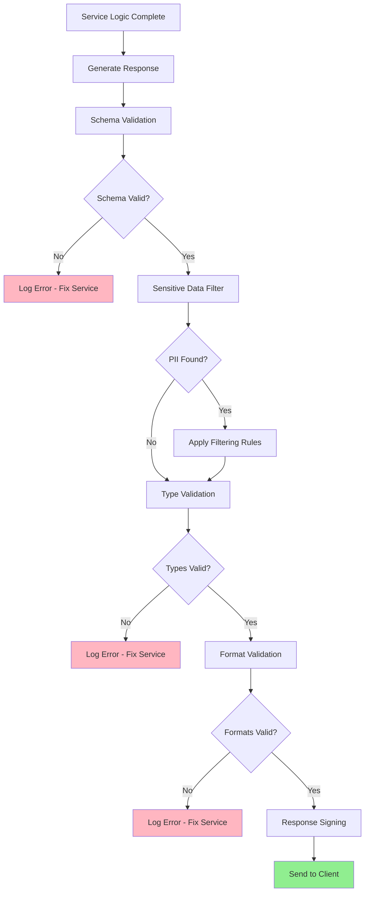

# Response Validation

## Overview

Response validation ensures that data returned by microservices meets expected criteria before being sent to clients. This pattern prevents sensitive data leakage, data corruption, and inconsistent responses that could compromise system integrity or security. Response validation is equally important as request validation in comprehensive API security.

In microservices architectures, services often aggregate data from multiple sources or transform domain objects into API representations. Validation at service boundaries ensures that responses conform to contracts defined in API specifications. This prevents internal implementation details from leaking to external consumers and ensures consistent data formats.

Response validation also protects against injection attacks through responses, where malicious data from backend systems could compromise clients that consume the API. Validating responses adds a defensive layer between internal systems and external clients.

### Key Concepts

**Schema Validation**: Verifying that response data conforms to the defined API schema or contract. Schema validation ensures consistent response structures across all endpoints.

**Sensitive Data Filtering**: Removing or masking sensitive information from responses before sending to clients. PII, passwords, tokens, and internal identifiers should be filtered from API responses.

**Data Type Validation**: Ensuring that response values are of the correct type and fall within expected ranges. Type validation prevents clients from receiving unexpected data types that could cause parsing errors.

**Format Validation**: Verifying that formatted data like dates, currencies, and identifiers follow expected patterns. Format validation ensures consistent data presentation across API responses.

**Response Signing**: Adding cryptographic signatures to API responses to verify authenticity and detect tampering. Response signing is important for high-security APIs.



## Standard Example

The following example demonstrates implementing response validation in a Node.js microservices environment with schema validation, sensitive data filtering, and response signing.

```javascript
const express = require('express');
const crypto = require('crypto');
const Joi = require('joi');

const app = express();
app.use(express.json());

const config = {
    responseSigningEnabled: true,
    signingSecret: process.env.RESPONSE_SIGNING_SECRET || 'your-signing-secret',
    maxResponseSize: 10 * 1024 * 1024,
};

const responseSchemas = new Map();

function registerResponseSchema(endpoint, schema) {
    responseSchemas.set(endpoint, schema);
}

const userResponseSchema = Joi.object({
    id: Joi.string().uuid().required(),
    email: Joi.string().email().required(),
    firstName: Joi.string().max(50).required(),
    lastName: Joi.string().max(50).required(),
    profileImage: Joi.string().uri().allow(null, ''),
    createdAt: Joi.date().iso().required(),
    updatedAt: Joi.date().iso().required(),
    roles: Joi.array().items(Joi.string()),
    isActive: Joi.boolean().required(),
});

registerResponseSchema('GET /api/users/:id', userResponseSchema);

const orderResponseSchema = Joi.object({
    id: Joi.string().uuid().required(),
    customerId: Joi.string().uuid().required(),
    status: Joi.string().valid('pending', 'processing', 'shipped', 'delivered', 'cancelled').required(),
    items: Joi.array().items(Joi.object({
        productId: Joi.string().uuid().required(),
        name: Joi.string().required(),
        quantity: Joi.number().integer().positive().required(),
        unitPrice: Joi.number().positive().required(),
    })).min(1).required(),
    shippingAddress: Joi.object({
        street: Joi.string().required(),
        city: Joi.string().required(),
        state: Joi.string().required(),
        postalCode: Joi.string().required(),
        country: Joi.string().required(),
    }).required(),
    total: Joi.number().positive().required(),
    currency: Joi.string().length(3).uppercase().required(),
    createdAt: Joi.date().iso().required(),
    updatedAt: Joi.date().iso().required(),
});

registerResponseSchema('GET /api/orders/:id', orderResponseSchema);

const sensitiveFieldPatterns = [
    { field: 'password', action: 'remove' },
    { field: 'passwordHash', action: 'remove' },
    { field: 'token', action: 'remove' },
    { field: 'accessToken', action: 'remove' },
    { field: 'refreshToken', action: 'remove' },
    { field: 'ssn', action: 'remove' },
    { field: 'socialSecurityNumber', action: 'remove' },
    { field: 'creditCard', action: 'mask', maskChar: '*', visibleLast: 4 },
    { field: 'cvv', action: 'remove' },
    { field: 'apiKey', action: 'remove' },
    { field: 'secretKey', action: 'remove' },
    { field: 'privateKey', action: 'remove' },
    { field: 'internalId', action: 'remove' },
    { field: 'rawData', action: 'remove' },
    { field: 'debugInfo', action: 'remove' },
    { field: 'stackTrace', action: 'remove' },
    { field: 'errorDetails', action: 'remove' },
    { field: 'ipAddress', action: 'mask', maskChar: '*', visibleLast: 0 },
    { field: 'ip', action: 'mask', maskChar: '*', visibleLast: 0 },
];

function filterSensitiveData(obj, path = '') {
    if (obj === null || obj === undefined) {
        return obj;
    }
    
    if (typeof obj !== 'object') {
        return obj;
    }
    
    if (Array.isArray(obj)) {
        return obj.map(item => filterSensitiveData(item, path));
    }
    
    const filtered = {};
    
    for (const [key, value] of Object.entries(obj)) {
        const currentPath = path ? `${path}.${key}` : key;
        const matchingPattern = sensitiveFieldPatterns.find(p => 
            key.toLowerCase() === p.field.toLowerCase()
        );
        
        if (matchingPattern) {
            if (matchingPattern.action === 'remove') {
                continue;
            } else if (matchingPattern.action === 'mask') {
                if (typeof value === 'string') {
                    const maskChar = matchingPattern.maskChar || '*';
                    const visibleLast = matchingPattern.visibleLast || 0;
                    if (value.length <= visibleLast) {
                        filtered[key] = maskChar.repeat(value.length);
                    } else {
                        filtered[key] = maskChar.repeat(value.length - visibleLast) + value.slice(-visibleLast);
                    }
                } else {
                    filtered[key] = '***';
                }
            }
        } else if (typeof value === 'object') {
            filtered[key] = filterSensitiveData(value, currentPath);
        } else {
            filtered[key] = value;
        }
    }
    
    return filtered;
}

function validateResponseSchema(response, schema) {
    const result = schema.validate(response, {
        abortEarly: false,
        stripUnknown: true,
    });
    
    return {
        valid: !result.error,
        errors: result.error ? result.error.details.map(d => ({
            field: d.path.join('.'),
            message: d.message,
        })) : [],
        value: result.value || response,
    };
}

function signResponse(payload) {
    const hmac = crypto.createHmac('sha256', config.signingSecret);
    hmac.update(JSON.stringify(payload));
    const signature = hmac.digest('base64');
    return signature;
}

function verifySignature(payload, signature) {
    const expectedSignature = signResponse(payload);
    return crypto.timingSafeEqual(
        Buffer.from(signature),
        Buffer.from(expectedSignature)
    );
}

function addSignatureToResponse(response) {
    if (!config.responseSigningEnabled) {
        return response;
    }
    
    const signature = signResponse(response);
    return {
        ...response,
        _signature: signature,
        _signedAt: new Date().toISOString(),
    };
}

function validateTypes(response) {
    const errors = [];
    
    function checkValue(key, value, expectedType) {
        const actualType = Array.isArray(value) ? 'array' : typeof value;
        
        if (expectedType === 'string' && actualType !== 'string') {
            errors.push({ field: key, message: `Expected string, got ${actualType}` });
        } else if (expectedType === 'number' && actualType !== 'number') {
            errors.push({ field: key, message: `Expected number, got ${actualType}` });
        } else if (expectedType === 'boolean' && actualType !== 'boolean') {
            errors.push({ field: key, message: `Expected boolean, got ${actualType}` });
        } else if (expectedType === 'object' && actualType === 'object' && value === null) {
            errors.push({ field: key, message: 'Expected object, got null' });
        } else if (expectedType === 'array' && actualType !== 'array') {
            errors.push({ field: key, message: `Expected array, got ${actualType}` });
        }
    }
    
    return {
        valid: errors.length === 0,
        errors,
    };
}

function validateResponse(endpoint, response) {
    const errors = [];
    
    const schema = responseSchemas.get(endpoint);
    if (schema) {
        const schemaResult = validateResponseSchema(response, schema);
        if (!schemaResult.valid) {
            errors.push(...schemaResult.errors);
        }
    }
    
    const filtered = filterSensitiveData(response);
    
    if (JSON.stringify(filtered).length > config.maxResponseSize) {
        errors.push({
            field: 'response',
            message: `Response exceeds maximum size of ${config.maxResponseSize} bytes`,
        });
    }
    
    const signedResponse = addSignatureToResponse(filtered);
    
    return {
        valid: errors.length === 0,
        errors,
        response: signedResponse,
    };
}

function responseValidationMiddleware(req, res) => {
    const originalJson = res.json;
    const endpoint = `${req.method} ${req.route?.path || req.path}`;
    
    res.json = function(data) {
        const validation = validateResponse(endpoint, data);
        
        if (!validation.valid) {
            console.error('Response validation failed:', validation.errors);
            
            return originalJson.call(this, {
                error: 'Response validation failed',
                details: validation.errors,
            });
        }
        
        return originalJson.call(this, validation.response);
    };
    
    originalJson.call(res, data);
}

app.use(responseValidationMiddleware);

app.get('/api/users/:id', (req, res) => {
    const user = {
        id: req.params.id,
        email: 'user@example.com',
        firstName: 'John',
        lastName: 'Doe',
        password: 'secret123',
        internalId: 'int-12345',
        ipAddress: '192.168.1.1',
        profileImage: 'https://example.com/avatar.jpg',
        createdAt: new Date().toISOString(),
        updatedAt: new Date().toISOString(),
        roles: ['user'],
        isActive: true,
    };
    
    res.json(user);
});

app.get('/api/orders/:id', (req, res) => {
    const order = {
        id: req.params.id,
        customerId: '123e4567-e89b-12d3-a456-426614174000',
        status: 'processing',
        items: [
            {
                productId: '123e4567-e89b-12d3-a456-426614174001',
                name: 'Product 1',
                quantity: 2,
                unitPrice: 29.99,
            },
        ],
        shippingAddress: {
            street: '123 Main St',
            city: 'Springfield',
            state: 'IL',
            postalCode: '62701',
            country: 'USA',
        },
        total: 59.98,
        currency: 'USD',
        createdAt: new Date().toISOString(),
        updatedAt: new Date().toISOString(),
    };
    
    res.json(order);
});

app.get('/api/payments/:id', (req, res) => {
    const payment = {
        id: req.params.id,
        orderId: '123e4567-e89b-12d3-a456-426614174000',
        amount: 59.98,
        currency: 'USD',
        creditCard: '4532015112830366',
        cvv: '123',
        status: 'completed',
        createdAt: new Date().toISOString(),
    };
    
    res.json(payment);
});

app.post('/api/test/validate', (req, res) => {
    const { response, endpoint } = req.body;
    
    const validation = validateResponse(endpoint, response);
    
    res.json(validation);
});

app.get('/api/health', (req, res) => {
    res.json({
        status: 'healthy',
        responseValidation: 'enabled',
        signingEnabled: config.responseSigningEnabled,
        sensitiveFields: sensitiveFieldPatterns.length,
    });
});

const PORT = process.env.PORT || 3000;
app.listen(PORT, () => {
    console.log(`Response validation server running on port ${PORT}`);
});

module.exports = {
    app,
    registerResponseSchema,
    filterSensitiveData,
    validateResponseSchema,
    validateResponse,
    signResponse,
    verifySignature,
    addSignatureToResponse,
};

## Real-World Examples

### Netflix Zuul Response Filters

Netflix Zuul uses filters for response processing including header manipulation, response transformation, and security enforcement.

```java
@Component
public class ResponseValidationFilter extends ZuulFilter {
    
    @Override
    public String filterType() {
        return "post";
    }
    
    @Override
    public int filterOrder() {
        return 10;
    }
    
    @Override
    public boolean shouldFilter() {
        return true;
    }
    
    @Override
    public Object run() {
        RequestContext context = RequestContext.getCurrentContext();
        HttpServletResponse response = context.getResponse();
        
        response.addHeader("X-Content-Type-Options", "nosniff");
        response.addHeader("X-Frame-Options", "DENY");
        response.addHeader("Strict-Transport-Security", "max-age=31536000");
        
        String responseBody = context.getResponseBody();
        if (responseBody != null) {
            ObjectMapper mapper = new ObjectMapper();
            try {
                JsonNode json = mapper.readTree(responseBody);
                JsonNode filtered = removeSensitiveFields(json);
                context.setResponseBody(filtered.toString());
            } catch (Exception e) {
                log.error("Response validation error", e);
            }
        }
        
        return null;
    }
    
    private JsonNode removeSensitiveFields(JsonNode node) {
        ObjectNode objectNode = (ObjectNode) node;
        objectNode.remove("password");
        objectNode.remove("ssn");
        objectNode.remove("creditCard");
        objectNode.remove("internalId");
        return objectNode;
    }
}
```

### API Gateway Response Validation

API gateways like Kong and AWS API Gateway can validate responses against OpenAPI specifications to ensure consistent response formats.

```javascript
const SwaggerParser = require('@apidevtools/swagger-parser');
const Ajv = require('ajv');

const ajv = new Ajv({ allErrors: true, strict: false });

async function validateResponseAgainstSpec(responseBody, operation, apiSpec) {
    const responses = operation.responses;
    const statusCode = responseBody.statusCode || 200;
    const responseSchema = responses[statusCode]?.content?.['application/json']?.schema;
    
    if (!responseSchema) {
        return { valid: true, reason: 'No schema to validate against' };
    }
    
    const validate = ajv.compile(responseSchema);
    const valid = validate(responseBody.body);
    
    return {
        valid: valid,
        errors: validate.errors || [],
        validatedAt: new Date().toISOString(),
    };
}
```

## Output Statement

Response validation ensures that data leaving microservices meets security and quality standards before reaching clients. This pattern prevents sensitive data leakage, data corruption, and inconsistent responses that could compromise system integrity. By filtering sensitive information and validating response formats, organizations protect both their systems and their clients from potential security issues. Response validation should be implemented alongside request validation as part of comprehensive API security, with automated testing to ensure validation rules remain accurate as APIs evolve.

## Best Practices

**Filter Sensitive Data by Default**: Implement default filtering for common sensitive fields like passwords, tokens, and PII. Use a centralized filter configuration that can be updated without code changes.

**Validate Response Schema**: Ensure responses conform to defined API contracts. This prevents internal implementation details from leaking to clients and ensures consistent data formats.

**Sign Critical Responses**: Add cryptographic signatures to responses that require integrity verification. This allows clients to detect tampering and verify authenticity.

**Implement Response Size Limits**: Set maximum response sizes to prevent resource exhaustion attacks through oversized responses.

**Log Response Validation Failures**: Track when response validation fails to identify bugs in services and potential security issues.

**Test Response Validation**: Include response validation in integration tests. Verify that invalid responses are caught and filtered appropriately.

**Use Defense in Depth**: Apply response validation at multiple points - at the API gateway and within individual services. This ensures validation occurs even if one layer is bypassed.