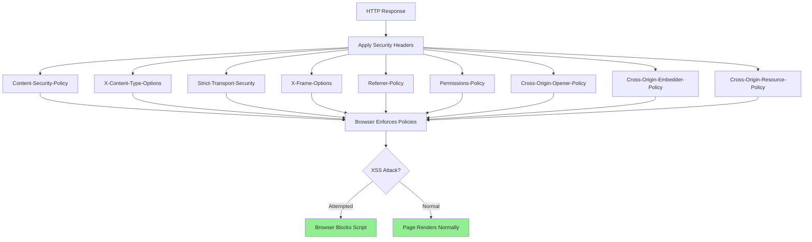

# Security Headers

## Overview

Security headers are HTTP response headers that enable various security features in web browsers and clients. They provide an additional layer of defense by instructing browsers on how to handle content, enforce security policies, and prevent common web vulnerabilities. Implementing proper security headers is one of the most cost-effective ways to improve application security.

Security headers address different attack vectors including cross-site scripting (XSS), clickjacking, man-in-the-middle attacks, MIME type sniffing, and information leakage. Each header targets a specific vulnerability, and a comprehensive security header strategy uses multiple headers together for defense-in-depth.

Modern web applications should implement security headers at the API gateway, reverse proxy, or application server level. This ensures consistent application across all endpoints and reduces the risk of headers being forgotten on individual routes.

### Key Concepts

**Content-Security-Policy (CSP)**: Controls which resources can be loaded and from where. CSP is the primary defense against XSS attacks by specifying allowed sources for scripts, styles, images, and other content types.

**X-Content-Type-Options**: Prevents browsers from MIME-sniffing a response away from the declared content-type. This prevents attacks that exploit differences between declared and actual content types.

**Strict-Transport-Security (HSTS)**: Forces browsers to only connect to the server over HTTPS, preventing protocol downgrade attacks and cookie hijacking.

**X-Frame-Options**: Controls whether the page can be rendered in a frame or iframe, protecting against clickjacking attacks.

**Referrer-Policy**: Controls how much referrer information is included with requests, preventing information leakage about visited pages.

**Permissions-Policy**: Controls which browser features and APIs can be used in the document, providing fine-grained control over device access, geolocation, and other capabilities.



## Standard Example

The following example demonstrates implementing comprehensive security headers in a Node.js microservices environment with dynamic configuration, header verification, and middleware for different security profiles.

```javascript
const express = require('express');
const helmet = require('helmet');
const crypto = require('crypto');

const app = express();
app.use(express.json());

const config = {
    cspReportOnly: process.env.CSP_REPORT_ONLY === 'true',
    hstsMaxAge: 31536000,
    hstsIncludeSubDomains: true,
    hstsPreload: true,
    cspReportUri: process.env.CSP_REPORT_URI || '/api/csp-violation',
};

const securityHeaders = {
    default: {
        'Content-Security-Policy': "default-src 'self'; script-src 'self'; style-src 'self' 'unsafe-inline'; img-src 'self' data: https:; font-src 'self'; connect-src 'self'; frame-ancestors 'none'; base-uri 'self'; form-action 'self'",
        'X-Content-Type-Options': 'nosniff',
        'X-Frame-Options': 'DENY',
        'X-XSS-Protection': '1; mode=block',
        'Referrer-Policy': 'strict-origin-when-cross-origin',
        'Permissions-Policy': 'geolocation=(), microphone=(), camera=(), payment=(), usb=()',
        'Strict-Transport-Security': `max-age=${config.hstsMaxAge}; includeSubDomains${config.hstsPreload ? '; preload' : ''}`,
        'Cross-Origin-Opener-Policy': 'same-origin',
        'Cross-Origin-Embedder-Policy': 'require-corp',
        'Cross-Origin-Resource-Policy': 'same-origin',
    },
    
    api: {
        'Content-Security-Policy': "default-src 'none'; script-src 'none'; style-src 'none'; img-src 'none'; object-src 'none'; base-uri 'none'",
        'X-Content-Type-Options': 'nosniff',
        'X-Frame-Options': 'DENY',
        'Referrer-Policy': 'no-referrer',
        'Permissions-Policy': 'geolocation=(), microphone=(), camera=()',
        'Strict-Transport-Security': `max-age=${config.hstsMaxAge}; includeSubDomains; preload`,
    },
    
    static: {
        'Content-Security-Policy': "default-src 'self'; script-src 'self'; style-src 'self' 'unsafe-inline'; img-src 'self' data:; font-src 'self'",
        'X-Content-Type-Options': 'nosniff',
        'X-Frame-Options': 'SAMEORIGIN',
        'Referrer-Policy': 'strict-origin-when-cross-origin',
    },
    
    cspReportOnly: {
        'Content-Security-Policy-Report-Only': "default-src 'self'; report-uri /api/csp-violation; script-src 'self' 'unsafe-inline'",
    },
};

function getSecurityHeaders(profile = 'default') {
    const headers = securityHeaders[profile] || securityHeaders.default;
    
    if (config.cspReportOnly && profile === 'default') {
        return { ...securityHeaders.cspReportOnly };
    }
    
    return { ...headers };
}

function securityHeadersMiddleware(profile = 'default') {
    const headers = getSecurityHeaders(profile);
    
    return (req, res, next) => {
        for (const [header, value] of Object.entries(headers)) {
            res.setHeader(header, value);
        }
        next();
    };
}

function hstsMiddleware(req, res, next) {
    if (req.secure || req.headers['x-forwarded-proto'] === 'https') {
        const hstsValue = `max-age=${config.hstsMaxAge}; includeSubDomains${config.hstsPreload ? '; preload' : ''}`;
        res.setHeader('Strict-Transport-Security', hstsValue);
    }
    next();
}

function cspMiddleware(options = {}) {
    const {
        defaultSrc = ["'self'"],
        scriptSrc = ["'self'"],
        styleSrc = ["'self'", "'unsafe-inline'"],
        imgSrc = ["'self'", 'data:', 'https:'],
        fontSrc = ["'self'"],
        connectSrc = ["'self'"],
        frameSrc = ["'none'"],
        objectSrc = ["'none'"],
        baseUri = ["'self'"],
        formAction = ["'self'"],
        reportUri = config.cspReportUri,
        reportOnly = config.cspReportOnly,
    } = options;
    
    const policyParts = [];
    
    if (defaultSrc.length) policyParts.push(`default-src ${defaultSrc.join(' ')}`);
    if (scriptSrc.length) policyParts.push(`script-src ${scriptSrc.join(' ')}`);
    if (styleSrc.length) policyParts.push(`style-src ${styleSrc.join(' ')}`);
    if (imgSrc.length) policyParts.push(`img-src ${imgSrc.join(' ')}`);
    if (fontSrc.length) policyParts.push(`font-src ${fontSrc.join(' ')}`);
    if (connectSrc.length) policyParts.push(`connect-src ${connectSrc.join(' ')}`);
    if (frameSrc.length) policyParts.push(`frame-src ${frameSrc.join(' ')}`);
    if (objectSrc.length) policyParts.push(`object-src ${objectSrc.join(' ')}`);
    if (baseUri.length) policyParts.push(`base-uri ${baseUri.join(' ')}`);
    if (formAction.length) policyParts.push(`form-action ${formAction.join(' ')}`);
    if (reportUri) policyParts.push(`report-uri ${reportUri}`);
    
    const policy = policyParts.join('; ');
    const headerName = reportOnly ? 'Content-Security-Policy-Report-Only' : 'Content-Security-Policy';
    
    return (req, res, next) => {
        res.setHeader(headerName, policy);
        next();
    };
}

function noSniffMiddleware(req, res, next) {
    res.setHeader('X-Content-Type-Options', 'nosniff');
    next();
}

function frameGuardMiddleware(option = 'DENY') {
    return (req, res, next) => {
        res.setHeader('X-Frame-Options', option);
        next();
    };
}

function referrerPolicyMiddleware(policy = 'strict-origin-when-cross-origin') {
    return (req, res, next) => {
        res.setHeader('Referrer-Policy', policy);
        next();
    };
}

function permissionsPolicyMiddleware(policies = {}) {
    const defaultPolicies = {
        geolocation: '()',
        microphone: '()',
        camera: '()',
        payment: '()',
        usb: '()',
        fullscreen: '()',
        pictureInPicture: '()',
    };
    
    const policiesToApply = { ...defaultPolicies, ...policies };
    const policyString = Object.entries(policiesToApply)
        .map(([feature, value]) => `${feature}=${value}`)
        .join(', ');
    
    return (req, res, next) => {
        res.setHeader('Permissions-Policy', policyString);
        next();
    };
}

function crossOriginPoliciesMiddleware(req, res, next) {
    res.setHeader('Cross-Origin-Opener-Policy', 'same-origin');
    res.setHeader('Cross-Origin-Embedder-Policy', 'require-corp');
    res.setHeader('Cross-Origin-Resource-Policy', 'same-origin');
    next();
}

function removePoweredByHeader(req, res, next) {
    res.removeHeader('X-Powered-By');
    res.setHeader('X-Content-Type-Options', 'nosniff');
    next();
}

function securityHeadersAudit(req, res, next) {
    const audit = {
        requestedHeaders: req.headers['x-security-audit'] === 'true',
        includeDetails: req.headers['x-security-details'] === 'true',
    };
    
    if (audit.requestedHeaders) {
        const requiredHeaders = [
            'Content-Security-Policy',
            'X-Content-Type-Options',
            'X-Frame-Options',
            'Strict-Transport-Security',
            'Referrer-Policy',
            'Permissions-Policy',
        ];
        
        const currentHeaders = requiredHeaders.reduce((acc, header) => {
            acc[header] = res.getHeader(header) || 'missing';
            return acc;
        }, {});
        
        if (audit.includeDetails) {
            res.setHeader('X-Security-Audit', JSON.stringify(currentHeaders));
        }
    }
    
    next();
}

const cspViolations = [];

app.post(config.cspReportUri, (req, res) => {
    const violation = {
        timestamp: new Date().toISOString(),
        body: req.body,
        ip: req.ip,
        userAgent: req.headers['user-agent'],
    };
    
    cspViolations.push(violation);
    
    if (cspViolations.length > 1000) {
        cspViolations.shift();
    }
    
    console.log('CSP Violation:', violation);
    
    res.status(204).send();
});

app.get('/api/security/headers', securityHeadersMiddleware('default'), (req, res) => {
    const headers = {
        'Content-Security-Policy': res.getHeader('Content-Security-Policy'),
        'X-Content-Type-Options': res.getHeader('X-Content-Type-Options'),
        'X-Frame-Options': res.getHeader('X-Frame-Options'),
        'Strict-Transport-Security': res.getHeader('Strict-Transport-Security'),
        'Referrer-Policy': res.getHeader('Referrer-Policy'),
        'Permissions-Policy': res.getHeader('Permissions-Policy'),
    };
    
    res.json({
        headers: headers,
        profiles: Object.keys(securityHeaders),
    });
});

app.get('/api/security/headers/:profile', (req, res) => {
    const { profile } = req.params;
    const headers = getSecurityHeaders(profile);
    
    res.json({
        profile: profile,
        headers: headers,
    });
});

app.get('/api/security/csp-violations', (req, res) => {
    const limit = parseInt(req.query.limit) || 10;
    
    res.json({
        count: cspViolations.length,
        violations: cspViolations.slice(-limit),
    });
});

app.use(securityHeadersMiddleware('default'));
app.use(hstsMiddleware);
app.use(securityHeadersAudit);

app.get('/api/health', (req, res) => {
    res.json({
        status: 'healthy',
        securityHeaders: 'enabled',
        cspReportUri: config.cspReportUri,
    });
});

app.get('/api/users/:id', (req, res) => {
    res.json({
        id: req.params.id,
        name: 'John Doe',
        email: 'john@example.com',
    });
});

app.get('/api/secure-data', (req, res) => {
    res.json({
        sensitive: 'data',
        message: 'This endpoint has strict security headers',
    });
});

app.use((err, req, res, next) => {
    console.error('Error:', err);
    res.status(500).json({ error: 'Internal server error' });
});

const PORT = process.env.PORT || 3000;
app.listen(PORT, () => {
    console.log(`Security headers server running on port ${PORT}`);
    console.log('Security profiles:', Object.keys(securityHeaders).join(', '));
});

module.exports = {
    app,
    getSecurityHeaders,
    securityHeadersMiddleware,
    cspMiddleware,
    hstsMiddleware,
    noSniffMiddleware,
    frameGuardMiddleware,
    referrerPolicyMiddleware,
    permissionsPolicyMiddleware,
    crossOriginPoliciesMiddleware,
    securityHeaders,
};

## Real-World Examples

### Nginx Security Headers Configuration

Nginx provides efficient security header implementation through add_header directives.

```nginx
server {
    listen 443 ssl http2;
    server_name api.example.com;
    
    ssl_certificate /etc/nginx/ssl/server.crt;
    ssl_certificate_key /etc/nginx/ssl/server.key;
    
    # Content Security Policy
    add_header Content-Security-Policy "default-src 'self'; script-src 'self'; style-src 'self' 'unsafe-inline'; img-src 'self' data: https:; connect-src 'self'; frame-ancestors 'none';" always;
    
    # Prevent MIME type sniffing
    add_header X-Content-Type-Options "nosniff" always;
    
    # Clickjacking protection
    add_header X-Frame-Options "DENY" always;
    
    # XSS protection
    add_header X-XSS-Protection "1; mode=block" always;
    
    # HSTS
    add_header Strict-Transport-Security "max-age=31536000; includeSubDomains; preload" always;
    
    # Referrer Policy
    add_header Referrer-Policy "strict-origin-when-cross-origin" always;
    
    # Permissions Policy
    add_header Permissions-Policy "geolocation=(), microphone=(), camera=()" always;
    
    # Cross-Origin policies
    add_header Cross-Origin-Opener-Policy "same-origin" always;
    add_header Cross-Origin-Embedder-Policy "require-corp" always;
    add_header Cross-Origin-Resource-Policy "same-origin" always;
}
```

### Kubernetes Ingress Controller

Kubernetes ingress controllers like NGINX Ingress Controller support security headers through annotations.

```yaml
apiVersion: networking.k8s.io/v1
kind: Ingress
metadata:
  name: secure-api
  annotations:
    nginx.ingress.kubernetes.io/ssl-redirect: "true"
    nginx.ingress.kubernetes.io/proxy-ssl-redirect: "true"
    nginx.ingress.kubernetes.io/proxy-buffering: "on"
    nginx.ingress.kubernetes.io/configuration-snippet: |
      add_header X-Content-Type-Options "nosniff" always;
      add_header X-Frame-Options "DENY" always;
      add_header X-XSS-Protection "1; mode=block" always;
      add_header Strict-Transport-Security "max-age=31536000; includeSubDomains; preload" always;
      add_header Referrer-Policy "strict-origin-when-cross-origin" always;
    nginx.ingress.kubernetes.io/server-snippet: |
      add_header Permissions-Policy "geolocation=(), microphone=(), camera=()" always;
spec:
  tls:
    - hosts:
        - api.example.com
      secretName: api-tls-secret
  rules:
    - host: api.example.com
      http:
        paths:
          - path: /
            pathType: Prefix
            backend:
              service:
                name: api-service
                port:
                  number: 8080
```

## Output Statement

Security headers provide essential protection against common web vulnerabilities by instructing browsers to enforce security policies. Content-Security-Policy prevents XSS attacks, X-Frame-Options blocks clickjacking, and HSTS prevents protocol downgrade attacks. Implementing security headers is one of the most cost-effective security improvements, requiring configuration changes rather than code modifications. Organizations should implement comprehensive security headers at the API gateway or reverse proxy level to ensure consistent protection across all endpoints. Regular header audits help maintain security as applications evolve.

## Best Practices

**Set Appropriate CSP Policies**: Start with a restrictive Content-Security-Policy and gradually relax restrictions as you identify necessary resources. Use 'self' for same-origin resources and specific domains for external resources.

**Enable HSTS**: Always enable HTTP Strict Transport Security with a long max-age and the preload flag. This prevents protocol downgrade attacks and ensures browsers always use HTTPS.

**Use DENY for X-Frame-Options**: Unless your application needs to be embedded in iframes, use DENY. If embedding is needed, use SAMEORIGIN and ensure the embedding site is trusted.

**Implement All Security Headers**: Don't cherry-pick - implement all relevant security headers for comprehensive protection. Missing headers create gaps in security.

**Test Headers Regularly**: Use tools like securityheaders.com to test your headers. Ensure headers are applied consistently across all endpoints and don't regress.

**Configure Headers at Gateway Level**: Apply security headers at the API gateway or reverse proxy level rather than in application code. This ensures consistent application and reduces maintenance overhead.

**Monitor CSP Violations**: Set up reporting for Content-Security-Policy violations to identify potential issues and refine your CSP policy over time.

**Keep Headers Updated**: Review and update security headers regularly as browser features and security recommendations evolve.