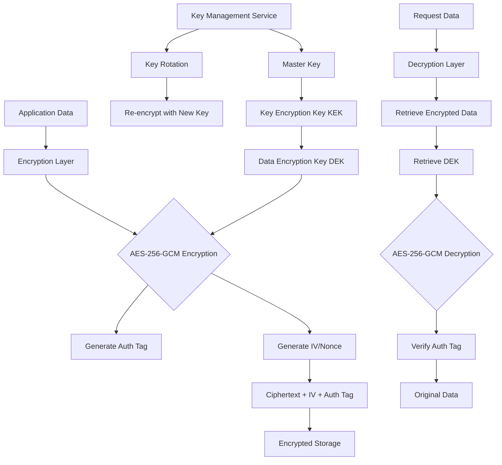

# Data Encryption at Rest

## Overview

Data encryption at rest is a critical security measure that protects stored data from unauthorized access, even if physical storage media is compromised. In microservices architectures, data at rest exists in various locations: databases, object storage, file systems, and cache systems. Encryption at rest ensures that even if an attacker gains access to the underlying storage, they cannot read the sensitive data without the appropriate decryption keys.

Encryption at rest operates by transforming plaintext data into ciphertext using encryption algorithms and cryptographic keys. The encrypted data can only be transformed back to its original form with the correct decryption key. Modern encryption standards like AES-256 provide military-grade protection, making it computationally infeasible to crack the encryption without the key.

Microservices environments present unique challenges for data encryption at rest. Multiple services may need to encrypt and decrypt data, requiring a robust key management strategy. Data may be stored across different databases and storage systems, each with its own encryption requirements. Additionally, services must handle key rotation, access control, and audit logging while maintaining performance and availability.

The importance of encryption at rest has increased significantly due to regulatory requirements such as GDPR, HIPAA, PCI-DSS, and SOC 2. These regulations often mandate encryption for sensitive data including personally identifiable information (PII), financial data, healthcare records, and authentication credentials. Organizations that fail to implement adequate encryption at rest face substantial fines and reputational damage in the event of a data breach.

### Key Concepts

**Symmetric Encryption**: Uses the same key for encryption and decryption. AES-256-GCM is the gold standard for data at rest encryption, providing both confidentiality and integrity through authenticated encryption. Symmetric encryption is fast and efficient for large volumes of data.

**Asymmetric Encryption**: Uses key pairs consisting of a public key for encryption and a private key for decryption. While more computationally expensive, asymmetric encryption is essential for key exchange and digital signatures. RSA and Elliptic Curve Cryptography (ECC) are common asymmetric algorithms.

**Encryption Keys**: Master keys protect encryption keys, which in turn protect data. This hierarchical key structure allows for key rotation without re-encrypting all data. Keys should be stored in hardware security modules (HSMs) or secure key management services.

**Key Management**: Involves key generation, storage, distribution, rotation, and retirement. Proper key management is crucial for security because compromised keys render encryption ineffective. Automated key rotation and secure key backup are essential practices.

**Transparent Data Encryption (TDE)**: Database-level encryption that automatically encrypts all data before writing to storage and decrypts when reading. TDE operates at the storage layer, requiring no application changes, but limits granularity of access control.



## Standard Example

The following example demonstrates implementing data encryption at rest in a Node.js microservices environment with envelope encryption, key rotation support, and secure key management.

```javascript
const crypto = require('crypto');
const fs = require('fs');
const path = require('path');

const ENCRYPTION_ALGORITHM = 'aes-256-gcm';
const KEY_LENGTH = 32;
const IV_LENGTH = 16;
const AUTH_TAG_LENGTH = 16;

class DataEncryptionService {
    constructor(keyManagementService, options = {}) {
        this.kms = keyManagementService;
        this.keyCache = new Map();
        this.keyCacheTimeout = options.keyCacheTimeout || 300000;
        this.defaultKeyId = options.defaultKeyId || 'default-dek';
    }

    async initialize() {
        await this.kms.initialize();
        await this.ensureDataEncryptionKey(this.defaultKeyId);
        console.log('Data encryption service initialized');
    }

    async generateDataEncryptionKey(keyId) {
        const dek = crypto.randomBytes(KEY_LENGTH);
        const encryptedDek = await this.kms.encrypt(keyId, dek);
        
        return {
            keyId: keyId,
            encryptedKey: encryptedDek,
            createdAt: new Date().toISOString(),
            version: 1,
        };
    }

    async ensureDataEncryptionKey(keyId) {
        if (!this.keyCache.has(keyId)) {
            const storedKey = await this.loadStoredKey(keyId);
            if (storedKey) {
                this.keyCache.set(keyId, {
                    dek: storedKey.dek,
                    metadata: storedKey.metadata,
                    cachedAt: Date.now(),
                });
            } else {
                const newKey = await this.generateDataEncryptionKey(keyId);
                await this.storeKey(keyId, newKey);
                this.keyCache.set(keyId, {
                    dek: newKey.encryptedKey,
                    metadata: newKey,
                    cachedAt: Date.now(),
                });
            }
        }
        return this.keyCache.get(keyId);
    }

    async loadStoredKey(keyId) {
        const keyPath = path.join(process.env.KEY_STORE_PATH || './keys', `${keyId}.json`);
        
        if (!fs.existsSync(keyPath)) {
            return null;
        }
        
        try {
            const keyData = JSON.parse(fs.readFileSync(keyPath, 'utf8'));
            const dek = await this.kms.decrypt(keyData.encryptedKey);
            
            return {
                dek: dek,
                metadata: keyData,
            };
        } catch (error) {
            console.error('Failed to load stored key:', error.message);
            return null;
        }
    }

    async storeKey(keyId, keyData) {
        const keyDir = process.env.KEY_STORE_PATH || './keys';
        
        if (!fs.existsSync(keyDir)) {
            fs.mkdirSync(keyDir, { recursive: true });
        }
        
        const keyPath = path.join(keyDir, `${keyId}.json`);
        const storageData = {
            keyId: keyData.keyId,
            encryptedKey: keyData.encryptedKey,
            createdAt: keyData.createdAt,
            version: keyData.version,
            algorithm: ENCRYPTION_ALGORITHM,
        };
        
        fs.writeFileSync(keyPath, JSON.stringify(storageData, null, 2));
        console.log(`Stored encrypted DEK for key ID: ${keyId}`);
    }

    async encrypt(plaintext, options = {}) {
        const keyId = options.keyId || this.defaultKeyId;
        
        await this.ensureDataEncryptionKey(keyId);
        const cachedKey = this.keyCache.get(keyId);
        
        const iv = crypto.randomBytes(IV_LENGTH);
        const cipher = crypto.createCipheriv(
            ENCRYPTION_ALGORITHM,
            cachedKey.dek,
            iv,
            {
                authTagLength: AUTH_TAG_LENGTH,
            }
        );

        const encrypted = Buffer.concat([
            cipher.update(plaintext, 'utf8'),
            cipher.final(),
        ]);
        
        const authTag = cipher.getAuthTag();
        
        const result = {
            ciphertext: encrypted.toString('base64'),
            iv: iv.toString('base64'),
            authTag: authTag.toString('base64'),
            keyId: keyId,
            version: cachedKey.metadata.version,
            encryptedDek: cachedKey.dek,
            algorithm: ENCRYPTION_ALGORITHM,
            timestamp: new Date().toISOString(),
        };

        if (options.storeEncryptedDek === false) {
            delete result.encryptedDek;
        }
        
        return result;
    }

    async decrypt(encryptedData) {
        const keyId = encryptedData.keyId || this.defaultKeyId;
        
        await this.ensureDataEncryptionKey(keyId);
        const cachedKey = this.keyCache.get(keyId);

        if (cachedKey.metadata.version !== encryptedData.version) {
            throw new Error('Key version mismatch - key rotation may be required');
        }

        const iv = Buffer.from(encryptedData.iv, 'base64');
        const authTag = Buffer.from(encryptedData.authTag, 'base64');
        const ciphertext = Buffer.from(encryptedData.ciphertext, 'base64');

        const decipher = crypto.createDecipheriv(
            ENCRYPTION_ALGORITHM,
            cachedKey.dek,
            iv,
            {
                authTagLength: AUTH_TAG_LENGTH,
            }
        );

        decipher.setAuthTag(authTag);

        const decrypted = Buffer.concat([
            decipher.update(ciphertext),
            decipher.final(),
        ]);

        return decrypted.toString('utf8');
    }

    async rotateKey(oldKeyId, newKeyId) {
        console.log(`Rotating key from ${oldKeyId} to ${newKeyId}`);
        
        const oldCachedKey = this.keyCache.get(oldKeyId);
        if (!oldCachedKey) {
            throw new Error(`Key not found: ${oldKeyId}`);
        }

        const newDek = crypto.randomBytes(KEY_LENGTH);
        const encryptedNewDek = await this.kms.encrypt(newKeyId, newDek);

        const newKeyData = {
            keyId: newKeyId,
            encryptedKey: encryptedNewDek,
            createdAt: new Date().toISOString(),
            version: oldCachedKey.metadata.version + 1,
            previousKeyId: oldKeyId,
            previousVersion: oldCachedKey.metadata.version,
        };

        await this.storeKey(newKeyId, newKeyData);
        this.keyCache.set(newKeyId, {
            dek: newDek,
            metadata: newKeyData,
            cachedAt: Date.now(),
        });

        this.keyCache.delete(oldKeyId);
        
        console.log(`Key rotation complete: ${oldKeyId} -> ${newKeyId}`);
        return newKeyData;
    }

    encryptField(value, keyId) {
        if (value === null || value === undefined) {
            return value;
        }
        const stringValue = typeof value === 'string' ? value : JSON.stringify(value);
        return this.encrypt(stringValue, { keyId: keyId });
    }

    decryptField(encryptedValue) {
        if (!encryptedValue || !encryptedValue.ciphertext) {
            return encryptedValue;
        }
        return this.decrypt(encryptedValue);
    }

    clearKeyCache() {
        this.keyCache.clear();
    }
}

class SimpleKeyManagementService {
    constructor(options = {}) {
        this.masterKey = options.masterKey || crypto.randomBytes(32);
    }

    async initialize() {
        console.log('Simple KMS initialized');
    }

    async encrypt(keyId, plaintext) {
        const iv = crypto.randomBytes(IV_LENGTH);
        const cipher = crypto.createCipheriv(ENCRYPTION_ALGORITHM, this.masterKey, iv);
        const encrypted = Buffer.concat([cipher.update(plaintext), cipher.final()]);
        const authTag = cipher.getAuthTag();
        return { ciphertext: encrypted.toString('base64'), iv: iv.toString('base64'), authTag: authTag.toString('base64') };
    }

    async decrypt(encryptedData) {
        const iv = Buffer.from(encryptedData.iv, 'base64');
        const authTag = Buffer.from(encryptedData.authTag, 'base64');
        const ciphertext = Buffer.from(encryptedData.ciphertext, 'base64');
        const decipher = crypto.createDecipheriv(ENCRYPTION_ALGORITHM, this.masterKey, iv);
        decipher.setAuthTag(authTag);
        return Buffer.concat([decipher.update(ciphertext), decipher.final()]);
    }
}

async function demonstrateEncryption() {
    const kms = new SimpleKeyManagementService();
    const encryptionService = new DataEncryptionService(kms);
    await encryptionService.initialize();

    const sensitiveData = { userId: 'user-12345', ssn: '123-45-6789', email: 'user@example.com' };
    console.log('Original:', sensitiveData);

    const encrypted = await encryptionService.encrypt(JSON.stringify(sensitiveData));
    console.log('Encrypted:', encrypted.ciphertext.substring(0, 50) + '...');

    const decrypted = await encryptionService.decrypt(encrypted);
    console.log('Decrypted:', decrypted);
}

if (require.main === module) {
    demonstrateEncryption().catch(console.error);
}

module.exports = { DataEncryptionService, SimpleKeyManagementService };

## Real-World Examples

### AWS KMS for Data Encryption at Rest

AWS Key Management Service (KMS) provides managed encryption keys that can encrypt data at rest in various AWS services. KMS integrates with S3, EBS, RDS, and other storage services to provide transparent encryption.

```javascript
const { KMSClient, GenerateDataKeyCommand, DecryptCommand, EncryptCommand } = require('@aws-sdk/client-kms');

const kmsClient = new KMSClient({ region: 'us-east-1' });

async function encryptWithKMS(plaintext, keyId) {
    const encryptCommand = new EncryptCommand({
        KeyId: keyId,
        Plaintext: Buffer.from(plaintext),
        EncryptionContext: { service: 'microservice', environment: 'production' },
    });

    const result = await kmsClient.send(encryptCommand);
    return {
        ciphertext: result.CiphertextBlob.toString('base64'),
        keyId: result.KeyId,
    };
}

async function decryptWithKMS(encryptedData, keyId) {
    const decryptCommand = new DecryptCommand({
        KeyId: keyId,
        CiphertextBlob: Buffer.from(encryptedData, 'base64'),
        EncryptionContext: { service: 'microservice', environment: 'production' },
    });

    const result = await kmsClient.send(decryptCommand);
    return result.Plaintext.toString('utf8');
}

async function generateDataKey(keyId) {
    const command = new GenerateDataKeyCommand({
        KeyId: keyId,
        KeySpec: 'AES_256',
    });

    const result = await kmsClient.send(command);
    return {
        plaintextKey: result.Plaintext.toString('base64'),
        encryptedKey: result.CiphertextBlob.toString('base64'),
        keyId: result.KeyId,
    };
}
```

### Azure Key Vault with Customer-Managed Keys

Azure Key Vault allows organizations to maintain control of their encryption keys while using Azure's managed storage services. Customer-managed keys can be stored in HSM for enhanced security.

```javascript
const { KeyClient, CryptoClient, CryptographyClient } = require('@azure/keyvault-keys');
const { SecretClient } = require('@azure/keyvault-secrets');

async function encryptWithAzureKeyVault() {
    const keyClient = new KeyClient('https://myvault.vault.azure.net/', new DefaultAzureCredential());
    const key = await keyClient.getKey('my-encryption-key');
    
    const cryptoClient = new CryptographyClient(key, new DefaultAzureCredential());
    const encryptResult = await cryptoClient.encrypt('RSA-OAEP', Buffer.from('sensitive-data'));
    
    return encryptResult.result.toString('base64');
}
```

## Output Statement

Data encryption at rest is a fundamental security control that protects sensitive information even when storage systems are compromised. In microservices architectures, implementing encryption at rest requires careful key management, proper encryption algorithm selection, and integration with storage systems. Organizations should use AES-256 with GCM mode for authenticated encryption, implement envelope encryption for key hierarchy, and ensure automated key rotation. Regulatory compliance often mandates encryption at rest, making it essential for protecting PII, financial data, and healthcare records.

## Best Practices

**Use AES-256-GCM**: Choose AES in GCM mode for both confidentiality and integrity protection. GCM provides authenticated encryption, detecting any unauthorized modifications to encrypted data.

**Implement Envelope Encryption**: Use a hierarchy of keys with master keys protecting data encryption keys (DEKs). This allows key rotation without re-encrypting all data.

**Automate Key Rotation**: Implement automated key rotation on a scheduled basis (typically annually) and immediately when a key compromise is suspected.

**Store Keys Separately**: Keep encryption keys in a dedicated key management system (KMS) or hardware security module (HSM), never in the same storage as encrypted data.

**Enable Database-Level Encryption**: Use Transparent Data Encryption (TDE) for databases and consider column-level encryption for the most sensitive fields.

**Maintain Key Backup and Recovery**: Ensure encryption keys are backed up securely and can be recovered in case of failure. Test recovery procedures regularly.