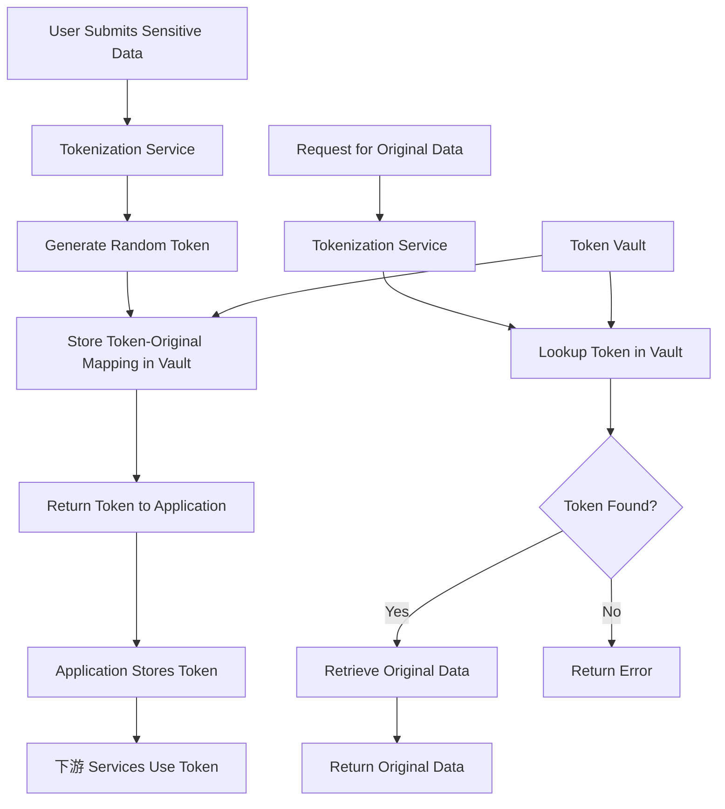

# Tokenization Pattern

## Overview

Tokenization is a data security technique that replaces sensitive data with randomly generated tokens that have no intrinsic meaning or value. Unlike encryption, which mathematically transforms data using reversible algorithms, tokenization creates a one-way mapping where the original data can only be retrieved by looking up the token in a secure token vault. This approach provides excellent security because even if an attacker obtains the tokenized data, they cannot determine the original sensitive information without access to the token vault.

Tokenization is particularly valuable for protecting payment card data, personally identifiable information (PII), and other regulated data in microservices architectures. The token vault acts as a secure boundary, separating the sensitive data from the systems that process tokenized data. This separation reduces the scope of compliance audits because tokenized data is not considered sensitive under most regulatory frameworks.

The tokenization process involves generating a unique token, storing the original data in a secure vault, and returning the token for use in downstream systems. When the original data is needed, the token is submitted to the vault for lookup. This lookup-only operation means tokenization provides strong protection against data breaches, as the actual sensitive data never leaves the secure vault environment.

Microservices benefit significantly from tokenization because different services can work with tokens rather than raw sensitive data. This reduces the risk of data exposure across service boundaries and simplifies compliance with data protection regulations. Services never need to handle actual credit card numbers, SSNs, or other sensitive fields—they simply store, process, and transmit tokens that are meaningless to anyone without vault access.

### Key Concepts

**Token Vault**: A highly secure database that stores the mapping between tokens and original sensitive data. The vault is the only component that contains actual sensitive information, making it the most critical security component. Access to the vault should be strictly controlled and audited.

**Token Generation**: The process of creating unique, unpredictable tokens. Tokens should be randomly generated using cryptographically secure random number generators to prevent guessing or brute-force attacks. Token formats can be preserve the length and format of the original data for compatibility.

**Detokenization**: The reverse process of retrieving original data from a token. This operation should require strong authentication and authorization, with full audit logging. Most tokenization systems support both reversible tokens (for lookup when needed) and irreversible tokens (hash-based for verification only).

**Format-Preserving Tokenization**: Maintains the original data format so tokenized fields can be used in existing database schemas and validation logic without modification. This is important for systems that validate data format, such as credit card number validation.



## Standard Example

The following example demonstrates implementing tokenization in a Node.js microservices environment with a secure token vault, format-preserving tokens, and proper access controls.

```javascript
const crypto = require('crypto');
const fs = require('fs');
const path = require('path');

const TOKEN_LENGTH = 16;
const TOKEN_CHARSET = 'ABCDEFGHIJKLMNOPQRSTUVWXYZ0123456789';

class TokenVault {
    constructor(options = {}) {
        this.storagePath = options.storagePath || './token-vault';
        this.encryptionKey = options.encryptionKey || crypto.randomBytes(32);
        this.tokens = new Map();
        this.reverseLookup = new Map();
    }

    async initialize() {
        if (!fs.existsSync(this.storagePath)) {
            fs.mkdirSync(this.storagePath, { recursive: true });
        }
        await this.loadVault();
        console.log('Token vault initialized');
    }

    generateToken(format = 'alphanumeric', length = TOKEN_LENGTH) {
        let token = '';
        if (format === 'alphanumeric') {
            for (let i = 0; i < length; i++) {
                token += TOKEN_CHARSET[crypto.randomInt(TOKEN_CHARSET.length)];
            }
        } else if (format === 'numeric') {
            token = crypto.randomInt(1000000000000000, 9999999999999999).toString();
        } else if (format === 'uuid') {
            token = crypto.randomUUID();
        }
        return token;
    }

    encryptData(data) {
        const iv = crypto.randomBytes(16);
        const cipher = crypto.createCipheriv('aes-256-gcm', this.encryptionKey, iv);
        const encrypted = Buffer.concat([cipher.update(JSON.stringify(data), 'utf8'), cipher.final()]);
        const authTag = cipher.getAuthTag();
        return { ciphertext: encrypted.toString('base64'), iv: iv.toString('base64'), authTag: authTag.toString('base64') };
    }

    decryptData(encryptedData) {
        const iv = Buffer.from(encryptedData.iv, 'base64');
        const authTag = Buffer.from(encryptedData.authTag, 'base64');
        const ciphertext = Buffer.from(encryptedData.ciphertext, 'base64');
        const decipher = crypto.createDecipheriv('aes-256-gcm', this.encryptionKey, iv);
        decipher.setAuthTag(authTag);
        const decrypted = Buffer.concat([decipher.update(ciphertext), decipher.final()]);
        return JSON.parse(decrypted.toString('utf8'));
    }

    async tokenize(sensitiveData, options = {}) {
        const tokenFormat = options.format || 'alphanumeric';
        const tokenLength = options.length || TOKEN_LENGTH;
        const tokenType = options.tokenType || 'payment';
        
        let token = this.generateToken(tokenFormat, tokenLength);
        
        while (this.tokens.has(token)) {
            token = this.generateToken(tokenFormat, tokenLength);
        }

        const vaultEntry = {
            originalData: this.encryptData(sensitiveData),
            tokenType: tokenType,
            createdAt: new Date().toISOString(),
            metadata: options.metadata || {},
            accessCount: 0,
            lastAccessed: null,
        };

        this.tokens.set(token, vaultEntry);
        this.reverseLookup.set(this.hashValue(sensitiveData), token);
        
        await this.persistVault();
        
        return {
            token: token,
            tokenType: tokenType,
            createdAt: vaultEntry.createdAt,
        };
    }

    async detokenize(token, options = {}) {
        const vaultEntry = this.tokens.get(token);
        
        if (!vaultEntry) {
            throw new Error('Token not found or expired');
        }

        if (options.requireAuthorization) {
            if (!options.authorizedPrincipal) {
                throw new Error('Authorization required for detokenization');
            }
        }

        const originalData = this.decryptData(vaultEntry.originalData);
        
        vaultEntry.accessCount++;
        vaultEntry.lastAccessed = new Date().toISOString();
        
        await this.persistVault();
        
        return {
            originalData: originalData,
            metadata: vaultEntry.metadata,
            accessCount: vaultEntry.accessCount,
        };
    }

    hashValue(value) {
        return crypto.createHash('sha256').update(JSON.stringify(value)).digest('hex');
    }

    async lookupByOriginal(originalData) {
        const hash = this.hashValue(originalData);
        const token = this.reverseLookup.get(hash);
        if (token) {
            return this.detokenize(token);
        }
        return null;
    }

    async revokeToken(token) {
        const vaultEntry = this.tokens.get(token);
        if (vaultEntry) {
            const originalData = this.decryptData(vaultEntry.originalData);
            this.reverseLookup.delete(this.hashValue(originalData));
            this.tokens.delete(token);
            await this.persistVault();
            return true;
        }
        return false;
    }

    async persistVault() {
        const vaultData = {
            tokens: {},
            reverseLookup: this.reverseLookup,
        };
        
        for (const [token, entry] of this.tokens) {
            vaultData.tokens[token] = entry;
        }
        
        fs.writeFileSync(
            path.join(this.storagePath, 'vault.json'),
            JSON.stringify(vaultData, null, 2)
        );
    }

    async loadVault() {
        const vaultPath = path.join(this.storagePath, 'vault.json');
        if (fs.existsSync(vaultPath)) {
            try {
                const vaultData = JSON.parse(fs.readFileSync(vaultPath, 'utf8'));
                this.tokens = new Map(Object.entries(vaultData.tokens || {}));
                this.reverseLookup = new Map(vaultData.reverseLookup || []);
            } catch (error) {
                console.error('Failed to load vault:', error.message);
            }
        }
    }

    getTokenInfo(token) {
        const vaultEntry = this.tokens.get(token);
        if (!vaultEntry) {
            return null;
        }
        return {
            tokenType: vaultEntry.tokenType,
            createdAt: vaultEntry.createdAt,
            accessCount: vaultEntry.accessCount,
            lastAccessed: vaultEntry.lastAccessed,
        };
    }

    async rotateTokens(oldToken, newTokenFormat) {
        const vaultEntry = this.tokens.get(oldToken);
        if (!vaultEntry) {
            throw new Error('Token not found');
        }

        const originalData = this.decryptData(vaultEntry.originalData);
        
        const newToken = await this.tokenize(originalData, {
            format: newTokenFormat,
            tokenType: vaultEntry.tokenType,
            metadata: vaultEntry.metadata,
        });
        
        return newToken;
    }
}

class TokenizationService {
    constructor(vault, options = {}) {
        this.vault = vault;
        this.tokenCache = new Map();
        this.cacheTimeout = options.cacheTimeout || 60000;
    }

    async initialize() {
        await this.vault.initialize();
        console.log('Tokenization service initialized');
    }

    async tokenizeCreditCard(cardNumber, options = {}) {
        const cleaned = cardNumber.replace(/\s/g, '');
        return await this.vault.tokenize(cleaned, {
            format: 'numeric',
            length: 16,
            tokenType: 'credit_card',
            metadata: { last4: cleaned.slice(-4) },
        });
    }

    async tokenizeSSN(ssn, options = {}) {
        return await this.vault.tokenize(ssn, {
            format: 'alphanumeric',
            length: 11,
            tokenType: 'ssn',
            metadata: { first3: ssn.slice(0, 3) },
        });
    }

    async tokenizeEmail(email, options = {}) {
        return await this.vault.tokenize(email, {
            format: 'alphanumeric',
            length: 32,
            tokenType: 'email',
        });
    }

    async getCreditCard(token) {
        return await this.vault.detokenize(token, { requireAuthorization: true });
    }

    async getSSN(token) {
        return await this.vault.detokenize(token, { requireAuthorization: true });
    }

    async processPayment(token, amount) {
        const cardData = await this.vault.detokenize(token, {
            requireAuthorization: true,
            authorizedPrincipal: 'payment-service',
        });
        
        return {
            status: 'authorized',
            amount: amount,
            last4: cardData.metadata.last4,
            timestamp: new Date().toISOString(),
        };
    }
}

async function demonstrateTokenization() {
    const vault = new TokenVault({ storagePath: './token-vault' });
    const tokenizationService = new TokenizationService(vault);
    
    await tokenizationService.initialize();

    console.log('=== Credit Card Tokenization ===');
    const cardResult = await tokenizationService.tokenizeCreditCard('4111111111111111');
    console.log('Token:', cardResult.token);
    
    const cardData = await tokenizationService.getCreditCard(cardResult.token);
    console.log('Original:', cardData.originalData);

    console.log('\n=== SSN Tokenization ===');
    const ssnResult = await tokenizationService.tokenizeSSN('123-45-6789');
    console.log('Token:', ssnResult.token);

    console.log('\n=== Payment Processing ===');
    const payment = await tokenizationService.processPayment(cardResult.token, 100.00);
    console.log('Payment result:', payment);

    const tokenInfo = vault.getTokenInfo(cardResult.token);
    console.log('Token info:', tokenInfo);
}

if (require.main === module) {
    demonstrateTokenization().catch(console.error);
}

module.exports = { TokenVault, TokenizationService };

## Real-World Examples

### Payment Card Industry (PCI) Tokenization

Payment service providers implement tokenization to protect cardholder data. This approach reduces PCI DSS compliance scope because tokenized data is not considered sensitive.

```javascript
class PCITokenizationService {
    constructor(vault) {
        this.vault = vault;
        this.pciScope = new Set();
    }

    async tokenizeCard(cardData) {
        if (!this.validateCardNumber(cardData.number)) {
            throw new Error('Invalid card number');
        }

        const tokenResult = await this.vault.tokenize(cardData, {
            tokenType: 'pci_payment_token',
            metadata: {
                last4: cardData.number.slice(-4),
                cardBrand: this.detectCardBrand(cardData.number),
                expiryMonth: cardData.expiryMonth,
                expiryYear: cardData.expiryYear,
            },
        });

        this.pciScope.add(tokenResult.token);
        return tokenResult;
    }

    validateCardNumber(number) {
        const digits = number.replace(/\D/g, '');
        let sum = 0;
        let isEven = false;

        for (let i = digits.length - 1; i >= 0; i--) {
            let digit = parseInt(digits[i], 10);
            if (isEven) {
                digit *= 2;
                if (digit > 9) digit -= 9;
            }
            sum += digit;
            isEven = !isEven;
        }

        return sum % 10 === 0;
    }

    detectCardBrand(number) {
        const firstDigit = number[0];
        const firstTwo = number.substring(0, 2);

        if (firstDigit === '4') return 'Visa';
        if (['51', '52', '53', '54', '55'].includes(firstTwo)) return 'Mastercard';
        if (['34', '37'].includes(firstTwo)) return 'Amex';
        return 'Unknown';
    }

    isInPCIScope(token) {
        return this.pciScope.has(token);
    }
}
```

### Thales Luna HSM Token Vault

Hardware Security Modules (HSM) provide the highest level of security for token vaults, storing encryption keys and sensitive data in tamper-proof hardware.

```javascript
const thales = require('thales-hsm-sdk');

class HSMTokenVault {
    constructor(options) {
        this.hsmConnection = options.hsmConnection;
        this.partitionId = options.partitionId;
    }

    async initialize() {
        await thales.connect(this.hsmConnection);
        await thales.login(this.partitionId, process.env.HSM_ADMIN_KEY);
        console.log('HSM Token Vault initialized');
    }

    async storeTokenMapping(token, sensitiveData) {
        const encryptedData = await thales.encrypt(
            Buffer.from(JSON.stringify(sensitiveData)),
            { keyId: 'token-vault-master-key' }
        );

        await thales.store(
            `token:${token}`,
            encryptedData,
            { expiry: 'never', generateAudit: true }
        );

        return { stored: true, hsmProtected: true };
    }

    async retrieveOriginalData(token) {
        const encryptedData = await thales.retrieve(`token:${token}`);
        const decrypted = await thales.decrypt(encryptedData);
        return JSON.parse(decrypted.toString('utf8'));
    }
}
```

## Output Statement

Tokenization provides a powerful method for protecting sensitive data by replacing it with meaningless tokens that can only be resolved through secure vault lookup. This approach is particularly valuable for PCI DSS compliance, where tokenized card data falls outside the scope of strict security requirements. In microservices architectures, tokenization allows services to work with tokens instead of actual sensitive data, reducing risk and simplifying compliance. Organizations should implement token vaults with strong access controls, encryption at rest, and comprehensive audit logging.

## Best Practices

**Separate Token Vault**: Keep the token vault in a highly secure, separate environment from application databases. The vault should be the only location storing original sensitive data.

**Encrypt Vault Data**: Even though the vault is secure, encrypt stored sensitive data as an additional layer of protection. Use HSM-protected keys for vault encryption.

**Implement Access Controls**: Require strong authentication for all vault operations. Use role-based access control to limit who can tokenize or detokenize data.

**Generate Cryptographically Secure Tokens**: Use cryptographically random token generation to prevent token prediction or brute-force attacks.

**Log All Vault Operations**: Maintain comprehensive audit logs of all tokenization and detokenization operations for compliance and security monitoring.

**Implement Token Expiration**: Set token expiration policies based on use case. Short-lived tokens reduce the window of exposure if tokens are compromised.