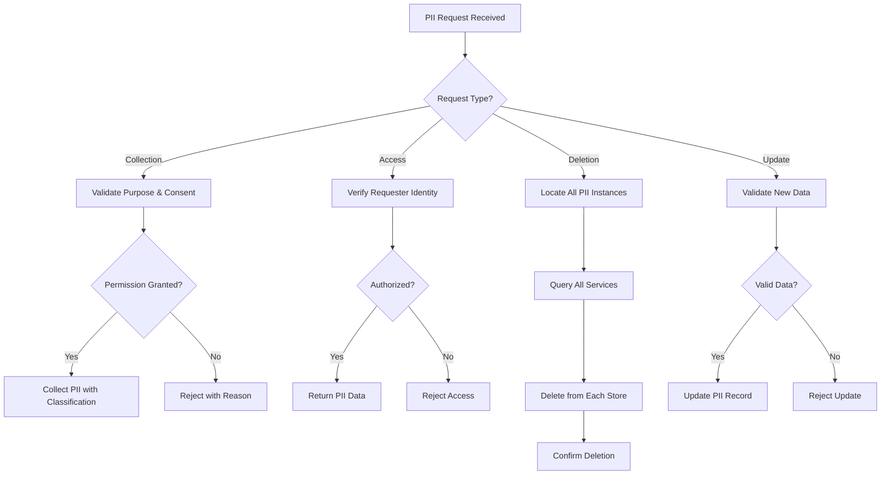

# PII Handling

## Overview

Personally Identifiable Information (PII) refers to any data that can be used to identify, contact, or locate an individual, or to identify an individual in context. PII includes direct identifiers like name, social security number, and passport number, as well as indirect identifiers that could identify someone when combined with other information. Handling PII responsibly is not just a best practice—it is a legal requirement under numerous regulations including GDPR, CCPA, HIPAA, and various industry standards.

In microservices architectures, PII flows between multiple services, making its protection complex. Each service that processes PII becomes a potential point of exposure. Organizations must implement comprehensive PII handling strategies that include data classification, access control, encryption, retention policies, and proper disposal procedures. The goal is to minimize the collection of PII, protect what is collected, and ensure proper handling throughout its lifecycle.

PII handling in microservices requires a privacy-by-design approach where data protection is considered from the initial architecture phase rather than added as an afterthought. This includes implementing data minimization principles (collecting only what's necessary), purpose limitation (using data only for stated purposes), and storage limitation (retaining data only as long as needed). Services should be designed to handle PII in the most secure manner possible while still meeting business requirements.

### Key Concepts

**Data Classification**: Categorizing data based on sensitivity level to determine appropriate protection measures. PII is typically classified as restricted, confidential, or internal. Each classification level defines who can access the data, how it must be protected, and when it should be deleted.

**Data Minimization**: The principle of collecting and processing only the minimum amount of PII necessary for a specific purpose. Services should avoid collecting fields that are not strictly required, and sensitive fields should be evaluated carefully before inclusion in data models.

**Consent Management**: Tracking and managing user consent for PII collection and processing. Under GDPR and similar regulations, organizations must demonstrate that they have valid consent before processing personal data. Consent records must be secure, auditable, and machine-readable.

**Right to Erasure**: The requirement to delete PII upon user request, also known as the "right to be forgotten." Microservices must implement mechanisms to identify and remove all PII associated with a user across all services and data stores.



## Standard Example

The following example demonstrates implementing PII handling in a Node.js microservices environment with classification, consent management, access controls, and deletion capabilities.

```javascript
const crypto = require('crypto');

const PII_CLASSIFICATION = {
    RESTRICTED: 'restricted',
    CONFIDENTIAL: 'confidential',
    INTERNAL: 'internal',
};

const CONSENT_PURPOSE = {
    ESSENTIAL: 'essential',
    ANALYTICS: 'analytics',
    MARKETING: 'marketing',
    PERSONALIZATION: 'personalization',
};

class PIIClassifier {
    static classifyField(fieldName, fieldValue) {
        const restrictedFields = ['ssn', 'passport', 'drivers_license', 'credit_card'];
        const confidentialFields = ['email', 'phone', 'address', 'dob', 'medical'];
        
        if (restrictedFields.some(f => fieldName.toLowerCase().includes(f))) {
            return PII_CLASSIFICATION.RESTRICTED;
        }
        if (confidentialFields.some(f => fieldName.toLowerCase().includes(f))) {
            return PII_CLASSIFICATION.CONFIDENTIAL;
        }
        return PII_CLASSIFICATION.INTERNAL;
    }

    static classifyObject(obj) {
        const classification = {};
        for (const [key, value] of Object.entries(obj)) {
            classification[key] = this.classifyField(key, value);
        }
        return classification;
    }

    static getHighestClassification(classifications) {
        if (Object.values(classifications).includes(PII_CLASSIFICATION.RESTRICTED)) {
            return PII_CLASSIFICATION.RESTRICTED;
        }
        if (Object.values(classifications).includes(PII_CLASSIFICATION.CONFIDENTIAL)) {
            return PII_CLASSIFICATION.CONFIDENTIAL;
        }
        return PII_CLASSIFICATION.INTERNAL;
    }
}

class ConsentManager {
    constructor(options = {}) {
        this.consentStore = new Map();
    }

    async recordConsent(userId, purposes, options = {}) {
        const consentRecord = {
            userId: userId,
            purposes: purposes,
            timestamp: new Date().toISOString(),
            ipAddress: options.ipAddress || null,
            userAgent: options.userAgent || null,
            method: options.method || 'web_form',
            version: options.consentVersion || '1.0',
            withdrawn: false,
            withdrawnAt: null,
        };
        
        this.consentStore.set(userId, consentRecord);
        return consentRecord;
    }

    async getConsent(userId, purpose) {
        const record = this.consentStore.get(userId);
        if (!record || record.withdrawn) {
            return { granted: false, reason: 'No consent or withdrawn' };
        }
        
        const granted = record.purposes.includes(purpose);
        return { granted: granted, record: record };
    }

    async withdrawConsent(userId, purposes) {
        const record = this.consentStore.get(userId);
        if (record) {
            record.withdrawn = true;
            record.withdrawnAt = new Date().toISOString();
            record.withdrawnPurposes = purposes;
        }
        return record;
    }

    async hasValidConsent(userId, requiredPurposes) {
        if (typeof requiredPurposes === 'string') {
            requiredPurposes = [requiredPurposes];
        }
        
        for (const purpose of requiredPurposes) {
            const consent = await this.getConsent(userId, purpose);
            if (!consent.granted) {
                return false;
            }
        }
        return true;
    }
}

class PIIHandler {
    constructor(options = {}) {
        this.classifier = new PIIClassifier();
        this.consentManager = options.consentManager || new ConsentManager();
        this.encryptionKey = options.encryptionKey || crypto.randomBytes(32);
        this.piiStore = new Map();
        this.auditLog = [];
    }

    async handlePII(userId, data, options = {}) {
        const classification = PIIClassifier.classifyObject(data);
        const highestClassification = PIIClassifier.getHighestClassification(classification);
        
        const purposes = options.purposes || [CONSENT_PURPOSE.ESSENTIAL];
        const hasConsent = await this.consentManager.hasValidConsent(userId, purposes);
        
        if (!hasConsent && purposes.length > 0) {
            throw new Error('Insufficient consent for PII processing');
        }

        const piiRecord = {
            id: crypto.randomUUID(),
            userId: userId,
            data: this.encryptPII(data),
            classification: classification,
            highestClassification: highestClassification,
            purposes: purposes,
            createdAt: new Date().toISOString(),
            lastAccessed: null,
            accessCount: 0,
            metadata: {
                source: options.source || 'api',
                retentionPeriod: options.retentionPeriod || '7years',
            },
        };

        this.piiStore.set(piiRecord.id, piiRecord);
        
        this.logAudit('CREATE', userId, piiRecord.id, { classification: highestClassification });
        
        return {
            piiId: piiRecord.id,
            classification: highestClassification,
            createdAt: piiRecord.createdAt,
        };
    }

    encryptPII(data) {
        const iv = crypto.randomBytes(16);
        const cipher = crypto.createCipheriv('aes-256-gcm', this.encryptionKey, iv);
        const encrypted = Buffer.concat([cipher.update(JSON.stringify(data), 'utf8'), cipher.final()]);
        const authTag = cipher.getAuthTag();
        return { ciphertext: encrypted.toString('base64'), iv: iv.toString('base64'), authTag: authTag.toString('base64') };
    }

    decryptPII(encryptedData) {
        const iv = Buffer.from(encryptedData.iv, 'base64');
        const authTag = Buffer.from(encryptedData.authTag, 'base64');
        const ciphertext = Buffer.from(encryptedData.ciphertext, 'base64');
        const decipher = crypto.createDecipheriv('aes-256-gcm', this.encryptionKey, iv);
        decipher.setAuthTag(authTag);
        return JSON.parse(Buffer.concat([decipher.update(ciphertext), decipher.final()]).toString('utf8'));
    }

    async accessPII(piiId, requesterId, purpose) {
        const record = this.piiStore.get(piiId);
        if (!record) {
            throw new Error('PII record not found');
        }

        const hasConsent = await this.consentManager.hasValidConsent(record.userId, purpose);
        if (!hasConsent) {
            this.logAudit('ACCESS_DENIED', requesterId, piiId, { reason: 'No consent' });
            throw new Error('No valid consent for this operation');
        }

        const data = this.decryptPII(record.data);
        
        record.accessCount++;
        record.lastAccessed = new Date().toISOString();
        
        this.logAudit('ACCESS', requesterId, piiId, { purpose: purpose });
        
        return {
            data: data,
            classification: record.classification,
            lastAccessed: record.lastAccessed,
        };
    }

    async deletePII(userId, options = {}) {
        const deletedRecords = [];
        
        for (const [piiId, record] of this.piiStore) {
            if (record.userId === userId) {
                this.piiStore.delete(piiId);
                deletedRecords.push(piiId);
            }
        }

        await this.consentManager.withdrawConsent(userId, Object.values(CONSENT_PURPOSE));
        
        this.logAudit('DELETE', 'system', userId, { recordsDeleted: deletedRecords.length });
        
        return { deletedCount: deletedRecords.length, deletedIds: deletedRecords };
    }

    async deletePIIById(piiId, requesterId) {
        const record = this.piiStore.get(piiId);
        if (!record) {
            return { success: false, reason: 'Not found' };
        }

        this.piiStore.delete(piiId);
        
        this.logAudit('DELETE', requesterId, piiId, { userId: record.userId });
        
        return { success: true, deletedId: piiId };
    }

    logAudit(action, actor, target, details) {
        this.auditLog.push({
            action: action,
            actor: actor,
            target: target,
            details: details,
            timestamp: new Date().toISOString(),
        });
    }

    getAuditLog(filters = {}) {
        let log = this.auditLog;
        
        if (filters.actor) {
            log = log.filter(entry => entry.actor === filters.actor);
        }
        if (filters.target) {
            log = log.filter(entry => entry.target === filters.target);
        }
        if (filters.action) {
            log = log.filter(entry => entry.action === filters.action);
        }
        
        return log;
    }

    getPIIStats() {
        const stats = {
            total: this.piiStore.size,
            classification: { restricted: 0, confidential: 0, internal: 0 },
            byUser: new Map(),
        };

        for (const record of this.piiStore.values()) {
            stats.classification[record.highestClassification]++;
            
            if (!stats.byUser.has(record.userId)) {
                stats.byUser.set(record.userId, 0);
            }
            stats.byUser.set(record.userId, stats.byUser.get(record.userId) + 1);
        }

        return stats;
    }
}

async function demonstratePIIHandling() {
    const piiHandler = new PIIHandler();
    
    console.log('=== Recording Consent ===');
    await piiHandler.consentManager.recordConsent('user-123', [CONSENT_PURPOSE.ESSENTIAL, CONSENT_PURPOSE.ANALYTICS], { method: 'checkbox' });
    const consent = await piiHandler.consentManager.getConsent('user-123', CONSENT_PURPOSE.ANALYTICS);
    console.log('Analytics consent:', consent.granted);

    console.log('\n=== Handling PII ===');
    const piiData = {
        firstName: 'John',
        lastName: 'Doe',
        email: 'john@example.com',
        ssn: '123-45-6789',
        phone: '555-1234',
    };
    
    const piiResult = await piiHandler.handlePII('user-123', piiData, { purposes: [CONSENT_PURPOSE.ANALYTICS] });
    console.log('PII stored with ID:', piiResult.piiId);
    console.log('Classification:', piiResult.classification);

    console.log('\n=== Accessing PII ===');
    const accessedData = await piiHandler.accessPII(piiResult.piiId, 'service-1', [CONSENT_PURPOSE.ANALYTICS]);
    console.log('Accessed data:', accessedData.data);

    console.log('\n=== Audit Log ===');
    const auditLog = piiHandler.getAuditLog();
    console.log('Audit entries:', auditLog.length);

    console.log('\n=== Statistics ===');
    const stats = piiHandler.getPIIStats();
    console.log('Total PII records:', stats.total);
    console.log('Classification breakdown:', stats.classification);
}

if (require.main === module) {
    demonstratePIIHandling().catch(console.error);
}

module.exports = { PIIClassifier, ConsentManager, PIIHandler, PII_CLASSIFICATION, CONSENT_PURPOSE };

## Real-World Examples

### GDPR Consent Management Platform

The General Data Protection Regulation (GDPR) requires explicit consent for processing personal data. Consent management platforms track user consent across services.

```javascript
class GDPRConsentManager {
    constructor(options = {}) {
        this.consentDatabase = options.database;
        this.version = '2.1.1';
    }

    async recordConsent(userId, purposes, legalBasis = 'consent') {
        const consentRecord = {
            id: crypto.randomUUID(),
            userId: userId,
            purposes: purposes,
            legalBasis: legalBasis,
            timestamp: new Date().toISOString(),
            version: this.version,
            proof: null,
            withdrawable: true,
            history: [],
        };

        const existingConsent = await this.consentDatabase.find({ userId });
        if (existingConsent) {
            consentRecord.history = existingConsent.history || [];
            consentRecord.history.push({
                action: 'update',
                timestamp: new Date().toISOString(),
                purposes: purposes,
            });
        }

        await this.consentDatabase.upsert(consentRecord);
        return consentRecord;
    }

    async withdrawConsent(userId, purposes = null) {
        const record = await this.consentDatabase.find({ userId });
        
        if (record) {
            const update = {
                withdrawnAt: new Date().toISOString(),
                withdrawable: false,
            };

            if (purposes) {
                record.withdrawnPurposes = purposes;
            } else {
                record.allWithdrawn = true;
            }

            await this.consentDatabase.update({ userId }, record);
            return true;
        }

        return false;
    }

    async generateDataSubjectAccessRequest(userId) {
        const consents = await this.consentDatabase.find({ userId });
        const data = await Promise.all(consent => this.gatherUserData(userId, consent.purposes));

        return {
            requestId: crypto.randomUUID(),
            userId: userId,
            data: data,
            consents: consents,
            generatedAt: new Date().toISOString(),
        };
    }

    async gatherUserData(userId, purposes) {
        return { userId, purposes, dataCollected: true };
    }

    isConsentValid(consentRecord) {
        if (consentRecord.withdrawnAt) return false;
        if (consentRecord.version !== this.version) return false;
        return true;
    }
}
```

### OneTrust Privacy Management

OneTrust and similar privacy platforms provide centralized PII handling across organizations with support for multiple privacy regulations.

```javascript
class PrivacyRegulationMapper {
    constructor() {
        this.regulations = {
            GDPR: this.mapGDPRRequirements.bind(this),
            CCPA: this.mapCCPARequirements.bind(this),
            HIPAA: this.mapHIPAARequirements.bind(this),
        };
    }

    mapGDPRRequirements(purpose) {
        return {
            lawfulBasis: purpose === 'marketing' ? 'consent' : 'legitimate_interest',
            dataRetention: purpose === 'analytics' ? '2years' : 'indefinite',
            rights: ['access', 'rectification', 'erasure', 'portability'],
            requiresExplicitConsent: purpose === 'marketing',
        };
    }

    mapCCPARequirements(purpose) {
        return {
            optOutRequired: purpose === 'sale',
            doNotSellLink: true,
            dataRetention: 'indefinite',
            categories: ['identifiers', 'commercial'],
        };
    }

    mapHIPAARequirements(purpose) {
        return {
            phiProtection: true,
            minimumNecessary: true,
            auditRequired: true,
            breakGlassAccess: true,
        };
    }

    getRequirements(regulation, purpose) {
        const mapper = this.regulations[regulation];
        return mapper ? mapper(purpose) : {};
    }
}
```

## Output Statement

Proper PII handling is essential for regulatory compliance and protecting individual privacy rights. Microservices architectures must implement comprehensive PII handling that includes data classification, consent management, access controls, encryption, and deletion capabilities. Organizations should adopt a privacy-by-design approach, collecting only necessary data, obtaining proper consent, and enabling users to exercise their rights. Regular privacy impact assessments help identify and mitigate risks associated with PII processing.

## Best Practices

**Classify All Data**: Implement automated data classification to identify PII and determine appropriate protection levels. Classification should occur at data entry and throughout the data lifecycle.

**Implement Consent Management**: Track user consent for all data processing purposes. Make consent granular, verifiable, and easily withdrawable.

**Apply Encryption**: Encrypt PII at rest and in transit. Use strong encryption algorithms and proper key management practices.

**Enable Data Minimization**: Collect only the minimum PII necessary for each purpose. Regularly review data collection practices to eliminate unnecessary fields.

**Implement Right to Erasure**: Ensure you can identify and delete all PII associated with a user across all services and storage systems.

**Maintain Audit Trails**: Log all PII access, processing, and deletion operations. Store audit logs in a secure, tamper-proof location.

**Conduct Privacy Impact Assessments**: Evaluate privacy risks before implementing new features or services that process PII.