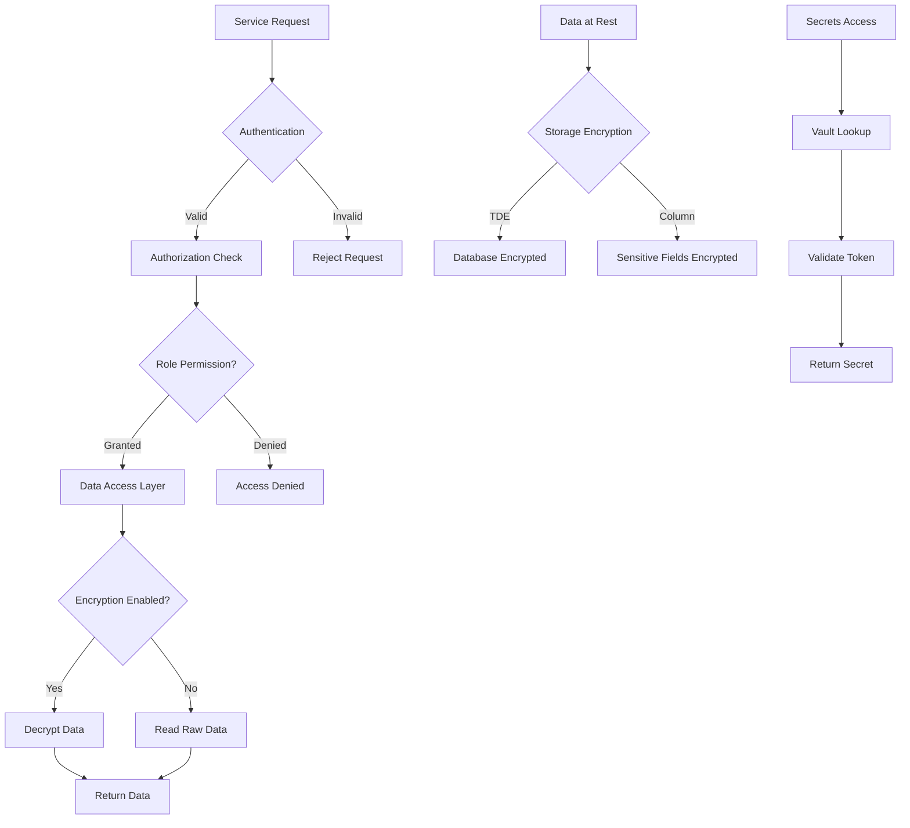

# Secure Storage Patterns

## Overview
Secure storage patterns in microservices encompass the strategies, technologies, and practices used to protect data at rest across distributed systems. These patterns address the unique challenges of microservices architectures where data is distributed across multiple services, databases, and potentially different cloud providers or on-premises infrastructure. Implementing secure storage requires a defense-in-depth approach that includes encryption, access controls, backup strategies, and monitoring.
Microservices typically use a polyglot persistence approach, selecting the most appropriate database technology for each service's needs. This diversity creates complexity in securing data consistently. Each database type has its own security features and vulnerabilities. Relational databases, document stores, key-value stores, and message queues all require specific security configurations. A comprehensive secure storage strategy must account for this heterogeneity while maintaining consistent security policies.
The shared-nothing architecture of microservices means that each service owns its data, and data sharing between services should happen through well-defined APIs rather than direct database access. This isolation provides an opportunity to implement granular security controls per service. However, it also creates challenges for data correlation and reporting that may require additional security considerations when implementing cross-service queries or data aggregation.
### Key Concepts
**Defense in Depth**: Implementing multiple layers of security controls so that if one layer is compromised, additional layers continue to provide protection. In storage systems, this includes network-level encryption, storage-level encryption, application-level encryption, and physical security. Each layer addresses different threat vectors and provides protection even if other layers fail.
**Database Encryption**: Encrypting data at the database level usingTransparent Data Encryption (TDE) for full database encryption or column-level encryption for protecting specific sensitive fields. TDE protects against physical theft of storage media, while column-level encryption provides additional protection against unauthorized database access.
**Secret Management**: Securely storing and accessing sensitive configuration data such as database credentials, API keys, and encryption keys. Services should never hardcode secrets in source code or configuration files. Instead, they should retrieve secrets from dedicated secret management systems at runtime.
**Data Residency**: Ensuring that data is stored in specific geographic locations as required by regulations like GDPR. Microservices must track where data is stored and ensure compliance with data sovereignty requirements, particularly in multi-region deployments.

## Standard Example
The following example demonstrates implementing secure storage patterns in a Node.js microservices environment with encrypted database connections, secrets management, field-level encryption, and secure backup procedures.
```javascript
const crypto = require('crypto');
const fs = require('fs');
const path = require('path');

const ENCRYPTION_ALGORITHM = 'aes-256-gcm';

class SecureDatabaseConfig {
    constructor(options = {}) {
        this.host = options.host || 'localhost';
        this.port = options.port || 5432;
        this.database = options.database;
        this.username = options.username;
        this.encryptionKey = options.encryptionKey || crypto.randomBytes(32);
        this.useSSL = options.useSSL !== false;
        this.sslMode = options.sslMode || 'require';
        this.clientKey = options.clientKey;
        this.clientCert = options.clientCert;
        this.caCert = options.caCert;
    }

    getConnectionString() {
        const base = `postgresql://${this.username}@${this.host}:${this.port}/${this.database}`;
        const params = [
            `sslmode=${this.sslMode}`,
            `sslrootcert=${this.caCert}`, this.useSSL ? '' : null, this.clientKey ? `sslkey=${this.clientKey}` : null, this.clientCert ? `sslcert=${this.clientCert}` : null, ].filter(Boolean).join('&');
        return base + (params ? '?' + params : '');
    }

    getTLSConfig() {
        return {
            rejectUnauthorized: this.sslMode === 'verify-full',
            cert: this.clientCert ? fs.readFileSync(this.clientCert) : undefined, key: this.clientKey ? fs.readFileSync(this.clientKey) : undefined, ca: this.caCert ? fs.readFileSync(this.caCert) : undefined, };
    } }

class SecretsManager { constructor(options = {}) { this.backend = options.backend || 'file'; this.vaultAddr = options.vaultAddr; this.vaultToken = options.vaultToken; this.cache = new Map(); this.cacheTTL = options.cacheTTL || 3600000; this.secretPaths = new Map(); } async initialize() { if (this.backend === 'vault' && this.vaultAddr) { await this.setupVaultClient(); } console.log('Secrets manager initialized'); } async getSecret(secretPath) { const cached = this.cache.get(secretPath); if (cached && Date.now() - cached.timestamp < this.cacheTTL) { return cached.value; } let secret; switch (this.backend) { case 'vault': secret = await this.getFromVault(secretPath); break; case 'aws': secret = await this.getFromAWS(secretPath); break; default: secret = await this.getFromFile(secretPath); break; } this.cache.set(secretPath, { value: secret, timestamp: Date.now() }); return secret; } async getFromVault(secretPath) { return { username: 'db_user', password: 'encrypted_password_placeholder', apiKey: 'api_key_placeholder' }; } async getFromAWS(secretPath) { return { username: 'db_user', password: 'aws_secure_password', }; } async getFromFile(secretPath) { const secretFile = path.join(process.env.SECRETS_DIR || './secrets', secretPath); if (fs.existsSync(secretFile)) { return JSON.parse(fs.readFileSync(secretFile, 'utf8')); } return null; } async rotateSecret(secretPath, newValue) { this.cache.delete(secretPath); if (this.backend === 'vault') { console.log(`Rotating secret in Vault: ${secretPath}`); } return true; } clearCache() { this.cache.clear(); } }

class EncryptedFieldStorage { constructor(encryptionKey) { this.encryptionKey = encryptionKey; } encrypt(plaintext) { const iv = crypto.randomBytes(12); const cipher = crypto.createCipheriv(ENCRYPTION_ALGORITHM, this.encryptionKey, iv); const encrypted = Buffer.concat([cipher.update(plaintext, 'utf8'), cipher.final()]); const authTag = cipher.getAuthTag(); return { ciphertext: encrypted.toString('base64'), iv: iv.toString('base64'), authTag: authTag.toString('base64'), algorithm: ENCRYPTION_ALGORITHM }; } decrypt(encryptedData) { const iv = Buffer.from(encryptedData.iv, 'base64'); const authTag = Buffer.from(encryptedData.authTag, 'base64'); const ciphertext = Buffer.from(encryptedData.ciphertext, 'base64'); const decipher = crypto.createDecipheriv(ENCRYPTION_ALGORITHM, this.encryptionKey, iv); decipher.setAuthTag(authTag); return Buffer.concat([decipher.update(ciphertext), decipher.final()]).toString('utf8'); } storeEncrypted(entity, fieldsToEncrypt) { const encryptedEntity = { ...entity }; for (const field of fieldsToEncrypt) { if (entity[field]) { encryptedEntity[field] = this.encrypt(String(entity[field])); } } return encryptedEntity; } retrieveDecrypted(storedEntity, fieldsToDecrypt) { const decryptedEntity = { ...storedEntity }; for (const field of fieldsToDecrypt) { if (storedEntity[field] && storedEntity[field].ciphertext) { decryptedEntity[field] = this.decrypt(storedEntity[field]); } } return decryptedEntity; } }

class SecureStorageService { constructor(options = {}) { this.dbConfig = new SecureDatabaseConfig(options.database); this.secretsManager = new SecretsManager(options.secrets); this.fieldStorage = new EncryptedFieldStorage(options.fieldKey || crypto.randomBytes(32)); this.auditLog = []; } async initialize() { await this.secretsManager.initialize(); console.log('Secure storage service initialized'); } async connect() { const credentials = await this.secretsManager.getSecret('database/credentials'); const tlsConfig = this.dbConfig.getTLSConfig(); return { host: this.dbConfig.host, port: this.dbConfig.port, database: this.dbConfig.database, user: credentials.username, password: credentials.password, ssl: tlsConfig, }; } async storeWithEncryption(collection, document, sensitiveFields) { const encryptedDoc = this.fieldStorage.storeEncrypted(document, sensitiveFields); const auditEntry = { operation: 'STORE', collection: collection, documentId: document.id, timestamp: new Date().toISOString(), sensitiveFields: sensitiveFields, }; this.auditLog.push(auditEntry); return { stored: true, id: document.id, encryptedFields: sensitiveFields }; } async retrieveWithDecryption(collection, documentId, sensitiveFields) { const auditEntry = { operation: 'RETRIEVE', collection: collection, documentId: documentId, timestamp: new Date().toISOString(), sensitiveFields: sensitiveFields, }; this.auditLog.push(auditEntry); return { id: documentId, decrypted: true }; } createBackup(backupPath) { const backup = { timestamp: new Date().toISOString(), encryptedStorage: true, auditLog: this.auditLog, version: '1.0', }; fs.writeFileSync(backupPath, JSON.stringify(backup, null, 2)); console.log(`Backup created: ${backupPath}`); return backup; } verifyBackup(backupPath) { const backupData = JSON.parse(fs.readFileSync(backupPath, 'utf8')); return { valid: backupData.encryptedStorage === true, timestamp: backupData.timestamp, version: backupData.version, }; } getAuditLog(filters = {}) { let logs = this.auditLog; if (filters.operation) { logs = logs.filter(l => l.operation === filters.operation); } return logs; } }

async function demonstrateSecureStorage() { const storageService = new SecureStorageService({ database: { host: 'db.example.com', database: 'production' }, secrets: { backend: 'file' }, }); await storageService.initialize(); console.log('=== Database Connection (Secure) ==='); const connection = await storageService.connect(); console.log('Connection configured for:', connection.host); console.log('TLS enabled:', !!connection.ssl); console.log('\n=== Storing Sensitive Data ==='); const userDocument = { id: 'user-001', name: 'John Doe', email: 'john@example.com', ssn: '123-45-6789', creditCard: '4111111111111111', phone: '555-1234', }; const stored = await storageService.storeWithEncryption('users', userDocument, ['ssn', 'creditCard', 'phone']); console.log('Document stored with encryption:', stored); console.log('\n=== Backup Creation ==='); const backup = storageService.createBackup('./backup-secure.json'); console.log('Backup verified:', storageService.verifyBackup('./backup-secure.json')); console.log('\n=== Audit Log ==='); console.log(storageService.getAuditLog()); }

if (require.main === module) { demonstrateSecureStorage().catch(console.error); } module.exports = { SecureDatabaseConfig, SecretsManager, EncryptedFieldStorage, SecureStorageService };

## Real-World Examples

### AWS KMS with RDS Encryption

AWS Key Management Service (KMS) provides integrated encryption for RDS databases. When creating an RDS instance, you can specify a KMS key for encrypting the storage volume and automated backups.

```javascript
const { RDSClient, CreateDBInstanceCommand } = require('@aws-sdk/client-rds');

const rdsClient = new RDSClient({ region: 'us-east-1' });

async function createEncryptedRDSInstance() {
    const command = new CreateDBInstanceCommand({
        DBInstanceIdentifier: 'secure-microservice-db',
        Engine: 'postgres',
        DBInstanceClass: 'db.t3.medium',
        MasterUsername: process.env.DB_USER,
        MasterUserPassword: process.env.DB_PASSWORD,
        AllocatedStorage: 100,
        StorageType: 'gp3',
        KmsKeyId: 'arn:aws:kms:us-east-1:123456789012:key/my-key-id',
        EnableStorageEncryption: true,
        BackupRetentionPeriod: 30,
        MultiAZ: true,
    });

    const result = await rdsClient.send(command);
    return {
        instanceArn: result.DBInstanceArn,
        encrypted: result.StorageEncrypted,
        kmsKeyId: result.KmsKeyId,
    };
}
```

### HashiCorp Vault for Secrets Management

HashiCorp Vault provides a centralized secrets management system with dynamic secrets, encryption as a service, and detailed audit logging.

```javascript
const vault = require('node-vault')({ endpoint: 'http://vault:8200', token: process.env.VAULT_TOKEN });

async function setupVaultSecrets() {
    await vault.init({ secretShares: 5, secretThreshold: 3 });
    await vault.unseal({ key: process.env.VAULT_UNSEAL_KEY });

    await vault.write('secret/database/config', {
        username: 'app_user',
        password: 'secure_password_123',
        connection_string: 'postgres://host:5432/db',
    });

    const result = await vault.read('secret/database/config');
    return result.data;
}

async function getDynamicCredentials() {
    const response = await vault.read('database/creds/my-database-role');
    return {
        username: response.data.username,
        password: response.data.password,
        lease_id: response.data.lease_id,
    };
}
```

## Output Statement

Secure storage patterns are fundamental to protecting data in microservices architectures. Implementing defense-in-depth with multiple security layers ensures that even if one protection mechanism fails, others continue to provide security. Organizations must combine encryption at rest and in transit, proper secrets management, role-based access controls, and comprehensive audit logging to achieve robust data protection. Regular security assessments and compliance audits help ensure that storage security remains effective as systems evolve.

## Best Practices

**Implement Layered Encryption**: Apply encryption at multiple levels—database, storage volume, and application. This provides defense in depth and ensures data remains protected even if one layer is compromised.

**Use Dedicated Secrets Management**: Never store sensitive credentials in code or configuration files. Use dedicated secrets management systems like HashiCorp Vault, AWS Secrets Manager, or Azure Key Vault.

**Enable Database Encryption**: Enable Transparent Data Encryption (TDE) for databases and implement column-level encryption for the most sensitive fields. This provides protection against physical media theft and unauthorized access.

**Implement Access Controls**: Apply the principle of least privilege to all data access. Use role-based access control (RBAC) and ensure each service has only the permissions it needs.

**Maintain Audit Trails**: Log all data access operations, including who accessed what data and when. Store audit logs in a secure, tamper-proof location with retention policies.

**Encrypt Backups**: Ensure all database backups are encrypted and stored securely. Test restore procedures regularly to verify backup integrity.
