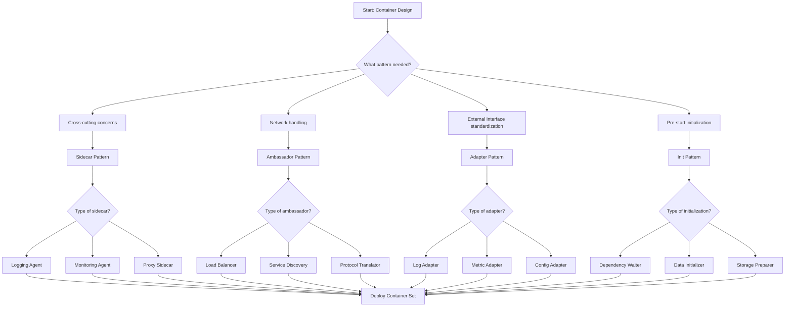

# Docker Container Patterns

## Overview

### What Are Docker Container Patterns?

Docker container patterns provide proven architectural approaches for building, packaging, and deploying microservices applications using container technology. These patterns address common challenges in containerized environments, including image optimization, process management, configuration handling, and inter-container communication. Understanding and applying these patterns enables developers to create robust, scalable, and maintainable containerized applications.

The term "container pattern" encompasses both design patterns for constructing container images and operational patterns for running containers in production environments. Design patterns focus on how to structure Dockerfiles, optimize image layers, and organize application code within containers. Operational patterns address how to manage container lifecycles, handle logging, manage secrets, and implement health checks.

### Core Container Concepts

Containers represent lightweight virtualization technology that packages an application with its dependencies into a standalone executable unit. Unlike traditional virtual machines that include a complete operating system, containers share the host kernel and use cgroups and namespaces for isolation. This approach provides near-native performance while ensuring consistency across development, testing, and production environments.

Docker containers operate as isolated processes in the host system, each with its own filesystem, network namespace, and process tree. The container image serves as a read-only template from which containers are instantiated. When a container starts, Docker creates a writable layer on top of the image layers, where all file modifications during container runtime are stored.

### Importance in Microservices Architecture

Container patterns become essential in microservices architectures where applications consist of multiple independently deployable services. Each microservice runs in its own container, enabling isolation, independent scaling, and technology diversity. Containers provide the foundation for container orchestration platforms like Kubernetes, which extend these patterns to enable automated deployment, scaling, and management of containerized applications.

The benefits of container patterns in microservices include consistent packaging across different programming languages and frameworks, efficient resource utilization through density packing, easy horizontal scaling by adding container replicas, and simplified deployment through immutable container images. These patterns also support microservices best practices like configuration externalization, health monitoring, and graceful shutdown.

### Common Docker Container Patterns

Several container patterns have emerged as industry standards for building containerized applications:

**Sidecar Pattern**: Extends container functionality by deploying additional containers alongside the main application container. Common uses include log shipping, monitoring agents, and proxy sidecars that handle cross-cutting concerns separate from the main application code.

**Ambassador Pattern**: Delegates network communication responsibilities to a separate container that handles service discovery, load balancing, or protocol translation. This pattern separates networking concerns from application logic, enabling technology flexibility.

**Adapter Pattern**: Standardizes external interfaces by wrapping application containers with adapter containers that provide consistent APIs for monitoring, logging, or configuration. This pattern enables heterogeneous applications to work with homogeneous infrastructure interfaces.

**Init Pattern**: Uses specialized init containers to perform setup tasks before application containers start, such as waiting for dependencies, initializing shared storage, or populating configuration data.

### Key Design Principles

When designing containerized applications, several principles guide pattern selection and implementation. Containers should be single-process by design, with each container running one primary process. This simplicity enables proper signal handling, clear resource accounting, and straightforward health monitoring. Multi-process containers complicate initialization, shutdown sequences, and resource attribution.

Immutable containers represent another key principle—containers should not be modified after deployment. All configuration should be externalized through environment variables or mounted configuration files. This immutability enables reliable deployments, easy rollback procedures, and consistent behavior across environments. When changes are needed, new container images are built and deployed, replacing existing containers.

Additionally, containers should be minimal in size and scope. Multi-stage builds reduce final image size by copying only necessary artifacts. Small images reduce security attack surfaces, improve deployment times, and decrease storage requirements. Minimal containers also start faster, improving application responsiveness and Kubernetes pod readiness times.

## Flow Chart: Container Pattern Selection



Pattern selection depends on the specific requirement. Sidecar patterns address cross-cutting concerns that should remain separate from application logic. Ambassador patterns handle network communication complexity. Adapter patterns standardize heterogeneous application interfaces. Init patterns perform pre-runtime setup operations.

---

## Standard Example

### Building a Multi-Container Application

Consider an e-commerce product service that uses multiple container patterns:

```dockerfile
# Product Service - Multi-stage Build Dockerfile

# Build stage
FROM node:20-alpine AS builder
WORKDIR /app

# Install dependencies
COPY package*.json ./
RUN npm ci --only=production

# Copy source code
COPY src ./src
COPY tsconfig.json ./

# Compile TypeScript
RUN npm run build

# Production stage - minimal final image
FROM node:20-alpine AS production

# Create non-root user for security
RUN addgroup -g 1001 -S appgroup && \
    adduser -u 1001 -S appuser -G appgroup

# Set working directory
WORKDIR /app

# Change ownership of app directory
RUN chown -R appuser:appgroup /app

# Copy only necessary files from builder
COPY --from=builder --chown=appuser:appgroup /app/dist ./dist
COPY --from=builder --chown=appuser:appgroup /app/node_modules ./node_modules
COPY --from=builder --chown=appuser:appgroup /app/package*.json ./

# Environment configuration through args
ARG VERSION=unknown
ARG BUILD_TIME=unknown
ENV APP_VERSION=${VERSION}
ENV BUILD_TIME=${BUILD_TIME}

# Switch to non-root user
USER appuser

# Expose application port
EXPOSE 3000

# Health check
HEALTHCHECK --interval=30s --timeout=3s --start-period=5s --retries=3 \
    CMD node -e "require('http').get('http://localhost:3000/health', (r) => process.exit(r.statusCode === 200 ? 0 : 1))"

# Start application
CMD ["node", "dist/main.js"]
```

### Docker Compose for Pattern Composition

```yaml
# docker-compose.yml - Product Service with Patterns

version: '3.8'

services:
  # Product service - main application
  product-service:
    build:
      context: .
      dockerfile: Dockerfile
    ports:
      - "3000:3000"
    environment:
      - NODE_ENV=production
      - DATABASE_URL=postgresql://db:5432/products
      - REDIS_URL=redis://cache:6379
    depends_on:
      product-db:
        condition: service_healthy
      cache:
        condition: service_started
    networks:
      - product-network
    healthcheck:
      test: ["CMD", "node", "-e", "require('http').get('http://localhost:3000/health', (r) => process.exit(r.statusCode === 200 ? 0 : 1))"]
      interval: 30s
      timeout: 10s
      retries: 3
      start_period: 10s

  # Ambassador - service discovery and load balancing
  product-ambassador:
    image: envoyproxy/envoy:v1.25.0
    volumes:
      - ./envoy-config.yaml:/etc/envoy/envoy.yaml:ro
    ports:
      - "3001:3001"
      - "3002:3002"
    network_mode: service:product-service
    depends_on:
      - product-service

  # Sidecar - logging agent
  product-log-shipper:
    image: fluent/fluentd:v1.16
    volumes:
      - ./fluentd.conf:/etc/fluent/fluent.conf:ro
      - /var/lib/docker/containers:/var/lib/docker/containers:ro
    depends_on:
      - product-service
    networks:
      - product-network
    environment:
      - FLUENTD_ARGS=--no-supervisor

  # Adapter - metrics export
  product-metrics-adapter:
    image: prometheus/node-exporter:v1.6.1
    command:
      - --path.procfs=/host/proc
      - --path.sysfs=/host/sys
      - --collector.filesystem.ignored-mount-points=^/(sys|proc|dev|host|etc)($$|/)
    ports:
      - "9100:9100"
    networks:
      - product-network
    volumes:
      - /proc:/host/proc:ro
      - /sys:/host/sys:ro
      - /:/rootfs:ro

  # Init container - wait for database
  product-init:
    image: busybox:1.36
    command:
      - /bin/sh
      - -c
      - |
        echo "Waiting for database to be ready..."
        until nc -z product-db 5432; do
          echo "Database unavailable - waiting"
          sleep 2
        done
        echo "Database is ready"
    depends_on:
      product-db:
        condition: service_healthy

  # PostgreSQL database
  product-db:
    image: postgres:15-alpine
    environment:
      - POSTGRES_DB=products
      - POSTGRES_USER=productuser
      - POSTGRES_PASSWORD_FILE=/run/secrets/db-password
    volumes:
      - product-data:/var/lib/postgresql/data
    networks:
      - product-network
    healthcheck:
      test: ["CMD-SHELL", "pg_isready -U productuser -d products"]
      interval: 10s
      timeout: 5s
      retries: 5
    secrets:
      - db-password

  # Redis cache
  cache:
    image: redis:7-alpine
    networks:
      - product-network
    command: redis-server --appendonly yes
    volumes:
      - redis-data:/data

networks:
  product-network:
    driver: bridge

volumes:
  product-data:
  redis-data:

secrets:
  db-password:
    file: ./secrets/db-password.txt
```

### Code Explanation

The Dockerfile demonstrates several key container pattern principles. Multi-stage builds separate the build environment from the runtime environment, resulting in smaller, more secure final images. The Alpine base image provides a minimal Linux distribution, reducing the attack surface. Creating a non-root user follows security best practices by avoiding container privilege escalation.

Multi-stage builds copy only essential artifacts to the production stage. The `--from=builder` flag copies compiled JavaScript from the build stage without including source code or build tools. This separation enables developers to build with full tooling while deploying minimal images.

The Docker Compose configuration demonstrates container pattern composition. The main product service container runs the application. An ambassador container provides Envoy proxy functionality. A sidecar container runs Fluentd for log aggregation. An adapter container runs Prometheus node exporter for metrics collection. An init container waits for database readiness before the main service starts.

---

## Real-World Example 1: Netflix Content Platform

### Netflix Implementation

Netflix operates one of the world's largest microservices platforms, with container patterns enabling their global content delivery infrastructure:

```dockerfile
# Netflix Open Connect Storage - Multi-tier Storage Service

# Build stage with full tooling
FROM maven:3.8-eclipse-temurin-17 AS builder

WORKDIR /build

# Copy Maven dependency files first for layer caching
COPY pom.xml pom.xml
RUN mvn dependency:go-offline -B

# Copy source code
COPY src ./src

# Build application
RUN mvn package -DskipTests -B

# Production stage - minimal JRE image
FROM eclipse-temurin:17-jre-alpine

# Create dedicated user
RUN addgroup -g 1000 -S nacs && \
    adduser -u 1000 -S nacs -G nacs

WORKDIR /app

# Copy built artifact
COPY --from=builder /build/target/*.jar app.jar

# JVM configuration for containerized environments
ENV JAVA_OPTS="-XX:+UseContainerSupport -XX:MaxRAMPercentage=75.0 -XX:+UseG1GC"

# Expose JMX metrics port
EXPOSE 8080 9090

# Health check endpoint
HEALTHCHECK --interval=30s --timeout=5s --start-period=30s --retries=3 \
    CMD wget -q --spider http://localhost:8080/actuator/health || exit 1

# Run as non-root user
USER nacs

ENTRYPOINT ["sh", "-c", "java $JAVA_OPTS -jar app.jar"]
```

### Netflix Container Pattern Architecture

Netflix implements container patterns extensively in their Open Connect platform, which delivers video content to over 230 million subscribers globally:

**Sidecar Pattern for Video Caching**: Each storage node runs a video cache sidecar alongside the main storage service. The sidecar handles prefetching popular content from origin servers, managing local cache eviction, and reporting cache statistics. This separation allows the main storage service to focus on data serving while the sidecar handles caching logic.

**Init Pattern for Disk Preparation**: Init containers prepare local storage disks before the main storage service starts. This includes mounting RAID arrays, creating filesystem structures, and initializing cache metadata. The init pattern ensures storage is ready before the application attempts to use it.

**Ambassador Pattern for Origin Routing**: Netflix uses ambassador containers to route content requests to appropriate origin servers based on geographic location and content availability. The ambassador handles load balancing across multiple origin servers and provides fallback routing when primary origins are unavailable.

---

## Real-World Example 2: Kubernetes Pod Patterns

### Kubernetes Implementation

Kubernetes extends Docker container patterns through the Pod abstraction, enabling multi-container deployment:

```yaml
# Kubernetes Pod - Product Service with Container Patterns

apiVersion: v1
kind: Pod
metadata:
  name: product-service-pod
  labels:
    app: product-service
    version: v1
spec:
  # Init container - wait for dependencies
  initContainers:
    - name: product-init
      image: busybox:1.36
      command:
        - sh
        - -c
        - |
          echo "Waiting for database..."
          until nc -z product-db.default.svc.cluster.local 5432; do
            echo "Database not ready, waiting..."
            sleep 5
          done
          echo "Database ready!"
      resources:
        requests:
          cpu: "10m"
          memory: "16Mi"
        limits:
          cpu: "100m"
          memory: "64Mi"

  # Main application container
  containers:
    # Main product service
    - name: product-service
      image: myregistry/product-service:v1.2.3
      ports:
        - containerPort: 3000
          name: http
          protocol: TCP
        - containerPort: 9090
          name: metrics
          protocol: TCP
      env:
        - name: DATABASE_URL
          valueFrom:
            configMapKeyRef:
              name: product-config
              key: database.url
        - name: REDIS_URL
          valueFrom:
            configMapKeyRef:
              name: product-config
              key: redis.url
        - name: API_KEY
          valueFrom:
            secretKeyRef:
              name: product-secrets
              key: api-key
      resources:
        requests:
          cpu: "100m"
          memory: "256Mi"
        limits:
          cpu: "500m"
          memory: "512Mi"
      volumeMounts:
        - name: cache-volume
          mountPath: /app/cache
      livenessProbe:
        httpGet:
          path: /health
          port: 3000
        initialDelaySeconds: 30
        periodSeconds: 10
        timeoutSeconds: 3
        failureThreshold: 3
      readinessProbe:
        httpGet:
          path: /ready
          port: 3000
        initialDelaySeconds: 5
        periodSeconds: 5
        timeoutSeconds: 2
        failureThreshold: 2

    # Sidecar - log shipper
    - name: fluentd-sidecar
      image: fluent/fluentd:v1.16-kubernetes
      env:
        - name: FLUENTD_ARGS
          value: "--no-supervisor"
        - name: FLUENT_HOST
          value: "fluentd.elastic.svc.cluster.local"
        - name: FLUENT_PORT
          value: "24224"
      volumeMounts:
        - name: log-volume
          mountPath: /var/log/app
          readOnly: true
      resources:
        requests:
          cpu: "50m"
          memory: "64Mi"
        limits:
          cpu: "100m"
          memory: "128Mi"

    # Adapter - metrics exporter
    - name: prometheus-adapter
      image: prometheus/statsd-exporter:v0.24.0
      args:
        - --statsd.mapping-config=/config/statsd.conf
      ports:
        - containerPort: 9102
          name: statsd
          protocol: TCP
      volumeMounts:
        - name: statsd-config
          mountPath: /config
      resources:
        requests:
          cpu: "10m"
          memory: "32Mi"
        limits:
          cpu: "50m"
          memory: "64Mi"

  # Shared volumes
  volumes:
    - name: cache-volume
      emptyDir: {}
    - name: log-volume
      emptyDir: {}
    - name: statsd-config
      configMap:
        name: product-statsd-config

  # Restart policy
  restartPolicy: Always
```

### Architecture Explanation

Kubernetes Pods enable native implementation of container patterns through multi-container pods:

**Init Containers**: The init container ensures external dependencies are available before the main application starts. In this example, it waits for the PostgreSQL database to be ready by polling the service endpoint. This approach prevents application startup failures due to unavailable dependencies and provides clear error messages during dependency issues.

**Sidecar Containers**: The Fluentd sidecar collects application logs and forwards them to a centralized logging infrastructure. Sidecars run alongside the main container and share the same network namespace, enabling local communication. The sidecar pattern keeps logging concerns separate from application logic.

**Adapter Containers**: The Prometheus statsd adapter exports application metrics in a standardized format for Prometheus scraping. Adapter containers translate application-specific metrics into infrastructure-standard formats, enabling heterogeneous applications to work with standard monitoring infrastructure.

---

## Best Practices

### Container Image Optimization

**Use Multi-Stage Builds**: Separate build and runtime environments to create minimal production images. Multi-stage builds copy only necessary artifacts, significantly reducing image size and attack surface. Build stages can include full tooling while production stages contain only runtime dependencies.

**Layer Caching Strategy**: Order Dockerfile instructions from least frequently changed to most frequently changed. Package installation changes infrequently and should come first. Source code changes frequently and should come last. This ordering maximizes layer reuse during builds.

**Minimal Base Images**: Use Alpine-based or distroless images to reduce size. Smaller images download faster, start faster, and present smaller attack surfaces. Verify base images are actively maintained and receive security updates.

**Remove Build Tools**: Production images should never contain build tools, compilers, or source code. These artifacts increase size and potentially introduce vulnerabilities. Use multi-stage builds to ensure only compiled artifacts reach production.

### Security Best Practices

**Run as Non-Root**: Always run containers as non-root users. Root user inside a container has root privileges on the host if container isolation is compromised. Create dedicated users in Dockerfiles using useradd or adduser commands.

**Read-Only Filesystems**: Make container filesystems read-only where possible. This prevents runtime modifications and forces configuration through external mechanisms. Use volumes for writable directories that require modification.

**Capability Management**: Drop all capabilities and add only required ones. The default capability set is too broad for most applications. Use the --cap-drop and --cap-add flags to minimize container privileges.

### Operational Best Practices

**Health Checks**: Implement liveness and readiness probes for all production containers. Liveness probes detect hung containers requiring restart. Readiness probes indicate when containers can receive traffic.

**Resource Limits**: Always set CPU and memory limits. Without limits, containers can consume all available resources, affecting cluster stability. Set requests for scheduling and limits for enforcement.

**Log Management**: Use structured logging and route logs to stdout/stderr. Container runtimes capture these streams for centralized log aggregation. Avoid logging to files, which requires additional sidecar configuration.

### Anti-Patterns to Avoid

**Don't Include Secrets in Images**: Never bake secrets into container images. Images are stored in registries with potentially broad access. Use external secrets management through environment variables or mounted secrets.

**Avoid Latest Tags**: Always use specific version tags. Latest tags cause unpredictable deployments and make rollback difficult. Pin versions in production and test with specific versions.

**Don't Run Multiple Services**: Run one primary process per container. Multiple processes complicate signal handling, process monitoring, and log attribution. Use separate containers for separate concerns.

---

## Additional Resources

### Learning More About Container Patterns

**Container Design Patterns**:
- Docker official documentation on best practices
- Google's Container Design Patterns paper
- Microsoft's container patterns research

**Tools and References**:
- Docker BuildKit for optimized builds
- Hadolint for Dockerfile linting
- Container structure tests

**Community Resources**:
- Docker Community Slack
- Container days and conferences
- CNCF TAG for containers