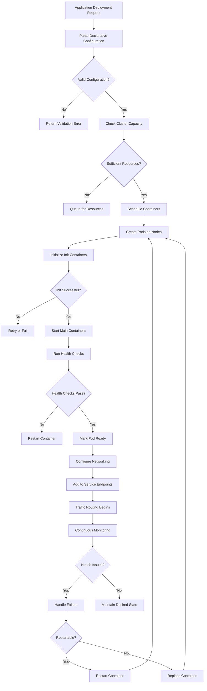

# Container Orchestration

## Overview

### What Is Container Orchestration?

Container orchestration refers to the automated management of containerized applications, including deployment, scaling, networking, load balancing, and availability. Orchestration platforms handle the complexity of running containers across multiple hosts, managing their lifecycles, handling service discovery, and ensuring applications remain available despite failures. In microservices architectures, orchestration becomes essential as applications grow from single containers to hundreds or thousands of containers across clusters.

The need for orchestration emerged from the challenges of running containerized applications at scale. While Docker provides excellent tools for building and running individual containers, managing thousands of containers across multiple hosts requires additional tooling. Orchestration platforms address challenges including scheduling containers across hosts based on resource requirements, maintaining desired state through failures and scaling events, providing service discovery for dynamic container addressing, and managing networking between containers.

Early orchestration solutions included Docker Swarm, Apache Mesos, and Nomad. Kubernetes emerged as the dominant platform, driven by Google's experience with internal container management (Borg system), extensive community contribution, and comprehensive feature coverage. Today, Kubernetes serves as the foundation for most production microservice deployments.

### Core Orchestration Concepts

Orchestration platforms operate through several fundamental concepts that enable automated container management:

**Cluster Management**: A cluster consists of multiple nodes (servers) that run containers. Orchestrators schedule work across nodes based on resource availability and policies. Nodes can be virtual or physical, on-premises or cloud-based. Clusters provide the computational capacity for running containerized applications.

**Scheduling and Placement**: Orchestrators determine where containers run within clusters. Scheduling considers resource requirements (CPU, memory), node capacity, affinity/anti-affinity rules, and organizational policies. Good scheduling improves resource utilization while meeting performance and availability requirements.

**Service Discovery**: Container IP addresses change as containers restart and reschedule. Service discovery provides stable addresses for reaching containers, enabling dynamic communication. Discovery mechanisms include DNS-based discovery, service meshes, and centralized registries.

**Replication and Scaling**: Orchestrators maintain specified numbers of container replicas. When replicas decrease (due to failures), orchestrators start new containers. When load increases, orchestrators add replicas to handle traffic. Scaling can be manual or automatic (horizontal pod autoscaling).

**Health Monitoring and Recovery**: Orchestrators continuously monitor container health through health checks and system metrics. Unhealthy containers are restarted or replaced. Failed nodes are recognized and workload is rescheduled to healthy nodes.

### Orchestration Platform Comparison

Several orchestration platforms compete in the container orchestration space, each with distinct characteristics:

**Kubernetes**: The dominant platform, originally developed at Google and now hosted by the Cloud Native Computing Foundation (CNCF). Kubernetes provides comprehensive features, extensive ecosystem, and cloud provider managed services (EKS, GKE, AKS). Its declarative configuration model and Custom Resource Definitions enable extensive customization.

**Docker Swarm**: Docker's native orchestration, offering simpler setup and operation compared to Kubernetes. Swarm provides easy-to-use commands, integrated Docker CLI experience, and built-in load balancing. However, it lacks Kubernetes' extensive ecosystem and customization capabilities.

**Apache Mesos**: Originally designed for cluster resource management, Mesos supports container orchestration through Marathon framework. Mesos excels at high-scale deployments with multiple workload types, including both containers and traditional workloads. It offers fine-grained resource control and supports hybrid deployments.

**Nomad**: HashiCorp's simple, flexible orchestration platform. Nomad provides a single binary deployment, easy configuration, and support for diverse workloads including containers, virtual machines, and standalone applications. Its simplicity appeals to organizations seeking basic orchestration without Kubernetes complexity.

### Orchestration in Microservices

Container orchestration provides critical capabilities for microservices architectures:

**Independent Deployment**: Microservices can be deployed, scaled, and updated independently. Orchestrators maintain service availability during updates through rolling updates, canary deployments, and blue-green deployments. Failures affect only the updating service.

**Dynamic Scaling**: Individual services scale based on their load characteristics. An e-commerce site might scale product catalog service heavily while keeping payment service at baseline capacity. Orchestrators handle scaling automatically through horizontal pod autoscaling.

**Failure Isolation**: Service failures are isolated through container boundaries. Orchestrators restart failed containers and reschedule workload from failed nodes. Individual service failures don't cascade to the entire system.

**Network Management**: Service mesh capabilities provide sophisticated routing, load balancing, and security between services. Orchestrators or associated service meshes (Istio, Linkerd) manage mTLS, traffic splitting, and retry policies.

## Flow Chart: Orchestration Workflow



The orchestration workflow begins with deployment requests in declarative configuration. The system validates configuration, checks cluster capacity, and schedules containers on appropriate nodes. Containers progress through init, main, and health check phases. Once healthy, containers receive traffic through service endpoints. Continuous monitoring maintains desired state through restarts and replacements.

---

## Standard Example

### Kubernetes Deployment Configuration

```yaml
# Kubernetes Deployment - Product Service Orchestration

apiVersion: apps/v1
kind: Deployment
metadata:
  name: product-service
  namespace: production
  labels:
    app: product-service
    version: v1.2.3
spec:
  # Replica configuration
  replicas: 3
  selector:
    matchLabels:
      app: product-service
  # Rolling update strategy
  strategy:
    type: RollingUpdate
    rollingUpdate:
      maxSurge: 1
      maxUnavailable: 0
  # Pod template specification
  template:
    metadata:
      labels:
        app: product-service
        version: v1.2.3
    spec:
      # Scheduling preferences
      affinity:
        podAntiAffinity:
          preferredDuringSchedulingIgnoredDuringExecution:
            - weight: 100
              podAffinityTerm:
                labelSelector:
                  matchLabels:
                    app: product-service
                topologyKey: kubernetes.io/hostname
      # Container configuration
      containers:
        - name: product-service
          image: myregistry/product-service:v1.2.3
          imagePullPolicy: Always
          ports:
            - containerPort: 3000
              name: http
              protocol: TCP
            - containerPort: 9090
              name: metrics
              protocol: TCP
          # Resource requirements
          resources:
            requests:
              cpu: "100m"
              memory: "256Mi"
            limits:
              cpu: "500m"
              memory: "512Mi"
          # Environment variables
          env:
            - name: DATABASE_URL
              valueFrom:
                configMapKeyRef:
                  name: product-config
                  key: database.url
            - name: LOG_LEVEL
              valueFrom:
                configMapKeyRef:
                  name: product-config
                  key: log.level
          # Volume mounts
          volumeMounts:
            - name: cache-volume
              mountPath: /app/cache
          # Health checks
          livenessProbe:
            httpGet:
              path: /health
              port: 3000
            initialDelaySeconds: 30
            periodSeconds: 10
            timeoutSeconds: 3
            failureThreshold: 3
          readinessProbe:
            httpGet:
              path: /ready
              port: 3000
            initialDelaySeconds: 5
            periodSeconds: 5
            timeoutSeconds: 2
            failureThreshold: 2
      # Restart policy
      restartPolicy: Always
      # Service account
      serviceAccountName: product-service
      # Volumes
      volumes:
        - name: cache-volume
          emptyDir:
            medium: Memory
      # Termination grace period
      terminationGracePeriodSeconds: 30

---
# Kubernetes Service - Network Exposure

apiVersion: v1
kind: Service
metadata:
  name: product-service
  namespace: production
  labels:
    app: product-service
spec:
  # Service type
  type: ClusterIP
  # Service ports
  ports:
    - port: 80
      targetPort: 3000
      protocol: TCP
      name: http
    - port: 9090
      targetPort: 9090
      protocol: TCP
      name: metrics
  # Selector
  selector:
    app: product-service

---
# Horizontal Pod Autoscaling

apiVersion: autoscaling/v2
kind: HorizontalPodAutoscaler
metadata:
  name: product-service-hpa
  namespace: production
spec:
  scaleTargetRef:
    apiVersion: apps/v1
    kind: Deployment
    name: product-service
  minReplicas: 3
  maxReplicas: 20
  metrics:
    - type: Resource
      resource:
        name: cpu
        target:
          type: Utilization
          averageUtilization: 70
    - type: Resource
      resource:
        name: memory
        target:
          type: Utilization
          averageUtilization: 80
  behavior:
    scaleDown:
      stabilizationWindowSeconds: 300
      policies:
        - type: Percent
          value: 10
          periodSeconds: 60
    scaleUp:
      stabilizationWindowSeconds: 0
      policies:
        - type: Percent
          value: 100
          periodSeconds: 15
```

### Kubernetes Service and Scaling

```yaml
# Kubernetes Ingress - External Access

apiVersion: networking.k8s.io/v1
kind: Ingress
metadata:
  name: product-service-ingress
  namespace: production
  annotations:
    nginx.ingress.kubernetes.io/rewrite-target: /
    nginx.ingress.kubernetes.io/proxy-body-size: "10m"
    nginx.ingress.kubernetes.io/proxy-read-timeout: "60"
spec:
  ingressClassName: nginx
  rules:
    - host: api.example.com
      http:
        paths:
          - path: /products
            pathType: Prefix
            backend:
              service:
                name: product-service
                port:
                  number: 80
          - path: /health
            pathType: Exact
            backend:
              service:
                name: product-service
                port:
                  number: 80
  tls:
    - hosts:
        - api.example.com
      secretName: api-tls-secret

---
# PodDisruptionBudget - Minimum Available

apiVersion: policy/v1
kind: PodDisruptionBudget
metadata:
  name: product-service-pdb
  namespace: production
spec:
  minAvailable: 2
  selector:
    matchLabels:
      app: product-service
```

### Code Explanation

The Kubernetes configuration demonstrates comprehensive orchestration:

**Deployment**: The Deployment resource specifies three replicas with rolling update strategy. The strategy ensures zero downtime during updates by creating new pods before terminating old ones. Anti-affinity rules spread pods across nodes for high availability.

**Resources**: CPU and memory requests specify minimum resources for scheduling. Limits prevent resource exhaustion. The request/limit distinction enables effective cluster utilization while preventing noisy neighbor issues.

**Health Checks**: Liveness probes detect hung containers requiring restart. Readiness probes indicate when containers can receive traffic. Probe parameters tune detection timing for application startup characteristics.

**Service**: ClusterIP service provides stable internal networking. The service selector identifies pods to include in endpoint updates. Services provide DNS-based service discovery.

**Horizontal Pod Autoscaling**: HPA scales replicas based on CPU and memory utilization. The policy scales up quickly during demand increases and scales down slowly during decreases, preventing flapping.

**Ingress**: Ingress provides HTTP routing with TLS termination. Annotations configure nginx behavior including timeouts and body sizes.

---

## Real-World Example 1: Netflix Platform Orchestration

### Netflix Implementation

Netflix operates one of the world's largest orchestrated container platforms, managing thousands of microservices:

```yaml
# Netflix Titus - Production Orchestration

apiVersion: titus.netflix.com/v1
kind: TitusJob
metadata:
  name: product-catalog-service
  namespace: content
spec:
  # Job configuration
  jobType: Batch
  capacity: "small"
  instances: 10
  
  # Image configuration
  imageName: 728156758789.dkr.ecr.us-east-1.amazonaws.com/product-catalog:latest
  imagePullPolicy: Always
  
  # Resource allocation
  resources:
    cpu: 4
    memory: 8192Mi
    gpu: 0
    networkMbps: 1000
  
  # Security configuration
  securityGroups:
    - prod-app-sg
    - prod-db-client-sg
  
  # IAM role for AWS access
  iamRole: product-catalog-service-role
  
  # Entry point
  entryPoint:
    - /app/container startup.sh
  
  # Environment variables
  env:
    METRICS_ENABLED: "true"
    LOG_LEVEL: INFO
    EUREKA_URL: http://eureka.service.internal:8080/v2
    CASSANDRA_CLUSTER: production-cluster
  
  # Mount configuration
  mountPoints:
    - mountPath: /app/config
      source: s3://product-configs/catalog-prod/
  
  # Healthcheck
  healthCheck:
    port: 8080
    initialDelaySeconds: 60
    periodSeconds: 10
  
  # Shutdown behavior
  shutdown: {
    terminationGracePeriodSeconds: 30,
    signalToStopBefore: SIGTERM
  }
  
  # Routing configuration
  routing:
    enabled: true
    cname: catalog.api.netflix.com
    containerInfo:
      stage: production
      env: prod
```

### Netflix Orchestration Architecture

Netflix originally developed Titus for container orchestration, later donating it to the community. Their implementation includes sophisticated features:

**Service Discovery**: Netflix Eureka provides service registry with health checking, load balancing, and DNS resolution. Services register on startup and deregister on shutdown. Clients cache registry for resilience during Eureka outages.

**Circuit Breaking**: Netflix Hystrix (now in maintenance) provides circuit breaker patterns. When downstream services fail, circuits open to prevent cascading failures. Fallback behaviors provide degraded functionality.

**Routing and Load Balancing**: Zuul provides edge routing with canary deployments, traffic splitting, and dynamic routing. Server-side load balancing using Eureka improves client distribution.

** Titus Platform**: Netflix Titus runs containers on AWS with Netflix-specific customizations. Titus integrates with Netflix's infrastructure including Eureka, Zuul, and Atlas monitoring.

---

## Real-World Example 2: Cloud Provider Managed Services

### Amazon EKS Implementation

Amazon Elastic Kubernetes Service (EKS) provides managed Kubernetes for AWS deployments:

```yaml
# AWS EKS - Managed Kubernetes Deployment

apiVersion: eksctl.io/v1alpha5
kind: ClusterConfig
metadata:
  name: production-cluster
  region: us-east-1
  version: "1.27"

# Node group configuration
managedNodeGroups:
  - name: main-workers
    instanceType: m6i.xlarge
    desiredCapacity: 3
    minSize: 3
    maxSize: 20
    volumeSize: 100
    volumeType: gp3
    volumeThroughput: 200
    privateNetworking: true
    labels:
      workload: microservices
    tags:
      Environment: production
      Team: platform

# Fargate profile for serverless
fargateProfiles:
  - name: serverless-jobs
    selectors:
      - namespace: batch-jobs
        labels:
          workload: serverless
```

### AWS Fargate Implementation

```yaml
# AWS Fargate - Serverless Containers

apiVersion: apps/v1
kind: Deployment
metadata:
  name: batch-processor
  namespace: batch-jobs
spec:
  replicas: 0
  selector:
    matchLabels:
      app: batch-processor
  template:
    metadata:
      labels:
        app: batch-processor
    spec:
      # Runtime class for Fargate
      runtimeClassName: fargate
      containers:
        - name: processor
          image: myregistry/batch-processor:v1.0.0
          resources:
            requests:
              cpu: "2000m"
              memory: "4Gi"
            limits:
              cpu: "2000m"
              memory: "4Gi"
          command: ["/app/process"]
          env:
            - name: BATCH_SIZE
              value: "1000"
            - name: AWS_REGION
              value: us-east-1

---
# Kubernetes Job - Batch Processing

apiVersion: batch/v1
kind: Job
metadata:
  name: daily-report-job
  namespace: batch-jobs
spec:
  backoffLimit: 3
  completions: 1
  parallelism: 1
  activeDeadlineSeconds: 3600
  ttlSecondsAfterFinished: 300
  template:
    metadata:
      labels:
        app: daily-report-job
    spec:
      runtimeClassName: fargate
      restartPolicy: OnFailure
      containers:
        - name: report-generator
          image: myregistry/report-generator:v2.1.0
          resources:
            requests:
              cpu: "1000m"
              memory: "2Gi"
            limits:
              cpu: "1000m"
              memory: "2Gi"
          env:
            - name: REPORT_DATE
              value: "2024-01-15"
            - name: OUTPUT_BUCKET
              value: s3://company-reports/
```

### Architecture Explanation

Cloud providers offer managed orchestration services that reduce operational burden:

**Amazon EKS**: EKS provides managed Kubernetes control plane. AWS manages the control plane (API server, etcd, scheduler), while customers manage worker nodes. EKS integrates with AWS services including IAM, VPC networking, and CloudWatch.

**Azure AKS**: Azure Kubernetes Service provides similar managed Kubernetes. AKS integrates with Azure Active Directory, Azure Monitor, and Azure Policy. Virtual nodes provide serverless scaling.

**Google GKE**: Google Kubernetes Engine offers Autopilot mode with fully managed operations. GKE provides Google's container-optimized OS and integrates with Google Cloud services.

**Fargate**: AWS Fargate provides serverless container runtime. Neither servers nor clusters require management. Fargate scales automatically based on workload. This approach suits variable workloads without operational overhead.

---

## Best Practices

### Cluster Design

**Multi-AZ Deployments**: Deploy across multiple availability zones for high availability. Single-zone failures affect only workloads in that zone. Kubernetes can automatically reschedule from failed zones.

**Right-Sized Nodes**: Use appropriately sized nodes for workload characteristics. Large nodes reduce management overhead but increase failure impact. Heterogeneous node pools enable workload-specific sizing.

**Resource Quotas**: Implement ResourceQuota and LimitRange to prevent resource exhaustion. Quotas enforce cluster-wide limits. LimitRanges set defaults and maximums per namespace.

### Deployment Strategies

**Rolling Updates**: Use rolling updates for zero-downtime deployments. Configure maxSurge and maxUnavailable for balancing update speed and availability. Test updates in non-production first.

**Blue-Green Deployments**: For critical updates, use blue-green deployments. The new version runs alongside the old version. Traffic switches after validation. Rollback is instantaneous.

**Canary Deployments**: Route subset of traffic to new versions. Gradually increase traffic while monitoring errors. Rollback if issues appear. Istio and Flagger provide sophisticated canary routing.

### Monitoring and Operations

**Metrics Collection**: Deploy Prometheus for metrics collection. Custom metrics enable application-specific scaling decisions. Alertmanager notifies on anomalies.

**Log Aggregation**: Aggregate logs through Fluentd or similar. Structured logs enable efficient search. Retention policies balance cost and requirements.

**Distributed Tracing**: Implement tracing for debugging. OpenTelemetry provides vendor-neutral instrumentation. Correlation IDs connect spans across services.

### Anti-Patterns to Avoid

**Don't Overscale**: More replicas increase resource consumption and complexity. Start with minimal replicas and scale based on actual load. HPA reduces costs during low demand.

**Avoid Large Images**: Large images slow deployments and increase storage costs. Multi-stage builds create minimal images. Remove unnecessary tools from production images.

**Don't Ignore Resource Limits**: Unbounded resources cause noisy neighbor issues. Set requests for scheduling and limits for isolation. Monitor actual usage and adjust.

---

## Additional Resources

### Learning More About Orchestration

**Documentation**:
- Kubernetes official documentation
- AWS EKS documentation
- Azure AKS documentation

**Tools**:
- kubectl for Kubernetes management
- eksctl for EKS cluster creation
- Helm for package management

**Community**:
- CNCF community
- Kubernetes Slack
- Local meetups

### Certifications

- CKA (Certified Kubernetes Administrator)
- CKAD (Certified Kubernetes Application Developer)
- Cloud provider Kubernetes certifications