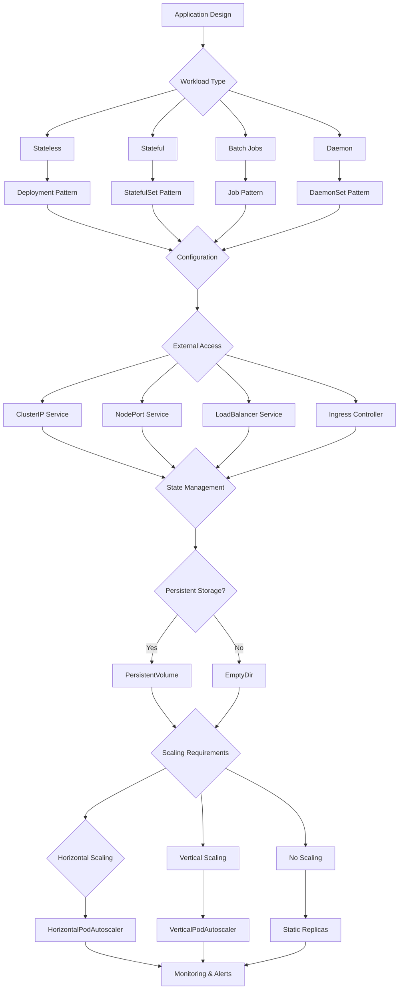

# Kubernetes Patterns

## Overview

### What Are Kubernetes Patterns?

Kubernetes patterns provide proven architectural approaches for deploying, managing, and scaling containerized applications on Kubernetes. These patterns emerge from the platform's design philosophy and common operational requirements. Understanding these patterns enables developers and operators to build reliable, scalable applications that effectively utilize Kubernetes' capabilities while avoiding common pitfalls.

The term "Kubernetes pattern" encompasses configurations, deployment strategies, and operational approaches that appear repeatedly across successful Kubernetes deployments. These patterns address challenges including application deployment, configuration management, stateful workloads, networking, and scaling. While Kubernetes provides primitive resources (pods, services, deployments), patterns compose these primitives into higher-level solutions.

Kubernetes patterns differ from Kubernetes best practices in their specificity and reusability. Best practices describe general principles like using health checks or setting resource limits. Patterns describe architectural approaches like running complementary sidecar containers or managing stateful workloads with persistent volumes. Patterns enable consistent solutions to recurring problems.

### Categorization of Kubernetes Patterns

Patterns organize into categories based on their functionality:

**Workload Patterns**: Patterns for managing application workloads, including deployments, stateful sets, daemon sets, and jobs. These patterns address how applications run, scale, and maintain state.

**Service Patterns**: Patterns for networking and service discovery, including services, ingress, network policies, and service meshes. These patterns handle how applications communicate.

**Configuration Patterns**: Patterns for managing configuration and secrets, including config maps, secrets, and external configuration. These patterns separate configuration from application code.

**Observability Patterns**: Patterns for monitoring, logging, and tracing applications. These patterns provide visibility into application behavior. kubectl top, Prometheus, and Fluentd represent common implementations.

**Security Patterns**: Patterns for securing applications, including RBAC, network policies, pod security policies, and pod security contexts. These patterns restrict access and protect workloads.

### Core Kubernetes Concepts

Understanding patterns requires understanding underlying Kubernetes concepts:

**Declarative Configuration**: Kubernetes operates through declarative configuration. Users specify desired state, and Kubernetes works to achieve that state. This approach differs from imperative approaches where users specify actions.

**Reconciliation Loops**: Kubernetes continuously reconciles desired state with actual state. Controllers detect differences and take corrective action. This approach enables automatic recovery and self-healing.

**Custom Resources**: Kubernetes extends through Custom Resource Definitions (CRDs). CRDs enable custom resource types beyond built-in types. Operators implement custom controllers for CRDs.

**Namespaces**: Namespaces provide logical cluster segmentation. Resource quotas limit namespace resources. Network policies restrict cross-namespace communication.

### Why Patterns Matter

Patterns provide several benefits for Kubernetes users:

**Proven Solutions**: Patterns represent solutions proven in production. Adopting patterns reduces risk compared to custom implementations.

**Consistency**: Patterns enable consistent architectures across teams and applications. Consistent architectures simplify operations and debugging.

**Best Practices Encapsulation**: Patterns encode best practices in reusable configurations. Teams benefit from collective experience without rediscovering solutions.

## Flow Chart: Kubernetes Pattern Selection



Pattern selection depends on workload characteristics, configuration needs, networking requirements, state management, and scaling strategies. Each decision point narrows pattern options until reaching appropriate configuration.

---

## Standard Example

### Deployment Pattern for Microservices

The Deployment pattern represents the most common Kubernetes workload pattern for stateless microservices:

```yaml
# Kubernetes Deployment Pattern

apiVersion: apps/v1
kind: Deployment
metadata:
  name: product-service
  namespace: microservices
  labels:
    app: product-service
    component: api
spec:
  # Replica management
  replicas: 3
  revisionHistoryLimit: 5
  selector:
    matchLabels:
      app: product-service
  
  # Update strategy
  strategy:
    type: RollingUpdate
    rollingUpdate:
      maxSurge: 1
      maxUnavailable: 0
  
  # Pod template
  template:
    metadata:
      labels:
        app: product-service
      annotations:
        prometheus.io/scrape: "true"
        prometheus.io/port: "9090"
    spec:
      # Service account for RBAC
      serviceAccountName: product-service
      
      # Security context
      securityContext:
        runAsNonRoot: true
        runAsUser: 1000
        fsGroup: 1000
      
      # Containers
      containers:
        - name: product-service
          image: myregistry/product-service:v1.2.3
          imagePullPolicy: Always
          
          ports:
            - containerPort: 3000
              name: http
              protocol: TCP
            - containerPort: 9090
              name: metrics
              protocol: TCP
          
          args:
            - --host=0.0.0.0
            - --port=3000
            - --log-level=info
          
          env:
            - name: APP_ENV
              value: production
            - name: LOG_FORMAT
              value: json
            - name: CONFIG_PATH
              value: /config/app.yaml
            - name: CACHE_SIZE
              value: "1000"
            - name: DB_POOL_SIZE
              value: "10"
          
          envFrom:
            - configMapRef:
                name: product-service-env
            - secretRef:
                name: product-service-secrets
          
          resources:
            requests:
              cpu: "100m"
              memory: "256Mi"
            limits:
              cpu: "500m"
              memory: "512Mi"
          
          volumeMounts:
            - name: config
              mountPath: /config
              readOnly: true
            - name: cache
              mountPath: /cache
          
          livenessProbe:
            httpGet:
              path: /health
              port: 3000
            initialDelaySeconds: 30
            periodSeconds: 10
            timeoutSeconds: 3
            failureThreshold: 3
          
          readinessProbe:
            httpGet:
              path: /ready
              port: 3000
            initialDelaySeconds: 5
            periodSeconds: 5
            timeoutSeconds: 2
            failureThreshold: 2
          
          startupProbe:
            httpGet:
              path: /health
              port: 3000
            initialDelaySeconds: 0
            periodSeconds: 5
            timeoutSeconds: 3
            failureThreshold: 30
        
        - name: prometheus-exporter
          image: prometheus/statsd-exporter:v0.24.0
          args:
            - --statsd.mapping-config=/config/statsd.yaml
          ports:
            - containerPort: 9102
              name: statsd
              protocol: TCP
          volumeMounts:
            - name: statsd-config
              mountPath: /config
      
      volumes:
        - name: config
          configMap:
            name: product-service-config
        - name: cache
          emptyDir:
            medium: Memory
            sizeLimit: 256Mi
        - name: statsd-config
          configMap:
            name: product-service-statsd
      
      # Scheduling
      affinity:
        podAntiAffinity:
          preferredDuringSchedulingIgnoredDuringExecution:
            - weight: 100
              podAffinityTerm:
                labelSelector:
                  matchLabels:
                    app: product-service
                topologyKey: kubernetes.io/hostname
      
      # Termination
      terminationGracePeriodSeconds: 30
      tolerations:
        - key: dedicated
          value: microservices
          effect: NoSchedule

---
# Service Pattern

apiVersion: v1
kind: Service
metadata:
  name: product-service
  namespace: microservices
  labels:
    app: product-service
spec:
  type: ClusterIP
  ports:
    - port: 80
      targetPort: 3000
      protocol: TCP
      name: http
    - port: 9090
      targetPort: 9090
      protocol: TCP
      name: metrics
  selector:
    app: product-service
  sessionAffinity: ClientIP
  sessionAffinityConfig:
    clientIP:
      timeoutSeconds: 10800

---
# HorizontalPodAutoscaler Pattern

apiVersion: autoscaling/v2
kind: HorizontalPodAutoscaler
metadata:
  name: product-service-hpa
  namespace: microservices
spec:
  scaleTargetRef:
    apiVersion: apps/v1
    kind: Deployment
    name: product-service
  minReplicas: 3
  maxReplicas: 20
  metrics:
    - type: Resource
      resource:
        name: cpu
        target:
          type: Utilization
          averageUtilization: 70
    - type: Resource
      resource:
        name: memory
        target:
          type: Utilization
          averageUtilization: 80
    - type: Pods
      pods:
        metric:
          name: http_requests_per_second
        target:
          type: AverageValue
          averageValue: "100"
  behavior:
    scaleDown:
      stabilizationWindowSeconds: 300
      policies:
        - type: Percent
          value: 10
          periodSeconds: 60
    scaleUp:
      stabilizationWindowSeconds: 0
      policies:
        - type: Percent
          value: 100
          periodSeconds: 15
        - type: Pods
          value: 4
          periodSeconds: 15
      selectPolicy: Max
```

### Pattern Configuration Explanation

The Deployment pattern demonstrates comprehensive configuration:

**Rolling Update Strategy**: maxUnavailable: 0 ensures all pods are available during updates. New pods start before old pods terminate. This approach eliminates downtime but requires sufficient capacity.

**Resource Management**: Requests enable scheduling decisions. Limits prevent resource exhaustion. The request/limit ratio affects cluster utilization and noisy neighbor prevention.

**Health Probes**: Startup probe handles slow-starting applications. Liveness detects hung containers. Readiness indicates traffic routing readiness. Each probe type serves a distinct purpose.

**Anti-Affinity**: Pod anti-affinity spreads pods across failure domains. This approach ensures availability during node failures. Preferred rules balance availability and resource utilization.

**HPA Configuration**: Multiple metrics enable sophisticated scaling. CPU and memory provide standard metrics. Custom metrics (HTTP requests) enable application-aware scaling.

---

## Real-World Example 1: Stateful Application Pattern

### Managing Databases on Kubernetes

Stateful applications require additional patterns for data management:

```yaml
# StatefulSet Pattern for PostgreSQL

apiVersion: apps/v1
kind: StatefulSet
metadata:
  name: postgresql
  namespace: databases
spec:
  serviceName: postgresql
  replicas: 3
  selector:
    matchLabels:
      app: postgresql
  podManagementPolicy: Parallel
  updateStrategy:
    type: RollingUpdate
  template:
    metadata:
      labels:
        app: postgresql
    spec:
      terminationGracePeriodSeconds: 30
      containers:
        - name: postgres
          image: postgres:15-alpine
          ports:
            - containerPort: 5432
              name: postgres
          env:
            - name: POSTGRES_REPLICATION_MODE
              value: master
            - name: POSTGRES_REPLICATION_USER
              value: replicator
            - name: POSTGRES_DB
              value: main
            - name: POSTGRES_INITDB_ARGS
              value: "-E UTF8"
          volumeMounts:
            - name: data
              mountPath: /var/lib/postgresql/data
            - name: config
              mountPath: /etc/postgresql
          resources:
            requests:
              cpu: "500m"
              memory: "1Gi"
            limits:
              cpu: "2000m"
              memory: "2Gi"
          livenessProbe:
            exec:
              command:
                - pg_isready
                - -U
                - postgres
            initialDelaySeconds: 30
            periodSeconds: 10
          readinessProbe:
            exec:
              command:
                - pg_isready
                - -U
                - postgres
            initialDelaySeconds: 5
            periodSeconds: 5
  volumeClaimTemplates:
    - metadata:
        name: data
      spec:
        accessModes: ["ReadWriteOnce"]
        storageClassName: ssd
        resources:
          requests:
            storage: 10Gi

---
# Headless Service for StatefulSet

apiVersion: v1
kind: Service
metadata:
  name: postgresql
  namespace: databases
spec:
  clusterIP: None
  ports:
    - port: 5432
      targetPort: 5432
  selector:
    app: postgresql

---
# Pod Disruption Budget

apiVersion: policy/v1
kind: PodDisruptionBudget
metadata:
  name: postgresql-pdb
  namespace: databases
spec:
  minAvailable: 2
  selector:
    matchLabels:
      app: postgresql
```

### StatefulSet Pattern Details

StatefulSets provide guarantees unavailable in Deployments:

**Stable Network Identity**: Each pod receives a stable hostname (postgresql-0, postgresql-1). DNS names persist across rescheduling. This stability enables peer-to-peer communication.

**Stable Storage**: Each pod receives persistent storage. Pod rescheduling doesn't lose data. The volume claim template creates persistent volumes for each replica.

**Ordered Deployment**: Pods deploy and update in order (0, 1, 2). This order prevents data inconsistency. Recovery procedures follow the same order.

**Ordered Scaling**: Pods scale in order, with later pods terminating first. This order maintains database consistency during scaling.

---

## Real-World Example 2: DaemonSet Pattern

### Log Collection with Fluentd

DaemonSets ensure one pod runs on each node, ideal for log collection:

```yaml
# Fluentd DaemonSet for Log Collection

apiVersion: apps/v1
kind: DaemonSet
metadata:
  name: fluentd
  namespace: logging
  labels:
    app: fluentd
    version: v1.16
spec:
  selector:
    matchLabels:
      app: fluentd
  template:
    metadata:
      labels:
        app: fluentd
        version: v1.16
    spec:
      tolerations:
        - key: node-role.kubernetes.io/control-plane
          operator: Exists
          effect: NoSchedule
        - key: node-role.kubernetes.io/master
          operator: Exists
          effect: NoSchedule
      containers:
        - name: fluentd
          image: fluent/fluentd:v1.16-kubernetes
          env:
            - name: FLUENTD_ARGS
              value: --no-supervisor
            - name: FLUENT_HOST
              value: fluentd.elastic.svc.cluster.local
            - name: FLUENT_PORT
              value: "24224"
          resources:
            requests:
              cpu: "100m"
              memory: "200Mi"
            limits:
              cpu: "500m"
              memory: "512Mi"
          volumeMounts:
            - name: varlog
              mountPath: /var/log
              readOnly: true
            - name: varlibdockercontainers
              mountPath: /var/lib/docker/containers
              readOnly: true
            - name: config
              mountPath: /etc/fluent
      volumes:
        - name: varlog
          hostPath:
            path: /var/log
        - name: varlibdockercontainers
          hostPath:
            path: /var/lib/docker/containers
        - name: config
          configMap:
            name: fluentd-config
```

### DaemonSet Use Cases

DaemonSets suit various node-level workloads:

**Log Collection**: Fluentd runs on every node, collecting logs from /var/log. Logs aggregate to centralized storage. DaemonSet ensures complete coverage.

**Monitoring Agents**: Node exporters collect node-level metrics. DaemonSet ensures metrics from all nodes. No scheduling delays for metrics.

**Storage daemons**: Local storage managers run on each node. DaemonSet ensures proper node coverage. Storage cleanup happens during pod cleanup.

**Network plugins**: CNI plugins run as DaemonSets. Each node runs the plugin for pod networking. Updates propagate through DaemonSet rolling updates.

---

## Best Practices

### Application Design

**Separation of Concerns**: Use separate Deployments for separate applications. Don't combine unrelated services in single pods. This separation enables independent scaling and updates.

**Startup Probes**: Don't skip startup probes for slow-starting applications. The startup probe allows longer startup times. After startup, other probes can detect issues.

**Graceful Shutdown**: Handle SIGTERM for cleanup. Release resources, flush buffers, and stop listening. The graceful period should exceed shutdown time.

### Configuration

**Externalize Configuration**: Use ConfigMaps, not baked-in values. Different environments use different configurations. This approach enables promotion without modification.

**Secrets Management**: Externalize secrets beyond the cluster. Vault, AWS Secrets Manager, or similar. Don't store secrets in Git.

**Resource Requests**: Set accurate resource requests. Under-requesting causes scheduling issues. Over-requesting wastes resources. Monitor actual usage.

### Security

**RBAC**: Follow principle of least privilege. Use service accounts, not default. Restrict namespace access appropriately.

**Network Policies**: Default deny all. Allow specific communication paths. Control east-west traffic.

**Pod Security**: Don't run as root. Drop capabilities. Use security contexts.

### Scaling

**HPA Configuration**: Configure appropriate thresholds. 70% CPU utilization balances costs and performance. Customize for application characteristics.

**Cluster Autoscaling**: Enable cluster autoscaling for variable workloads. Node pools for different workload types.

---

## Additional Resources

### Learning Kubernetes Patterns

**Books**:
- "Kubernetes Patterns" by Bilgin Ibrik and Michael Hüttermann
- "Cloud Native Kubernetes Patterns"

**Documentation**:
- Kubernetes official documentation
- Operator pattern documentation

**Tools**:
- Operator SDK
- Helm for packaging

### Certification

- CKA (Certified Kubernetes Administrator)
- CKAD (Certified Kubernetes Application Developer)