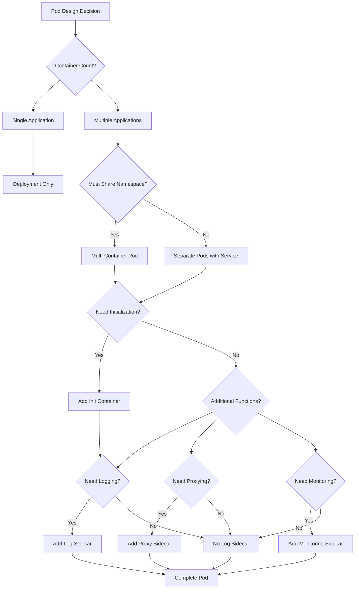

# Pod Design Patterns

## Overview

### What Are Pod Design Patterns?

Pod design patterns provide architectural approaches for composing containers within Kubernetes Pods. A Pod represents the smallest deployable unit in Kubernetes, containing one or more containers that share namespaces. Pod design patterns address how to combine containers to achieve application requirements while maintaining Kubernetes best practices.

The Pod concept recognizes that containers sometimes need to work together closely. Containers within a pod share network namespace—they can communicate via localhost. They share process namespace—they can signal each other's processes. They share storage-they can mount shared volumes. Pod design patterns leverage these shared namespaces for effective container composition.

Unlike Docker Compose or other container orchestration, Kubernetes treats the Pod as an atomic unit. The Pod schedules, scales, and recovers as a unit. All containers within a pod start and stop together. This atomicity influences pattern selection—all containers must be co-located on the same node.

### Core Pod Concepts

Pods contain several containers that work together:

**Init Containers**: Run before main containers, performing initialization. Multiple init containers run sequentially. Init containers can access secrets and run privileged operations.

**Main Containers**: Primary application containers. Multiple main containers provide distinct functions within the same pod. Each main container exposes through its own port.

**Sidecar Containers**: Extend main container functionality. Sidecars run alongside main containers. They provide logging, monitoring, proxying, or other cross-cutting functions.

The main container runs the application. Sidecars augment functionality without modifying the main application. Init containers prepare the environment before application starts.

### Pod Lifecycle States

Understanding pod lifecycle helps pattern selection:

**Pending**: Pod accepted, containers creating. Scheduling in progress or waiting for resources.

**Running**: At least one container running. All containers passed readiness checks.

**Succeeded**: All containers terminated successfully. Pod won't restart.

**Failed**: All containers terminated, at least one failed. Check restartPolicy.

**Unknown**: Pod state couldn't be obtained. API server communication issues.

### Pattern Categories

Pod designs fall into several categories:

**Single Container Pods**: Simplest pattern, one main container. Suitable for stateless microservices. Deployment manages scaling and updates.

**Multi-Container Pods**: Multiple main containers cooperating. Appropriate when containers require shared namespaces. Challenging to scale—scaling scales all containers.

**Init Container Patterns**: Use init containers for setup. Ensure dependencies, populate data, configure resources.

**Sidecar Patterns**: Add sidecars for cross-cutting concerns. Add logging, monitoring, proxying capability.

## Flow Chart: Pod Design Decision



The decision tree guides pod design. Single applications fit simple Deployments. Multiple applications requiring shared namespaces fit multi-container Pods. Additional requirements add sidecars.

---

## Standard Example

### Product Service Pod Design

```yaml
# Product Service Pod - Complete Design

apiVersion: v1
kind: Pod
metadata:
  name: product-service-pod
  labels:
    app: product-service
    version: v1.2.3
spec:
  # Restart policy
  restartPolicy: Always
  
  # Service account
  serviceAccountName: product-service
  
  # Security context
  securityContext:
    runAsNonRoot: true
    runAsUser: 1000
    fsGroup: 1000
    seccompProfile:
      type: RuntimeDefault
  
  # Init containers for initialization
  initContainers:
    - name: config-loader
      image: busybox:1.36
      command:
        - sh
        - -c
        - |
          echo "Loading configuration from ConfigMap"
          # Wait for config to be ready
          until [ -f /config/app.yaml ]; do
            echo "Config not ready, waiting..."
            sleep 2
          done
          echo "Configuration loaded successfully"
      volumeMounts:
        - name: config
          mountPath: /config
      resources:
        requests:
          cpu: "10m"
          memory: "16Mi"
        limits:
          cpu: "100m"
          memory: "64Mi"
      securityContext:
        allowPrivilegeEscalation: false
        readOnlyRootFilesystem: true
        capabilities:
          drop:
            - ALL
      
    - name: schema-migrator
      image: myregistry/schema-migrator:v2.0.0
      env:
        - name: DATABASE_URL
          valueFrom:
            secretKeyRef:
              name: product-db-credentials
              key: url
      command:
        - /app/migrate.sh
      resources:
        requests:
          cpu: "50m"
          memory: "64Mi"
        limits:
          cpu: "200m"
          memory: "128Mi"
      securityContext:
        allowPrivilegeEscalation: false
        readOnlyRootFilesystem: true
  
  # Main containers
  containers:
    # Main application container
    - name: product-service
      image: myregistry/product-service:v1.2.3
      imagePullPolicy: Always
      ports:
        - containerPort: 3000
          name: http
          protocol: TCP
        - containerPort: 9090
          name: metrics
          protocol: TCP
      env:
        - name: NODE_ENV
          value: production
        - name: PORT
          value: "3000"
        - name: METRICS_PORT
          value: "9090"
        - name: LOG_LEVEL
          valueFrom:
            configMapKeyRef:
              name: product-config
              key: log.level
        - name: AWS_REGION
          value: us-east-1
        - name: CACHE_SIZE
          value: "1000"
        - name: DB_POOL_SIZE
          value: "10"
      envFrom:
        - configMapRef:
            name: product-config
        - secretRef:
            name: product-secrets
      resources:
        requests:
          cpu: "100m"
          memory: "256Mi"
        limits:
          cpu: "500m"
          memory: "512Mi"
      volumeMounts:
        - name: cache
          mountPath: /app/cache
      livenessProbe:
        httpGet:
          path: /health
          port: 3000
        initialDelaySeconds: 30
        periodSeconds: 10
        timeoutSeconds: 3
        failureThreshold: 3
      readinessProbe:
        httpGet:
          path: /ready
          port: 3000
        initialDelaySeconds: 5
        periodSeconds: 5
        timeoutSeconds: 2
        failureThreshold: 2
      startupProbe:
        httpGet:
          path: /health
          port: 3000
        initialDelaySeconds: 0
        periodSeconds: 5
        timeoutSeconds: 3
        failureThreshold: 30
      securityContext:
        allowPrivilegeEscalation: false
        readOnlyRootFilesystem: false
        capabilities:
          drop:
            - ALL
      lifecycle:
        preStop:
          exec:
            command:
              - sh
              - -c
              - |
                echo "Graceful shutdown started"
                nginx -s QUIT
                sleep 5
    
    # Logging sidecar - gathers logs from main container
    - name: log-shipper
      image: fluent/fluentd:v1.16
      env:
        - name: FLUENTD_ARGS
          value: --no-supervisor
        - name: FLUENT_HOST
          value: fluentd.elastic.svc.cluster.local
        - name: FLUENT_PORT
          value: "24224"
      volumeMounts:
        - name: app-logs
          mountPath: /app/logs
          readOnly: true
        - name: fluentd-config
          mountPath: /etc/fluent
      resources:
        requests:
          cpu: "50m"
          memory: "64Mi"
        limits:
          cpu: "100m"
          memory: "128Mi"
      securityContext:
        allowPrivilegeEscalation: false
        readOnlyRootFilesystem: true
        capabilities:
          drop:
            - ALL
    
    # Metrics adapter - exports metrics for Prometheus
    - name: metrics-adapter
      image: prometheus/statsd-exporter:v0.24.0
      args:
        - --statsd.mapping-config=/config/statsd.yaml
        - --web.listen-address=:9102
        - --web.telemetry-path=/metrics
      ports:
        - containerPort: 9102
          name: statsd
          protocol: TCP
      volumeMounts:
        - name: statsd-config
          mountPath: /config
      resources:
        requests:
          cpu: "10m"
          memory: "32Mi"
        limits:
          cpu: "50m"
          memory: "64Mi"
      securityContext:
        allowPrivilegeEscalation: false
        readOnlyRootFilesystem: true
        capabilities:
          drop:
            - ALL
    
    # Nginx sidecar - ingress proxy
    - name: nginx-proxy
      image: nginx:1.25-alpine
      ports:
        - containerPort: 80
          name: http
          protocol: TCP
      volumes:
        - name: nginx-config
          configMap:
            name: product-nginx-config
            items:
              - key: nginx.conf
                path: nginx.conf
        - name: app-logs
          mountPath: /var/log/nginx
      resources:
        requests:
          cpu: "50m"
          memory: "64Mi"
        limits:
          cpu: "200m"
          memory: "128Mi"
      livenessProbe:
        httpGet:
          path: /health
          port: 80
        initialDelaySeconds: 10
        periodSeconds: 10
        timeoutSeconds: 3
      readinessProbe:
        httpGet:
          path: /ready
          port: 80
        initialDelaySeconds: 5
        periodSeconds: 5
        timeoutSeconds: 2
      securityContext:
        allowPrivilegeEscalation: false
        readOnlyRootFilesystem: true
        capabilities:
          drop:
            - ALL
  
  # Volumes
  volumes:
    - name: config
      configMap:
        name: product-config
        optional: true
    - name: cache
      emptyDir:
        medium: Memory
        sizeLimit: 256Mi
    - name: app-logs
      emptyDir: {}
    - name: fluentd-config
      configMap:
        name: fluentd-config
    - name: statsd-config
      configMap:
        name: product-statsd-config
    - name: nginx-config
      configMap:
        name: product-nginx-config
  
  # Termination grace period
  terminationGracePeriodSeconds: 30
  
  # Affinity rules
  affinity:
    podAntiAffinity:
      preferredDuringSchedulingIgnoredDuringExecution:
        - weight: 100
          podAffinityTerm:
            labelSelector:
              matchLabels:
                app: product-service
            topologyKey: kubernetes.io/hostname
  
  # Tolerations
  tolerations:
    - key: dedicated
      value: microservices
      effect: NoSchedule
```

### Pod Components Explanation

This complete pod demonstrates multiple patterns:

**Init Containers**: Config loader ensures config exists before main starts. Schema migrator runs database migrations. Init containers fail the pod if initialization fails.

**Main Container**: Product service runs the main application. Resource limits prevent resource exhaustion. Health probes detect application issues.

**Sidecar Containers**: Three sidecars extend functionality. Log shipper collects and forwards logs. Metrics adapter exports application metrics. Nginx proxy provides ingress proxying.

**Shared Volumes**: The app-logs emptyDir enables log sharing between main container and nginx sidecar. Main writes to shared directory, nginx reads for access logs.

**Security Contexts**: All containers run non-root. Capabilities dropped prevent privilege escalation. Root filesystem read-only where possible.

---

## Real-World Example 1: Elasticsearch Pod

### Running Elasticsearch on Kubernetes

```yaml
# Elasticsearch StatefulSet Pod

apiVersion: apps/v1
kind: StatefulSet
metadata:
  name: elasticsearch
  namespace: elasticsearch
spec:
  serviceName: elasticsearch
  replicas: 3
  selector:
    matchLabels:
      app: elasticsearch
  template:
    metadata:
      labels:
        app: elasticsearch
    spec:
      terminationGracePeriodSeconds: 30
      initContainers:
        # Fix filesystem permissions
        - name: fix-permissions
          image: busybox:1.36
          command:
            - sh
            - -c
            - |
              chown -R 1000:1000 /usr/share/elasticsearch/data
              chown -R 1000:1000 /usr/share/elasticsearch/logs
          securityContext:
            privileged: true
          volumeMounts:
            - name: data
              mountPath: /usr/share/elasticsearch/data
            - name: logs
              mountPath: /usr/share/elasticsearch/logs
        
        # Increase virtual memory
        - name: increase-vm-max-map
          image: busybox:1.36
          command:
            - sysctl -w vm.max_map_count=262144
          securityContext:
            privileged: true
        
        # Increase file descriptors
        - name: increase-fd-ulimit
          image: busybox:1.36
          command:
            - sh
            - -c
            - ulimit -n 65536
          securityContext:
            privileged: true
      
      containers:
        - name: elasticsearch
          image: elasticsearch:8.10.0
          ports:
            - containerPort: 9200
              name: http
              protocol: TCP
            - containerPort: 9300
              name: transport
              protocol: TCP
          env:
            - name: cluster.name
              value: production-cluster
            - name: node.name
              valueFrom:
                fieldRef:
                  fieldPath: metadata.name
            - name: discovery.seed_hosts
              value: elasticsearch-0.elasticsearch,elasticsearch-1.elasticsearch,elasticsearch-2.elasticsearch
            - name: ES_JAVA_OPTS
              value: -Xms512m -Xmx512m -XX:+UseG1GC -XX:G1HeapRegionSizeSize=4m -XX:InitiatingHeapOccupancyPercent=35 -XX:MaxGCPauseMillis=400
            - name: network.host
              value: "0.0.0.0"
            - name: xpack.security.enabled
              value: "true"
          resources:
            requests:
              cpu: "500m"
              memory: "1Gi"
            limits:
              cpu: "2000m"
              memory: "2Gi"
          volumeMounts:
            - name: data
              mountPath: /usr/share/elasticsearch/data
            - name: logs
              mountPath: /usr/share/elasticsearch/logs
            - name: config
              mountPath: /usr/share/elasticsearch/config
          livenessProbe:
            httpGet:
              path: /_cluster/health
              port: 9200
            initialDelaySeconds: 60
            periodSeconds: 20
            timeoutSeconds: 5
          readinessProbe:
            httpGet:
              path: /_cluster/health
              port: 9200
            initialDelaySeconds: 20
            periodSeconds: 10
            timeoutSeconds: 3
        
        # Curator sidecar - manages index retention
        - name: curator
          image: elasticsearch/curator:5.8.6
          env:
            - name: DAYS_TO_DELETE
              value: "30"
            - name: ES_HOST
              value: localhost
            - name: ES_PORT
              value: "9200"
          command:
            - /curator
            - --config
            - /curator/config.yml
            - /curator/action.yml
          volumeMounts:
            - name: curator-config
              mountPath: /curator
          resources:
            requests:
              cpu: "10m"
              memory: "64Mi"
              limits:
                cpu: "100m"
                memory: "128Mi"
      
      volumes:
        - name: data
          persistentVolumeClaim:
            claimName: elasticsearch-data
        - name: logs
          emptyDir: {}
        - name: config
          configMap:
            name: elasticsearch-config
        - name: curator-config
          configMap:
            name: elasticsearch-curator-config
```

### Elasticsearch Pod Pattern Explanation

This StatefulSet demonstrates stateful workload patterns:

**Init Containers**: Multiple init containers perform node-specific setup. Each runs sequentially. Fix-permissions handles UID issues. Increase-vm-max-map handles ES memory requirements. Increase-fd-ulimit handles file descriptor limits.

**Main Container**: Elasticsearch runs as non-root with appropriate resources. Health checks monitor cluster health. Readiness indicates when node accepts traffic.

**Sidecar Container**: Curator manages index retention. Runs on same node as ES. Deletes old indices on schedule. Keeps storage bounded.

---

## Real-World Example 2: Monitoring Pod

### Prometheus with Exporters

```yaml
# Monitoring Pod - Prometheus Stack

apiVersion: v1
kind: Pod
metadata:
  name: monitoring-stack
  labels:
    app: monitoring
spec:
  initContainers:
    # Wait for services to be ready
    - name: service-waiter
      image: busybox:1.36
      env:
        - name: SERVICE_WAIT_LIST
          value: product-service:3000,payment-service:3000,user-service:3000
      command:
        - sh
        - -c
        - |
          IFS=',' read -ra SERVICES <<< "$SERVICE_WAIT_LIST"
          for service in "${SERVICES[@]}"; do
            echo "Waiting for $service..."
            host=$(echo $service | cut -d: -f1)
            port=$(echo $service | cut -d: -f2)
            until nc -z $host $port; do
              echo "$service not ready..."
              sleep 5
            done
            echo "$service ready!"
          done
          echo "All services ready!"
  
  containers:
    # Prometheus main
    - name: prometheus
      image: prom/prometheus:v2.45.0
      ports:
        - containerPort: 9090
          name: http
      args:
        - --config.file=/etc/prometheus/prometheus.yml
        - --storage.tsdb.path=/prometheus
        - --storage.tsdb.retention.time=15d
        - --storage.tsdb.min-block-duration=2h
        - --storage.tsdb.max-block-duration=2h
        - --web.console.libraries=/etc/prometheus/console_libraries
        - --web.console.templates=/etc/prometheus/consoles
        - --web.enable-lifecycle
      volumeMounts:
        - name: config
          mountPath: /etc/prometheus
          readOnly: true
        - name: prometheus-data
          mountPath: /prometheus
      resources:
        requests:
          cpu: "100m"
          memory: "512Mi"
        limits:
          cpu: "500m"
          memory: "1Gi"
      readinessProbe:
        httpGet:
          path: /-/ready
          port: 9090
        initialDelaySeconds: 10
        periodSeconds: 5
        timeoutSeconds: 3
      livenessProbe:
        httpGet:
          path: /-/healthy
          port: 9090
        initialDelaySeconds: 30
        periodSeconds: 15
        timeoutSeconds: 5
    
    # Node Exporter sidecar - per-node metrics
    - name: node-exporter
      image: prom/node-exporter:v1.6.1
      ports:
        - containerPort: 9100
          name: node
      args:
        - --path.procfs=/host/proc
        - --path.sysfs=/host/sys
        - --collector.filesystem.ignored-mount-points=^/(sys|proc|dev|host|etc)($$|/)
        - --collector.netdev.ignored-devices=^(lo|docker0|veth.*$$)
      volumeMounts:
        - name: proc
          mountPath: /host/proc
          readOnly: true
        - name: sys
          mountPath: /host/sys
          readOnly: true
        - name: root
          mountPath: /rootfs
          readOnly: true
      resources:
        requests:
          cpu: "50m"
          memory: "64Mi"
        limits:
          cpu: "100m"
          memory: "128Mi"
    
    # Alertmanager sidecar
    - name: alertmanager
      image: prom/alertmanager:v0.25.0
      ports:
        - containerPort: 9093
          name: alert
      args:
        - --config.file=/etc/alertmanager/alertmanager.yml
        - --storage.path=/alertmanager
      volumeMounts:
        - name: alertmanager-config
          mountPath: /etc/alertmanager
        - name: alertmanager-data
          mountPath: /alertmanager
      resources:
        requests:
          cpu: "50m"
          memory: "128Mi"
        limits:
          cpu: "100m"
          memory: "256Mi"
    
    # Grafana sidecar - visualization
    - name: grafana
      image: grafana/grafana:10.0.0
      ports:
        - containerPort: 3000
          name: grafana
      env:
        - name: GF_SECURITY_ADMIN_USER
          valueFrom:
            secretKeyRef:
              name: grafana-credentials
              key: username
        - name: GF_SECURITY_ADMIN_PASSWORD
          valueFrom:
            secretKeyRef:
              name: grafana-credentials
              key: password
        - name: GF_INSTALL_PLUGINS
          value: grafana-piechart-panel
      volumeMounts:
        - name: grafana-config
          mountPath: /etc/grafana
          readOnly: true
        - name: grafana-data
          mountPath: /var/lib/grafana
      resources:
        requests:
          cpu: "50m"
          memory: "128Mi"
        limits:
          cpu: "200m"
          memory: "512Mi"
    
    # Pushgateway sidecar - metrics aggregation
    - name: pushgateway
      image: prom/pushgateway:v1.6.2
      ports:
        - containerPort: 9091
          name: push
      resources:
        requests:
          cpu: "10m"
          memory: "32Mi"
        limits:
          cpu: "50m"
          memory: "64Mi"
  
  volumes:
    - name: config
      configMap:
        name: prometheus-config
    - name: prometheus-data
      emptyDir:
        sizeLimit: 10Gi
    - name: alertmanager-config
      configMap:
        name: alertmanager-config
    - name: alertmanager-data
      emptyDir:
        sizeLimit: 1Gi
    - name: grafana-config
      configMap:
        name: grafana-config
    - name: grafana-data
      emptyDir:
        sizeLimit: 1Gi
    - name: proc
      hostPath:
        path: /proc
    - name: sys
      hostPath:
        path: /sys
    - name: root
      hostPath:
        path: /
```

### Monitoring Stack Pattern

This comprehensive monitoring pod demonstrates pattern composition:

**Init Container**: Service waiter ensures all monitored services exist before Prometheus starts. This prevents "no data" gaps during startup.

**Prometheus**: Central metrics collection and storage. Config mounted from ConfigMap. Persistent storage with retention.

**Node Exporter**: Sidecar exposes node-level metrics. Host filesystems mounted as volumes. Per-pod resources for isolation.

**Alertmanager**: Handles alerting. Separate from Prometheus for independent scaling.

**Grafana**: Visualization sidecar. Can scale separately from Prometheus.

---

## Best Practices

### Pod Design

**Single Responsibility**: Each pod should serve one purpose. Separate database pods from application pods. This separation enables independent scaling and updates.

**Minimal Containers**: Avoid unnecessary containers. Each container adds overhead. Only add containers with clear purpose.

**Shared Namespaces**: Use Pod when containers must share namespaces. Network communication via localhost. Shared process namespace for signal handling.

### Init Containers

**Fail Fast**: Init containers should fail quickly on errors. Don't hide failures. Return meaningful error messages.

**Idempotent**: Init containers must handle re-execution gracefully. The controller may retry. Create only if not exists.

**Minimal**: Init containers should be minimal. Don't include unnecessary tools. Use small base images.

### Sidecars

**Independent Lifecycle**: Sidecars should handle their own lifecycle. Don't rely on main container to manage sidecar resources.

**Same Pod Benefits**: Use sidecar when local access needed. Host networking for metrics. Shared volumes for log files.

**Alternative Consideration**: Consider separate pods for independent scaling. Metrics collection can scale separately from application.

### Security

**Security Contexts**: Always define security contexts. Run non-root. Drop capabilities. Use read-only filesystems.

**Secrets**: Don't mount secrets unnecessarily. Use readOnly where possible. Minimize secret access.

**Host Resources**: Use host resources sparingly. HostPath grants node access. Consider security implications.

---

## Additional Resources

### Learning Pod Patterns

**Documentation**:
- Kubernetes Pod documentation
- Init container patterns
- Sidecar patterns

**Books**:
- "Kubernetes Patterns"
- "Cloud Native Infrastructure"

**Tools**:
- kubectl-debug for troubleshooting
- Popeye for configuration audit