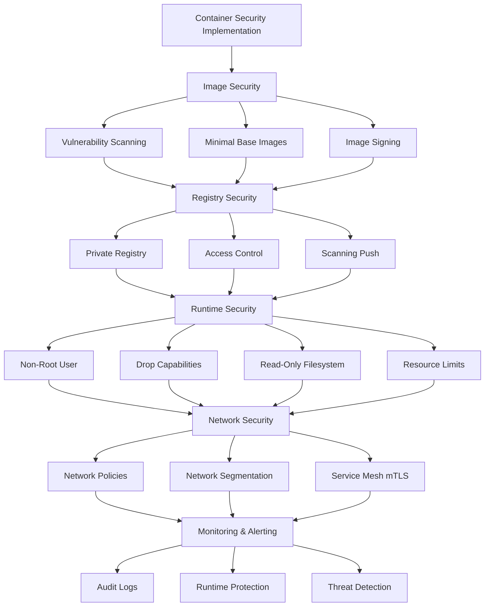

# Container Security

## Overview

### What Is Container Security?

Container security encompasses the practices, tools, and configurations that protect containerized applications from threats throughout the container lifecycle. Security must address the entire container lifecycle, from image building through runtime operation. Each stage presents different attack surfaces and requires different security measures.

Container security differs from traditional application security due to the unique characteristics of container technology. Containers share the host kernel, creating isolation challenges. Container images may contain vulnerabilities in base images and dependencies. Runtime containers operate with elevated privileges. The distributed nature of microservices multiplies the attack surface.

The shared responsibility model applies to container security—cloud providers secure the infrastructure while users secure their applications and configurations. This separation requires understanding both platform security features and application security practices. Failure to implement proper security at any layer creates vulnerabilities.

### Security Layers

Container security operates across multiple layers:

**Image Security**: Scanning images for vulnerabilities before deployment. Using minimal base images. Signing and verifying images. Removing unnecessary tools.

**Registry Security**: Accessing registries securely. Using private registries. Scanning for secrets in images. Verifying image provenance.

**Runtime Security**: Running containers with minimal privileges. Isolating containers from each other and the host. Managing resource limits. Monitoring container behavior.

**Orchestration Security**: Securing Kubernetes clusters. Implementing RBAC. Network policies for isolation. Pod security policies.

**Supply Chain Security**: Securing the software supply chain. Signing images. Verifying builds. Audit trails for provenance.

### Security Principles

Several principles guide container security:

**Defense in Depth**: Multiple security layers create defense in depth. Single security measures create single points of failure.

**Least Privilege**: Run containers with the minimum privileges necessary. Non-root users. Minimal capabilities. No unnecessary access.

**Assume Breach**: Design assuming attackers have access to containers. Limit damage from compromised containers. Monitor for compromise.

**Separation of Duties**: Isolate workloads from each other. Separate databases from applications. Don't trust other tenants.

### Common Vulnerabilities

Container environments face several vulnerability categories:

**Image Vulnerabilities**: Base images contain CVEs. Application dependencies contain vulnerabilities. Build tools may contain backdoors.

**Misconfigurations**: Running as root. Privileged containers. Unnecessary capabilities. Exposed secrets.

**Runtime Vulnerabilities**: Container escape vulnerabilities. Kernel exploits. Resource exhaustion. Noisy neighbor issues.

**Supply Chain Vulnerabilities**: Compromised registries. Malicious images. Build system compromises.

## Flow Chart: Security Implementation



Security implementation progresses through layers. Each layer builds on previous layers. Skipping layers creates gaps.

---

## Standard Example

### Secure Dockerfile

```dockerfile
# Product Service - Secure Dockerfile

# Minimal base image
FROM node:20-alpine AS builder

# Install dependencies in build stage
WORKDIR /build
COPY package*.json ./
RUN npm ci --only=production

# Build application
COPY src ./src
COPY tsconfig.json ./
RUN npm run build

# Production stage - minimal image
FROM node:20-alpine AS production

# Create non-root user
RUN addgroup -g 1001 -S appgroup && \
    adduser -u 1001 -S appuser -G appgroup

WORKDIR /app

# Copy only necessary artifacts
COPY --from=builder --chown=appuser:appgroup /app/dist ./dist
COPY --from=builder --chown=appuser:appgroup /app/node_modules ./node_modules
COPY --from=builder --chown=appuser:appgroup /app/package*.json ./

# Remove build artifacts from node_modules
RUN rm -rf /app/node_modules/*/src /app/node_modules/*/test /app/node_modules/*/*.d.ts

# Set environment
ENV NODE_ENV=production
ENV APP_VERSION=1.2.3
ENV PORT=3000
ENV METRICS_PORT=9090

# Expose ports
EXPOSE 3000 9090

# Create necessary directories with proper ownership
RUN mkdir -p /app/cache /app/logs && \
    chown -R appuser:appgroup /app/cache /app/logs

# Switch to non-root user
USER appuser

# Health check
HEALTHCHECK --interval=30s --timeout=3s --start-period=10s --retries=3 \
    CMD node -e "require('http').get('http://localhost:3000/health', (r) => process.exit(r.statusCode === 200 ? 0 : 1))"

# Use exec form for PID 1
CMD ["node", "dist/main.js"]
```

### Secure Kubernetes Configuration

```yaml
# Product Service - Secure Kubernetes Deployment

apiVersion: apps/v1
kind: Deployment
metadata:
  name: product-service
  namespace: production
  labels:
    app: product-service
spec:
  replicas: 3
  selector:
    matchLabels:
      app: product-service
  template:
    metadata:
      labels:
        app: product-service
    spec:
      # Service account
      serviceAccountName: product-service
      securityContext:
        runAsNonRoot: true
        runAsUser: 1000
        fsGroup: 1000
      containers:
        - name: product-service
          image: myregistry/product-service:v1.2.3
          imagePullPolicy: Always
          
          # Non-root security context
          securityContext:
            allowPrivilegeEscalation: false
            readOnlyRootFilesystem: true
            runAsNonRoot: true
            runAsUser: 1000
            capabilities:
              drop:
                - ALL
          
          ports:
            - containerPort: 3000
              name: http
            - containerPort: 9090
              name: metrics
          
          # Resource limits
          resources:
            requests:
              cpu: "100m"
              memory: "256Mi"
            limits:
              cpu: "500m"
              memory: "512Mi"
          
          # Environment variables (no secrets)
          env:
            - name: NODE_ENV
              value: production
            - name: LOG_FORMAT
              value: json
          
          # Secret mounts
          envFrom:
            - secretRef:
                name: product-service-secrets
          
          # ConfigMap mounts
          volumeMounts:
            - name: config
              mountPath: /config
              readOnly: true
            - name: cache
              mountPath: /app/cache
          
          # Health checks
          livenessProbe:
            httpGet:
              path: /health
              port: 3000
            initialDelaySeconds: 30
            periodSeconds: 10
          readinessProbe:
            httpGet:
              path: /ready
              port: 3000
            initialDelaySeconds: 5
            periodSeconds: 5
      
      # Volumes
      volumes:
        - name: config
          configMap:
            name: product-service-config
        - name: cache
          emptyDir:
            medium: Memory
      
      # Termination
      terminationGracePeriodSeconds: 30

---
# Pod Security Policy

apiVersion: policy/v1
kind: PodSecurityPolicy
metadata:
  name: product-service-psp
  annotations:
    seccomp.security.alpha.kubernetes.io/allowedProfileNames: runtime/default
    apparmor.security.beta.kubernetes.io/allowedProfileNames: runtime/default
    seccomp.security.alpha.kubernetes.io/defaultProfileName: runtime/default
    apparmor.security.beta.kubernetes.io/defaultProfileName: runtime/default
spec:
  # Privileged disabled
  privileged: false
  # Required for operation
  allowPrivilegeEscalation: false
  # Allow all volumes (restricted list in real deployment)
  volumes:
    - configMap
    - emptyDir
    - secret
  # Root not allowed
  runAsUser:
    rule: MustRunAsNonRoot
  # UID range
  runAsUser:
    rule: MustRunAs
    ranges:
      - min: 1000
        max: 1000
  # SELinux
  seLinux:
    rule: RunAsAny
  # Capabilities
  requiredDropCapabilities:
    - ALL
  # Allow default capabilities
  allowPrivilegeEscalation: false

---
# Network Policy

apiVersion: networking.k8s.io/v1
kind: NetworkPolicy
metadata:
  name: product-service-network-policy
  namespace: production
spec:
  podSelector:
    matchLabels:
      app: product-service
  policyTypes:
    - Ingress
    - Egress
  # Ingress restrictions
  ingress:
    - from:
        - namespaceSelector:
            matchLabels:
              name: production
        - podSelector:
            matchLabels:
              app: gateway
      ports:
        - protocol: TCP
          port: 3000
  # Egress restrictions
  egress:
    - to:
        - podSelector:
            matchLabels:
              app: product-database
      ports:
        - protocol: TCP
          port: 5432
    - to:
        - podSelector:
            matchLabels:
              app: cache
      ports:
        - protocol: TCP
          port: 6379
```

### Security Configuration Explanation

The Kubernetes configuration demonstrates multiple security layers:

**Security Contexts**: Both pod-level and container-level security contexts. Non-root everywhere. No privilege escalation. Read-only filesystem. Capabilities dropped.

**Service Accounts**: Dedicated service account limits RBAC impact. Application uses minimal permissions.

**Resource Limits**: Limits prevent resource exhaustion. Same for Pod and container.

**Environment**: No secrets in environment variables. Secrets from Secret resources. ConfigMap for configuration.

**Network Policy**: Ingress restricted to gateway and same namespace. Egress restricted to database and cache. Deny all by default.

---

## Real-World Example 1: GuardDuty Container Security

### AWS Container Security Implementation

```yaml
# AWS ECR - Image Scanning

# Enable image scanning on push
aws ecr put-image-scanning-configuration \
    --region us-east-1 \
    --repository-name product-service \
    --image-scanning-configuration scanType=ENABLED \
    scanFrequency=CONTINUAL

# Scan images for vulnerabilities
aws ecr start-image-scan \
    --region us-east-1 \
    --repository-name product-service \
    --image-tag v1.2.3

# Get scan results
aws ecr describe-image-scan-findings \
    --region us-east-1 \
    --repository-name product-service \
    --image-tag v1.2.3
```

### AWS Security Services

AWS provides several security services for containers:

**ECR Image Scanning**: Scans images for OS vulnerabilities. Continuous scanning detects new CVEs. Findings integrate with Security Hub.

**Fargate**: Fargate provides VMs with pods. No access to underlying infrastructure. Reduces attack surface.

**Secrets Manager**: Inject secrets at runtime. Don't bake secrets into images. Rotate secrets automatically.

**KMS**: Encrypt ECR images at rest. Use your own keys. Control key rotation.

---

## Real-World Example 2: Falco Runtime Security

### Runtime Security Monitoring

```yaml
# Falco - Runtime Security

apiVersion: v1
kind: DaemonSet
metadata:
  name: falco
  namespace: falco
spec:
  selector:
    matchLabels:
      app: falco
  template:
    metadata:
      labels:
        app: falco
    spec:
      serviceAccountName: falco
      tolerations:
        - effect: NoSchedule
          key: node-role.kubernetes.io/control-plane
      containers:
        - name: falco
          image: falcosecurity/falco:0.35.0
          args:
            - --userspace
            - --cri
            - /run/containerd/containerd.sock
            - --containerd
            - /run/containerd/containerd.sock
            - -g
            - /host/var/lib/falco
            - -r
            - /etc/falco/falco-rules.yaml
            - -r
            - /etc/falco/falco-tuning.yaml
            - -o
            - json_output=true
            - -o
            - json_include_output_properties=true
          env:
            - name: FALCOCTL_CERTIFY
              value: "false"
          volumeMounts:
            - name: dev
              mountPath: /dev
              readOnly: true
            - name: host-root
              mountPath: /host/var/lib
              readOnly: true
            - name: proc-sys
              mountPath: /proc/sys
              readOnly: true
            - name: containerd-socket
              mountPath: /run/containerd
              readOnly: true
            - name: config
              mountPath: /etc/falco
          livenessProbe:
            httpGet:
              path: /healthz
              port: 8765
            initialDelaySeconds: 30
            periodSeconds: 5
          resources:
            requests:
              cpu: "100m"
              memory: "512Mi"
            limits:
              cpu: "500m"
              memory: "1Gi"
      volumes:
        - name: dev
          hostPath:
            path: /dev
        - name: host-root
          hostPath:
            path: /
        - name: proc-sys
          hostPath:
            path: /proc/sys
        - name: containerd-socket
          hostPath:
            path: /run/containerd/containerd.sock
        - name: config
          configMap:
            name: falco-config

---
# Falco Rules

apiVersion: v1
kind: ConfigMap
metadata:
  name: falco-rules
  namespace: falco
data:
  falco-rules.yaml: |
    - rule: Terminal shell in container
      desc: A shell was spawned inside a container
      condition: >
        evt.type = execve and
        evt.arg.shell_in_container = true and
        container.id != host
      output: "Shell spawned in container (user=%user.name container_id=%container.id image=%container.image.repository:%container.image.tag command=%proc.cmdline)"
      priority: WARNING
    
    - rule: Container privilege escalation
      desc: An attempt to modify kernel capabilities
      condition: >
        evt.type = capset and
        not proc.name in (runc:idmap)
      output: "Capability modified (user=%user.name capability=%caps.name)"
      priority: WARNING
    
    - rule: Sensitive mount
      desc: Sensitive mount in container
      condition: >
        evt.type = mount and
        (evt.arg.dest startswith /proc or
         evt.arg.dest startswith /sys)
      output: "Sensitive mount (user=%user.name mount=%evt.arg.dest)"
      priority: INFO
    
    - rule: Write to non-log data directory
      desc: Write to non-log directory inside a container
      condition: >
        evt.type = open and
        container.state.running = true and
        reg.f = O_WRONLY and
        not fd.directory in (/var/log,/dev/null)
      output: "Write to non-log directory (user=%user.name path=%fd.name)"
      priority: INFO
```

### Runtime Security Implementation

Falco provides runtime security monitoring:

**Behavioral Detection**: Falco detects anomalous behavior. Unexpected shells, modification of capabilities, sensitive mounts.

**Kernel Integration**: Falco attaches to kernel events. No application changes needed. Complete visibility.

**Rule Engine**: Rule engine detects threats. Custom rules for environment. Include/exclude lists.

---

## Best Practices

### Image Security

**Base Images**: Use minimal base images. Alpine or distroless. Verify base image provenance. Regularly update base images.

**Vulnerability Scanning**: Scan images in CI/CD. Fail builds on critical vulnerabilities. Re-scan after base image updates.

**No Secrets**: Don't include secrets in images. Use external secrets. Build arguments aren't secret.

**Minimal Artifacts**: Include only necessary files. Multi-stage builds. Remove build tools.

### Runtime Security

**Non-Root**: Always run as non-root user. Validate in development. Fail on root.

**Limited Capabilities**: Drop all capabilities. Add only necessary ones. Check required capabilities.

**Read-Only Filesystem**: Make root filesystem read-only. Use volumes for logs/cache. Detect modifications.

**Resource Limits**: Set CPU/memory limits. Prevent resource exhaustion. Rate limits.

### Network Security

**Network Policies**: Default deny all. Explicitly allow necessary traffic. Namespace isolation.

**Service Mesh**: mTLS between services. Automatic certificate rotation. Fine-grained traffic control.

**Ingress/Egress Control**: Limit external access. Egress whitelists. DNS policies.

### Secrets Management

**External Secrets**: Don't bake in images. Use secret management. Inject at runtime.

**Rotation**: Rotate secrets automatically. Use short-lived credentials. Alert on compromise.

**Access Control**: Minimal access to secrets. Audit secret access. Don't log secrets.

---

## Additional Resources

### Learning Container Security

**Security Tools**:
- Trivy for vulnerability scanning
- Falco for runtime security
- OPA for policy enforcement

**Documentation**:
- Docker security documentation
- Kubernetes security documentation
- CIS benchmarks

**Training**:
- CKS (Certified Kubernetes Security)
- Security certifications

### Compliance

**Standards**:
- SOC 2
- PCI DSS
- HIPAA

**Compliance Tools**:
- Open Policy Agent
- Kyverno
- OPA Gatekeeper