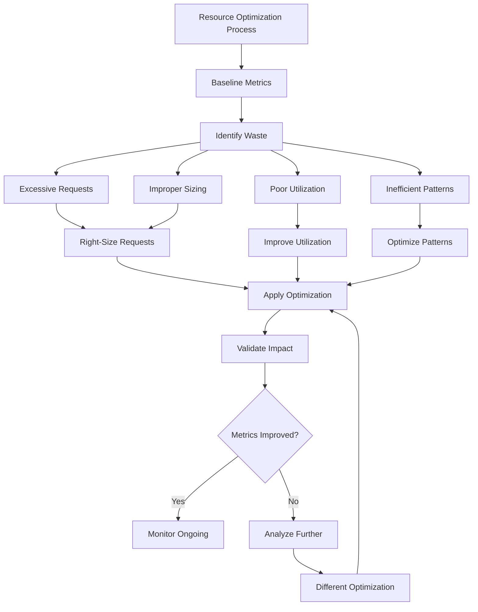

# Resource Optimization

## Overview

### What Is Resource Optimization?

Resource optimization in containerized environments involves maximizing the efficiency of computational resources—CPU, memory, storage, and network—while maintaining application performance and reliability. Effective resource optimization reduces costs, improves performance, and enhances system stability. Poor resource management causes performance degradation, application failures, and excessive costs.

Containerized microservices present unique resource optimization challenges. Applications share cluster resources. Individual services scale differently. Variable workloads cause resource waste. Multi-tenant environments create noisy neighbor problems. Understanding resource behavior enables effective optimization.

Resource optimization differs from resource conservation. Conservation reduces resource consumption regardless of impact. Optimization ensures resources support application requirements while minimizing waste. Optimized applications use resources efficiently while meeting performance targets.

### Resource Categories

Containerized applications manage several resource types:

**Compute Resources**: CPU cycles for processing. Affected by request/limit settings, pod density, and container efficiency.

**Memory Resources**: RAM for application state. Affected by heap sizing, caches, and memory leaks.

**Storage Resources**: Disk for persistence, logs, and temporary files. Affected by volume choices, retention policies, and compression.

**Network Resources**: Bandwidth for communication. Affected by connection patterns, payload sizes, and protocol efficiency.

### Optimization Approaches

Optimization occurs at multiple levels:

**Application Level**: Efficient code, appropriate data structures, caching strategies. Language-specific optimizations.

**Container Level**: Minimal images, appropriate base images, multi-stage builds. Build optimization.

**Orchestration Level**: Right-sized requests, efficient scheduling, appropriate scaling. Cluster optimization.

**Infrastructure Level**: Right-sized nodes, appropriate storage, network efficiency. Infrastructure optimization.

### Metrics and Measurement

Effective optimization requires measurement:

**Resource Metrics**: CPU utilization, memory usage, disk I/O, network throughput. Use metrics to understand baseline.

**Application Metrics**: Response times, throughput, error rates. Validate optimizations improve performance.

**Cost Metrics**: Cost per request, cost per transaction, cost per user. Measure optimization impact.

**Efficiency Metrics**: Resource per request, resource per service. Track efficiency over time.

## Flow Chart: Optimization Process



Optimization follows baseline, identify, apply, validate cycles. Each improvement requires validation. Staged improvements enable measurement.

---

## Standard Example

### Resource Configuration for Optimization

```yaml
# Kubernetes Resource Configuration

apiVersion: v1
kind: ConfigMap
metadata:
  name: resource-config
data:
  # Resource configuration
  resources.yaml: |
    product-service:
      requests:
        cpu: "100m"
        memory: "256Mi"
      limits:
        cpu: "500m"
        memory: "512Mi"
    
    order-service:
      requests:
        cpu: "200m"
        memory: "512Mi"
      limits:
        cpu: "1000m"
        memory: "1Gi"
    
    payment-service:
      requests:
        cpu: "100m"
        memory: "256Mi"
      limits:
        cpu: "200m"
        memory: "512Mi"

---
# Optimized Deployment

apiVersion: apps/v1
kind: Deployment
metadata:
  name: product-service
  namespace: production
spec:
  replicas: 3
  selector:
    matchLabels:
      app: product-service
  template:
    metadata:
      labels:
        app: product-service
    spec:
      containers:
        - name: product-service
          image: myregistry/product-service:v1.2.3
          
          # Optimized resource configuration
          resources:
            requests:
              cpu: "100m"
              memory: "256Mi"
            limits:
              cpu: "500m"
              memory: "512Mi"
          
          # Environment for memory optimization
          env:
            - name: NODE_OPTIONS
              value: "--max-old-space-size=384"
            - name: CACHE_SIZE
              value: "500"
            - name: POOL_SIZE
              value: "10"
          
          # Readiness based on actual readiness
          readinessProbe:
            httpGet:
              path: /ready
              port: 3000
            initialDelaySeconds: 5
            periodSeconds: 5
            successThreshold: 2
          
          livenessProbe:
            httpGet:
              path: /health
              port: 3000
            initialDelaySeconds: 30
            periodSeconds: 10
            failureThreshold: 3

---
# ResourceQuota

apiVersion: v1
kind: ResourceQuota
metadata:
  name: production-quota
  namespace: production
spec:
  hard:
    requests.cpu: "10"
    requests.memory: 20Gi
    limits.cpu: "20"
    limits.memory: 40Gi
    pods: "50"
    services: "10"

---
# LimitRange

apiVersion: v1
kind: LimitRange
metadata:
  name: production-limits
  namespace: production
spec:
  limits:
    - type: Container
      default:
        cpu: "250m"
        memory: "256Mi"
      defaultRequest:
        cpu: "50m"
        memory: "128Mi"
      max:
        cpu: "4"
        memory: "8Gi"
      min:
        cpu: "10m"
        memory: "64Mi"
    - type: Pod
      max:
        cpu: "8"
        memory: "16Gi"
      min:
        cpu: "10m"
        memory: "64Mi"
```

### Multi-Container Optimization

```yaml
# Optimized Multi-Container Pod

apiVersion: v1
kind: Pod
metadata:
  name: optimized-pod
  labels:
    app: optimized-service
spec:
  containers:
    # Main container - optimized
    - name: main
      image: myregistry/service:v1.0.0
      resources:
        requests:
          cpu: "50m"
          memory: "128Mi"
        limits:
          cpu: "200m"
          memory: "256Mi"
      # Shared memory volume for IPC
      volumeMounts:
        - name: shared
          mountPath: /dev/shm
    
    # Sidecar - optimized
    - name: sidecar
      image: myregistry/sidecar:v1.0.0
      resources:
        requests:
          cpu: "10m"
          memory: "32Mi"
        limits:
          cpu: "50m"
          memory: "64Mi"
      # Shared memory IPC
      volumeMounts:
        - name: shared
          mountPath: /dev/shm
  
  # Shared memory for IPC
  volumes:
    - name: shared
      emptyDir:
        medium: Memory
        sizeLimit: 64Mi
```

### Code Explanation

The configurations demonstrate key optimization principles:

**CPU Requests**: Set requests for scheduling efficiency. Lower requests increase scheduling flexibility. Match actual usage, not peak requirements.

**Memory Limits**: Memory is non-compressible. Limits prevent OOM kills. Set limits for actual plus headroom.

**Readiness Delay**: Initial delay based on startup time. Don't start too early, don't wait too long.

**LimitRange**: Defaults for unspecified containers. Prevents unsized containers. Enforces minimum requests.

**Shared Memory**: Shared memory enables efficient IPC without networking. Reduces network overhead.

---

## Real-World Example 1: Autoscaling Optimization

### Horizontal Pod Autoscaling

```yaml
# Kubernetes HPA - Intelligent Scaling

apiVersion: autoscaling/v2
kind: HorizontalPodAutoscaler
metadata:
  name: product-service-hpa
  namespace: production
spec:
  scaleTargetRef:
    apiVersion: apps/v1
    kind: Deployment
    name: product-service
  minReplicas: 3
  maxReplicas: 20
  
  # Multiple metrics for intelligent scaling
  metrics:
    # CPU metric
    - type: Resource
      resource:
        name: cpu
        target:
          type: Utilization
          averageUtilization: 70
    
    # Memory metric
    - type: Resource
      resource:
        name: memory
        target:
          type: Utilization
          averageUtilization: 80
    
    # Custom metric - requests per second
    - type: Pods
      pods:
        metric:
          name: http_requests_per_second
        target:
          type: AverageValue
          averageValue: "100"
    
    # Custom metric - queue depth
    - type: Pods
      pods:
        metric:
          name: queue_depth
        target:
          type: AverageValue
          averageValue: "50"
  
  # Scaling behavior
  behavior:
    # Scale up quickly
    scaleUp:
      stabilizationWindowSeconds: 0
      policies:
        - type: Percent
          value: 100
          periodSeconds: 15
        - type: Pods
          value: 4
          periodSeconds: 15
      selectPolicy: Max
    
    # Scale down slowly
    scaleDown:
      stabilizationWindowSeconds: 300
      policies:
        - type: Percent
          value: 10
          periodSeconds: 60
        - type: Pods
          value: 2
          periodSeconds: 60
      selectPolicy: Min
```

### Vertical Pod Autoscaling

```yaml
# Vertical Pod Autoscaler

apiVersion: autoscaling.k8s.io/v1
kind: VerticalPodAutoscaler
metadata:
  name: product-service-vpa
  namespace: production
spec:
  targetRef:
    apiVersion: "apps/v1"
    kind: Deployment
    name: product-service
  updatePolicy:
    updateMode: Auto
  resourcePolicy:
    containerPolicies:
      - containerName: product-service
        minAllowed:
          cpu: "25m"
          memory: "64Mi"
        maxAllowed:
          cpu: "2"
          memory: "4Gi"
        controlledResources:
          - cpu
          - memory
```

### Autoscaling Patterns

Autoscaling optimization ensures efficient resource use:

**HPA**: Adds/removes replicas based on load. Scales quickly for demand increases. Scales slowly to prevent flapping.

**VPA**: Adjusts resource requests based on usage. Right-sizes requests automatically. Requires proper HPA for replicas.

**Cluster Autoscaler**: Adds/removes nodes based on demand. Combines with pod autoscaling. Keeps costs aligned with usage.

---

## Real-World Example 2: Image Optimization

### Minimal Images

```dockerfile
# Multi-stage Build - Optimized Image

# Build stage - full tools
FROM golang:1.21-alpine AS builder

# Install build tools
RUN apk add --no-cache gcc musl-dev

WORKDIR /build

# Copy go mod files first (layer caching)
COPY go.mod go.sum ./
RUN go mod download

# Copy source
COPY . .

# Build binary
RUN CGO_ENABLED=1 go build -o /app main.go

# Final stage - minimal runtime
FROM alpine:3.18

# Install CA certificates for HTTPS
RUN apk add --no-cache ca-certificates

# Create non-root user
RUN adduser -u 1001 -S appuser

WORKDIR /app

# Copy only the binary
COPY --from=builder /app .

# Switch to non-root
USER appuser

# Entry point
CMD ["./main"]
```

### Distroless Images

```dockerfile
# Distroless Image - Maximum Minimal

# Build stage
FROM golang:1.21-alpine AS builder

WORKDIR /build
COPY . .
RUN CGO_ENABLED=0 go build -o app main.go

# Final distroless image
FROM gcr.io/distroless/static:nonroot

# Copy binary
COPY --from=builder /build/app /

# Execute directly
USER nonroot
ENTRYPOINT ["./app"]
```

### Image Size Impact

Image optimization significantly impacts resource usage:

**Multi-stage Builds**: Copy only runtime dependencies. Remove build tools. Smaller images, faster deployments.

**Distroless Base**: Minimal OS, no package manager. Tiny images. Reduced attack surface.

**Layer Optimization**: Package installation early. Source changes late. Maximum cache hits.

---

## Best Practices

### CPU Optimization

**CPU Requests**: Start low, increase based on measurement. Affects scheduling.

**CPU Limits**: Set limits for burst handling. Without limits, risk noisy neighbors.

**CPU Affinity**: Use Kubernetes topology hints. Pin performance-critical workloads.

**Process Efficiency**: Profile applications. Optimize hotspots. Use efficient libraries.

### Memory Optimization

**Memory Requests**: Set based on actual usage. Under-requesting causes OOM.

**Memory Limits**: Set for actual + headroom. Memory is non-compressible.

**Heap Sizing**: JVM: Setting max heap. Node.js: max-old-space-size. Avoids OOM kills.

**Caching**: Size caches appropriately. Memory vs. performance trade-offs.

**Leak Detection**: Monitor memory over time. Detect leaks before impact.

### Storage Optimization

**Volume Type**: SSD for performance, HDD for capacity. Use appropriate types.

**Logging**: Structured logging, JSON format. Rotate logs. Implement retention.

**Ephemeral Storage**: Use emptyDir for temp data. Set size limits.

**Persistence**: Appropriate retention. Compress old data. Archive to object storage.

### Network Optimization

**Protocol**: Use HTTP/2 or HTTP/3. Multiplex connections.

**Payload**: Compress requests. Appropriate content encoding.

**Connection Reuse**: Keep-alive connections. Connection pooling.

**Caching**: Cache at appropriate layers. Reduce redundant requests.

### Cost Optimization

**Right-Sizing**: Measure actual usage. Adjust resources accordingly.

**Savings Plans**: Use reserved instances for baseline. On-demand for peaks.

**Spot Instances**: Use spot for fault-tolerant workloads. Significant savings.

**Scheduling**: Schedule non-critical workloads during off-peak. Utilize savings.

---

## Additional Resources

### Learning Resource Optimization

**Tools**:
- Goldpinger for debugging
- Parca for profiling
- Kepler for cost measurement

**Documentation**:
- Kubernetes resource management
- Autoscaling documentation

**Metrics**:
- Prometheus node exporter
- kube-state-metrics

### Optimization Process

1. **Baseline**: Measure current resources and usage patterns to establish a reference point
2. **Analyze**: Identify inefficiencies and bottlenecks in current configurations
3. **Optimize**: Apply targeted optimizations addressing specific issues
4. **Validate**: Measure improvement impact and iterate as needed
5. **Monitor**: Continuous monitoring for ongoing optimization opportunities