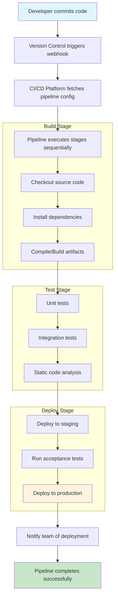

# Pipeline as Code

## Overview

Pipeline as Code (PaC) is a methodology where the continuous integration and continuous deployment (CI/CD) pipeline configuration is defined in code rather than through manual configuration or graphical user interfaces. This approach treats pipeline definitions as first-class software artifacts, enabling version control, code review, and automated testing of the pipeline itself.

The concept emerged from the need to treat infrastructure and automation code with the same rigor as application code. Just as we version control application source code, pipeline as code allows teams to track changes to their deployment workflows, collaborate on pipeline improvements, and maintain a single source of truth for how software moves from development to production.

In modern DevOps practices, Pipeline as Code has become essential because it addresses several critical challenges. Manual pipeline configuration creates visibility issues, makes troubleshooting difficult, and creates drift between environments. When pipelines are defined as code, they become reproducible, auditable, and easier to maintain. Teams can also apply software engineering best practices like modular design, code review, and automated testing to their pipeline definitions.

The adoption of Pipeline as Code typically involves using domain-specific languages or configuration formats such as YAML, Groovy, or JSON. Popular CI/CD platforms that support this approach include Jenkins (with Jenkinsfile), GitLab CI (with .gitlab-ci.yml), GitHub Actions (with workflow YAML files), Azure Pipelines (with azure-pipelines.yml), and CircleCI (with config.yml). Each platform has its own syntax and conventions, but the fundamental principles remain consistent across implementations.

One of the key benefits of Pipeline as Code is the ability to store pipeline definitions in the same repository as the application code. This creates a tight feedback loop where changes to the application and its deployment pipeline can be reviewed together, tested together, and deployed together. When a developer modifies both the application code and the pipeline configuration, both changes can be validated in the same pull request.

The practice also enables pipeline modularization and reusability. Teams can create shared library functions that define common build steps, testing procedures, or deployment strategies. These shared components can be versioned and reused across multiple projects, ensuring consistency while reducing duplication. This approach scales well in enterprise environments where dozens or hundreds of applications need to follow standardized deployment procedures.

## Flow Chart



## Standard Example

```yaml
# .gitlab-ci.yml - GitLab CI/CD Pipeline Configuration
# This file defines the complete CI/CD pipeline for the application

variables:
  # Docker configuration
  DOCKER_REGISTRY: "registry.example.com"
  DOCKER_IMAGE_TAG: $CI_COMMIT_SHORT_SHA
  
  # Application configuration
  APP_NAME: "microservice-api"
  ENVIRONMENT: "staging"

# Define stages in execution order
stages:
  - build
  - test
  - deploy

# Cache dependencies to speed up pipeline execution
cache:
  key: ${CI_COMMIT_REF_SLUG}
  paths:
    - node_modules/
    - .npm/

# Default configuration for all jobs
default:
  image: node:20-alpine
  before_script:
    - echo "Starting pipeline for ${CI_PROJECT_NAME}"
    - npm ci --prefer-offline

# Build stage - create Docker image
build:
  stage: build
  script:
    - echo "Building application..."
    - npm run build
    - docker build -t ${APP_NAME}:${DOCKER_IMAGE_TAG} .
    - docker tag ${APP_NAME}:${DOCKER_IMAGE_TAG} ${DOCKER_REGISTRY}/${APP_NAME}:latest
  artifacts:
    paths:
      - dist/
      - coverage/
    expire_in: 1 week
  only:
    - main
    - develop
    - tags

# Test stage - multiple test jobs run in parallel
unit-tests:
  stage: test
  script:
    - echo "Running unit tests..."
    - npm run test:unit -- --coverage
  coverage: '/Coverage: \d+\.\d+%/'
  artifacts:
    reports:
      junit: test-results/junit.xml
      coverage_report:
        coverage_format: cobertura
        path: coverage/cobertura-coverage.xml
  only:
    - main
    - develop
    - merge_requests

integration-tests:
  stage: test
  services:
    - postgres:15
    - redis:7
  variables:
    POSTGRES_DB: test_db
    POSTGRES_USER: test_user
    POSTGRES_PASSWORD: test_password
  script:
    - echo "Running integration tests..."
    - npm run test:integration
  only:
    - main
    - develop

linting:
  stage: test
  script:
    - echo "Running static analysis..."
    - npm run lint
    - npm run typecheck
  allow_failure: false

security-scan:
  stage: test
  image: aquasec/trivy:latest
  script:
    - echo "Scanning for vulnerabilities..."
    - trivy image --severity HIGH,CRITICAL ${APP_NAME}:${DOCKER_IMAGE_TAG}
  allow_failure: true

# Deploy to staging environment
deploy-staging:
  stage: deploy
  image: bitnami/kubectl:latest
  environment:
    name: staging
    url: https://staging.example.com
    on_stop: stop-staging
  script:
    - echo "Deploying to staging..."
    - kubectl config use-context staging-cluster
    - kubectl set image deployment/${APP_NAME} app=${DOCKER_REGISTRY}/${APP_NAME}:${DOCKER_IMAGE_TAG}
    - kubectl rollout status deployment/${APP_NAME} --timeout=300s
  only:
    - develop

# Manual approval required for production deployment
deploy-production:
  stage: deploy
  image: bitnami/kubectl:latest
  environment:
    name: production
    url: https://production.example.com
  script:
    - echo "Deploying to production..."
    - kubectl config use-context production-cluster
    - kubectl set image deployment/${APP_NAME} app=${DOCKER_REGISTRY}/${APP_NAME}:${DOCKER_IMAGE_TAG}
    - kubectl rollout status deployment/${APP_NAME} --timeout=300s
  when: manual
  only:
    - main
  needs:
    - job: deploy-staging
      artifacts: false

# Cleanup staging environment
stop-staging:
  stage: deploy
  image: bitnami/kubectl:latest
  environment:
    name: staging
    action: stop
  script:
    - echo "Cleaning up staging environment..."
    - kubectl config use-context staging-cluster
    - kubectl delete deployment ${APP_NAME}
  when: manual
  only:
    - develop
```

## Real-World Examples

### Example 1: Jenkins Pipeline for Java Application

In enterprise environments, Jenkins remains widely used. A Java microservices project might use a Jenkinsfile written in Groovy to define a sophisticated pipeline with parallel testing, artifact publishing, and multi-environment deployments. The pipeline would typically include stages for compiling code with Maven or Gradle, running unit tests with JaCoCo coverage reporting, performing static analysis with SonarQube, building Docker images, and deploying to various Kubernetes namespaces with proper approval gates.

### Example 2: GitHub Actions for Node.js Microservice

A Node.js team might use GitHub Actions to create a workflow that triggers on pull requests to run linting and unit tests, then on push to main to build and deploy. The workflow would utilize matrix strategy to test against multiple Node.js versions, publish test results as comments on pull requests, and use environment protection rules to require approvals before production deployment. Integration with GitHub's dependency scanning provides automatic vulnerability alerts.

### Example 3: Azure DevOps for .NET Core Application

A .NET Core application in Azure DevOps would use azure-pipelines.yml to define a pipeline that builds on multiple platforms, runs .NET Core-specific tests, publishes code coverage to Azure Pipelines, and deploys to Azure Kubernetes Service. The pipeline would include conditions to skip deployment for documentation-only changes and use templates to share common pipeline logic across multiple applications in the organization.

### Example 4: GitLab CI for Python Data Pipeline

A data engineering team might use GitLab CI to orchestrate a pipeline that extracts data from multiple sources, runs transformations using Python and Apache Spark, loads results into a data warehouse, and runs validation queries. The pipeline would include scheduled pipelines for recurring jobs, use cache to speed up Python environment setup, and integrate with dbt for data transformation testing.

### Example 5: CircleCI for React Frontend

A frontend team using CircleCI would configure their pipeline to run build, test, and deployment for a React application. The configuration would use orbs (reusable packages) for common tasks like browser testing with Cypress, deployment to AWS S3 and CloudFront, and integration with Lighthouse CI for performance auditing. The pipeline would also include visual regression testing to catch UI changes before production deployment.

## Output Statement

Pipeline as Code transforms CI/CD workflows from fragile, manual configurations into versioned, auditable, and testable software artifacts. By defining pipelines in code, teams gain the ability to apply software engineering best practices to their deployment processes, including code review, modular design, and automated testing. This approach improves collaboration, reduces errors, and accelerates delivery cycles. The key success factors include starting with simple pipelines, gradually adding complexity, investing in pipeline testing infrastructure, and establishing governance for enterprise-scale implementations.

## Best Practices

1. **Store pipeline configuration in version control**: Always keep pipeline definitions in the same repository as the application code or in a dedicated infrastructure repository. This ensures pipeline changes are reviewed, versioned, and traceable alongside application changes.

2. **Use modular and reusable components**: Create shared libraries or templates for common pipeline tasks. This reduces duplication, ensures consistency across projects, and makes pipeline maintenance easier.

3. **Implement proper error handling and notifications**: Configure pipelines to send notifications on failure through appropriate channels (Slack, email, PagerDuty). Include retry logic for transient failures and proper error messages for debugging.

4. **Secure sensitive information**: Never hardcode secrets in pipeline files. Use secrets management tools provided by the CI/CD platform or external solutions like HashiCorp Vault. Ensure proper access controls on sensitive pipeline configurations.

5. **Optimize pipeline performance**: Use caching for dependencies, run independent jobs in parallel, and configure appropriate timeout values. Regularly analyze pipeline execution times and identify bottlenecks.

6. **Test pipelines thoroughly**: Apply the same testing rigor to pipeline code as application code. Use pipeline validation tools, dry-run features, and maintain test coverage for pipeline logic.

7. **Document pipeline behavior**: Include comments in pipeline files explaining the purpose of each stage and job. Maintain external documentation for overall pipeline architecture and troubleshooting guides.

8. **Implement proper versioning and tagging**: Use semantic versioning for pipeline templates and tag releases appropriately. This helps track changes and enables rollback when issues are discovered.

9. **Configure appropriate approval gates**: For production deployments, require manual approvals and implement role-based access controls. Log all approval actions for audit purposes.

10. **Monitor and measure pipeline health**: Track key metrics like build success rate, execution time, and queue time. Use these metrics to identify improvement opportunities and prevent pipeline degradation over time.