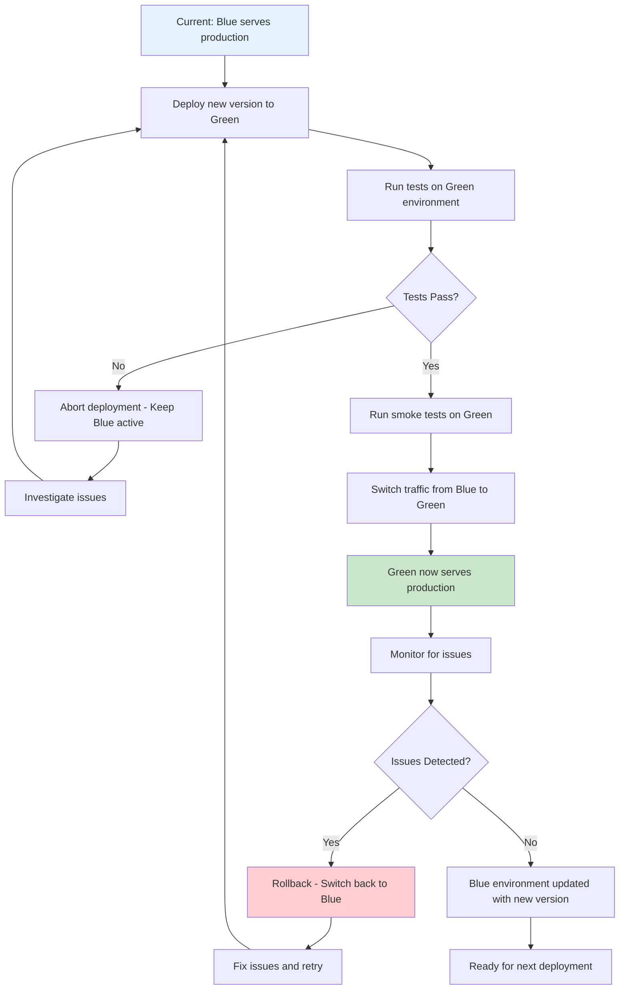

# Blue-Green Deployment

## Overview

Blue-Green Deployment is a release management strategy that reduces downtime and risk by maintaining two identical production environments. At any given time, one environment (Blue) serves production traffic while the other (Green) remains idle for the next deployment. When a new version is ready, it is deployed to the idle environment, tested, and then the traffic is switched from Blue to Green. This approach enables instant rollback if issues are detected, as the previous version remains available in the other environment.

The concept originated from the need to achieve zero-downtime deployments in enterprise software systems. Traditional deployment approaches often required scheduled maintenance windows where applications were unavailable. Blue-Green deployment solves this by keeping two complete environments running in parallel, allowing production traffic to switch between them instantaneously. This strategy has become a cornerstone of modern DevOps practices, particularly for applications that require high availability and cannot tolerate service interruptions.

The implementation of Blue-Green deployment requires careful infrastructure planning. Both environments must be identical in terms of configuration, scaling, and network setup. This includes database configuration, message queues, load balancers, and any external service integrations. The environments should be isolated enough to prevent interference between versions while remaining similar enough to ensure that behavior in one environment accurately predicts behavior in the other.

One of the significant advantages of Blue-Green deployment is the ability to perform complete end-to-end testing on the new version in a production-like environment before redirecting user traffic. Since the Green environment is identical to the current production environment, any testing performed there provides realistic results. This testing capability significantly reduces the risk of deploying faulty code to production.

The traffic switch itself can be implemented at different levels depending on the infrastructure. For web applications, this typically involves updating the load balancer or reverse proxy configuration to point to the new environment. For microservices, this might involve updating service discovery or using a service mesh to route traffic. Some organizations use DNS-based switching with shortened TTL values to ensure quick propagation of changes.

Post-deployment, the previous Blue environment remains available as a rollback option. If issues are discovered after the switch, traffic can be immediately redirected back to the Blue environment, restoring the previous version within seconds. After a successful deployment and a monitoring period, the old environment can be updated with the new version for the next deployment cycle.

## Flow Chart



## Standard Example

```yaml
# Kubernetes Blue-Green Deployment Configuration
# This example demonstrates a complete blue-green deployment setup

---
# Production Service - Initially routes to Blue
apiVersion: v1
kind: Service
metadata:
  name: production-service
  labels:
    app: myapp
spec:
  type: LoadBalancer
  selector:
    # This label selector determines which pods receive traffic
    version: blue
  ports:
    - protocol: TCP
      port: 80
      targetPort: 8080

---
# Blue Deployment (Current Production)
apiVersion: apps/v1
kind: Deployment
metadata:
  name: myapp-blue
spec:
  replicas: 3
  strategy:
    type: Recreate  # Recreate ensures clean transition
  selector:
    matchLabels:
      app: myapp
      version: blue
  template:
    metadata:
      labels:
        app: myapp
        version: blue
    spec:
      containers:
      - name: myapp
        image: myapp:1.0.0
        ports:
        - containerPort: 8080
        env:
        - name: ENVIRONMENT
          value: "production"
        - name: VERSION
          value: "blue"
        resources:
          requests:
            memory: "256Mi"
            cpu: "100m"
          limits:
            memory: "512Mi"
            cpu: "500m"
        livenessProbe:
          httpGet:
            path: /health
            port: 8080
          initialDelaySeconds: 30
          periodSeconds: 10
        readinessProbe:
          httpGet:
            path: /ready
            port: 8080
          initialDelaySeconds: 5
          periodSeconds: 5

---
# Green Deployment (New Version - Initially at 0 replicas)
apiVersion: apps/v1
kind: Deployment
metadata:
  name: myapp-green
spec:
  replicas: 3
  strategy:
    type: Recreate
  selector:
    matchLabels:
      app: myapp
      version: green
  template:
    metadata:
      labels:
        app: myapp
        version: green
    spec:
      containers:
      - name: myapp
        image: myapp:2.0.0
        ports:
        - containerPort: 8080
        env:
        - name: ENVIRONMENT
          value: "production"
        - name: VERSION
          value: "green"
        resources:
          requests:
            memory: "256Mi"
            cpu: "100m"
          limits:
            memory: "512Mi"
            cpu: "500m"
        livenessProbe:
          httpGet:
            path: /health
            port: 8080
          initialDelaySeconds: 30
          periodSeconds: 10
        readinessProbe:
          httpGet:
            path: /ready
            port: 8080
          initialDelaySeconds: 5
          periodSeconds: 5
```

```bash
#!/bin/bash
# blue-green-deployment.sh - Script to perform blue-green deployment

set -e

APP_NAME="myapp"
NAMESPACE="production"
BLUE_VERSION="1.0.0"
GREEN_VERSION="2.0.0"

echo "=== Starting Blue-Green Deployment ==="

# Step 1: Deploy new version to green environment
echo "Deploying version ${GREEN_VERSION} to green environment..."
kubectl set image deployment/myapp-green myapp=myapp:${GREEN_VERSION} -n ${NAMESPACE}

# Step 2: Wait for green deployment to complete
echo "Waiting for green deployment to be ready..."
kubectl rollout status deployment/myapp-green -n ${NAMESPACE} --timeout=300s

# Step 3: Run pre-switch validation tests
echo "Running validation tests on green environment..."
kubectl run validation-test-${RANDOM} \
    --image=curlimages/curl:latest \
    --restart=Never \
    --rm -it -- \
    sh -c "curl -f http://myapp-green-service/health || exit 1"

# Step 4: Switch traffic from blue to green
echo "Switching traffic to green environment..."
kubectl patch service production-service -n ${NAMESPACE} \
    -p '{"spec":{"selector":{"version":"green"}}}'

# Step 5: Verify traffic switch
echo "Verifying traffic switch..."
sleep 5
kubectl get pods -n ${NAMESPACE} -l app=${APP_NAME},version=green
curl -s http://production-service/health

# Step 6: Monitor for issues (canary period)
echo "Monitoring for 5 minutes..."
sleep 300

# Step 7: If successful, update blue deployment for next cycle
echo "Updating blue deployment with new version for next cycle..."
kubectl set image deployment/myapp-blue myapp=myapp:${GREEN_VERSION} -n ${NAMESPACE}

echo "=== Blue-Green Deployment Complete ==="
```

## Real-World Examples

### Example 1: AWS Elastic Beanstalk Blue-Green

In AWS environments, Elastic Beanstalk provides built-in blue-green deployment capabilities. A team deploying a Node.js application would use the Elastic Beanstalk console or CLI to create a new environment (the green environment), deploy the new version there, and then swap the environment URLs to switch traffic. This approach leverages AWS's infrastructure and automatically handles load balancer configuration, auto-scaling groups, and database connections. The previous environment remains available for rollback until manually terminated.

### Example 2: Kubernetes with Ingress Controller

A team using Kubernetes with an Ingress controller (like nginx-ingress) would implement blue-green deployment by creating two deployments with distinct version labels and configuring the Ingress to route traffic based on the version selector. When ready to switch, they update the Ingress resource to point to the new version's pods. This approach provides fine-grained control over traffic routing and supports canary testing by gradually shifting a percentage of traffic before full migration.

### Example 3: Database Schema Changes in Blue-Green

For applications requiring database schema changes, blue-green deployment requires additional consideration. The team would first apply schema changes to a copy of the production database, verify compatibility with both old and new application versions, deploy the new application to the green environment, and then switch traffic. Both application versions must be compatible with the new schema, or a more sophisticated migration strategy using feature flags is needed.

### Example 4: Azure App Service Deployment Slots

Azure App Service provides deployment slots that implement blue-green patterns natively. A team would create a staging slot, deploy the new version there, test thoroughly, and then swap the staging and production slots. Azure automatically handles the DNS switch and warms up the new slot before making it active. This approach is particularly suited for web applications and APIs running on Azure's platform as a service offerings.

### Example 5: Multi-Region Blue-Green with Terraform

Enterprise deployments spanning multiple geographic regions would use Terraform to provision identical infrastructure in both primary and secondary regions. Traffic routing uses global load balancers (like AWS Global Accelerator or CloudFlare), and the team maintains parallel deployments in both regions. During deployment, they update both regions sequentially while maintaining geographic failover capabilities. This approach provides both zero-downtime deployment and disaster recovery in a single implementation.

## Output Statement

Blue-Green deployment provides a reliable mechanism for achieving zero-downtime releases with instant rollback capability. By maintaining two identical production environments, teams can fully test new versions in production-like conditions before exposing users, and rapidly revert to the previous version if issues arise. The strategy requires upfront investment in infrastructure duplication but pays dividends through reduced risk, improved confidence in deployments, and elimination of maintenance windows. Success depends on maintaining environment parity, implementing proper traffic switching mechanisms, and establishing clear rollback procedures.

## Best Practices

1. **Maintain environment parity**: Ensure both blue and green environments are identical in configuration, infrastructure, and data. Any differences can cause issues that only manifest after the traffic switch. Use infrastructure as code to guarantee consistency.

2. **Implement comprehensive testing in the idle environment**: Run full test suites, including integration and performance tests, against the new environment before switching traffic. The test results should be the primary decision criteria for proceeding with the switch.

3. **Use automated traffic switching**: Automate the traffic switch process through scripts or CI/CD pipelines to eliminate human error. Ensure the switch is idempotent and can be safely executed multiple times if needed.

4. **Configure appropriate monitoring and alerting**: Implement monitoring that can distinguish between blue and green environments. Set up alerts specifically for the post-deployment period to detect issues quickly.

5. **Plan for database and stateful components**: Database changes require special consideration. Ensure schema changes are backward compatible, or use database migration strategies that work with blue-green patterns.

6. **Set appropriate rollback triggers**: Define clear criteria for triggering rollback (error rates, latency increases, specific error types). Automate rollback when critical thresholds are exceeded.

7. **Consider data synchronization requirements**: If the application uses databases or caches, plan for how data created during the switch period is handled. Ensure both environments can access consistent data.

8. **Document the rollback procedure**: Make sure the team knows exactly how to rollback if issues occur. Practice rollback procedures regularly in non-production environments.

9. **Use short TTL for DNS records**: If using DNS-based switching, configure short TTL values to ensure quick propagation. Consider using header-based or cookie-based routing for more control.

10. **Schedule appropriate monitoring period**: Keep the old environment running long enough to detect delayed issues. A typical monitoring period ranges from 30 minutes to several hours depending on the application's error patterns.